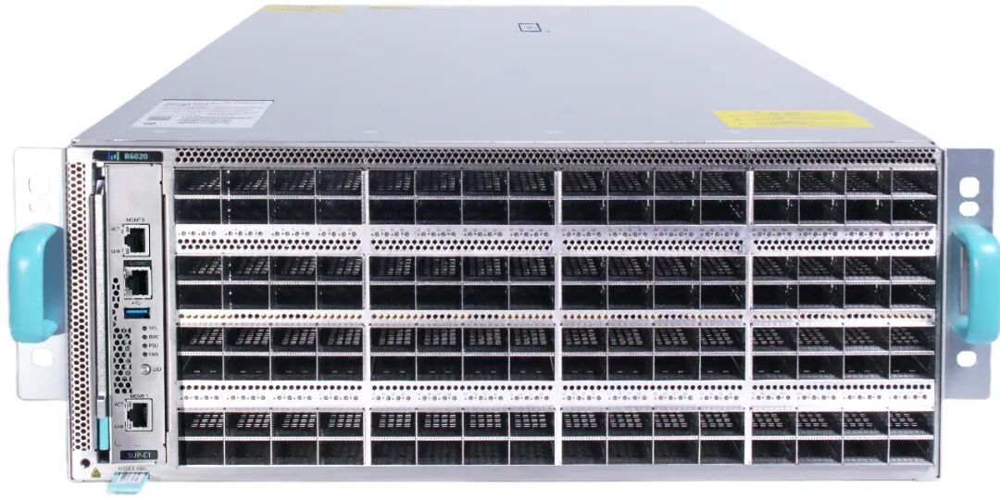
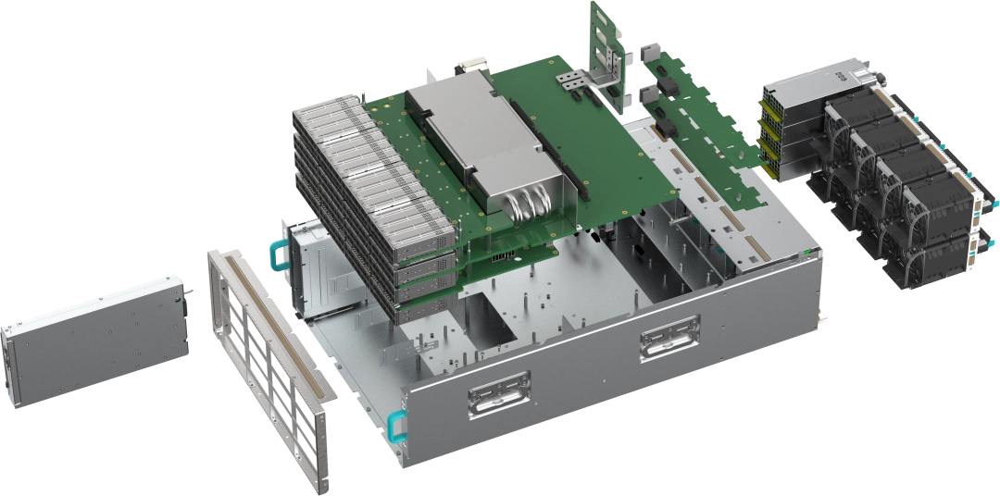
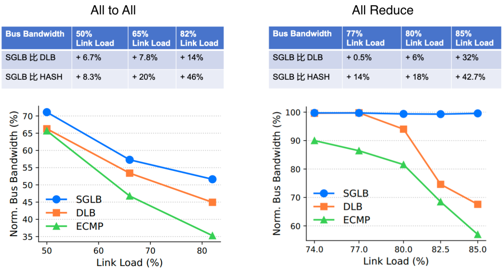
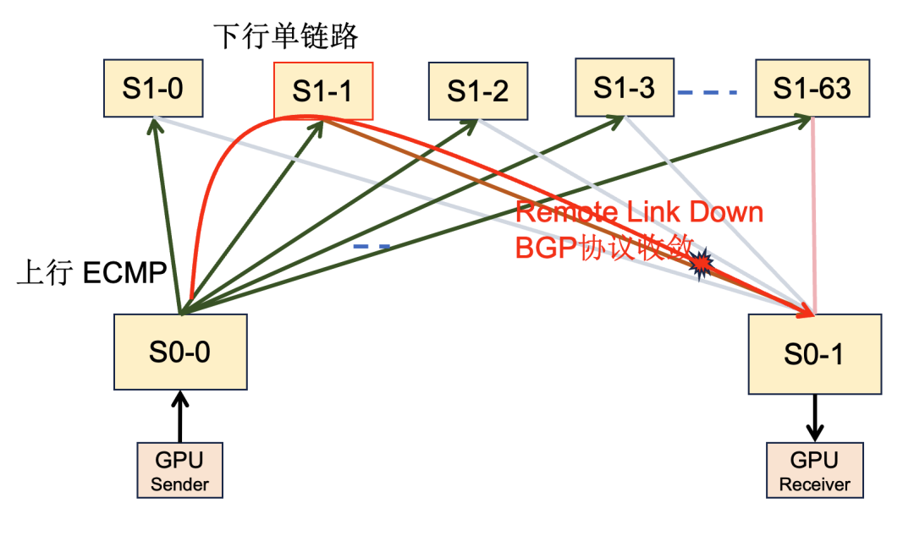
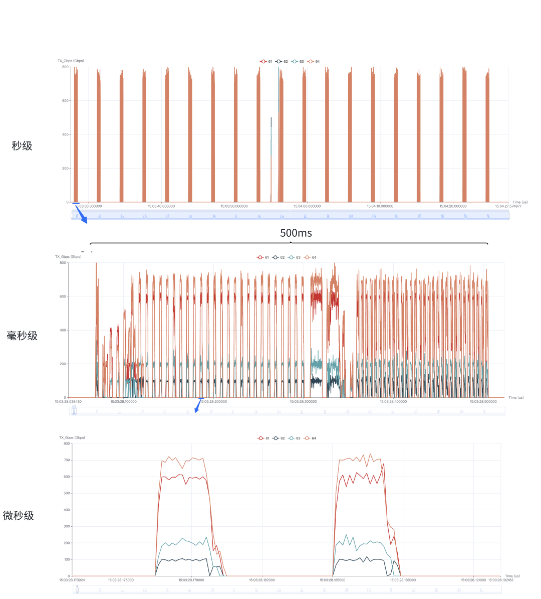
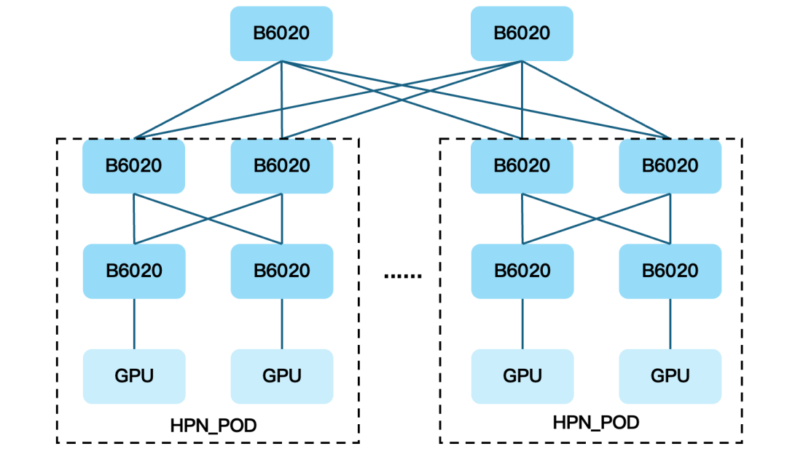
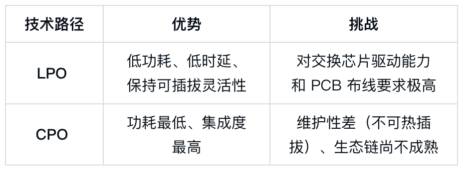

# 扒一扒字节跳动自研的102.4T交换机

> 原文链接：[扒一扒字节跳动自研的102.4T交换机](https://mp.weixin.qq.com/s?__biz=Mzg5NzY3NDUyMw==&mid=2247539981&idx=1&sn=0cab0570d48b28bf273f5b9bc7e95fb0&chksm=c1945a32ded9fe8799334ed64e2e874b08be055a53e868586791bcfb666ce7ab06084f91106d&mpshare=1&scene=1&srcid=0205PZBQsrpxkx3sOvM6oASQ&sharer_shareinfo=dd515121c6c1fff518f2f46aab95600b&sharer_shareinfo_first=dd515121c6c1fff518f2f46aab95600b#rd)

当AI大模型进入十万卡级训练时代，网络从辅助管道变成了核心生产力。2026 年 2 月，字节跳动旗下火山引擎正式发布了102.4T 自研交换机及其配套的AI网络架构（HPN 6.0）。

技术拆解

字节的交换机完全围绕AI场景设计，核心亮点集中在实用化突破。

1. 硬件

核心特性如下：

全端口 LPO 支持：实现低时延、低功耗、低成本，兼顾性能、稳定与成本。

高速系统设计：使用 3 层扣板架构，在 4U 空间实现了 128 个 800G OSFP 端口。高速系统首创 SerDes PCB RDL 设计，MAC 板仅为 36 层，结合 M8N+M7 叠层，实现了小于 20dB 的 Bump-Bump 损耗 ，在无 Cable 和 PHY 的条件下极致支持 800G LPO。

结构与装配：创新的板载定位与多级导向精准装配方案大幅提升了组装效率。通过优化连接器同向布局释放容差能力，累计公差减少 50%。

风冷散热：为应对单芯片超过 1600 W 的散热压力，散热器融合了非牛顿流体材料、石墨烯导热材料与强化毛细结构，并配合系统级定向风场设计，最终实现 40℃ 环温下 1800m 海拔满配稳定运行。

超大尺寸芯片焊接：通过仿真和推导热形变数据，在板图设计与生产中实现精确热补偿，成功攻克超大尺寸芯片的 SMT 焊接难题，目前焊接良率达到 100%。

模块化与成本效益：机电结构、管理板等核心部件复用上一代成熟设计，仅需更换端口板即可适配不同应用需求，显著降低后续升级与维护成本。

2. 软件

硬件只是基础，真正面向AI网络需求的价值还体现在软硬件协同设计，字节的Lambda OS支持：

SGLB（可扩展全局负载均衡）：针对AI训练中的“大象流”导致的网络拥塞，SGLB能实现微秒级链路感知和全局最优路径调度，将GPU集群的网络带宽利用率提升高达40%。

SyncMesh（微秒级路由收敛协议）：在链路故障时，业界通过协议优化，通常能实现秒级收敛。例如，AWS 在 re：Invent 2024 上介绍其自研的 SIDR 协议，将路由收敛时间从 10s 优化至 1s。而火山引擎自研的SyncMesh路由协议通过硬件卸载，将收敛时间缩短至50微秒，提升5个数量级，极大减少了训练任务的中断。

微秒级可视化监控：HFT（高频遥测）支持对全量端口带宽、队列长度等多个统计指标进行微秒级监控，解决了传统秒级监控难以观测和分析业务流量细节的问题。

3. 架构

火山引擎提出了面向未来的HPN 6.0网络架构，具备三大能力：

超大规模演进：采用三层Clos架构，单POD可支持高达65K颗GPU的规模组网，并具备线性扩展至百万卡级的能力。

训推一体融合：支持 200G/400G/800G RDMA NIC 的混速组网，并针对不同速率、不同代际 GPU 间的带宽不对等与通信模式差异引入了创新优化方案。此外，提供算子级与任务级双粒度 QoS 能力，满足训练与推理混合部署的复杂需求。

确定性稳定：通过多平面容灾架构与芯片级 Fast Failover 能力，实现微秒级故障收敛。同时，结合微秒级流量可视化与亿万分之一丢包级别的可感知能力，构建高确定性网络，确保长周期AI训练任务的稳定。

多维分析

技术路线取舍：为何押注LPO而非CPO？

在 102.4T 这一节点上，行业面临着 LPO（线性驱动）与 CPO（共封装光学）的路线抉择。

当前博通等芯片商已推出 CPO，处于试点阶段。字节跳动选择全端口支持 LPO是在性能提升与可维护性之间寻找平衡。其模块化设计也为后续升级CPO预留了空间。

生态博弈：以太网阵营的“去 IB 化”

长期以来，英伟达的 InfiniBand（IB）凭借其确定性优势统治了高性能网络。然而，以太网阵营（包括 UEC 联盟）正在通过自研协议和高性能硬件发起反击。字节跳动的 HPN 6.0 架构，本质上是在尝试用“开放的以太网硬件 + 深度自研的私有协议”来重塑 IB 的体验。这种策略的优势在于：

成本自主：摆脱英伟达昂贵的私有协议授权和硬件溢价。

运维自主：互联网大厂拥有全球最大的 SONiC（开源网络操作系统）运维经验，自研交换机能更好地融入其现有的自动化运维体系。

迭代自主：能够根据自身大模型训练的特定通信模式（如 All-Reduce, All-to-All）进行针对性优化。

结语

互联网厂商的自研交换机本质上都是对传统设备商主导的封闭生态的突破，让网络硬件精准匹配自身核心业务的真实需求。或许，未来的 AI 网络将不再有标准的“黑盒”设备，取而代之的是深度定制的、软硬一体的“白盒”系统。

【投稿】：**[SDNLAB原创文章奖励计划](https://mp.weixin.qq.com/s?__biz=Mzg5NzY3NDUyMw==&mid=2247535856&idx=1&sn=62cc3fa2d19887c749c278fe55136ad8&scene=21#wechat_redirect)**

