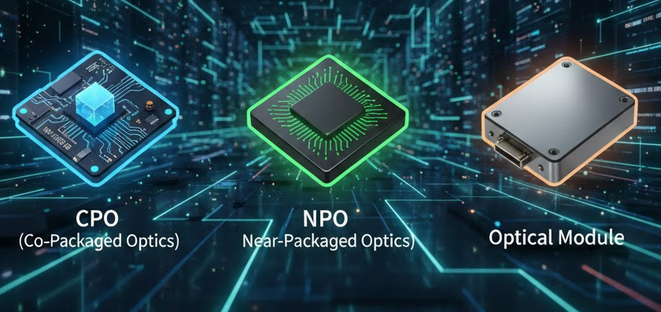
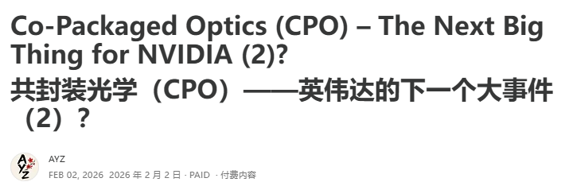
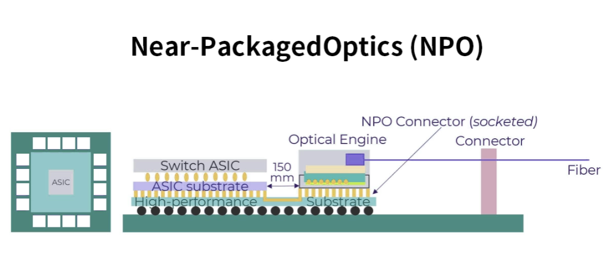

# 捋一捋最近的光模块、CPO和NPO

> 原文链接：[捋一捋最近的光模块、CPO和NPO](https://mp.weixin.qq.com/s?__biz=MzU4ODY5ODU5Ng==&mid=2247495017&idx=1&sn=11cfd2bd213c77df1007e7f0c8c20c39&chksm=fc9ed3cfda075662bd1c22326148437b9f63edf7937c19d4cee5450ece7b198d454b10d152cc&mpshare=1&scene=1&srcid=0205CxEqZnsmdrGBmbmRy9Nz&sharer_shareinfo=8244e0638e418e15d6c253af06a4b87b&sharer_shareinfo_first=8244e0638e418e15d6c253af06a4b87b#rd)

#

这两天光模块、CPO和NPO的争论非常大，我们把前后的事情来捋一下。## AYZ大佬的文章

首先是AYZ大佬在2月2号发了一篇关于CPO的文章：

文章中对CPO的一些技术讨论非常多，原文值得花时间看一下，关于CPO的进展，文章的主要观点有下面几个：

***1、正交背板解决方案（存在背板制造良率低、整体装配难度高等问题）和 CPO 解决方案（装配难度较低，但 CPO 产量良率低）都是 2027 年 Rubin Ultra 机架的可选方案。***

但这个最利空的应该是大家寄予厚望的PCB，没想到光模块的反应这么大。

***2、大家都知道CPO 最大缺点之一是可维护性问题：如果连接到交换机的光模块发生故障，用户可以轻松将其拔出并用新的替换，而 CPO 交换机内部的光引擎理论上是与交换机芯片一起封装的。因此，如果一个光引擎发生故障，整个昂贵的交换机芯片都必须报废。NVIDIA 在其 Quantum X800 CPO 交换机中巧妙地采用了可拆卸设计，每个芯片底部都安装了一个插座，以便在发生故障时可以拆下并更换该芯片。未来 CPO 版本的 Rubin Ultra 机架中，CPO NVSwitch 芯片也将采用可拆卸设计。***

这一点的争议是很大的，因为传统意义上，CPO是把光学器件直接跟XPU/Switch封装在一起的，但这里确实可拆卸的，所以大家的争议点就在于这个其实算是NPO。

下面这个表是CPO、NPO和传统光模块的一个对比：**指标****CPO****NPO****传统可插拔光模块（带DSP）**功耗~10W（1.6T）10-15W（1.6T）20-30W损耗2-3dB略高于CPO（可通过DSP优化）依赖DSP补偿，插损较高延时与NPO接近（无DSP时）与CPO接近（无DSP时）较高（含DSP处理）成本理论低（良率/维护痛点未解决前实际更高）阶段性更低（成熟技术+可维护）较高

CPO和NPO的一个核心差异是下面这个：

CPO（共封装光学）：通过3D封装（TSV硅穿孔工艺）将硅光芯片、电芯片垂直集成，再以CoWoS技术封装于主芯片载板，不可维护。 NPO（近封装光学）：采用2D水平封装，硅光芯片与电芯片贴装于SLP板，通过Socket插在PCB上，支持可插拔，技术成熟度高。

这里也解释一下，CPO 不绝对依赖台积电 CoWoS，但 CoWoS 是台积电实现高性能 CPO 方案的核心封装技术之一。## Lumentum 的财报电话会

接着就是Lumentum 的电话会了：

在scale out的CPO上，Lumentum 称获得数亿美元超高性能激光器订单，支持光学Scale-Out应用，预计2027年上半年发货；现有订单按计划推进，2026年下半年UHP芯片发货量将迎来显著拐点。铜缆在超短距离（Scale-Up）连接中面临物理瓶颈，行业正转向光学方案，公司预计2027年底实现首笔Scale-Up CPO发货，替代长距离铜缆连接。目前已深度参与客户设计周期，依托UHP激光器和ELS模块构建技术优势。

从Lumentum 给的信息来看，说明了CPO确实是在加速，这可能也是昨天对光模块影响最大的一件事了，上午旭创跌了非常多，导致公司不得不开了紧急电话会，电话会的核心内容第一时间放到了星球。

旭创主要就是给大家信心，核心观点有下面几个：

1、认为还是以可插拔为主流，NPO是确定性下一代路径，CPO落地尚远；

2、2027年光模块需求强劲，供应链向头部集中，公司毛利率稳升

3、旭创要从光模块供应商升级为全栈光连接解决方案提供商

下午市场就有所反应了，反弹了很多。## 产业各方对技术的接受度与态度

根据产业内的一些调研，聊一下各方对CPO/NPO的态度。

首先看CSP，谷歌是开放生态的坚定拥护者，对CPO技术非常谨慎，始终将重心放在NPO所构建的多元化开放生态上，他们已经在用OCS来解决部分AI集群互联瓶颈，这与CPO/NPO属于不同技术路线，可以互补；而微软、Meta、亚马逊等头部云商，早期曾对CPO技术表现出一定兴趣，但随着NPO生态的不断完善和技术成熟度的提升，逐渐转向支持NPO，形成了云商领域对NPO的全面认可态势。

与云商的集中态度不同，芯片厂商的立场呈现明显分化。英伟达为了绑定硬件销售、提升产品毛利率，一度积极推动CPO技术，但从实际商用产品来看，其落地的仍是不是纯粹的CPO方案；博通则更注重维护与谷歌等核心客户的合作关系，从最初倾向CPO，逐渐转变为尊重云商的自主选择，同时支持NPO与CPC两种技术路径，灵活性适配市场需求。

除了NPO与CPO，CPC+可插拔路线也在持续迭代升级。目前，3.2T可插拔模块已进入研发阶段，从行业发展来看，其实光模块和CPO会共存很长一段时间，不是说CPO出来之后，就没有光模块的使用场景了。

[星球内容升级](https://mp.weixin.qq.com/s?__biz=MzU4ODY5ODU5Ng==&mid=2247494994&idx=1&sn=c074d8ad84b9bf63829b77cbd4bc2601&scene=21#wechat_redirect)

知识星球

关注星球，带大家发现新的产业增长点。

星球最近对每天的早报(周内早上9点前更新)做了一个很大的更新，之前的早报主要以头一天海外媒体的新闻总结为主，内容都不是很长。

最近我们对早报做了很大的升级，除了路透、彭博、FT、Information这些新闻的内容总结，还有汇总了国内外分析师的观点，覆盖的产业包括：Memory、智驾/Physical AI、机器人、AI算力、AI电力、光、PCB、液冷、AI应用，内容比较全，都是最新的分析师观点和新闻，欢迎大家进星球查看。

半导体AI产业交流

对半导体和AI产业交流，可以加下面微信，请备注姓名和所在行业。

