# 支撑亿级流量：小红书 2025 MySQL 内核做了哪些关键改造？

> 原文链接：[支撑亿级流量：小红书 2025 MySQL 内核做了哪些关键改造？](https://mp.weixin.qq.com/s?__biz=Mzg4OTc2MzczNg==&mid=2247494715&idx=1&sn=daf03596c3d86e8d865f49b1dc108942&chksm=cebc3335485b1410f8776237989d09aeef5de3948c24284af1f7f0d0abf1c5f10e4b213625dc&mpshare=1&scene=1&srcid=0205JzzgU96dVuD7OqzjSQd5&sharer_shareinfo=77f99740b99a015bc2fdbfac90b0e745&sharer_shareinfo_first=77f99740b99a015bc2fdbfac90b0e745#rd)

过去一年，小红书MySQL内核完成了0-1的建设，完成了3个解决方案和若干项优化，提出一种基于Binlog Server的数据一致性解决方案，通过提升半同步复制性能加速日志传输，在故障时可无侵入现有数据库架构地实现自动补数据，保证数据一致性。基于 MySQL 内核实现的合并秒杀优化，相对排队秒杀方案，将秒杀写入能力再提升5倍，相对 MySQL 开源社区版本更有百倍的性能提升。在设计上保持了和排队秒杀一致的能力，该能力对业务完全透明：仅需升级 MySQL 内核，无需改动 SQL，即可获得5倍以上性能提升。针对加列速度慢的问题，实现了秒级加列，加列速度将天级别变更缩短到分钟甚至秒级别。并且在稳定性、DDL速度、可观测性等方面都做了优化，在内部实现了80%+的部署。

本文围绕 MySQL 内核遇到的核心挑战，梳理已采取的应对策略，并提出后续可执行的改进方案。

在较长时间内，小红书业务对数据库性能、稳定性都有一些需求，依靠管控和中间件等规避了部分问题，但随着业务与实例规模扩张，上层规避问题成本高，底层内核优化杠杆效应更强、价值更大。下面简单列举几个核心痛点：

遇到热门商品秒杀/热点笔记圈粉/大V直播带货等场景仍难以支撑短期高脉冲流量，热点行更新速度慢

和资金相关的核心业务的RPO=0的诉求

业务新需求需加字段，大表耗时太久，拖长业务交付周期

在流量突增场景下的稳定性需求

因此，2025年启动建设**小红书自研版本 MySQL 内核 —— RedSQL**&nbsp;，针对业务上述痛点进行内核优化，逐一形成统一的解决方案。经过一年的发展，目前已完成了从0-1的建设，形成了3个大的解决方案和若干稳定性、性能优化，内部完成了80%以上自研版本部署。

目前，数据库内核功能大盘如下所示：

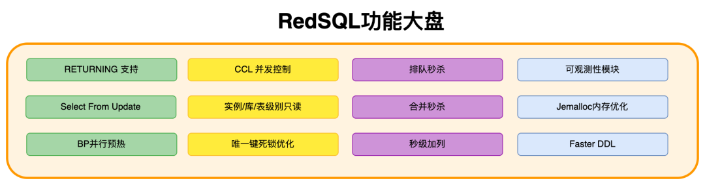

 

下面将详细介绍下三个大的解决方案，分别是数据一致性、热点行更新和DDL优化，阐述自研内核 RedSQL 发展的阶段性成果与思考。

**2.1 秒杀能力再提升，热点更新速度提升到1.5W+**

**
**

针对秒杀场景，目前有三种解决方案。将上述方案的瓶颈点和解决思路整合如下图对比所示，直观反映了各方案的优化思路。

[小红书MySQL内核秒杀能力重磅再升级](https://mp.weixin.qq.com/s?__biz=Mzg4OTc2MzczNg==&mid=2247494557&idx=1&sn=9dba41e4eb80a5386f2cca70666c7c23&scene=21#wechat_redirect)

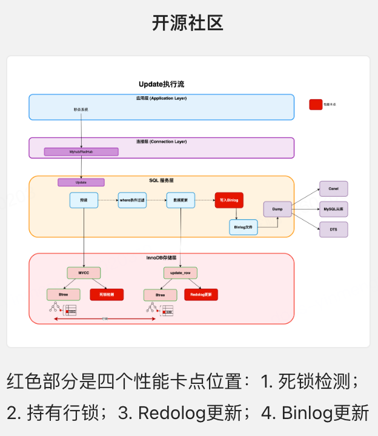

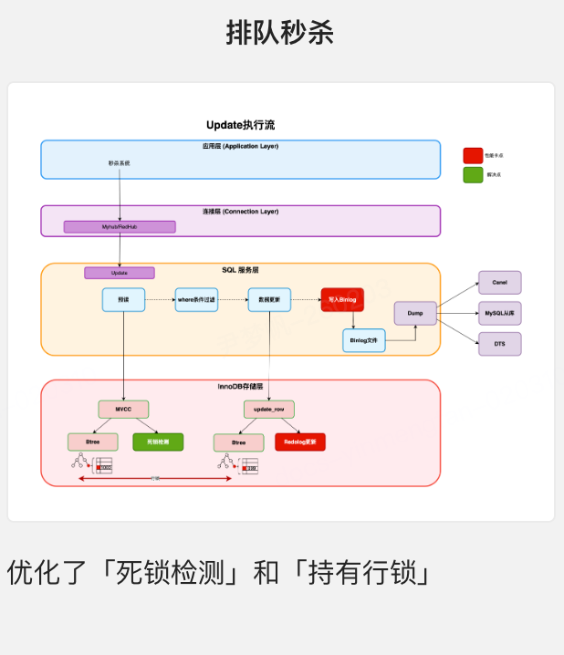

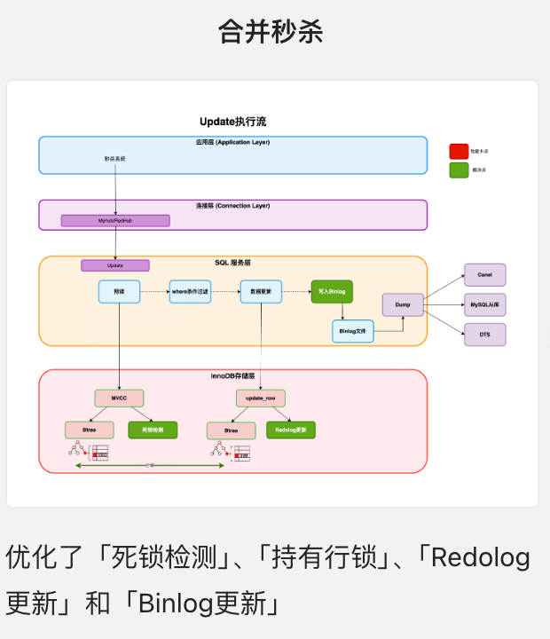

&lt;左右滑动查看更多&gt;

合并秒杀将多个事务 SQL 合并到一个事务进行提交，修改了MySQL的事务模型，必然涉及到MySQL事务系统、锁系统、Binlog系统等模块的修改。合并秒杀方案提供了如下优势：

**生态组件无感知：**将改动内容收敛到MySQL内核，输出的 Binlog内容和格式没有变化，对于DTS/Canel等组件无感知，避免了联动组件升级

**内核升级无感知：**不修改InnoDB格式，不影响版本兼容性和版本回退

**业务SQL无修改：**和排队秒杀版本SQL语法兼容，可以动态开关。业务/DBA可以随时将合并秒杀退化到排队秒杀，也可以随时开启。可以同时将合并秒杀，排队秒杀，无秒杀在一个数据库同时跑起来，减少业务迁移成本。

在合并秒杀设计上，通过解决四项关键技术提升了数据库的性能 。

**缓存可见性：**通过新增全局缓存解决了数据可见性问题，通过排队方案解决了多线程数据一致性问题。方案中需要对**数据库执行器**大幅修改、精细调整，既要满足数据库ACID特性，又要提升百倍性能。

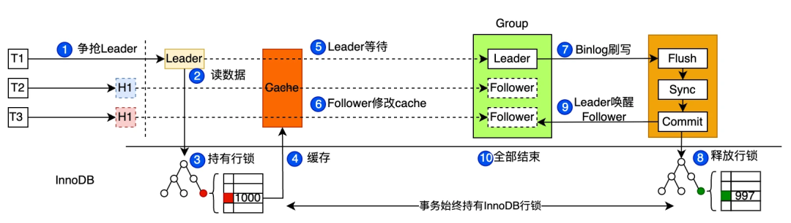

**
**

**行锁极致优化：**将秒杀过程拆分为&nbsp;**更新**&nbsp;和&nbsp;**提交**&nbsp;两个阶段，通过**对存储引擎锁系统的优化**，实现了秒杀线程并行执行。

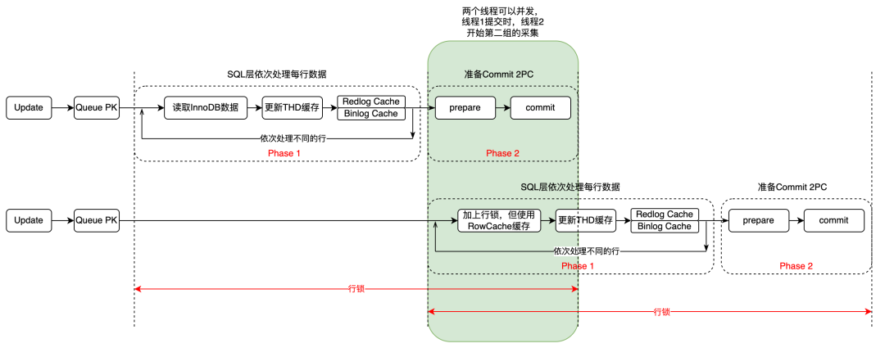

**
**

**日志并行提交 与 宕机恢复优化 ：**将多线程秒杀日志并行提交，进一步提升秒杀性能。调整宕机恢复流程，保证宕机恢复后的数据一致性以及主从数据的一致性。

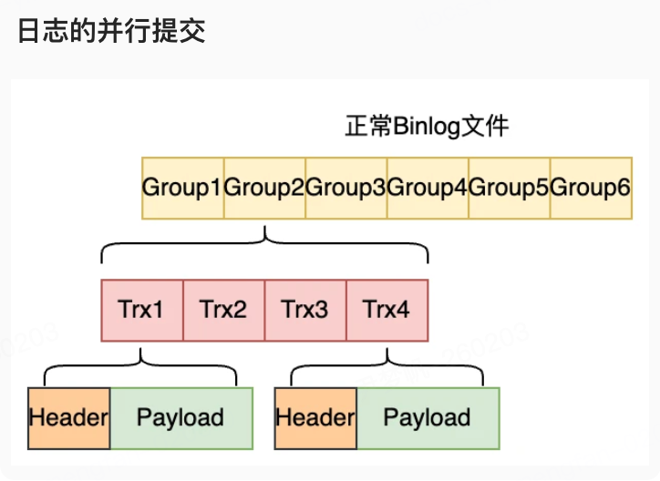

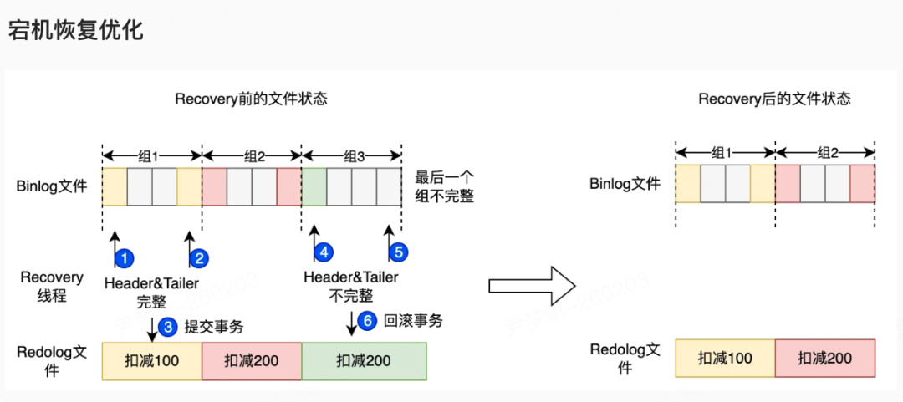 

**
**

**收益：**一方面，成功支撑直播电商超级单品的高并发秒杀场景；另一方面，有效保障社区热点笔记点赞、创作者关注飙升等业务需求。

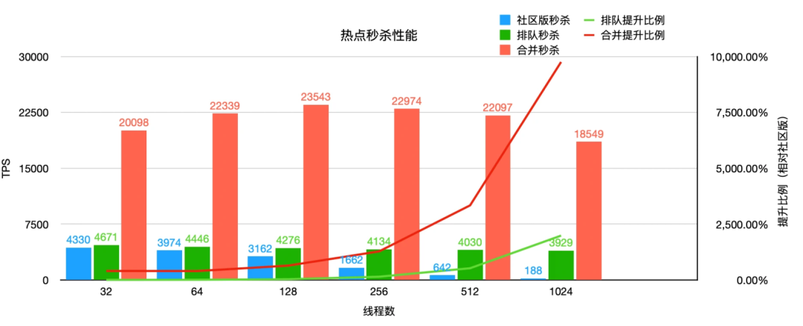

**
**

**2.2 数据一致性解决方案，核心场景RPO=0**

**
**

这部分内容在[小红书自研Binlog Server守护MySQL数据0丢失](https://mp.weixin.qq.com/s?__biz=Mzg4OTc2MzczNg==&mid=2247493424&idx=1&sn=0b39eed0b407066ea7dc914cc7f6c795&scene=21#wechat_redirect)介绍。

依托全自研的&nbsp;**Binlog Server**&nbsp;与&nbsp;**ORC 高可用组件**，在技术上的收益：

**高速复制方案：**针对业内缺乏可靠稳定的 Binlog 持久化组件这一痛点，自研的 Binlog Server 模块仅需 1C1G 极简资源，即可实现 300MB/s+ 的高速数据复制；

**无人工干预的一致性保障方案：**在主备切换过程中，以数据一致性优先为原则设计自动补数机制，最终实现全流程自动化的一致性解决方案（RPO=60s -&gt; RPO=0s），无需人工介入。

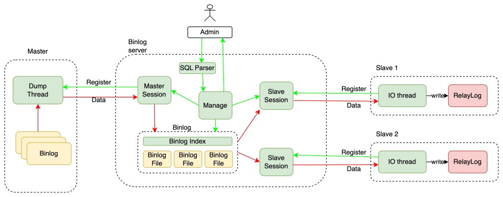

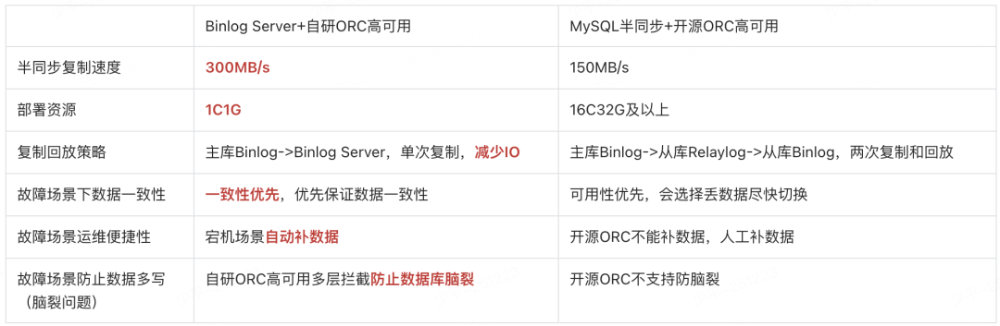 

在这个过程中，解决了如下问题：

**问题1：完整的MySQL 协议支持。**既提供了轻量化方案，仍保留了完整的MySQL协议支持。

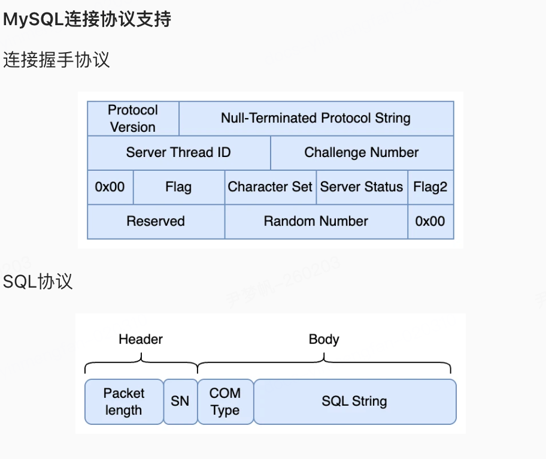

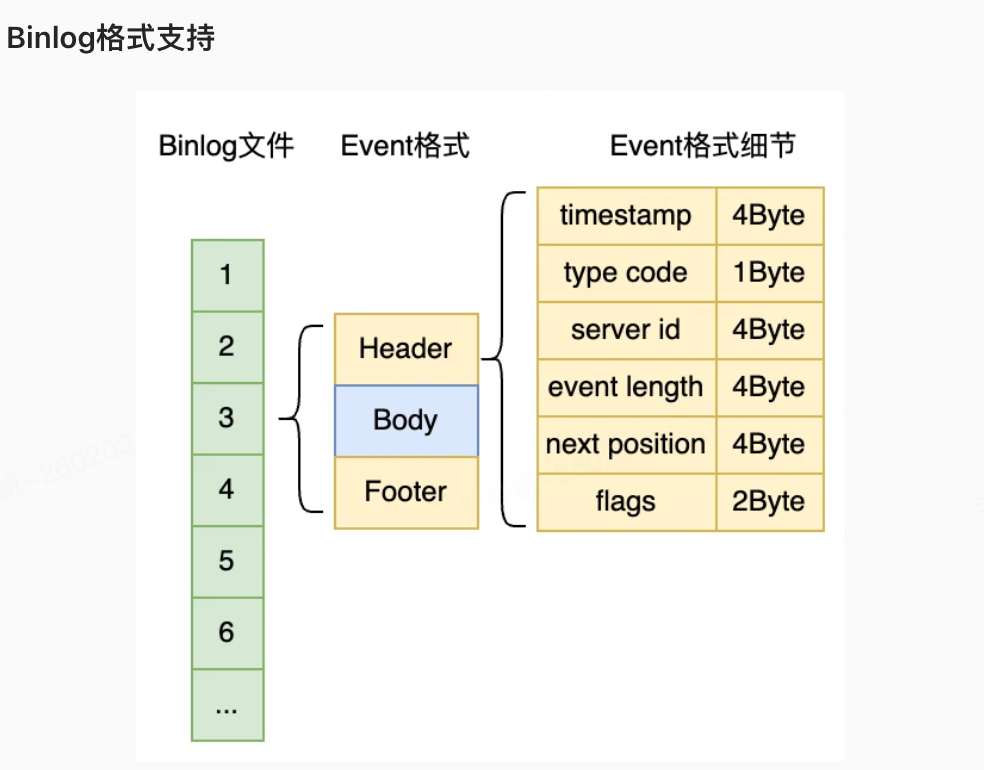 

&lt;左右滑动查看更多&gt;

**
**

**问题2：自研的SQL语法解析器。**提供了自定义的SQL语法支持，保证了现有运维体系兼容性。

为实现对 ORC 的便捷管理，同时确保对现有运维系统与高可用系统无侵入，要求 Binlog Server 支持 SQL 语法，以此降低周边系统的开发与适配成本。为此，我们为 Binlog Server 自研了专属语法解析器：输入的字符串会先经词法解析器提取 Token，再由语法解析器生成语法树，最终实现对SQL信息的精准提取。

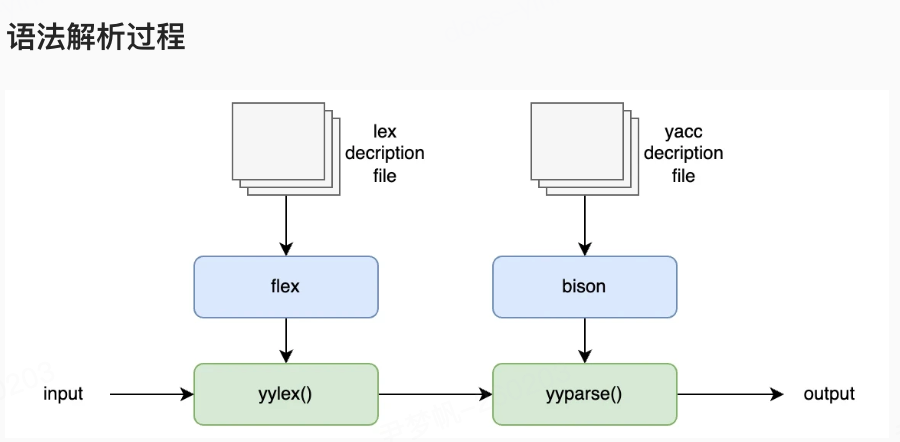

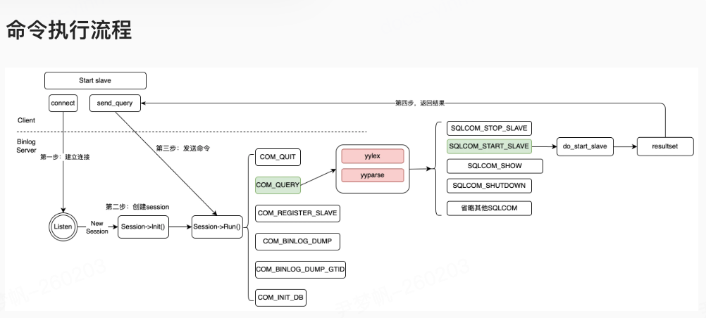 

&lt;左右滑动查看更多&gt;

**
**

**
**

**问题3：主从节点注册。**

Binlog Server 支持级联架构，既可作为 Slave 节点，从上游接收并持久化 Binlog。也可作为 Master 节点，向下游分发 Binlog。基于这一特性，Binlog Server 需具备双向注册能力，严格遵循 MySQL 节点注册规范，灵活模拟主库或从库身份完成注册流程。

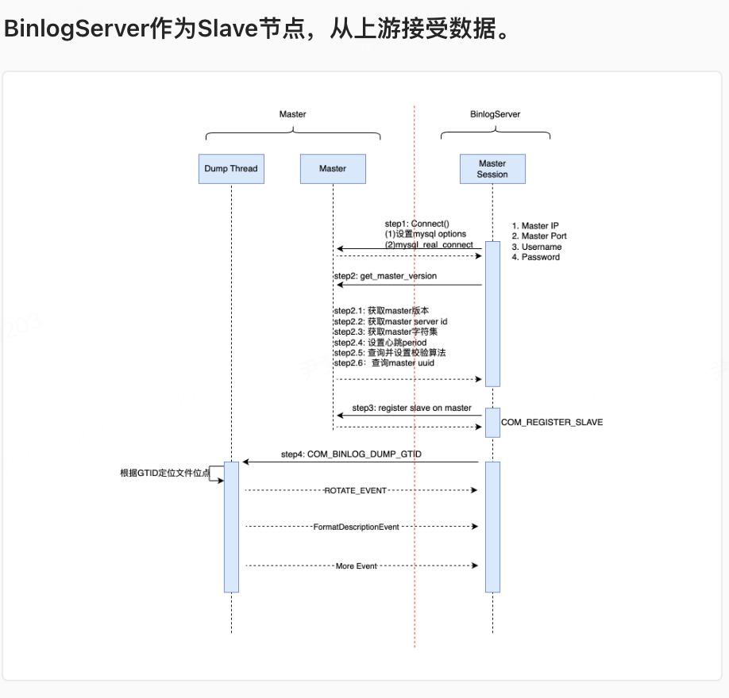

 

&lt;左右滑动查看更多&gt;

**
**

**问题4：半同步支持。**

**Master 节点生成由若干 Event 构成的 Binlog 文件，发送 Event 时会在其头部添加 Header 信息。Binlog Server 接收数据后，先解析 Header 并判断是否需发送 ACK；若需发送，则将 Master Log 位点信息反馈至主库。主库收到 ACK，确认数据已在下游持久化后，即可完成 InnoDB 事务提交。**

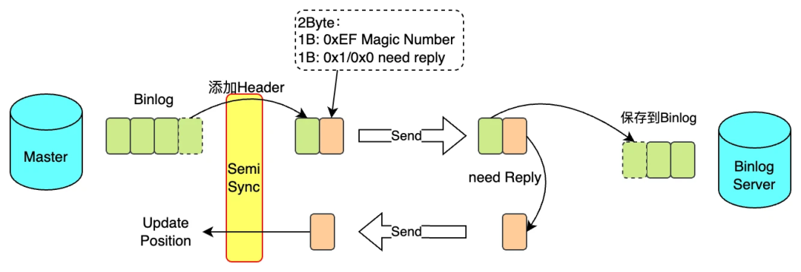

****

**
**

**终态方案 ：**最终结合ORC和Binlog Server 构建了完整的数据不丢失解决方案

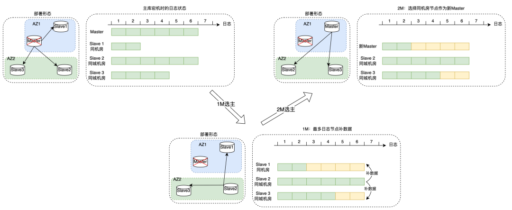

**
**

**收益：**覆盖100% 核心集群，大幅降低了RPO时间，支持了核心场景RPO=0的目标。

**2.3 秒级加列，周级别变更缩短至秒级**

**
**

XHS核心集群数据库版本仍在5.7，DDL加列仍然依赖于gh-ost工具。业务迫切需要秒级加列功能，因此增加了秒级加列功能。

**现有方式加列为什么那么痛？**

MySQL 用 gh-ost 新增字段 “痛”，核心是它靠全量数据搬迁实现无锁 DDL：先建临时表、拷贝历史数据、同步增量 binlog，最后换表名。大表操作耗时久，占满 IO/CPU，还易引发主从延迟。

**技术挑战在哪里？**

秒级加列的核心挑战，是**元数据与物理存储解耦**：需原子化更新元数据且不改动原数据存储，设计多版本元数据实现读写无锁兼容。同时要攻克主从同步对齐、低版本及特殊表结构适配、宕机后元数据恢复等难题。

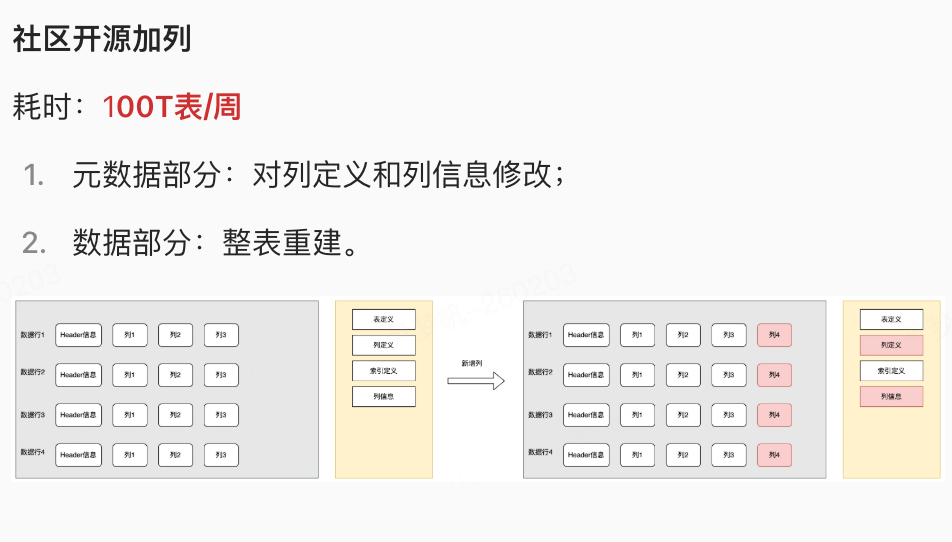

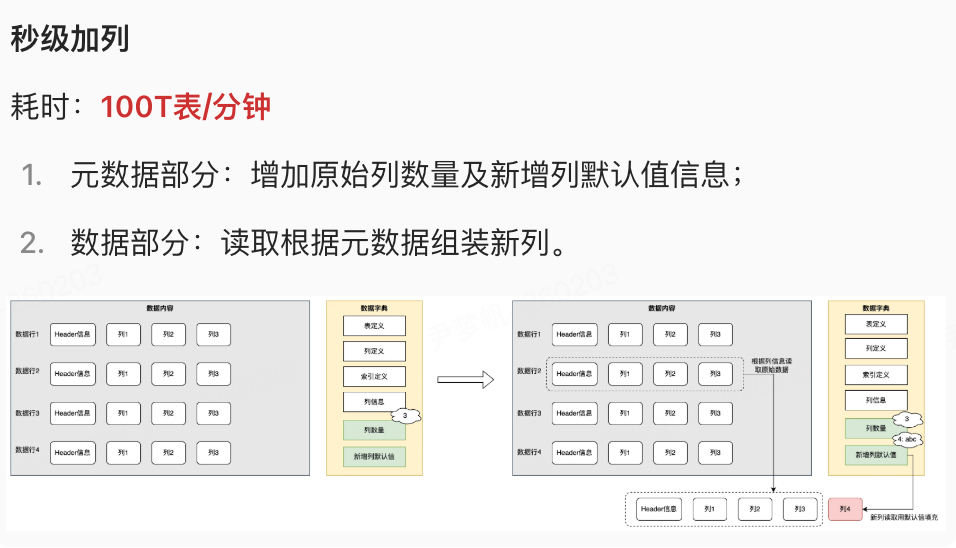 

&lt;左右滑动查看更多&gt;

社区DDL新增列的处理过程有两个修改：

1. 元数据部分：对于列定义和列信息进行修改

2. 数据部分：给每一行增加列的默认值，这个过程涉及到整个表的重建

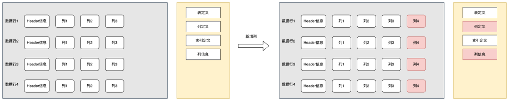

&lt;左右滑动查看更多&gt;

RedSQL对元数据进行了修改，增加了原始列的数量以及新增列默认值两个信息。那么当进行加列DDL操作以后，只需要修改数据字典的内容，这个过程非常迅速。

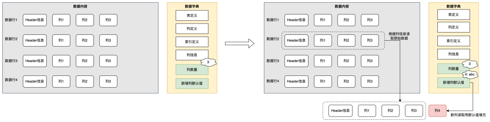

&lt;左右滑动查看更多&gt;

如上图所示，如果对数据行2在DDL之后读取内容。首先会读取列数量为3，将数据行2的数据全部读取出来，再根据新增列默认值拼接上列4，最终返回给用户。

如果业务新插入一行数据，那么新的数据行如何和老的数据行共存并且区分呢。在这里会修改Header信息，增加Flag表示并记录改行自包含4列数据。那么新数据读取4列就不用拼接，老的数据读取4列需要拼接。

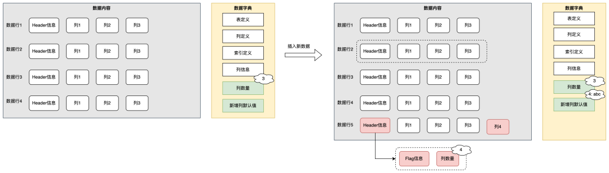

&lt;左右滑动查看更多&gt;

解决了数据读写问题，如果又新增了第5列数据，并且新插入了一行数据，最终的形态如下图所示。

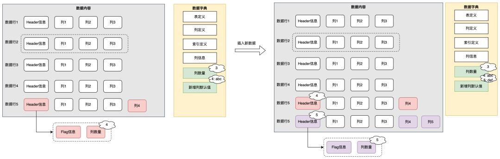

&lt;左右滑动查看更多&gt;

最终的形态如下图所示，数据内容配合数据字典形成了一个版本链。

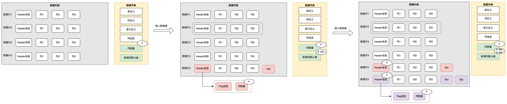

&lt;左右滑动查看更多&gt;

**
**

**收益：**业务加列速度将周级别变更缩短到分钟甚至秒级别。

**
**

**2.4 其他内核功能**

**
**

简单介绍部分内核特性。

**CCL：模糊限流-&gt;精准限流**

限流能力从时间阈值到具体SQL模版，实现精准限流，保障数据库稳定性。

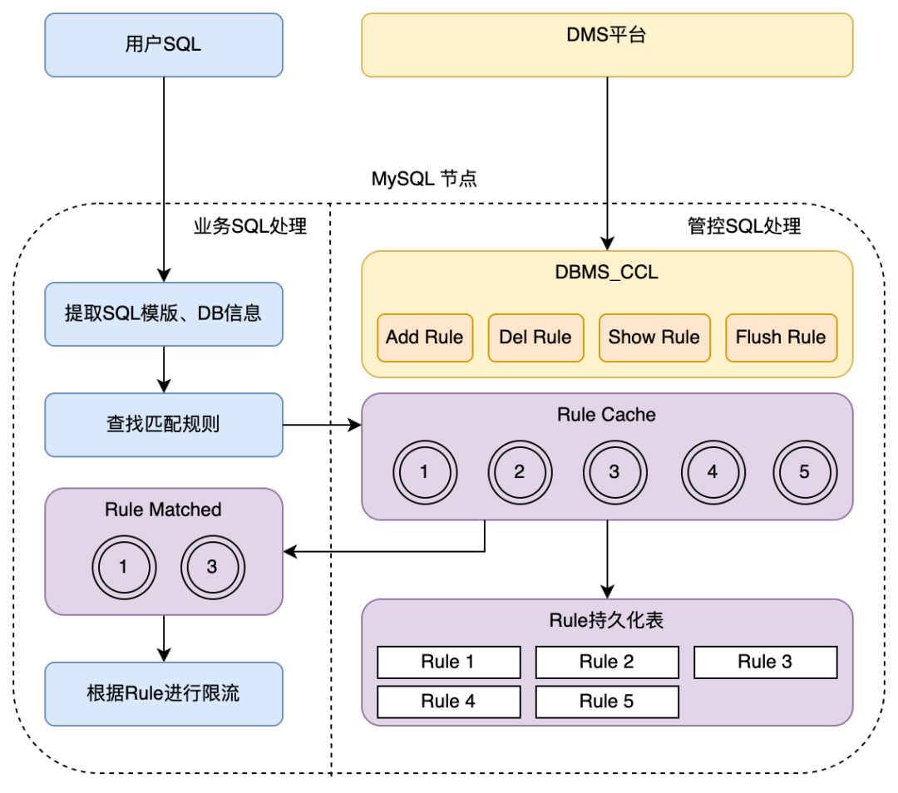

**
**

**SQL语法扩展**

支持select from update和Returning语法。用来直接返回被影响的行的数据，而不需要再发一次 SELECT 查询，**TPS 提升20%**。

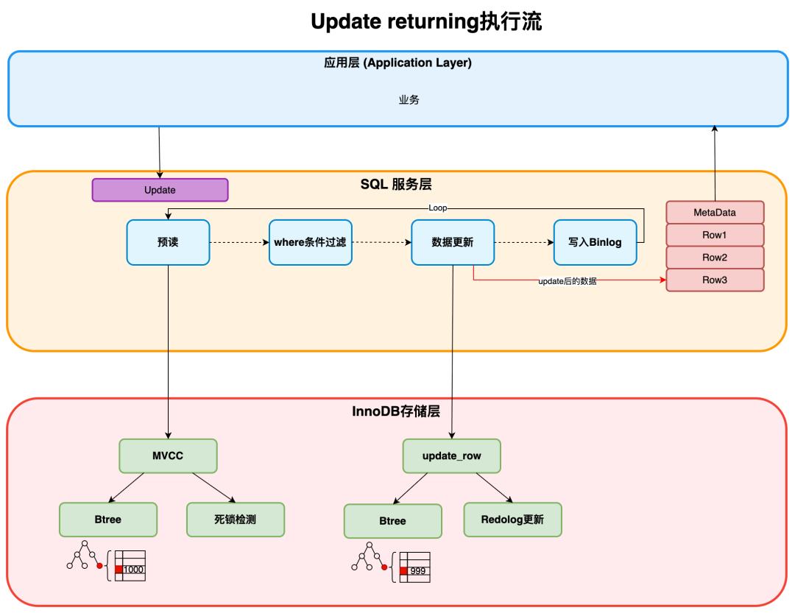

**
**

**BP并行加载**

数据库内存（Buffer Pool）**加载速度从300MB/s提升至1GB/s，提升3.3倍**。不会出现实例重启后，预热不充分导致的慢查询和主从延迟告警。

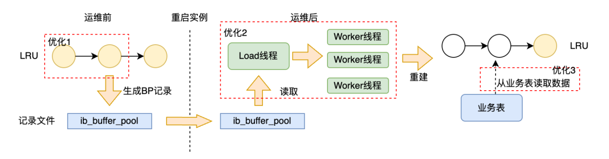

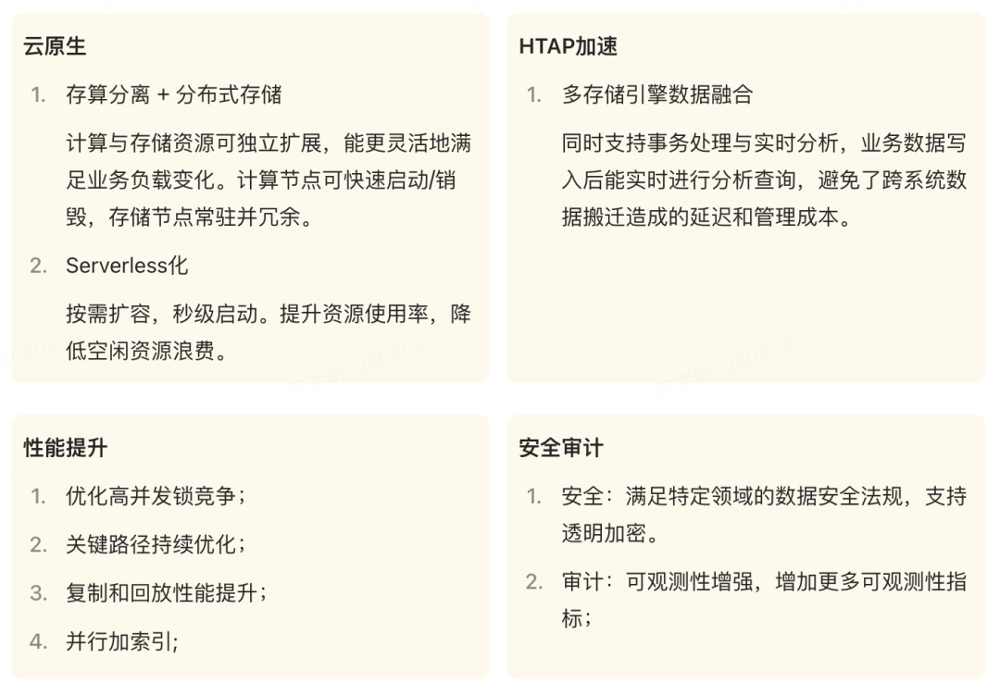

**张凡凡**

小红书关系型数据库研发工程师，主要负责小红书关系型数据库内核研发。

**沈文浩**

小红书数据库中间件研发工程师，主要负责聚焦数据库代理研发。

**乐齐**

小红书关系型数据库DBA，主要负责小红书关系型数据库运维工作。

[MySQL数据库内核工程师]()&nbsp;关系型数据库内核研发

[存储&amp;数据库平台研发专家]()&nbsp;存储&amp;数据库云平台等方向

[数据库中间件研发工程师/专家]()&nbsp;数据库DTS/SDK/Proxy等方向

[NoSQL数据库研发工程师/研发专家]()&nbsp;KV/Redis/KVCache 等方向

[分布式数据库工程师/专家]()&nbsp;图/表/量/多模数据库等方向

[分布式存储研发工程师/研发专家]()&nbsp;块/文件/对象/存储底座等方向

欢迎感兴趣的朋友投递简历至：linzi@xiaohongshu.com

 **往期精彩内容指路&nbsp;**

[Java 再升级！JDK21 + 虚拟线程技术大规模落地方案解密](https://mp.weixin.qq.com/s?__biz=Mzg4OTc2MzczNg==&mid=2247494592&idx=1&sn=44a989f070adddaa5c9d72d7061e83f0&scene=21#wechat_redirect)

**[告别无效思考 | 小红书Hi Lab 提出Think When You Need](https://mp.weixin.qq.com/s?__biz=Mzg4OTc2MzczNg==&mid=2247494309&idx=1&sn=dc7781673d4e73eeafcc907e518ef700&scene=21#wechat_redirect)**

**添加小助手，了解更多内容**

**微信号 / REDtech01**

