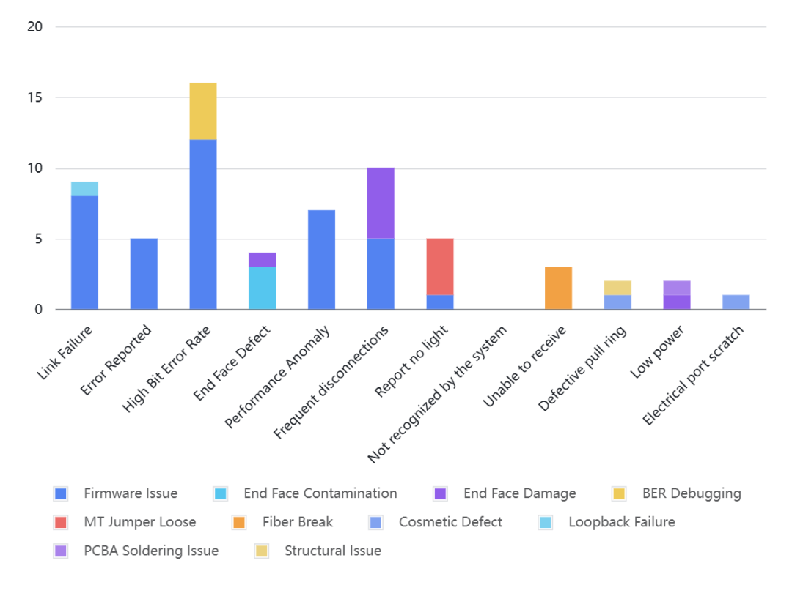
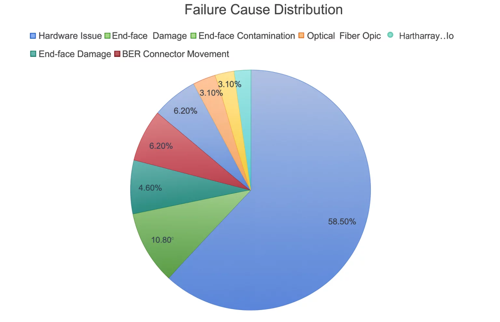
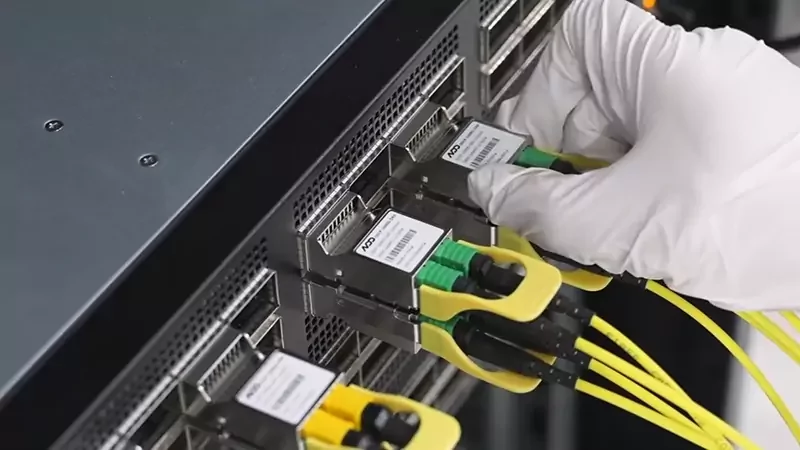

# 智算中心与GPU集群光模块常见故障分析

> 原文链接：[智算中心与GPU集群光模块常见故障分析](https://mp.weixin.qq.com/s?__biz=Mzk2NDEyMTM1Mg==&mid=2247488500&idx=1&sn=ead605e88a36dba694a7896998cce88c&chksm=c51682d6dfc9a31805ef1867621f2ca499dc0c223331c6c80dbe4fb68255348a7b80f0b723f7&mpshare=1&scene=1&srcid=0212oZNQBW6CdnqKrb06VSLD&sharer_shareinfo=598f86b38b706e62d4b88f4708b6a54a&sharer_shareinfo_first=598f86b38b706e62d4b88f4708b6a54a#rd)

随着大模型训练规模不断攀升，GPU集群的网络架构正面临前所未有的挑战。光模块是支撑GPU集群计算系统稳定运行的基石，虽然光模块在单条链路中只是一个微小环节，但其可靠性在超大规模GPU集群中却被无限放大。任何光模块的故障都可能导致训练中断、算力浪费，乃至整个任务周期的延误。

了解智算中心与GPU集群网络的演进趋势、光模块面临的新要求、常见光模块故障成因，以及提升光模块稳定性的有效策略，已成为构建高可靠GPU集群的关键课题。本文将围绕这些要点展开探讨，帮助用户理解GPU集群光模块常见问题及应对之道。

**主要内容：**1. 智算中心与GPU集群网络的演进与光模块新需求2. GPU集群中使用光模块面临的典型问题2.1. 链路异常——影响训练效率2.2. 性能异常——影响训练质量2.3. 硬件问题——影响后续维护2.4. 报错相关现象——设备状态异常3. 光模块故障原因的分布与分析3.1. 故障原因——端面损伤3.2. 故障原因——固件问题3.3. 故障原因——端面污染3.4. 故障原因——MT跳线松动3.5. 故障原因——光纤断裂3.6. 故障原因——PCBA焊接3.7. 故障原因——外观/结构问题3.8. 故障原因——流通不畅4. 高稳定性光模块选择原则4.1. 超低误码率与高稳定性能4.2. 全面兼容主流AI设备并通过严格测试4.3. 先进的制造能力保障可靠性与快速交付4.4. 全生命周期技术支持与运维保障5. 写在最后## 1. 智算中心与GPU集群网络的演进与光模块新需求

近年来，随着大模型对算力需求的爆发式增长，智算中心（部分文献中也称为AI数据中心）已成为全球计算基础设施的核心。构建这些GPU集群（如英伟达DGX、谷歌TPU Pods及超大规模训练平台）依赖数百乃至数千台GPU服务器的高速互联，其网络带宽、时延和稳定性要求已远超传统数据中心。在GPU集群中，光模块已成为系统级关键组件——承担服务器与交换机之间的高速数据交换任务。与此同时，GPU集群内部的东西向流量（如模型训练中的参数同步）激增，使得光模块的稳定运行成为影响AI业务稳定性和效率的关键瓶颈。

根据华为数据中心评估数据，稳定训练千卡以上GPU的时间不超过2.8天。其中22%的训练中断由网络故障导致，而GPU集群中90%的故障源自光模块失效。光模块的失效概率对GPU集群训练有重要影响，虽然单个光模块的失效率较低，但在上万GPU规模的集群中被放大数倍。光模块失效会造成一定概率的故障，进而导致训练服务中断。重新训练需要额外的时间，从而增加了集群的运营成本。

GPU集群对网络稳定性极为敏感，特别是当丢包率超过0.1%时，训练效率将显著下降，可能导致训练时间延长数百倍，造成算力浪费与训练计划中断。因此，在GPU集群网络中必须严格管控链路质量，确保低误码率、低丢包率与链路不间断运行，从而保障大模型训练的稳定高效。## 2. GPU集群中使用光模块面临的典型问题

在当前GPU集群场景下使用光模块面临的典型问题主要可归纳为以下几类。

### 2.1. 链路异常——影响训练效率

1）链路劣化：链路建立失败或不稳定可能导致通信中断。

2）频繁闪断：反复断开与重连严重影响训练稳定性。

3）无光上报（LOS, No Light Report）：发射端未检测到光信号，链路中断。

4）插入不识别：光模块插入后无法被设备识别或初始化。

5）接收端故障：光模块接收端无法正常接收信号，导致通信中断。### 2.2. 性能异常——影响训练质量

1）功率过低：发射或接收光功率低于标准值，可能影响链路质量。

2）性能异常：如抖动过大或时延过高，影响整体链路性能。

3）误码率高：通信过程中出现大量误码，影响数据准确性。### 2.3. 硬件问题——影响后续维护

1）拉环缺陷：导致无法正常插拔光模块，影响维护操作。

2）电口划痕：电接口（如金手指）损伤可能导致接触不良或识别失败。

3）端面不良：光纤端面污染、划伤或连接不良易导致光损耗过高和误码率上升。### 2.4. 报错相关现象——设备状态异常

故障上报：光模块在运行中被设备检测为异常，触发设备告警。## 3. 光模块故障原因的分布与分析

当前GPU集群环境中的问题主要集中在固件问题与端面问题。这两类问题导致链路不稳定、误码频发、性能下降和闪断等现象。具体故障原因及分析如下。

### 3.1. 故障原因——端面损伤

1）**故障现象**端面不良频繁闪断光模块功率过低

2）**对客户的影响**训练效率下降：这些问题会导致节点间的网络链路不可用或不稳定，造成AI训练任务中断或效率降低。严重情况下可能需要重启网络设备或重新部署训练任务。维护成本增加：光模块物理接触不良或插拔困难会影响上电识别或信号完整性，容易引发间歇性故障。客户可能因此误判为设备问题，增加客户数据中心的维护成本。### 3.2. 故障原因——固件问题

1）**故障现象**链路劣化故障报错误码率高性能异常频繁闪断上报无光

2）**对客户的影响**训练效率下降：这些问题会导致节点间网络链路不可用或不稳定，造成AI训练任务中断或效率降低。严重情况下可能需要重启网络设备或重新部署训练任务。训练精度降低：这些问题会影响AI集群内部进行大规模参数同步和模型训练时梯度传递的正确性，进而影响训练结果的准确性。网络异常率升高：光模块频繁断连、链路不稳定或无法被设备识别，将导致节点通信异常、训练过程报错或中断，影响推理/训练进度。### 3.3. 故障原因——端面污染

1）**故障现象**端面不良

2）**对客户的影响**光模块端面存在缺陷会导致光信号衰减或反射，引发链路不稳定与误码率上升。这进而可能导致GPU集群节点掉线、通信失败、训练中断或效率降低，影响集群稳定性与算力利用率。### 3.4. 故障原因——MT跳线松动

1）**故障现象**上报无光

2）**对客户的影响**这会导致对应节点链路中断，引发训练任务失败、节点掉线与资源调度混乱的连锁反应。由于分布式训练高度依赖跨节点通信，此类单点链路故障往往会放大为集群级的性能波动与稳定性风险。### 3.5. 故障原因——光纤断裂

1）**故障现象**连接未成功

2）**对客户的影响**同「MT跳线松动」### 3.6. 故障原因——PCBA焊接

1）**故障现象**功率过低

2）**对客户的影响**这会导致链路信号衰减与误码率上升，易引发节点通信异常、训练中断及性能波动。### 3.7. 故障原因——外观/结构问题

1）**故障现象**拉环缺陷电口划痕

2）**对客户的影响**这可能导致光模块插拔困难、识别失败、部署风险和维护中断。### 3.8. 故障原因——流通不畅

1）**故障现象**链路劣化

2）**对客户的影响**训练效率下降：这会导致节点间网络链路不可用或不稳定，造成AI训练任务中断或效率降低。严重情况下可能需要重启网络设备或重新部署训练任务。## 4. 高稳定性光模块选择原则

GPU集群中光模块的故障常由固件问题、光端面缺陷及制造工艺不一致等因素引发。为提升光模块的可靠性、降低客户集群中断风险，并保障AI训练任务的连续性与性能稳定，除了关注部署环境与运维策略外，选择具备高稳定性的光模块至关重要。以下是高稳定性光模块应具备的特征：

### 4.1. 超低误码率与高稳定性能

优质光模块应具备先进的信号处理能力与算法优化水平，其光路及电路设计需能够在温度波动、高密度部署及长期运行条件下保持链路稳定，确保数据传输持续可靠。

所挑选的高性能光模块应：专为满足AI与高性能计算环境的严苛需求而设计，能够在大规模训练与推理集群中提供稳定可靠的链路。集成先进的数字信号处理（DSP）技术与算法优化，实现前向纠错（FEC）前误码率（BER），能达到1E-8至1E-10级别、FEC后零误码率的高标准，从而保障数据传输的高可靠性；InfiniBand光器件采用大厂芯片，提升光学稳定性，即使在恶劣条件下也能确保可靠运行。采用先进的散热技术，有效降低高密度部署与长时间高负载运行导致的性能波动或网络中断风险

以上这些技术特性确保了在智算中心与高性能计算集群中数据传输的低时延、高带宽与持续稳定性，可为AI/ML模型训练与推理提供坚实的互连基础。### 4.2. 全面兼容主流AI设备并通过严格测试

高稳定性光模块需经过与主流交换芯片、网络设备及多厂商系统环境的全面互操作性测试。这包括在模拟真实部署条件下的编码、链路一致性、时延与带宽等测试，以确保在AI、大规模训练及混合网络架构中实现稳定的互操作与一致的性能表现。

光模块生产厂商测试中心通过完全复现真实部署环境，对各组件进行严格验证，确保以太网光模块达成最优性能与兼容性。所有编码产品均需在模拟最终应用场景中进行测试，保证与NVIDIA、Arista、博通、思科、Juniper、戴尔等主流厂商的100%互操作性，且在单品牌及多品牌混合网络中均能稳定运行。

为帮助客户验证及优化光模块在高负载场景下的性能，光模块生产厂商需提供完备的演示及测试环境，配备最新51.2T芯片组设备（含NVIDIA Spectrum-4、Marvell Teralynx及博通Tomahawk 5芯片），支持包括NCCL测试在内的端到端测试（服务器端及网络层性能评估），确保AI工作负载获得最优质量与性能。

在InfiniBand领域，确保与英伟达硬件、固件及软件生态的无缝兼容，能够稳定适配英伟达ConnectX-8网卡、Quantum-X800交换机及DGX B200/300系统等设备，即使在多版本的NDR环境中仍保持一致的性能表现。在软件层面，需集成英伟达UFM等管理工具，支持可靠的监控、架构优化与网络管理简化，帮助客户更高效地构建与维护InfiniBand集群。### 4.3. &nbsp;先进的制造能力保障可靠性与快速交付

稳定的光模块依赖高度一致的制造工艺与严格的质量管控体系，以减少批次差异与潜在兼容性问题。具备规模化制造能力与稳定供应链的生产体系，可在保障产品长期可靠性的同时，支持快速交付以满足高密度计算集群的部署节奏。

光模块厂商需为智算中心与高性能计算网络提供稳定可靠的光互连解决方案。同时需确保每批次光模块均满足高性能与一致性的高标准，最大程度减少潜在兼容性问题，从而降低运营中断风险。

充足的库存与灵活的生产能力可在短期内交付高品质光模块，保障项目按计划推进。这种高可靠性与快速响应能力的结合，使光模块能够在AI集群关键链路中发挥核心作用。### 4.4. 全生命周期技术支持与运维保障

在高性能计算与分布式训练场景中，光模块需要具备专业的网络优化能力，包括时延管理、流控与链路性能诊断等。全面的技术支持能够帮助识别并解决复杂通信环境中的性能瓶颈，例如带宽不足、链路抖动或多节点通信效率低下等问题，从而确保光模块在全生命周期中保持最优稳定性。

光模块生产厂商技术团队需在以太网及高性能计算（HPC）网络领域拥有一定经验，尤其擅长对RoCE光互连网络中的性能问题进行诊断与优化，包括流控与时延管理等。借助开源平台与先进的性能调优工具，用户能够快速定位潜在问题并灵活调整配置，确保光模块在高强度AI负载下保持稳定运行。

在InfiniBand领域，光模块生产厂商需具备行业部署经验，覆盖生成式AI、自动驾驶与量化金融等高要求场景。团队对硬件、网络架构及NVIDIA生态具有深刻理解，能够解决多节点训练中的关键性能问题，包括NCCL带宽瓶颈、光链路性能不足导致的高时延以及数据流不均引发的训练效率下降等。

为帮助客户更直观地验证解决方案与评估集群性能，光模块生产厂商应提供配备完整设备的全场景演示环境，并可根据客户需求定制远程测试平台，支持客户自主调试或在专家指导下进行深度验证。

此外，提供涵盖光模块的全方位服务体系，包括30天无理由退货、1年免费换新、3年质保及终身技术支持，确保产品在全生命周期中保持可靠运行，也是重点需要考虑的因素。

针对高性能网络与AI场景，生产厂商可提供多种速率光模块（含200G、400G、800G及1.6T），支持大规模训练与推理集群的高带宽、低时延互连，保障AI工作负载的高效传输与稳定运行。同时，可提供以太网AOC与以太网DAC高速线缆，为数据中心与GPU集群提供灵活、低功耗的互连方案，覆盖多类场景。## 5. 写在最后

高质量的光模块能显著降低AI集群的故障率，为各类业务节省时间与成本，保障大规模AI系统的持续稳定运行。优秀的光模块经过全面严苛的测试，对光模块识别机制、端口插损及电调等方面进行了针对性优化，同时采用先进的数字处理与算法技术，可实现低误码率，确保高性能与高稳定性。此外，凭借先进的制造设施、严格的质量管控体系、多年端到端RoCE解决方案经验及全面的产品组合，优秀的生产厂商可确保其光模块具备卓越品质与快速交付能力，为智算中心网络的稳定运行提供支撑。

对于光模块更多的内容，可以参见如下内容：

[白话GPU-39 常见光模块外形尺寸发展编年史](https://mp.weixin.qq.com/s?__biz=Mzk2NDEyMTM1Mg==&mid=2247486399&idx=1&sn=93acb40bafb91459088de17d2d87ca77&scene=21#wechat_redirect)

[白话GPU-36&nbsp;共封装光模块CPO vs. 线性可插拔光模块LPO](https://mp.weixin.qq.com/s?__biz=Mzk2NDEyMTM1Mg==&mid=2247486250&idx=1&sn=90be96fad6e8a5a5645cb1dfd66d04f4&scene=21#wechat_redirect)

[白话GPU-35&nbsp;光模块技术参数综合指南](https://mp.weixin.qq.com/s?__biz=Mzk2NDEyMTM1Mg==&mid=2247486233&idx=1&sn=fc2e87f2683c34249ae64b4ab41ec88b&scene=21#wechat_redirect)

