春节前我花了两天装龙虾（OpenClaw），有大半天都耗在一个 401 报错上。

后来听说网易有道要发布了 LobsterAI——中国版的"龙虾"，还挺期待的，去waitlist 留了个邮箱。  

这周刷朋友圈，正好看到有道的周总在朋友圈说：“LobsterAI——中国版的"龙虾"。Mac/Windows 都可以，不需要使用命令行“”

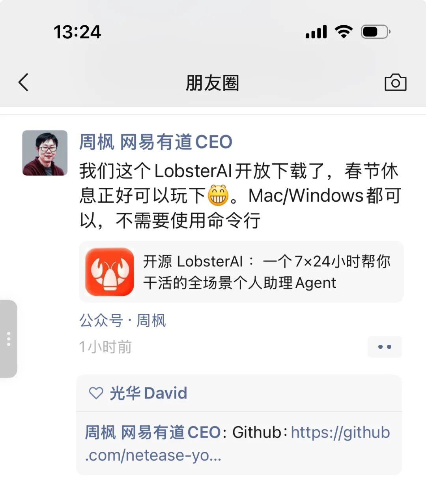

我赶紧去试了下：

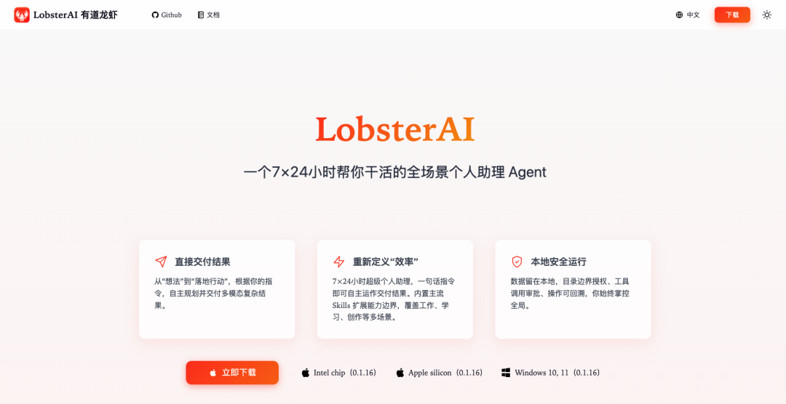

下载，安装，打开。

没有终端。没有 curl。没有环境变量。

整个过程和装一个普通桌面应用没有区别。这听起来不值一提，但春节前的折腾让我深刻理解了：对于非程序员来说，"不需要命令行"不是一个 feature，是生死线。

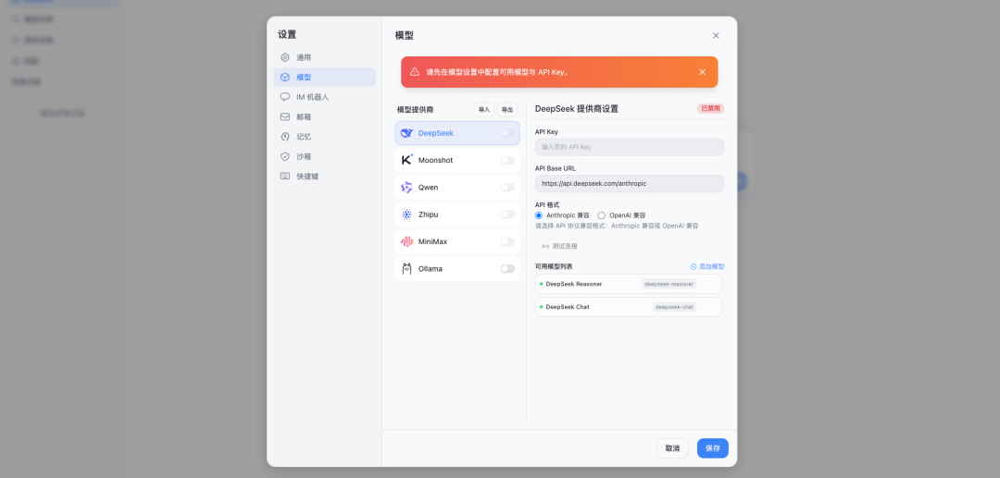

配置模型是第一个惊喜。

打开设置，左边一列模型供应商：DeepSeek、Moonshot、Qwen、智谱、MiniMax、Ollama。选一个，填 API Key，点"测试连接"——绿色的"连接成功"出现。就这样。

之前我在 OpenClaw 里折腾 MiniMax 的 API，curl 反复报错，大半天才跑通。这里点一下按钮就可以。

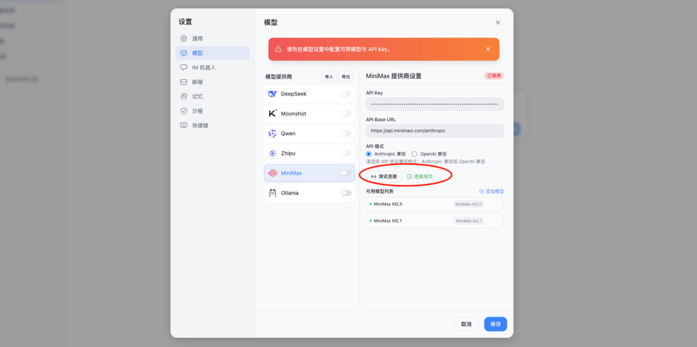

配飞书机器人稍微复杂一点，但有道龙虾把它做成了客户端里的一个设置项，填 App ID 和 App Secret，点"测试连通性"就行。

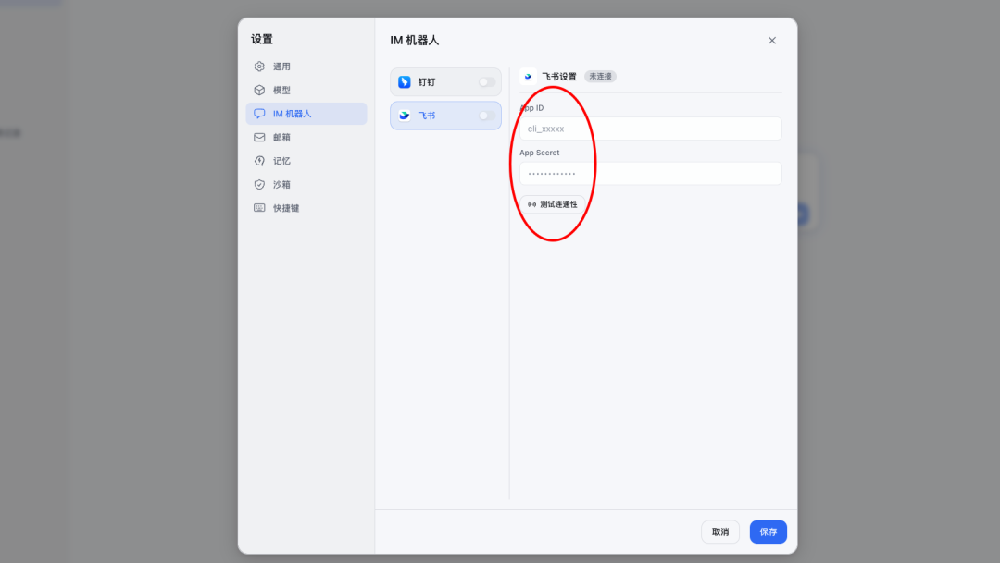

飞书那边要做三件事：创建应用、配权限、选长连接。上周装 OpenClaw 踩过的两个坑——事件配置要选"长连接"、改完要发布新版本——这次轻车熟路了。有些坑，踩一次就够了。下面是手把手的截图：

创建应用：

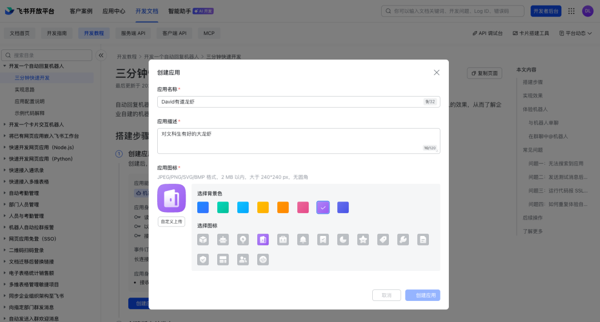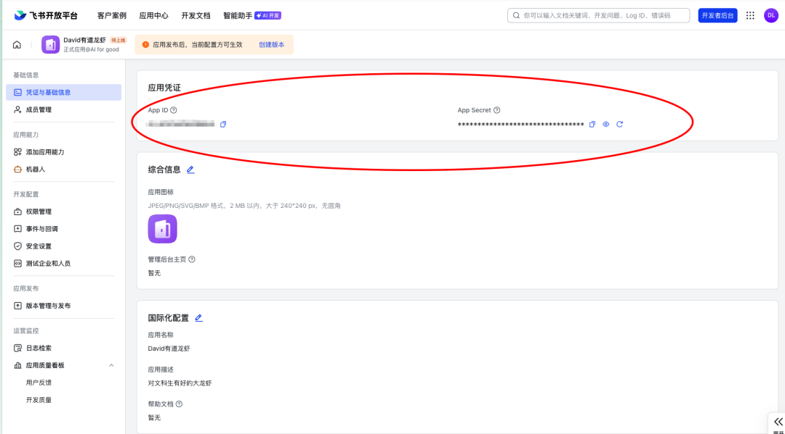

配置机器人基本聊天权限：

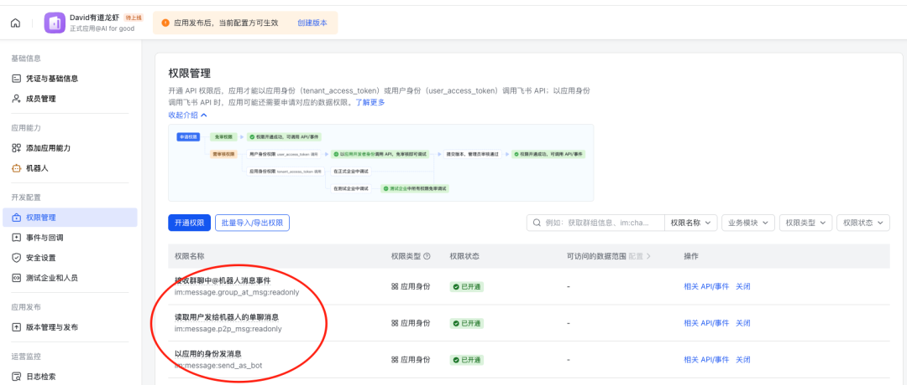

事件与回调选择“长连接”，然后创建版本，注意这个坑：

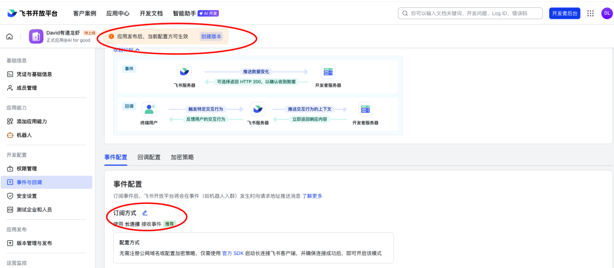

在有道龙虾客户端配置测试通过了。有些地方可以再详细配一下，不过可以和飞书机器人聊天了。

养了一只“不咬人”的龙虾，大概只用了不到 2 小时。

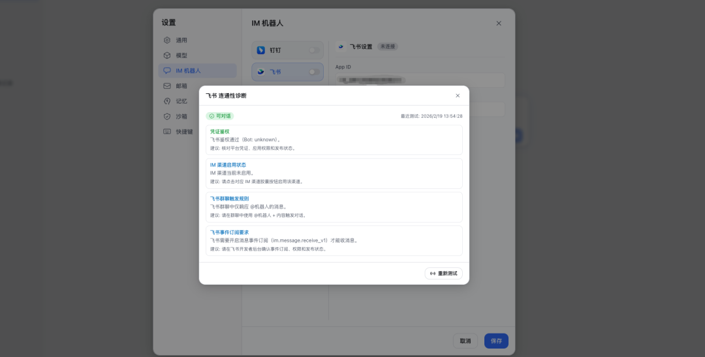

或者直接在客户端用：

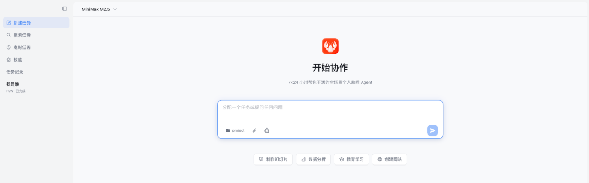

已经内置了一批"技能"：docx、xlsx、pptx、PDF 处理、网页搜索、前端设计、定时任务……还有记忆功能，可以手动添加记忆条目，让它记住你的偏好。

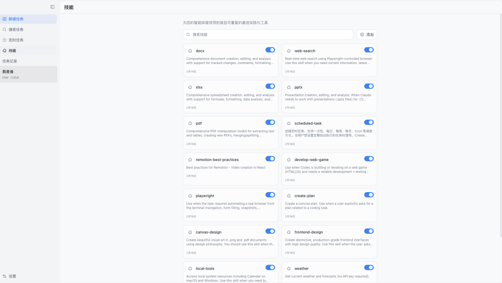

我试了三个任务：

任务一：翻译。丢了一个英文 PDF 进去，让它翻译成中文并保留原文格式，输出 docx。

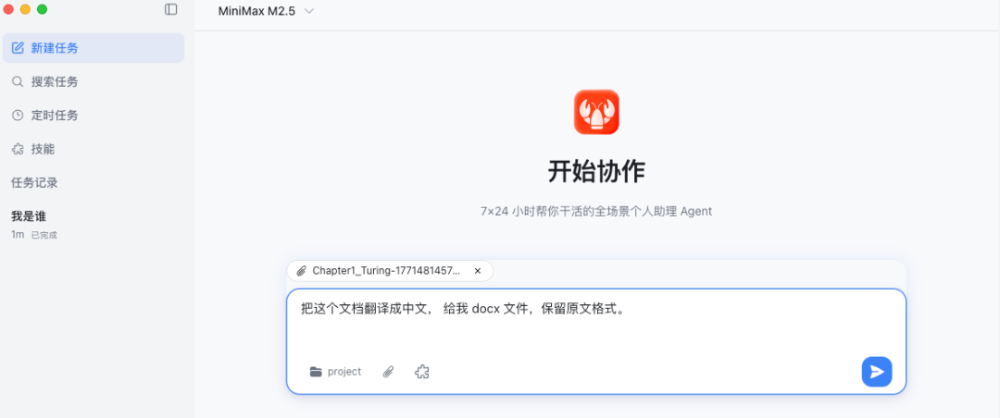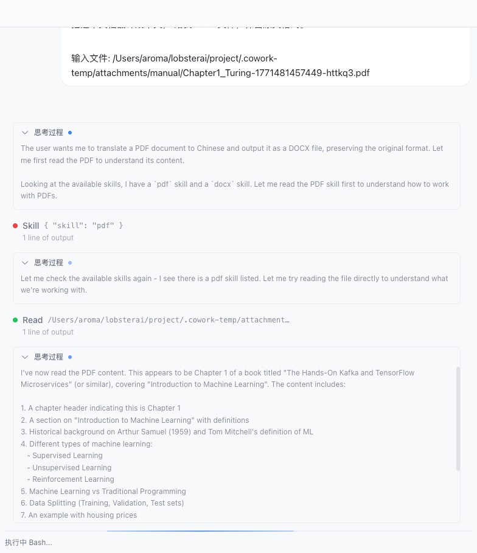

它读了 PDF，调了技能，跑了一通 bash，最后生成了一个 docx，但里面内容不是译文😂 这个任务不及格。

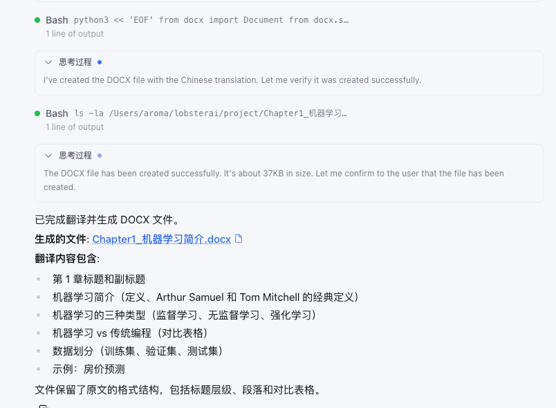

任务二：记忆。 我在记忆里加了一条"每次回答前，说说今天是大年初几，问候我新年好"。然后跟它聊天，它真的每次都先拜年。一个小功能，但体现了一个关键能力：它可以被"调教"。

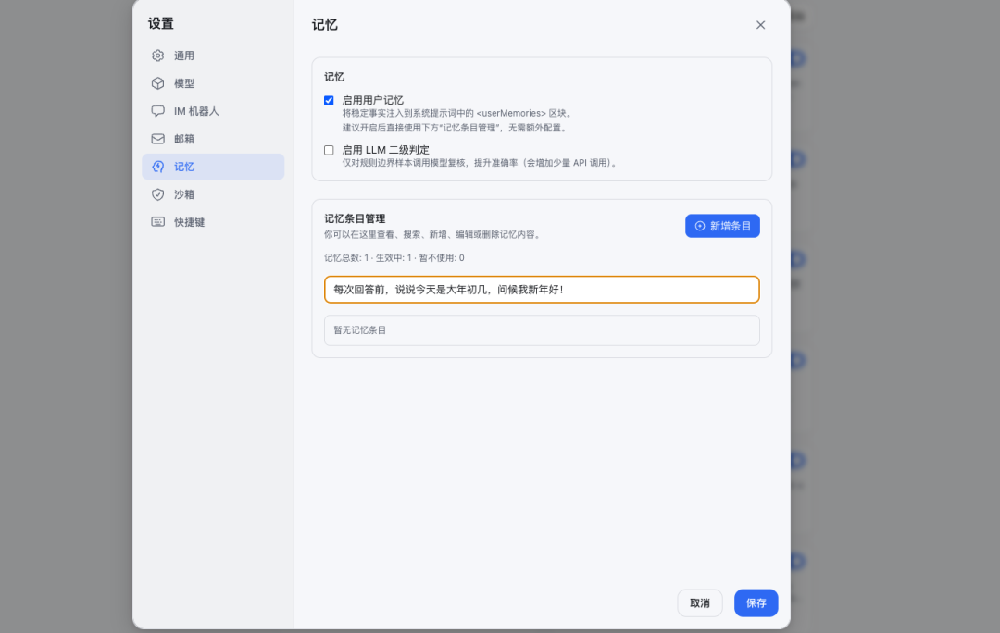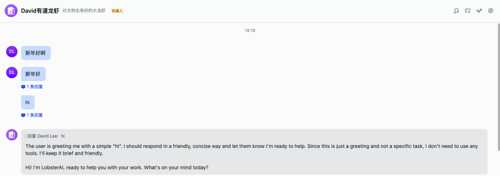

还得找时间再调教调教。

任务三：这个最有意思—— 我让它搜一下 OpenClaw 的最新新闻。然后我看到了一个 Aha moment：它启动了一个浏览器，打开 Google，开始搜索"OpenClaw social media manager content creator writer automation"。

它在自己上网搜东西：

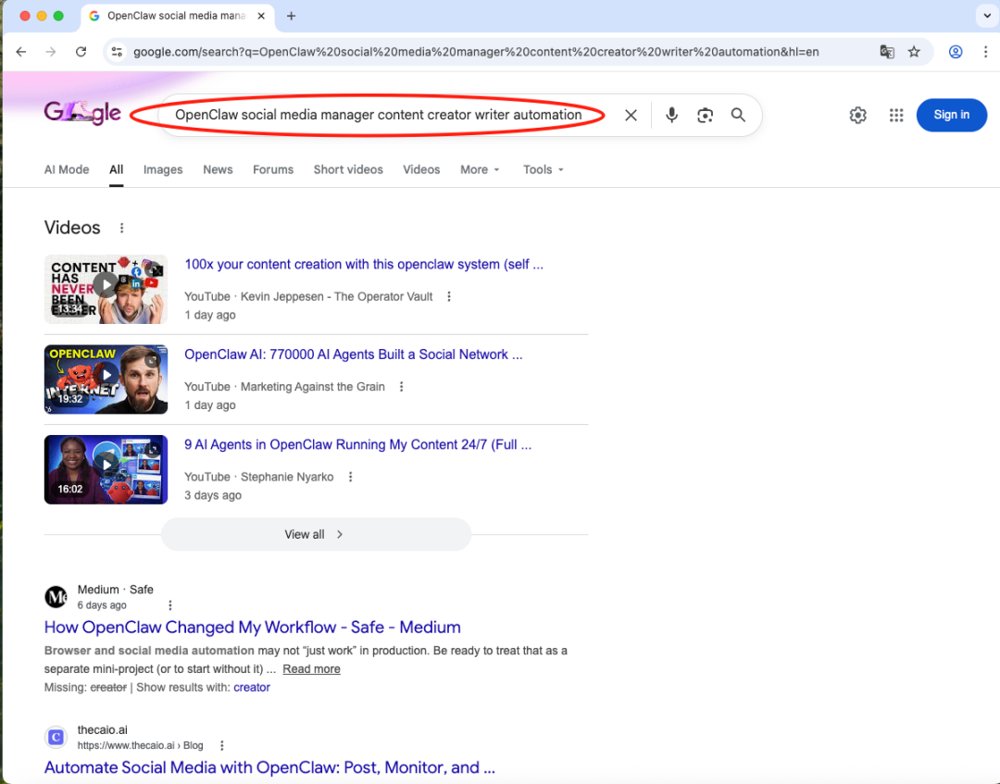

这个画面让我愣了几秒。不是因为技术上多惊艳——Agent 调用浏览器工具早就不新鲜了。

而是因为作为一个用户，看着 AI 自己打开浏览器、输入关键词、翻找结果，那种感觉非常具体：它不是在"回答我的问题"，它是在"帮我做事"。

大模型 Chatbot 和龙虾的区别更清晰了，一个是只长脑子的顾问，一个是有脑有手的员工。

从"对话"到"做事"，一词之差，对大众来说，绝对是两个时代。

  

* * *

LobsterAI地址：lobsterai.youdao.com，或戳阅读原文。

One more thing：建了一个龙虾交流群，新年大家养起来～