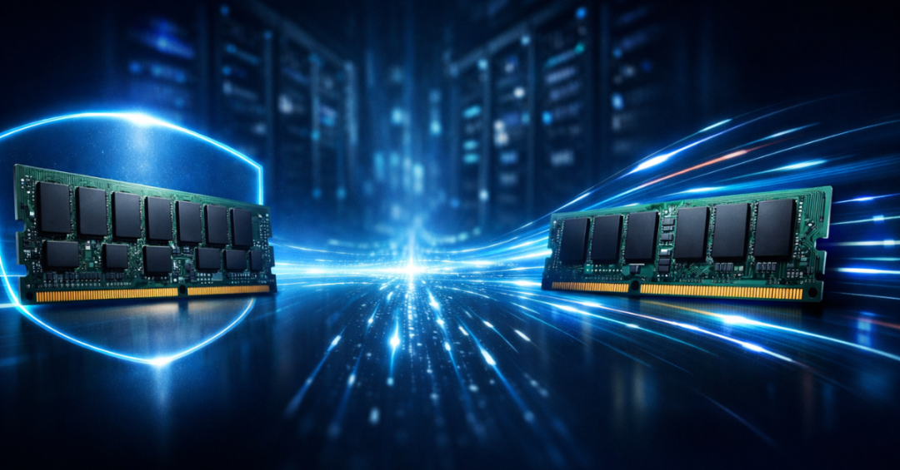
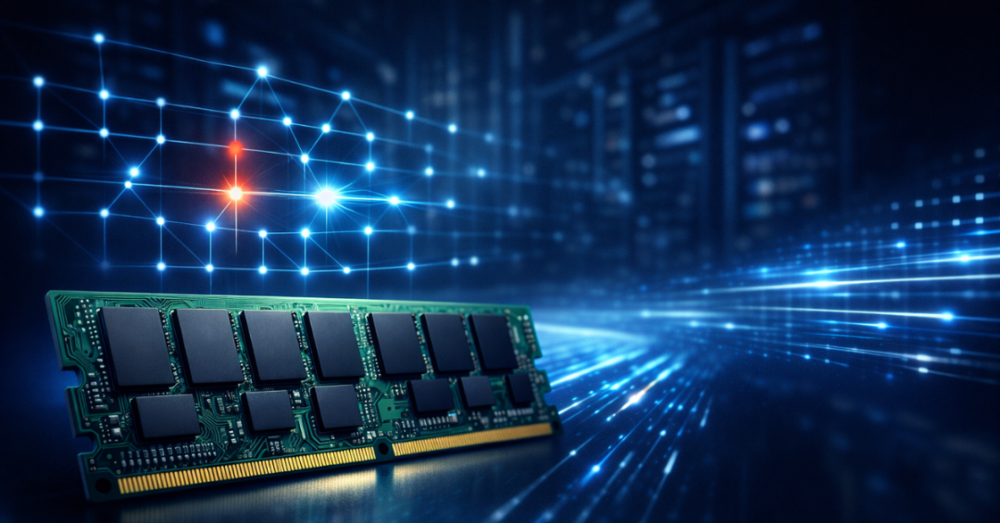
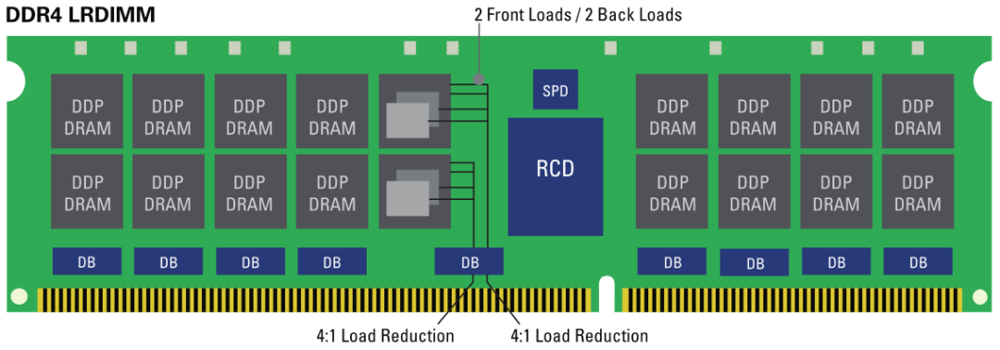
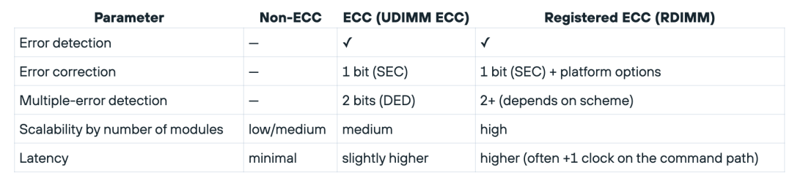
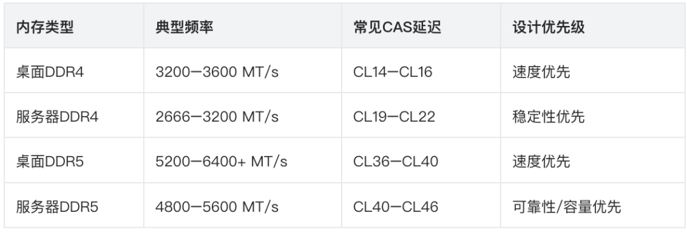
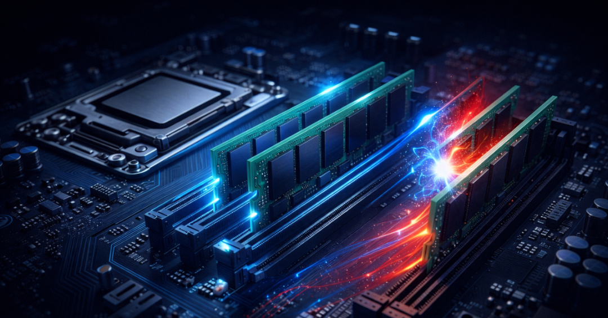
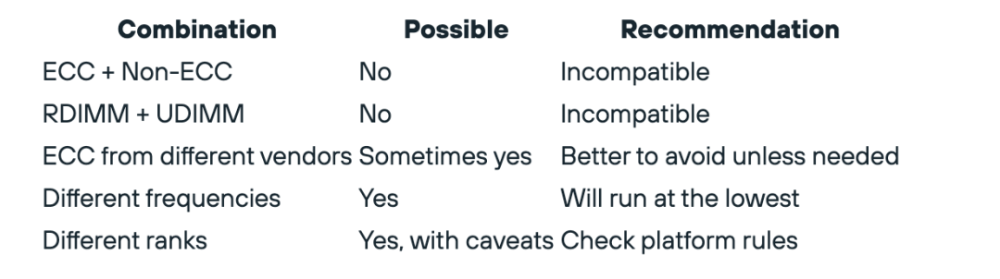
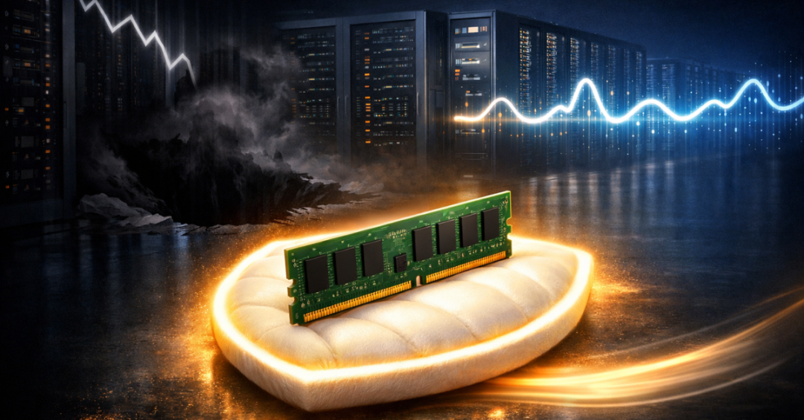
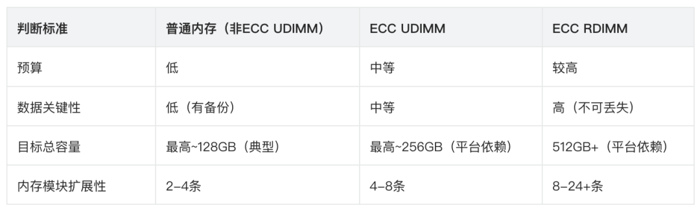
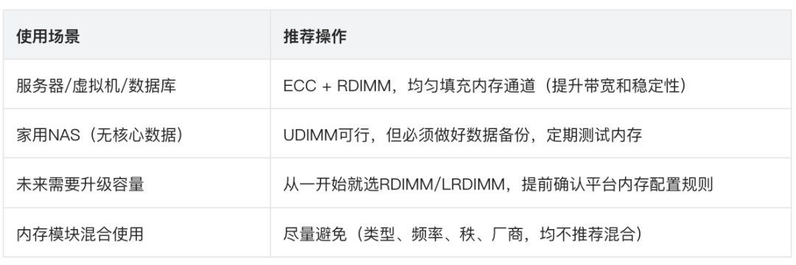

# 服务器内存与普通内存的核心差异解读

> 原文链接：[服务器内存与普通内存的核心差异解读](https://mp.weixin.qq.com/s?__biz=MzIwNTUxNDgwNg==&mid=2247496462&idx=1&sn=5d1e02b6655999499bc8149aa79b1e12&chksm=96168f2da4e7cc40f6f4c38c33015b0b9abda3bb0a4d93cb76a6805c452c06465ed824bfb5c0&mpshare=1&scene=1&srcid=0209UTC9XSALDWsJQtVOE7BJ&sharer_shareinfo=9efd42b98f5e22ee46a1b61d84250bbd&sharer_shareinfo_first=9efd42b98f5e22ee46a1b61d84250bbd#rd)

## 引言：不止是“内存”，更是两种工程逻辑的博弈

先给结论：服务器内存与普通内存（桌面端）的核心差异，从来不在“速度快慢”，而在可靠性、可扩展性的底层设计逻辑。其关键特质的优先级排序是：ECC错误校正、RDIMM/LRDIMM命令/信号缓冲支持、更严苛的验证认证、以及在大容量配置下的稳定可预测性——这四点，直接决定了它和桌面内存的应用边界。

为什么这一点至关重要？很多人误以为“内存错误”只是理论上的小概率事件，但大规模行业实测早已证实：位翻转、可校正错误在实际生产环境中频繁发生，且错误率会随内存容量、运行温度、模块使用年限的增加而显著上升。

最有说服力的案例来自谷歌：其在《DRAM Errors in the Wild》中明确提到，在一年的周期内，其服务器集群中约三分之一的机器、超过8%的内存模块（DIMM），都记录到了至少一次可校正错误。而对于企业级应用、关键业务而言，一次未被发现的内存错误，可能引发数据静默损坏、服务崩溃，甚至造成无法挽回的损失。

扩展阅读：

[SemiAnalysis：四十年一遇内存超级周期！](https://mp.weixin.qq.com/s?__biz=MzIwNTUxNDgwNg==&mid=2247496448&idx=1&sn=bb73445d77f1e2baafdc1e3dd73c389e&scene=21#wechat_redirect)

[2026存储短缺潮终结时间表曝光！](https://mp.weixin.qq.com/s?__biz=MzIwNTUxNDgwNg==&mid=2247496381&idx=1&sn=eed2105aef3bdb24789faf87c32b8503&scene=21#wechat_redirect)

[如何破解DDR内存ECC开销与可靠性困境？](https://mp.weixin.qq.com/s?__biz=MzIwNTUxNDgwNg==&mid=2247495217&idx=1&sn=72cccc534694f190efaa280af040a4ed&scene=21#wechat_redirect)

[SDXI+NVMe：存储与内存融合的下一站！](https://mp.weixin.qq.com/s?__biz=MzIwNTUxNDgwNg==&mid=2247496422&idx=1&sn=79158dedfbf70abb708fd6f8cd93709e&scene=21#wechat_redirect)

[深度解读PCIe相关内存操作原理](https://mp.weixin.qq.com/s?__biz=MzIwNTUxNDgwNg==&mid=2247493521&idx=1&sn=e263dcce1ee7ce761b172499a504a5c1&scene=21#wechat_redirect)

[突破内存墙：DRAM的过去、现在与未来](https://mp.weixin.qq.com/s?__biz=MzIwNTUxNDgwNg==&mid=2247492326&idx=1&sn=2b0f907bbd094ba42cfda5da33de2483&scene=21#wechat_redirect)

[论文解读｜数据中心内存RAS技术全景剖析](https://mp.weixin.qq.com/s?__biz=MzIwNTUxNDgwNg==&mid=2247491657&idx=1&sn=b468f5f7622744abfec6200181fd4750&scene=21#wechat_redirect)

[一文读懂DDR内存基础知识｜值得收藏](https://mp.weixin.qq.com/s?__biz=MzIwNTUxNDgwNg==&mid=2247491063&idx=1&sn=ef190fc63e99ca9895a287a67a70833a&scene=21#wechat_redirect)

一、核心架构差异：服务器内存的“保命设计”，普通内存根本没有

如果说普通内存追求“性价比+速度”，那服务器内存的核心追求就是“不出错”——哪怕为此牺牲一点极致性能。这种差异，从架构设计的源头就已经注定，其中最关键的就是ECC错误校正技术，以及在此基础上的进阶优化。### 1. ECC vs 非ECC：差的不只是“校验位”，更是数据安全底线

ECC（Error Correcting Code，错误校正码）的核心逻辑很简单：在每个数据块中额外添加“校验位”（基于奇偶校验、汉明码等算法），让系统能够实现两个关键功能：一是检测数据传输、存储过程中出现的错误；二是自动校正部分错误，避免错误扩散。

而普通桌面内存（非ECC）没有任何校验机制——一旦出现位翻转（比如0变成1、1变成0），系统无法检测，更无法校正，错误会直接传递到后续处理环节：轻则导致程序崩溃、文件损坏，重则引发系统宕机，对于数据库、虚拟机等关键应用，这种风险完全无法承受。

实际应用中，服务器内存最常用的是SECDED（Single Error Correction, Double Error Detection，单错误校正、双错误检测）机制，具体能力如下：可自动校正每个数据字中的1位错误（最常见的内存错误类型）；可检测到每个数据字中的2位错误（但无法校正，此时系统会发出告警，避免错误继续传播）。

这里有一个容易被忽略的细节：ECC的实现需要“额外的位宽”。这也是为什么，支持64位通道的ECC内存模块，实际位宽是72位——其中64位用于存储数据，8位用于存储ECC校验信息。反映在物理外观上，就是ECC内存模块每一面通常有9颗芯片（8颗数据芯片+1颗ECC校验芯片），而普通非ECC内存只有8颗芯片（仅数据芯片）。

不同内存世代的ECC位宽也有差异：金士顿等厂商的文档显示，DDR3、DDR4时代的ECC内存通常为x72位宽，而DDR5时代则出现了x72、x80两种位宽变体，核心目的是进一步提升错误检测和校正能力，适配更大容量的内存配置。### 2. 进阶优化：Chipkill与x4/x8 ECC，应对“极端错误”的双重保障

对于高端服务器平台而言，SECDED还不够——如果整个内存芯片故障（而非单个位错误），普通ECC无法应对。因此，服务器内存还会引入两种进阶方案：Chipkill（芯片失效保护）和x4/x8 ECC，进一步提升容错能力。

Chipkill的核心逻辑是“数据分片”：将数据分散存储在多个内存芯片上，同时采用“更窄的x4器件”（而非x8器件）。这样一来，即使其中一颗内存芯片完全失效，其造成的错误会被分散到多个数据字中，且每个数据字中的错误位数不会超过1位，刚好可以被SECDED机制校正——相当于实现了“单颗芯片失效不影响系统运行”的容错能力。

这里的关键的是x4器件的作用：如果使用x8器件，单颗芯片失效会导致每个数据字中出现8位错误，超出SECDED的校正范围；而x4器件将数据分片更细，单颗芯片失效仅会导致每个数据字中出现4位错误，通过算法优化后，可被ECC完全校正。当然，这种优势也有代价：需要更复杂的内存控制器、更精细的算法设计，有时还会牺牲一点容量和成本（具体取决于平台世代和厂商实现）。### 3. ECC的性能开销：网传“慢2-3%”，到底影响多大？

ECC的实现必然会带来一定的性能开销，主要来自两个方面：一是校验位占用了部分内存位宽，相当于“部分内存容量用于校验，而非数据存储”；二是内存控制器需要额外消耗算力，用于计算、校验ECC码。

扩展阅读：[如何破解DDR内存ECC开销与可靠性困境？](https://mp.weixin.qq.com/s?__biz=MzIwNTUxNDgwNg==&mid=2247495217&idx=1&sn=72cccc534694f190efaa280af040a4ed&scene=21#wechat_redirect)

但实际测试显示，这种开销通常很小——行业内的普遍共识是2-3%，且这种差异仅在“纯内存带宽受限”的场景下才会被感知到。对于绝大多数服务器应用（比如数据库、虚拟机、web服务），这种性能损失完全可以忽略，因为服务器内存的核心价值——可靠性、可扩展性，带来的收益远大于这2-3%的性能损耗。

真正影响性能感知的，其实是三个更关键的因素：是否处于内存带宽瓶颈、内存频率/时序的保守程度、以及具体的工作负载——比如HPC（高性能计算）这类对内存带宽极度敏感的场景，可能会感受到轻微差异；但对于数据库、虚拟机这类“更看重稳定性”的场景，几乎没有体感影响。### 4. RDIMM vs UDIMM：为什么服务器偏爱“带缓冲”的内存？

除了ECC，服务器内存与普通内存的另一个核心架构差异，在于“命令/地址信号的传输方式”——这也是RDIMM（Registered DIMM，注册内存）和UDIMM（Unbuffered DIMM，非缓冲内存）的本质区别。

普通桌面内存（包括大部分家用NAS、低端工作站使用的内存），几乎都是UDIMM：内存控制器（集成在CPU中）发出的命令、地址信号，会直接传输到内存芯片上，没有任何中间缓冲环节。这种方式的优势是延迟低、成本低，但缺点也很明显：当内存模块数量增多、容量增大时，信号干扰会加剧，内存控制器的电气负载会急剧增加，导致系统无法稳定运行——这也是为什么普通桌面平台通常最多支持4条内存模块，且总容量有限。

而服务器内存几乎都是RDIMM：在内存控制器和内存芯片之间，增加了一个“中间缓冲器”——RCD（Registering Clock Driver）。这个缓冲器的核心作用，是接收内存控制器发出的信号，进行“放大、整形”后，再均匀分配到每一颗内存芯片上。

这种设计的优势非常明确，也是服务器的核心需求：降低内存控制器的电气负载，避免信号干扰，让系统能够支持更多内存模块；提升信号稳定性，适配高密度、长走线的服务器机箱环境；支持更多内存模块 per 通道，实现更大的总内存容量（比如单CPU可支持24条甚至更多RDIMM，总容量轻松突破TB级）。

简单总结两者的传输逻辑：UDIMM：内存控制器 → 直接传输 → 内存芯片（延迟低、扩展性差）；RDIMM：内存控制器 → RCD缓冲器 → 内存芯片（延迟略高、扩展性极强）。

补充一点：DDR5时代的RDIMM，有一个常见的细节的——命令/地址信号在RCD端会延迟1个时钟周期，这也是为什么DDR5 RDIMM的延迟会比同规格UDIMM略高，但对于服务器而言，这种轻微延迟换来的扩展性，完全值得。### 5. LRDIMM与3DS：面向“超大容量”的终极方案

对于需要TB级甚至更高内存容量的场景（比如大型虚拟机集群、AI训练、海量数据库），普通RDIMM也无法满足需求，此时就需要两种更高级的内存模块：LRDIMM和3DS。

LRDIMM（Load Reduced DIMM，负载降低内存）在RDIMM的基础上，增加了另一层缓冲（数据缓冲器），进一步降低内存控制器的负载，支持更高密度的内存配置——简单说，LRDIMM就是“为超大容量而生”，适合对内存容量有极致需求、对延迟不敏感的场景。

3DS（3D Stacked，3D堆叠）则是另一种思路：通过TSV（Through-Silicon Via，硅通孔）技术，将多颗内存芯片“堆叠”在一起，在不增加内存模块物理尺寸的前提下，大幅提升单条内存的容量。目前，3DS技术主要应用在RDIMM、LRDIMM上（即3DS RDIMM、3DS LRDIMM），是高端服务器实现“小体积、大容量”的核心技术。

需要注意的是：不同服务器厂商的内存配置指南中，会明确区分RDIMM、LRDIMM、3DS RDIMM、3DS LRDIMM的支持范围，并非所有服务器都能兼容所有类型，选型时必须对照厂商QVL（兼容性列表）确认。## 二、规格细节对比：为什么服务器内存“看起来更弱”？

如果单看规格参数，很多人会觉得“服务器内存不如桌面内存”——比如频率更低、时序更宽松、电压也没有优势。但这背后，是服务器内存“稳定性优先”的设计哲学：与其追求极致参数，不如保证在任何场景下都能稳定运行。### 1. 电压与功耗：更低电压，更注重散热适配

内存电压的核心趋势是“世代越低，电压越低”，但服务器内存与桌面内存的电压差异，更多体现在“功耗控制的精细化”上——毕竟服务器通常是多内存模块、长时间满负载运行，功耗和散热直接影响稳定性和寿命。

各世代内存的基准标称电压（供参考）：DDR4：典型电压1.2V（VDD，核心电压）；DDR5：典型电压1.1V（VDD），且供电逻辑发生变化——DDR5内存模块上集成了PMIC，将部分供电压力从主板转移到内存模块上，进一步提升供电稳定性和功耗控制精度。

除此之外，服务器内存还会严格区分VDD（核心电压）和VDDQ（I/O电压）——前者为内存芯片核心供电，后者为内存接口供电，两者的电压调节精度、稳定性要求，远高于普通桌面内存。

更关键的是散热适配：服务器机箱通常是“高密度部署”（多CPU、多内存、多硬盘），内存的散热环境远不如桌面机箱（开放式、大风扇）。因此，服务器内存的功耗控制、散热设计（比如散热片、PCB层数），都是针对服务器的恶劣散热环境优化的，确保长时间满负载运行时，温度不会过高导致错误率上升。### 2. 频率与时序：保守，是为了“不翻车”

这是最容易被吐槽的一点：同世代的服务器内存，频率通常比桌面内存低，时序也更宽松（比如DDR4桌面内存常见3200-3600 MT/s、CL14-CL16，而服务器DDR4常见2666-3200 MT/s、CL19-CL22）。

但这并非服务器内存“性能不行”，而是刻意的保守设计——原因很简单：服务器通常需要同时安装多条内存模块（比如12条、24条），如果追求过高频率、过紧时序，信号干扰会急剧增加，导致系统无法稳定运行（甚至无法开机）。因此，服务器内存的频率、时序，都是经过厂商严格测试的“稳定值”，确保在“满配置、满负载”的场景下，依然能保持稳定，不会出现蓝屏、宕机、内存错误等问题。

这里需要破除一个误区：“服务器内存=更慢”。实际上，服务器的性能优势，从来不是单条内存的频率，而是“大容量+多通道”的组合——比如一台服务器可以安装24条32GB DDR4 RDIMM，总容量768GB，内存带宽远超桌面平台（即使单条频率略低）。对于绝大多数服务器工作负载，容量和带宽带来的性能提升，远大于单条频率的优势。### 3. 容量与密度：服务器内存的“绝对优势”

如果说频率、时序是服务器内存的“短板”，那么容量和密度就是它的“绝对长板”——这也是服务器内存与普通内存最直观的差异之一。

普通桌面内存的单条容量通常上限较低（DDR4单条最高32GB、DDR5单条最高64GB），且平台支持的总容量有限（比如普通主板最多支持4条，总容量最高256GB）；而服务器内存的单条容量、总容量支持，都远超桌面平台：单条容量：DDR4 RDIMM最高128GB、DDR5 RDIMM最高256GB，3DS LRDIMM单条容量可突破512GB；总容量：单CPU平台可支持24条甚至更多内存模块，总容量轻松突破TB级（比如24条64GB DDR5 RDIMM，总容量1.5TB）。

这种容量优势，直接决定了服务器能够运行“高内存需求”的工作负载——比如虚拟机集群（每台虚拟机需要分配一定内存，总需求巨大）、海量数据库（需要缓存大量数据，减少磁盘IO）、AI训练（需要加载大规模模型数据），这些场景是普通桌面内存完全无法支撑的。## 三、可靠性与认证：服务器内存的“品控门槛”，普通内存根本达不到

对于服务器而言，“稳定运行”比“性能强劲”更重要——毕竟一台服务器可能需要连续运行数年不关机，一旦内存出现问题，造成的 downtime（停机时间）、数据损失，成本极高。因此，服务器内存的可靠性、品控标准、兼容性认证，都远高于普通桌面内存。### 1. 测试与认证：不止是“能开机”，更是“长期稳定”

普通桌面内存的测试标准相对宽松——通常只需要通过基础的兼容性测试，确保能在主流主板上开机、运行即可，测试周期短、项目少。

而服务器内存需要经过一系列“严苛到极致”的测试，核心目的是确保“在任何环境、任何配置下，都能长期稳定运行”，主要包括：延长老化测试（Burn-in Test）：将内存模块放在高温、高负载环境下，连续运行数十甚至数百小时，检测是否出现错误；压力测试：模拟高负载、高并发场景下的内存使用，检测内存的稳定性和错误率；兼容性测试：针对特定服务器平台（CPU+主板+BIOS）进行测试，确保内存与平台完美适配，不会出现兼容性问题；环境测试：模拟服务器机箱的高温、高湿度、强电磁干扰环境，检测内存的运行稳定性。

更重要的是，服务器内存必须通过厂商的QVL（Qualified Vendor List，合格供应商列表）认证——只有通过认证的内存模块，才能被服务器厂商认可，确保在该厂商的服务器平台上稳定运行。这也是为什么，很多企业采购服务器内存时，会严格要求“必须在服务器厂商QVL列表中”——不是迷信品牌，而是为了避免兼容性问题、稳定性问题。### 2. MTBF与质保：长期使用的“保障”

服务器内存的产品定位是“长期、稳定、可替换”，因此其质保政策、MTBF（Mean Time Between Failures，平均无故障时间）也远优于普通桌面内存。

普通桌面内存的质保期通常为3-5年，MTBF通常在100万小时左右；而服务器内存的质保期通常为5-10年，MTBF可达到200万小时以上——这意味着，服务器内存出现故障的概率，远低于普通桌面内存，且在长期使用中，能够提供更可靠的保障。

需要注意的是：不同品牌、不同产品级别的服务器内存，MTBF和质保细节差异较大，选型时不能只看“平均数值”，还要结合厂商的售后能力、RMA流程——毕竟对于企业而言，内存出现故障后，快速更换、减少停机时间，比单纯的“高MTBF”更重要。

### 3. 兼容性禁忌：这些“坑”，服务器内存绝对不能踩

普通桌面内存的兼容性相对宽松——比如可以混合不同品牌、不同频率、不同时序的内存（虽然不推荐，但通常能正常开机，只是会降频运行）；但服务器内存的兼容性要求极其严格，很多“混合使用”的场景的是“硬禁止”，而非“不推荐”，一旦违反，会导致内存初始化失败、系统宕机，甚至损坏硬件。

核心兼容性规则（必看，避免踩坑）：#### （1）CPU、芯片组、BIOS必须全面支持ECC/RDIMM

ECC、RDIMM的支持，不是“内存模块单方面能决定的”，而是需要“CPU+芯片组+BIOS”三者协同支持——这是最容易被忽略的一个坑。

比如，很多桌面CPU（比如Intel Core i系列、AMD Ryzen桌面级）虽然支持部分ECC功能，但芯片组、主板不支持，因此即使插入ECC内存，也无法启用ECC错误校正；而服务器CPU（比如Intel Xeon、AMD EPYC）、服务器芯片组、服务器主板，会明确标注“支持ECC、支持RDIMM”，且需要在BIOS中开启ECC功能，才能发挥作用。

Intel官方明确说明：ECC支持需要处理器和芯片组/平台同时支持，选型时必须在具体CPU的规格页面中确认，不能仅凭“内存支持ECC”就判断平台支持。#### （2）桌面CPU通常不支持RDIMM

很多人想“给桌面电脑插服务器RDIMM，提升稳定性”，但这通常是不可行的——RDIMM的信号传输方式、初始化规则，与UDIMM完全不同，桌面CPU的内存控制器不支持RDIMM的缓冲机制，插入后会无法开机，甚至导致内存控制器损坏。

这背后还有市场细分的原因：服务器CPU/主板的核心定位是“支持大容量、高稳定性配置”，因此专门优化了对RDIMM的支持；而桌面平台的核心定位是“性价比、速度”，不需要支持RDIMM，因此内存控制器没有相关优化。#### （3）不同类型的内存，绝对不能混合使用

服务器平台上，混合不同类型的内存模块，是“致命错误”——比如混合ECC与非ECC、RDIMM与UDIMM、LRDIMM与RDIMM，都会导致内存初始化失败，系统发出致命错误告警，无法启动。

比如Intel的内存配置规则明确规定：混合DDR4不同类型的DIMM（RDIMM/LRDIMM/3DS等），会在初始化过程中触发“致命错误停机”，必须更换为同一类型的内存模块，才能正常启动。#### （4）其他混合场景的注意事项

除了“类型混合”，其他混合场景也需要谨慎，具体规则如下表所示：

## 四、性能与使用场景：什么时候必须选服务器内存？什么时候普通内存够用？

看完了核心差异，很多人依然会困惑：“我到底该选服务器内存，还是普通内存？”——答案很简单：看你的工作负载、数据 criticality（关键性）、以及对 downtime 的容忍度。没有“绝对更好”的内存，只有“更适合”的选择。### 1. 性能影响再复盘：ECC的“2-3%损耗”，到底什么时候重要？

再次强调：ECC带来的2-3%性能损耗，绝大多数场景下可以忽略不计。只有在以下三种场景下，才可能感受到轻微差异：纯内存带宽受限的场景：比如HPC（高性能计算）、视频渲染、大规模数据压缩，这类场景对内存带宽极度敏感，2-3%的损耗可能会有体感；对比场景不公平：比如用“保守频率的ECC RDIMM”，对比“超频后的桌面高频内存”——这种对比本身没有意义，因为两者的设计目标不同；平台频率下降：当服务器内存插槽完全插满时，部分平台会自动降低内存频率（为了稳定性），这种情况下的性能下降，是“平台拓扑限制”，而非ECC本身的问题。

而对于绝大多数场景（数据库、虚拟机、web服务、邮件服务器、AI推理等），ECC的性能损耗完全可以忽略，因为这些场景更看重“数据安全、系统稳定”——一次内存错误导致的服务崩溃，损失远大于2-3%的性能提升。### 2. 必须选服务器内存的5种场景（不纠结，直接冲）

如果你的使用场景符合以下任何一种，不要犹豫，直接选ECC RDIMM（或LRDIMM/3DS，根据容量需求）——这不是“浪费钱”，而是“规避风险、保障业务稳定”的必要投入。关键业务与核心数据：比如金融交易系统、医疗数据存储、工业控制系统——这类场景中，数据错误、服务停机可能导致重大损失（金钱、声誉、甚至人身安全），ECC的错误校正能力是底线保障；大容量数据库与缓存：比如企业级MySQL、PostgreSQL数据库，需要缓存大量数据减少磁盘IO——内存中的一个位错误，可能导致数据静默损坏，后续排查难度极大，且无法挽回；虚拟机集群与容器化部署：比如用VMware、K8s部署大量虚拟机/容器——每台虚拟机/容器都占用一定内存，一个内存错误可能导致单个虚拟机崩溃，甚至扩散到整个集群，影响所有业务；科学计算与仿真：比如气象仿真、药物研发、量子计算——这类场景的计算结果要求“绝对准确”，一个内存错误可能导致整个计算任务失败，浪费数天甚至数周的计算资源；长时间连续运行的服务：比如服务器需要7x24小时、全年无休运行（比如网站服务器、监控服务器）——运行时间越长，内存错误的概率越高，ECC能够自动校正错误，避免服务意外宕机。### 3. 普通内存完全够用的5种场景（省钱，不踩坑）

如果你的使用场景对“数据安全、系统稳定”的要求不高，且预算有限，普通非ECC UDIMM完全够用——只要做好备份、监控，就能规避大部分风险。家用场景：比如家庭媒体服务器、家用NAS（仅存储电影、照片，有备份）、游戏电脑——这类场景即使出现内存错误，最多是程序崩溃、重启，不会造成重大损失；开发/测试环境：比如程序员的本地开发机、测试服务器——这类场景有完整的代码备份、测试数据备份，即使出现错误，重启、恢复备份即可， downtime 成本极低；小型 hobby 服务：比如个人博客、小型论坛、 hobby 项目——用户量少、数据量小，即使服务宕机，影响范围有限，且可以快速恢复；早期阶段的小企业：比如初创公司的临时服务器，业务规模小、数据量不大，且预算紧张——可以先用普通内存过渡，但必须做好数据备份和监控，后续业务增长后再升级；对延迟敏感、容量需求低的场景：比如游戏电脑、高性能桌面工作站（仅用于设计、剪辑，有文件备份）——这类场景更看重内存频率和时序，普通桌面内存的性能优势更明显，且风险可控。

## 五、经济性分析：服务器内存更贵，到底值不值得？

这是很多人最关心的问题：服务器内存的价格通常比普通内存高30%-100%（甚至更高，取决于容量、类型），这份“溢价”到底值不值得？核心判断标准是：总拥有成本（TCO），而非单纯的“内存模块价格”。### 1. 价格差异的核心原因：不是“品牌溢价”，是“成本差异”

服务器内存的价格更高，不是因为“贴了服务器标签”，而是其研发、生产、测试的成本远高于普通桌面内存，主要体现在三个方面：ECC技术成本：ECC校验芯片、相关算法设计，会增加内存模块的硬件成本和研发成本；RDIMM/LRDIMM硬件成本：RCD缓冲器、数据缓冲器等额外硬件，以及更复杂的PCB设计，进一步提升了成本；测试与认证成本：服务器内存需要经过更长周期、更严苛的测试，以及厂商QVL认证，这些都会增加生产成本。

此外，内存市场的价格波动也会影响服务器内存的溢价——比如2025年底至2026年初，受AI驱动的内存需求激增、厂商产能向HBM/服务器内存倾斜的影响，服务器内存的价格波动明显，溢价比例有所上升。但从长期来看，服务器内存的溢价主要来自“技术和品控”，而非市场短期波动。### 2. TCO视角：“更贵”的服务器内存，可能更省钱

总拥有成本（TCO）= 内存模块价格 + 运维成本 + 故障损失成本。对于企业而言，故障损失成本（比如停机时间、数据恢复成本、工程师排查成本），往往远高于内存模块本身的价格。

举个例子：一台运行核心数据库的服务器，使用普通非ECC内存，因内存错误导致数据库崩溃、数据损坏——排查故障需要2小时（工程师人力成本），数据恢复需要4小时（停机时间，假设每小时损失1万元），数据恢复成本5000元，总损失至少6.5万元；而如果使用服务器ECC内存，ECC会自动校正错误，避免这类故障发生，即使内存模块价格贵2000元，从长期来看，也能节省大量故障损失。

这就是服务器内存的“价值所在”：它的溢价，本质上是“风险保险费”——通过支付一定的溢价，规避因内存错误导致的重大损失，提升系统稳定性，降低运维成本。### 3. 二手服务器内存：性价比之选，但必须避坑

如果预算紧张，二手服务器内存是一个不错的选择——尤其是服务器租赁到期后退回的内存模块，通常价格只有全新产品的50%-70%，性价比极高。但二手内存的风险也很大，必须做好以下4点，避免踩坑：严格匹配规格：必须对照服务器平台的QVL列表，匹配内存的型号、容量、频率、秩、类型（RDIMM/LRDIMM），甚至是厂商和part number（零件号）——避免因规格不匹配，导致无法开机或不稳定；做好 stress 测试：购买后，必须运行MemTest等内存测试工具，进行长时间（至少24小时）的压力测试，检测内存是否存在错误；开启ECC监控：在服务器BIOS中开启ECC功能，并通过系统工具（比如Intel MEMINFO、Linux edac-utils）监控ECC错误事件，确保ECC功能正常工作；选择靠谱卖家：优先选择有信誉、支持退换货、提供短期质保的卖家，避免购买到翻新、remark（重标）、故障修复的内存模块——这类内存的故障率极高，后续运维成本会更高。## 六、常见误区破除：这些关于服务器内存的谣言，别再信了！

在长期的实操和咨询中，我发现很多人对服务器内存存在误解，这些误解往往会导致选型错误、成本浪费，甚至系统故障。下面这4个最常见的误区，一次性帮你破除：### 误区1：“ECC会让系统慢很多”

真相：如前所述，ECC的性能开销通常只有2-3%，且仅在内存带宽受限的场景下才会被感知到。对于绝大多数服务器应用，这种差异完全可以忽略，而ECC带来的数据安全、系统稳定，收益远大于这一点点性能损耗。### 误区2：“只要内存支持ECC，任何主板都能用”

真相：ECC的正常工作，需要“CPU+芯片组+主板+BIOS”四者协同支持，缺一不可。比如，桌面CPU即使支持部分ECC功能，但如果主板、芯片组不支持，插入ECC内存也无法启用ECC校正，相当于“花了ECC的钱，用了非ECC的功能”。### 误区3：“RDIMM比普通内存快”

真相：恰恰相反，RDIMM因为增加了RCD缓冲器，命令/地址信号会有轻微延迟（比如DDR5 RDIMM延迟比同规格UDIMM高1个时钟周期），单条内存的速度略慢于UDIMM。RDIMM的优势不是“快”，而是“扩展性强、稳定性高”，能够支持更多内存模块、更大容量。### 误区4：“服务器内存比普通内存好，什么场景都能用”

真相：服务器内存的“好”，是针对服务器的需求（可靠性、可扩展性）而言的；对于桌面场景、家用场景，服务器内存的优势毫无意义，反而会因为频率低、时序宽松、价格高，导致“性价比极低”。比如，给游戏电脑插服务器RDIMM，不仅游戏性能会下降，还会浪费钱。### 补充细节：NVDIMM与Optane PMem，不是“普通服务器内存”

很多人会把NVDIMM、Optane PMem和普通服务器内存混淆，但实际上，它们是“内存与存储的混合形态”，应用场景非常特殊：NVDIMM（Non-Volatile DIMM，非易失性内存模块）：核心是“DRAM+备份电源/闪存”，特点是“断电后数据不丢失”——相当于“既有内存的速度，又有存储的持久性”，主要用于需要“快速掉电保护”的场景（比如金融交易、工业控制），价格极高，不是普通服务器的刚需；Intel Optane PMem（傲腾持久内存）：一种“内存级存储”，速度介于内存和SSD之间，容量大、延迟低，主要用于大规模数据缓存、虚拟机内存扩展等场景。但需要注意：Intel已正式宣布Optane PMem产品线停产，后续不再更新，选型时需谨慎，避免后续无法获得售后支持。## 七、未来趋势：DDR5、CXL、HBM，服务器内存的下一个十年

随着AI、大数据、云计算的快速发展，服务器对内存的需求（容量、带宽、延迟、可扩展性）也在不断提升，服务器内存的技术路线也在持续演进，核心趋势主要有三个：DDR5的普及、CXL的崛起、HBM的渗透。### 1. DDR5：不是“简单升级”，而是“可靠性再提升”

DDR5作为当前最新的内存世代，相比DDR4，不仅在频率、容量上有提升（比如单条容量最高256GB、频率最高8400 MT/s），更重要的是在可靠性上做了进一步优化——其中最关键的就是“On-Die ECC（片上ECC）”。

需要注意的是：DDR5的On-Die ECC，是在内存芯片内部实现的错误校正，主要用于校正芯片内部的轻微错误，无法被系统、内存控制器感知，也无法替代“模块级ECC”（即我们之前说的SECDED）。因此，服务器DDR5平台依然需要使用ECC RDIMM，才能实现“芯片级+模块级”的双重错误校正，确保数据安全——这也是为什么，服务器DDR5内存依然区分ECC和非ECC、RDIMM和UDIMM。### 2. CXL：内存“池化”，打破CPU与内存的“绑定”

CXL（Compute Express Link，计算快速链路）是一种全新的高速互连协议，核心目的是“打破内存与CPU的绑定”，实现内存的“池化、共享、扩展”——这对于云计算、AI训练等场景，具有革命性意义。

在传统服务器架构中，内存是“绑定”在单个CPU上的，其他CPU无法直接访问，导致内存资源利用率低、扩展灵活度差；而通过CXL协议，可以将多台服务器的内存整合为一个“内存池”，多个CPU、多个节点可以共享这个内存池，按需分配内存资源，大幅提升内存利用率，降低成本。

目前，CXL协议已经演进到3.0版本，支持内存池化、内存扩展、缓存一致性等功能，各大服务器厂商（Intel、AMD、IBM）、内存厂商（三星、SK海力士、美光）都在积极布局，预计未来3-5年，CXL将成为高端服务器的标配。

扩展阅读：

[PCIe/CXL布线如何重构AI数据中心互联格局？](https://mp.weixin.qq.com/s?__biz=MzIwNTUxNDgwNg==&mid=2247495656&idx=1&sn=dd672f74b0b5d0b2393ba35b6553b28e&scene=21#wechat_redirect)

[如何利用CXL技术突破内存墙？](https://mp.weixin.qq.com/s?__biz=MzIwNTUxNDgwNg==&mid=2247491021&idx=1&sn=11ff70e08e54ec3b4363cc5fac59bb6a&scene=21#wechat_redirect)### 3. HBM：AI时代的“专用内存”，间接影响服务器内存市场

HBM（High Bandwidth Memory，高带宽内存）是一种“堆叠式高速内存”，主要用于GPU、AI加速器等设备——相比普通DDR内存，HBM的带宽极高、延迟极低，能够满足AI训练、HPC等场景对内存带宽的极致需求。

扩展阅读：

[HBF凭什么能挑战HBM？](https://mp.weixin.qq.com/s?__biz=MzIwNTUxNDgwNg==&mid=2247496224&idx=1&sn=a4265e2a4f8a6a95e6666f34a3522a5f&scene=21#wechat_redirect)

[深度解析HBM：AI时代的内存革命](https://mp.weixin.qq.com/s?__biz=MzIwNTUxNDgwNg==&mid=2247495254&idx=1&sn=69a508503383ab8ed4bc8d7512f3dc41&scene=21#wechat_redirect)

[从HBM4到HBM8：下一代HBM存储革命](https://mp.weixin.qq.com/s?__biz=MzIwNTUxNDgwNg==&mid=2247494011&idx=1&sn=0b5170b1f958674ee00a61e37e2246a4&scene=21#wechat_redirect)

虽然HBM本身不是“服务器主内存”，但它对服务器内存市场的影响越来越大：随着AI需求的激增，内存厂商纷纷将产能向HBM倾斜，导致普通DDR内存（尤其是服务器DDR内存）的产能紧张，价格波动加剧。未来，服务器内存与HBM的“产能分配”，将成为影响内存市场价格、 availability（可用性）的关键因素。## 八、实操选型指南：3分钟搞定服务器内存选型，不踩坑

最后，给大家一份“实操级选型 checklist”，无论是企业采购，还是个人搭建服务器，对照这份清单，就能快速确定自己需要哪种内存，避免选型错误。### 选型核心 checklist（按优先级排序）

明确数据与 downtime 的关键性：如果数据不可丢失、服务不能停机（比如核心数据库、金融系统），直接选ECC RDIMM；如果风险可控、有备份，可考虑普通内存；确定内存容量需求：根据工作负载（虚拟机数量、数据库大小、模型规模），计算所需总内存容量，同时预留30%-50%的冗余（用于业务增长）；选择内存类型：容量≤256GB、单CPU≤8条内存，选RDIMM；容量＞256GB、单CPU≥12条内存，选LRDIMM/3DS；验证平台兼容性：对照服务器CPU、主板的QVL列表，确认内存的型号、容量、频率、类型、厂商，确保完全兼容；规划扩展空间：选型时，要考虑未来1-2年的业务增长，确保服务器主板有足够的内存插槽，且新增内存时，不需要更换现有内存（避免混合类型）；控制TCO：不要只看内存模块价格，还要考虑运维成本、故障损失成本——对于核心业务，宁愿多花一点钱，选全新、靠谱的服务器内存，也不要为了省钱，选二手、翻新内存，避免后续出现更大损失；拒绝混合使用：严格遵守“同类型、同频率、同厂商”的内存使用规则，避免混合不同类型的内存，导致系统不稳定。### 快速选型对照表（一目了然）

### 安装规则小技巧（最常用）

总结：服务器内存，买的是“稳定”，不是“速度”！

如果您也想针对存储行业分享自己的想法和经验，诚挚欢迎您的大作。
投稿邮箱：Memory_logger@163.com （投稿就有惊喜哦~）

**《存储随笔》自媒体矩阵**

如您有任何的建议与指正，敬请在文章底部留言，感谢您不吝指教！如有相关合作意向，请后台私信，小编会尽快给您取得联系，谢谢！

