# 深度解析2 | 英伟达 Rubin 平台全解析：NVLink 6+ConnectX-9+BlueField-4，构建 AI 工厂全栈架构

> 原文链接：[深度解析2 | 英伟达 Rubin 平台全解析：NVLink 6+ConnectX-9+BlueField-4，构建 AI 工厂全栈架构](https://mp.weixin.qq.com/s/ztMWQolvhwSdo21JmGiKWg?clicktime=1770344891&enterid=1770344891&exptype=unsubscribed_card_recommend_article_u2i_mainprocess_coarse_sort_pcfeeds&ranksessionid=1770344882_1&req_id=1770342502389067&scene=169&subscene=200)

# 上回我们聊了RUBIN架构的部分核心组件，[#Nvidia]()&nbsp;[#英伟达]()&nbsp;[#VERA]()&nbsp;CPU,&nbsp;[#Rubin]()&nbsp;GPU，[#NVLink6]()

# 传送门：[深度长文：英伟达 Rubin 平台深度解析 | 六芯合一，重构 AI 超级计算机新范式（1/2）](https://mp.weixin.qq.com/s?__biz=MzkxODIwMzIyNA==&mid=2247484692&idx=1&sn=a4d5dee44891d70ca254b40bc83345cc&scene=21#wechat_redirect)

# 今天我们讲剩下的三大组件NVLink 6+ConnectX-9+BlueField-4

在AI工厂规模下，数据通信是决定性能的核心瓶颈。混合专家模型（MoE）路由、集合运算、高同步训练及推理任务，均依赖高速、可预测的全对全数据传输。当纵向扩展带宽不足时，GPU将陷入闲置状态，单位令牌成本随之攀升。NVIDIA Rubin平台通过四大核心组件的深度协同，构建了从机架内纵向扩展到跨数据中心横向扩展的全栈解决方案，实现AI工作负载的高效规模化部署。## NVLink 6 交换机：机架级纵向扩展互联架构

NVLink 6作为Rubin平台的纵向扩展互联方案，旨在彻底消除通信瓶颈，使NVL72系统内的72颗Rubin GPU形成单一紧密耦合的加速器，在通信密集型工作负载下保持均匀延迟与持续带宽。

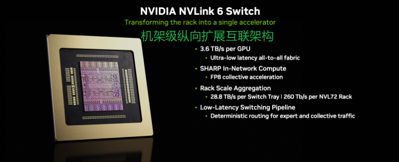

每颗Rubin GPU通过NVLink 6实现3.6 TB/s的双向带宽，较上一代实现单GPU纵向扩展带宽翻倍。NVLink 6交换托盘在机架内构建全对全拓扑结构，确保任意两颗GPU间的通信均具备一致的延迟与带宽特性，消除了层级瓶颈和路径依赖带来的性能波动。从软件视角看，整个机架可视为一台大型加速器，大幅简化了通信密集型模型的扩展难度。

在MoE训练与推理场景中，专家并行（EP）依赖细粒度、动态的令牌路由，易产生突发通信流量，对传统层级或部分连接架构构成巨大压力。NVLink 6的全对全架构可支撑72颗GPU高效完成专家路由、同步及集合运算，不会出现链路饱和或延迟不稳定问题，其全对全操作吞吐量较上一代提升高达2倍。

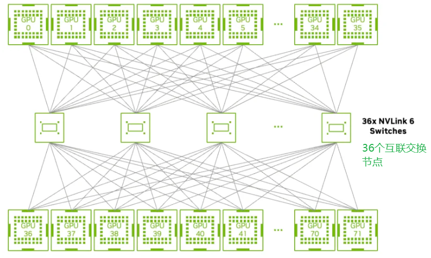

此外，NVLink 6集成NVIDIA可扩展分层聚合归约协议（SHARP）网内计算能力，可在互联架构内部直接加速集合运算。交换托盘可提供14.4 TFLOPS的FP8网内计算性能，将全归约、归约散射、全聚集等操作的部分流程卸载至交换机执行，减少冗余数据传输及GPU同步开销，可使全归约通信流量降低50%，大规模AI工作负载的张量并行执行时间缩短20%（结果取决于模型架构、并行策略、参与节点数及NCCL配置）。

在可运维性方面，NVLink 6交换托盘具备热插拔、机架部分配置时持续运行、交换机离线时动态流量重路由等特性，支持在线软件更新及细粒度链路遥测，可满足AI工厂零停机运行的核心需求。### ConnectX-9：AI横向扩展带宽的智能端点

ConnectX-9作为Spectrum-X以太网架构的智能端点，为AI工厂的横向扩展提供可预测性能，同时保障流量隔离与安全运行。在Vera Rubin NVL72机架架构中，每个计算托盘配备4块ConnectX-9超级网卡，为每颗Rubin GPU提供1.6 Tb/s的网络带宽，确保GPU在专家调度、集合运算及同步过程中不会因网络边缘瓶颈受限。

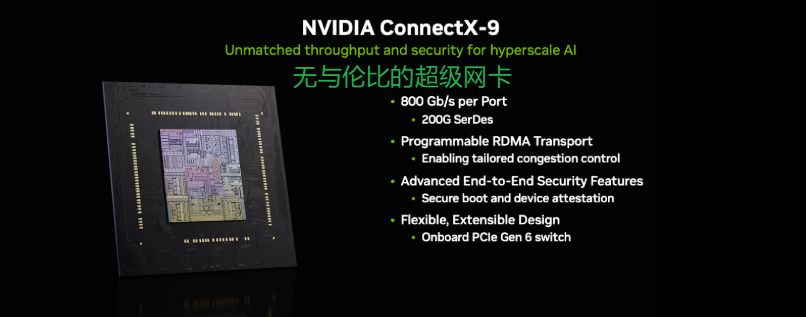

针对AI工作负载的突发流量特性——大量GPU同时注入数据易引发瞬时拥塞高峰，ConnectX-9通过可编程拥塞控制、流量整形及数据包调度功能，与Spectrum-6交换机协同工作，从源头避免拥塞形成，而非在队列堆积后被动响应。这一协同机制可平滑全对全阶段的流量注入，减少线头阻塞及受害流影响，在负载压力下维持高有效带宽。

在多租户AI工厂中，工作负载整合使得隔离性与吞吐量同等重要。ConnectX-9在端点层面强制执行公平性与隔离策略，确保每个任务或租户均可获得可预测的网络性能，不受其他工作负载活动影响，为推理、训练及训练后任务的并发运行提供支撑。同时，其集成加密引擎支持IPsec、PSP协议的数据传输加密及存储加密，结合安全启动、固件认证与设备认证功能，在不牺牲性能的前提下保障AI基础设施的安全性。### BlueField-4 DPU：AI工厂的操作系统核心

当AI基础设施扩展至数千颗GPU及PB级数据规模时，需具备云级别的自动化、弹性与端到端安全性。BlueField-4 DPU作为AI工厂的专用基础设施处理器，独立承担控制、安全、数据传输及编排任务，脱离AI计算核心，成为驱动AI工厂操作系统的核心组件。

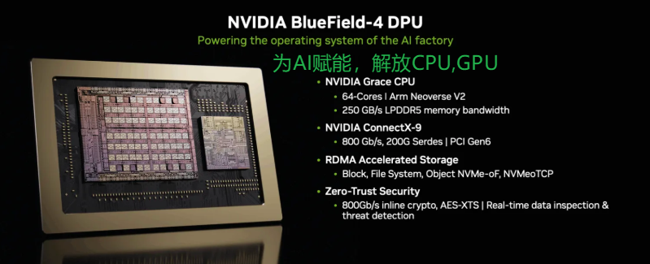

在Rubin平台中，BlueField-4作为软件定义的控制平面，独立于主机CPU与GPU执行安全策略、隔离机制及运维确定性保障。其集成64核Grace CPU、高带宽LPDDR5X内存及ConnectX-9网络模块，可提供高达800 Gb/s的超低延迟以太网或InfiniBand连接，同时在DPU上直接运行基础设施服务，较上一代实现带宽、计算能力及内存性能的全面跃升，支撑AI工厂的租户与服务规模化扩展。

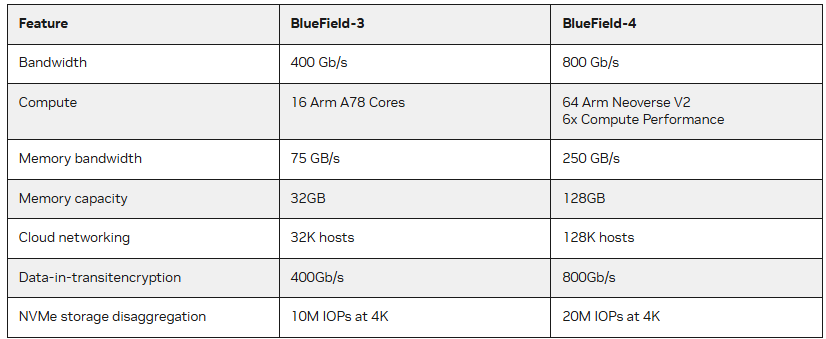

BlueField-4将网络、存储、遥测及安全服务完全卸载至专用处理层，摆脱对主机CPU的依赖，实现基础设施行为与工作负载的解耦，提升GPU与CPU的AI计算利用率，增强故障隔离与运维弹性。NVIDIA DOCA软件框架为其提供统一软件基础，支持基础设施服务的复用与快速创新。

针对多租户安全需求，BlueField-4引入高级安全可信资源架构（ASTRA），在计算托盘内建立可信域，为AI基础设施提供安全配置、隔离及运维的统一可信控制点，支持安全裸金属部署与强多租户隔离。此外，其驱动的NVIDIA推理上下文内存存储方案，构建AI原生存储层，扩展GPU内存容量并支持跨节点高速共享，使长上下文、多智能体推理任务的令牌吞吐量提升5倍，能效提升5倍。### Spectrum-6 以太网交换机：跨域扩展的以太网架构

AI工厂的扩展需突破单NVL72系统限制，实现跨数据中心部署，此时网络的可预测性与带宽同等重要。Spectrum-6以太网交换机基于共封装光学技术，构建新一代Spectrum-X以太网架构，专为AI工作负载的同步、突发特性设计。

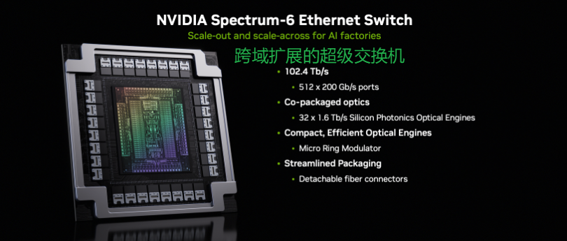

Spectrum-6通过200G PAM4串行器/解串器，将单交换芯片带宽翻倍至102.4 Tb/s，支持高密度端口配置，结合细粒度遥测与硬件辅助性能隔离，在大规模多租户AI架构中实现确定性性能，同时保持完全标准化与开放网络软件互操作性。

Spectrum-X以太网架构通过高级拥塞控制、自适应路由及无损以太网技术，在规模化部署中最小化抖动、尾部延迟及数据包丢失。其集成的Spectrum-XGS跨域扩展技术，为地理分布式AI部署提供距离感知拥塞控制，通过端到端遥测与确定性路由实现跨站点负载均衡。

Spectrum-X以太网光子技术通过集成硅光子学与外部激光阵列，取消可插拔光模块与DSP重定时器，使网络能效提升5倍，端到端延迟降低，信号完整性从约22 dB优化至4 dB（提升64倍）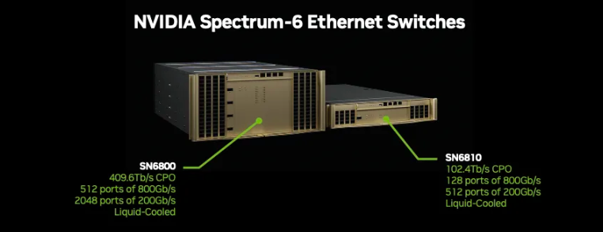

同时简化运维并降低总体拥有成本。针对MoE训练与推理的突发全对全流量，其通过交换机与端点的协同拥塞控制及自适应路由，显著缩短任务完成时间。

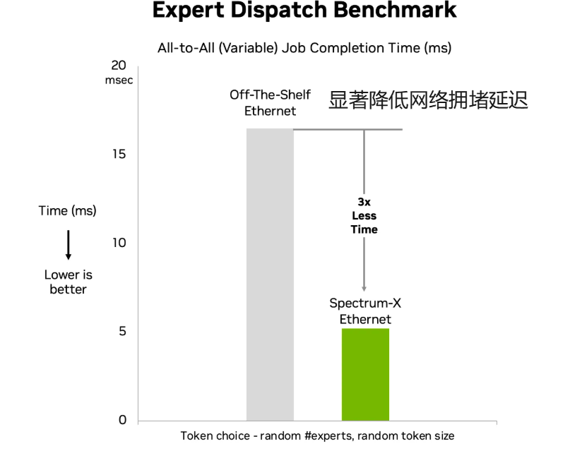

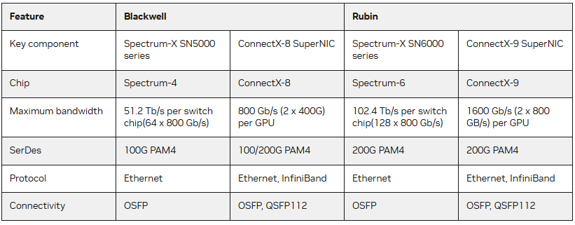 ## 从芯片到系统的架构演进

AI工厂的性能并非由单一芯片决定，而是取决于芯片如何组合为可部署、可运维、可扩展的系统。Rubin平台遵循“芯片级创新→机架级系统→AI工厂部署”的演进逻辑，在扩展过程中保持芯片级的效率、一致性与利用率优势。### NVIDIA Vera Rubin 超级芯片：基础计算构建块

Vera Rubin超级芯片是Rubin平台的核心计算单元，通过内存一致性NVLink-C2C互联，将两颗Rubin GPU与一颗Vera CPU紧密集成，打破传统CPU-GPU边界，形成统一的机架级执行域。这一设计延续了NVIDIA Grace Hopper的核心理念，通过计算、内存与互联的协同优化，在真实训练与推理工作负载中维持高利用率。

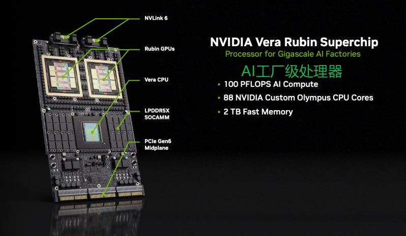

其中，Vera CPU作为与GPU紧密耦合的数据引擎，实现低延迟协同、共享内存访问及跨训练、推理阶段的高效编排，直接参与执行流程，负责数据传输、调度、同步任务，避免引入额外瓶颈。通过在单主板上集成GPU计算与高带宽CPU数据引擎，超级芯片提升了数据局部性，降低了软件开销，在异构执行阶段保持高利用率，搭建起芯片创新与机架智能的架构桥梁。### Vera Rubin NVL72 计算托盘：可部署模块化单元

计算托盘将Vera Rubin超级芯片转化为适配AI工厂规模的可运维单元，每个托盘集成两颗超级芯片，同时整合供电、冷却、网络及管理模块，形成无电缆模块化组件，优化密度、可靠性与运维效率。

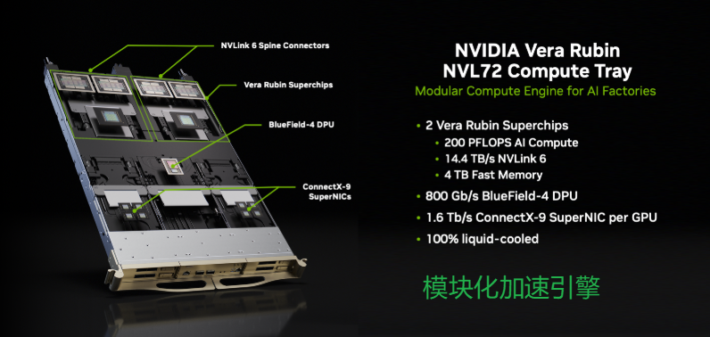

其重新设计的内部液体歧管与通用快速断开接口，支持较上一代更高的流量速率，确保在持续高功耗工作负载下的性能稳定性。模块化设计通过独立前后舱简化组装与维护流程，虽需离线维护，但无电缆结构使服务时间缩短18倍。

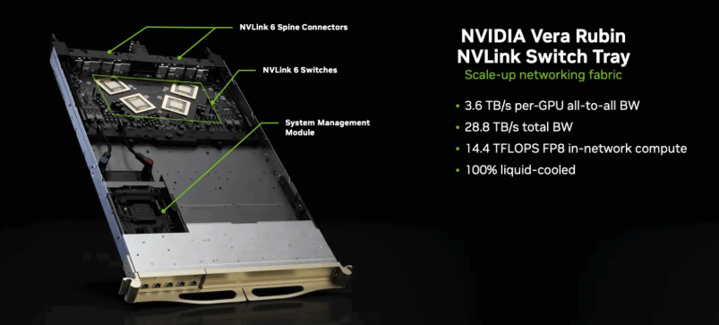

托盘内置的ConnectX-9超级网卡提供高带宽横向扩展连接

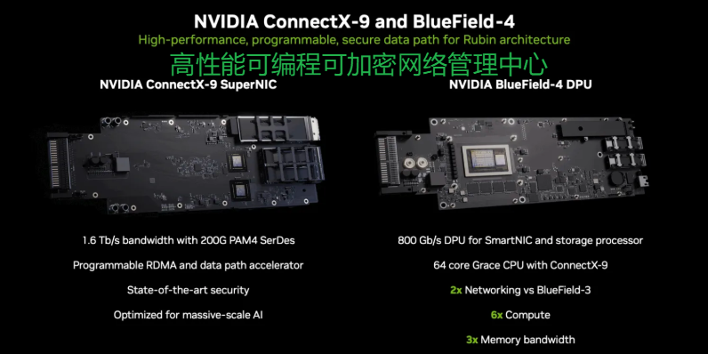BlueField-4 DPU则卸载网络、存储及安全服务，保障CPU与GPU专注于AI计算任务。

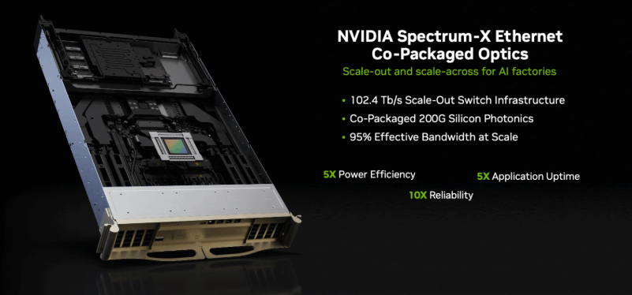

### Vera Rubin NVL72 NVLink 交换托盘：机架内协同核心

NVLink 6交换托盘将多个计算托盘整合为单一协同系统，每个托盘集成四颗NVLink 6交换芯片，实现单GPU纵向扩展带宽翻倍，同时提升网内计算能力以加速集合运算。

这一设计对MoE路由、高同步推理及通信密集型训练至关重要，直接决定了大规模工作负载的成本与延迟表现。通过将纵向扩展互联作为机架核心组件，确保性能随模型规模、批次大小及推理深度的增长而可预测扩展。### NVIDIA DGX SuperPOD：AI工厂部署单元

DGX SuperPOD作为Rubin平台的部署级蓝图，由八套DGX Vera Rubin NVL72系统组成，定义了AI工厂在生产环境中实现经济性、可靠性与性能平衡的最小单元。与传统离散组件集群不同，DGX SuperPOD作为完整系统设计，从芯片、互联到编排软件的每一层均经过协同设计与验证，实现规模化下的持续利用率、可预测延迟及高效功耗-令牌转换。

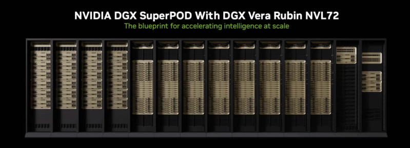

在架构协同上，NVLink 6使单机架内72颗GPU形成统一加速器，Spectrum-X以太网将这一能力扩展至跨机架、跨数据中心场景，结合NVIDIA Mission Control软件及认证存储，构建起经过验证的生产级AI工厂构建块，可扩展至数万颗GPU规模，支持训练、推理任务的持续运行、高可用运维与一致性能输出。

喜欢的朋友点赞关注加星标，转发到群共同学习

下一节继续深度讲解rubin架构的软件开发相关的信息

