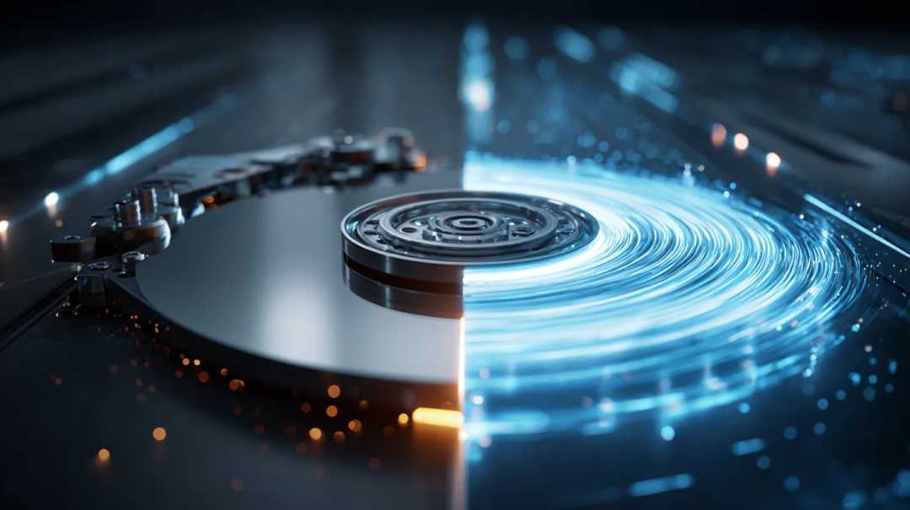
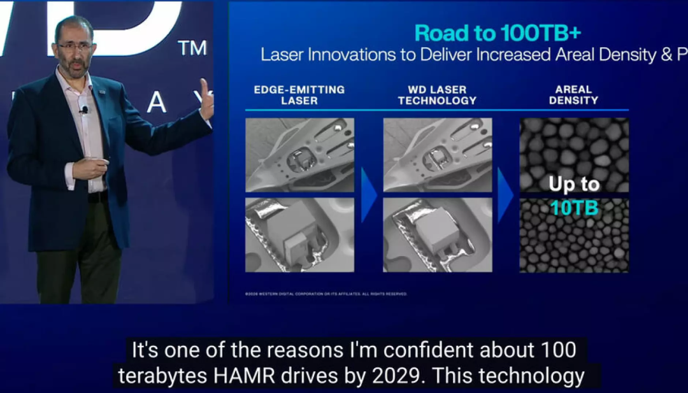
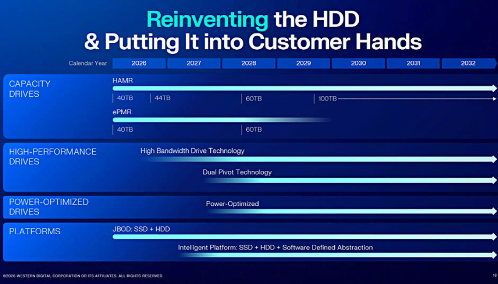

作为一名深耕存储行业多年的科技博主，我始终坚信一个判断：在AI引爆的海量数据时代，机械硬盘（HDD）非但不会被SSD淘汰，反而会在容量赛道上迎来新一轮的技术爆发。

就在2026年2月的创新日活动上，西部数据（WD）用一项重磅技术落地，彻底印证了这个判断——全新的14碟硬盘技术正式官宣，相比当前在售的11碟产品，单盘容量上限直接提升27%，更给整个HDD行业的容量竞赛，投下了一颗足以改变竞争格局的重磅炸弹。

  

扩展阅读：

[CDL｜大容量HDD如何突破I/O密度瓶颈？](https://mp.weixin.qq.com/s?__biz=MzIwNTUxNDgwNg==&mid=2247496418&idx=1&sn=35dac692497bfadf76820e9305acf353&scene=21#wechat_redirect)

[是“浴盆曲线”失灵，还是HDD变好了？](https://mp.weixin.qq.com/s?__biz=MzIwNTUxNDgwNg==&mid=2247494753&idx=1&sn=476d61e93f160a538f2a6898493ea06b&scene=21#wechat_redirect)

[HDD可靠性与故障率的影响因素评估](https://mp.weixin.qq.com/s?__biz=MzIwNTUxNDgwNg==&mid=2247493920&idx=1&sn=336a945a53573f3ee6f5266979283971&scene=21#wechat_redirect)

[HAMR硬盘高温写入的可靠性问题](https://mp.weixin.qq.com/s?__biz=MzIwNTUxNDgwNg==&mid=2247494102&idx=1&sn=61220639d4cb6008aaeda5b8e844822d&scene=21#wechat_redirect)

[1亿IOPS SSD？别开玩笑了！](https://mp.weixin.qq.com/s?__biz=MzIwNTUxNDgwNg==&mid=2247496541&idx=1&sn=deedc58c90c6b3dbc3dab6df2b4c054c&scene=21#wechat_redirect)

[SSD上电过程中DDR Training解读](https://mp.weixin.qq.com/s?__biz=MzIwNTUxNDgwNg==&mid=2247495986&idx=1&sn=962320e8f9f3d3fc5bd58e72d3654bfa&scene=21#wechat_redirect)

[Backblaze 2025全年硬盘故障率报告解读](https://mp.weixin.qq.com/s?__biz=MzIwNTUxNDgwNg==&mid=2247496579&idx=1&sn=72c72f2f7a7badc12a775c8f9fd1fff0&scene=21#wechat_redirect)

  

* * *

一、14碟技术，到底突破了什么？

在聊技术细节之前，我们先给非专业读者补一个最核心的公式：机械硬盘的标称容量=单碟容量×碟片数量。

  

HDD的容量升级，从来只有两条核心路线：

  * 激进路线：死磕面密度，提升单碟容量，挑战磁记录的物理极限；
  * 稳健路线：在标准3.5英寸硬盘的固定尺寸内，塞进更多碟片，用工程优化换容量冗余。

  

而西部数据这次的14碟技术，就是第二条路线的极致突破。

先看行业现状：目前西部数据量产出货的旗舰企业级硬盘Ultrastar HC690 32TB，采用的是11碟设计，单碟容量2.91TB；核心竞品希捷的Exos M 32TB，采用10碟设计，依靠HAMR热辅助磁记录技术做到单碟3.2TB；东芝虽已演示12碟技术，但量产出货仍停留在10碟水平。

  

也就是说，行业主流的商用碟片数量，长期停留在10-11碟的水平。而西部数据直接把这个数字拉到了14碟——在标准3.5英寸硬盘的盘体里，硬生生多塞了3张碟片，可记录的盘片表面积直接提升了约27%，这也是官方宣称容量上限提升27%的核心来源。

  

很多人会问：不就是多塞几张碟片吗？有什么技术门槛？

  
这里必须纠正一个误区：3.5英寸企业级硬盘的内部空间是固定的，每增加一张碟片，都要攻克一整套工程难题：

  * 更薄的盘片与磁头：必须压缩碟片厚度、读写磁头的占用空间，这次西部数据正是通过超薄读写磁头技术，才给额外3张碟片腾出了空间；
  * 振动与稳定性控制：14张碟片以7200转/分钟的高速同步旋转，共振、振动偏移会被指数级放大，必须重新设计主轴电机、磁头臂伺服系统，保证磁头寻道的纳米级精度；
  * 功耗与散热平衡：更多碟片意味着更高的电机功耗与发热量，必须配套优化固件与硬件设计，满足数据中心的功耗与散热规范。

  

换句话说，14碟技术不是简单的“堆料”，而是机械硬盘结构工程的一次全面升级。

## 二、路线博弈：西部数据VS希捷，两条赛道的生死竞速

这次14碟技术的发布，最核心的影响，是彻底改写了西部数据和希捷两大巨头的容量竞赛规则。

  

我们先看两家的核心路线差异：

  * 希捷的核心逻辑：固定10碟设计，死磕面密度。依靠领先的HAMR热辅助磁记录技术，不断提升单碟容量，用更少的碟片追平容量，优势是物料成本（COGs）更低，零件更少；
  * 西部数据的核心逻辑：先拉满碟片数量，降低面密度的升级压力。用更成熟的ePMR能量辅助垂直磁记录技术，先靠碟片数量拿到容量优势，再同步推进HAMR技术，用工程冗余对冲物理极限的风险。  

  

我们用一组数字，就能清晰看到两条路线的难度差距：

  
如果两家都要在2029年实现100TB的旗舰容量目标：

  * 西部数据依靠14碟设计，只需要做到单碟7.14TB，相比当前2.91TB的单碟容量，面密度仅需提升155%；
  * 希捷如果坚持10碟设计，必须做到单碟10TB，相比当前3.2TB的单碟容量，面密度需要提升213%。

  

60个百分点的差距，背后是天差地别的研发难度。  
  

磁记录面密度的提升，本质上是和超顺磁极限做对抗：磁道越窄、比特单元越小，数据就越容易因热扰动丢失。HAMR技术虽然能通过激光加热稳定磁畴，但每一次面密度的跃升，都需要在激光模块、磁头介质、信号处理、固件纠错等全链条实现突破，边际难度呈指数级上升。

  

而西部数据的14碟技术，相当于给自己留足了技术缓冲带。不用把面密度逼到物理极限的墙角，就能实现和竞品相同的容量目标，研发风险更低、量产落地更快、成本控制更灵活。

  

更值得注意的是，西部数据并没有放弃面密度的升级。在创新日上，其首席产品官Ahmed Shibab明确表示，公司将在2028年通过全新的超薄激光技术，实现单碟10TB的面密度。如果把这个单碟容量和14碟技术结合，单盘容量直接就能冲到144TB——这是当前旗舰32TB硬盘的4.5倍，这个数字足以让HDD在大容量冷存储市场，继续对SSD保持碾压级的成本优势。

## 三、 roadmap全解析：40TB今年落地，100TB 2029年见

很多人会问：14碟技术是不是画大饼？我们直接看西部数据公布的、可落地的硬盘路线图，每一步都有明确的时间节点：

  * 2026年年内：40TB硬盘正式量产，同步推出ePMR和HAMR双版本，年底跟进44TB HAMR版本。这里要划重点：40/44TB版本将采用11碟×4TB的设计，相当于先在现有11碟平台上完成单碟容量的升级验证，为后续14碟技术的全面落地铺路；
  * 2028年：60TB硬盘落地，同样提供ePMR和HAMR双版本，这也是ePMR技术的最后一次大版本升级；
  * 2029年：100TB HAMR硬盘正式发布，采用14碟×7.14TB的设计，同时ePMR技术正式退出旗舰路线，完成历史使命。

我们可以算一笔账：如果西部数据用现有成熟的ePMR技术，直接落地14碟设计，就能做到14×2.91TB=40.7TB的容量，相比当前32TB的旗舰产品，直接实现27%的容量跃升，这就是技术路线带来的实打实的优势。

  

更关键的是，这条路线给企业级客户提供了极其平滑的升级路径：不用立刻切换到全新的HAMR技术平台，就能拿到40TB级的大容量硬盘，兼容现有存储架构，大幅降低升级成本。这对于云厂商、超大规模数据中心这类核心客户来说，有着致命的吸引力。

## 四、行业终局：HDD不会死，它是海量数据的终极粮仓

这次14碟技术的发布，也彻底击碎了“机械硬盘即将淘汰”的论调。

  

在AI大模型、短视频、自动驾驶引爆的ZB级数据时代，全球80%以上的冷数据、温数据，最终都要存放在机械硬盘里。核心原因只有一个：HDD的每TB成本，至今依然是SSD的1/5甚至更低，容量越大，成本优势越明显。

  

西部数据的14碟技术，相当于给HDD行业续上了关键的一口气：

  * 它把HDD的容量天花板，从当前的30TB级，直接拉到了未来的100TB+甚至144TB级，进一步拉开了和SSD的容量差距；
  * 它降低了面密度升级的激进程度，让HDD的技术迭代更稳健，量产落地更快，生命周期至少延长了5-10年；
  * 它倒逼整个行业进入“碟片数量+面密度”双升级的新阶段，未来我们大概率会看到希捷、东芝跟进提升碟片数量，整个HDD行业的容量竞赛将再次提速。

## 五、博主预判：希捷的反击，与HDD行业的未来

最后，说说我对这次技术发布的几个核心判断：  
第一，希捷大概率会在1-2年内跟进提升碟片数量。虽然10碟设计有成本优势，但面对西部数据的容量碾压，以及面密度升级的指数级难度，坚持10碟设计的代价会越来越大，12碟甚至14碟的设计，已经成为希捷不得不走的路。  
  

第二，2026年将成为HDD容量跃升的元年。40TB级硬盘的量产落地，会直接推动冷存储成本的大幅下降，进一步刺激AI时代海量数据的存储需求，形成正向循环。  
  

第三，ePMR与HAMR将长期共存。至少在2028年之前，成熟的ePMR技术依然会是企业级市场的主力，HAMR会作为旗舰技术逐步渗透，不会出现一刀切的替代，给客户留足了过渡时间。  
  

第四，HDD的核心价值从未改变。在半导体工艺不断逼近物理极限的今天，SSD的容量提升成本越来越高，而HDD依靠机械工程与磁记录技术的双重升级，依然能保持稳定的容量迭代，它依然是海量数据时代最可靠、最具性价比的“数据粮仓”。

  

对于普通消费者来说，14碟技术的落地，也意味着未来NAS硬盘的容量上限会大幅提升，家用级20TB+硬盘的价格会快速下探，个人数据存储的门槛会越来越低。

  

机械硬盘的故事，远没有到结束的时候。

  
  
  

如果您也想针对存储行业分享自己的想法和经验，诚挚欢迎您的大作。  
投稿邮箱：Memory\_logger@163.com （投稿就有惊喜哦~）

  

**《存储随笔》自媒体矩阵**  

如您有任何的建议与指正，敬请在文章底部留言，感谢您不吝指教！如有相关合作意向，请后台私信，小编会尽快给您取得联系，谢谢！  

