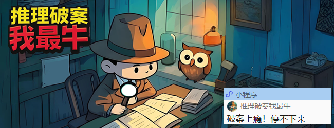

**我是酱油，这是第584期文章**

今天把《年少有为》看完了，结果回头就来了篇“降本增效”的文章……想想这些年，多少游戏公司喊着“降本增效”，最后变成“裁掉贵的、留下累的”，剩下的1个人干3人活，每天加班，只为了把那个早就该砍掉的项目，硬着头皮做完上线。然后呢？上线数据平平，玩家骂声一片，公司一看，又要降本，来个死循环。要知道，游戏这行最核心的成本不是办公室、不是服务器，而是人和时间。而很多公司降的本，刀刀精准砍这两样儿。砍掉埋头干活的员工，因为他们存在感低。砍掉分析调研时间，因为来不及了，先上线再说。结果，做出来的游戏像流水线上的东西，平庸到让人毫无记忆点。玩家也不傻，用脚投票就够了，最后公司发现，钱是省了一点，但市场没了。这哪是降本增效？不就是慢性自杀吗。真正要增的效，都在那些烧钱的地方。比如，给团队试错，别要求每个决策都必须正确。还有投资新工具和管线，提高生产效率，看看人家裴总，给员工的工学椅和升降桌都要最贵的……留住那些有能力的核心人才，即便他们个性抽象些，比如小吕……所以，游戏行业所谓的“效”，根本不应该是“一个人干三个人的活”，而是一个人能发挥出三个人的创新价值。这玩意儿靠压榨是榨不出来的，它需要好工具、充分包容、和信任。但遗憾的是，“降本增效”正在成为一个万能借口。项目失败了，动辄就是人效不够，却没人敢说：决策错了，方向偏了，游戏从一开始就打不动人心。把战略的失误、管理的失职，统统转嫁成对执行层的成本压缩，这是最简单无脑、也最伤根子的做法。出路在哪里？或许应该先停下，重新定义什么是“成本”。最大的成本，不是付给团队的薪水，而是做了一款没人想玩的游戏，不是吗？最后，求个一键三连，鸽了的话题下期续上：在游戏公司是“上班打游戏”？你怕是对工作有什么误解  
欢迎关注，一起唠嗑游戏行业的内幕，免得找不到回来的路哦。  
—— 华丽分割线——

**[1杯奶茶钱，改变你对游戏行业的认知，点这](https://mp.weixin.qq.com/s?__biz=MzIzMzI3ODcwMg==&mid=2654152265&idx=2&sn=f3d70259224f4cc2d692c04f4a8d1426&scene=21#wechat_redirect)**  

我建了个免费微信群“**酱油夜间自习室** ”，希望让每天晚上还在努力的同学，有个归宿，当你想要放弃时，让你看到，还有一群人跟你一样在努力。【重要】加我微信\(isjiangyou\)后，咱先接触下，需要一起打卡督促自己的话，加群才有意义哦。

**1v1游戏职场咨询：300元/2小时，起手势咒语“**下单****咨询** ”。**