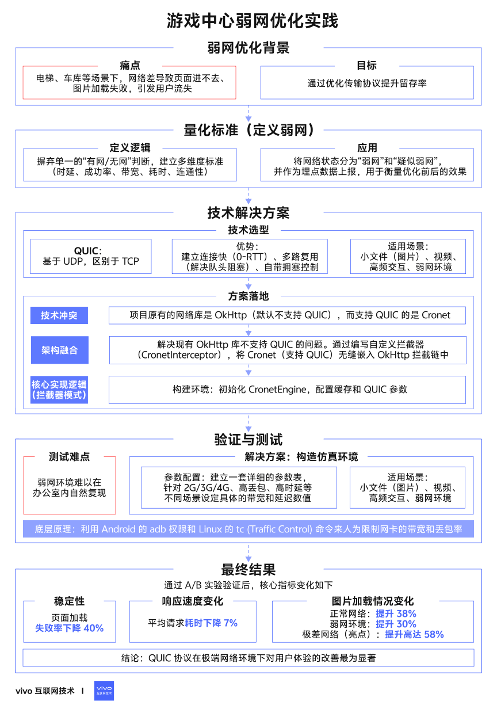
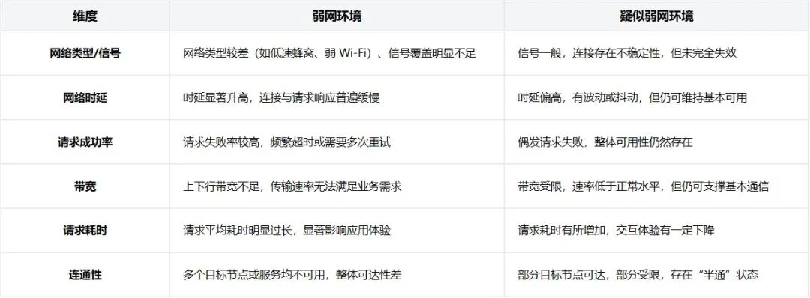
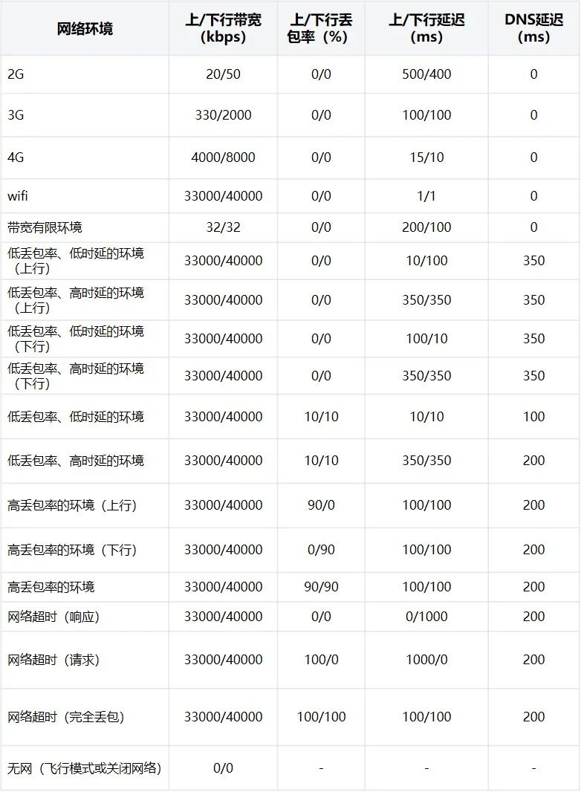

# 游戏中心弱网优化实践

> 原文链接：[游戏中心弱网优化实践](https://mp.weixin.qq.com/s/Q_cJfrRlFr5vJvusD4SobQ?scene=0&subscene=90)

作者：vivo 互联网客户端团队- Ke Jie


**目录**

01. 弱网优化背景

02. 如何去定义网络状态

03. 游戏中心弱网优化方法

04. 优化效果

本实践围绕游戏中心在弱网环境下的性能优化展开，针对复杂网络场景下的页面加载慢、资源加载失败等问题，提出了优化方案：接入支持 QUIC 协议的 Cronet 网络库，通过更快的连接建立与传输特性提升请求响应速度。配合弱网状态精细化判定与限速测试，线上灰度实验显示页面加载失败率下降 40%，请求耗时降低 7%，图片加载速度在正常至极差网络环境均有显著提升。


1分钟看图掌握核心观点👇


 

左右滑动查看


*图 1 VS 图 2，您更倾向于哪张图来辅助理解全文呢？*

*欢迎在评论区留言，我们将在评论区精选1位精彩留言作者送上礼品1份。*


***01***

弱网优化背景


游戏中心 APP 的核心功能依赖网络连接，如游戏下载、更新、启动、礼包领取及活动参与等。而在电梯、地下车库等弱网环境中，用户常遇到进入页面慢、图片资源加载不出来等问题，严重影响体验，导致活跃下降和用户流失。


随着移动游戏用户规模扩大，确保在复杂网络条件下的稳定访问和核心功能可用性，成为提升留存和转化的关键。通过优化传输协议、传输数据优化等，可显著改善弱网下的使用体验，保障用户使用流畅性，提升整体用户满意度。


***02***

如何去定义网络状态


在移动应用中，网络状态的定义通常是指当前设备所处的网络连接类型与质量。它不仅仅是“有网”或“没网”，还包括网络速度、延迟、丢包率等关键指标，特别在进行弱网优化时，需要更精细地感知和分类网络状态。如果要对优化效果进行衡量，首页要定义各种情形下归属哪种网络状态。


由于网络状态并没有一个统一的定义，游戏中心基于以下维度构建立了App内部的弱网判定标准。


**弱网与疑似弱网对比**




大概的现象可以总结为：

弱网环境：网络质量严重下降，已对用户体验造成明显影响。

疑似弱网环境：网络出现不稳定或退化迹象，但尚未达到严重弱网程度。


游戏中心通过判断网络状态、WIFI信号、手机信号强弱、Ping百度/Vivo域名、最近接口请求失败率、上下行带宽、最近请求平均耗时等维度，赋予不同的网络状态值，将网络状态值作为作为埋点的公参上报，作为优化前后提取数据的维度。


***03***

游戏中心接入QUIC协议


3.1

**游戏中心接入QUIC协议**


QUIC协议简介


QUIC 是 Google 在 2013 年推出的一种新型网络协议，全称是“快速 UDP 网络连接”（Quick UDP Internet Connections）。它和我们常用的 TCP 协议不一样，是基于 UDP 打造的。QUIC 的目标是让网站和应用加载得更快，同时也更加安全。


它能一次建立多个数据连接，而且建立连接的速度比传统方式更快，这意味着打开网页、看视频或传输数据时，等待的时间会更短。此外，QUIC 还具备自动控制网络带宽的功能，可以根据网络情况进行调节，避免网络堵塞。


Google 希望用 QUIC 来替代现有的 TCP 协议，并推动它成为互联网新的标准协议。


QUIC协议应用场景


轻量资源传输优化：对于图片、图标等体积较小的文件，能够快速完成传输，缩短加载时间，提升整体响应效率。


视频播放体验增强：在进行视频点播时，可以实现更快的内容呈现，提升首帧加载速度，减少播放中断，提高观影流畅度。


**高频交互请求加速：**针对如登录验证、支付流程等频繁交互的请求场景，可有效提升数据响应速度，改善用户的操作体验。


**复杂网络下保持稳定：**在网络条件较差，如高延迟或频繁丢包的情况下，依然能维持稳定的数据传输，减少失败和卡顿，保障服务可用性。


**应对大规模并发访问：**在面对大量用户同时访问、多资源并行加载等高并发情境时，具备更强的连接能力，提升整体访问速度与稳定性。


实现方式


Cronet和Okhttp一样都是网络库，Cronet 原生支持 QUIC，而 OkHttp 默认不支持 QUIC。


由于原来业务中对Okhttp网络库是有一定改造的，所以这里在Okhttp网络库中去接入Cronet库，做好兼容。


网络库实现的思路是自定义 Cronet 拦截器，一个完整的 Cronet 拦截器主要包含三个步骤：


OkHttp Request 转换为 Cronet Request

发起 Cronet 请求并处理生命周期

Cronet Response 转 OkHttp Response


将自定义的 Cronet 拦截器添加到 OkHttp 拦截链的末尾，保证其他拦截器（如缓存、日志、认证）正常工作后，才使用 Cronet 处理请求。


OkHttpClient辅助类中兼容Cronet：


（点击查看代码👇）

```
// 1. 创建缓存路径
```


CronetInterceptor拦截器，对需要使用QUIC协议的域名进行QUIC请求，相关域名可以做成配置项，具备线上随时切换的能力。


CronetInterceptor拦截器作用主要职责是：OKHttp 的Request 转换成Cronet Request，并能接收响应。


（点击查看代码👇）

```
public&nbsp;final&nbsp;class&nbsp;CronetInterceptor&nbsp;implementsInterceptor {
```


接收到响应后，需要将Croent Response 转成 OKHttp Response，核心的实现：

（点击查看代码👇）

```
Response&nbsp;toResponse(Request&nbsp;request,&nbsp;OkHttpBridgeRequestCallback&nbsp;callback) throws&nbsp;IOException&nbsp;{
```


这样整体在OkHttp网络库中，能够兼容使用Cronet网络库，整体的流程就通了。


测试方式及配置


**① 域名支持**

需要将支持的域名配置成支持QUIC，这里注意需要和运营商确认是否支持GQUIC/IQUIC。


**② 限制网速参数**

各个网络状态的参数可以参考这样设置：




参数参考：[稀土掘金 · Fiddler 抓包(下载安装及使用)]


**③ 测试工具**

由于QUIC抓包比较复杂，这里自定义了脚本，通过限制延迟时间、带宽、丢包率来限制网速，参数可以参考上一小节。


（点击查看代码👇）

```
#!/bin/bash
```


通过命令行执行类似于bash NetworkSimulation.sh 100ms 1mbit 0%命令，即可以限制手机的网络状态。


***04***

优化效果


在本次面向核心接口与图片域名的线上 A/B 灰度实验中，经过一段时间的观测与数据对比，灰度策略取得了显著优化效果，主要体现在以下几个方面：


**页面加载失败率显著下降：**整体失败率下降 40%，显著提升页面可用性；

**页面请求响应性能优化：**平均页面请求耗时下降 7%，加载更流畅；

**正常网络环境图片加载速度提升：**加载速度提升 38%，提升用户体验；

**弱网络环境图片加载速度提升：**加载速度提升 30%，弱网下表现更优；

**极差网络环境图片加载速度提升：**加载速度提升达58%，保障极端场景下的可用性与体验。


***END***


猜你喜欢

[Android动效探索：彻底弄清如何让你的视频更加酷炫](https://mp.weixin.qq.com/s?__biz=MzI4NjY4MTU5Nw==&mid=2247505727&idx=1&sn=5c587e6208b65282e28fbb6fe1195f5a&scene=21#wechat_redirect)

[桌面挂件不能承受之重——GIF](https://mp.weixin.qq.com/s?__biz=MzI4NjY4MTU5Nw==&mid=2247505432&idx=1&sn=cbb960f62cbcd1318f94d6f270ec7e75&scene=21#wechat_redirect)

[vivo 官网 APP 首页端智能业务实践](https://mp.weixin.qq.com/s?__biz=MzI4NjY4MTU5Nw==&mid=2247501010&idx=1&sn=e6764d0924dbc45e35207281deb4aa62&scene=21#wechat_redirect)


