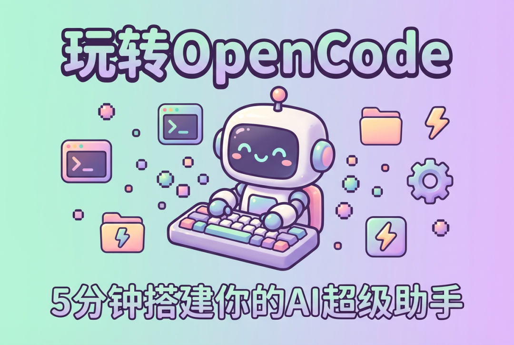
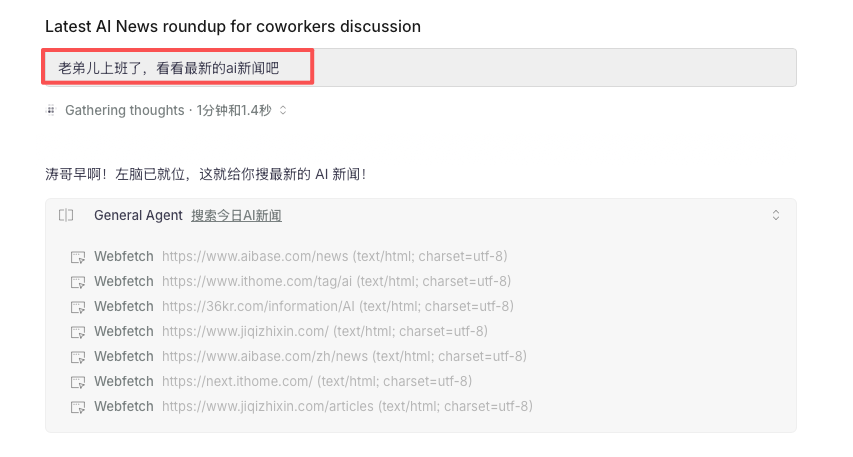
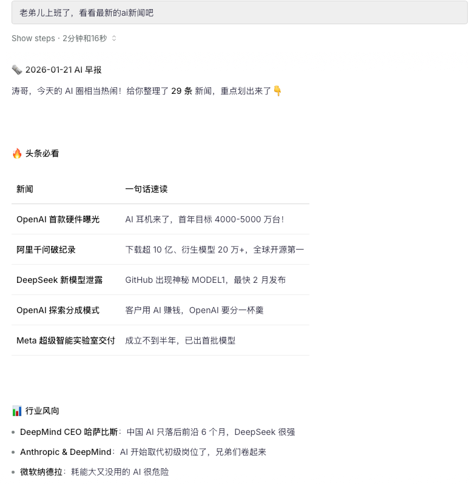
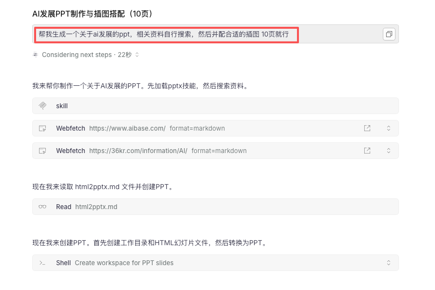
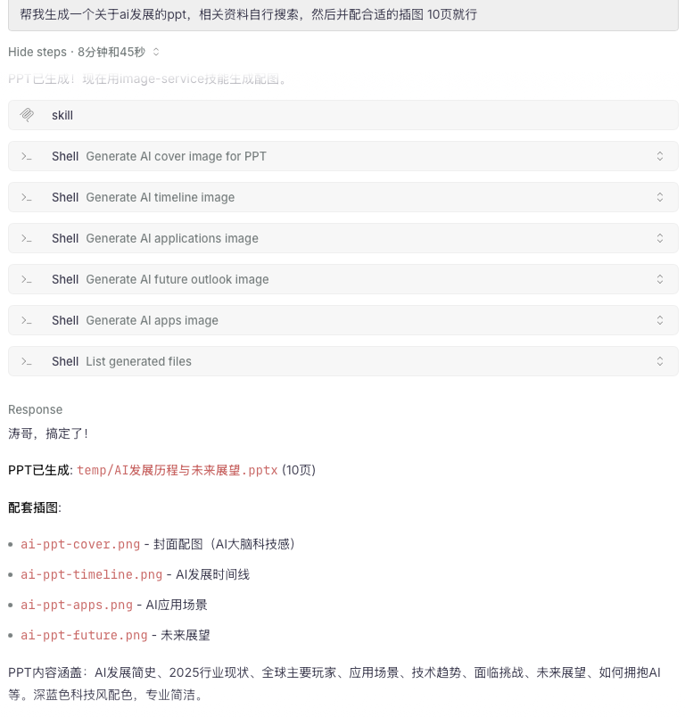
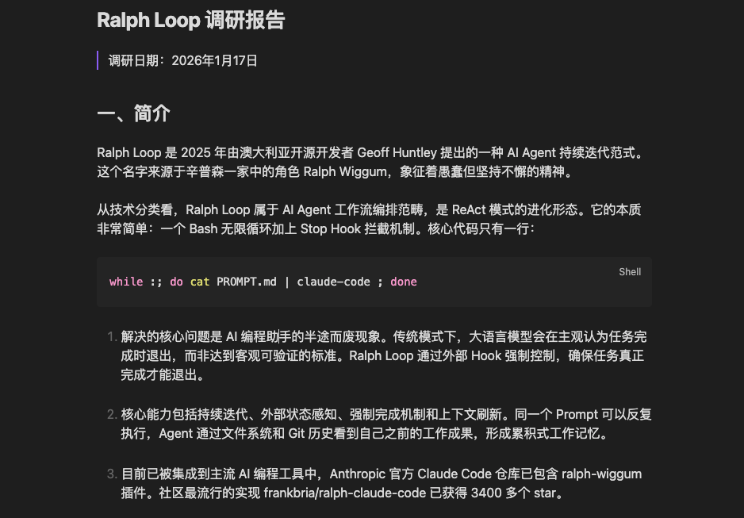
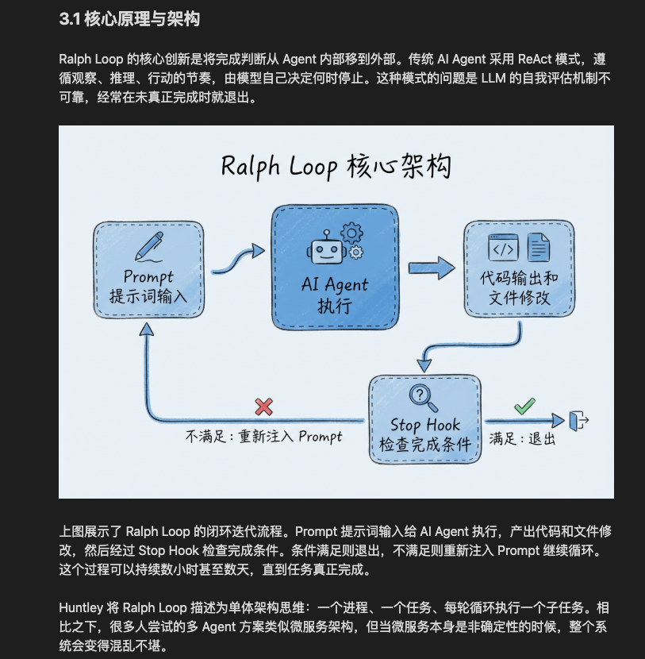
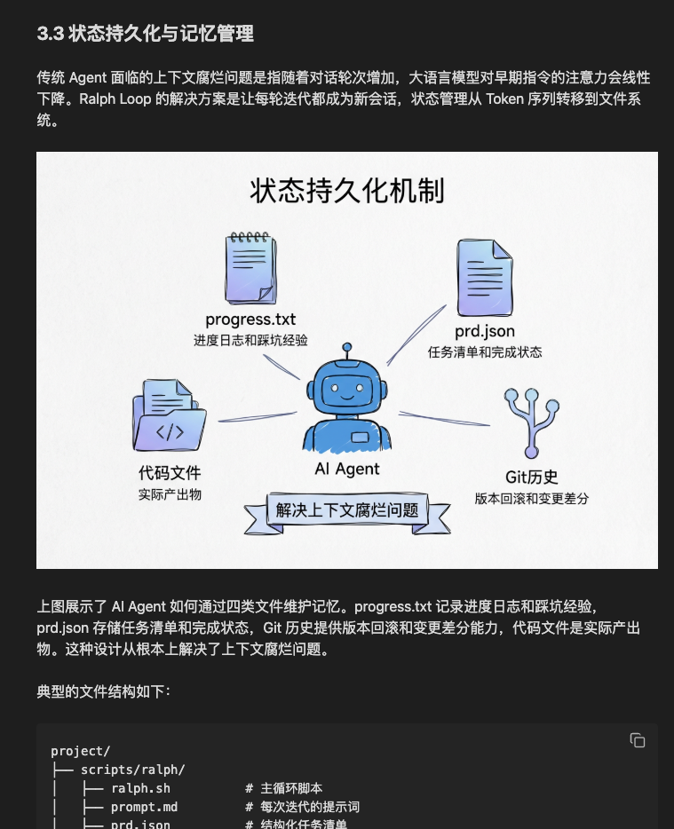
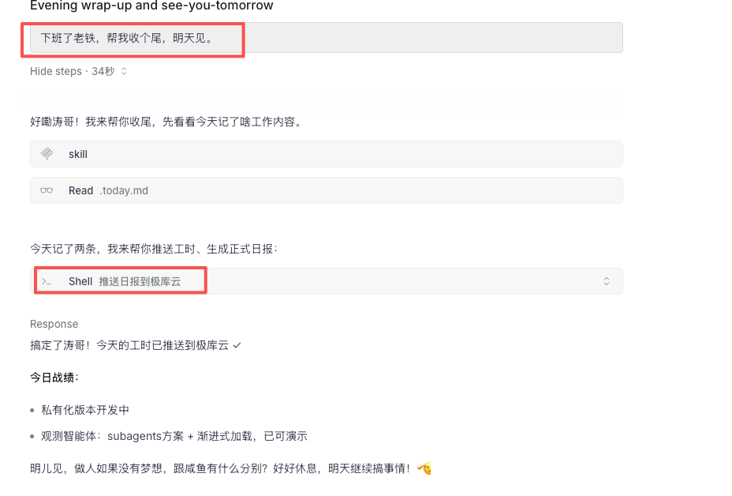

# 玩转 OpenCode(一)：5分钟搭建一个专属个人超级的智能体，入门级教程！

> 原文链接：[玩转 OpenCode(一)：5分钟搭建一个专属个人超级的智能体，入门级教程！](https://mp.weixin.qq.com/s?__biz=MzI0MjMwMTgyMw==&mid=2247484928&idx=1&sn=dfce1e8807bf98e84072926e77225f33&chksm=e8f48cf033cf1ffb27e96ef4aa77e89ed4b7246d9f4be618b234d95b2b91743ffda1c47e1b15&mpshare=1&scene=1&srcid=0211ZVTga9UhBSJEgO3HPKnP&sharer_shareinfo=0964628bec7a347a0644584a0de8e265&sharer_shareinfo_first=0964628bec7a347a0644584a0de8e265#rd)




一、先看效果：它到底能干啥？

二、工具介绍：OpenCode和Claude Code

三、5分钟快速上手

四、原理解析：它是怎么工作的？

五、AGENTS.md：给AI的工作手册

六、Agent Skills：让AI学会更多技能

七、常见问题

八、进阶玩法预告## 写在前面


AI编程智能体在2025年起飞，各种标准、协议层出不穷。

Anthropic发布了Claude Code，Google推出Gemini CLI，还有社区的OpenCode、flow、Cursor、Windsurf...各种王炸级别的编程智能体，而且这些工具有很多杀手锏：**插件、MCP、Agent Skills**等外接组件，能将终端的能力无限延展。

它们确实很强，能帮程序员写代码、调Bug、重构项目，效率拉满。

**但它们的能力，远不止于此。
**

这些终端软件的本质其实就是智能体——成熟的、可扩展的智能体。

既然是智能体，那就能学技能。但就目前阶段来讲，大模型元学习的能力还在发展中，能落地各种生成式应用以及智能体应用都不具备自我强化学习的能力。那么就需要人为的去给设定这些原子技能。

通过给它装上各种**Agent Skills（技能包）**，它就能解锁各种专业能力。而这些技能包，你可以自己定义，也可以用市面上开源的Skill——就像MCP当年横空出世一样，Skills生态正在快速生长。

装上不同的Skills，它就变成不同的专家：

处理各种文档：Word、PPT、PDF、Excel，批量操作一句话搞定

辅助写作专家：小说、个人博客、文字创作，抽取你的DNA，做你的第二写手

图文创作：绘本、系列故事、信息图、数据可视化，说一句话就无限创作可能

剪辑视频：识别口误、生成字幕、自动剪切

深度调研：丢个主题，自动搜索、整理、输出报告

服务器运维：日志分析、故障排查、自动化部署

智能问数：NL2SQL、排查数据分析、可视化出图

个人知识库：打造个人知识库，收录提示词、技术沉淀等等，越积累，越无敌。

当然，最重要的你可以用它，开发你想要的任何的合理需求...

**终端+ AgentSkills = 无限可能。**

你如果就把它当成一个普通软件来研究。用着用着你会发现，这玩意儿的上限，比你想象的高得多。

因为受益，所以分享——**让非程序员也能玩转的AI智能体教程**。

从0到1将这些"程序员专属工具"，变成你的**日常办公神器**。

系列很长，准备了很久，欢迎关注。

一、先看效果：它到底能干啥？

在讲概念之前，咱们先看看这玩意儿能干啥。毕竟，光说不练假把式。### 以前的AI：只能聊天

### 


以前用AI，就是那种你问它一个问题，它给你一段回答，然后...就没有然后了。

你让它帮你写个文档？对不起，它只能给你一段文字，不好了，你自己得斟酌，然后反复问，最后你还得自己复制粘贴到Word里。

你让它帮你分析个数据？对不起，它只能口头描述，你得自己去Excel里画图。

你让它帮你爬取每天的AI新闻？对不起，它的知识库是有截止日期的，它压根不知道今天发生了什么。即使你联网搜索，也是会偷懒，信息严重缺失，是的，manus，说的就是你。

说得头头是道，但让真正让它干活，一点忙都帮不上，说白了就是光会吹牛逼。

### 现在的AI，我的左脑：说到做到

### 


我说：**"老弟儿上班了，看看最新的ai新闻吧"**

****

它真的就去网上搜索、抓取、整理，然后给我生成一份新闻日报。



我说：**"帮我生成一个关于ai发展的ppt，相关资料自行搜索，然后并配合适的插图 10页就行"**

它真的就在找相关资料、分析数据、生成配图、完成PPT的生成。







**它不是在"说"，它是在"做"。**

这就是本质区别。

我再说：**"帮我调研下Ralph Loop 机制，图文并茂"**

**他会自己找资料，配图，给我完整的特定格式的word文档。**








最后，我又说：下班了老铁，帮我收个尾，明天见。




而这个东西就是我后续要分享的系列：基于Opencode打造的本地大众版的超级个人智能体，用的好了，效率真的起飞。

二、工具介绍：OpenCode和ClaudeCode


好，现在你知道什么是Agent了。那怎么拥有一个自己的Agent呢？

答案是：用ClaudeCode或者OpenCode。

那这俩是啥关系？对比项Claude CodeOpenCode开发商Anthropic 官方社区开源（SST 团队）价格只能是是有钱人玩的有free模型模型支持只能用 Claude所有模型技能系统支持 Skills支持 Skills（格式完全兼容）适合谁预算充足、需要官方支持或者配置代理服务想省钱、想用多种模型、爱折腾

本教程用OpenCode的3个原因：

1. 免费——入门零成本

2. 通用——学会了可以无缝迁移到Claude Code

3. 客户端——主要有可视化的桌面端，多个空间、可鼠标操作，交互很爽

而且，两者的操作方式几乎一模一样，技能包（后面会讲）也完全兼容。

所以用哪个都无所谓，先用免费的OpenCode上手，等你觉得Claude模型更好用、愿意付费了，再切到Claude Code，一行代码都不用改。

三、5分钟快速上手


我保证，接下来的步骤，5分钟内你就能拥有一个真正能干活的 AI 助手。

最后剩1分钟给你发朋友圈炫耀。

Step 1：安装 OpenCode（1分钟）

打开你的终端（Mac用"终端"，Windows 用PowerShell），复制粘贴下面的命令：

macOS/Linux：

```
# 方式一：一键安装（推荐）
```

Windows：

```
scoop&nbsp;install opencode
```

或者直接去opencode官网下载安装包，但是安装包有很多bug，也是最近疯狂更新，几乎一天一个版本。

或者用 npm（全平台通用）：

```
npm&nbsp;i&nbsp;-g&nbsp;opencode-ai@latest
```

安装完成后，输入 `opencode --version`，如果看到版本号，说明安装成功了。

Step 2：创建工作目录（30秒）

OpenCode 需要一个"工作目录"，它会在这个目录里干活。

你可以把它理解为：员工的办公桌。

```
# 创建一个目录
```

就这三行命令，搞定。

Step 3：配置模型（2分钟）

OpenCode 本身只是个"壳"，它需要连接一个大模型才能干活。

有三种方式，选一个适合你的：

方式A：免费体验

最简单，官方提供免费模型直接选择free模型即可。

方式B：官方 API（有钱人专属）

如果你有 Claude 或 OpenAI 的官方 API Key：

```
opencode
```

方式C：第三方OpenAI中转

如果你想省钱，或者想用多种模型自由切换，可以用第三方适配OpenAI的API中转服务。我自己也用的这种方式：

先创建配置文件(Mac下）：

```
mkdir&nbsp;-p ~/.config/opencode
```

然后编辑 `~/.config/opencode/opencode.json`：

```
{
```

保存后启动 OpenCode：

```
cd&nbsp;~/my-ai-workspace
```

Step 4：验证效果（30秒）

好了，现在你的 AI 助手已经就位了。

让我们来验证一下它是不是真的能干活。

在 OpenCode 界面里，输入：

```
创建一个test文件，内容：左脑，你准备好了吗，右脑要攻击你了！
```

然后看它操作。

如果一切正常，你会看到：

1. AI 说"好的，我来创建文件"

2. 它真的在你的目录里创建了一个 test.md`文件

3. 文件内容就是你要的那句话

恭喜你！你已经拥有了一个真正能干活的 AI 助手。

四、原理解析：它是怎么工作的？

你可能会好奇：刚才那个AI，它是怎么做到真的创建文件的？普通的DeepSeek为什么做不到？

别急，我来给你画个图。

```
你 ──────► DeepSeek ──────► 回复文字
```

传统的聊天AI，本质上就是一个文字生成器。

你给它输入，它给你输出文字，完事了。

它不知道你的电脑长什么样。

它是在线的，或者本地聊天机器人窗口，它不知道你的文件放在哪里。

它不知道今天是几号、发生了什么新闻。

它只是个被困在网页里的大脑。

但是Ai Agent中，它不仅有手脚，OpenCode赋予了这样的黑盒工具箱：

```
你 ──────► OpenCode ──────► AI 大脑 ──────► 决策
```

其本质是：AI大脑 + 一套工具。


当你说"帮我创建一个文件"时：

1. AI大脑理解你的意图

2. 决定使用"文件写入"这个工具

3. 调用工具，真正执行操作

4. 把结果反馈给你

五、AGENTS.md：给AI的工作手册


还记得我们刚才创建的 `AGENTS.md` 文件吗？

这个文件非常非常重要，决定你的智能体是否跟你合得来。

你需要赋予它：

- 你叫什么名字

- 你是什么性格

- 文件该放哪里

- 有哪些规矩必须遵守

包含智能体本身的工具、能力、以及如何自更新，不定期摘取你的习惯，将它打造成你。

这是你给你的智能体赋予的最强脑力。这里建议设计的时候加上最强大脑几个字，别问为什么，问就是大佬们都在用。效果就是好。

完整模板

如果你想让 AI 更懂你，用这个完整版：

```
# AI 管家工作规范
```

个性化定制

AGENTS.md这东西就是定义你跟谁对话，无限定制，你可以随便改。

想让AI说话带点幽默感？加一句：

```
## 性格
```

想让 AI 模仿某个风格？直接写：

```
## 交互风格
```

想让 AI 专注某个领域？指定：

```
## 专业领域
```

AI 会读取这个文件，然后按你说的来。

以下是我个人左脑模板，情绪价值拉满！(其实有的内容是不用写的，但是装了不少的skill插件后，会对当前的skill目录进行权限封定，导致自然读取失败，因此锚定到记忆中，指令遵循更好。)

供参考：

```
# AI 管家工作规范
```

六、Agent Skills：让AI学会更多技能


到这里，你已经有了一个能干活的AI助手了。

但你可能会想：它现在只会一些基础操作，怎么让它学会更复杂的事情？

比如像我这个左脑系统一样：

- 每天自动帮我抓取AI新闻，聚合

- 帮我生成各种风格的图片，插图，系列绘本等

- 下班打个招呼，自动帮我整理日报并推送

这就需要用到Agent Skills了。

AgentSkills是什么？

Skills，中文叫"技能包"，是一套告诉AI遇到特定任务该怎么做的说明书。

打个比方：

你刚招了一个新员工(AI)，他很聪明，但不知道你们公司的具体流程。

你让他"整理今天的新闻"，他可能会问：

- 去哪些网站抓？

- 只要今天的吗？

- 要不要去重？

- 按什么格式整理？

- 放到哪儿哪个目录？

每次都问一遍，很累对吧？

Skills就是你给员工写的SOP标准作业流程，这个流程替代了传统的定向固定的工作流。从需求到目标，有很多情况自助处理，但是结果永远是对的。这也是和传统工作流的区别，一个是聪明自己主动想方设法完成，一个是呆逼遇到点问题就装死或者直接就说干不了。


有了Skills之后，ai拿到任务就知道该怎么做，不用每次都问你。

如果你装了一个`searchnews`(我整理的ai聚合新闻的技能包)的Skill，你只需要说：整理今天的AI新闻

AI就知道：

1. 去AIBase、IT之家、36氪这几个网站

2. 只抓今天的新闻

3. 自动去重

4. 按固定格式整理

5. 存到`dailynews/2026-01-xx/news.md`

一句话触发，全流程自动化，最后给你交付一份文档，如果你高兴了，可以让他给再可视化出来。

七、常见问题


Q1：OpenCode 和 Claude Code 到底有什么区别？

产品发展上本质上没区别，现阶段有些许差异但都不是问题。

- 都是 AI Agent

- 都在终端运行

- 都支持 Skills

- 都支持 AGENTS.md(Claudecode中叫Claude.md，也有很多小分类，不过不重要！)

唯一的区别：

- Claude Code 只能用 Claude 模型，需要付费

- OpenCode 可以用任意模型，免费开源

&nbsp;Q2：我用 Claude Code，这篇教程还有用吗？

完全有用。

操作流程几乎一样，Skills 格式完全兼容。

唯一的区别是安装命令不同：

```
# Claude&nbsp;Code&nbsp;安装
```

其他都一样。

Q3：为什么我输入命令后 AI 没反应？

检查几个点：

1. 是否在正确的目录启动（有 AGENTS.md 的目录）

2. 模型是否配置正确（/connect 检查）

3. API Key 是否有效

Q4：我可以让它操作我电脑上的任何文件吗？

可以，但要小心。OpenCode 启动后，它能访问当前目录及其子目录的所有文件。

所以：

建议在专门的工作目录启动

不要在根目录或系统目录启动

重要操作前让它先确认

Q5：Skills 怎么安装？

后面的系列文章会详细讲。简单说：

1. 下载 Skill 文件

2. 放到 `.opencode/skills/` 目录

3. 在 AGENTS.md 里注册

4. 重启 OpenCode

Q6：模型选哪个好？

这是个很实际的问题。我的建议：场景推荐模型理由日常使用Claude 4 Sonnet性价比最高，能力均衡复杂推理Claude 4.5 Opus / GPT-5复杂任务更靠谱写代码Claude 4 Sonnet代码能力强省钱GPT-4o / Gemini Flash便宜量大

如果你是新手，先用默认的free，如：glm等就行，先上手体验，后面再根据体验调整。

Q7：安装遇到报错怎么办？

最常见的几个报错：

1. "Provider not configured"

- 原因：没配置模型

- 解决：运行 `/connect` 配置

2. "API Key invalid"

- 原因：Key 过期或填错了

- 解决：检查 Key，重新配置

3. Rate limit exceeded"

- 原因：调用太频繁，被限流了

- 解决：等一会再试，或换个模型

4. "File not found: AGENTS.md"

- 原因：没在正确目录启动

- 解决：确保当前目录有 AGENTS.md 文件

Q8：我不是程序员，能用吗？

完全能用！

这就是 AI Agent 最大的价值——你不需要会编程，你只需要会说话。

你说"帮我把这个文件重命名"，它就去改。

你说"帮我整理一下这些笔记"，它就去整理。

你说"帮我生成一张海报"，它就去画。

你唯一需要学的，就是怎么把你的需求说清楚。

而这，恰恰是我们最擅长的事情。


以上，如果觉得有用，欢迎转发给需要的朋友。

我们，下篇见。

版权声明：
本文由AI技术博客原创，转载请注明出处。

&nbsp;[#AI]()&nbsp;[#大模型]()&nbsp;[#ClaudeCode]()&nbsp;[#Opencode]()&nbsp;[#超级智能体]()&nbsp;[#AI办公自动化]()&nbsp;[#Agent]()

