# 简单聊聊：CX8网卡的升级点以及B300组网，附资料包下载

> 原文链接：[简单聊聊：CX8网卡的升级点以及B300组网，附资料包下载](https://mp.weixin.qq.com/s/VjyMzE8eiLjnEwyorvVFtw?scene=1)

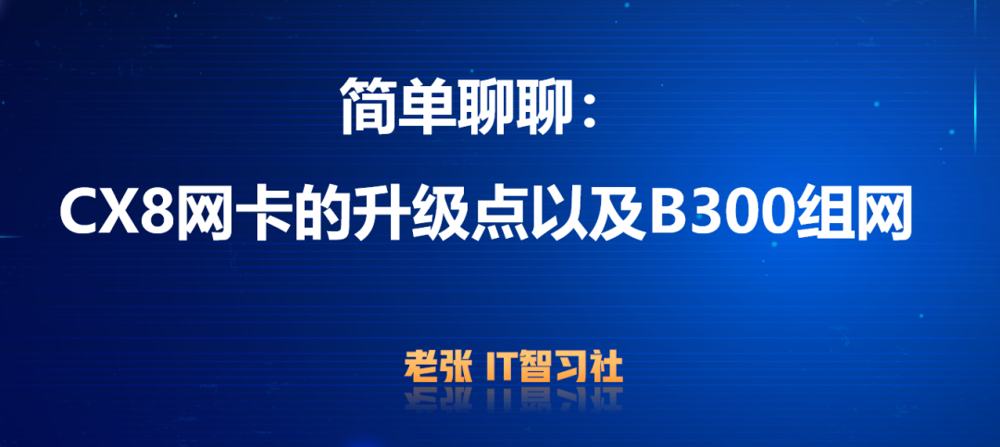

大家好，我是老张最近和不少朋友聊到B300组网、CX8网卡组网有关的内容，这几天我也查询了一些资料，针对大家比较关心的问题和大家简单聊聊！1、CX8网卡是B300整机的标配，有哪些核心升级点？2、Rubin平台搭配的CX9相比CX8核心升级是什么？3、B300组网对于IB和Roce的话，有哪些新的不同？一、Mellonex CX7到CX8的核心参数变化1、回顾一下CX7网卡大家都比较熟悉的CX7是NDR 400G，搭配H100、H200、H800、B200等机型，是IB和RoCE组网核心部件，网卡核心参数归纳是：①、网卡带宽：400Gb/s（单向）②、接口数量：1/2/4（常见的是1和2）③、双模设计：支持IB、Roce两种模式切换；④、PCIe数量：5.0x16（才能跑满400Gb），如果PCIe4.0平台，需要借助辅助套件（组成一共4.0x32），如右下图所示：

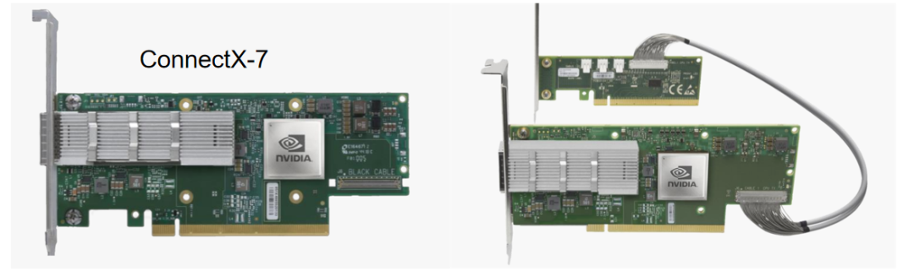

下图是Mellonex官方的彩页介绍，CX7网卡有多个细分型号，还包括不同长度的PCIe4.0辅助卡以及OCP形态的卡；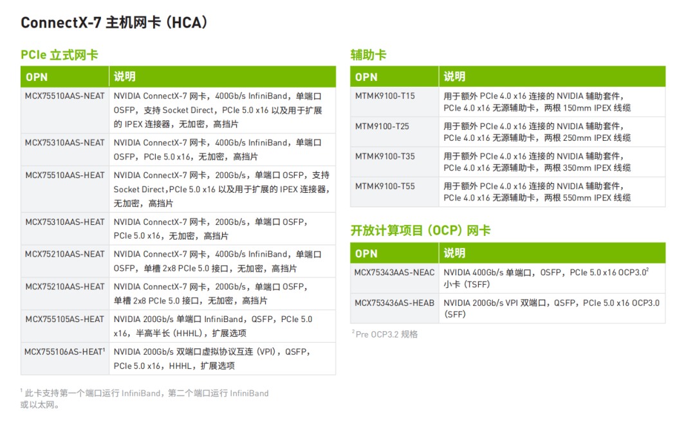注：网卡CX7、CX8、CX9，以及超微B200、B300整机的彩页，资料下载链接放在文末，大家自取！2、标配CX8的B300 HGX整机（超微SYS-822GS-NB3RT）产品图片如下，其中8张CX-8是On-Board方式集成到整机中（非PCIe可插拔），PCIe插槽提供2个PCIe5.0x16，问题了来了为什么不集成到主板上？主要原因是CPU还不支持PCIe6.0，所以单独设计了一个“板子”放置CX8，看懂的点个赞哦！

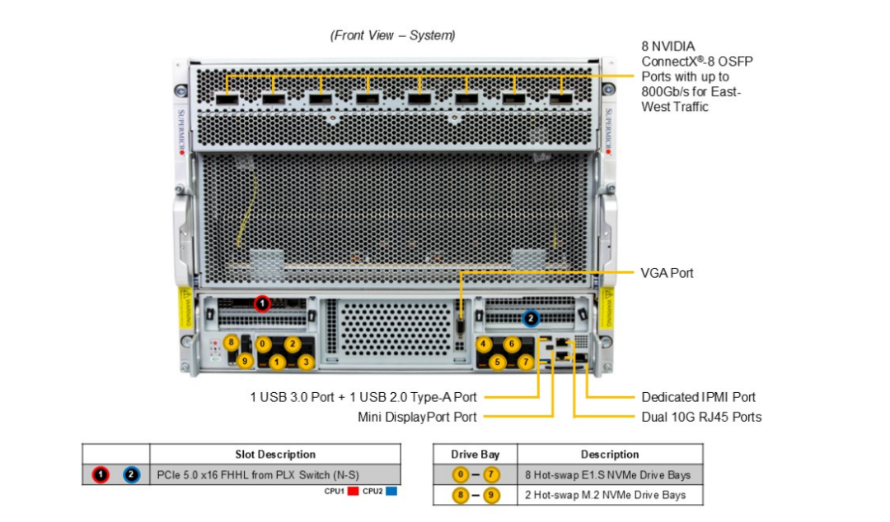

3、CX8网卡的参数情况相比CX7，CX8最核心升级是支持PCIe6.0，支持XDR 800G（速率翻倍），标准形态沿用英伟达标准的土豪金色调，尺寸如下（单宽半高半长的设计）和Tesla L4的GPU卡外观一致，多了网口和扩展接口而已，如下图所示；

值得一提的是，CX8虽然支持IB和以太网模式，但是在以太网模型下最高支持400G（有缩水），CX9相比CX8的核心升级是以太网模式下支持最高800G；彩页的核心参数截图对比如下：

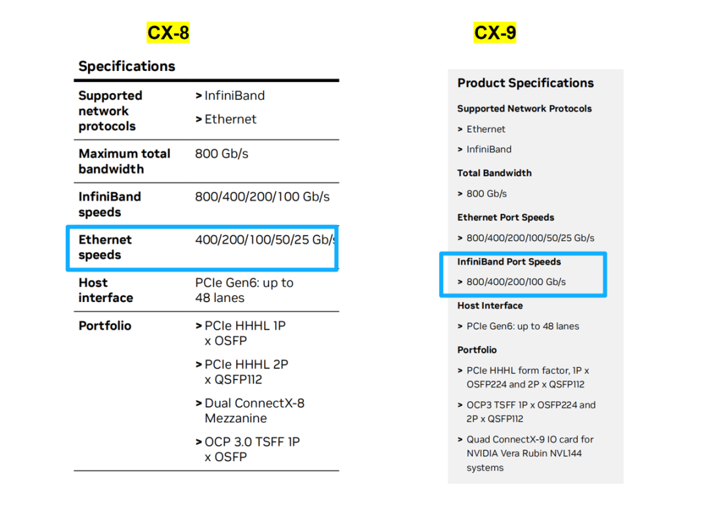

基于网上公开资料，CX-8网卡支持不同接口速率&amp;数量的示意图如下：

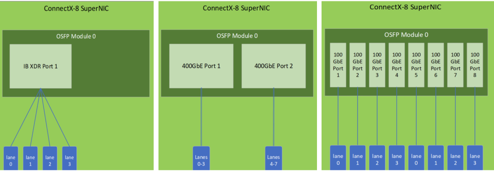

CX8网卡的后侧端口提供一个MCIO Gen5 X16，用于PCIe扩展，

①、作用1是在PCIe5.0的平台上用于扩展更多PCIe5.0，跑满800G

②、网卡自身作为PCIe SW（交换机）角色，可拓展连接NVMe硬盘、网卡等，我对这块理解不深，有不准确的地方欢迎大家评论区补充指正！

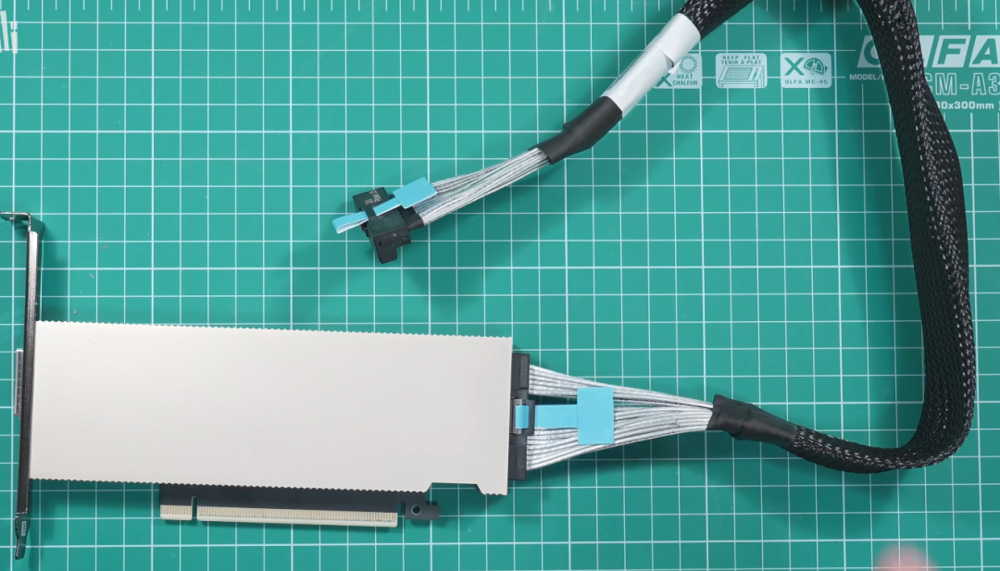

下图是Hot Chips 2025上，英伟达的演讲材料（也包括在文末下载链接里），可以看到CX8的PCIe SW还能拓展GB300 NVL72算力tray的IO性能，利用PCIe Gen6的48 lane的带宽（1.5TB/s），配合800G网络带宽，刚好能让Blackwell Ultra GPU的 “计算-通信平衡”——GPU 算得快，数据也能传得快，不会出现 “算完等数据” 的情况。

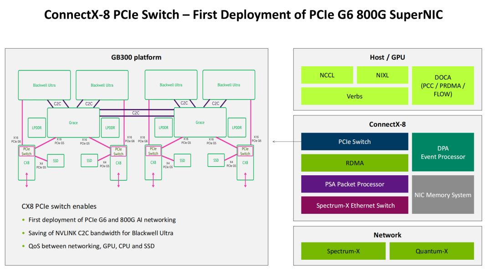

除此之外，CX8还有一个“隐藏接口”，如下图所示（30-Pin这里），提供类似带外管理的接口，支持固件版本的刷新和故障维护等；

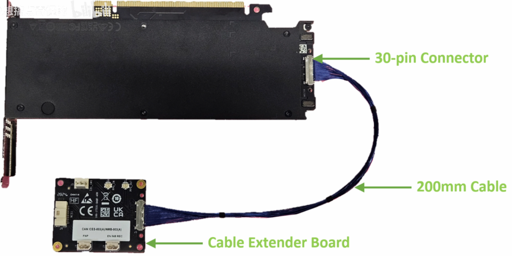

二、简单聊聊B300整机+CX8的组网情况

先看交换机，英伟达Q3400系列是英伟达新一代适配CX-8的网卡，以Q3400-LD为例具备115.2Tbps交换容量，内置4颗28.8T自研芯片。支持144个800G端口，通过72个1.6T OSFP接口实现，适用于万亿参数级别的AI模型训练。

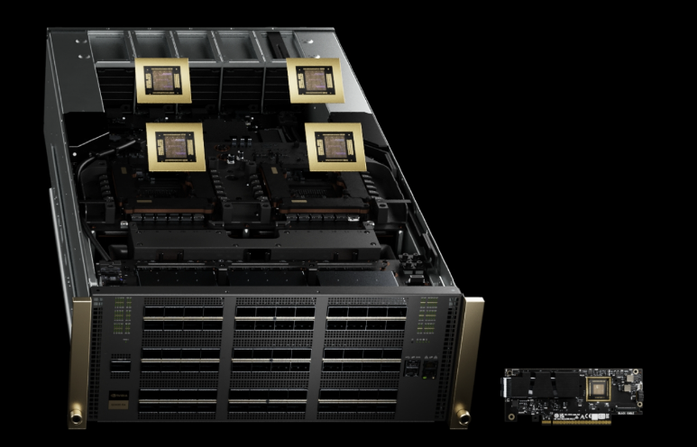

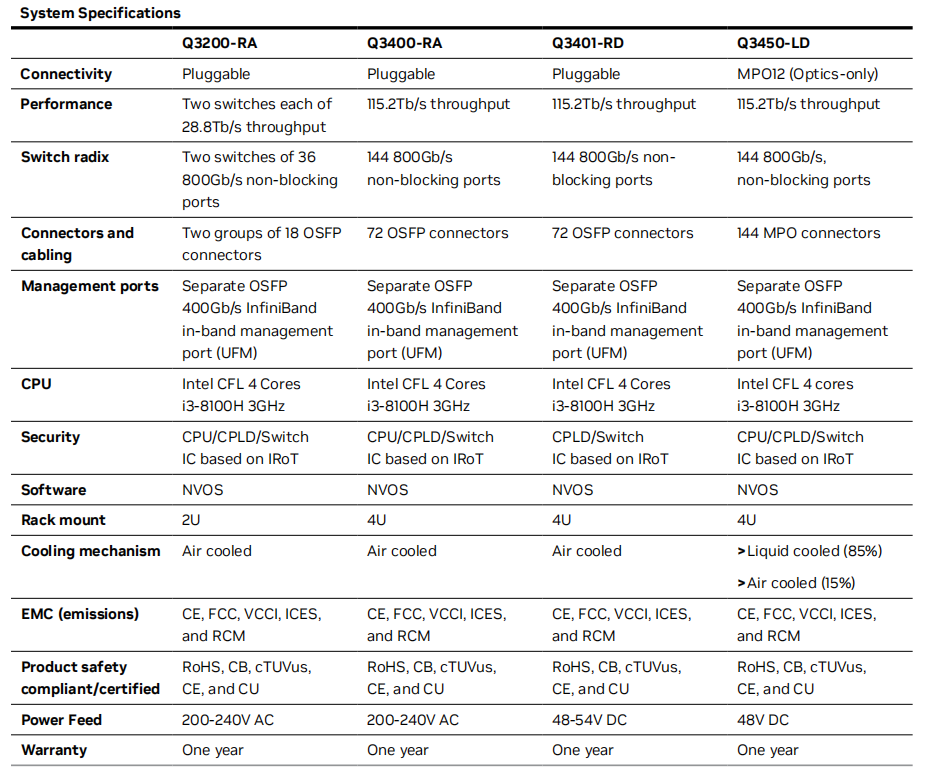 

1、B300八卡机+CX8的IB组网

B300集群后端网络使用了Q3400系列交换机，单台144个800G端口，leaf层交换机72个端口用于下联72台GPU服务器，2层组网架构下，最多支持18组leaf交换机（144÷8=18），18组交换机最大支持下联1296台GPU服务器，即10368卡。

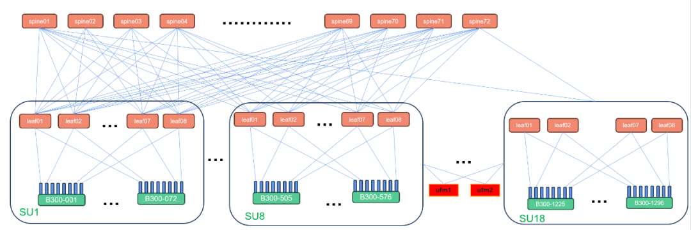

①、一个B300 Node包含8个B300 GPU，8个800Gbps Port，8个端口分别上联到8个leaf交换机。

②、每个SU包含72个GPU服务器，共576个卡，连到Leaf Switch。

Q3400拥有144个800Gb/s Port，连接72个Node。

每个SU会有8个Leaf Switch。对应 8*144=1152个800Gbps Port，一半连 GPU网卡，一半连Spine Switch 。

③、多个SU通过Spine Switch连接，18个SU可以支持10368 B300 GPU。每个平面包含8*18=144个 Leaf Switch，需要72个Spine Switch。

2、B300八卡机+CX8的RoCE组网

B300集群的RoCE组网比如可搭配SN5600 交换机（以太网），支持128*400G端口，两层无收敛网络架构最多支持4096卡。因为CX-8不支持800Gbps的以太网 Port。每个800Gbps NIC会分为2个400Gbps Port，它们各自连接2个通信平面，后端网络可以看成2个平行、独立的400Gbps网络。

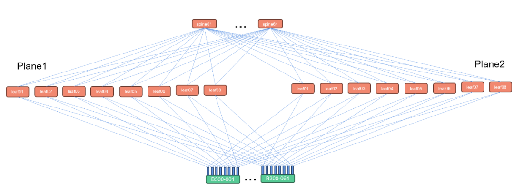

1、一个 B300 Node包含8个B300 GPU，16个400Gbps Port，每8个一个平面。

2、每个SU包含64个B300 Node，共512个B300 GPU，连到Leaf Switch。SN5600交换机可以支持128个400Gb/s Port，连接64个Node。每个SU会有16个Leaf Switch。每个平面8个，对应8*128=1024个 400Gbps Port，一半连GPU网卡，一半连Spine Switch 。

3、多个SU通过Spine Switch连接，8个SU可以支持4096 B300 GPU。8个SU包含16*8=128个Leaf Switch，需要64个Spine Switch。

注：组网部分参考了“硕曜科技”公众号的公开内容；

CX7、CX8、CX9以及B200、B300整机资料包下载链接如下：

链接：https://pan.quark.cn/s/a7d48b72f8d8

提取码：itH9

资料包清单如下：

感谢大家的关注和点赞！！！

