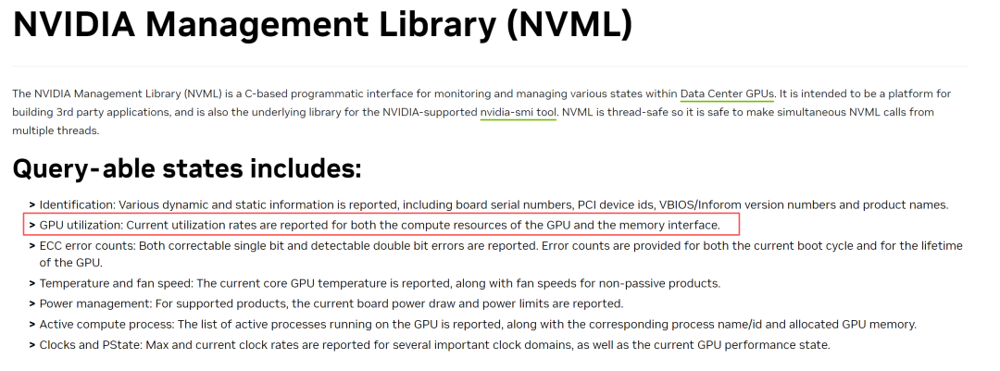
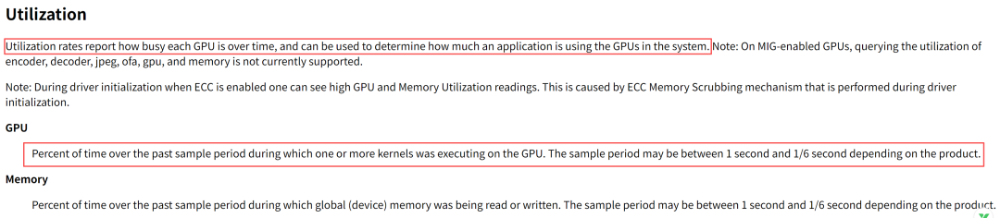
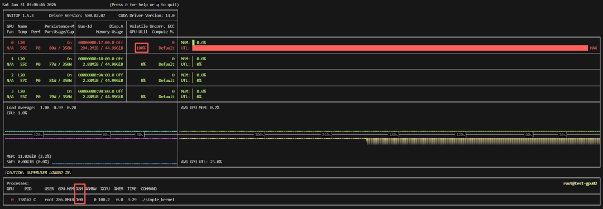
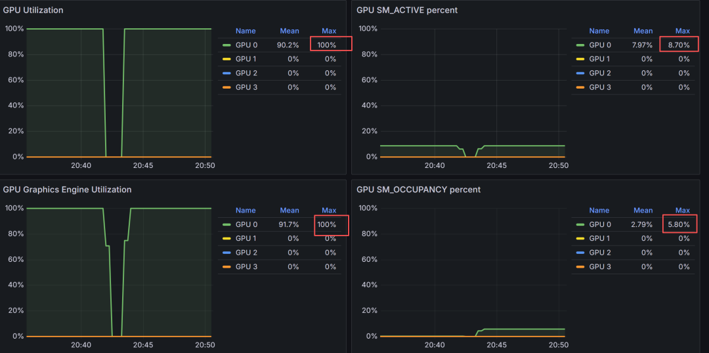

# 警惕NVIDIA GPU“满载、饱和”的陷阱和误区！GPU利用率100%≠有效计算100%

> 原文链接：[警惕NVIDIA GPU“满载、饱和”的陷阱和误区！GPU利用率100%≠有效计算100%](https://mp.weixin.qq.com/s/1t3Zuvh8UnOBr2wjLLN02Q?scene=1)

nvidia-smi命令行或者监控显示GPU使用率100%，即认为GPU已经饱和满载，这是一个非常经典的误区。实际上这只是一个表象，大部分SM可能还在空闲状态，这就很容易让人产生误解和混淆，今天我们就来详细介绍一下GPU利用率误区以及如何真实有效的评估GPU的使用情况，以便为故障排查和性能调优提供知识储备。

1、GPU利用率定义

1）NVIDIA官方文档定义

NVIDIA Management Library(NVML)中的定义：




```
GPU utilization: Current utilization rates are reported&nbsp;for&nbsp;both the compute resources of the GPU&nbsp;and&nbsp;the memory&nbsp;interface.
--同时报告GPU计算资源和内存接口的当前利用率。
```

2）nvidia-smi GPU使用率定义




```
Utilization
Utilization rates report how busy each GPU&nbsp;is&nbsp;over time,&nbsp;and&nbsp;can&nbsp;be&nbsp;used&nbsp;to&nbsp;determine how much&nbsp;an&nbsp;application&nbsp;is&nbsp;using the GPUs in the&nbsp;system.&nbsp;
--利用率报告了每个GPU在过去一段时间内的繁忙程度，并且可以作为评估应用对GPU资源的使用情况。
GPU
Percent of time over the past sample period during which one&nbsp;or&nbsp;more kernels was executing&nbsp;on&nbsp;the GPU. The sample period may&nbsp;be&nbsp;between&nbsp;1&nbsp;second&nbsp;and&nbsp;1/6&nbsp;second depending&nbsp;on&nbsp;the product.
--在过去的采样周期中，一个或多个kernel在GPU上执行的时间百分比。根据产品的不同，采样周期可能在1秒到1/6秒之间。
```

2、GPU使用率误区分析

从上面的定义看出，GPU利用率只是一个周期内GPU活动的时间占比，并不能反映GPU内SM计算单元的实际使用情况。

2.1 GPU硬件组成和CUDA编程

要深入理解GPU使用率，我们得先来回顾一下GPU CUDA的编程模型和硬件组成，这里简单回顾一下，更详细的介绍可以参考之前文章：[NVIDIA GPU CUDA编程模型基础概念](https://mp.weixin.qq.com/s?__biz=MzkzMTk5MTEwNw==&mid=2247489071&idx=1&sn=5797640b04a69c1fa9d6cd30d55de5a8&scene=21#wechat_redirect)

CUDA编程模型：kernel（函数）--&gt;thread(最小执行单元)--&gt;thread block(一个block在一个SM运行)--&gt;grid。

GPU硬件组成：功能单元（Core）-&gt;SM(Core+Cache+Register File)-&gt;GPC-&gt;GPU(GPPC+L2 Cache+DRAM+PCIe or NVLINK)。

2.2 GPU利用率两大误区

通常我们会有如下两种理解上的误区：

1）单个SM活跃不代表整个GPU繁忙

一个GPU会有上百个SM，每个SM会运行多个thread block，但是当并发不够即所有thread block都没有占满GPU内的SM，例如100个SM的GPU上，只有10个SM当前处于active状态，即10个SM上有kernel运行，那使用率其实就10%。

2）GPU利用率显示100%≠满载

GPU利用率显示100%，GPU还真不一定繁忙，可能是“假忙”。前面我们在介绍MPS（Multi-Instance GPU）时就发现，开启MPS后，一个进程运行时间和两个进程运行时间基本一样，但是这两种情况下，GPU使用率都是100%，所以GPU使用率100%真的不能表明它满载和饱和。

简单理解为，只要有kernel在GPU上运行，就显示使用率100%，一个kernel占用一个GPU的一个SM，使用率还是100%，而实际上其他SM是空闲的，所以使用率100%不能反映GPU满载或者SM占用情况。

2.3 实例证明GPU利用率误解

来看一个实例，代码来自于NVIDIA论坛，一个简单的kernel，运行在一个block和一个grid，理论上只占用一个SM，其他SM都是空闲：

```
#&nbsp;include&nbsp;&lt;stdio.h&gt;
#&nbsp;include&nbsp;&lt;unistd.h&gt;
#&nbsp;include&nbsp;&lt;stdlib.h&gt;

__global__&nbsp;void&nbsp;simple_kernel()&nbsp;{&nbsp;//核函数定义，这个核函数所干的事有点类似于使这个GPU线程一直循环状态。
&nbsp; &nbsp;&nbsp;while&nbsp;(true) {}
}

int&nbsp;main(int&nbsp;argc,&nbsp;char&nbsp;*argv[])&nbsp;{
&nbsp; &nbsp; simple_kernel&lt;&lt;&lt;1,&nbsp;1&gt;&gt;&gt;();&nbsp;// 调用核函数启动1个线程块，这个线程块包含1个线程。
&nbsp; &nbsp; cudaDeviceSynchronize();
}
```

我们编译运行一下：

```
#编译
nvcc simple_kernel.cu -o simple_kernel
#运行
./simple_kernel
```

然后nvitop获取GPU使用率：GPU0的使用率显示100%。




可以看到，代码运行在GPU0（H20，76个SM）上，且使用率显示100%，而我们只用了一个SM，所以其他75个SM都是空闲状态，SM占用率1/76*100=1.3%，但是GPU使用率已经是100%。

3、如何有效评估GPU使用情况

以上我们分析可知，其实nvidia-smi、nvitop等工具输出的GPU Util并没有太大的参考价值，特别对性能分析和优化没有帮助，所以如何正确监控和有效评估GPU的使用率呢？

其实除了GPU使用率，我们真正关心的是SM核心计算单元的占有率，即有多少计算能力是没有充分利用的，这个也就是我们优化的空间。

对于GPU的监控，基本分两类：

命令行工具nvidia-smi：它是由NVIDIA GPU驱动提供的，基于NVML（NVIDIA管理库），收集和查询GPU和显存使用率、电源功耗、温度等信息。

集成监控工具dcgm-exporter：它基于DCGM（NVIDIA Data Center GPU Manager）&nbsp;专门用于管理和监控大规模的GPU工具，主要功能包括GPU运行状态监控、异常诊断、系统验证、电源和时钟管理等，此外它还可以收集GPU设备SM的饱和度。综上，为了了解GPU真实的繁忙程度，需要结合SM忙碌情况和占用情况，DCGM提供了两个监控项：DCGM_FI_PROF_SM_ACTIVE和DCGM_FI_PROF_SM_OCCUPANCY。官方释义如下：

```
DCGM_FI_PROF_SM_ACTIVE&nbsp;1002
The ratio&nbsp;of&nbsp;cycles an SM has at least&nbsp;1&nbsp;warp assigned (computed&nbsp;from&nbsp;the number&nbsp;of&nbsp;cycles&nbsp;and&nbsp;elapsed cycles)
DCGM_FI_PROF_SM_OCCUPANCY&nbsp;1003
The ratio&nbsp;of&nbsp;number&nbsp;of&nbsp;warps resident&nbsp;on&nbsp;an SM.
(number&nbsp;of&nbsp;resident&nbsp;as&nbsp;a ratio&nbsp;of&nbsp;the theoretical maximum number&nbsp;of&nbsp;warps per elapsed cycle)
```我们还是以H20为例，执行以下代码，8个thread block（最多可能使用8个SM）：

```
__global__&nbsp;void&nbsp;simple_kernel()&nbsp;{
&nbsp; &nbsp;&nbsp;while&nbsp;(true) {}
}

int&nbsp;main()&nbsp;{
&nbsp; &nbsp; simple_kernel&lt;&lt;&lt;8,&nbsp;1000&gt;&gt;&gt;();
&nbsp; &nbsp; cudaDeviceSynchronize();
}
```在grafana上监控SM_ACTIVE和SM_OCCUPANCY:




可以看到SM ACTIVE为8.7%，H20理论上是76个SM，激活的的SM有大概7个，与我们代码里的8个接近。如何使用dcgm-exporter+Prometheus+grafana监控NVIDIA GPU，可以参考之前文章：[AI Infra-如何将GPU千卡集群的运维效率提升300%？一套你必须了解的智算基础设施监控可视化秘籍](https://mp.weixin.qq.com/s?__biz=MzkzMTk5MTEwNw==&mid=2247486813&idx=1&sn=daf50db257e2c878749430866a01648f&scene=21#wechat_redirect)总结：

总而言之，GPU使用率达到100%并不等同于计算资源已完全饱和、无法优化。要突破这一常见误区，关键在于理解硬件架构与CUDA执行模型，并超越单一的使用率指标。通过综合审视SM激活率、SM占用率及各类带宽利用率，我们才能对GPU的真实负载做出准确评估，从而找到真正的性能瓶颈与优化方向。期待与您共同探讨。
关注“AI云智工坊”，聚焦云计算、大模型、AI前沿技术实战和分享。如您有任何的建议与指正，敬请在文章底部留言，感谢不吝指教！如您看完有所受益，欢迎点击文章底部左下角“关注”并点击“点赞”、“分享”、“推荐”，非常感谢！


