# 谷歌TPU v7和英伟达GB300的架构，供应链差异

> 原文链接：[谷歌TPU v7和英伟达GB300的架构，供应链差异](https://mp.weixin.qq.com/s?__biz=Mzk1NzE2NjMxNQ==&mid=2247494102&idx=1&sn=b1ccf04aa74aa20e711ecafc45753fa1&chksm=c20363e29d68826f53d5a99bef2652f985a1016d427acba1068ca82ca6336acaf769ff332bbf&mpshare=1&scene=1&srcid=0204O4XU5DxgebwxG4Zlf57A&sharer_shareinfo=c6b134fcb7f5b02bd5aea5d961702dd7&sharer_shareinfo_first=c6b134fcb7f5b02bd5aea5d961702dd7#rd)

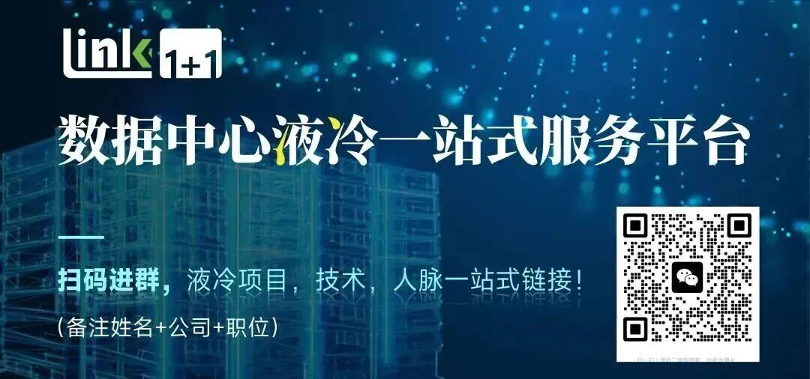

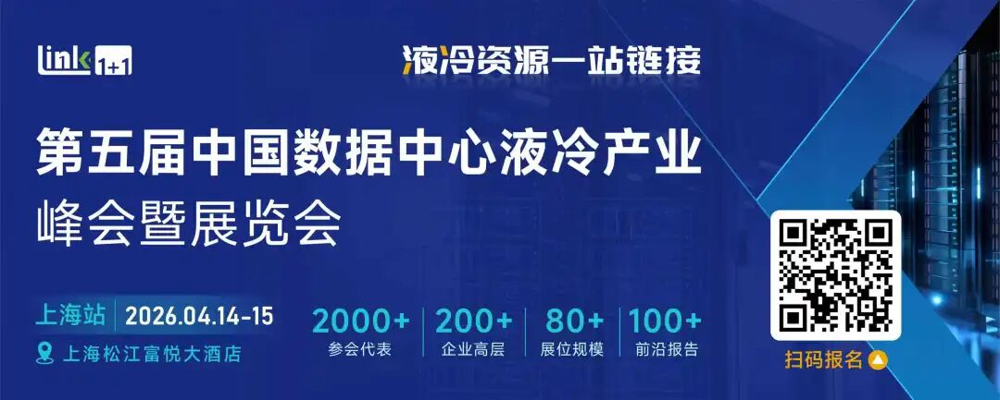 &nbsp;01.Google TPU V7 vs 英伟达GB300 芯片差异在 AI 芯片领域，谷歌 TPU 与英伟达 GPU 的竞争已进入白热化阶段。作为双方的旗舰产品，TPU v7（代号 “Ironwood”）与 GB300 分别代表了专用 ASIC 架构与通用并行计算架构的巅峰水平，二者在架构设计、性能参数、能效比、扩展性及成本等维度存在显著差异，这些差异直接决定了它们在不同 AI 场景中的适配性。TPU v7 属于ASIC芯片的类别。TPU v7&nbsp;延续了谷歌 TPU 系列 “牺牲通用性、追求张量运算极致效率” 的设计逻辑，核心架构围绕深度学习中的矩阵乘法（张量运算核心）深度定制，更加适合推理场景，单芯片功耗中等。

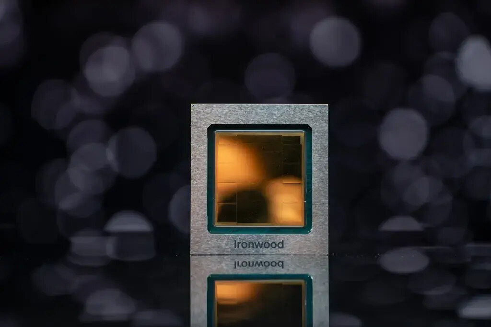

GB300 作为英伟达 Blackwell 架构的旗舰产品，延续了 GPU “通用并行计算” 的核心优势，兼顾张量运算、图形渲染、科学计算等多场景需求，算力较高，适合高算力的AI大模型训练，成本高，功耗高。

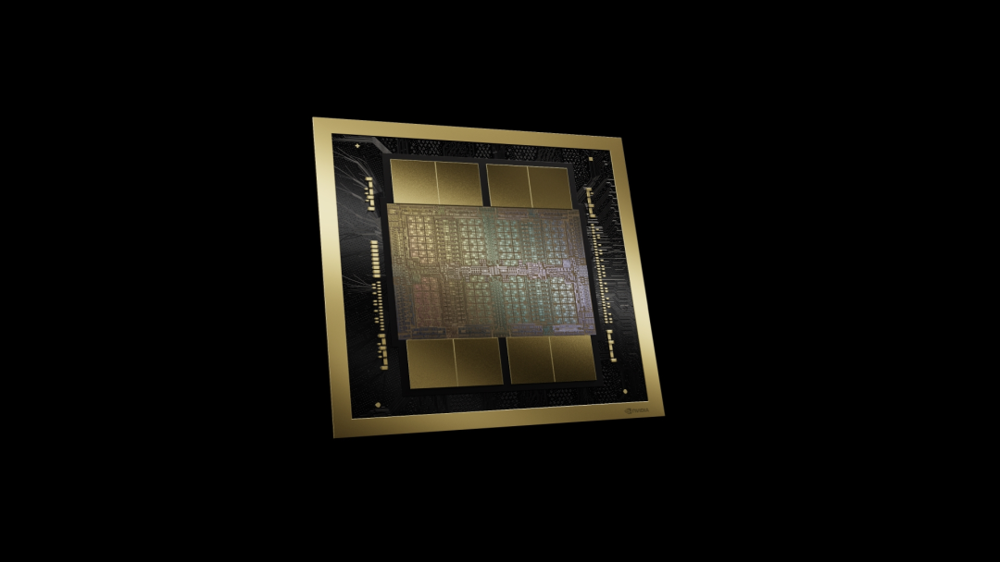

&nbsp;02.Google TPU V7 vs 英伟达GB300机柜级架构差异从表面参数来看，TPU v7 与 GB300 的差异首先体现在机柜尺度上。

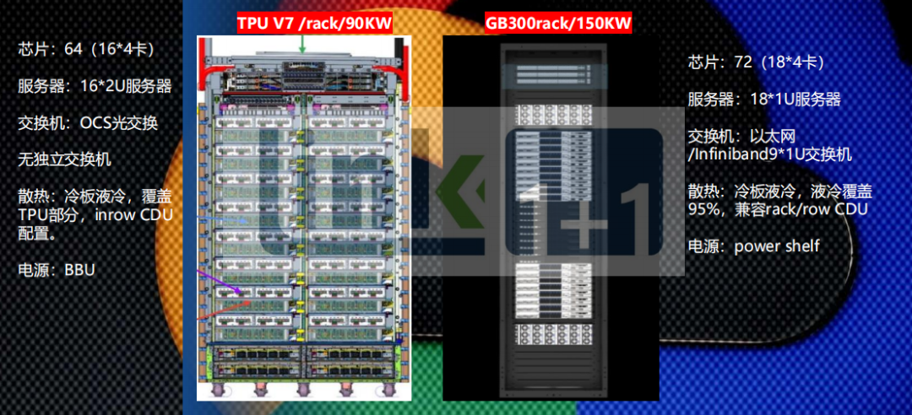

TPU v7 机柜的热设计功率约为 90kW，整柜部署 64 颗 TPU 芯片，采用 16 台 2U 服务器的形态。网络层面使用 OCS 光交换架构，机柜内部不设置独立交换机，算力节点之间通过高度定制化的光互连直接通信。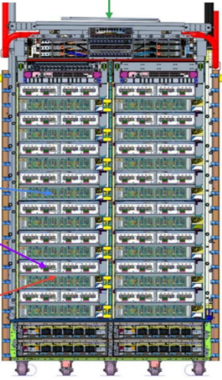相比之下，GB300 机柜的单柜功率提升至约热 150kW，芯片数量 72 颗，服务器形态收敛为 18 台 1U 服务器，并配备独立的 InfiniBand / 以太网交换设备。这种设计明显更贴近当前主流 AI 数据中心的部署逻辑。

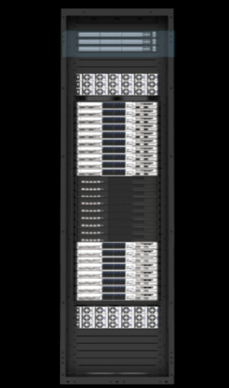

但真正值得关注的，并不是功率或芯片数量的差距，而是两种机柜在设计目标上的根本不同。TPU v7 本质上是为 Google 内部算力体系定制的“算力终端”；而 GB300 则被定义为可以被反复复制、快速部署的“标准算力模块”。02.Google TPU V7 vs 英伟达GB300服务器内部架构差异

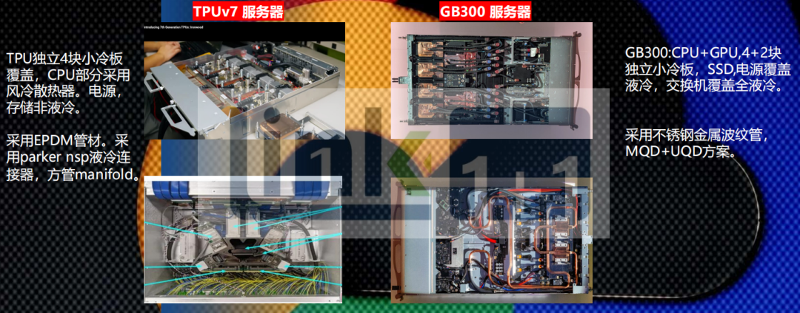

TPU v7 服务器部署4颗TPU芯片。在 TPU v7 的服务器内部结构中，液冷系统呈现出高度聚焦的特征。TPU 芯片被单独配置为 4 块小冷板，液冷覆盖范围严格限定在算力核心之上，而 CPU、内存、电源模块仍然沿用风冷方案，存储系统则未被纳入液冷体系。TPU v7 采用 EPDM 软管、Parker NSP 接头与 Manifold 分配结构，配合 In-row CDU 使用。这种方案具备良好的安装灵活性和成本可控性，非常适合 Google 这种自建、自运维的数据中心体系。

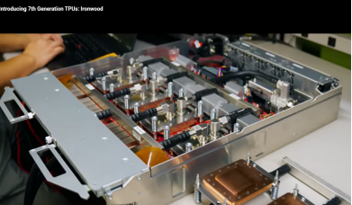

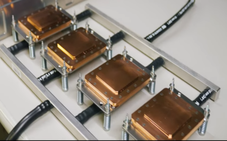 在 TPU v7 的体系里，传统意义上的“交换机”本身就被弱化了。TPU Pod 里真正承担大规模互联角色的，是 OCS（Optical Circuit Switch，光电路交换），这种方案更多是一个“光层调度设备”，而不是高功耗、高算力的包转发芯片设备。这类 OCS 的特点是**交换芯片功耗低、发热密度分散、运行状态极其稳定**，远没有 GPU 或 NVLink / InfiniBand 交换 ASIC 那么“热”。从热设计角度看，它根本没有到必须引入液冷的门槛，用成熟的风冷方案完全可以覆盖，而且风险更低。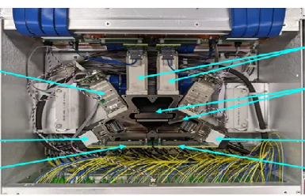GB300服务器部署4GPU+2GPU。液冷方案更加复杂，液冷覆盖率95%，几乎全液冷覆盖，是小冷板结构，4+2方案，采用不锈钢波纹管、MOD + UQD 快接结构，以及 Rack / Row 级 CDU 兼容设计，为长期运行、频繁部署与快速维护而服务的工程选择。

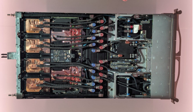

GB300 使用的是新一代 InfiniBand 交换平台（对应 Quantum / Quantum-X 这一代架构），单颗交换 ASIC 的功耗已经进入数百瓦级别，并且端口速率、SerDes 数量、内部交换带宽都在指数级提升。GB300的交换机是1u高度，采用液冷架构方案，Asic芯片部署液冷冷板。

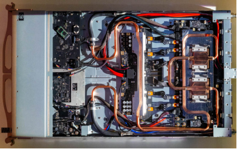

&nbsp;04.Google TPU V7 vs 英伟达GB300 供应链差异&nbsp;由于英伟达目前只提供L6板卡产品，不直接提供L10-L11整机服务器，比如冷板，CDU等部件属于L6之后的环节，不属于英伟达的直接环节，但是液冷系统又是非常重要的一环，所以为保障下游客户使用英伟达芯片正常运行，英伟达会提前设计一套整机系统提供给终端及服务器OEM厂商参考，在液冷生态体系中，英伟达要求通过一系列的认证测试进而确定各个液冷组件的RVL（推荐供应商名录）；要成为供应商进入RVL基本成为进入英伟达液冷生态体系的强制性要求。在RVL基础上，英伟达GB200采用强制指定少数液冷部件供应商的模式，如 Vertiv 是英伟达指定的系统级液冷合作伙伴。在这种模式下，液冷供应商将可能形成产能瓶颈，无法支撑GB300及后续产品的巨大需求。

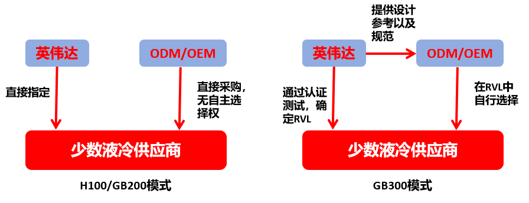

为降低供应链的风险，英伟达在GB300上做出了调整，仅负责提供液冷部件设计参考及接口的规范；由此给予了ODM/OEM厂商更大的设计灵活性，并且由CSP或ODM/OEM在RVL范围内自主选择液冷部件供应商，为新供应商的进入创造了条件。在这种模式下，液冷部件供应商需要同时通过英伟 达RVL 认证以获取配套资格，同时也需要进入OEM/ODM的AVL（合格供应商名录）以确保在液冷系统集成阶段被选用。谷歌与英伟达的冷供应商选择模式不同，谷歌目前不直接出售TPU芯片，而是出售google Colud的算力，数据中心多数采用自健，所以谷歌的所有数据中心基础设施产品由google自己采购。

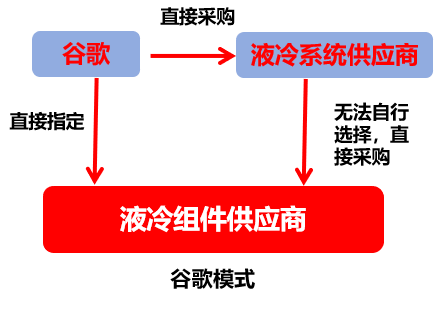

因此谷歌液冷系统供应商会作为一级供应商直接向谷歌提供配套产品，液冷系统供应商将向谷歌指定的部件供应商采购液冷系统部件。因此对于国内厂商来说有更大的机会切入谷歌的供应链并且能够持续获得市场份额。

&nbsp;&nbsp;关注我们获取更多精彩内容&nbsp;

