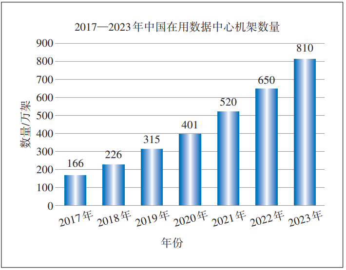
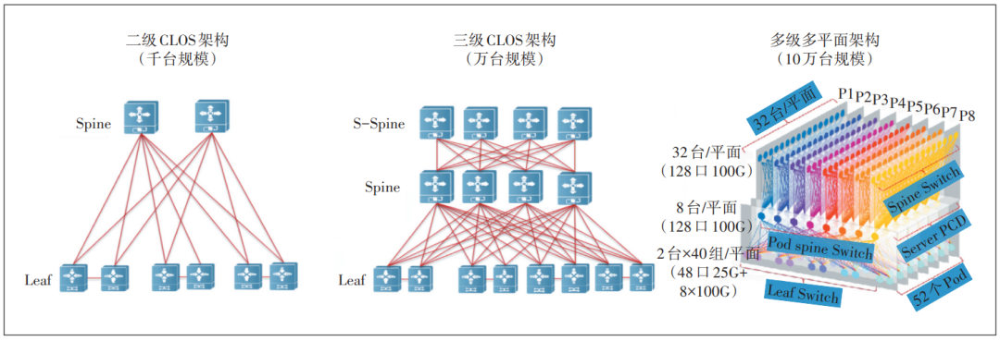
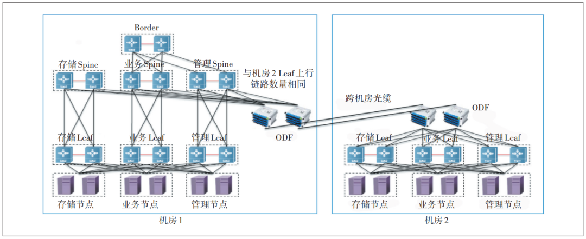
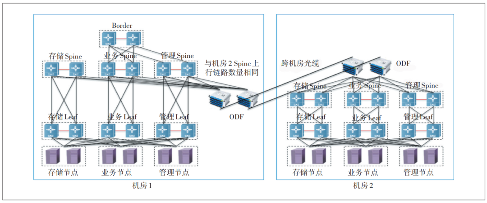
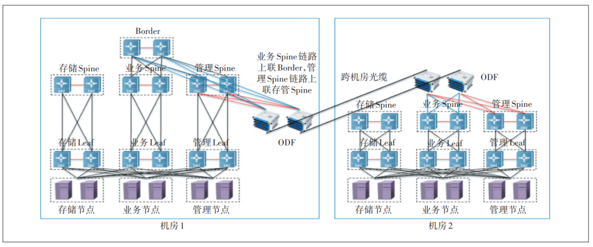
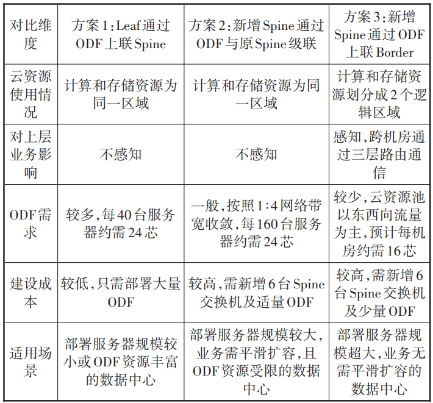

# 超大规模数据中心跨机房组网方案研究

> 原文链接：[超大规模数据中心跨机房组网方案研究](https://mp.weixin.qq.com/s/thMmVmdQNyBmQlZvBYpN9Q?clicktime=1770277525&enterid=1770277525&exptype=unsubscribed_card_recommend_article_u2i_mainprocess_coarse_sort_pcfeeds&ranksessionid=1770277520_1&req_id=1770272749891704&scene=169&subscene=200)

摘 &nbsp;要

随着数据中心规模的不断增长，其内部组网复杂度跨越式提升。在新基建浪潮之下，如何建设一张与数据中心规模相匹配的高效网络，确保数据和业务在数据中心内畅行无阻成为关键。分析了不同规模云资源池的网络架构和机柜需求，针对超大规模云资源池的跨机房组网需求提出3种部署方案，并进行深入的对比分析。

**&nbsp; &nbsp;0 1 &nbsp;&nbsp;**

**数据中心的重要性及组网挑战**

云计算和人工智能作为数字经济的关键技术，正在推动全球经济重组和竞争格局的改变。2024年11月，亚马逊云科技联合电信咨询服务公司发布研究报告，报告显示2023年企业上云对全球GDP的贡献超过1万亿美元，预计到2030年将突破12万亿美元。云计算和人工智能技术的发展已成为创新驱动的引擎和产业转型升级的加速器，全球主要国家正在加紧制定战略规划，力图打造未来竞争新优势。

与之对应的是全球算力规模持续提升。据中国信通院数据，截至2023年底，全球算力总规模达到910 EFLOPS（FP32），同比增长40%，呈现高速增长态势。同时，数据中心数量、机柜总数也迅猛增长。据相关部门调研数据，我国在用数据中心机柜总规模从2017年的166万架增长到2023年的810万架，年平均增长率为30%（见图1）。

**图1 &nbsp;2017—2023年中国在用数据中心机柜数量**

数据中心云资源池的构建并非机柜设备的简单堆积，而是通过高速网络互联技术将不同类型终端设备连接到一起，确保它们能够高效通信，同时利用虚拟化技术将物理资源抽象化，形成灵活可用的资源池，进而提供便捷的云计算产品和服务。

随着数据中心设备逐渐增多，单个云资源池的规模也越来越大。目前，互联网公司的公有云资源池规模已超过10万台服务器，这对数据中心网络的可靠性、扩展性提出了更大的挑战，尤其是超大规模数据中心跨机房组网增加了设备连接的复杂度。本文根据数据中心云资源池设备规模，梳理归纳了典型的网络架构，并对数据中心常见的跨楼层组网场景进行深入分析，提出了针对性的部署建议。

**&nbsp; &nbsp;0 2 &nbsp;&nbsp;**

**数据中心网络架构**

如图2所示，业界数据中心的主流网络采用CLOS架构，通过多级交换机的设计实现大规模数据流并行传输，采用多路径冗余机制以增强容错能力，构建高性能、可扩展的网络，确保关键业务的连续性和稳定性。组网方案需要根据数据中心云资源池的不同规模和应用规划来进行匹配。

**图2 数据中心网络架构示意**

a）中小型云资源池：2级CLOS架构是应用较早且较为普遍的网络架构，现如今仍是很多场景的首选。整网只有2种设备角色，Spine设备选用具有独立控制平面、转发平面的框式交换机，并采用冗余设计来提高整个系统的可靠性；Leaf设备选用性价比高、端口密度大的盒式交换机。2级CLOS架构的数据转发路径短，跨Leaf一跳直达，路径和时延具有很强的一致性，这给设备部署和水平扩展带来很大的便利。该架构适用于部署在各地的汇聚机房和边缘机房，可支持几百至数千台终端设备组网，并随着交换机性能的提升，组网规模也在不断扩大。

b）大中型云资源池：为解决2级CLOS架构在网络规模上的瓶颈问题，引入了3级CLOS架构。该架构在2级架构的基础上增加了一级汇聚交换机（S-Spine），由Spine交换机和其下连的所有Leaf交换机共同组成一个POD，通过S-Spine交换机将多个POD连接成整个网络。通过增加POD的数量，可实现网络的水平扩展，从而大幅提升网络的扩展能力。同时，以POD为单位进行业务部署，在适配多种业务需求、提供差异化服务等方面更具灵活性。3级CLOS架构适用于部署在大区中心或核心机房，可支持上万台终端设备组网。

c）大型、超大型云资源池：互联网企业在商业模式和基础设施层面不断创新，每秒几亿乃至几十亿的业务量对数据中心规模提出了更高的要求，这也带动网络结构的再次进化。不同于3级CLOS架构中每台S-Spine都需要和所有Spine交换机全互联。在基于盒式设备的多级多平面组网架构中，Spine交换机被分成多组（组数与每个POD中Spine交换机数量相同），每组中的S-Spine交换机均可构成一个独立平面，而每个POD中的Spine交换机只需和对应平面的S-Spine交换机连接即可。由于Spine交换机和S-Spine交换机使用相同的设备，整个网络的转发跳数和延迟高度一致，这为业务部署和网络调优创造了巨大的优势。

多级多平面组网架构主要用在大型互联网企业，可支撑数十万级别终端设备的超大规模网络，并且整个网络正从100GE向200GE、400GE以及更大带宽的方向演进。

**&nbsp; &nbsp;0 3 &nbsp;&nbsp;**

**跨机房组网方案选择**

根据工信部发布的《关于数据中心建设布局的指导意见》，数据中心可以根据标准机柜数量划分为以下类型：小型数据中心（标准机柜少于1 000个）、中型数据中心（标准机柜数量为1 000~3 000个）、大型数据中心（标准机柜数量为3 000~10 000个）和超大型数据中心（标准机柜数量为大于10 000个），这里所说的标准机柜以2.5 kW为一个单位。但单个机房通常只能容纳100~500架机柜，若按每台服务器600 W测算，可部署400~2 000台服务器。因此，对于服务器规模超过上千台的中大型云资源池，需要考虑将设备部署到多个机房。可以将核心网络设备和云资源池管理节点集中部署到基础设施条件较好的机房，再根据建设批次或业务类型将以服务器和Leaf接入交换机为主的设备部署到其他机房。

跨机房组网通常会使用光纤配线架（Optical Distribution Frame，ODF），它在光纤通信系统中主要用于主干光缆的成端和分配，方便光纤线路的连接、分配和调度。ODF配线架常见的芯数有24芯、48芯、96芯、144芯等，光缆接口类型有FC、ST、SC、LC等。在数据中心中，ODF用于连接服务器、存储设备和交换机等设备，实现数据中心高密度的光纤网络互联。

根据业务需求和部署经验，数据中心云资源池跨机房组网方案主要有3种。

3.1 跨机房方案1：Leaf通过ODF上联Spine

如图3所示，在新机房（机房2）只需部署服务器、存储和Leaf接入交换机等设备。根据组网拓扑，将Leaf交换机上联链路通过ODF连接至原机房（机房1）的Spine交换机。新机房可以根据Leaf交换机下行端口数量（一般为48口10GE/25GE，其中横连链路、预留端口占用4~6个），以40台左右服务器为建设单位，并配套一组业务、管理、存储Leaf交换机，部署在4~7个连续的机柜。Leaf交换机下行端口使用光纤尾纤连接服务器、存储设备，上行端口通过光纤尾纤连接本机房的ODF，根据传输距离选择合适的单模或多模光纤。ODF通过跨机房光缆连接至原机房的ODF，并使用光纤尾纤将ODF对应的端口连接至业务、管理、存储Spine交换机。在组网拓扑中，一对Leaf交换机通过交叉组网上联对应的Spine交换机。在加入一组跨机房ODF时，需注意避免端口连接错误。此外，为提高网络可靠性，建议每个机房的ODF成对部署，Leaf交换机的链路负载分担到不同的ODF上。

**图3 &nbsp;Leaf通过ODF上联Spine组网拓扑**

3.2 跨机房方案2：新增Spine通过ODF与原Spine级联

如图4所示，在新机房（机房2）需部署服务器、存储设备、Leaf接入交换机和Spine汇聚交换机等设备。最下层终端设备和Leaf交换机组网方式保持不变，Spine交换机的上行端口通过跨机房ODF连接至原机房（机房1）的业务、管理、存储Spine交换机。

**图4 新增Spine通过ODF与原Spine级联**

**组网拓扑**

该方案中新机房的Spine交换机主要负责流量汇聚，新增的存储和管理Spine交换机负责二层报文转发，存储和管理网络平面的三层网关仍设置在原有的存储Spine和管理Spine上。对于使用VxLAN协议的业务网络平面，新增的业务Spine与原有业务Spine进行三层互通，打通underlay层网络以进行VxLAN报文转发，且不感知内层业务信息。这种方式可满足跨楼层间大二层网络互通需求，不同机房的服务器和存储设备资源可规划到相同的计算池/存储池，从而满足虚拟机跨机房迁移需求。

3.3 跨机房方案3：新增Spine通过ODF上联Border

如图5所示，在新机房（机房2）需部署服务器、存储设备、Leaf接入交换机和Spine汇聚交换机等设备。最下层终端设备和Leaf交换机的组网方式保持不变。存储Spine无需上行端口，业务Spine的上行端口通过跨机房ODF连接至原机房（机房1）的Border，管理Spine的上行端口通过跨机房ODF连接至原机房的管理Spine。

**图5 新增Spine通过ODF上联Border**

**组网拓扑**

该方案中，新机房的计算和存储资源与原机房进行分离，独立成单独的计算和存储资源池。由于使用一套云平台底座，管理Spine需与原管理网络平面连接，以便管理节点对计算和存储资源进行管理分配；存储资源仅供本机房计算资源中的虚拟机使用，无需跨楼层组网；而计算资源中的虚拟机需要与外部网络通信，因此业务Spine需上联Border交换机。

3.4 跨机房方案对比分析

跨楼层方案对比分析如表1所示。跨机房方案1并未改变资源池的组网架构，不影响云资源的规划使用，且经济性较好，因此通用性较强。跨机房方案2在方案1的基础上增加了Spine交换机进行链路汇聚，节约了跨机房光缆资源，适用于服务器数量较多且数据中心光缆资源不足的场景。跨机房方案3在方案2的基础上将不同机房的计算和存储资源进行分割，适用于各机房服务器规模超大，且部署不同业务的场景。

表1 跨楼层方案对比分析

 

**&nbsp; &nbsp;0 4 &nbsp;&nbsp;**

**跨机房组网对智算中心的影响**

智算中心主要采用高功耗的GPU服务器。主流的训练型GPU卡功耗在300~700 W。配置8张GPU卡的服务器功耗往往超过4 kW，是普通服务器功耗的8~20倍，对基础设施需求也同比增加。因此，对于超大规模训练的智算中心，跨机房组网几乎是无法避免的。

如图6所示，相比传统数据中心，智算中心网络架构新增了2个网络平面：智算参数面和智算样本面。智算参数面是用于GPU训练服务器之间通信的参数网络，智算样本面用于智算服务器访问高性能文件存储。为实现智算区域大带宽、低时延、零丢包的网络特性，业界主流采用无带宽收敛的Fat-Tree组网架构，使用200GE/400GE超高带宽链路以及RoCE/IB协议。因此，跨机房组网对智算中心影响较大。

**图6 智算中心网络架构**

a）网络延迟：连线变长会增加网络传输时延。对于需要频繁同步的分布式训练，额外的时延、抖动（延迟波动）可能破坏GPU集群的同步性，拖慢训练速度，甚至导致模型收敛速度下降。

b）网络带宽：随着连线长度增加，信号会出现衰减，导致数据传输量和传输速度降低。此外，多个数据中心机房之间的网络路径更为复杂，容易出现网络拥塞点，影响智算中心的稳定性和计算效率。

c）扩展性及管理复杂性：将服务器分散部署在多个机房，随着智算中心规模扩大，服务器之间的连线管理和网络扩展会变得更加困难，网络拓扑结构也更加复杂，这增加了扩展的成本和维护管理的难度。

综合分析，跨机房组网对智算中心的性能影响较大，考虑到智算中心建设成本较高，建议选用基础条件较好，尤其是具备液冷技术的数据中心。跨机房部署智算中心是“算力扩展性”与“网络性能衰减”的博弈，应根据业务应用场景，将紧耦合任务（如AI训练）尽量集中部署，避免跨机房分割；松耦合任务（如推理）可参考上述3种跨机房组网方案进行分布式部署。

**&nbsp; &nbsp;0 5 &nbsp;&nbsp;**

**总结与展望**

3种跨机房组网方案均已发展成熟，且具有丰富的部署经验与案例。每种方案都具备独特的优势与挑战，选择时需综合考量具体需求与条件，权衡利弊。同时，随着AIGC、机器视觉、自动驾驶等业务的兴起，智算中心引入了200GE、400GE超高带宽链路，以及IB、ROCE无损网络技术，这对网络传输时延、可靠性提出了更高的要求，未来网络需在技术创新方面进行突破，如使用全光交换替代包交换来提升网络带宽和速度，通过新型空芯光纤增加传输距离，引入更加智能的网络管控系统实现高效调度，以满足多样化的组网需求。

作者简介

张世华，工程师，硕士，主要从事云计算、智算方面的咨询、规划和设计工作；

文湘江，高级工程师，硕士，主要从事云计算、智算技术选型与维护等工作；

童俊杰，高级工程师，博士，主要从事云计算、智算规划与架构设计等工作；

刘千仞，高级工程师，硕士，主要从事云计算、智算规划与架构设计等工作；

张奎，正高级工程师，硕士，主要从事云资源、通信云咨询、规划和设计工作；

胡祎，高级工程师，硕士，主要从事云资源、通信云咨询、规划和设计工作；

刘俊通，毕业于电子科技大学，主要从事通信网络的规划与建设工作。

推荐阅读

[400G传输网络现网测试性能优化研究](https://mp.weixin.qq.com/s?__biz=MzU4NTY4Mjg1Mg==&mid=2247642128&idx=1&sn=e6eef938dd7d27a374a4e71e143ed58a&scene=21#wechat_redirect)

[智能内生对移动网规建维优的影响探讨](https://mp.weixin.qq.com/s?__biz=MzU4NTY4Mjg1Mg==&mid=2247641922&idx=1&sn=dffaa4bed43753637689204b2db7b66d&scene=21#wechat_redirect)

[关键指标异常根因定位方法研究](https://mp.weixin.qq.com/s?__biz=MzU4NTY4Mjg1Mg==&mid=2247641921&idx=1&sn=625e89191b20956e4c41642d4c8e2af0&scene=21#wechat_redirect)

[基于RFID的无源室分监控检测精度提升研究](https://mp.weixin.qq.com/s?__biz=MzU4NTY4Mjg1Mg==&mid=2247641615&idx=1&sn=1bf1728c20f044c77f2817fd8b645a01&scene=21#wechat_redirect)

点击“阅读原文”，下载论文PDF

 

**头条号｜**邮电设计技术

**官方网站｜**http://ydsjjs.paperopen.com

**编辑**｜李星初 &nbsp;**审核**｜袁江

