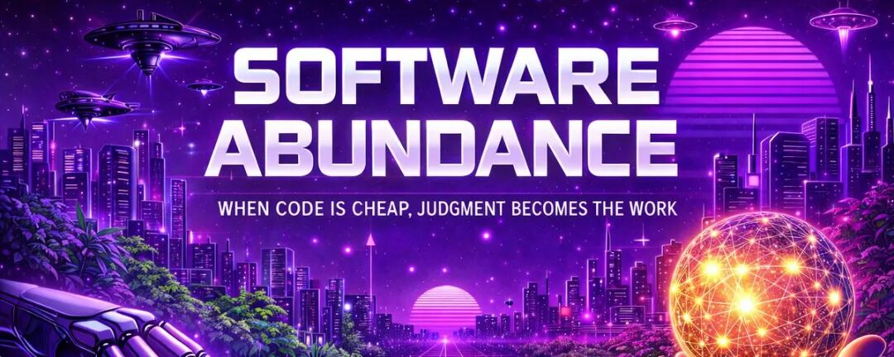
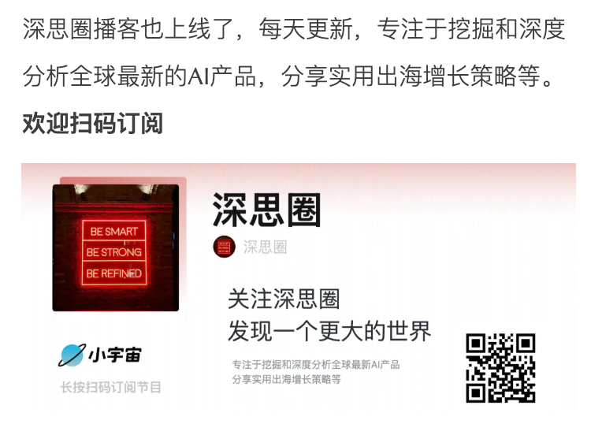
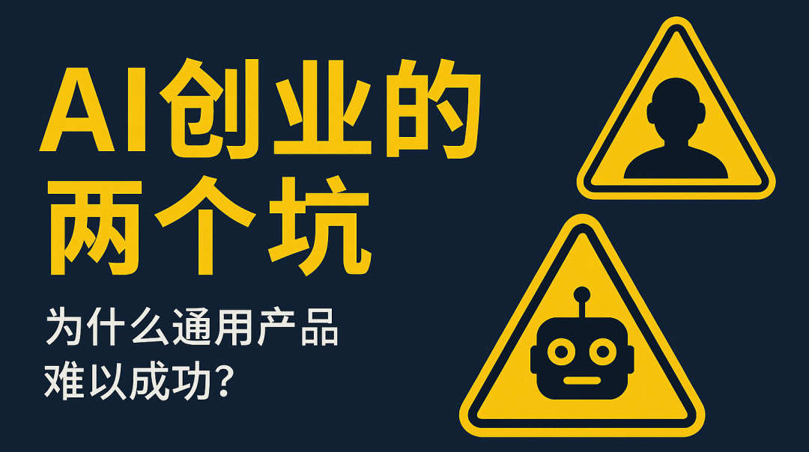
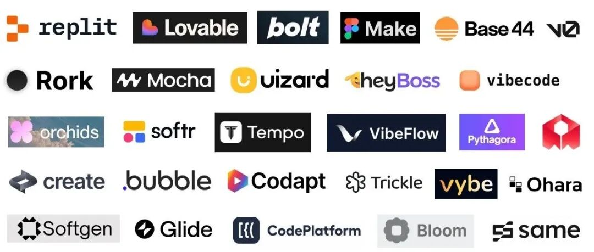

# 软件股崩盘启示录：当 AI 让代码变得廉价，软件真正的价值在哪里？

> 原文链接：[软件股崩盘启示录：当 AI 让代码变得廉价，软件真正的价值在哪里？](https://mp.weixin.qq.com/s/y7q7pOtjPp1r3NGBbgdRsw)

 

前几天写的《[深度长文分析｜软件股暴跌背后，AI 时代哪些公司能活下来](https://mp.weixin.qq.com/s?__biz=Mzg3NDc2MjQxMg==&mid=2247493374&idx=1&sn=dd3f2097e7c60af26bf92a52225584ac&scene=21#wechat_redirect)》大家讨论很多，今天再来深度讨论一下当软件开发成本无限趋近于0时，软件的真正价值究竟在哪里。我在去年其实就写过一篇相关文章，感兴趣的朋友也可以阅读《[深度分析｜当AI时代软件成本趋于零时，商业模式会有哪些变化？](https://mp.weixin.qq.com/s?__biz=Mzg3NDc2MjQxMg==&mid=2247489272&idx=1&sn=032e16751d9699aecfd220d9eb03ea37&scene=21#wechat_redirect)》。

十个人能不能重建 DocuSign？从纯粹的代码角度看，答案可能是肯定的。但这个问题真正有趣的地方在于：这十个人会把时间花在哪里？他们不会花在敲代码上，而是会花在辩论边界情况、合规要求、信任保证、可审计性、错误语义、用户体验，以及在不同法律环境下"签名"到底意味着什么。这个问题不是关于执行能力，而是关于判断力。

最近读到 Sarah Guo 的一篇文章，她提出了一个我认为极其深刻的观点：当代码变得廉价时，judgment（判断力）才是真正的工作。这个观点彻底颠覆了我对软件开发演进的理解。在软件历史的大部分时间里，执行是稀缺的。写代码慢、贵，而且受限于人的产出能力。困难的部分是让软件存在本身。但 AI coding agents（AI 编程代理）正在反转这个世界。代码现在可以快速、廉价、大规模地生产出来。执行不再是限制因素，特别是对于那些在前沿运作的团队来说，结果的好坏更多是由协调和判断决定的,而不是打字速度。

我对这个转变的理解是：我们正在经历软件开发的范式转移。从稀缺性经济转向丰富性经济，而这种转变带来的影响远比大多数人想象的要深远。当某样东西从稀缺变成丰富时，价值就会转移到其他地方。在软件领域，价值正在从"能不能写出代码"转移到"知不知道该写什么代码"。这不是一个小调整，而是整个行业底层逻辑的重构。

**从执行到意图的转变**

Sarah Guo 在文章中指出，当软件变得丰富时，清晰表达 intent（意图）的能力反而变得稀缺。这有时被描述为创意胜过执行的胜利，但这种说法完全错过了重点。在真实系统中，大部分重要的 intent 都是深度技术性的：积累的上下文、系统知识,以及关于权衡的判断。工作并没有消失，它只是转移了。

我深有感触。过去几个月，我在使用 AI coding agents 时，发现自己花在引导和纠正 agent 上的时间,和我直接写代码的时间差不多。一开始我觉得自己很蠢，好像在犯一些不该犯的错误。但后来我意识到，这个反应本身很有信息量。它指向了系统中那些我隐性理解但从未清晰表达过的部分。工作从打字转向了澄清判断。

当你告诉一个有经验的工程师"让这个更快"，他们不会把这当成字面指令。他们会推断上下文：是延迟重要还是吞吐量重要，这里的"足够快"意味着什么，哪些权衡是可接受的,以及什么时候应该质疑这个前提本身。Coding agents 不具备这种背景。你要么规定得不够详细,得到一个看似合理但实际错误的东西；要么规定得过于详细,花在写指令上的时间比直接写代码还多。

软件丰富让这个鸿沟变得可见。执行错误的 intent 很便宜，这意味着不对齐会很快显现出来。我认为这是一个好事。过去，错误的决策可能要等到系统上线运行很久之后才会暴露。现在，由于 AI 可以快速把你的想法变成代码，你会更早地发现自己的想法是否清晰、是否正确。这种快速反馈循环实际上在加速学习。

**什么是"不可接受的代码"**

Sarah Guo 提出了一个特别精准的概念：随着 agents 能力提升,主要的失败模式发生了变化。问题很少是代码崩溃。不可接受的代码能运行、能通过测试、看起来合理,但它违反了系统的隐含契约。在实践中,这通常意味着打破了不可见的 invariants（不变量）：关于幂等性、顺序、失败语义、数据完整性或遗留耦合的假设,这些从未被写下来,因为它们是通过经验学到的。

这段话让我想起了我在实际项目中遇到的无数次困境。这种代码可能跨越了不该跨越的边界,优化了错误的维度,引入了脆弱的抽象,错误处理了边界情况,或者悄悄移除了未来的选项。一个人类工程师会拒绝它,不是因为它不正确,而是因为他们不想拥有它。正确性和可接受性之间的鸿沟,正是工程 intent 变得重要的地方。

我发现这个观察特别深刻,因为它触及了软件工程中最难以量化的部分：品味。知道什么时候某个东西在技术上是对的,但对于你正在构建的系统来说形状是错的。这种判断力无法通过测试用例完全捕获,也很难形式化。它来自于对系统深层理解,来自于见过太多次某种模式最终导致问题,来自于对长期维护成本的直觉。

Sarah Guo 在文章中提到,他们在一些快速增长、有数百名工程师的公司中看到这种情况。早期系统是由还在发展高级判断力的团队快速构建的。代码能工作,扩展得足以发布,然后成为后续一切的基础。当 AI coding tools 变得更强大、在日常工作中更普遍时,它们忠实地复制了那些早期模式。临时决策变成了默认值,并在代码库中重复。随着时间推移,哪些架构选择是偶然的、哪些假设没有被审查过、哪些决策承载的权重远超任何人的预期,这些都变得清晰起来。

我认为这揭示了一个更深层的真相：自动化会放大任何已经存在的结构。当那个结构是隐含的时,放大会让它变得可读。这既是机会也是风险。机会在于,那些一直存在但从未被正式化的模式和假设,现在因为被大规模复制而变得显而易见,团队可以有意识地决定哪些要保留、哪些要修改、哪些要丢弃。风险在于,如果你没有意识到这个动态,你可能会在不知不觉中把技术债务扩大十倍。

**并非所有代码都同样可规范化**

Sarah Guo 提供了一个特别有用的框架来理解 agents 在哪些地方工作得好,哪些地方会遇到困难。这是一个关于 intent 明确性和稳定性的谱系：

在谱系的一端是非常容易规范化的代码,比如数据库、编译器、协议。Intent 是形式化的、可检查的。然后是操作性规范化的代码,比如持续集成、ETL（数据提取转换加载）、CRUD 服务,范围控制占主导地位。接下来是测试锚定的代码,比如业务逻辑、bug 修复,部分 intent 可以被捕获。

然后情况开始变得棘手。品味密集型的工作,比如重构、API 设计、抽象,规范和判断变得关键。以人为中心的工作,比如产品逻辑、用户体验、命名,intent 会演化。最后是难以规范化的工作,比如架构、策略,intent 存在于代码之外。

随着你在这个谱系上往下移动,失败不再看起来像 bugs,而是看起来像你不信任的代码。我发现这个框架特别有用,因为它帮助我理解为什么有些时候使用 AI coding agents 感觉像魔法,有些时候却感觉像在跟一个不理解上下文的初级开发者打交道。

关键洞察是：agents 不是在所有类型的编程工作上都同样有效。它们在 intent 可以被明确表达的地方表现出色,在 intent 依赖于隐性知识和品味的地方则会遇到困难。这意味着,作为工程师,我们需要学会识别哪些工作适合委托给 agents,哪些工作需要人类深度参与。这本身就是一种新的技能。

**从个人技能到组织能力**

Sarah Guo 观察到,现在有些公司的 ARR（年度经常性收入）超过 1 亿美元,快速增长,但计划保持在大约 100 名工程师以下——每个人都在 intent 并行表达的极限上运作。最强的用户不是写出更好的 prompts（提示词）。他们更好地管理 intent。他们指定结果而不是步骤,尽早暴露假设,保持 diffs（差异）小而可审查,推动更简单的解决方案,并像对待不可信的 pull request 一样对待 agent 输出。

这段话让我意识到,我们正在见证软件开发从个人技能转向组织能力的转变。过去,一个公司的工程能力主要取决于它能招到多少优秀的个人贡献者。现在,越来越取决于它如何构建系统和流程来捕获、传播和放大判断力。

她提到,在快速增长的初创公司中,高级工程师越来越依赖测试和实时系统,而不是仔细阅读代码。她讲了一个工程师的故事,这个人曾经通过让自己在每个 pull request 后吃一颗 M&amp;M 来保持 PR 的小巧。今天,每当系统确认约束时——在 canary（金丝雀部署）保持稳定后、回滚成功后,或者 invariants（不变量）在应该触发时触发——他就吃一颗 M&amp;M,而且他需要一个更大的碗。

我喜欢这个比喻,因为它生动地展示了验证重点的转移。从验证代码本身,转向验证代码在系统中的行为。这是一个深刻的转变,因为它认识到在软件丰富的世界里,读懂每一行代码变得越来越不现实也越来越不必要。重要的是建立正确的约束和检查点,让系统自己证明它的行为是可接受的。

Sarah Guo 把这称为 judgment engineering（判断力工程）：将积累的经验转化为显式约束、测试和边界的工作,系统和团队可以据此运作。做得好的话,它让高质量决策更容易在人员、时间和系统之间重复。

我认为这个概念捕捉到了软件工程演进的本质。我们正在从"写代码"的时代,转向"编码判断力"的时代。这不是说写代码变得不重要了,而是说最高杠杆的工作正在转向如何将人类的判断系统化、可重复化、可扩展化。这种转变对工程师的技能要求提出了新的挑战:不仅要懂技术,还要能够清晰地表达为什么某个技术选择是对的,能够将隐性知识显性化,能够设计出捕获判断力的系统。

**从软件团队到软件密集的世界**

Sarah Guo 提出,当编写和维护代码的成本下降时,组织不再问某件事是否可以自动化,而是开始决定是否应该自动化。软件扩散到内部工作流、边界情况和特定领域的流程中,这些过去太昂贵或太脆弱而无法编码。

像 CRM（客户关系管理）或 HRIS（人力资源信息系统）这样的系统从外部看起来很直接,但它们代表了数千工程师年花在编码业务逻辑、例外和约束上的时间,这些都是通过艰难的方式学到的。软件丰富不会抹去这项工作——它改变了类似判断现在可以多快、多广泛地被表达。

在一个软件密集的世界里,价值不再主要累积到单个工具上,而是累积到决定哪些决策被自动化、在什么约束下自动化的人身上。我认为这是一个关键洞察。当更多东西变成软件时,另一个瓶颈变得更清晰：首先形成正确的 intent。足够了解一个领域,能够从客户那里提取期望的行为——理解他们的意思,而不仅仅是他们说的话——变得越来越有价值。

这让我想到,软件丰富时代的赢家可能不是技术最强的公司,而是最懂业务、最能将业务理解转化为清晰 intent 的公司。技术执行能力正在被商品化,但对问题的深度理解、对客户真正需求的洞察,这些依然稀缺。

Sarah Guo 提到,模型可能会在这项工作上提供越来越多的帮助：暴露不一致、测试解释、让假设显性化。这能走多远仍然是一个开放的问题。但下游的一切都是从这里形成的 intent 扩展出去的。我同意这个观点,但我也认为,至少在可预见的未来,形成正确的 intent 仍然需要深度的人类判断。AI 可以帮助我们更快地迭代、更早地发现问题、更系统地测试假设,但它还不能替代对业务的深度理解和对客户需求的敏锐洞察。

**瓶颈在哪里**

Sarah Guo 的结论非常有力：软件丰富迫使 intent 浮出水面。随着自动化增加,判断力开始表现得像类型系统：它定义了什么是允许的、什么可以安全组合、失败会在哪里浮现。弱判断让几乎任何东西都能运行。强判断在错误扩散之前就排除了整个类别的错误。软件丰富使判断力成为杠杆的单位。

我深刻认同这个观点。在代码稀缺的时代,杠杆来自于能写出代码的能力。在代码丰富的时代,杠杆来自于知道该写什么代码的判断力。这不仅仅是个人层面的转变,更是组织层面、行业层面的转变。

我一直在思考这对软件工程师的职业发展意味着什么。过去,成为优秀工程师的路径很清晰:学习编程语言、掌握算法和数据结构、了解系统设计、积累项目经验。这些依然重要,但它们不再足够。现在,工程师还需要学会如何清晰地表达 intent、如何将隐性知识显性化、如何设计捕获判断力的系统、如何在人和 AI 之间有效分配工作。

这种转变对工程教育也提出了新的挑战。我们不能只教学生如何写代码,还要教他们如何思考代码背后的 intent、如何评估不同实现的权衡、如何在系统层面做出判断。这些能力过去可能被视为高级工程师才需要的,现在却变成了基础能力。

从公司层面看,这种转变意味着组织需要重新思考如何评估和培养工程人才。简单地看代码产出不再有意义。需要看的是：这个人是否能清晰地表达 intent？是否能做出好的判断？是否能将判断系统化？是否能有效地与 AI coding agents 协作？这些都是新的评估维度。

我也在思考这对软件行业竞争格局的影响。当代码变得廉价时,竞争优势不再来自于能写出代码,而是来自于知道该写什么代码。这意味着那些拥有深度领域知识、能够清晰表达业务需求、能够做出好的技术判断的团队,将会获得巨大的优势。反过来,那些只是执行能力强但缺乏判断力的团队,优势会逐渐消失。

**我的一些深度思考**

读完 Sarah Guo 的文章后,我一直在反复思考一个问题：这种转变到底是让软件开发变简单了,还是变复杂了？表面上看,代码变得更容易写了,这应该是简化了。但实际上,对 intent 清晰性和判断力的要求提高了,这又是复杂化了。

我的结论是：这种转变降低了进入门槛,但提高了天花板。写一个能运行的程序变得更容易了,但写一个优秀的、可维护的、长期可持续的系统变得更难了。这是因为,当执行不再是瓶颈时,所有其他的问题都变得更加突出：你真的理解问题吗？你的解决方案真的是最优的吗？你考虑了所有的边界情况吗？你的设计能够适应未来的变化吗？

这让我想起了一个更广泛的模式：每当某项技术让某种工作变得更容易时,它也会提高对其他能力的要求。文字处理软件让打字变得更容易,但也提高了对写作能力的要求。搜索引擎让查找信息变得更容易,但也提高了对信息筛选和批判性思维的要求。现在,AI coding agents 让写代码变得更容易,但也提高了对判断力和 intent 清晰性的要求。

另一个我一直在思考的问题是：这种转变对不同经验水平的工程师影响是什么？对初级工程师来说,AI coding agents 可能是一个巨大的加速器,帮助他们更快地学习和产出。但如果他们过度依赖 agents,可能会错过建立深层理解的机会。对高级工程师来说,agents 可能让他们能够在更高层次上操作,但也要求他们更清晰地表达那些过去只是隐性知识的东西。

我认为,成功适应这种转变的关键,是找到人和 AI 之间正确的协作模式。不是把所有工作都交给 AI,也不是完全拒绝使用 AI,而是理解各自的优势和局限,在合适的地方使用合适的工具。人类擅长判断、理解上下文、做出权衡决策；AI 擅长快速执行、处理大量细节、探索多个选项。最好的结果来自于将两者有机结合。

最后,我想说的是,软件丰富时代的到来,实际上是对整个行业的一次试炼。它会暴露出那些一直依赖执行能力但缺乏深度判断力的工程师和团队。它也会奖励那些一直在培养判断力、积累领域知识、建立系统化思维的人。这不是技术的胜利取代人的胜利,而是更高层次的人类能力——判断力、洞察力、创造力——变得更加重要和有价值。

软件丰富不是终点,而是新起点。它开启了一个新的竞争维度,在这个维度上,判断力成为最稀缺、最有价值的资源。那些能够适应这种转变、提升判断力、将经验系统化的人和组织,将会在这个新时代中获得巨大的优势。

**结尾**

也欢迎大家留言讨论，分享你的观点！

觉得内容不错的朋友能够帮忙右下角点个赞，分享一下。您的每次分享，都是在激励我不断产出更好的内容。

**欢迎关注深思圈，一起探索更大的世界。**
**- END -**

**往期文章**

**[两个“特别坑”的AI产品创业方向，你知道吗](https://mp.weixin.qq.com/s?__biz=Mzg3NDc2MjQxMg==&mid=2247487112&idx=1&sn=536a697321489223a6893e4a565123d4&scene=21#wechat_redirect)**
[‍](http://mp.weixin.qq.com/s?__biz=Mzg3NDc2MjQxMg==&mid=2247483795&idx=1&sn=41fde9cbffc00fc498b97d44e2e2111e&chksm=ceca9850f9bd11463d673f37f6bce26465c3e20584bbcb0a81ff92a38f451ca827f91edb7859&scene=21#wechat_redirect)[‍](http://mp.weixin.qq.com/s?__biz=Mzg3NDc2MjQxMg==&mid=2247483795&idx=1&sn=41fde9cbffc00fc498b97d44e2e2111e&chksm=ceca9850f9bd11463d673f37f6bce26465c3e20584bbcb0a81ff92a38f451ca827f91edb7859&scene=21#wechat_redirect)

**[速度将成为AI时代唯一的护城河](https://mp.weixin.qq.com/s?__biz=Mzg3NDc2MjQxMg==&mid=2247487823&idx=1&sn=1673f78279211c04a14e9dcf157f4721&scene=21#wechat_redirect)**

**[a16z重磅预测：Vibe coding赢者通吃？错了，垂直专业化才是未来](https://mp.weixin.qq.com/s?__biz=Mzg3NDc2MjQxMg==&mid=2247489057&idx=1&sn=708c6673da1ab453f1586c729713139f&scene=21#wechat_redirect)**
[‍](http://mp.weixin.qq.com/s?__biz=Mzg3NDc2MjQxMg==&mid=2247483847&idx=1&sn=5333d3019a54be79d65d0d0987bb202d&chksm=ceca9804f9bd1112514043c11114ca78f732c7815a61371f058444c365891bd9b352a21c37b2&scene=21#wechat_redirect)[‍](http://mp.weixin.qq.com/s?__biz=Mzg3NDc2MjQxMg==&mid=2247483847&idx=1&sn=5333d3019a54be79d65d0d0987bb202d&chksm=ceca9804f9bd1112514043c11114ca78f732c7815a61371f058444c365891bd9b352a21c37b2&scene=21#wechat_redirect)

