###   
作者：白玉光

> 正如李飞飞在她的自传中的说的：人工智能算法不是像传统算法那样，被告知该做什么，而是通过数据来学习该做什么，这也是本文想要表达的核心内容。

### 

导读：

推开AI的门，你是站在门外怕迟到的人。很多人害怕迟到，害怕在众目睽睽之下，被视作一个犯错的学生。就如同，AI“呼的一下”就来了，并且发展迅猛，很多人也怕被它甩在后面，而我就是其中之一。 神经网络是了解AI大模型无法绕过的话题，是现代大模型的基石。但是别看它现在风光，在过去的半个多世纪，却是无人问津，甚至备受争议，以至于等到它再次复出时，不得不被迫改名换姓，叫作深度学习。我在第一个部分将围绕神经网络基本概念，并将自己学习过程中的疑问，融入到文章内容，希望有着同样疑问人也能有所收获。 第二部分，我会利用前文的神经网络的知识，为大家勾勒大模型的大致轮廓，先是大模型的推理，而后是大模型训练。由于GPU与大模型相生相伴，我也将在其后，分享一些AI浪潮下，它对基础设施有哪些新要求。大多数人其实很少会直接接触到大模型，而更多是通过Agent来使用它，因此在文章的最后，会简单分享一下人们是如何使用大模型的。 

### **1.****你有没有想过**

当第一次体验到大模型带给你的惊喜时，你有没有想过，它到底是怎么思考的？你或许忙碌、疲惫，连思考“它是怎么思考的”都来不及去思考。可是在过去的很长时间里，**模型参数、token、向量化、蒸馏、温度系数** 等层出不穷的新概念，不断地融入你的工作和生活，你也许已经习以为常，日用而不知。

我也时常在想：大模型的 “思考” 过程，和这些概念到底有着怎样的关联？有没有一条清晰的主线，能把这些零散的知识点串联起来？答案……其实就在我们常听到的神经网络里。神经网络既是大模型的思考“内核”和“骨架”，又是大语言模型的核心思想来源，以神经网络为起点，开启本文，我觉得应当比较合适。提到神经网络，我便会想起过去的一件小事儿。

  

### **2.****即便是十几年后**

即便是十几年后的今天，我也会时常记起，曾经教过我的一位计算机老师，他个子不高，身材匀称，戴着小框眼镜。在一次课堂上，他抛出了一个让我耳目一新的概念-神经网络。然而他对此却颇有微词，认为人类在连神经是怎么回事儿都没搞明白的情况下，提出这个理论就是故弄玄虚。虽然我一头雾水，但这种观念此后一直影响着我，当有人在我面前讲出一个“花里胡哨”的新名词时，我的第一反应总会下意识浮现“故弄玄虚”这四个字。

直到参加工作后，随着阅历的增长，我逐步地发现，吃老婆饼的人，也并不是全都有老婆。甚至有的制作老婆饼的小作坊老板，也有单身多年的。于是，面对新事物，我的态度逐步从“故弄玄虚”转变为“先学习看看”。

当然，让我下决心研究神经网络的原因，远不止于此。更为关键是，“神经网络”这四个字里面藏着“网络”两个字。在网络这个行当从业多年，职业的惯性，让我对这两个字极为敏感，以至于在我第一次做胃镜，看到又黑又粗的胃镜管时，第一个想到的就是，网络光缆被挖断时，夹带着泥土的黑色的网络光缆。

  

### **3.****既不是神经也不是网络**

#### **3.1.****输入层、隐藏层、输出层**

人们常常会“谈神经网络色变”，原因就在于，当你正准备了解神经网络时，有的人会劝你，要先掌握好矩阵运算，也有人会告诉你，要你懂点微积分、懂点链式求导。可是像我这样数学功底并不扎实的人来说，常常因此就望而却步了，况且我还是个外行。

本文也正是基于这样的出发点，尝试通过梳理自己在学习过程中，对一些基本概念的理解，来为大家勾勒出大语言模型的大致轮廓。尽量达到“虽然我不知道怎么计算，但我知道为什么要算”的效果。

神经网络之所以叫网络，单纯从它的长相来看，它确确实实是由不同的层组成，每一层又有多个不同的节点，相邻层之间的节点进行了全互联（也称full-mesh），看着就像是一张“网”。

在我初次接触神经网络时，这样的架构让我喜上眉梢，让我产生了神经网络也“不过如此”的错觉。因为作为一名计算机网络从业者，“接入层交换机-汇聚层交换机-核心层交换机”这种网络分层的设计思想，对我而言，早已熟稔于心。

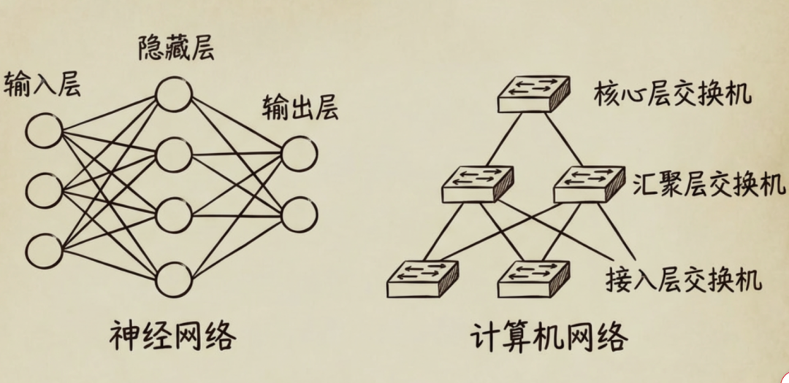

如果把发送流量的服务器A作为信息输入，把接收流量的服务器B作为信息输出，那么按照神经网络的定义，服务器A上联的接入层的网络交换机，就叫**输入层** ；而接收流量的服务器B，其上联的接入层网络交换机就被称为**输出层。** 位于输入层与输出层之间的这些层，在神经网络的理论中，把它称为为**隐藏层。** 它叫什么当然不重要，你也可以把它称为透明层，或者黑盒层。重要的是，当别人提到**隐藏层** 时，你心里要很清楚，其实它的结构和输入层、输出层没什么两样，只是因为它夹在中间罢了。

#### **3.2.****正向传播**

从服务器发送出来的信号，进入接入层交换机后，经过汇聚交换机A-核心交换机层-汇聚交换机 B，到达目标服务器上联的接入交换机后，最终传递给接收该信号的服务器。但网络通信向来讲究是“双工”：接收信号的服务器也有很大概率会发送信号，同样原本发送信号的服务器，也会理所当然地允许它接收信号。这样一来，车头变车尾，所以当我们讨论网络输入层时，其实也是在讨论输出层，反之亦然。

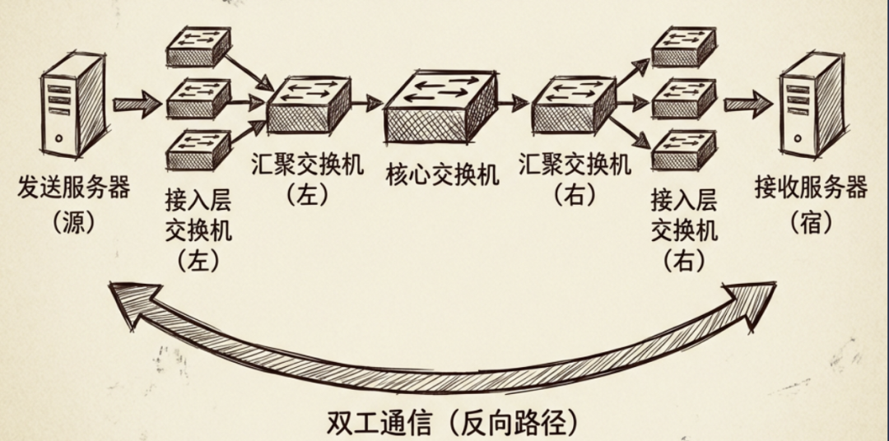

但很可惜，“双工”的理论并不适用于神经网络。因为神经网络严格规定了输入层就是输入层，它永远不可能变成输出层。并且信号只能从输入层单向传递到输出层。在神经网络中，人们把信号从输入层，逐层经过隐藏层后层，传递到输出层的过程，称为**正向传播（也称前馈）** 。

这种严格定义数据流向的概念，在我所熟知的网络领域，也是屡见不鲜。人们最常听说的就是上行带宽和下行带宽。下行也就是下载，指的是运营商网络到家庭网络的这个方向。我们刷短视频时，流量始发于数据中心中的短视频服务器，然后经过运营商网络再进入到家庭网络。所以，对于家庭用户来说，这类流量就是**下行流量** ；相反，对于短视频服务提供商来讲，它们流量的主要方向就是**上行** 。

运营商可以针对不同方向的带宽策略，组合成不同的商业化产品，实现产品和收益的分层。比如家庭宽带产品往往是上行带宽远低于下行带宽，而企业宽带产品往往是上行带宽和下行带宽保持一致。

因此，我们不得不思考，在**神经网络中，严格区分信号传播的方向，是否也像上行带宽或者下行带宽那样，有着很强的目的性？背后是否有着它不为人知的深意呢？**

#### **3.3.****神经元**

到目前为止，我只提到了神经网络中的“网络”，而忽略了“神经”，这对于懂行的人来说，简直就是舍本逐末。没错，要回答上述的疑问，这个时候就不得不提“神经”了。神经网络之所以叫神经网络，因为它确确实实发源于人体神经这个学科。这也就是为什么，你不能把“神经网络”简称为“经络”，因为经络是另外的人体学科，常常需要推拿。

当我在网上搜索有关神经网络的起源时，我惊讶地发现，人工神经网络在我爸爸的哥哥还没出生时，就已经被提出了。“神经”这个词源自于大脑神经元。在神经元上有两类“东西”：一类据说可以接收信号，人们把它叫作**树突** ；另一类据说用来连接其他的神经元，可以传递信号，人们把它叫作**轴突** 。从命名上你也可以看出，树突像树的根须一样，用来感知人间冷暖，被认为是大脑信号感知器。而轴突，就像车轴一样，用于连接其他神经元和传递信号。

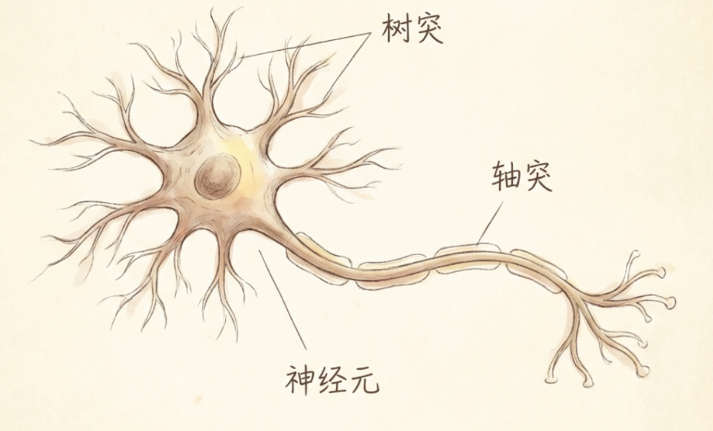

有意思的是，大脑神经元也有着不同的分工，负责接收信号的神经元被称为感觉神经元、负责传递信号的神经元则被称为联络神经元、负责输出信号的神经元被称为运动神经元，分别对应着**神经网络的输入层、隐藏层、输出层的节点** 。

我们大脑的感觉神经元从树突接收到信号，经过神经元上的轴突，再传递到联络神经元，最后由运动神经元输出，整个过程都是单向的。就如同一个漂亮姑娘的视觉信号，传入你的大脑神经之后，你脱口而出一句“哇塞”一样，就是这么自然而然。这理解起来似乎不是太难，因为你实在是很难想象相反的过程是怎么发生的。正如我很难想象人体的消化系统逆向消化是怎么发生的一样。

神经网络满含着人们对于“高度模拟大脑”的期待，就这样诞生了。正因为大脑神经元信号传递的不可逆，所以神经网络的信号传递也严格要求**不可逆，信号只能从输入层向输出层方向传递。** 可想而知，对于神经网络中的节点被称为**神经元** 这件事**，** 你也就不足为奇了吧**。**

#### **3.4.****线性与非线性**

不过有一件事情，你必须了解，大脑神经元从树突收集到信号后，并不是直接交给轴突传递给其他神经元。在一次与同事的闲谈中，有人说我们的大脑神经元，有可能写满了if...else语句。我觉得这很有意思，因为据说神经元有很大的自由度，当它收到信号后，可以自由选择输出或者不输出给下一个神经元。神奇远不止于此，即便是它选择输出，输出的信号强度也是不一样的。我姑且将神经元的这些行为，统称为信号加工。

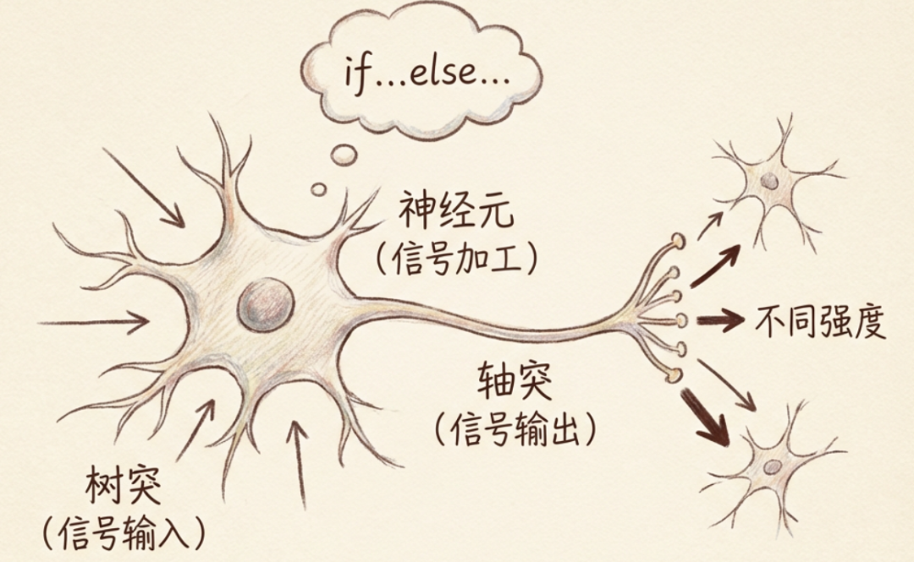

同样，神经网络中神经元对于信号输入，也是要经过层层加工的，这是与网络分层通信模型（指网络拓扑而非TCP/IP）最本质的区别之一。在网络通信中，不同层级的网络设备只对业务信号进行转发，是彻彻底底的信号“搬运工”。这是因为网络设备最忌讳的就是对业务信号进行“加工”。只有在网络设备出现故障时，才有可能让信号失真。所以，在网络通信中，如果你发送给张三的红包金额是10元，无论中间的网络有多少层、多少节点，张三也一定且必须要收到10元。这种输入与输出的关系，用数学函数表示就是：y=x\(x为信号输入\)。那么，通信网络中的输入和输出看起来就是一个**线性关系（输出值等于输入值的常数倍，其对应的函数属于线性函数）** 。如果我们寻求，用一种线性函数来表达一件事的输入和输出的关系，这个过程也被称为**线性回归或者叫线性拟合** ，比如你用大量线性组合对股价走势做拟合时，最终却可能得到一个非线性的结果。没错，虽然这听起来很神秘，但理解起来就是这么简单。

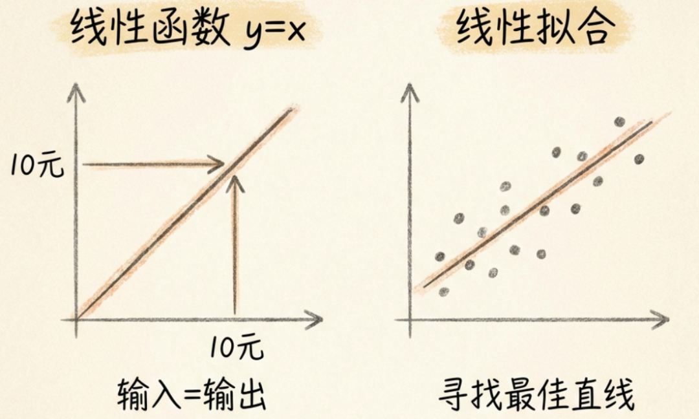

而对于由上百亿个“自主决策进行信号加工的”的神经元组成的大脑来讲，至少在直觉上，大脑神经元输出不会是简单的对输入的一种“搬运”。大脑的输入和输出必定是一种**非线性的关系。** 只是这种非线性的关系，人类至今还没有找到一个数学函数或者运算来准确表达。但我想，有时我说话很直接，偶尔会想到什么就会说什么，用我们老家话形容就是“一根筋”，那我的大脑不会是线性的吧。

#### **3.5.****激活函数与激活**

既然这样，与其说神经网络是对大脑神经元的模拟，还不如说是，神经网络所追求的是一种对大脑非线性能力的数学表达。那么，神经网络是如何试图做到这一点的呢？

问题的关键就在于神经元对输入信号的处理上。人类虽然并不完全知晓大脑神经元是怎么进行大脑信号加工的，但至少知道经过大脑神经元加工后的信号与加工前的信号并非简单的线性关系。受此启发，人们便开始在神经网络中的神经元接收信号之后，输出信号之前强制进行某种非线性的变换。执行这个非线性的变换的“工具”就被称为神经网络的**激活函数** 。也就是说神经网络中的神经元在接收到输入后，要经过激活函数计算后，才能转换成正式的输出。或许很多人对于**激活函数** 的多有耳闻，觉得很神秘，但事实上，它的目的就是这么的单纯。

既然我们口口声声说，激活函数就是用来进行非线性的变化，进而来模拟大脑神经元，那为什么激活函数不叫**非线性变换函数** 呢？我们该如何去理解“**激活** ”这两个字？

在神经网络诞生前，人类发现并不是任意的信号进入大脑神经元都可以转换成输出的，而是仅仅达到某个阈值后才能转换成有效输出，这个超过阈值进而“点亮”神经元的过程就被自然而然地称为“**激活** ”，就像有些人喝咖啡要至少3杯以上才能激活工作状态一样，这里的三杯就是一个激活阈值。于是激活函数的名字就被顺理成章的沿用至今了。

激活函数只是对普遍应用在神经网络中，可以进行非线性转换的所有数学函数的统称。从神经网络诞生至今，人们在神经网络中采用过多种不同的类型的激活函数。最早使用的激活函数名为“**阶跃函数** ”，虽然它名字听起来很“生僻”，但如果我告诉你，**输入信号经过阶跃函数的变换后，只会输出0或者1两个数字** ，想必你一定会觉得它还是很“平易近人”的。

阶跃函数并非单单因为足够简单才被应用到神经网络中的，而是因为阶跃函数完美契合了前文中提到的人类对于大脑神经元的理解：大脑神经元超过某个阈值后才会输出有效电波（可以用“1”表示），低于某个阈值就不输出电波（可以用“0”表示）。

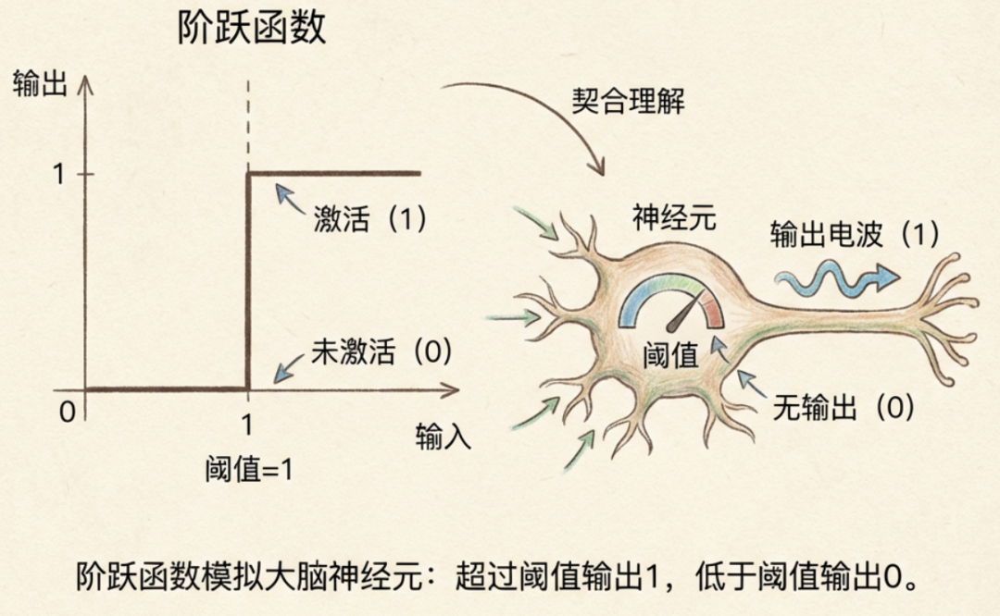

如果把阶跃函数比作安装在神经元上的“水龙头”，那么水龙头只有流水或者不流水这两种状态。人们越来越觉得它所能表达的输出信息很有限，很难模拟十分复杂的人类大脑。于是后来人们更换了另一个“水龙头”，这个水龙头不仅可以完全开启和完全闭合，而且可以控制水流大小。它的名字叫“Sigmoid函数”（当然也是非线性函数），形状是平滑流畅的S型，也被称为S型函数，可以输出0-1之间任意的连续数值。这样一来，它就可以精准表达神经元的‘激活强度’，而非单纯的‘激活/未激活’，进而能拟合更复杂的非线性关系。

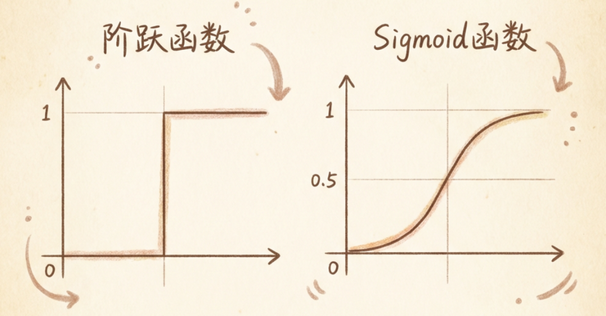

在神经网络不同的发展阶段，都有着不一样的激活函数在被应用或者被尝试，采用什么样的激活函数，既有上述提高输出丰富度、拟合复杂问题的考虑，也与神经网络自身的计算复杂度、计算成本有关。更重要还是“莫看广告看疗效”，哪个激活函数在实际训练过程中更能拟合人类大脑，不会产生各种各样问题，哪个就是最好的。虽然这听起来有点像废话，不过还请稍安勿躁。

#### **3.6.****权重和偏置**

关于神经元的非线性输出，我们讨论了很长时间，却忽略了最初的信号输入环节。这会让人误以为信号输入是自然发生的、是“天经地义”的事情。实际上并非如此，输入层的每一个神经元会将自己的信号传递给相邻隐藏层的所有神经元，这意味着隐藏层的单个神经元会同时接收到上一层多个神经元的信号输入。

如果你化身为神经元，对于多个信号输入，你会怎么处理呢？摆在你们面前的可能会有两个选择：其中一个选择是先对每一个单独的信号应用激活函数，进行非线性变换，然后将每一个变换后的结果**“综合”起来** ，再传递到下一层；而另一个选择是先将所有的输入“**综合”** 成一个结果，再针对这一个结果应用激活函数进行非线性的变换。由于后者仅仅需要一次综合运算，一次非线性变换，单从计算量上看，先综合后变换，计算成本较低。事实上，神经网络采用的也正是后者。

可是神经网络采用“先综合后变换”的原因，远不止于此。关键原因是非线性变换前先进行综合，有助于神经元能够捕捉不同输入之间的复杂关系。这句话虽然理解起来有点难，但是我觉得我总结的却是恰到好处。正如我给客户常常输出2-3个可选的网络方案一样，通过比对它们之间的优劣之后，再给出最佳的方案建议。**综合的过程实际上就是捕捉它们之间关系\(例如方案A比方案B技术复杂高\)的过程** 。如果在综合之前，我先对不同方案分别进行了加密处理，那么我就很难捕获它们之间的优劣。虽然加密和非线性变换不可等同来看，但这有助于你加深对它的理解。

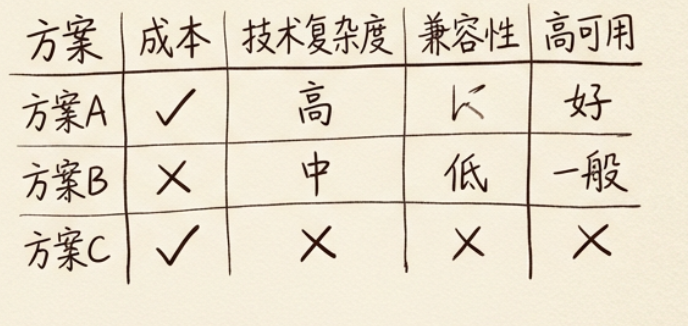

接下来就该聊一下“综合”的具体实现了，这和我们整合客户方案的思路有点类似：根据客户需求，为不同产品在整个方案中分配不同比重，然后与客户进行分享和交流。神经网络中的神经元，同样会为不同的输入分配不同的**权重（** 用**w** 表示）。如果用x1和x2分别表示第一个信号输入和第二个信号输入，用y`表示综合后的结果，那么y`=w1 *x1+w2* x2\(其中\*表示乘以\)。与此同时，你也可以看到，\*\*y`与x也是线性关系**，因为线性函数加上线性函数最终还是线性函数，用稍微专业一点的话来讲就是：**加权求和本质就是线性组合**。接下来，我们将综合后的结果y`，代入到激活函数进行非线性的变换后，再传递到下一层的所有神经元。这听起来是多么的自然。

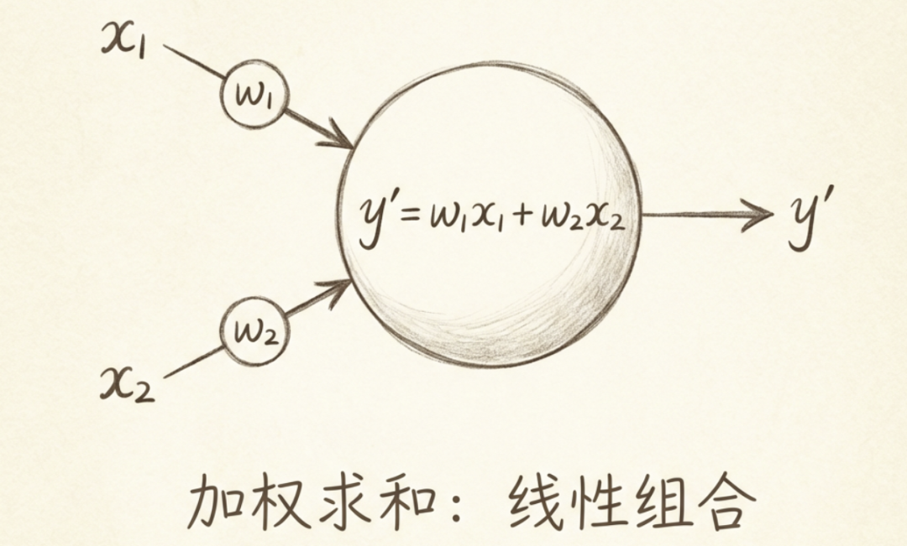

聪明的你可能已经发现，我写的公式好像和别人的不一样，别人的书籍里写的一般是：y=wx+b。那么我把这个b藏到哪里去了？其实。这是因为我还没有写完。前文我们聊到激活函数之所以叫激活的原因时，我们提到了阈值的概念。神经元将不同输入用权重加权求和后，还要和阈值进行比对后，才能被代入到激活函数。如果用t表示阈值，那么当激活函数为阶跃函数时，仅当y\`-t>0时，经由阶跃函数计算后，输出才会是1，否则就是0，0就表示神经元没有被激活。

神奇的时刻到了，如果t表示阈值，-t就是你所看到的b。这里的b，在神经网络中被称为**偏置，** 它的作用就是用来表示神经元被激活的难易程度。如你所愿，下面才是神经元从输入到输出的完整公式：y=f\(wx+b\)（y表示输出，f表示激活函数，w表示权重，x表示输入，b表示偏置）。虽然这个公式是到目前为止最长的一个函数，但我相信你对它已经豁然开朗了。

#### **3.7.****神经网络的参数**

权重和偏置是组成神经网络最基本的参数，它们是神经网络的“内核”。因此我们日常提到的模型参数，常常指的便是这些神经元的权重和偏置。神经网络中的每个神经元都具有独立决策能力，不同的神经元看待上一层相同节点的输入并非是一视同仁的。相反，不同的神经元会给来自相同神经元的输入，分配不同的权重。那么，如果一个神经网络有很多、很多层（隐藏层层数多了以后就叫深度神经网络）、每一层节点很多，那么这个神经网络的权重数量自然就会增加，增加到足以让你惊叹的规模。例如GPT-3的参数规模就达到了1750亿，而最新发布的deepseek V3.2的参数规模已经突破了6700亿。

  

了解神经网络的朋友们，可能还听过叫作“超参数”的东西。“超”是什么意思？是超级厉害、超级牛掰的“超”吗？其实它依然是非常简单，只是由于超参数常常与神经网络或者模型的训练相关，所以我打算将它放在下个章节与大家分享。

#### **3.8.****权重与参数、变量、数据**

在一次和同事闲聊时，我们都产生了一个疑问：一个动辄几十 GB 的大语言模型文件，难道里面装的全是冷冰冰的数字？这些数字又如何最终转化为人类能读懂的文字？模型文件的主体确实就是参数。不过当时我们忽略了一点，模型文件里还藏着一个叫**词表** 的东西。神经网络输出的数值，都会被映射到词表里面的词，转换成我们能看懂的文字。想通这一点后，我瞬间豁然开朗。

此外，初学者很容易**把参数和变量混为一谈** 。究其原因，是神经网络的参数在训练过程中会不断更新，看起来是 “可变” 的，于是觉得它是变量。但是在神经网络中，无论是学习阶段\(模型训练阶段\)，还是后续的验证、使用阶段\(推理阶段\) ，权重和偏置这些参数本质上是 “被不断调优的常量”。它们虽然会在训练中随着数据迭代不断调整，但**一旦训练结束、模型固化，这些参数就会固定下来，成为模型的 “固有属性”** （重新训练意味着要修改成千亿的参数，成本较高）。而真正的变量，指的是模型接收的输入数据 ，当然这些数据也会被提前转换为数字的形式。

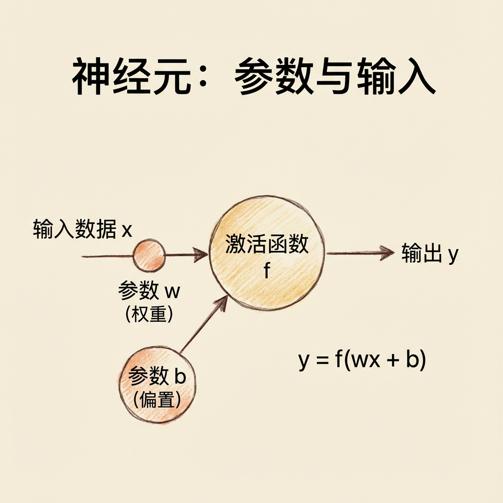  

### **4.****神经网络的学习**

#### **4.1.****神经网络与矩阵运算**

如果你此时手里有只笔，不妨简单勾勒一下，我们前文中提到的几个基本概念：在一个由一个输入层、一个隐藏层、一个输出层组成的神经网络架构中，每层都有两个神经元。两个信号被传递到隐藏层的每个神经元，经过加权求和，被送入到激活函数进行变换，然后传递到输出层，这便是神经网络的全貌了。

如果隐藏层数量较多，那就叫深层神经网络，至于“较多”到底是多少，我相信你不是特别关心。你能画出三层神经网络架构，也就能够画出30层，只是多耗费写笔墨而已。关键不在于如何去画，而是在于如何去算？但你也不必太过担心，因为它的计算过程仍然非常简单，如图所示（图中省略了偏置b），无非就是输入值乘以一个权重值或者分数值，再进行求和而已。

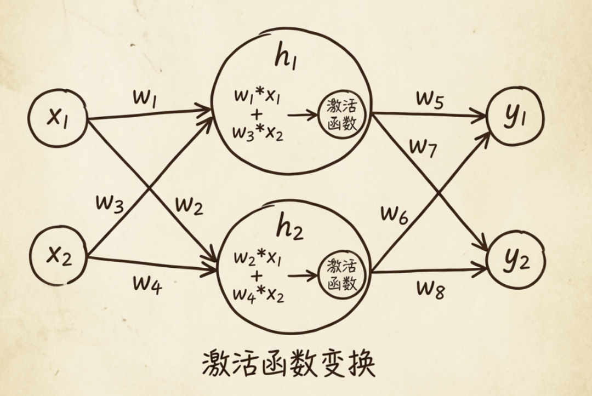

可是如果摆在你面前的是一张拥有1750亿个权重深层神经网络，你的感受又是如何呢？我们当然可以说：“反正也是交给计算机去计算，我无需在乎”。但问题的核心恰恰就在于此：**我们用笔从左往后右、以“拓扑展开”的方式，层层递进，逐神经元分步运算的计算过程，如何才能转换为计算机可以理解的方式去计算呢？**

我虽然试图把复杂的技术讲得通俗，但在数学面前，就算我再怎么“巧舌如簧”，也没办法改变它的严谨和抽象。所以我不得不坦诚的讲：**这个转换的过程实际上就是数学中的矩阵运算。** 如果你学过简单的矩阵运算，你就会说：哦，原来如此。

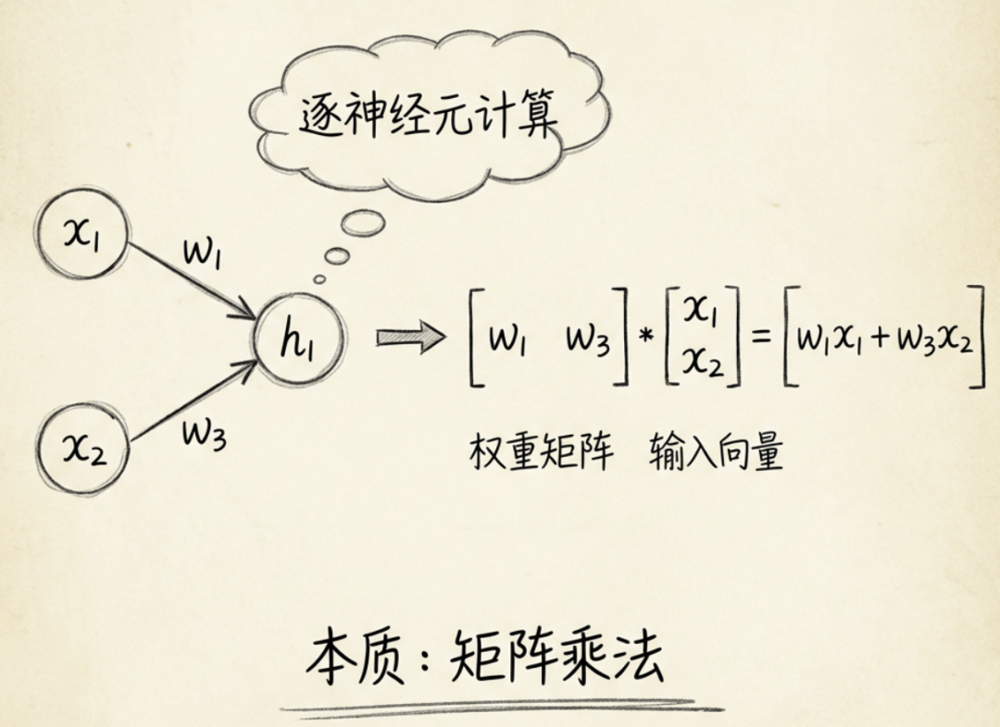

 *1\)**把隐藏层第一个神经元到上一层所有神经元的权重，放在一行\(行向量\)：（w1，w3）*

 *2\)**把输入层所有信号，放在一列（列向量）：*\[数学公式\]

*3\)**隐藏层第一个神经元的输入=行向量乘以列向量*

 *4\)**如果隐藏层有 2 个神经元，权重就会组成一个 2×2 的矩阵，输入信号还是 2×1 的列向量，一次矩阵乘法就能算出隐藏层所有神经元的加权和*

不论你是否看的懂，你只需明白，神经网络正向传播的过程，本质上就是多个不同矩阵按序相乘的过程。我们要做的仅仅是把这些**权重\(偏置等\)矩阵分发给GPU** 进行并行计算即可（我将在后面的章节简单分享GPU的并行计算方式）

#### **4.2.****预测值、目标值、神经网络学习**

神经网络的本质是对大脑的模拟，其正向传播则是模拟大脑神经元的思考过程，而正向传播的输出则是神经网络的思考结果。可是模拟毕竟只是模拟，如何评价输出结果的好与坏是最先要考虑的。于是，必须设定一个评价标准，给定一个参考值是必不可少的。如果神经网络的输出与预设的参考值之间的误差很小，甚至可以忽略不计，那么这个输出就被认为就是好的。反之，如果输出与参考值误差很大，那么这个的输出是不好的。好或者不好都是人类意志的体现。在神经网络以及大模型领域，**人们把输出称为预测值，而把预设的参考值称为目标值，人们也把标注目标值的过程称为打标签，** 我也不知道为什么非要叫这个名字。

如果一个输入信号经过神经网络层层计算，最终的输出与目标差不多接近，那么我们就会说：好吧，干的不错；如果输出与目标不一致，那么我们就会想方设法的更新权重和偏置，不停地尝试，缩小与目标的差距。这个不断尝试更新权重的过程，我们就称它为**神经网络学习。很明显能够看出，这个学习不是自主进行的，而是被人工标记的“目标值”监督进行的。**

#### **4.3.****照进神经网络的光**

这个世界是需要我们感知它的冷暖与悲欢的，我们靠皮肤感受阳光的温暖、靠眼睛发现人们笑容里的灿烂，用嗅觉感受着凡人心里面的烟火气……这一切最终会成为大脑神经元的输入信号。

可是，我上面提到的“输入值”、“预测值”、“目标值”听起来是如此的“不近人情”、如此的“冷冰冰”，这些抽象的东西和人间的人情冷暖又有何干？

人类对此早已有了回答，随着技术的进步，我们已经可以把文字、图片、视频、语音用一串串的数字来表示，这些技术已经在过去，都各自发展成了独立的学科，并走进了我们的生活。**人工智能也是伴随着这些多学科的发展而发展的** 。神经网络的输入层所接收的信号，便是这些领域数字化后的数学表示。因此，不论是输入还是输出都可以从“现实照进神经网络”，变成一串数字，进行计算。比如说，大语言模型中的“token向量”，实际上也是一种对于输入进行数字化的一种方式，对于token和向量，我们也将在后面的章节展开讨论。

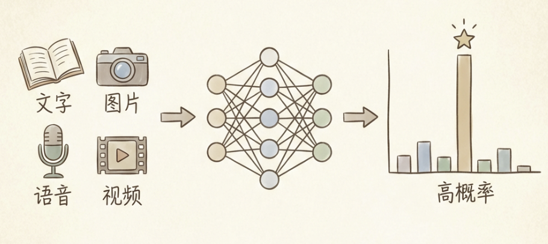

#### **4.4.****损失函数**

前文曾提到，神经网络的学习实际上根据“输出值与目标值之间的差异”来进行学习的，我们也把预测值与目标值之间存在的差额，称为**误差或者叫损失。** 例如**，** 在大语言模型中，我们把“恭喜”这个单词转换为数字，输入到神经网络中，如果输出的结果是“发财”的数字化表示，那么这个预测结果还不错；如果输出的结果是“春节”的数字化表示，那么这个预测结果就很难让人满意。此时我们就会拿着“恭喜”与“春节”之间的差额，通过更新神经网络参数，来逐渐逼近“恭喜”。

这里需要注意一个关键问题：**神经网络的计算误差时，常常需要叠加多个训练样本（即训练数据）产生的偏差** 。如果直接用简单的减法计算单个误差，那么所有样本中得到的结果就会有正有负。在误差叠加的过程中，这些正负误差很可能会相互抵消，比如一个 +3 的误差和一个 -3 的误差叠加后结果为 0，这会让模型误以为 “没有偏差”，进而有失公允，无法有效完成学习。

hi，bro，你也看到了，神经网络的研究领域还是比较广的，单单是一个误差的计算就有这么多门道，为了解决正负相抵的问题，有的人想出了用“绝对值“函数去掉误差的负号，也有的人想出了用”平方”函数取消误差的符号，这些函数也被统称为**损失函数，你也可以叫它误差函数，随你怎么叫。** 顺便提一句，在现代大语言模型中，常常使用一个叫作**交叉熵** 的损失函数来计算误差，这是因为语言模型本质上是一个概率模型（我们将在大语言模型中揭示这一点），而交叉熵函数可以更好的适应它。

现在我们重新复习一下，神经网络学习的过程，用数学语言来表达就是，**通过损失函数计算的损失，来更新神经网络参数，目的是让损失函数的结果在多轮学习后，无限逼近于0。**

**由于神经网络的最终输出是所有神经元共同计算的结果，因此人们有充分的理由认为，损失的产生是所有神经元共同作用的结果，** 没有一个神经元是无辜的。那么在成千上万的神经元中，我们如何将误差进行“摊派”，让每个神经元承担该有的责任，并且各自进行“整改”呢？**为了回答这个问题，反向传播便应运而生了。**

#### **4.5.****什么是反向传播**

神经网络既然有正向传播，那大概率就会有反向传播，如果没有**反向传播** ，那正向传播中的“正向”或许就失去了它修饰的意义。所谓 “反向”，顾名思义，**信息\(不再是信号\)传递** 的方向进行了 180 度大转弯：不再是从输入层到隐藏层再到输出层的 “正向推进”，而是从输出层朝着输入层的方向逐层传递（强调一点，不管是正向还是反向均不允许跨层传递信息）。

反向传播被认为是学习神经网络过程中最为困难的一个知识点之一，它的困难并非是对于概念本身的理解，而在于反向传播的目的究竟是什么？要回答这个问题，我觉得就不得不先思考一下：正向传播的目的和本质什么？

#### **4.6.****反向传播在传播什么**

反向传播的诞生就是为了解决误差“分摊”的问题，这是它的宿命。但我们不禁要问，为什么误差只能从输出层向着输入层的方向进行传递呢？误差为什么不能正向传播呢？要知道，正向传播相当于使用激活函数对最初的输入进行一次又一次的“套娃”，套娃的最外层就是神经网络的输出层，因此只有输出层才看得见最终的“误差”，输出层对“误差”负有最直接的“责任”。就如同在组装车间的流水线上，很多组装工人可能干了好几年，都没见过最终的成品，成品的合格率只有的质检员才有一手的数据。

因此，只有我们不断的反向解开套娃，才能将误差逐层地“分摊”到更前面的神经元。**由于“解套娃”的过程只能是反向的，所以才叫反向传播** 。就如同成本不合格时，也是“逆向”地逐层落实责任。

当神经网络的思考结果与现实不符，出现误差时，我们该怎么“追责”？是否可以采用“各打三十大板”的策略，将“误差”逐层平均分摊到每一层的神经元，这看起来是一种一劳永逸的简单做法。但我们更为朴素的想法是：**正向传播过程中，拥有较高权重的神经元大概率也会对误差有着较大的影响** 。正如人们所说，能力越大责任就越大。因此误差的反向传播，有着两种最为直接和朴素的策略，一类是平均分配；另外一类就是加权平均。这理解起来似乎很轻松。

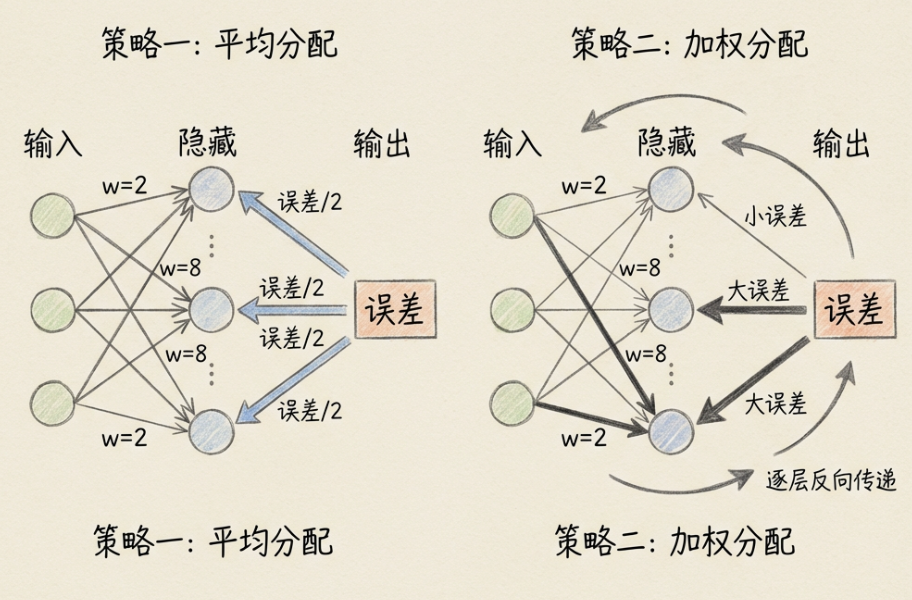

#### **4.7.****权重更新策略**

不论使用哪种误差传播策略，当每个神经元有了自己该承担的“误差”后，它接下来就要想方设法地去消除误差，让属于自己的误差尽可能逼近归零（强调一下，是误差逼近零而非输出逼近零），那它该怎么做呢？事实上，它并没有太好的办法，只能是采用类似于你的老婆和（huo）面蒸馒头时的策略：面硬了加水，水多了加面。神经元如果发现自身的误差较大，那么它可能会减小权重（当然还会调节其他参数，比如偏置），反之，则可能会增加权重。我之所以用“可能”，是因为每个神经元的输入还会被放入到激活函数，进行非线性变换，于是权重的增加大或减小，可能带来相反的、不是很确定效果。

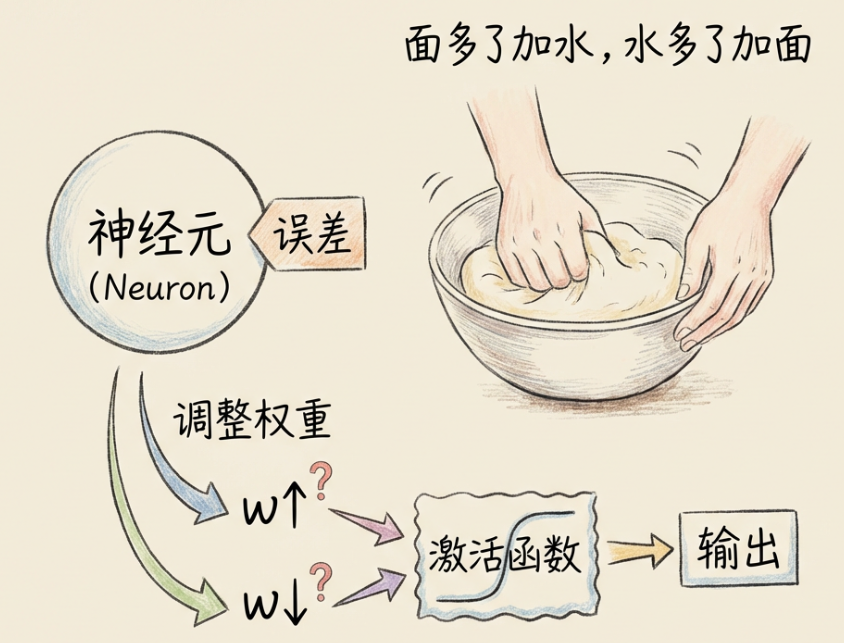

因此，基于经验或是猜测进行权重调整，妄图去消除成千上万的神经元误差，看起来是一种“碰运气”的方式，就算有幸碰对了，也要投入巨大的计算成本。况且，这次样本训练碰对了，没人能够保证下一次能够碰对。

#### **4.8.****链式求导与连续性**

这个困局在神经网络发明的几十年里一直存在着，直到1986年辛顿等人发表的论文，提出将链式求导法则应用在神经网络参数更新上，神经网络才迎来突破。**链式求导使得神经网络参数不再是漫无目的更新，而是有了精确可计算的数学依据** 。这相当于和面的师傅，从经验派转变为学院派，仔细看了菜谱，菜谱说：蒸10个馒头，需要750g面粉和200ml温水（面粉和温水数据来源于网络，请谨慎甄别）。

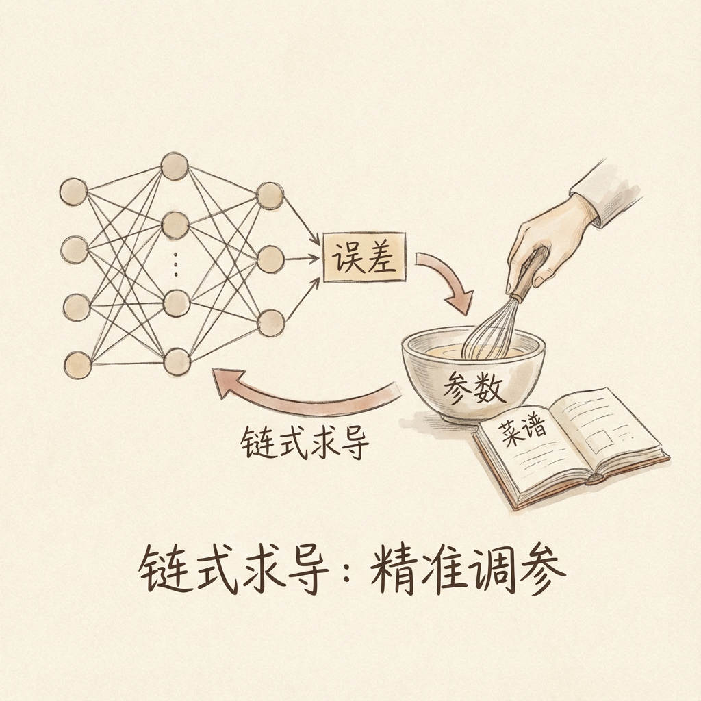

遗憾的是，接下来你不会看到链式求导的推导过程。因为一方面这类介绍比比皆是，而自己数学功底浅薄，无法做到深入浅出；另一方面，本文主要聚焦在基本概念的科普，而非数学推演。我想让你知道是链式求导法则归根结底，是在神经网络存在误差或者损失时，用来精确**计算神经网络参数的变化量。**

但是，不进行链式求导的数学推演，并不意味着要放弃对其核心思想的解读，何况其核心思想非常具有吸引力。在早先年，为了防止自行车被盗窃以及有人不交停车费，有的管理员常常用一条很长的铁链把一整排自行车全部连环锁起来，如果有人不慎推倒前面的一辆车，后面的自行车会类似于多米诺骨牌一样，被铁链接连拽倒，这就叫“链式可导”。**数学中链式求导的前提条件是要求函数是连续的，就像被铁链子拴起来一样连续** 。如果出现断点，那么就是“不可倒”，没办法进行导数计算。

链式求导计算的是损失函数的导数，而损失函数归根结底计算的是预测值与目标值之间的差异。而预测值本质上又是一系列激活函数层层计算后的结果，因此链式求导不仅要求损失函数是连续的，**而且要求激活函数也是连续的** ，否则没办法求导，进而无法精确计算误差更新。这也就是前文中提到的，阶跃函数后来被S函数替代的根本原因，因为阶跃函数虽然是非线性函数，但是它是不连续的函数，没办法应用链式求导法则。

由于链式求导的过程本质上是从最外层的“套娃函数”向最内层的“套娃函数”计算偏导数的过程，因此**链式求导仍然是反向传播的具体应用** 。

#### **4.9.****梯度下降**

神经网络中，链式求导与梯度下降常常一起被人提及，那么梯度又是什么？下降又是什么？为什么这么概念，好烦人。

我们先来看看，关于梯度下降的一般性解释：神经网络中，我们针对数值上连续的**损失函数** 进行链式求导，计算权重和偏置的偏导数，这些偏导数共同构成梯度，用来**确定更新方向** ，然后利用梯度下降法**确定参数的更新量** 。于是我们可以得出以下三个结论：

第一，不论是链式求导还是梯度下降，**作用的对象都是损失函数，最终的目的是通过不断更新参数** ，将损失函数的结果达到最小值，即误差趋近于最小值。这是神经网络的永恒目标，不容改变。

第二，链式求导计算出的结果即偏导数，利用这个结果我们可以确定神经网络参数的更新**方向** ，它为每个神经元的参数计算出了一个“指南针”。

第三，梯度下降，就是按照指南针，来确认参数更新的**变化量的方法。其中下降指的就是损失函数误差逐步减小。**

这便是链式求导与梯度下降的关系。另外关于梯度下降，坊间还流传一个说法：如果把一个球放在半山腰，他便会按照下降最快的方向，到达一个局部的最低点。这个说法听起来简直就是如沐春风。

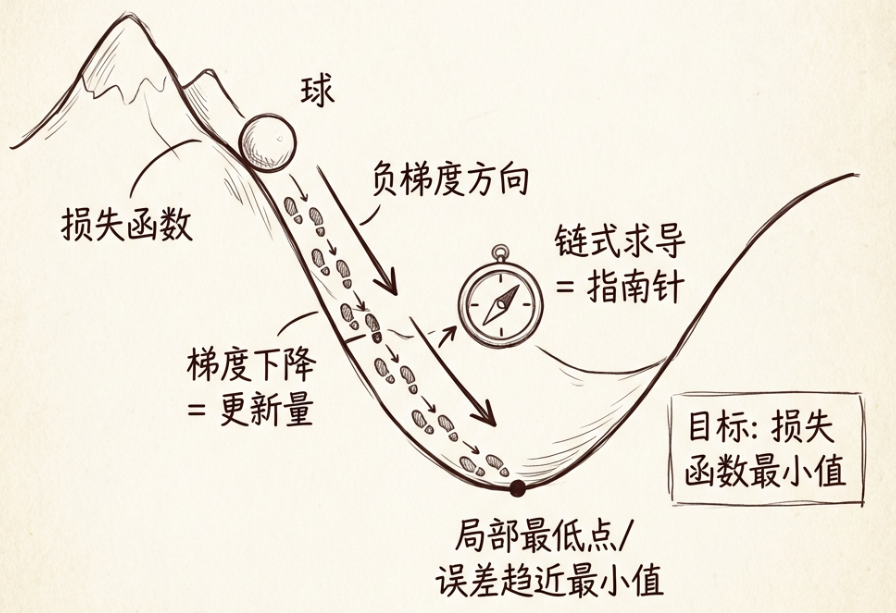

不过可能有人觉得这个说法过于浅薄，缺少数学依据。其实你误会了，这恰恰是对数学理论的通俗总结，这个理论便是**泰勒展开** 。泰勒展开从数学上证明了：在当前（神经网络参数一开始是随机化生成）参数点附近，沿着负的梯度方向小步调整，能保证损失函数值以最快速度持续下降。我相信，在你深入探究后，定会有更奇妙的收获。

 *Δθ= −η⋅ ∇θL（θL损失函数梯度），该公式展示了参数更新量与参数的梯度关系，即【参数更新量】等于\*\*负的* *常数倍* *的**参数梯度** 。以神经网络单个参数*\[数学公式\]*为例，更新后的*\[数学公式\]*=*\[数学公式\] \*−η \*\* \[数学公式\]

  

### **5.****初识大语言模型**

神经网络既是大语言模型的思考“内核”和“骨架”，又是大语言模型的核心思想来源，这一点毋庸置疑。但过于核心的东西往往显得抽象，不够具体，听多了可能会觉得无聊。因此，虽然神经网络还包含了循环神经网络、卷积神经网络等很多内容，但既然你已经读到这里，不妨用前文积累的知识小试牛刀，和我一起揭开大语言模型的神秘面纱。此刻，鼓励一下自己吧，相信你有了前文的铺垫，后面的部分理解起来一定会游刃有余。

#### **5.1.****大语言模型与神经网络**

不论你讲的是东北话，还是陕西话，和你交流的人都会觉得自然而然，不觉得会奇怪。甚至就算你不会用手写但也知道怎么用嘴说，这是因为语言是人类在日常生活中自然而然形成的，所以我们的语言也叫自然语言。

大语言模型便是专门来处理自然语言的神经网络模型，它本质上也还是神经网络模型，但是由于它是专门处理自然语言的，因此在自然语言处理方面想必会它的重头戏：一方面，它要在自然语言输入神经网络之前，进行预处理；另一方面，在神经网络输出后，要转换为人类可读的自然语言。

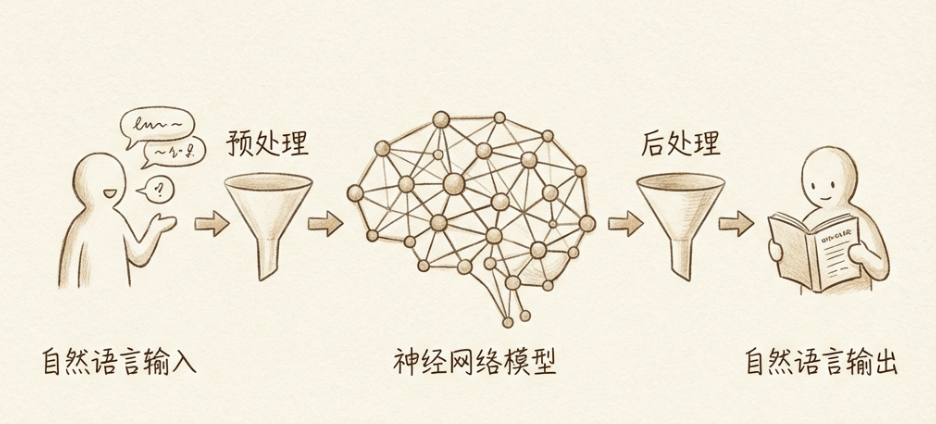

#### **5.2.****Token、分词**

不论你操着什么样的方言，宣泄着什么样的情绪，要想让大模型进行处理，都必须转换成可读的文字。回想一下，我们学习一门语言时，是不是先要认字，并了解它的含义。大语言模型也是这样“照猫画虎”，对于输入大模型的句子或者段落先要进行“断句”。例如我爱吃香蕉，它会被拆分成 我 | 爱 | 吃 | 香蕉这个四个词，显然，我们一般不会把“香蕉”这个词拆分成两个部分，这就是断句，也被称为分词。**分词的最终目标，是将文本拆解为语义紧密关联、且具备独立意义的最小语言单元** 。

用于分词的计算机算法有很多，什么？分词也需要算法？那可不嘛，智能不够，就靠算法来凑嘛。其中有一个叫作BPE的算法很有意思，如果在一段文本中，某两个字经常（高概率）挨在一起，那么，他们就被认为是具有独立语义的分词，像吸铁石一样，被组合在一起，成为分词，加入到分词表。就像当年在高中时，在晚自习之后，你和她三番五次（概率高）的被班主任“偶遇”，你们两就会被默认为是一对儿，成为“重点关注对象”。**通过分词算法，被拆分出的这些词也被称为Token** 。

一些大模型会对外提供计算token的接口，以GTP为例，我们可以通过访问：\*[ https://platform.openai.com/tokenizer ](https://platform.openai.com/tokenizer)\*，来计算输入的token以及对应的唯一编号。

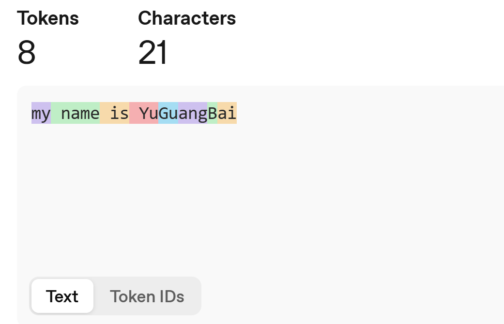

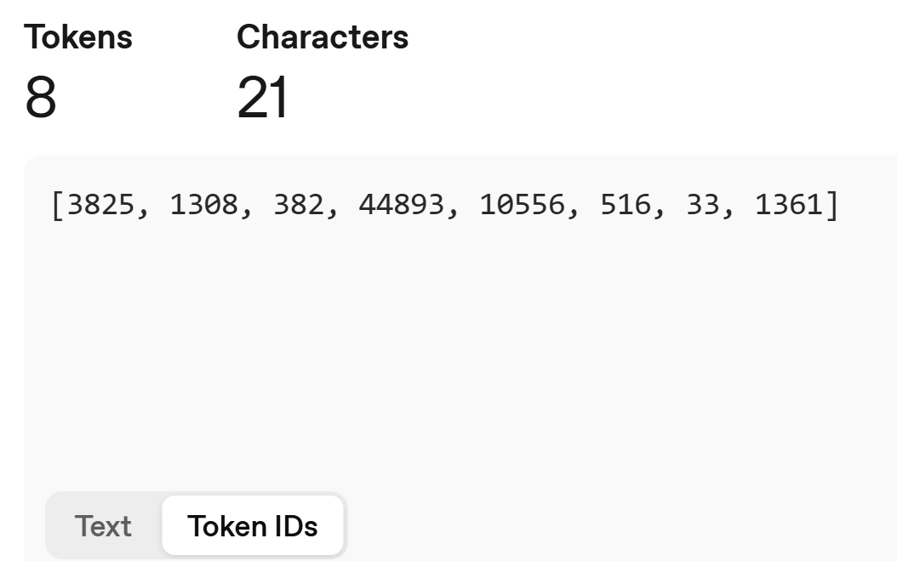

  
  

#### **5.3.****词表与词表大小**

Token并不是你用的时候才会被拆分，而是会预先生成。预先拆分好的Token会被记录在**词表** 中，不论是训练用到的样本数据，还是推理时的用户问题，都要通过查询这个词表来进行分词。那为什么训练阶段和推理阶段不能使用独立的分词算法进行Token拆分呢？

因为模型训练的本质其实是把词表中已有的词输入到模型进行学习，训练完毕后，模型参数就固定下来，也就意味着模型完成了对词表内容的学习。**因此模型的理解能力完全取决于其对词表中Token语义的理解。**

如果推理阶段不用“查字典”的方式来拆分Token，使用新的分词算法，很可能拆分后的分词在词表中查询不到，导致模型无法理解“陌生”的Token。另外，每次利用分词算法，进行分词的效率远远低于查字典的方式。

**词表中Token数量、种类不是越多越好** ，如果数量太多，而对应的训练数据不足，就会造成词表学习得不够充分。此时就更加凸显出高质量训练语料的重要性了。反过来，如果词表数量过少，就会出现另一个尴尬的局面：人们总是拿着一年级的生词本去理解一本书籍一样，这就会导致大模型的表达和理解能力不足。

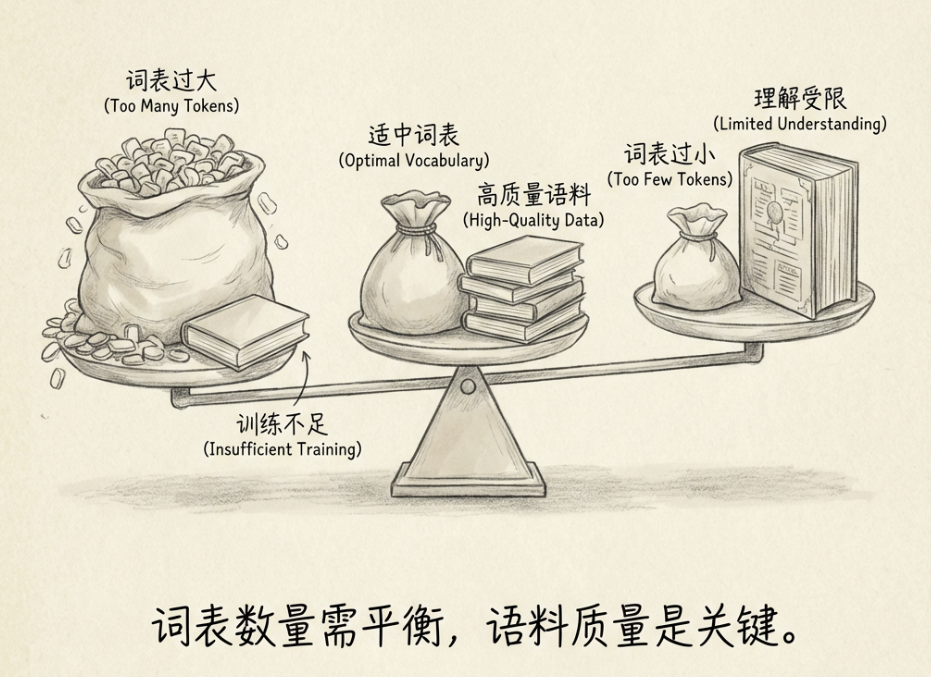

#### **5.4.****向量化和词嵌入**

看过前文的朋友应该知道，大模型学习其实就是矩阵运算（正向传播）和链式求导（误差反向传播）的过程，因此输入到大模型中信息必须是可以被计算的单个数值或者多个数值，因此token在进入大模型之前还需要被转换为单个数值或者多个数值。如果1个数值对应空间中的一个点，2个数值对应的就是平面坐标，多个数值对应的便是多维空间向量，也被称为**张量** 。就信息表达的丰富度而言，用**多维向量** 来表示一个token是不错的选择。于是**用多维向量表示token的过程，被称为向量化** 。

我听人们常说大语言模型可以学习语言的语义，这里的语义实际上指的是分词之间的亲疏远近，例如“妈妈”和“母亲”、“靓仔”和“帅哥”语义上几乎等同。那么，当他们被转换为多维向量，也就是一串数值之后，我们如何去表达他们之间的亲疏远近呢？

我们都知道，两点之间直线最短，我们虽然很难计算两点之间曲线、弯线的距离，但我们很容易计算两点之间直线的距离。这时你可能也会浮现出直角三角形求解最长边的画面：\[数学公式\]+\[数学公式\]=\[数学公式\]，通过这个勾股定理公式便很容易求解两点之间的距离。多维空间也同样存在着这样的距离，内行人常常把它称为**欧几里得距离。**

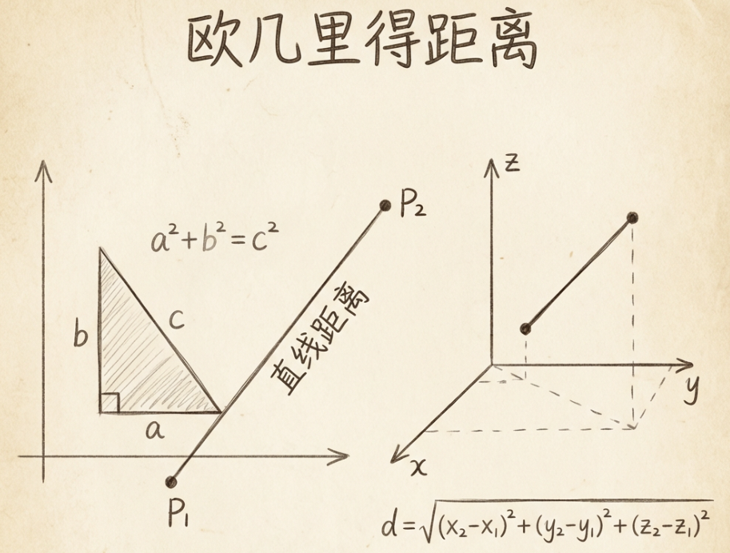

欧几里得距离非常直白地、非常坦诚地给我们展示了，不同向量的之间的亲疏远近，我们觉得也非常nice。但是，就怕的就是但是了，但是在神经网络计算过程中，这些向量可能会被拉伸或者缩小，这就会导致他们的之间的距离会发生“强烈波动”。例如爸爸在中年后可能会发福长胖，但是这丝毫不会影响它和“父亲”这个词的等同关系。因为即便是长胖或者变瘦，他的本质属性没有改变。那么如何用数学的语言来描述向量之间的本质关系呢？

我自己是不太可能琢磨出来的，我也是看了前人的结论，才在这里用文字与你相遇。空间中的多维向量除了有“距离”的属性外，人们把目光瞄准了“向量夹角”。如果两个向量之间的“夹角越小”，人类就可以“傲慢地”把他们视作“关系越近”。按照这个假设，人们就开始设法把语义相近的token，尽可能通过“数学的语言”，使得他们的夹角越小。这个数学语言就是知名的**向量点积，知名归知名，但** 向量点积，或许你闻所未闻，见所未见。我不想再和你绕弯子了，我要直接告诉你，**向量点积计算公式向我们揭示了：点积结果越大，那么他们的夹角就越小，他们所表达的token语义就越相近。**

最后，我们把token**“放入”或者“嵌入”** 到一个多维空间后，用向量来表示的整个过程称为**词嵌入（Word Embedding Vector），** 你也可以叫词放入或者词的向量化，因为本质上，他们都是一个意思。

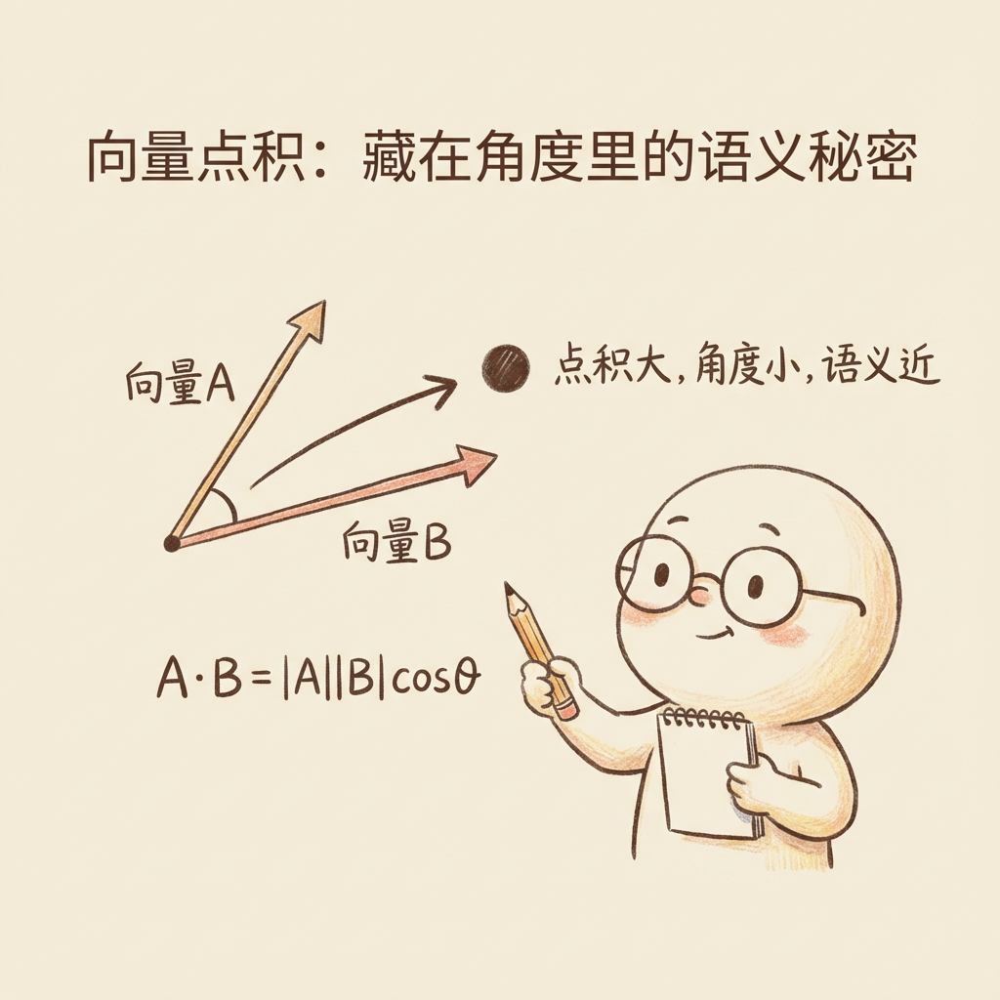

为了加深理解，你可以尝试去想一下，在计算机上我们是如何表示颜色的，你可能听过RGB三原色，没错，一种颜色，其实可以是，用一个三维向量来描述一个对象\(图为photoshop中调色板对应的RGB三维数字\)。

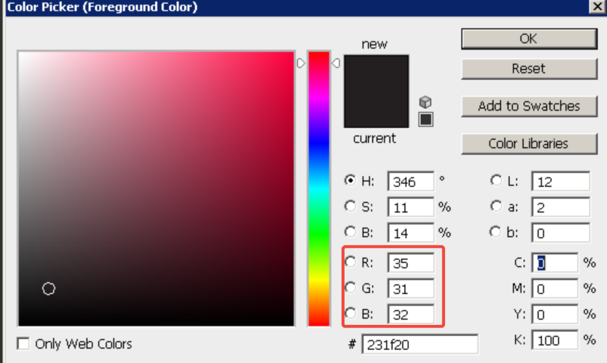

token对应的向量一开始是随机产生的，需要经过不断的训练，才能具备语义上的关联性。但是别人已经训练好的向量，你可以拿来即用，这就叫迁移学习。比如GloVe词向量文件就是别人已经训练好的，你可以直接下载下来使用，通过相似度计算函数，你会发现“男人”与“女人”的相似度高于“男人”与“猫”的。

#### **5.5.****大模型的输出**

当抑扬顿挫的中国话\(以汉语举例\)，转换为多维向量后，就会被送入神经网络进行计算，看过前文的朋友都知道，神经网络的计算本质上就是简单的、重复的矩阵运算。如果跳过前文，直接来到这个章节的朋友，你也不要有太多顾虑，你姑且把神经网络当作一个“迷宫”好了。现在假设你站在“迷宫”的出口，你一定很好奇：输入的向量经过神经网络的一番打扮后，从出口出来的究竟是什么？

这个需要你闭上眼睛好好想想：如果“恭喜”的多维向量输入到神经网络后，你觉得应该输出什么？其实这个要分场合，在喜宴上，跟在“恭喜”后面的常常是“新婚快乐”；在满月宴上，最常说的是“喜得贵子”；而在国足的庆功宴上，可能会是“恭喜夺冠”。然而，如果你身在宴会，却对宴会主题毫不知情时，你也尽管可以说“恭喜发财”，因为很少有人不喜欢“发财”。人这一生，并不是随时可以生子、结婚、夺冠的，但是你可以逢人就说“恭喜发财”，礼多人不怪，别人肯定不会因此打你。

上面的例子，本质上是一种统计学中的**概率事件，** 神经网络的输出表示的是对输入的预测，而**预测的结果就是概率（** 难怪有人说大语言模型其实就是概率模型）。什么的概率？谁的概率？回到上面的例子中，概率指的就是：新欢快乐（概率0.1）、喜得贵子（概率0.1）、夺冠（概率0.01）、发财（概率0.6，并非指真的发财，请读者理性看待）。最后，大语言模型会挑选一个概率最高的分词作为最终输出，呈现你的面前，于是，你惊呼牛掰。

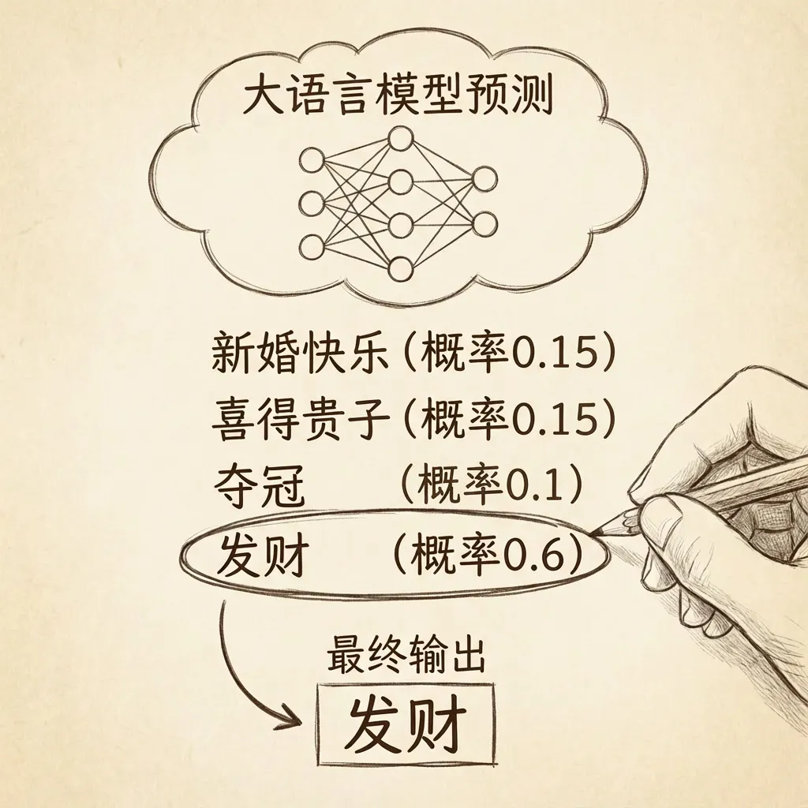

训练好的大模型几乎不会输出“恭喜刷牙成功”、“恭喜吃饭成功”，因为给到大模型学习的训练语料很少有这样的表达。但大模型的输出也会赋予它们一定的概率，只是概率比较低而已。其实，我这里真正想表达的是：**大模型中神经网络的输出是对整个词表中所有token的预测概率** 。也就意味着神经网络的**输出层节点数量等于词表中token数量**\(我从来没有讲过输入层节点数一定要等于输出层节点数\)。

#### **5.6.****Softmax与概率预测**

怎么样？是不是很简单。确实是有点简单，但是这样也太简单了吧。其实，这个问题的复杂性，依然来源于：我们如何用数学的方式来表达上面的结论。

我们知道，神经网络最后的输出是经过激活函数变换的结果。如果使用Sigmoid作为激活函数，那么最终会输出一连串的0到1范围内数值。又由于相同层不同神经元之间并无“南北”或者“垂直”方向上的连接，因此他们在计算过程并无依赖，彼此独立，毫无瓜葛。

这样一来，神经网络的输出便是一系列相互独立的数值，这与大语言模型的“概率预测”事与愿违。因为你知道的，爱是不能被分享的，你爱这个男朋友多一点，另一个男朋友得到的爱就会少一点。大语言模型预测出的不同token概率，它们之间也是此消彼长的关系。并且显而易见，这些概率的总和必然为1。但……这个计算过程……是怎么样的？

你是不是一下就想到了：把所有输出层节点的数值，加起来，计算个总和，然后每个节点的数值除以这个总和，不就是概率了。哇塞，你也太牛了，这么核心的计算公式居然被你脱口而出了。注意，**行内人常常把这种零散的、毫无关联的数值，映射为固定范围（例如总和为1）的数值，称为归一化。**

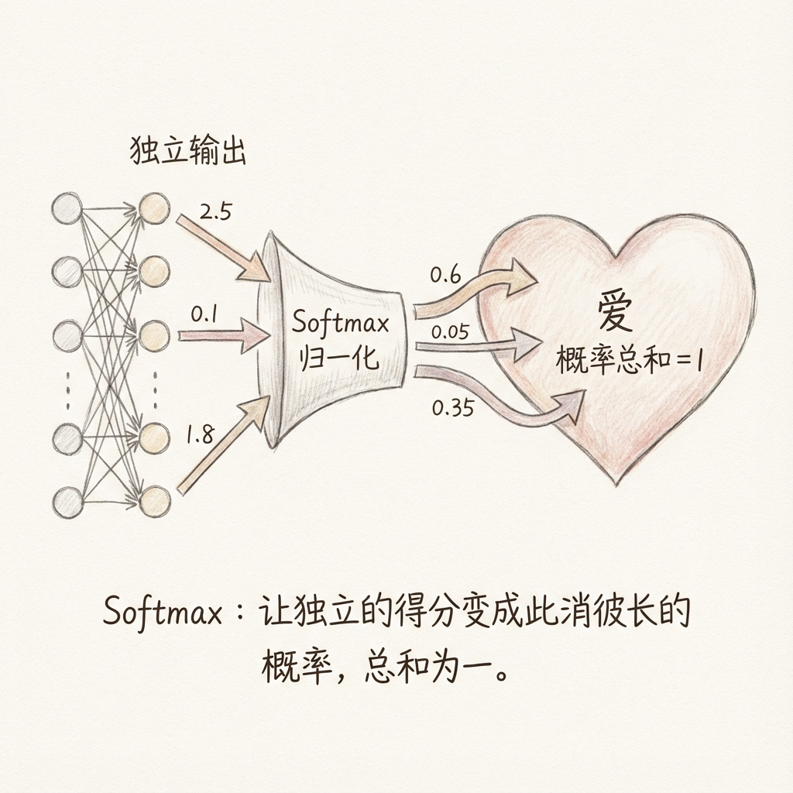

不过，朋友，其实你还差最后一步，在数值求和前，**为了更凸显概率之间的差异性** ，实现“好的更好，差的更差”的目标，还要先对数值进行**缩放** ，不过好在整个过程可以用数学函数完成，**应用的比较广泛的便是被Softmax的函数** 。

#### **5.7.****概率与token映射**

大语言模型通过Softmax函数输出一大堆的概率分布后，究竟，哪个概率对应哪个token呢？其实，我们在建立词表时，同时会对词表中的token进行编码，或者叫索引。例如，如果用列表或数组表示一个词表，例如\[“恭喜”、“发财”、“夺冠”、“喜得贵子”\]，那么就可以用id=0、id=1分别表示“恭喜”、“发财”。

如果把“恭喜”的向量输入到大模型后，最终输出的归一化概率也用列表来表示，比如\[0.1,**0.6** ,0.01,0.1……\]，那么我们就认为最高的概率0.6对应的便是词表中id为1的token即“发财”。

#### **5.8.****单标签与多分类**

如果神经网络输出层的只有一个神经元（类别空间是1），那么这个任务被称为**二分类** ，由于这个神经元的数值要么趋近于0，要么趋近于1，仅仅能表示人类语言中的“是”或者“否”\(例如，这段文字是否做到了通俗易懂？你回答，是\)。但，你现在知道了，大语言模型的输出层神经元数量远大于1（类别空间等于词表大小），因此对它进行训练的任务被称为**多分类任务。**

如果多分类模型中，**每个输出层神经元的数值彼此独立，人们就把它称为多标签；而大语言模型输出的不同概率之间拥有着此消彼长的关系，那么我们把它称为单标签** 。虽然我也不清楚，“标签”这个词，是被哪个人应用到了语言模型里的。但我很清楚的它的用意：一个人既可以被打上“父亲“的标签，也可以被打上“飞行员”的标签，二者没有关联，彼此并不影响。那是不是叫单属性或者多属性也可以？随你怎么叫好了。

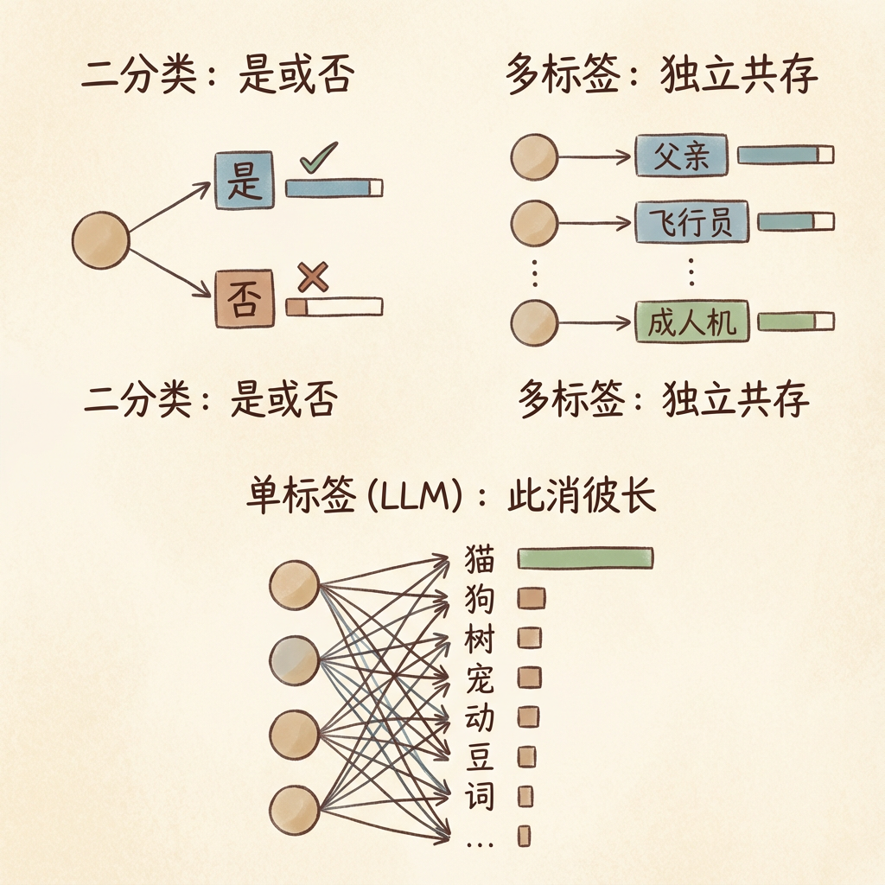  

### **6.****我的昨天在消失，明天不可知**

#### **6.1.****上下文**

“我的昨天在消失，明天不可知，我为何而活？为每一天而活，活在当下”电影《依然爱丽丝》中的主角爱丽丝在阿尔茨海默症患者协会演讲中这样说。而在为情所困的人们中间，埋伏的寂寞干不掉，相思的苦多难熬，“忘记”或许是一剂良药。但如果我们真的“忘记了”，或许，我们可能失去了自主生活的能力。

**“记忆”或许是人类大脑区别于其他物种最为神奇的地方** ，在神经网络的相关章节，我们反复提到，神经网络的出现的目的就是为了拟合人类大脑。可是直到现在，我并没有提及：大语言模型是怎么记忆的，哪怕半个字。

难道说大语言模型不需要记忆吗？**显然不是，大语言模型需要的恰恰是记忆** 。例如，你对大模型说“我喜欢你”，没有记忆的大模型，只能捕获最后的一个字“你”，而忽略掉前文整个语境，最终的输出可能是“好”字的向量化表示。如果我对你说：我喜欢你，而你跟我说：你好”，这听起来是多么悲情啊。

有记忆的大模型，能够捕获整个句子中所有分词的语境，圈里人把这个能力称为大模型**上下文（contexts），** “上下文” 这个词可以说大模型相关概念里最有亲和力的一个 ，毕竟，我们的小学语文老师常常把它挂在嘴边，教我们阅读课文时要结合上下文理解，实在不理解就背诵下来。

对于“我喜欢你”，没有记忆的大模型，只能关注到“你”；有记忆的大模型，可能会关注到“你”周围的三个字“我喜欢”。可是如果大模型仅仅能关注“周围三个字”，也也会带来新的问题，例如如果此时你说的不是“我喜欢你”，而是“曾经我喜欢你”，对于仅能处理“周围三个字”的大模型来说，它的理解能力仍然是不足的。我们也把“**分词周围的分词数量”成为上下文长度** 。就如同刚刚这个例子，上下文长度太短可能会造成歧义。

#### **6.2.****循环神经网络**

在自然语言处理中，“上下文”有着举足轻重的地位。这是因为，从我们嘴巴里面出来的“词语”的含义，很大程度上，取决于这个“上下文”。这样一来，我们需要重新定义一下大模型：大模型本质上通过接收上下文，使得输出的最高概率尽量地接近目标词。因此，我们就不得不想方设法地将“上下文”或者“语境”融入进“模型输入”里去。

我们每个人都只有一张嘴，你语速再怎么快，也只能是一个字接着一个字讲。而听你说话的人，就像是一个大模型\(如果不特别说明，大模型特指大语言模型\)，也只能一个字一个字地接收。关键的时刻就要到来了：**听的人总会根据刚听到的上一个字，下意识猜下一个字会是什么，等下一个字真的出来了，又会把前面所有听到的内容全攒到一块儿，接着往下猜后面的话。**

但我们如何实现这样的模型呢？**循环神经网络（RNN）** 就这样呼之欲出了。我们先来看下循环神经网络的架构。循环之所以叫循环，是因为该神经网络的输出，会同时作为输入，再次进行“回环”，输入到神经网络。同时，除了首、尾两次循环，其他每次的循环，神经网络都会同时接收两个输入，一个输入来自上次循环的输出**（也被成为隐藏状态）** ，而另一个输入就是下一个分词的token。如下图所示：“我喜欢你的表哥的表哥”这句话的每个分词，会按照时间的先后循序，依次输入到循环神经网络，让这个网络具有上下文的记忆能力。反观普通的神经网络，信号从输入层流向输出层后便会终止，完全没有 “记忆” 功能。

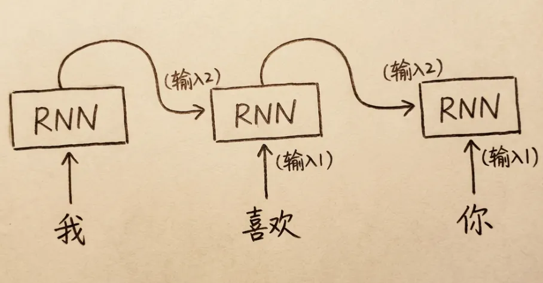

图中虽然看似展示了3个循环神经网络，其实不然，它只是为了方便我们来理解，在时间轴上进行了展开。展开后的每一个节点被称为**时间步，你也可以叫它时间点** 。实际上，这三个RNN是一个RNN。否则也就谈不上什么循环了。呦，这看起来不错呀，RNN简直太完美了。因为它一方面通过“**输入2（也被成为隐藏状态）** ”记忆前文；另一方面，又可以通过“**输入1（当前时间步的输入）** ”来体现时间上的先后，这完全复刻了人类的语言表达过程。

可是它最的短板在于：串行执行带来的性能不足。对于伶牙俐齿的人来说，一分钟可以讲好几个顺口溜。但对于不善言辞，甚至有严重口吃的人来说，一分钟可能讲不了几句话。如果把患有“严重口吃”的循环神经网络，作为大语言模型来训练和推理，不论使用再好的GPU，它的运行速度也会大打折扣，因为串行任务没办法进行分布式并行计算：它必须严格按照时间步顺序计算，前一个时间步的隐藏状态没算完，后一个时间步就无法启动。

#### **6.3.****自注意力与Transformer**

很多人一提到大模型，就会想到transformer，可以说，本章节的内容好坏，直接决定了这部分人对本文的整体印象，可想而知，它的分量之重。

2017年Google发表了一篇名为《Attention Is All You Need》的论文，文中提出一种基于**自注意力** 机制的架构，这个架构由“编码器-解码器”组成，被称为**Transfomer** 。它一经提出，便经久不衰，绝大部分的大模型都基于它来构建，至今仍然难以被超越。以至于在互联网这个圈子，没听过Transformer的人，出门儿都不好意思跟别人打招呼。

Transformer难能可贵之处在于，它既具备“融合上下文”的能力，又同时解决了RNN串行计算带来的性能问题。那么它是怎么做到这一点的呢？那就不得不提到-**自注意力** 。

爸爸、妈妈一起生下了一个宝宝，如果宝宝长得更像妈妈，那么我们可以说，宝宝融合了妈妈的基因多于爸爸的基因，但也不能说，宝宝基因完全来自妈妈，这似乎对爸爸不太公平。当然我们还可以说，作为爸爸和妈妈结合体-宝宝的基因中，妈妈的基因比重大于爸爸。如果把宝宝比作当前待处理的分词，爸爸和妈妈比作上下文分词，那么当前的分词就不再是孤立的个体 —— 它通过计算上下文分词对自身的 “影响力权重”，实现了对上下文信息的充分融合。

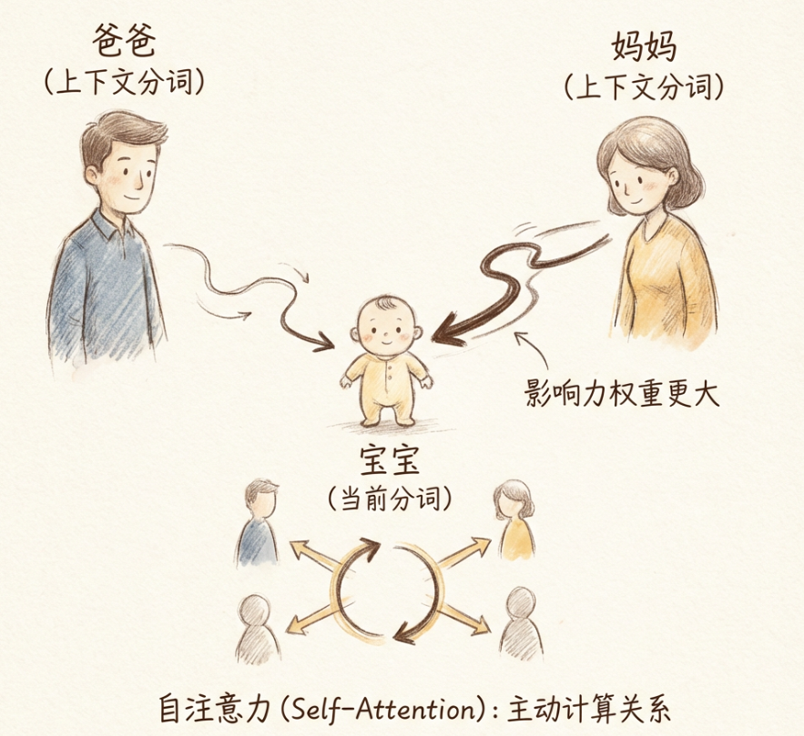

我想通过这个“看起来不是十分准确”的例子，告诉你，融合上下文的方式，不单单可以通过RNN按照时间序列来循环迭代。还可以通过，**计算其他的分词对于当前分词的“影响力”，来整合上下文信息** 。这便是自注意力的核心思想。你当然也可以把自注意力，解释为**自注意影响力** 。另外，自注意力中的“自”，表示每个分词，要自己主动地注意跟别的分词的关系是否亲密或者疏远。

Transformer实现自注意力机制，如图所示，总共分为两个步骤：**1）** 句子中的每个分词，都要与其他分词，逐个进行计算，计算其他分词对当前分词的“影响力”，它也被称为**注意力权重** ；**2）** 基于这些计算的权重，融合生成当前分词的的**自注意力词向量** 。图片非常清晰的展示上述两个步骤。

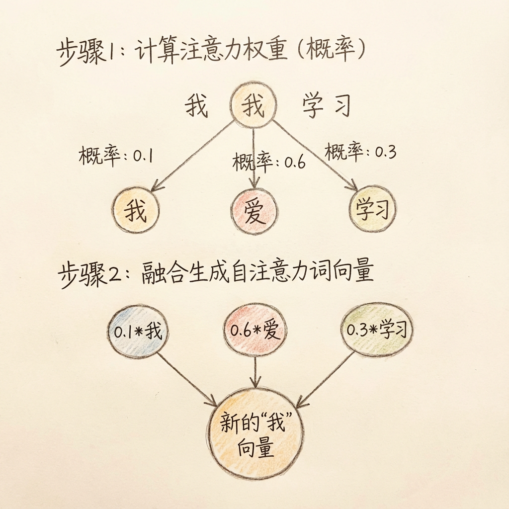

但是关键的问题来了，如何把上述过程，转换为数学计算呢？

对于步骤一，每个分词求解与其他分词的注意力“权重”的过程，**对应的数学公式表达为【输入矩阵】乘以【输入矩阵的转置矩阵】** 。下图展示了在句子“新年好”中，“新”字的向量是如何计算与其他分词的关系的：新生成的矩阵的第一行表示“新”的注意力权重，它等于输入矩阵的第一行分别乘以转置矩阵的每一列，事实上，这就遍历计算了每一个分词对“新”字的影响力、权重。

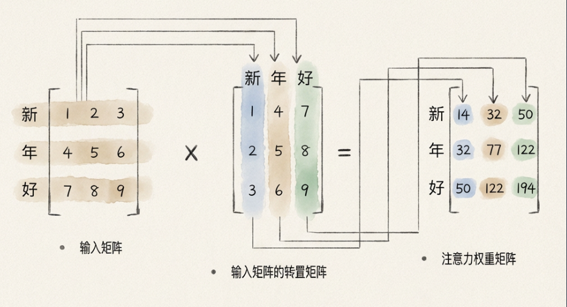

行向量乘以列向量，为什么可以表示两个token之间的关系呢？其实在【初识大模型】的词嵌入章节中，已经提到：向量的内积其实在几何意义上，展示了两个空间向量的夹角的大或者小，在此不再赘述。

对于步骤二，每个分词的融合后的向量，对应的数学公式表达为**【输入矩阵】乘以【权重分数矩阵】（来自于步骤1计算结果）** 。下图展示了在句子“新年好”中，“新”字是如何利用【权重矩阵】计算新的融合了上下文后的向量的。

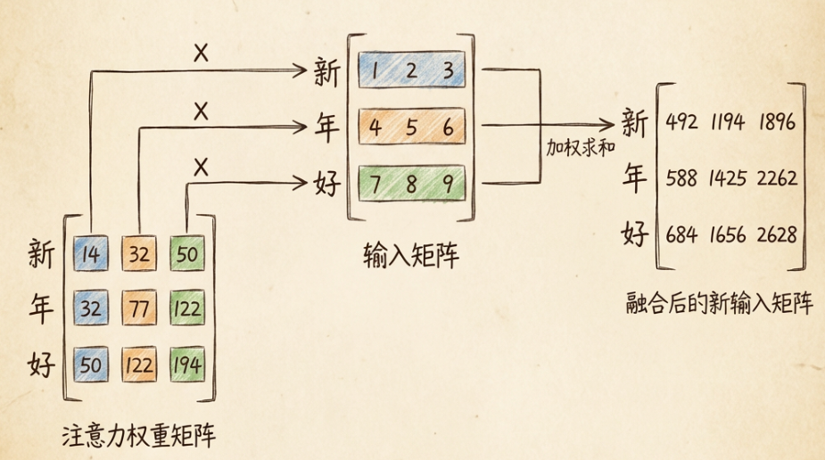

自注意力的实现，本质上是输入句子的向量矩阵的两次乘法运算，只是第一次矩阵乘法，使用的**行乘以列** 的计算方式；而第二次的矩阵乘法，使用了**加权和的计算方式** 。虽然结果一样，但是不同的计算方式，表达的意义是完全不一样的。上面的计算过程，是真实发生的，只是为了解释其核心思想而做了剪裁。比如第一次矩阵运算后，需要通过softmax函数将其转化为概率，用来准确表示权重。同时，你也可以看到，矩阵运算后的结果，数值变得很大，因此在计算权重前，会对每个值进行统一缩小。

另外，两次矩阵运算，涉及到三个输入矩阵，你可能误以为它们都是同一个矩阵。在我刚刚学习transformer时，我也是这么认为。但事实上，它们是三个不同的矩阵，分别叫做Q、K、V。只是它们都是由同一个输入矩阵变换而来。至于为啥叫QKV，我个人的理解是：像查字典一样，Q表示用当前分词作为问题查询，去遍历查询句子中的每一个KEY，基于匹配度和查询的结果V，最终生成新特征向量。

依托这样的计算逻辑，我们不必再像 RNN 那样按时间步逐个输入 token 向量，而是能在输入模型之前，就把每个 token 对应的上下文信息充分融合，直接生成整合后的新向量。由于自注意力的实现，本质上是矩阵乘法，而两个大矩阵的乘法，又可以在数学计算上，拆分成多个小矩阵的计算，多个小矩阵计算又可以被分摊在多个GPU单元，进行并行计算。这就突破了过去RNN在处理上下文过程中，遇到的性能计算瓶颈，为大语言模型的普及带来了曙光。

#### **6.4.****稀疏自注意力**

朋友，关于transformer核心思想就是这样了。然而，实际上它包含的内容远不止于此，例如关于它的编码器、解码器、以及多头注意力等，受限本文的写作意图和作者水平，这些就留给读者们自行探索了。

Transformer一经问世，很多在日后名噪一时的大语言模型，便相继发布，例如BERT、ChatGPT（毕竟BERT和GPT中的“T”指的就是Transformer），以及后来众所周知的Deepseek。2025年12月1日，Deepseek发布了V3.2正式版本，宣称采用了稀疏自注意力机制，稀疏注意力机制早其实早在2019年就被提出了。那么什么又是稀疏注意力呢？我们借着Transformer的话题趁热打铁。

阅读了相关的文章后，我才明白，相对于稀疏，前文中提到的注意力计算方式，原来是稠密的。因为输入的句子中，每一个句子的分词都要计算和其他每个分词的权重关系（包含它自己）。而稀疏注意力机制，告诉我们，这个可能是没必要的。因为其实每个分词只需要计算相对重要的分词即可，例如，它认为离“我”越远的分词，可能关系就越远，对“我”的影响力就越小，我就没必要进行计算了。由于计算量少了，那么模型的推理速度就会相对加快了。

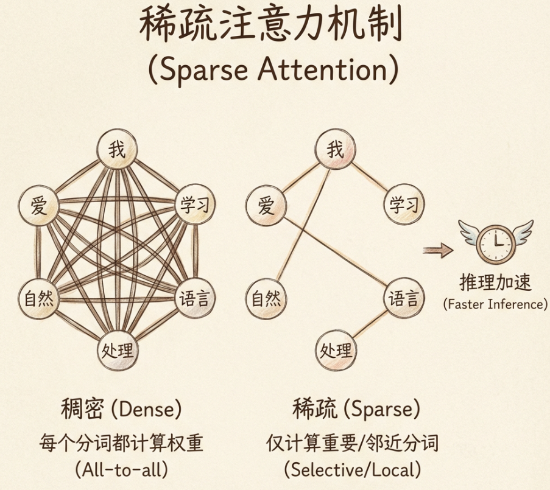

### **7.****大模型是怎么训练的**

不论是RNN还是Transformer，他们仍然属于神经网络的范畴，经由他们变换的结果，就是融合了上下文特征的新token向量。而这些新的token向量，最终还是要被输入到神经网络进行非线性的变换\(如果你读完前文，相信你已经非常熟悉\)，而后在神经网络的输出层生成一系列的概率，用来对下一个目标词进行预测。

#### **7.1.****训练数据**

一个人出生时，先天具备的遗传基因固然重要，但在接下来的日子里，她走过的路、见过的人都会塑造他的品质。同样，大模型采用什么样的架构、神经元使用什么样的激活函数、误差计算用的损失函数，等等这些也很重要。同样，当这些先天的“属性”一旦固化，对它产生最重要影响的，莫过于“后天的”训练数据。上世纪90年代，神经网络的奠基人之一杨立昆研发的手写数字识别模型，就使用了来自美国邮政局的7000多份手写邮编扫描件，进行模型训练。而现如今，主流大模型，用来训练的token数量，已经突破了万亿\(不是模型参数哟\)。

训练数据质量的高低直接影响着大模型理解能力的高低。这就像在子女教育过程中，更多的父母，愿意竭尽所能为子女选择更好的学校、更好的辅导班。这其实就好像在大模型的预训练阶段，为大模型提供了经过过滤、筛选后的优质训练数据，让大模型在竞争中表现出卓越的推理（前向预测）能力。

用来训练的数据，常常要分为两类，**一类是训练数据；一类是验证数据** 。在模型训练完成后，我们不能指望，训练数据“既当运动员，又当裁判员”。所以，我们要通过另外的验证数据集，来观测大模型推理的好与坏。

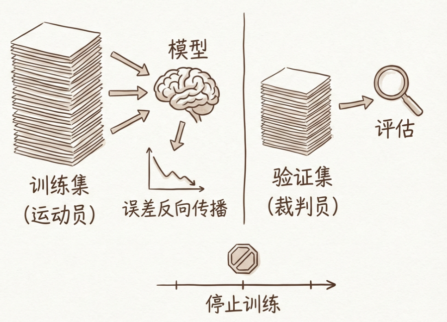

训练的过程，就是训练数据送入到大模型中，输出预测的概率。然后计算与目标值的误差，通过反向传播，来更新大模型的权重参数，这在前文中已经介绍过。如果经过多轮训练，大模型的推理能力无法再显著提升，甚至出现能力下降，那么是时候考虑该结束训练了。

大模型在验证集上表现的良好，那么我们可以说它**泛化能力** 好，否则就会说它没有很好的泛化能力。对于一个人来说，经过长时间学校的教育后，能够很快的融入新的环境，迅速进入状态，我们也可以说他“泛化能力好”。但我们更愿意说：你这个小伙子，适应能力比较强啊。这也是我对**泛化** 这个词的理解。

#### **7.2.****超参数**

如果大模型在验证集上表现很差，泛化能力不足。而且此时已无法通过扩充训练数据、优化数据质量等方式继续改进，那么，我们就会可以认为或者猜想：这可能和训练数据没有关系。此时，工程师就会尝试通过修改模型的架构、修改神经网络层数、修改反向传播学习率等方式，来提升模型的泛化能力。

模型训练的过程就是更新权重、偏置等自身参数的过程。而模型验证的过程，实则上就是尝试更新除模型参数之外的“参数”的过程。由于模型架构、学习率是超越模型自身参数以外的参数，所以，它们常常也被称为**超参数** 。超参数的超，不是超人、超级的超，它并不神秘，也没有什么深奥的引申含义。

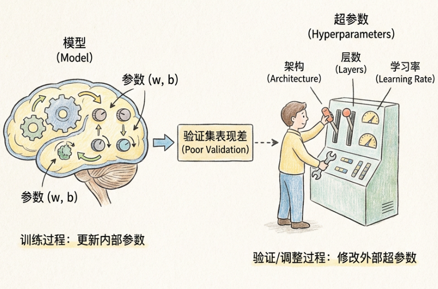

#### **7.3.****批量（batch）**

大模型在训练过程中，不是一个字一个字地输入到模型里面的，这样的话，就老费劲了。而是把“一堆儿”训练语料一把就输入进去训练。具体来说，就是一次训练就能够完成几十句话或者几十个段落的学习。我们把“一堆儿”这样的语料称为**批量。**

大模型训练过程是根据前面的分词预测下一个分词的概率，但是一次训练，包含了这么多分词，而且每个分词都有自己的损失，那是不是每计算一个分词的误差，都要进行一次反向传播，来更新大模型的参数呢？

#### **7.4.****步长（step）**

我们已经发现，当前的大模型参数量已经突破了万亿级别，这样的话，权重更新的过程会产生大量的数据计算和资源消耗。因此，我们不必要利用每个分词的误差来更新整个模型的参数。而是**将整个批量的误差，统一计算一个平均误差，然后利用平均误差来更新模型参数** 。圈内人把每一次的模型参数更新，定义为**一个步长** ，也有人叫作是**一次迭代** 。

如果批量比较大，那么就要求GPU显存有足够的空间容纳这些样本，但它带来的好处是：由于样本量较大，某几个样本的异常，**在经过平均误差计算后，这些异常的毛刺点可能会被抹平** ，计算出的梯度可能也会比小批量更平滑。

#### **7.5.****训练轮次**

当大模型学习完所有的训练数据后，训练的工作其实还没有结束，它还要使用原有的数据重新开始第二次、第三次……训练。你可能比较疑惑：**为什么需要多轮，每轮训练用的数据都一样，多轮有什么意义** ？

你第一次读水浒传时，读到了江湖上的打打杀杀；第二次读时，读出了英雄豪迈背后的现实悲凉；第三次再读时，可能会读出更多的内含。书还是那本书，不同的时期读出的内容却不尽相同，也就是人们常说的常读常新。

同样，模型的学习是渐进式的，不是一蹴而就的，这就需要多轮迭代。不论轮次使用的样本虽然相同，但一般会进行打散，避免模型“死记硬背”。我们把模型完整遍历一次数据的过程，称为一个**轮次** 或者一个**Epoch** 。

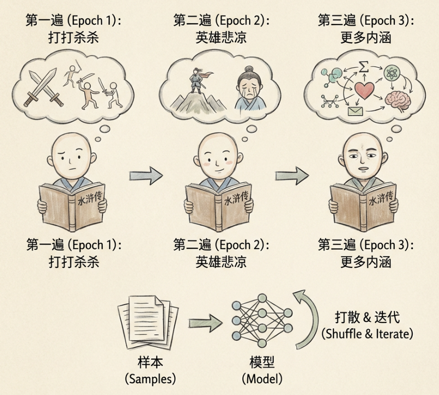

每一轮训练都是在上一轮的训练结果（即模型参数）的基础上继续迭代的，那么第一轮，首次进行训练时，模型的权重和偏置这些参数从何而来的？你可以说这些都是天生的，与生俱来的。但是在数学上，它就是随机化产生出来的一系列的随机浮点数。随机数虽然是随机的，但是也没有那么随机，随机产生出来的数值必须被约束在合理的范围，否则会产生训练不稳定的问题。产生有约束的随机数算法有很多，此处不展开。

#### **7.6.****过拟合与欠拟合**

**欠拟合** 是指模型经过多轮训练后，计算的误差仍然很大，我们严重怀疑可能是模型的设计出现了什么问题，比如参数量太少会它的非线性表达或者拟合能力存在不足。虽然参数不是越多越好，但参数少了，是万万不可的，因为只有大量的参数才能拟合比较复杂的场景。

而**过拟合** 是指用训练数据训练出来的模型误差比较小，但是用测试数据测试出来的误差却很大。这一般表示模型对训练数据学习的太过度了，进而达到了“死记硬背”的地步，连一些不该学习的、无关紧要的也过度学习，导致模型泛化能力不足。

#### **7.7.****监督学习和自监督学习**

监督学习、自监督学习这些概念常常不绝于耳，我常常将，模型用来计算的目标值，当作是一种监督，因为我认为模型的数值概率越靠近目标分词的概率，误差就会越小，模型学习就越成功，这就是一种监督呀。但是，自监督学习这个词，让我很是疑惑，难道自监督训练，就不需要目标值了吗？这样的话，模型的误差该怎么计算呢？

随着我学习的深入，我才明白，原来不管是有没有“监督”，目标值一定是要有的。**只是目标值产生的方式不一样** 。有的目标值是需要手工输入的，比如一张猫的图片，你要给他做个文字标记-猫，当把这张猫的照片输入到大模型后，产生的输出要和标记的“猫”进行比较，计算一个误差，这种目标值产生的方式叫作**人工标注** 。

可对于，万亿的训练数据，人工标注已经成了不可能。人们希望能够自动的去选取“目标词”进行监督，怎么做？人们会把一个句子或者一个段落中的分词，进行随机掩盖，然后交给大模型去进行概率预测，而预测的目标值就等于被掩盖的分词，整个过程，不需要人工标注，主要依赖大模型**自身的随机** 掩盖，随机预测。例如让模型学习古诗时，输入“青海长云暗雪山，孤城遥望玉门关”，如果把“玉门关”进行遮盖后，“玉门关”便作为我们本次训练的目标分词。**因此我更愿意把“监督”解释为“人工标注”** 。

#### **7.8.****温度系数**

温度系数是什么？为什么叫温度系数？我想至少应该和天气的冷暖有点关系。你应该从小学的时候就知道热胀冷缩的原理了吧。天气暖和的时候，不光是分子比较活跃，我们人类也比较活跃；而在天气寒冷的时候，就容易凝结，抱团取暖，能不动尽量不动。

我们多次聊到，大模型其实就是概率预测模型，大模型的输出是一堆小于1的浮点数，用来表示词表中不同token的概率。好吧，OK。知识点来了，有的人喜欢，模型仅仅输出那个最高概率的token，就会概率高的变得更高，概率低的变得更低，实现两极分化，**这就是“冷缩”** ；而有的人喜欢不落俗套，更喜欢尝试未来的“可能性”，希望大模型的输出不要那么死板，这样就会让概率高的和概率低不要那么分化，这样在采样输出时，概率低的token也可能被选择，**这就是“热胀”** 。

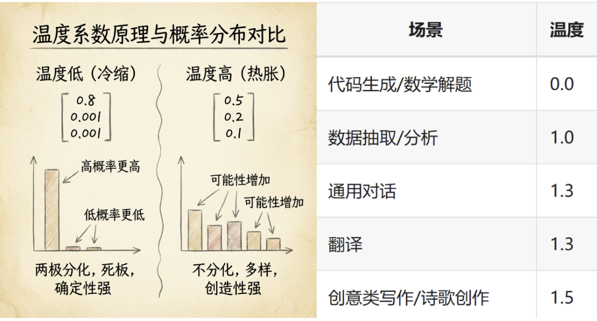

前文提到，概率是通过归一化函数-softmax产生的，人们在softmax公式上“稍作手脚”后，便实现了上面的热胀冷缩现象。这里做手脚的方式就是在公式中增加了一个整数变量，我们把这个变量，成为**温度系数** 。\(上图右侧为使用DeepSeek时官网推荐的温度系数\)

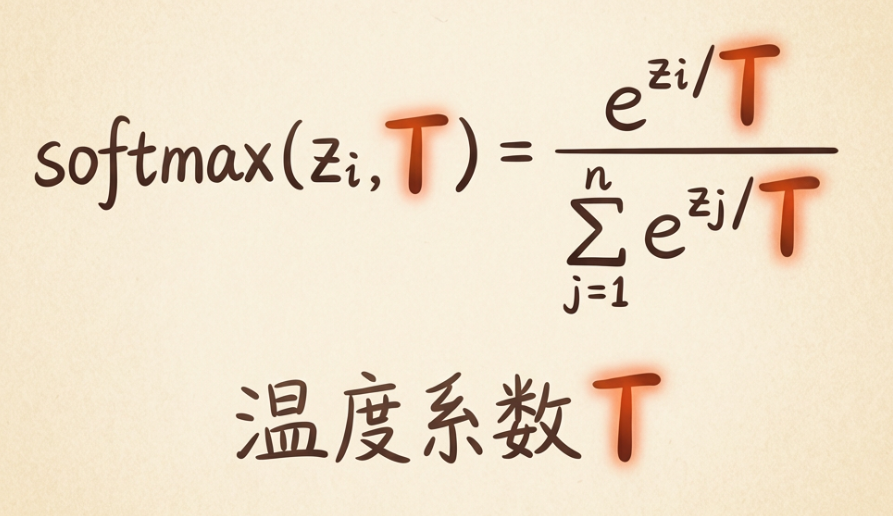

听起来温度系数与大模型的训练毫不相干，事实上，它与接下来即将登场的**知识蒸馏** 密不可分，而知识蒸馏是一种小模型训练的最重要的方式之一。

#### **7.9.****蒸馏学习**

温度系数中的温度，随着度数的升高，液体转化成气体，气体在冷凝管中，遇冷再次凝结成没有杂质的水，这就是蒸馏的过程。我们家里烧水做饭，锅盖上挂着的小水珠也是这样的过程。模型中的**蒸馏学习，指的就是要学习蒸馏出来的部分** ，而不去学习没有剩下的“杂质”。我相信发明这个名词的人，想必对化学或者物理也特别地感兴趣，我查了下才发现，原来这个人叫辛顿（2024年，因为在神经网络突出贡献获得诺贝尔物理学奖）。

学习，肯定是要向别人学习，通常的叫法是，**学生模型向老师模型学习** 。老师模型一般是预训练好的大模型，参数量极大，训练和推理用到的算力成本较高，不太适合轻量化部署，比如部署到你的PC，甚至是你的手机上。而学生模型恰恰就是为了填补老师模型的这个空白，它的初衷就是用尽可能少的参数，来达到向大模型的能力。因此这种学习或者训练的方式，也被叫作**模型压缩** 。那么蒸馏学习的过程是怎么样的？蒸馏是蒸馏的什么？

如果下图所示，虽然，大模型是通过概率预测的方式，来选择一个概率最高的下一个目标词。但有时，我们可以通过控制**温度系数** ，让概率没那么高但词义相近的分词被选中（前文已经解释过）。这对于模型来说，也是有用的知识，而这种知识常常被称为隐藏知识。**隐藏知识** 需要通过提高温度系数来挖掘。而蒸馏学习的目的就是既要学习最高概率的分词，也要尽可能学习这些隐藏知识。例如，在图中，虽然我们习惯说“我想吃饭”，但是我也偶尔会说“我想干饭”，极少数情况，我也喜欢别人对我“请您用膳”。这些对于大模型来说，都是有价值的知识，虽然这几个词本身概率没有“吃饭”高。

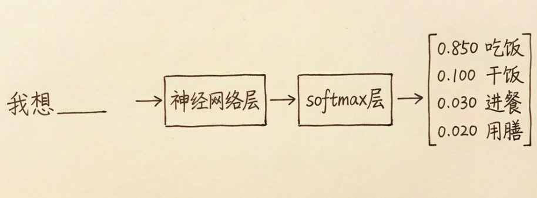

当我们通过在教师模型的softmax层调高温度系数，提高隐藏知识的概率后，**隐藏知识的概率就会作为学习模型的目标值（也称为软目标），** 这句话需要你慢慢想一下？既然学生模型要学习教师模型，那么教师模式的概率分布就会作为最终的目标值或者监督值，用来计算误差，来更新学生模型的自身参数。

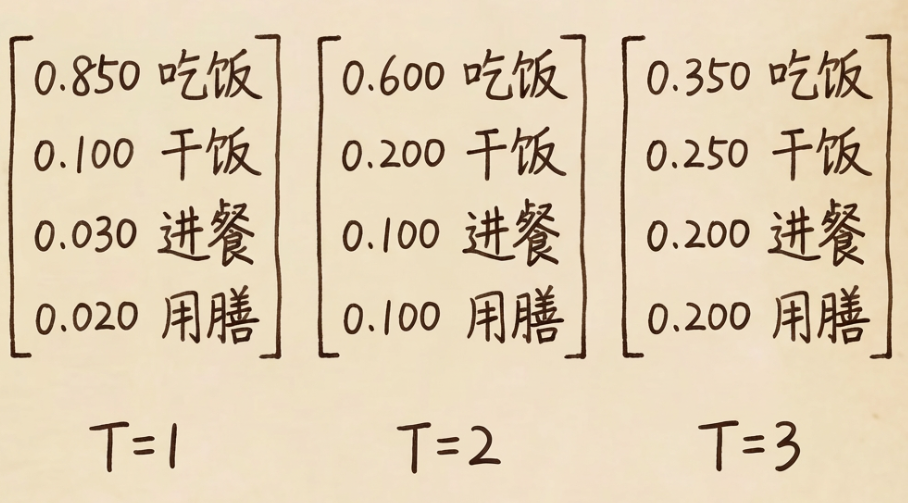

教师模型提高温度系数，得到的概率分布，被称为软目标，同样，在学生模型中，用同样温度系数计算得到的概率分布，被称为**软预测** 。二者之间通过损失函数计算的误差，被称为**蒸馏损失** ，或者软损失。

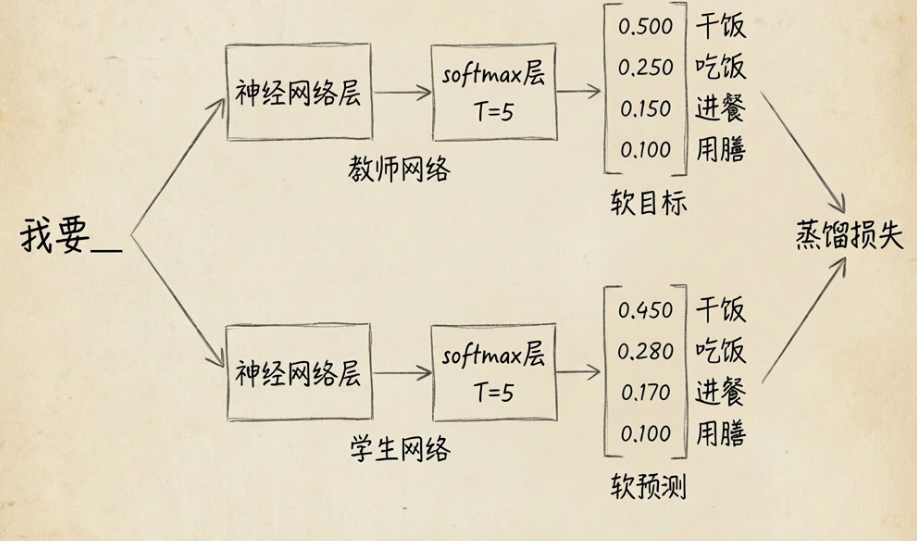

根据DeepSeek官网发布的信息，2025年春节期间，发布DeepSeek-R1模型后，通过 DeepSeek-R1 的输出，蒸馏了 6 个小模型开源给社区。

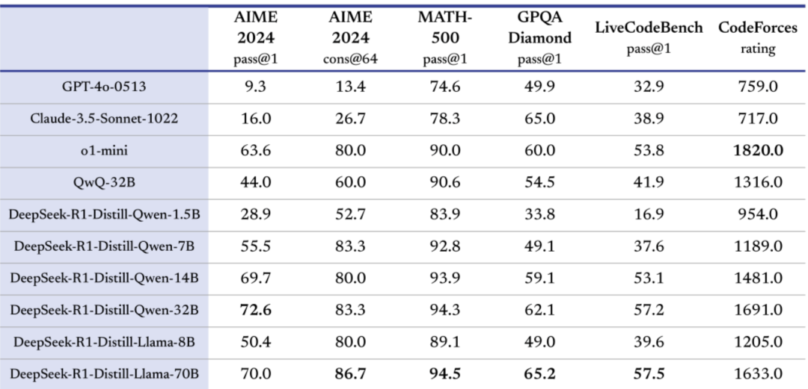

其中DeepSeek-R1-Distill-Qwen-14B，就表示这个模型是蒸馏出来的学生模型，老师模型是DeepSeek-R1。学生模型是千问模型，仅仅有140亿的参数，注意这里的“仅仅”是相对于R1模型6600亿参数而言的。

  

### **8.****AI浪潮下的基础设施**

#### **8.1.****AI与区块链算力**

好了，关于AI相关的底层基本原理就介绍到这里了，这里请允许我用“AI”两个字。当然，我们都清楚，关于AI的范畴远不止此神经网络、大语言模型等，只是因为ChatGPT引爆大语言模型的浪潮之下，当人们谈论AI时，更多指的就是大语言模型。

在过去的一段历史时间中，区块链、显卡也火爆一时，在区块链中，比拼的是谁能以最快的速度挖到下一个区块，这个“挖”的过程实际上，仅仅就是，基于交易信息来计算hash值，谁计算出的**hash值的某几位等于预设好的目标值** ，那么，谁就挖矿成功了。这个过程也叫hash碰撞。比如下一区块的hash值，前4位必须等于0x0700，谁第一个计算出来，谁就挖矿成功，并获得挖矿奖励。而**大模型的训练过程，通过训练数据，不断调整参数，谁调整出的参数接近目标值，谁的模型就是好的。说白了，这也是一种“碰撞”，这是它们的异曲同工之处** 。

但它们的区别在于，区块链是全球分布式计算，你在任意的云服务商的任意地域，只要买一台机器，运行区块链协议，就可以以“平民”身份参与到区块链中\(当然，后来也逐步集中某些巨头的矿厂\)。而AI的训练算力高度集中在数据中心内部，彼此之间，至少没有像区块链一样的协议，将不同公司模型的训练算力“交织在一起”，最终计算出一个共同的“链”。那么，在高度集中的AI算力下，对此，我们又有怎么样的感知呢？

#### **8.2.****GPU卡与CUDA**

随着AI的逐步流行，越来越频繁出现在人们视野里面的词，其中有一个词，含金量十足，那就是“买卡”，这个词人们常常脱口而出。这让我经常想到，多年前，在华强北或者中关村，很多人都会问你：“哥们儿，买盘吗”、“姐们儿，买碟吗”。但这里的卡，可不是指游戏卡，而是说的GPU卡，GPU以插拔式的方式插入到服务器\(PCIe\)或者电脑中，所以常被称为卡。

一块CPU有4核心、16核心、32核、100多核也就差不多了，但你敢想象吗？一块英伟达GPU H100卡就有18000多核。这些核被称为**CUDA核**\(图中INT32\FP32就是一个CUDA核，分别表示计算整型、浮点数的核心,引自英伟达官网\)，虽然它们数量多，但是仅仅能进行简单的加减乘除计算，不过这对于AI的训练和推理已经足够了。因为大模型的训练和推理的过程，也不过就是简单的加减乘除。

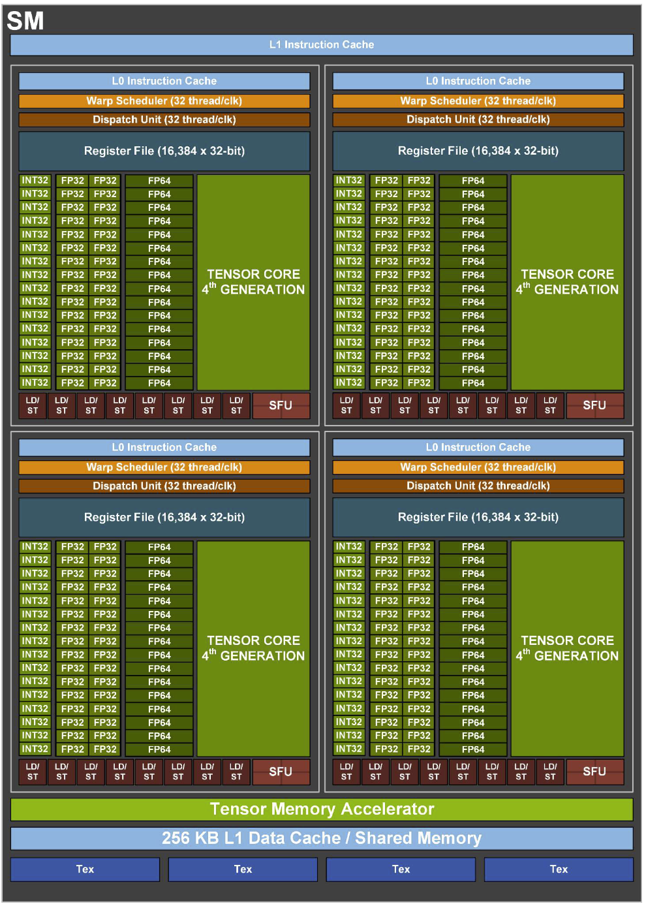

但很多看似简单的东西，其实并不平凡，如何把AI训练中涉及到的简单矩阵运算，均匀的分摊给这么成千上万的core进行并行计算，这就是很大考验了。而英伟达的CUDA平台就提供了一站式这样的均衡调度能力。

#### **8.3.****大模型并行计算**

CUDA平台要考虑如何把给它的“东西”分发给成千上万的GPU内核，而大模型并行训练时，要考虑**以什么维度去并行计算** 。例如，在网络负载均衡器上，可以按照五元组加权轮询算法分担流量给到不同后端，也可以按照最小连接数算法，将当前连接分发给连接数最小的后端。

如果你耐着性子，看完前面的章节，我相信你一定对参数和训练数据并不陌生。因为模型参数决定了模型的下限，而训练数据往往能够决定它的上限（仁者见仁，智者见智）。AI训练的并行方式，也是通过这两个维度进行的划分。一类是**模型并行** ；一类就是**数据并行** 。由于模型并行，等同于把权重等参数分布在不同的GPU上进行计算，而这些参数本身是由张量来表示的，因此模型并行也称**张量并行** 。

**数据并行** ，理解起来最为直观，就是把训练的数据，分散到不同的GPU上，每个GPU运行相同的模型。不同的GPU使用分配给它的局部训练数据，对相同的模型进行并行训练。

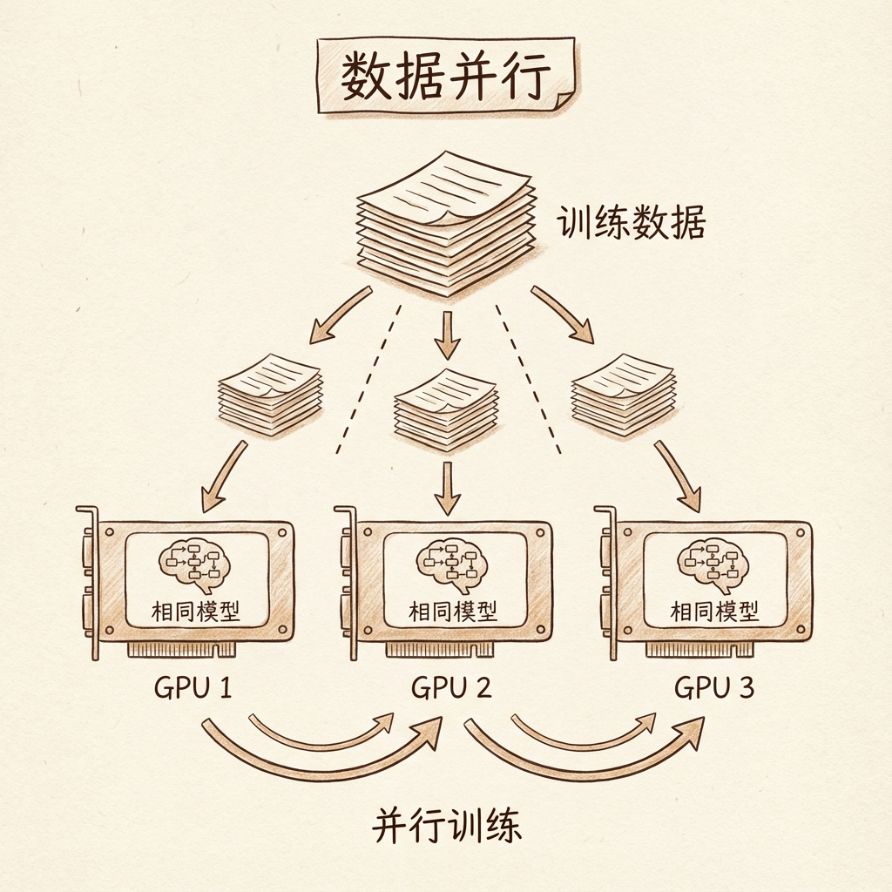

相比于数据并行，**模型并行** ，理解起来似乎有点吃力。但是如果我说，这就好比，你在一个拼图上画了一张多层的神经网络（你应该还记得前文神经网络的样子吧），此时，你把拼图打乱得支离破碎，好吧，你想像你看到的每一块就是GPU，而每一块拼图上面画的就是部分神经网络结构。

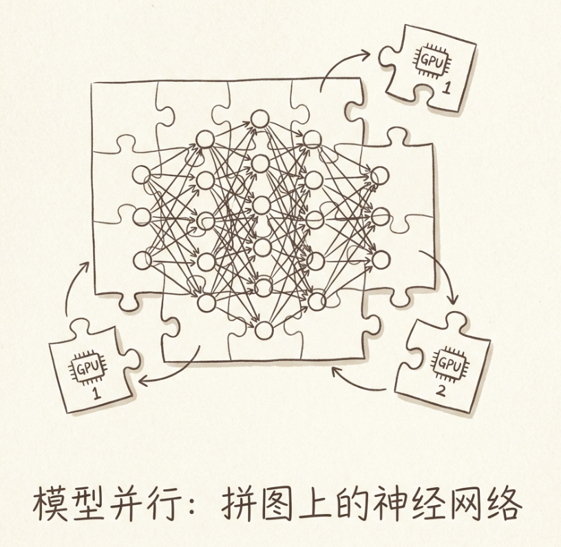

但凡涉及什么并行计算啊、分布式计算啊、什么微服务啊，必然会由此而增加网络通信，有网络通信就会有网络损耗，这些想都不用想。

#### **8.4.****数据并行**

数据一旦被分摊到不同的GPU，意味着每一块GPU上存储的模型，不能得到全量的训练数据，只能依赖局部少量的数据来更新参数。这样会使得训练不够充分，这可不是数据并行想要得到的结果。那么数据并行，是如何来更新模型参数呢？

假设有两份训练数据，分布在了两块GPU卡上，每块GPU卡上，通过反向传播算法，各自计算出所有参数的梯度（回忆一下，梯度就是参数的更新量）。关键的时刻来了：此时每个GPU卡上梯度会被传递到中心服务器上，由中心服务器进行**梯度聚合（可以用Reduce表示聚合）。聚合的方式就是求和再取平均值** 。然后中心服务器再把平均梯度广播到所有GPU卡上，统一更新参数。这个中心服务器被称为**参数服务器** 。

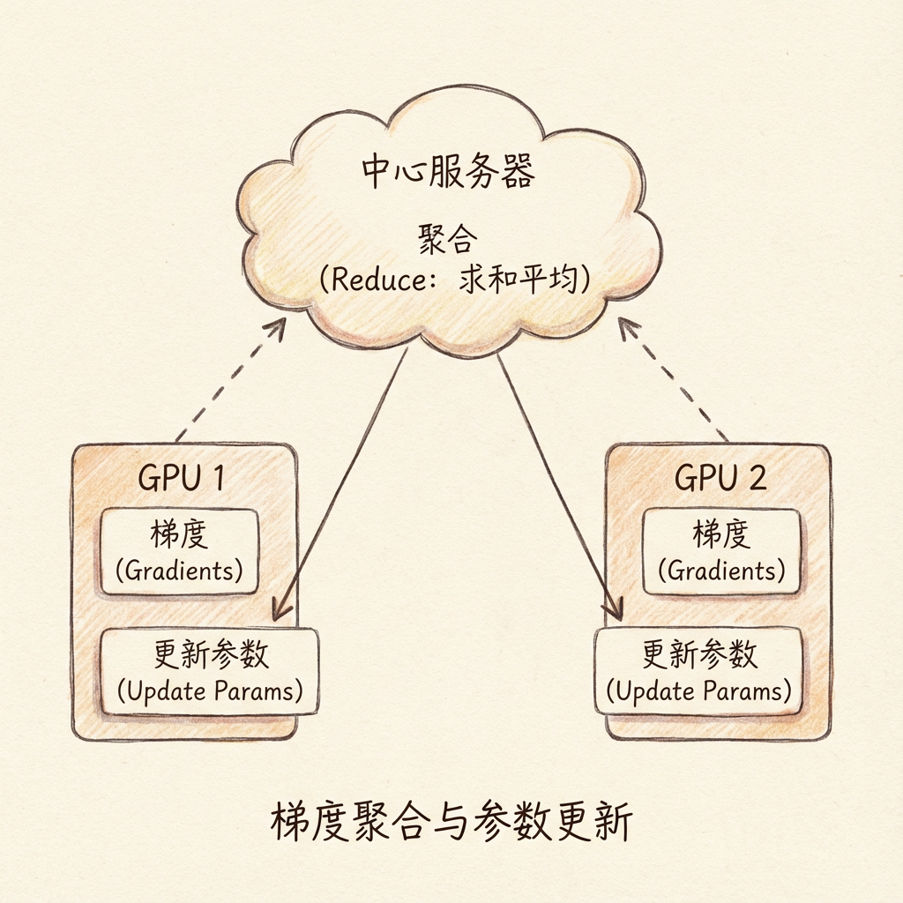

但是因为参数服务器会成为通信的瓶颈，现代AI训练大多摒弃了中心化的参数服务器。而是通过更优的连接结构和算法，比如环行结构、树形结构等\(受限于笔者水平和写作目的不展开，但不是全互联通信方式\)，这使得所有GPU都能得到所有的梯度值，这样的话，每块GPU都要进行**Reduce** 求和平均计算，因此这种通信方式被统称为**AllReduce** 。

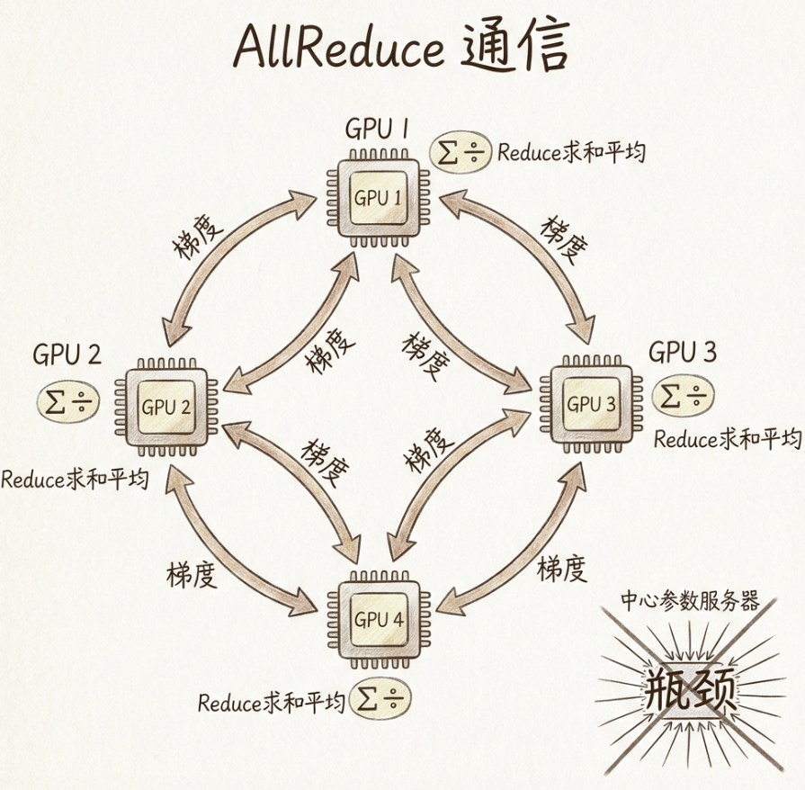

#### **8.5.****模型并行**

虽然模型并行，像似小朋友的拼图，但理解起来似乎不够具体。我们以简单到极致的两层神经网络为例，它只有输入层和输出层，每一层只有三个神经元。首先我们把它转换为简单的矩阵运算，最后，我们将矩阵运算的过程，拆分到了三块GPU卡，分别是GPU0、GPU1、GPU2.如下图所示，这个过程，我自己理解起来也有点困难，但是写写画画后，便可以大致了解。

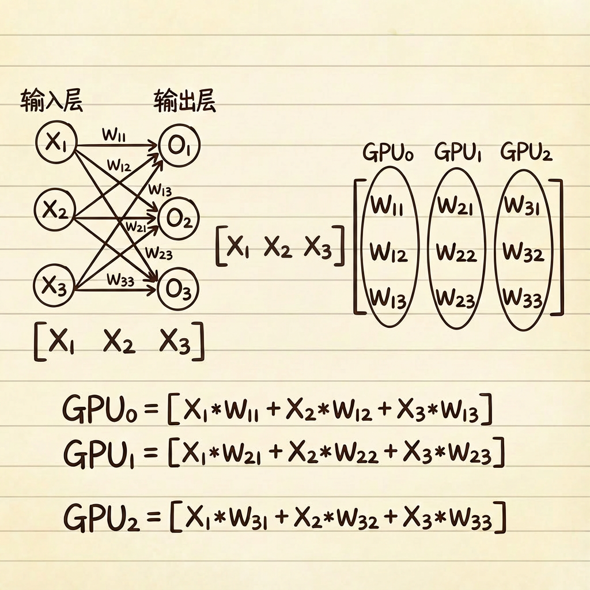

由于大模型牵涉的都是深度神经网络，牵涉的矩阵运算很多，我们需要把上一层的矩阵运算结果像前逐步计算传递。因此就需要把上一步每块GPU计算的结果传递到负责下一层计算的GPU上进行**拼接** ，以获得全局的计算结果。**拼接的过程不涉及计算，或者说，不涉及原有数据的增加或者减少** ，这与Reduce完全不同。因此人们为拼接又取了一个新名字，叫**Gather** 。如果所有的GPU都需要获取这样的拼接数据，那么整个过程也被称为**AllGather** 。

#### **8.6.****NCCL集合通信**

但是对于开发人员来说，它不需要关心GPU底层之间如何互联，如何通信。以英伟达GPU为例，英伟达提供了一套高度透明的通信库接口即NCCL\(读作NiKal，我也是听得多了，才知道这么读\)，开发人员只需要调用NCCL的相关接口函数，例如allgather\(\)、allreduce\(\)，就可以完成上面提到的这些通信。

虽然开发人员不需要关注底层的通信细节，但是负责网络的管理员们不得不下功夫。网络通信可不单单是不同服务器间的通信，而且还涉及到服务器内部的通信，那么GPU服务器内部长什么样子呢？

#### **8.7.****GPU服务器内通信**

单块 H100 GPU 拥有 18000 多个计算核心，而一套 H100 整机可集成 8 块这样的 GPU。每两块 GPU 之间，都能通过带宽高达 900GB/s 的高速通道互联 —— 这条通道由 18 条链路构成，每条链路的双向总带宽为 50GB/s，这类专用高速链路就是**NVLink** 。

值得注意的是，GPU 之间并非直接互联，而是各自接入平台内部的专用交换机，即**NVSwitch** ，一套 H100 整机中通常配置 4 台 NVSwitch。

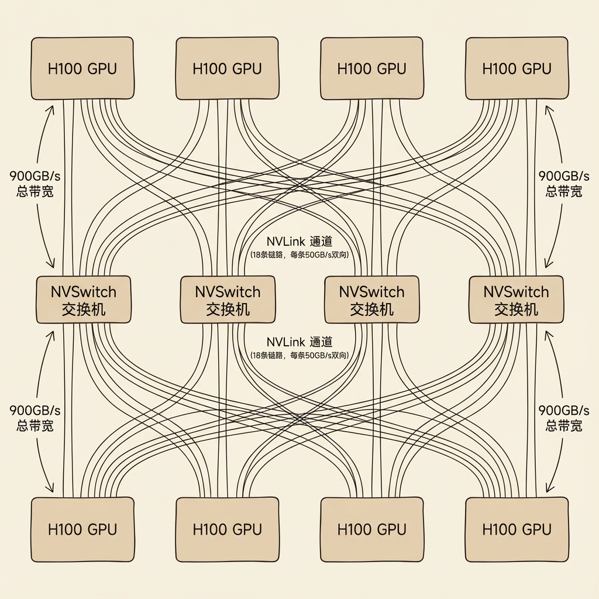

每块 GPU 会同时接入这 4 台不同的 NVSwitch，这种上联至多个物理交换节点、并通过多节点实现 GPU 间数据互访的设计，被称为多平面设计（也叫多轨道设计）。因此，H100 平台的 GPU 互联架构采用的是4 平面设计。需要强调的是，这类设计无需网络工程师手动接线，所有互联链路都已预先集成在被称为SXM5 板卡上。如下图所示\(来自英伟达官网\)：8 块 H100 GPU（黑色盖板下方的组件）与 4 台 NVSwitch（绿框标注部分）共同集成在同一块 SXM5 板卡上，构成了完整的高速互联计算单元。

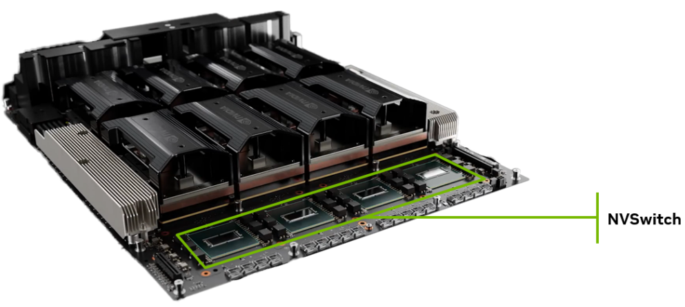

#### **8.8.****GPU服务器间通信**

服务器内部不同GPU的互通在内部通过NVSwtich就完成了，但是如果涉及跨服务器的通信就需要依赖物理网络把他们打通了。而服务器对外通信时，开放的“窗口”就是网卡，英伟达GPU的网卡采用的是被称为ConnectX的系列，其中A100用的ConnectX-6，而H100用的ConnectX-7，前者的端口速率是200Gbps，后者是400Gbps。

如下图所示，以A100为例，这些物理网卡在内部与GPU进行了1:1的绑定，每块网卡对外提供200G的上行链路，对外总计提供1.6T的上行带宽。

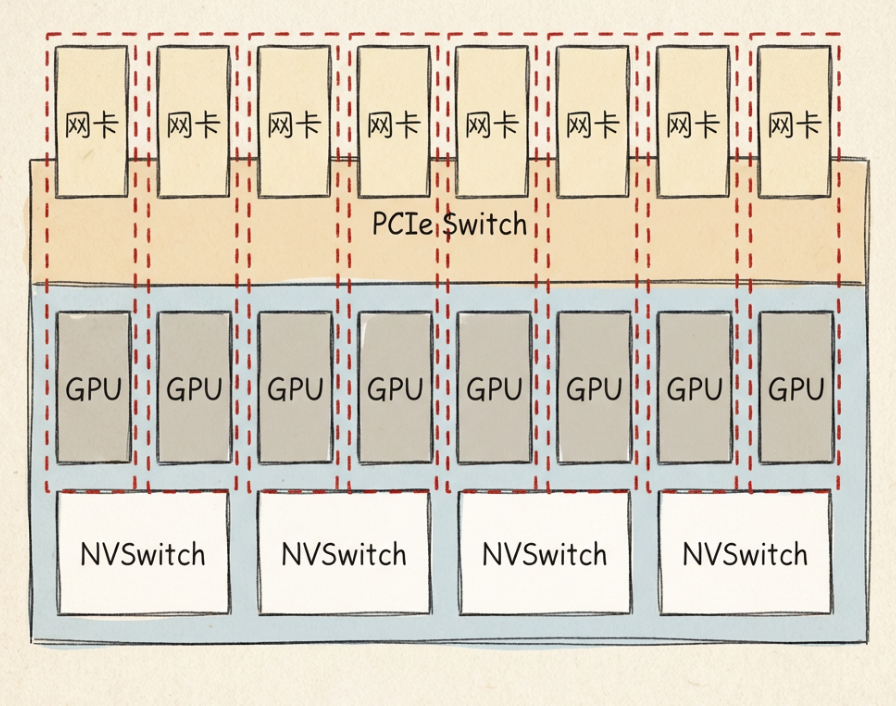

网络管理员们会把光缆一端接在GPU服务器的网卡上，另一端接在交换机上，这类交换机直接与服务器打交道，我们称为**接入交换机（也成leaf）** 。值得注意的是，每个网卡上联不一样的leaf，这样的话，就需要8台leaf交换机。这样的做的目的，一方面通过多平面设计实现容灾；另一方面是可以让单台交换机完成不同服务器上相同编号的GPU通信，让网络通信变得更有确定性。

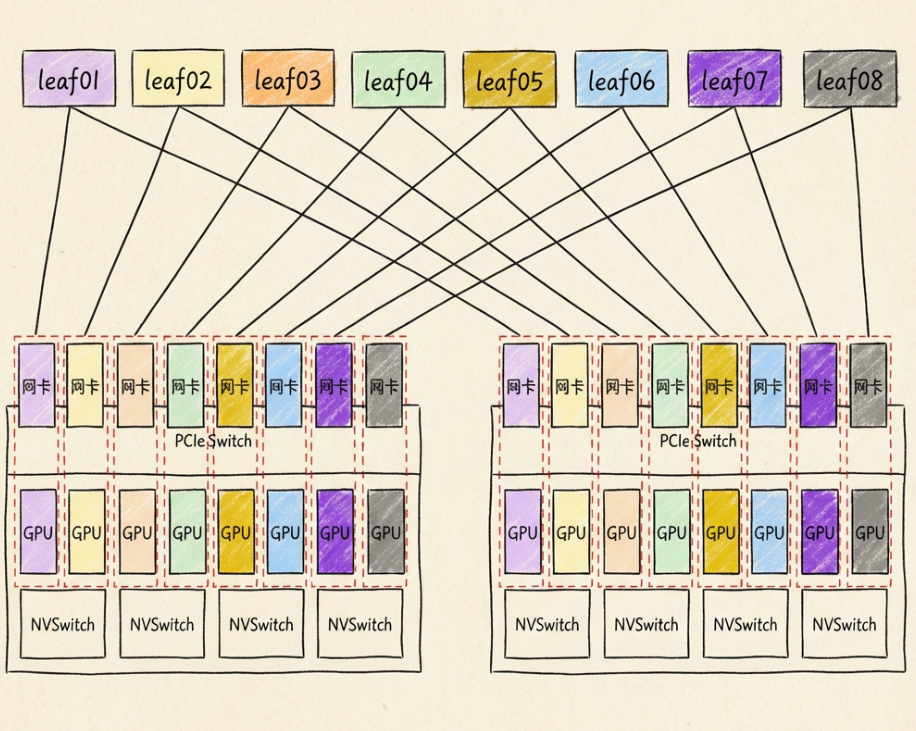

物理网络的管理员们会尽可能把网络设计得扁平，尽量减少网络通信经过的中间节点数量。但问题是，不同平面的GPU该怎么通信呢？此时就不得再引入更高层级的设备进行跨平面的打通。位于更高层级的这个设备，我们称之为汇聚交换机\(也称Spine\)，如下图所示，展示了不同GPU平面通过Spine设备进行通信。

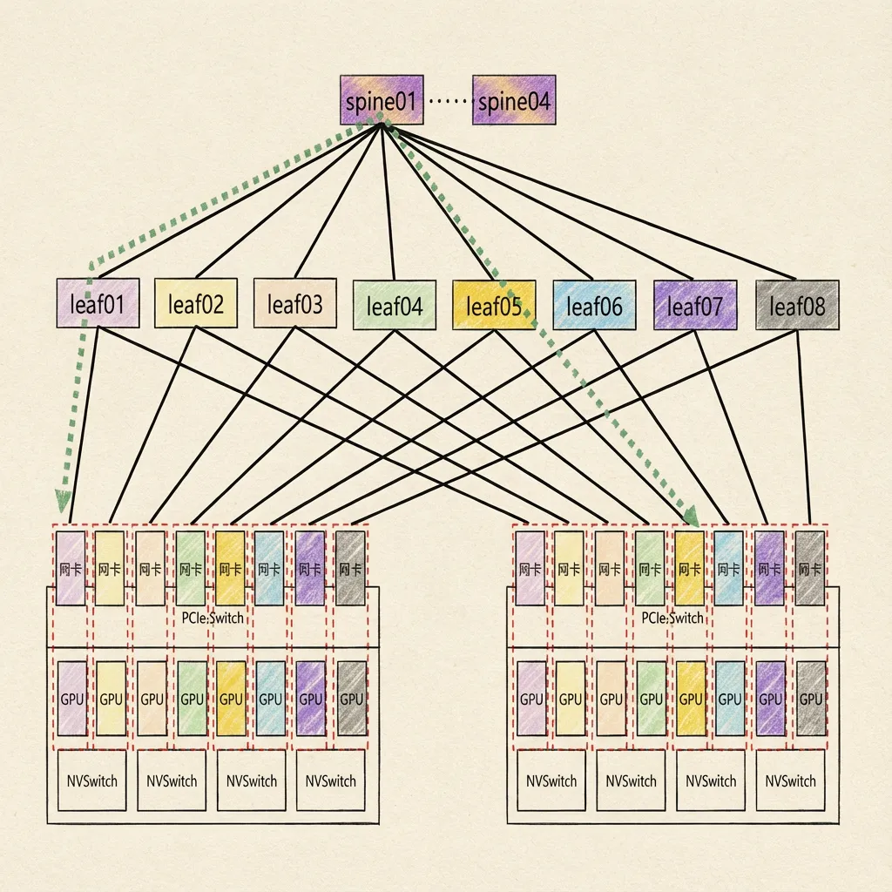

### **9.****大模型的使用**

#### **9.1.****大模型的不足**

并不是每个人都买得起GPU，也并不是每个人都可以训练一个大模型，大多数情况下，我们都在使用别人训练好的模型，来给我们的生活和工作，带来一些改变。每个人的习惯不同，我们不能指望，在广场上跳广场舞的我的大舅妈，和在实验室训练大模型的人，在使用大模型过程，都通过一模一样的调用方式。

模型一旦训练好，参数就会固定，这意味着模型学到的都是历史的、过时的知识。由于模型的训练成本比较高，它没办法实时的更新自己的参数，这是它的局限性。特别是大模型无法解决随着时间改变而改变的知识，也可以称为动态数据，例如天气的变化、猪肉价格的变化、GDP的同比增长率、实时新闻等。

大模型另一个常见的问题就是幻觉，幻觉是一个被包装的很好的名字，它实际上，是为了“装饰”大模型对于用户提问，回答不准确、答非所问、回答错误等问题的统称。这根本上是因为它是一个概率模型，概率这个词一定程度上就说明它不够准确。

我将结合着大模型的这些局限，来分享一下人们在使用大模型过程中，有哪些好的思路，解决上述问题的。

#### **9.2.****Agent**

从易用性的角度看，Agent的出现，就是为普通人提供了使用大模型的窗口。关于agent的定义有很多说法，大体上，人们把能够对外部环境进行感知、思考决策，并且具有执行能力的“物体”，叫作Agent。我们人类就是这样一个“物体”。你以为是你在张口吃饭吗？不是，是你在代理你的精神意志在吃饭。

如果在Agent中，负责思考决策的是一个训练好的大模型，那么它就被称为Agent智能体。Agent至少要具备感知器和执行器两个组件。它很像是一个人，大模型相当于是我们的大脑，外部感知器就是类似于我们的眼睛、鼻子、耳朵、舌头。当Agent可以对我们输入的文字作出反馈，那么这个agent就具备了听觉，而当它可以进行图片识别时，我们就可以说它具备了视觉感知。

Agent的感知器被设计的越易用、越自然、越像是一个善于倾听的知心朋友，可能越会得到普通用户的青睐。

#### **9.3.****MCP**

MCP被称为模型上下文协议，它定义了Agent与外部系统间交互时的通信标准。MCP的出现，极大的弥补了大模型处理动态数据的窘境，Agent在调用大模型过程中，可以通过MCP来从外部系统或者外部工具平台获取它想要的动态数据。不过前提是，Agent管理员要提前把他认为可能用到的工具存放（也成注册）在本地。

在MCP之前，还有一个叫作function calling的东西，也可以让大模型获取到外部的实时数据，只是function calling与OpenAI深度绑定。他们在调用外部系统前，Agent会把所有的工具列表以及工具的功能描述和用户问题一起发送给大模型，大模型再分析用户意图后，从工具列表选择一个工具后，返回给Agent，告知其进行该工具调用，进而查询动态数据。

MCP极大可能成为Agent与外部系统之间的标准调用协议，因为在2025 年 12 月，mcp的发明者Anthropic 将 MCP 捐赠给Linux基金会旗下组织 AAIF，使其从单一厂商项目逐步转为中立的行业标准。

#### **9.4.****RAG**

人们通过Agent使用大模型时，常常被它的幻觉困扰，幻觉产生的根因在于它是概率预测模型，除此之外，也有很大的原因在于，它本身并没有很有效的数据，这导致它会答非所问。由于大模型的知识是陈旧的，人们考虑为它增加一块外部“存储卡”，在这个存储卡中，人们可以把最新的数据、或者私域数据（它没有被大模型充分学习）加载到里面。这个思路最终演变成了一个叫作RAG的东西，人们把它作为大模型的外部“知识库”。

RAG全称是检索增强生成，我的理解是通过检索知识库增强大模型的生成答案的能力。RAG提供了一种让大模型不需要通过训练就可以获取到新知识的能力，它的核心工作机制：首先对上传的外部知识文档进行分片处理（拆分成几百字左右的小片段，即 Chunk）；接着将这些分片内容转化为向量。之所以要进行向量化，是因为模型无法直接理解文字语义，而向量可以将文字的语义转化为一串数字（前文中已经介绍过），后续只需通过向量相似度计算，就能快速找到与用户问题语义最匹配的知识分片。

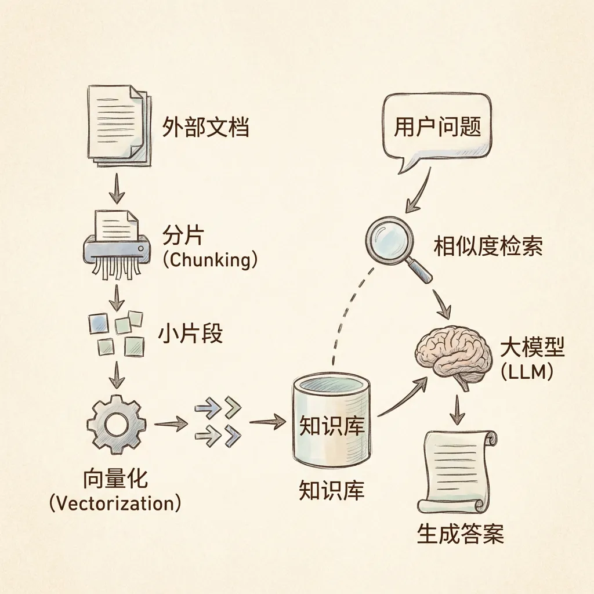

匹配完成后，这些高相关度的知识分片会与用户的原始问题整合，一同输入大模型，为其生成答案提供可靠依据。需要注意的是，分片必须控制合理尺寸：如果不分片或分片太大，一方面会降低语义匹配的精准度，另一方面也可能导致整合后的内容总长度，超出大模型的上下文 Token 限制，无法正常输入模型进行处理。

#### **9.5.****A2A**

在MCP、RAG知识库等能力的加持之下，Agent智能体也逐渐的推广，Agent作为AI大模型和用户之间的桥梁，换了一种面目，与普通人相遇。可谓是旧时王谢堂前燕，飞入寻常百姓家。

在AI不离口，GPU不离手的现在，各行各业都在探索属于自己的Agent，Agent也如在深圳雨后的蜗牛，让我们目不暇接。Agent之间的通信、调用需求就自然而然的摆在了我们的面前，并没有经过长时的等待，在MCP出现没多久，Google 于2025 年 4 月 9 日正式发布A2A协议，后续捐赠给 Linux 基金会托管，成为不同agent之间通信的中立的标准协议。

  

### **10.****结尾**

2025年岁末，北方已经进入寒冬，深圳的天气依然温和，路边绿树长青，彼时，我在出租车上，被一则中国之声的广播吸引了注意力：天津大学的于强教授在神经网络取得重大突破，为通用型下一代AI提供底层支撑……那一刻，我又再次记起多年前的那位计算机老师，记起他与我们打成一片的点点滴滴……

时过境迁，人们对于神经网络的悲观情绪现如今早已一扫而光，神经网络经过几十年的沉寂，究竟还是迎来春天，就在此时此刻，它正经历着，属于它的时刻。

  
  
