# 避坑！AMD 服务器指令集引发的故障分析

> 原文链接：[避坑！AMD 服务器指令集引发的故障分析](https://mp.weixin.qq.com/s/hOlH6OqZq2lURkcwPK2tPw)

HUATUO（华佗）再出手，解决 AMD 服务器指令集引发的故障问题。### 问题现象


在一次全链路压测过程中，一个核心服务调度扩容到云上 AMD 服务器后出现 CPU 掉底，业务指标抖动。


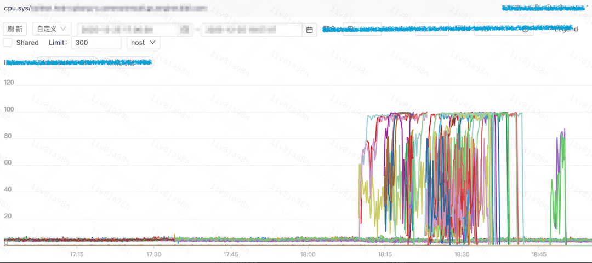

运维团队将云上容器调度到 IDC 机房后，发现部分机器（主要为 AMD 机型）同样出现抖动问题。


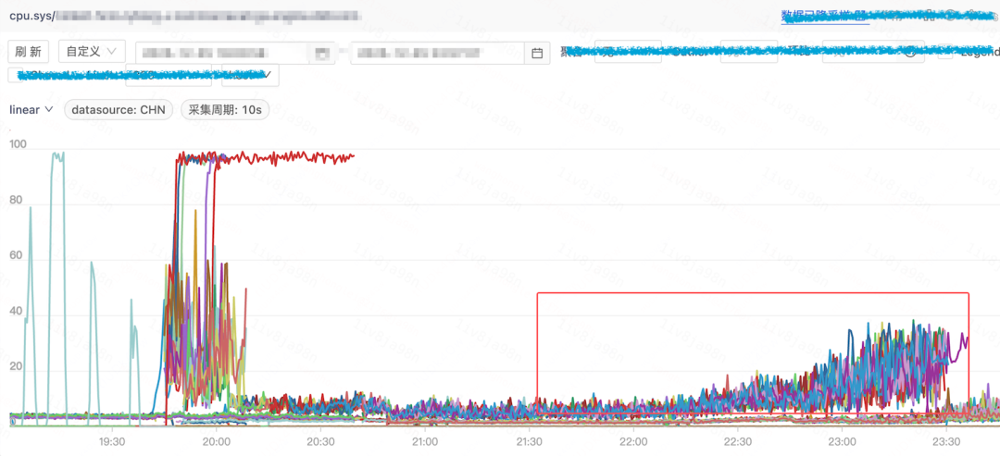

### 问题分析

#### HUATUO 捕获现场


介入问题排查后，我们发现云上机房 HUATUO cpuidle 已经自动捕获到了容器的异常现场：


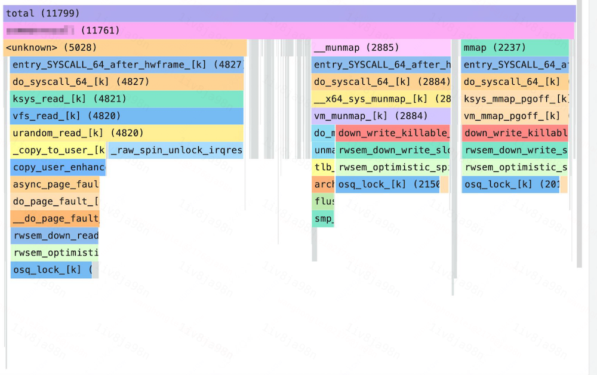

从内核栈可以观察到一个特殊的热点 urandom_read()，该函数通常调用频率很低，据此怀疑容器存在异常的随机数操作。

将这一发现同步给业务团队，他们反馈近期变更了采集配置，采集流量比例从 1% 提升至 100%，导致 std::random_device 的调用数量明显增加。因此，业务回滚变更配置，容器再调度至云上机房和 IDC AMD 服务器后，均无抖动问题。


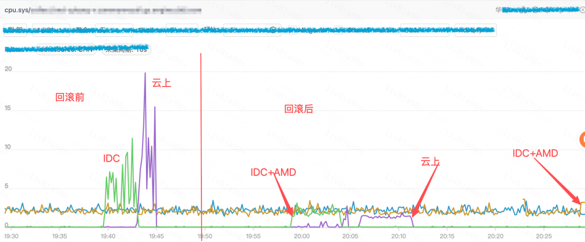

为什么只有 AMD 服务器有问题，而 Intel 服务器却没有影响？#### 复现问题


根据线上 HUATUO 抓取的火焰图，可以清晰的看到热点集在两部分：

```
- page fault 处理过程与 mmap()&nbsp;+ __munmap()&nbsp;存在明显的读写信号量争抢。
- 随机数生成过程触发的 urandom_read()&nbsp;存在激烈的 spinlock 争抢。

```

我们开始在 AMD 机器上复现该问题。基于线上现象，复现场景需要满足两个条件：频繁读取 /dev/urandom，以及并行执行 mmap 和 munmap 操作。在经过调整后，构建的负载如下：

```
- 约40个线程负责随机数生成，单线程内部每次生成随机数后睡眠 0.1 ms。
- 约10个线程进行 mmap 和 munmap 操作，并不进行内存读写，避免触发额外 page fault；单线程内部每次 mmap 与 munmap 之间睡眠&nbsp;1&nbsp;ms。

```

上述负载在 AMD 机器运行后的效果如下：


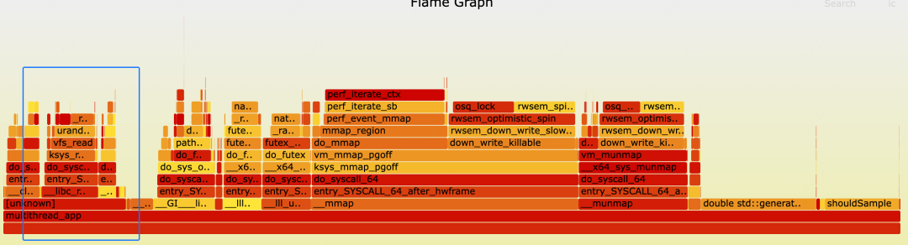

虽然，热点分布和线上问题不完全一致，但与 HUATUO 抓取的火焰图相似度极高：mmap 和 munmap 占据部分热点，urandam 内核态的 urandom_read() 构成另一主要热点。#### 继续深挖


将上述代码在 Intel 机器运行，出现了非常有趣的现象：整体 CPU 利用率相对较低，且热点主要集中在用户态，且几乎观察不到 urandom_read() 调用。


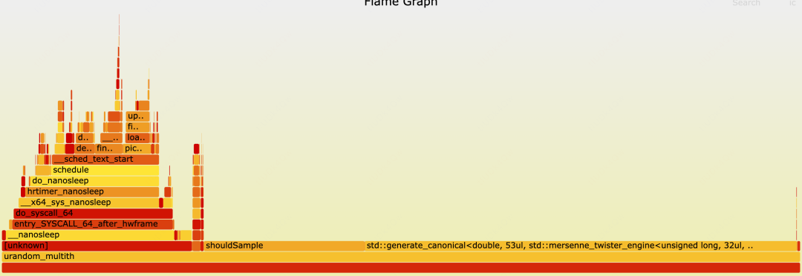

进一步的通过 eBPF 打点后确认，urandom_read() 在 Intel 的机器上确实未被触发。因此可以证实代码的行为和硬件平台相关，这个差异可能来自哪里呢？通过火焰图可以发现 urandom_read() 的调用栈非常浅，因此大概率和库实现相关。

业务应用程序通过 std::random_device 结合 std::mt19937 生成随机数。因此，通过在不同的服务器使用 gdb 观察运行时变量差异。

AMD 机器上，通过 gdb 读取到 std::random_device._M_file 的地址信息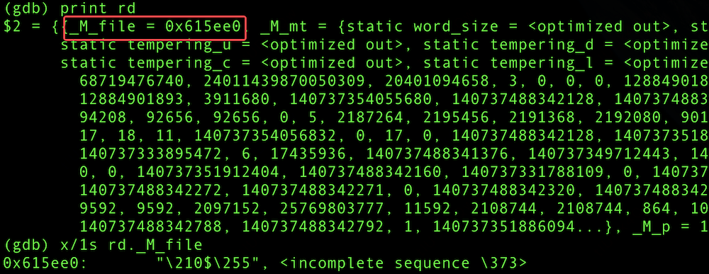

Intel 机器上，通过 gdb 读取到 std::random_device._M_file 是空指针


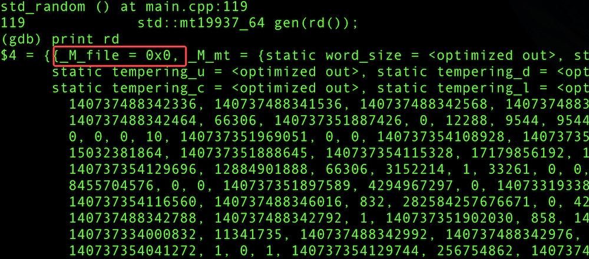

看来标准模版库在不同硬件平台存在行为差异。该环境下的标准库版本为 libstdc++-8.5.0，继续分析 random_device 处理：


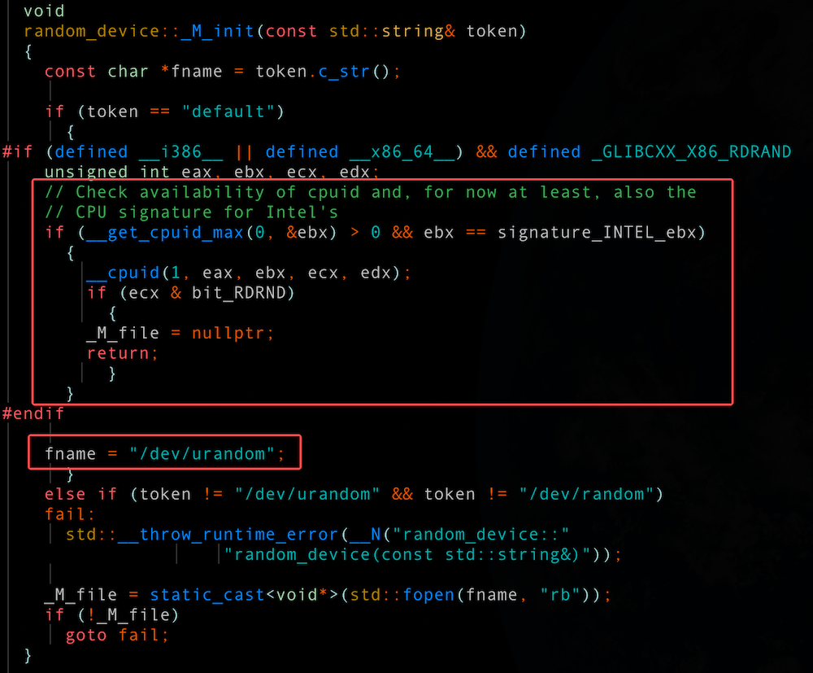

在初始化阶段确实存在平台相关的差异处理逻辑：当检测到 Intel CPU 时，_M_file 会被置为空；而在其他平台（如 AMD）上，则会打开 /dev/urandom 设备，并将其文件句柄赋值给 _M_file。_M_file 的内容对后面会有什么影响呢？在执行获取随机数种子的时候：如果 _M_file 是空，则会执行__x86_rdrand() 返回结果如果 _M_file 不是空，则读取 /dev/urandom 设备


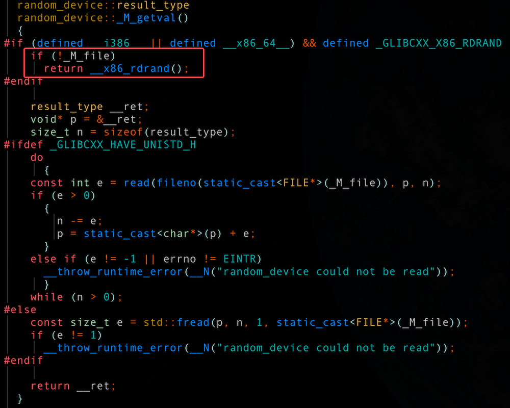

__x86_rdrand() 可以理解为直接调用 x86 架构下的 rdrand 指令，从处理器的硬件随机数生成器获取随机数。采用该方式能够在多数场景下避免更为耗时的 /dev/urandom 设备操作。 Intel 早期硬件就已支持该特性，并在 libstdc++ 中实现了优化路径；然而 libstdc++ 8.5.0 版本，对 AMD 平台并没有类似优化。

AMD 服务器出现 cpu.sys 异常的直接原因是：libstdc++-8.5.0 版本内未支持 AMD 平台使用 rdrand 指令直接获取随机数种子。因此，在生成随机数时，代码只能通过读取设备文件 /dev/urandom 来实现。当这种行为在高并发场景下大规模并行发生时，会不可避免地引发 spinlock 激烈争抢，从而导致 cpu.sys 显著上升。

至此，我们已经研究清楚问题根因。但是，从技术角度看似乎还差一点，线上问题在 urandom_read() 执行过程中出现了大量 page fault，而我们并未复现。原因是什么呢？#### 最后一击


业务容器基于 CentOS 7 镜像构建，标准库为 libstdc++-4.8.5-4.el7.x86_64。因此，使用该版本库，再次构建线上问题场景。


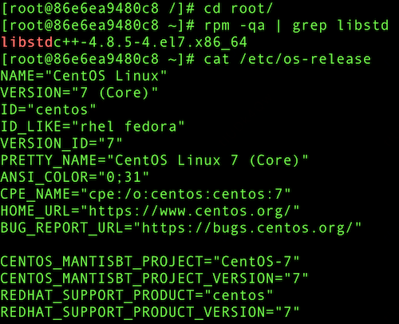

编译相同的测试代码运行，得到的效果如下，完美契合线上火焰图。


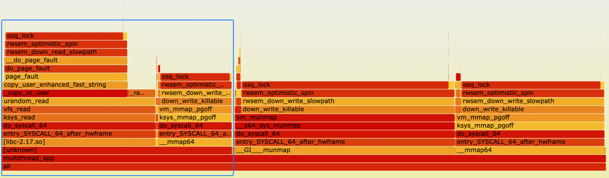

业务容器 cpu.sys 达到了惊人的 2400%+

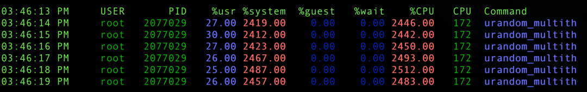

而相同的代码使用 libstdc++-8.5.0 时，cpu.sys 则在 95%

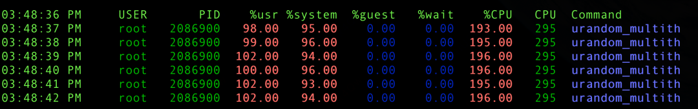

对比两个版本代码，很容易确认优化补丁。该补丁的核心目标是从标准库的 fread() 函数切换到系统调用 read() 来读取 /dev/urandom，主要原因是 fread() 会读取过多的数据。具体超出多少呢？可以通过 bpftrace 工具进行验证：

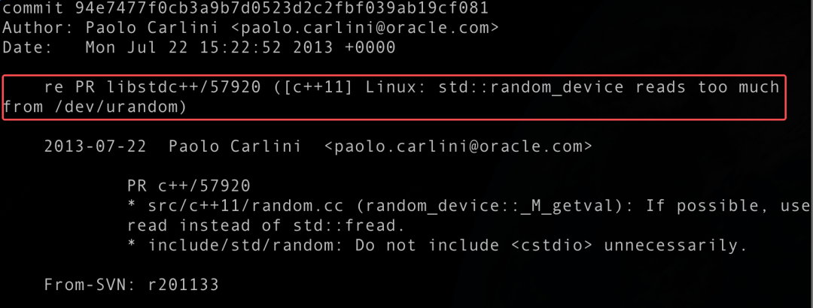

libstdc++-8.5.0 read 只读取 4B，且 copy_to_user 的用户态目的地址在用户栈，不会产生额外 page fault。

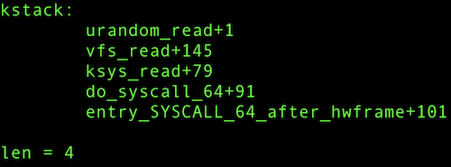

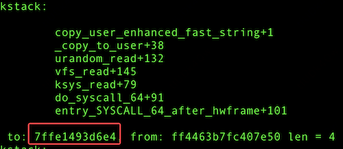


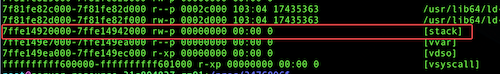

libstdc++-4.8.5 fread() 读取4KB，通过单次64B✖️64次的方式拷贝到用户态。copy_to_user 将数据拷贝到这4K内存过程必然产生 page fault。


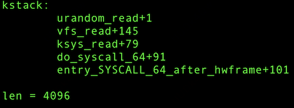

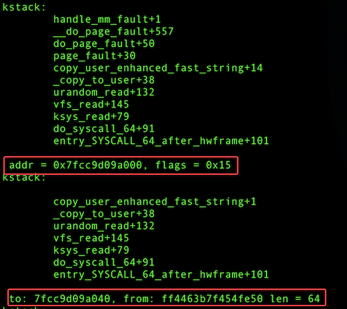

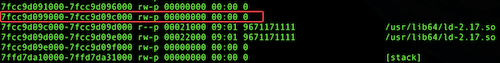

### 问题总结


简单总结下：标准库 libstdc++-4.8.5-4.el7.x86_64 std::random_device 存在两个缺陷：

```
1. 仅在 Intel 机器支持硬件随机数（rdrand 指令），而在 AMD 机器只能通过/dev/urandom 设备生成随机数。该缺陷导致并发访问 /dev/urandom 设备 spinlock 争抢，推高 cpu.sys。

2. 采用 fread()&nbsp;引发额外的内存分配，触发 page fault。该缺陷引入了大量的 page fault。page fault 与容器程序频繁的 mmap/munmap 激烈争抢 mm_struct-&gt;mmap_sem 读写信号量，再次提升 cpu.sys。

```### 解决方案


这些缺陷在较新版本的 libstdc++ 均已修复：

```
94e7477f0c&nbsp;("re PR libstdc++/57920 ([c++11] Linux: std::random_device reads too much from /dev/urandom)")
b0c0d878a8&nbsp;("PR libstdc++/85494 use rdseed and rand_s in std::random_device")

```

（b0c0d878a8 “PR libstdc++/85494 use rdseed and rand_s in std::random_device”）主要价值在于增加对 AMD 机型 rdrand 硬件随机数指令。解决方案建议用户升级操作系统版本（宿主机或者容器镜像）或者 libstdc++ 10.3.1-71 以上版本。测试后，相同的复现程序基于libstdc++.10.3.1-71 + AMD 机器，再无该问题。


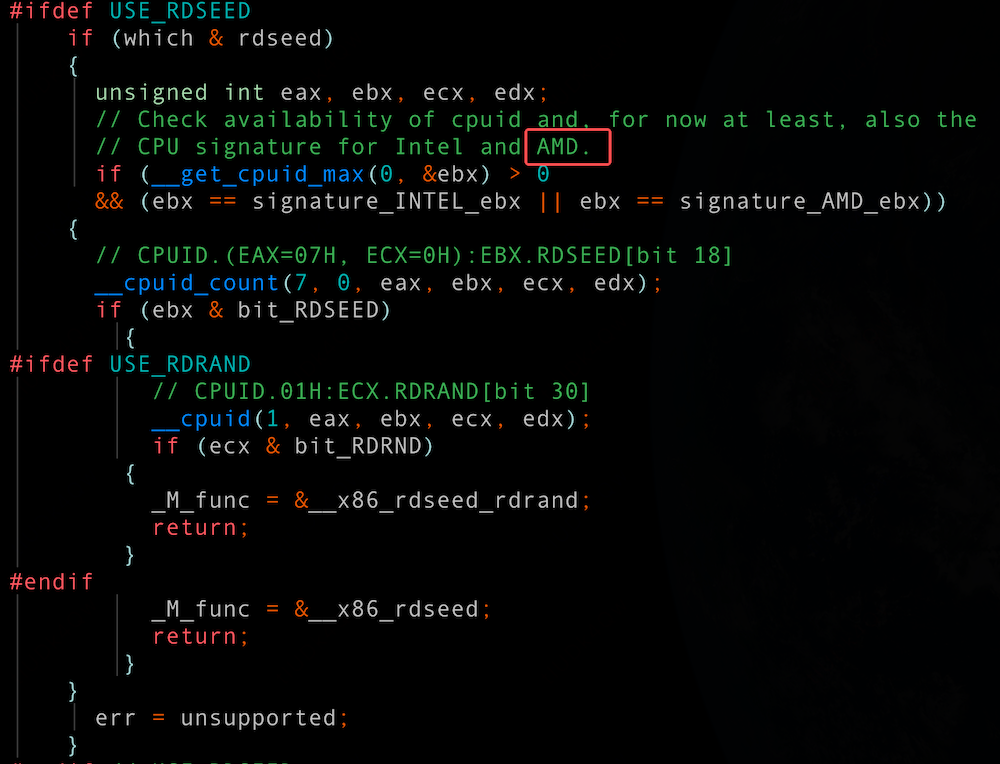

### 一点感受


技术层面的分析至此告一段落。本次排查从用户态代码入手，进入到 gcc 标准库实现，再到内核态的打点验证及汇编代码分析，最终将问题从现象到本质完整梳理完毕，又一个 AMD 机器带来的“惊喜”被抚平了。

总体而言，本次问题的核心在于老的软件环境与新的硬件设备之间的兼容性矛盾。

**篇尾：**HUATUO（华佗）是由滴滴开源并依托 CCF 孵化的操作系统深度可观测项目。关注微信公众号，或扫码加微信，邀请你加入用户群（请备注姓名+单位）：


仓库1：https://github.com/ccfos/huatuo仓库2：https://gitlink.org.cn/ccfos/huatuo官网：https://huatuo.tech/

