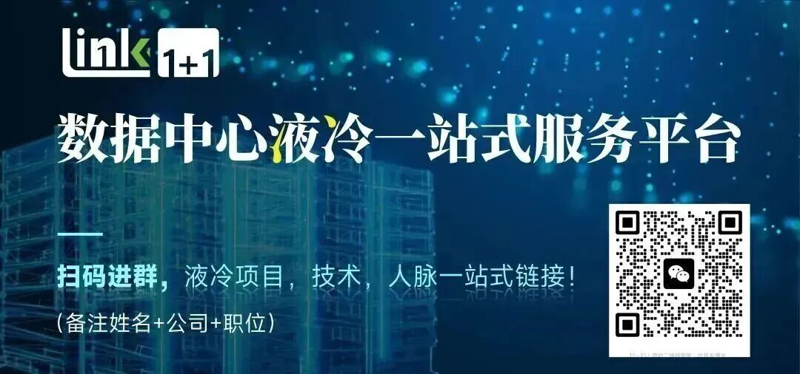
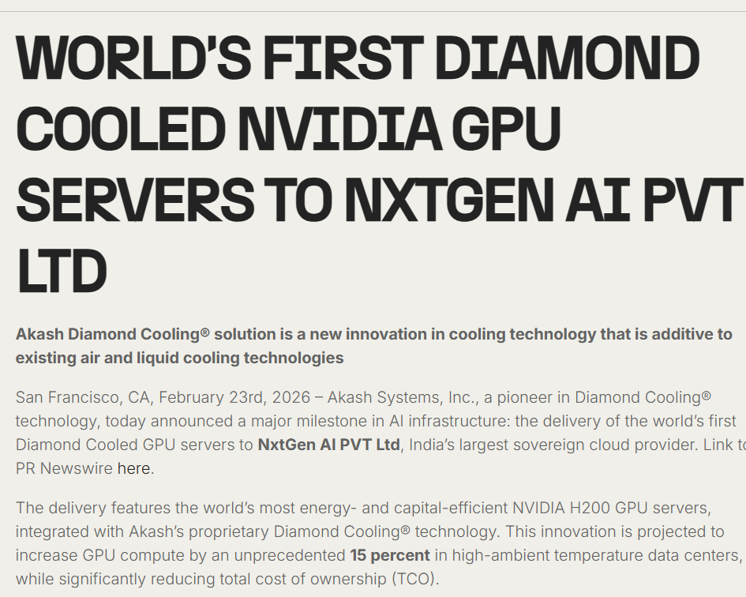
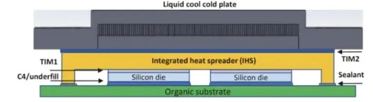
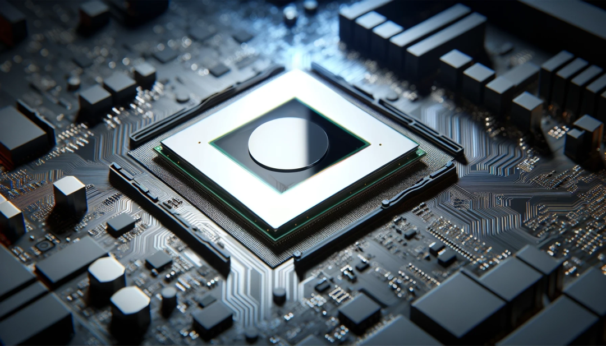
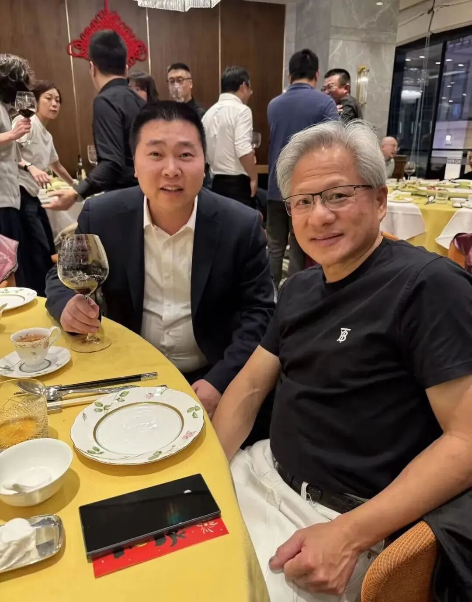
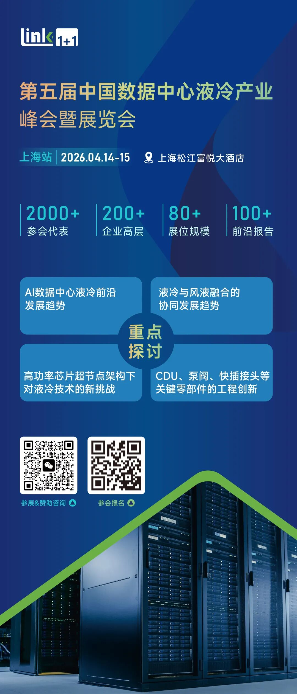

 01.全球首个“金刚石”冷却技术英伟达H200服务器完成交付 钻石冷却®技术的先驱Akash Systems, Inc.宣布在人工智能基础设施领域取得重大里程碑：向印度最大的自主云服务提供商NxtGen AI PVT Ltd交付全球首批钻石冷却GPU服务器。此次交付的产品配备了全球能效和资本效率最高的NVIDIA H200 GPU服务器，并集成了Akash专有的Diamond Cooling®散热技术。这项创新预计将在高温数据中心内将GPU计算能力提升前所未有的15% ，同时显著降低总体拥有成本（TCO）。“钻石冷却技术解决了人工智能基础设施竞赛中最棘手的两大难题——能源效率和资本效率，” Akash Systems联合创始人兼首席执行官Felix Ejeckam博士 表示。 “在计算能力提升1%到2%都意义重大的今天，15%的提升更是颠覆性的。我们很荣幸能与NxtGen合作，共同完成这项史无前例的部署。” 02.热管理材料革新，而非系统重构 从数据中心热管理技术演进的角度来看，Akash Systems推出的 Diamond Cooling® 本质上代表了一种“从材料与芯片层级重构散热路径”的思路，与传统风冷、冷板液冷和浸没液冷形成明显差异。过去几十年数据中心散热始终围绕系统级展开，无论是风冷还是液冷，核心逻辑都是在芯片封装之外构建换热界面，例如当前主流的GPU服务器（如基于NVIDIA H200）的热路径大致为：芯片 → 封装 → 导热界面材料（TIM）→ 冷板或散热器 → 冷却介质。随着AI算力密度爆发，这条路径中的界面热阻成为瓶颈，尤其是热点（hotspot）区域温度高企，导致GPU频率受限、降频甚至寿命下降。Diamond Cooling®的核心优势在于将高导热金刚石材料直接集成到半导体或封装结构中，使热量在产生的第一时间就被快速扩散，从而显著降低热点温度和局部热阻，这是一种“源头级散热”，而不是传统意义上的“末端散热”。与风冷相比，其最大差异在于不再依赖空气换热能力的提升，风冷的极限来自空气热容和对流效率，随着AI服务器单柜功率逼近甚至超过100kW，单纯提高风速或优化风道已难以满足需求；Diamond Cooling®则通过降低芯片结温，使风冷在一定功率区间内仍可延续，从而延缓液冷基础设施投入。与冷板液冷相比，冷板液冷通过液体带走封装层面的热量，可以大幅降低整体温度并提升PUE，但其本质仍然依赖芯片与冷板之间的界面传热，热点区域温差仍较大，而金刚石导热可显著降低封装内部温差，使冷板系统更加高效，甚至在相同流量和冷却能力下获得更高算力输出。与浸没液冷相比，浸没技术通过完全消除空气界面并提升换热系数，在系统层面具有最强散热能力，但依然无法解决芯片内部热点问题，同时还面临运维复杂度、材料兼容性及生态成熟度挑战；Diamond Cooling®则可以与浸没结合，在不改变数据中心基础架构的前提下进一步降低芯片温度，提高系统稳定性和寿命。从产业逻辑来看，这一技术的优势不仅在于温度降低和性能提升，更在于改变AI算力竞争的关键变量——功率密度和能效。随着AI GPU功耗持续攀升，未来算力提升越来越依赖散热能力，谁能更有效地控制芯片温度，谁就能释放更高频率和更高利用率。因此，Diamond Cooling®与风冷、冷板液冷、浸没液冷并非简单替代关系，而是形成分层协同：风冷与液冷解决系统层热管理，浸没解决高密度场景，而金刚石导热解决芯片与封装层的根本热阻问题。这意味着未来数据中心散热体系可能从“单一系统方案竞争”转向“材料+封装+系统多层协同”，在AI时代形成新的技术路径。 03.从金刚石Diamond Cooling®看AI芯片的散热未来：材料+封装+系 统的协同发展

2026 年 1 月 25 日英伟达 CEO 黄仁勋在北京与国内某金刚石公司董事长会谈，双方聚焦钻石-铜复合散热、第四代半导体钻石晶圆，为 H200 GPU、Vera Rubin 新架构解决高密度散热瓶颈，同时探索钻石晶圆在高端芯片衬底的应用，可以看出英伟达对热管理材料的重视程度和系统的协调发展。

回到金刚石材料端，从行业演进角度看，金刚石散热正在成为AI算力时代一个极具战略意义的方向。以Akash Systems为代表的技术路径，本质上标志着散热从“外部辅助功能”转向“芯片架构的一部分”，这背后反映的是AI功率密度不断突破极限所带来的系统性变革。过去几十年，散热一直被视为IT基础设施中的配套工程，核心创新集中在空调、风道、冷板和冷却液等系统层，但随着高功率GPU和AI服务器（例如NVIDIA H200等架构）的发展，功率密度已经逼近材料与封装极限，传统路径逐渐难以支撑未来算力增长，这正是金刚石散热兴起的核心背景。

首先，从技术层面来看，金刚石散热最大的优势在于其极高的热导率。天然或合成金刚石的热导率可达2000 W/mK以上，是铜的数倍，是硅、碳化硅等传统半导体材料的显著提升。这意味着在芯片热点区域，热量可以以更快速度横向扩散，降低局部温度峰值。对于AI芯片而言，这一点尤为关键，因为GPU并不是均匀发热，而是存在明显热点，这些热点通常决定了频率、稳定性和寿命。金刚石材料能够在热量尚未扩散至封装层之前进行快速均温，显著降低热点温度，从而提升性能上限并减少降频。这种能力与传统系统级散热完全不同，后者更多降低平均温度，而无法根本解决局部热阻问题。

其次，金刚石散热不仅提升热性能，还带来系统级能效优势。随着AI集群规模不断扩大，数据中心的电力瓶颈逐渐显现，散热效率直接影响PUE和整体算力成本。如果芯片温度降低，可以减少风扇功耗、降低冷却液流量需求，并延长设备寿命，从而降低运维成本。从长期来看，这种材料级散热有可能成为降低算力成本的重要路径之一。尤其在高温环境或电力紧张区域，芯片级热管理可以显著提高系统稳定性，使数据中心在更宽环境条件下运行。

第三，金刚石技术具有很强的协同潜力，而不是替代现有液冷方案。未来的散热体系更可能呈现分层结构：材料层解决热点问题，封装层优化热扩散，系统层负责热量搬运。这一模式意味着风冷、冷板液冷、浸没液冷不会消失，而是与金刚石技术形成互补关系。例如，在冷板液冷架构中，金刚石可以降低芯片结温，使冷板设计更加简单，减少泵功耗和流体复杂度；在浸没液冷系统中，金刚石可以降低气泡形成和局部热失控风险，提高可靠性。因此，未来竞争的焦点不再是单一技术路线，而是多层协同能力。

从产业趋势看，散热正从单一辅助功能转变为“材料+封装+系统”的综合工程。过去，芯片设计完成后再由系统厂商解决散热问题，但AI时代这一逻辑正在改变。未来，散热将成为芯片架构设计的重要输入变量。例如，在先进封装中，热管理已经与Chiplet、3D堆叠和HBM集成深度耦合，封装结构将同时优化电、热和机械性能。金刚石基底、金刚石中介层甚至热导通孔等方案，将成为先进封装的重要组成部分。这意味着半导体材料公司、封装厂、服务器厂和数据中心运营商之间的协同将不断增强，行业边界逐渐模糊。

这一趋势将推动散热产业链上移。未来竞争不再局限于冷板设计或冷却液优化，而是延伸至晶圆材料、界面工程和封装技术。类似TSMC、Intel等先进封装能力强的厂商，可能成为散热创新的重要参与者。同时，服务器OEM、云厂商也可能直接参与散热材料选择，因为这将直接影响算力效率和资本回报率。

总结来看，金刚石散热的意义不仅在于导热性能提升，更在于改变了散热的产业逻辑。未来热管理将从“系统层优化”转向“材料、封装与系统的协同设计”，成为芯片架构和算力竞争的重要组成部分。谁能够在材料级散热、先进封装和系统级液冷之间形成闭环能力，谁就更有可能在AI算力时代获得长期竞争优势。这种趋势也预示着，数据中心散热正在从基础设施领域向半导体核心技术延伸，成为下一轮技术和产业变革的重要方向。

更多液冷前沿趋势，液冷大会现场呈现 

  

2026年4月14日至15日，第五届数据中心液冷峰会暨展览会将在上海举行。本次大会由零氪主办，聚焦AI时代数据中心散热技术升级与产业生态协同，吸引了包括整机厂、芯片厂、数据中心运营商及核心设备供应商在内的产业链头部企业参与，预计2000位行业专家参与。

  

关注我们获取更多精彩内容