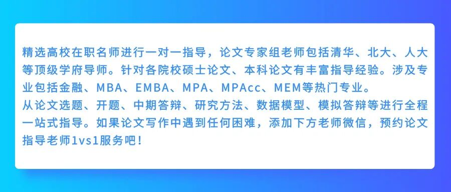

# 零基础也能写！MEM论文数据收集与分析超全攻略

> 原文链接：[零基础也能写！MEM论文数据收集与分析超全攻略](https://mp.weixin.qq.com/s/xxvZ-p9v0-DEocQI6KsUSw?clicktime=1770011426&enterid=1770011426&scene=90&subscene=236&xtrack=1)

如果你也在为MEM论文的数据部分发愁，这篇文章就是为你准备的。无需统计学背景，无需复杂软件技能，跟着这篇攻略一步步来，你会发现数据收集与分析原来如此简单！

01

**一、数据收集：四个方法，总有一款适合你**### 1. 问卷调查法（最常用）

**适用场景**：需要大量样本、研究态度、满意度、行为频率等

**操作步骤**：

确定调查目标：明确你要通过问卷了解什么

设计问题：每个问题只问一件事，避免双重问题

选择平台：问卷星、腾讯问卷等免费工具足够用

发放问卷：通过微信群、朋友圈、同事群等方式扩散

收集数据：设定收集时间，一般1-2周

**避坑指南**：

问卷开头要有简短的说明和隐私保护声明

题目数量控制在20题以内，填写时间不超过5分钟

必选项不要太多，避免受访者因麻烦而中途放弃### 2. 访谈法（深度挖掘）

**适用场景**：需要深入了解原因、背景、细节

**操作步骤**：

设计访谈提纲：5-8个开放式问题

选择受访者：选择有代表性的对象，5-10人即可

进行访谈：面对面、电话或视频均可

记录整理：录音+笔记，访谈后24小时内整理

**小技巧**：

访谈时多问“为什么”、“能举个例子吗”，可以获取更丰富的信息。### 3. 公开数据法（最省时）

**适用场景**：行业分析、市场研究、政策影响等

**数据来源**：

国家统计局官网

行业报告（艾瑞、易观等）

上市公司年报

学术数据库（知网、万方）

**注意事项**：

使用公开数据一定要注明来源，确保数据的权威性和时效性。### 4. 实验/观察法（最直接）

**适用场景**：流程优化、效率提升、问题诊断

**如何操作**：

确定观察指标（如：流程耗时、错误率等）

设计记录表格

实施观察并记录数据

对比分析（改进前后对比）

02

**二、数据分析：四招搞定，不学统计也能会**### 第一步：数据整理（30%的时间应该花在这里）

**检查数据完整性**：填补缺失值或删除无效问卷

**数据清洗**：找出异常值（如年龄填200岁）

**数据编码**：将文字转化为数字（如：男=1，女=2）### 第二步：选择分析方法

你的研究目的

推荐的分析方法

工具推荐

描述现状（如：员工满意度如何）

描述性统计（平均值、百分比）

Excel

找出关系（如：薪资与满意度的关系）

相关分析

Excel/SPSS

探究影响（如：哪些因素影响满意度）

回归分析

SPSS

对比差异（如：男女满意度差异）

T检验/方差分析

SPSS

分析访谈内容

内容分析/主题分析

手动编码/Nvivo### 第三步：常用分析操作指南

#### 1. 描述性统计（最简单也最常用）

用Excel就能完成：

**平均值**：=AVERAGE(数据区域)

**标准差**：=STDEV(数据区域)

**百分比**：计算频数后使用公式

**呈现方式**：表格+柱状图/饼图，一目了然。#### 2. 相关分析（探究两个变量的关系）

在Excel中：

点击“数据”选项卡

选择“数据分析”（如没有需先加载）

选择“相关系数”

选择数据区域，确定即可

**解读技巧**：

相关系数介于-1到1之间，绝对值越大，关系越强。通常大于0.7为强相关。#### 3. 内容分析（处理访谈资料）

**四步法**：

通读所有访谈记录

标记关键语句

将相似内容归类，形成主题

统计每个主题出现的频率

**呈现方式**：引用典型原话+你的解读，更有说服力。

03

**三、数据呈现：让图表“说话”的技巧**### 图表选择指南：

**比较数据**：柱状图

**看比例**：饼图（类别不超过6个）

**看趋势**：折线图

**看关系**：散点图

**看流程**：流程图

**看分布**：直方图### 美化小技巧：

一张图只传达一个核心信息

颜色不超过3种，保持简洁

图表标题直接点明结论，如“A部门满意度明显高于B部门”

重要数据用不同颜色突出

04

**四、MEM论文数据部分结构模板**

第三章 研究方法与数据收集

&nbsp; 3.1 研究设计

&nbsp; 3.2 数据收集方法

&nbsp; &nbsp; 3.2.1 问卷调查（附问卷）

&nbsp; &nbsp; 3.2.2 访谈设计（附提纲）

&nbsp; 3.3 样本选择

&nbsp; 3.4 数据分析方法

第四章 数据分析与结果

&nbsp; 4.1 样本基本情况描述

&nbsp; 4.2 信度与效度分析

&nbsp; 4.3 研究假设检验

&nbsp; &nbsp; 4.3.1 描述性统计分析

&nbsp; &nbsp; 4.3.2 相关分析

&nbsp; &nbsp; 4.3.3 回归分析

&nbsp; 4.4 访谈结果分析

&nbsp; 4.5 分析结果小结

05

**五、常见问题解答**

**Q：需要多少样本量？**

A：问卷调查一般100-300份；访谈5-10人；案例研究1-3个案例。

**Q：不会用SPSS怎么办？**

A：优先使用Excel，它已能满足80%的MEM论文需求。如果需要更复杂的分析，可以学习SPSS入门教程，基本操作2小时就能掌握。

**Q：数据不显著怎么办？**

A：这反而是有价值的发现！你可以分析为什么不显著，是样本问题、测量问题，还是理论本身有问题？

**Q：时间不够怎么办？**

A：优先使用公开数据，结合少量访谈，是最省时的组合。

写论文找助研，论文变得很简单

论文的成功通过只是一个起点，我们期待让更多的学员都能在助研的辅导下收获学术成果。请相信我们，助研的全体辅导老师，具备多年的论文辅导经验，一对一提供写作方案，解决你的疑问，带你轻松完成论文！以下是我们学员的一些反馈：

免责声明：部分资料来源于网络，转载目的传递更多信息和分享，仅供平台交流，不为其版权负责，如涉嫌侵权请联系我们及时修改和删除.

