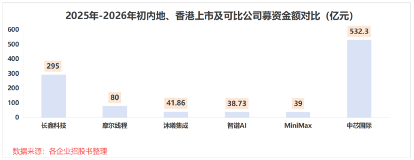
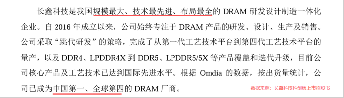
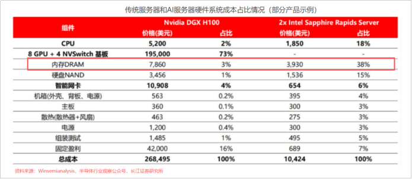
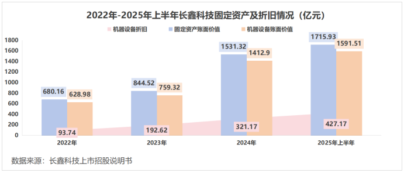
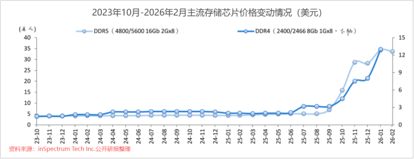
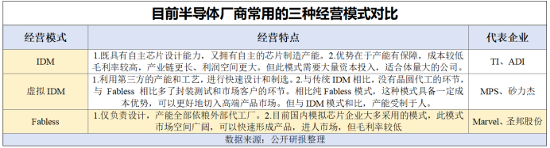
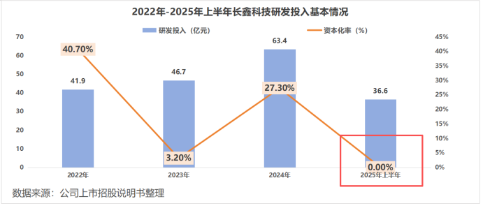
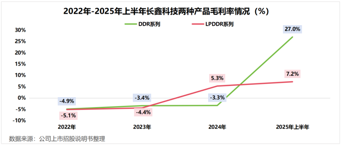
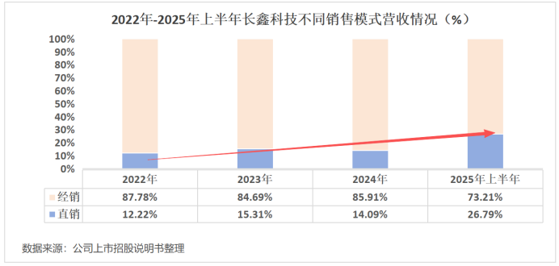

**  
******

**2026****年****开年****，****IPO爆火****！**

**  
******

在 AI浪潮席卷下，1月8日，“全球大模型第一股”智谱AI正式登陆，截至2月26日，其总市值近2500亿港元；同是全球前十大模型的Mini Max于1月9日上市，目前市值也已超2400亿港元。

  

**而这两个超级 IPO的背后，都藏着同样的股东——腾讯和阿里。**

**  
******

腾讯和阿里 一直是两家企业的战略投资方。其中，腾讯在智谱B4轮融资中出资近2亿元；阿里参与了Mini Max多轮融资，是其最大的外部股东。

  

因此，2026年开年，腾讯和阿里或将获得丰厚的投资回报。不过，**这还只是两家企业 AI投资收益的“开胃菜”。**

**  
**

**1500亿芯片IPO**

** *  
*********

**腾讯和阿里手里还握了一张 “王牌”——长鑫科技。**

**  
******

2025年底递交招股书的长鑫科技，拟募集资金高达295亿元，要远超智谱AI和Mini Max，是**科创板史上第二大 IPO项目**（第一为中芯国际）。

  

从估值角度来看，2025年年底上市的摩尔投前估值为246.2亿元，后市值一度突破3000亿元。而长鑫科技仅投前估值达到约1500亿元，是其6倍。

  

**早在 2022年，腾讯和阿里就出现在了其投资方名单里。**不出意外的话，长鑫科技成功上市，或许将为两家企业带来更高的投资收益。

  

**那么，长鑫科技，凭什么能够支撑起如此庞大的估值？**

**  
**

长鑫科技站在了 AI时代一个极度关键的领域——存储芯片。公司是我国**规模最大、技术最先进、布局最全** 的DRAM芯片研发设计制造一体化企业。

  

自2024年底以来，一场由**AI革命引发的供需错配** ，彻底改写了存储市场的传统周期逻辑。

  

前面提到的智谱AI和Mini Max，均为大模型企业，这是对AI行业最直接的“上层建筑”投资。而长鑫科技所在的存储芯片，则是支撑技术落地的“基础设施”。

  

大模型的训练与推理，本质就是处理庞大的数据。算力只是基础，能否高效存储和快速调用这些海量数据，才是决定AI模型性能和成本的关键。

  

所以，一台AI服务器对存储芯片的需求量，可以达到普通服务器的8至10倍。这就使得DRAM存储芯片在部分AI服务器硬件的成本占比，**从 3%激增到38%**。

  

预计到2028年，全球AI服务器市场规模有望达到2227亿美元，对存储芯片的需求量自然“水涨船高”。

  

**而供给端，却是另一番景象。**

**  
******

2024年，全球90%的DRAM内存产能均被三星、美光等外企掌握。不巧的是，由于之前手机、PC端需求放缓，AI服务器又没有“冒头”，这些国际巨头的产能建设就将从传统的DRAM转向了HBM。

  

DRAM产线的**投资金额巨大、建设周期极长** 。一条产线产能扩建，通常需要18—24个月。就拿长鑫科技来说，截至2025年上半年末，公司的固定资产达到1715.93亿元，占总资产比例超过40%。

  

细分来看，长鑫科技90%的固定资产为机器设备。2025年上半年，其仅机器设备计提的折旧金额达到427.17亿元。

  

就算是国内的新兴企业，在技术上已经逐渐突破钳制。但要想在产能上跟上需求端的爆发，需要的是以“百亿”为单位的资金和“年”为单位的时间。

  

供需错配，才带来了DRAM价格的激增。2025年下半年以来，全球DDR5的内存条价格上涨超300%，DDR4内存条涨幅也超150%。

  

长鑫科技目前在合肥、北京两地共拥有3座12英寸DRAM晶圆厂，是**国内唯一实现 DRAM大规模量产的企业**。纵观国内DRAM市场，已经形成了一个非常清晰的格局：一超，多强。“超”的，只有一家——就是长鑫科技。

  

**回到最初的问题，或许只有长鑫科技，才能撑起近 1500亿元的估值。**

**  
******

**IDM模式自主可控**

** *  
*********

**长鑫科技超千亿的重资产模式，不只是承接 “涨价红利”那么简单。**

**  
******

公司在招股书中坦言： “国产DRAM企业在顶尖技术积累、产能规模方面与业界龙头企业存在一定差距”。换句话说，就算再造一个长鑫科技，也不一定能从国际巨头90%的市场份额中，分一杯羹。

  

国产DRAM企业，真正需要的是自主可控的沉淀。而这，恰恰是长鑫科技的核心竞争力之一。

  

长鑫科技采用的IDM模式，涵盖了芯片的设计、生产，以及封装测试等全部流程，均由自身独立完成。**像是三星、 SK海力士、美光等巨头，都是采用的IDM模式**。

  

长鑫科技承接着董事长朱一明的意志和资源，与拥有近15亿元的股权关系的兆易创新建立了“共生体”，加速搭建自己的IDM体系。

  

2025年上半年，两家企业的关联交易达到4.33亿元。兆易创新一直采取Fabless模式，即专注于IC设计环节，可以为长鑫科技“省去”前期设计的时间与成本投入，将更多的精力放在工艺改良和技术验证上。

  

**就目前来看，长鑫科技自主可控的 IDM模式已经基本跑通。**

**  
******

一来，对于重资研发的芯片企业来说，研发投入的去向十分重要。当企业将更多的研发资金做资本化处理时，不仅意味着企业研发还处在 “攻克”阶段，还能在短期内优化利润表现。

  

出人意料的是，2022年长鑫科技研发投入资本化率还高达40.7%，**到了 2025年上半年，这个数字直接为0**！

  

2025年上半年，长鑫科技的第一代到四代产品均已通过流片验证及相关测试，并满足了一定的良率要求。同期，公司实现营收154.38亿元，**产能利用率达到 94.63%，**已经成功受益于这场存储芯片市场的供需红利。

  

二来，长鑫科技DRAM产品包括DDR系列和LPDDR系列。

  

简单来说，DDR具有高性能、高带宽的特点，技术更高级，AI服务器需要的也是DDR。2025年上半年，长鑫科技DDR产品毛利率达到27%，而LPDDR系列仅为7.2%。

  

随着公司DDR4逐步迭代，DDR5订单激增，长鑫科技的盈利能力正在不断改善。2025年上半年，长鑫科技DDR产品销售收入增至42亿元，在总营收中占比提高到28%。

  

据招股书披露，2025年第四季度，长鑫科技预计实现净利润79.8~94.8亿元，成为公司首个盈利的季度。

  

**商业化逐渐闭环，长鑫科技也在卸下最后一个 “外部依赖”。**

**  
******

长鑫科技早期的 IDM的确有赖于与兆易创新建立的“共生体”。但随着公司业务规模扩大、销售渠道完善，**公司已于 2023年下半年停止通过兆易创新集团经销DRAM产品**。

  

反映在数据上，2025年上半年，长鑫科技经销模式获得的营收达到40.78亿元，在总营收中的占比也从2022年的12.22%提升到了26.79%。

  

而且，半导体这种“赢家通吃”的行业，0到1的突破性份额就价值连城。一旦在关键节点实现突破并形成规模效应，后来者想要追赶的难度将呈几何级增长。

  

**这就意味着，长鑫科技即将建立起来的自主可控优势，短期内基本不会动摇。**

**  
******

**总结**

** *  
*********

**下一个时代的种子，藏在了 IPO的土壤里。**

**  
******

**产品涨价、技术突破、首次盈利** 是长鑫科技IPO的三大核心驱动力。坦白来讲，选择此时上市，公司的确更容易实现“融资最大化”。

  

完成募资后的长鑫科技，或许能推动国内存储产业实现“跟随者”向“引领者”的根本转变。

  

**以上分析不构成具体投资建议。股市有风险，投资需谨慎。**

**  
**

****给大家推荐个很牛X的短线玩家发哥，深度了解主力动向，精准把控市场节奏，手把手教你如何抓龙头！****

****************************

******最后，别******忘****了点击右下角****“****”********

****赠人玫瑰，手留余香，投资路上一起成长！********