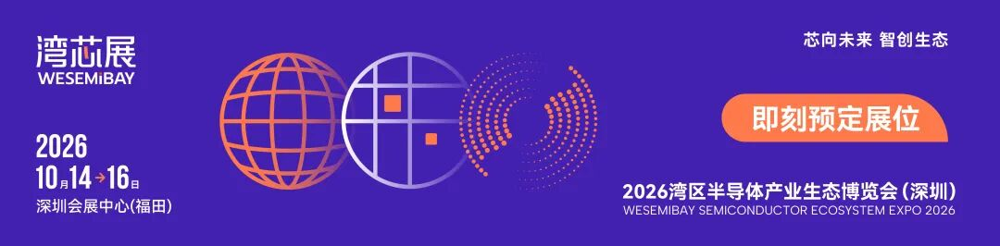
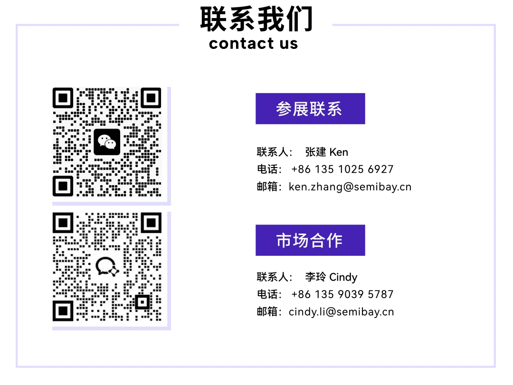

  

2026年2月，半导体与算力基建领域迎来多项关键突破，从新型存储架构的全球标准化推进，到AI服务器电源技术的量产提速，再到算力巨头的业绩与布局释放行业信号，AI产业从底层硬件到基础设施的技术升级与商业化落地全面提速，为AI推论时代的产业发展筑牢硬件根基。

存储架构新范式！SK海力士+闪迪联合推动HBF规格全球标准化

AI产业从模型训练迈入规模化推论阶段，对存储架构的高带宽、大容量、高能效三重需求形成刚性约束，传统HBM与SSD的单一架构已难以匹配产业需求。在此背景下，SK海力士与闪迪于加州正式启动高频宽快闪存储器（HBF）规格标准化联盟，两大巨头凭借在HBM先进封装、NAND闪存设计与量产的核心技术积淀，携手推动新一代复合存储解决方案的标准化与商业化落地，为AI推论场景打造专属存储架构。

作为介于HBM（高带宽存储器）与SSD（固态硬盘）之间的全新存储架构，HBF实现了带宽与容量的精准平衡：HBM凭借堆叠封装技术承担极致高频宽的数据处理需求，作为算力核心的“高速缓存”；HBF则承接大容量、中高带宽的资料存取任务，在整体存储架构中扮演高性能支援层角色，有效弥补了HBM容量拓展受限、SSD数据读写速率偏低的行业痛点。在AI推论的实际应用中，HBF可大幅提升AI算力系统的资源调度效率，在保障推论速度的同时降低系统总拥有成本（TCO），成为AI算力集群的关键配套存储方案。

本次联盟将在开放运算计划（OCP） 架构下成立专项工作小组，依托OCP的开源协作生态，推动HBF在接口定义、封装标准、协议规范等核心维度的全球统一，解决行业碎片化问题。业内分析认为，随着AI推论场景的持续落地，单一存储芯片的效能比拼已让位于CPU/GPU/存储的协同优化，能提供HBM+HBF整体存储解决方案的厂商将构筑核心竞争力，而包括HBF在内的复合式存储解决方案，预计将在2030年迎来需求的显著增长，成为存储市场的核心增量赛道。

电源技术再提速！台达电800V DC提前量产，AI电源与新能源双布局

AI算力集群的规模化建设，对电源基础设施的高功率、低损耗、高可靠性提出更高要求，电源巨头台达电在法说会上公布多项技术落地与产能布局进展，核心产品量产节奏大幅提前，成为AI算力基建的重要支撑。

台达电2025年经营业绩创历史新高，税后纯益首度突破600亿元，2026年公司成长核心仍聚焦AI数据中心领域，尽管全球AI基础设施推进受土地、水电、人力资源供给限制，短期或影响交货节奏，但客户需求仍保持正向，订单能见度明朗。在核心技术方面，台达电针对AI服务器打造的800V DC高压直流系统迎来关键突破，该产品搭配固态变压器（SST） 方案，通过电力变换架构的优化，可实现约30%的电力损耗降低，大幅提升AI数据中心的能源利用效率，原计划2027年放量的该产品，因客户导入节奏超预期，将提前至2026年下半年小量出货并贡献营收，同步开发的400V DC系统也已进入客户合作测试阶段，高压直流产品将在2027年迎来全面放量。

从营收结构来看，台达电目前AI相关业务中，液冷营收占比9%，电源营收占比逾20%，法人预估2026年公司AI营收比重将突破30%，成为核心营收支柱。产能布局上，台达电2026年资本支出将超460亿元，泰国新厂已正式投产，美国与重庆新厂持续建置，同时启动未来两年产能扩建评估；受电动车市况短期放缓影响，公司已将泰国部分EV产能弹性调整至电源产品线，保障AI电源产品的产能供给。

除AI电源外，台达电在新能源领域的布局也迎来落地节点，其研发的氢能燃料电池转换效率达65%，显著优于传统火力发电效率，目前已交由电厂客户进行实测，预计2026年底达到量产标准，2027年起正式贡献营收，重点布局欧美分散式微电网应用，实现AI电源与新能源业务的双轮驱动。

  
