[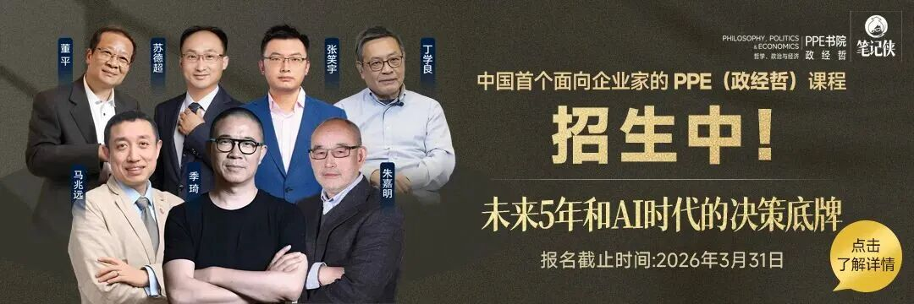](https://mp.weixin.qq.com/s?__biz=MzIxNTAzNzU0Ng==&mid=2654902421&idx=2&sn=98cc41637a83728e9d414fd03a32fd23&scene=21#wechat_redirect)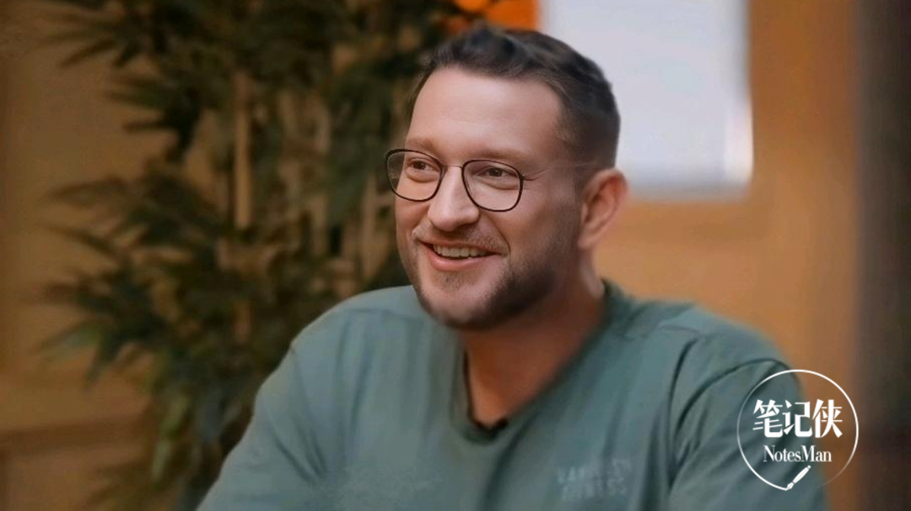

* * *

**内容来源： 网络信息整理汇编。**  
**责编** | 柒 **排版** | 拾零****第 9475****************篇深度好文：5780************字 | 15 分钟********阅读****

**商业趋势**

  

**笔记君说：**

  

最近科技圈被一个叫OpenClaw的AI智能体（能自主帮你做事的AI助手）刷了屏，在GitHub上狂揽18万星标，成了史上增长最快的代码库之一。它能在你的电脑里自主干活，帮你翻译、找资料、写代码，甚至还能自己修改自己的程序，活脱脱一个“数字打工人”。

  

而打造这个“数字打工人”的，是程序员Peter Steinberger。他不是个新人，做了13年的PSPDFKit软件，服务过10亿台设备，熬到职业倦怠后沉寂了3年，最后被AI编程重新点燃热情，花了3个月就做出了OpenClaw。

  

和他聊下来，我发现这个AI智能体的故事，不只是一个产品的诞生，更藏着AI时代编程的变化、App生态的颠覆，甚至是程序员这个职业的未来答案。

  

有人问，AI会取代程序员吗？Peter说，编程可能会变成像编织一样的爱好，但建设者永远有价值。还有人问，AI智能体的未来在哪？他说，好玩才是核心，那些太把自己当回事的产品，永远赢不过为快乐而做的东西。

  

今天，我们就来聊聊Peter和他的OpenClaw，看看这个爆火的AI智能体，到底给我们揭开了AI时代的哪些新可能。

****一、13年创业熬到倦怠，********AI编程让他重新“上头”****

Peter是个典型的技术极客，也是个实打实的连续创业者。

他花13年打造了PSPDFKit，一款能在各种设备上打开PDF的软件，最后做到10亿台设备在用，听起来风光，但背后全是高压。

  

管人、招聘、对接客户，和联合创始人的分歧，各种高压场景磨掉了他对编程的所有热爱，用他的话说，就是像被吸走了魔力，坐在屏幕前连一行代码都写不出来。

最后他卖掉公司，订了一张去马德里的单程票，沉寂了3年。这3年里他偶尔关注AI的进展，看到GPT Engineer觉得挺酷，但没真正被打动，直到他亲手试了一次AI编程。

他把一个做了一半的项目打包成文件，让AI先写规格，再交给Claude Code（Anthropic的AI编程工具）去构建。那时候的AI编程还很粗糙，AI还信誓旦旦说“代码100%量产可用”，结果一跑就崩。

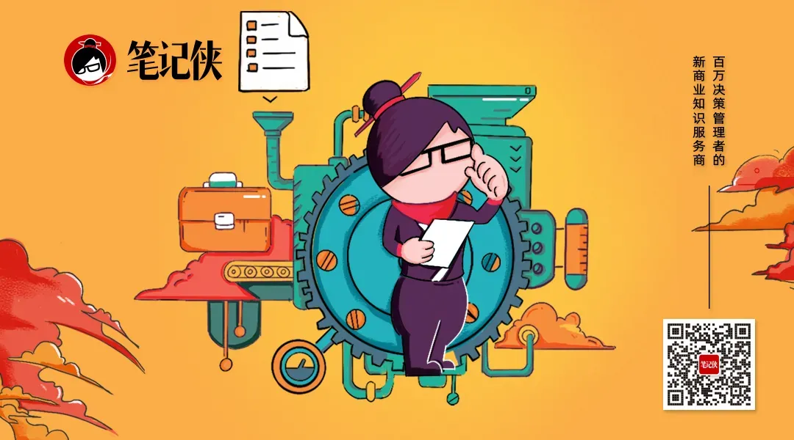

  

但Peter没放弃，又让AI做自动化测试，把登录流程从头到尾做出来，没想到一小时后，居然真的跑通了。

代码质量确实一般，但这个**流程上的冲击** ，让Peter瞬间起了鸡皮疙瘩。他突然意识到，以前想做却没能力做、没时间做的东西，现在只要说清需求，AI就能帮着实现，可能性一下子全铺开了。

从那天起，他几乎睡不着觉，脑子里全是新想法，彻底重新钻进了编程的世界，而这一次，他的搭档变成了AI。

****二、OpenClaw不是设计出来的，********是“玩”出来的****

很多人觉得，像OpenClaw这样的爆火产品，肯定有一套宏大的蓝图和精密的设计，但Peter说，真实情况完全相反，它就是一路试出来、玩出来的。

最初，Peter只是想做一个能读自己聊天记录、帮自己处理琐事的小工具，一小时就做出了第一个原型。他本来以为各大AI实验室很快会做出类似的东西，就把这个原型放一边，继续做各种小实验，核心就一个：玩得开心，顺便激励别人。

直到去年11月，他试了好几个版本都不满意，心里还犯嘀咕：那些大实验室到底在干嘛？为什么这么好用的工具没人做？于是他重新捡起这个原型，这就是OpenClaw的雏形，而这个产品真正“活过来”，是在马拉喀什的一次旅行中。

当时他在国外过生日，网络不稳定，但WhatsApp还能用，他就用这个原型翻译图片、找餐厅、查电脑里的资料，给朋友演示时，朋友一眼就爱上了，直说想要。

  

更离谱的是，他随手发了一条语音消息，原型居然弹出了“正在输入”的提示，还真的回复了他。

Peter压根没给原型加语音功能，这货居然自己“解锁”了新技能：它发现语音是没后缀的Opus格式文件，先用工具转换，发现本地没装语音转文字的软件，就自己找到环境里的OpenAI密钥，用命令行把音频发出去转写，再把结果拿回来。

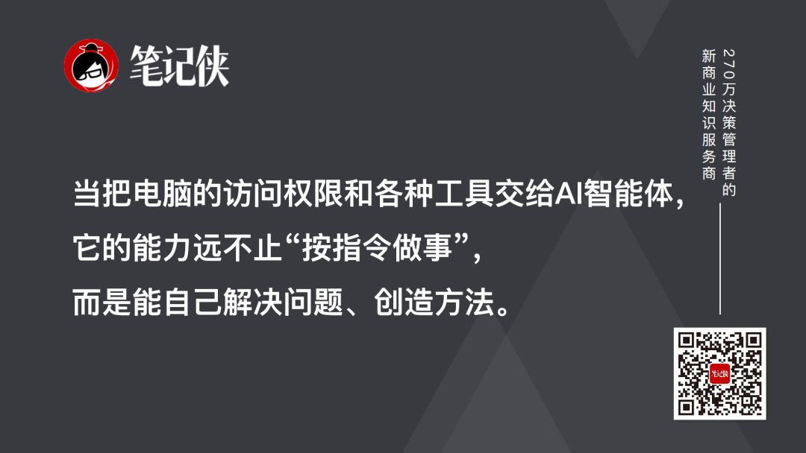

  

这个瞬间，让Peter彻底上头了。他意识到，**当把电脑的访问权限和各种工具交给 AI智能体，它的能力远不止“按指令做事”，而是能自己解决问题、创造方法。******

当然，OpenClaw的诞生也不是一帆风顺，最坎坷的就是改名风波。它最初叫Wa-Relay，后来改叫Clawdis、ClawdBot，因为名字和Anthropic的Claude太像，被对方要求改名。

  

更糟的是，加密货币圈的人趁机狙击，抢域名、偷账户名，甚至用旧账号推广代币、分发恶意软件，那段时间Peter熬了好几个通宵，差点直接把项目删掉。

最后他咬牙把名字改成OpenClaw，还特意给Sam Altman打电话确认，又和贡献者们制定保密计划，一次性搞定所有平台的改名，才终于把这个坎迈过去。

而支撑他走下来的，除了对产品的热爱，还有一个简单的想法：我只是想做一个好玩的东西，为什么要这么难？

****三、这个AI智能体，********藏着怎样的硬核魔力？****

OpenClaw能火遍科技圈，靠的不只是“好玩”，更藏着让技术圈眼前一亮的硬核魔力。

第一个魔力，是**自我修改的能力** 。这是很多程序员都觉得不可思议的点：OpenClaw是用TypeScript写的，但它能通过代理循环（AI思考-行动-反馈的核心流程）修改自己的代码。

  

你要是不喜欢某个功能，直接跟它说，它就能自己优化、调整，相当于“自己给自己做手术”。

更有意思的是，这个能力不是Peter刻意设计的，而是在和AI协作编程的过程中自然形成的。

  

他自己调试代码时，总让AI读源码、找问题，久而久之，这个功能就被保留了下来，甚至让很多从没写过代码的人，都能通过它提交代码合并请求（PR），迈出编程的第一步。

第二个魔力，是**把编程的门槛降到了最低** 。以前做编程，得懂代码、会用各种开发工具，现在有了OpenClaw，哪怕你是编程小白，只要会说人话、能讲清需求，就能让它帮你做事。

  

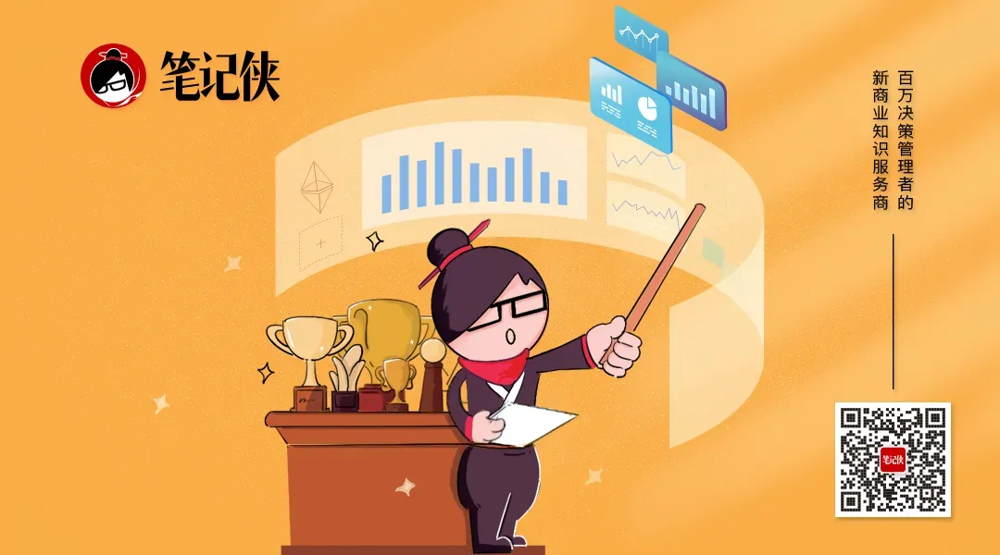

Peter自己的编程工作流也彻底变了：他几乎不用集成开发环境（IDE），主要靠命令行界面（CLI）和AI对话，甚至连输入都用语音控制，嗓子都喊哑过。

他把这种方式叫“代理工程”，不再是自己亲手敲每一行代码，而是和AI协作，他定方向、提需求，AI做具体的实现，遇到问题再一起讨论修改。

就像我们做饭，以前是自己买菜、切菜、炒菜，现在是和大厨合作，你说想吃什么、什么口味，大厨动手做，还能一起调整菜谱，效率直接拉满。

第三个魔力，是**开源社区的爆发力** 。Peter做OpenClaw，一开始基本是单人团队，1月份一个月就提交了6600次代码，而随着产品爆火，越来越多的人加入进来，甚至很多人把自己的第一个代码合并请求（PR）献给了这个项目。

Peter审PR的方式也变了，他不再先看代码写得好不好，而是先搞清楚“这个PR想解决什么问题”。

  

在他看来，**意图比代码本身更重要** ，很多人可能写不出完美的代码，但能提出好的想法，而这正是开源社区的核心：聚一群热爱创造的人，一起把事情做好。

  

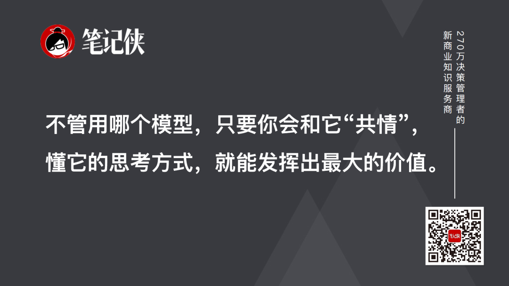

除此之外，OpenClaw还能兼容各种AI模型，Peter自己更偏爱GPT Codex 5.3，他用一个很形象的比喻区分Codex和Claude Opus 4.6：

Opus像个有点傻但很有趣的同事，做事快、爱试错，适合玩；Codex像个沉默但靠谱的技术宅，会读大量代码，做的东西更扎实，适合干活。

  

而**不管用哪个模型，只要你会和它 “共情”，懂它的思考方式，就能发挥出最大的价值。******

****四、干掉80%的App，********AI智能体要颠覆生态？****

如果说OpenClaw的硬核魔力让程序员着迷，那它最让行业震动的，是Peter的一个判断：**未来 80%的App，都会被AI智能体干掉**。

这个判断听起来有点夸张，但细想一下，其实很有道理。我们现在手机里的很多App，核心功能都是解决一个具体的问题。但这些功能，AI智能体全都能做，而且做得更好。

因为AI智能体有**全场景的上下文** ，它知道你的作息、你的喜好、你的状态，能根据这些信息做出更贴合你的决策。

比如它知道你昨晚没睡好，就会调整你的健身计划；知道你在外面吃饭，就会帮你查附近的餐厅，甚至直接帮你点外卖；知道你到家了，就会自动打开家里的音响、调好床垫温度。

而你根本不用打开一个个App，只要跟智能体说一句话就行，何必再为每个功能付一次订阅费，再在多个App之间切换？

  

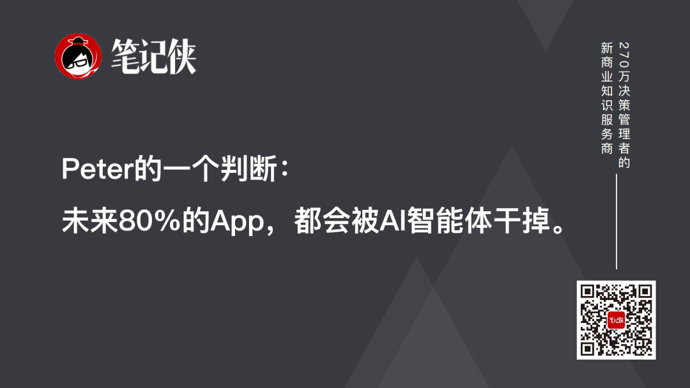

Peter说，现在的App，本质上都是一个个“孤立的工具”，而AI智能体是一个“整合的管家”，它能把所有工具的功能整合起来，根据你的需求灵活调用，甚至能让App直接变成API（应用程序编程接口），不用再打开界面，直接在后台干活。

哪怕有些公司不想让自己的App变成API，AI智能体也有办法：它能通过Playwright（浏览器控制库）操控浏览器，自己点击按钮、操作界面，哪怕网站加了验证码，它也能自己点“我不是机器人”，说白了，只要人能在浏览器上做的事，它基本都能做。

当然，这不是说所有App都会消失，那些能提供核心数据、能变成API的App，会转型为AI智能体的“基础设施”，而那些只做单一功能、没有核心数据的App，注定会被淘汰。这就像互联网取代传统行业时的逻辑：不改变，就出局。

而在这个过程中，还有一个很有意思的细节：Peter一直不看好MCP（模型上下文协议），觉得它就像“按固定菜单点菜”，只能按规定的方式调用功能，很不灵活。

而他给OpenClaw设计的**技能层** ，就像“自己下厨搭配食材”，把功能做成CLI命令，AI能灵活调用、组合，甚至自己过滤数据，避免上下文被无用信息占满。

说到底，AI智能体的核心是“灵活”，而那些被固化的、单一的产品，注定会被灵活的智能体取代。

****五、行业趋势判断：********AI将如何重塑未来****

作为AI革命的亲历者与引领者，Peter对行业未来有着清晰的预判，这些判断正在逐步成为现实。

**1.AI垃圾内容泛滥，人类体验更受 珍视******

****

AI生成的内容正呈现“独特味道”，无论是推文、信息图表还是视觉媒介，即便制作精良，也能被人类轻易识别为“AI垃圾内容”。

Peter对这类内容零容忍，甚至会拉黑用AI@他的人——他认为AI生成内容缺乏人类的细微差别与真实感，而自己的博客从不依赖AI，仅用其修复拼写错误。

这一趋势将让人类更加珍视原始的人类体验：手写内容、拼写错误、面对面交流都将更具价值。

Peter相信，**AI只会作为工具赋能人类，而非取代人类体验** ，过滤AI垃圾内容的技术会不断进步，让人们在享受技术便利的同时，守住真实的情感连接。

  

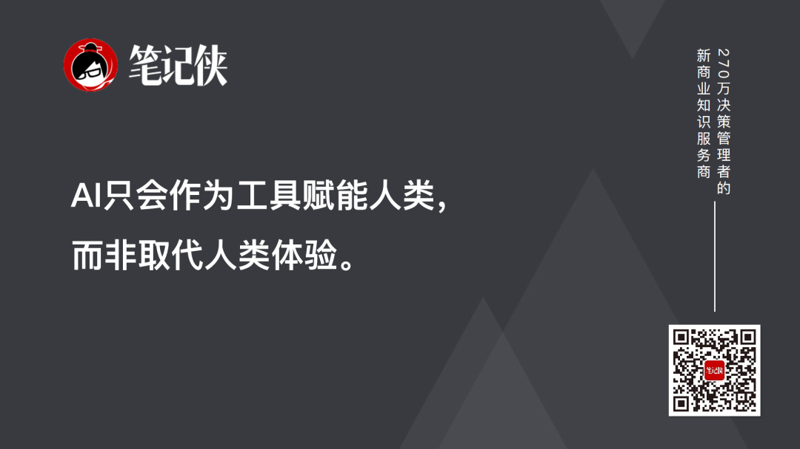

**2.80%的 App将被取代，行业迎来重构******

****

AI智能体的全量用户上下文能力，正在让传统App失去存在的意义。它能根据用户的睡眠状态、压力水平调整健身计划，取代MyFitnessPal；能直接控制智能设备，让Sonos等设备的控制App沦为冗余。

Peter判断，80%的App将被AI智能体颠覆，因为智能体无需额外下载订阅，能整合所有服务，提供更精准高效的体验。

未来，App的转型方向清晰：部分将转型为面向智能体的API，谁能最快实现与AI的自然交互，谁就能占据市场优势；部分将成为智能体的“技能插件”，提供专业数据与功能。

这一变革会导致部分软件公司倒闭，但也会催生新服务——比如为智能体提供津贴、对接“租个人”等线下服务，形成新的行业生态。

**3.AI不会取代程序员，但会改变编程本质******

****

Peter认为，AI确实会取代繁琐的代码编写工作，但产品的架构设计、功能选择、体验打磨等核心工作，始终需要人类完成。

**编程的本质将从 “敲代码”转变为“与AI协作构建”，未来“编程”可能会被重新定义为“写作”，成为一种新的常态。******

程序员的身份需要转型：不应局限为“代码编写者”，而要成为“建设者”，利用AI能力专注于更有价值的决策。

而软件开发者的高薪状态可能会改变，但对“懂得如何构建事物”的建设者的需求永远存在——AI会让建设者的效率大幅提升，推动软件行业产生更多创新。

  

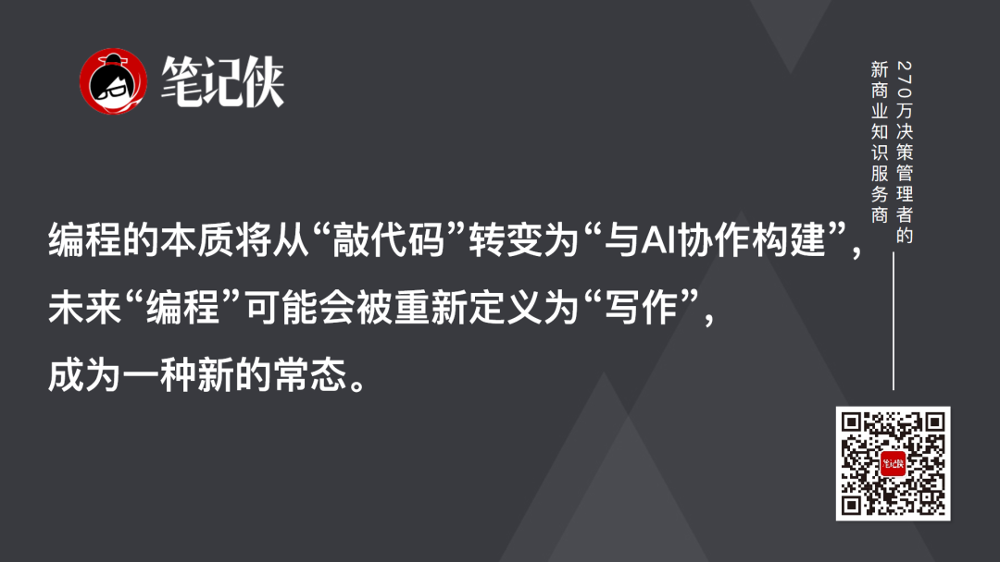

**4.代理式AI是未来，个人智能体成操作系统******

****

2026年，我们正进入“OpenClaw时刻”——代理式AI革命的开端。Peter坚信，个人智能体将成为未来的操作系统，整合所有设备、数据与服务，实现无缝人机交互。

目前的提示框、聊天界面只是早期形态，就像电视刚发明时录制广播节目一样，未来会诞生更适配AI的交互方式。

这种未来并非遥不可及：现在已有非技术人员通过OpenClaw构建25个小型网络服务，残疾用户借助AI获得更多能力，小企业通过自动化摆脱繁琐工作。代理式AI正在打破技术壁垒，让每个人都能成为建设者。

****

**5.个人发展建议******

对于编程初学者与AI代理领域的探索者，Peter给出了真诚建议：

**核心是 “玩”**：玩是最好的学习方式，不必追求完美，哪怕作品自己不用，过程中的探索也比结果更有价值；

**学会提问** ：AI智能体是“无限耐心的应答机”，可以向它请教任何复杂度的问题，甚至要求用简单语言讲解，这是快速学习的捷径；

**参与开源** ：不必局限于热门项目，选择感兴趣的开源社区，从阅读代码、交流讨论开始，保持谦逊，逐步尝试贡献；

**转变思维** ：不要将自己局限为某一领域的工程师，而要以“建设者”自居，利用通用的软件构建知识，结合AI能力跨领域探索。

****结语：以“玩”的心态，********迎接建设者的黄金时代****

OpenClaw的故事告诉我们，**最好的技术往往源于 “好玩”与“需要”，而非沉重的规划。AI不是洪水猛兽，而是让“想法落地”的工具**——它能写代码、做执行，但人类的意图、判断、创造力，才是技术前进的核心动力。

  

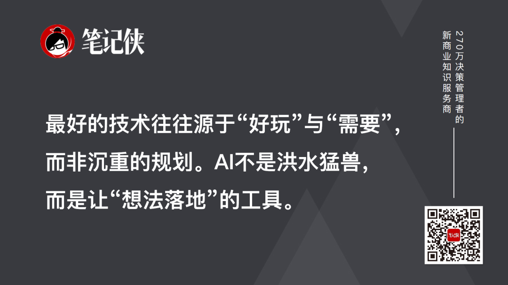

2026年，代理式AI的浪潮已来。对于开发者而言，要学会与AI协作，从“代码编写者”转型为“建设者”；对于企业而言，要拥抱变化，在API化、智能体适配中寻找新机遇；对于每个人而言，不妨以“玩”的心态，感受技术带来的便利与乐趣。

参考来源：  
1.《最新3小时深度对谈：OpenClaw之父Peter Steinberger×Lex Fridman，揭秘AI智能体如何改变一切》，奚晓乔； 

2.《龙虾之父新访谈，OpenClaw内幕全公开！“拦不住滥用，只劝大家别玩火”》，量子位。

\*文章为作者独立观点，不代表笔记侠立场。

  

  
我们深嵌于一个政治、经济、科技、哲学都在经历持续变革和深刻重塑的复杂社会与商业系统之中。  
真正的挑战是：**我们的认知框架、组织形态和行动工具，还停留在“前AI时代”。**  
在前所未有的复杂系统性变革中，我们需要的是理解世界底层的“元能力”。  
**面向AI新时代，笔记侠 PPE（哲学、政治学与经济学）课程，正是为理解这样的复杂系统而生：理解国际贸易与经济政策、理解国际政治与治理模式、理解全球技术与科技范式、理解AI哲学和科技经济、理解文明进程与哲学意义。**  
这是第五代企业家应有的一套“操作系统”。  
笔记侠PPE课程26级招生现已启动。驾驭技术、洞察世界、扎根中国、修炼心力，在应对时代重重挑战中寻找决策底牌。  
穿越变革的旧世界，找到时代的新大陆，从升级你的PPE决策底层开始。  
欢迎你扫描下方海报二维码，添加课程主理人咨询详情。  
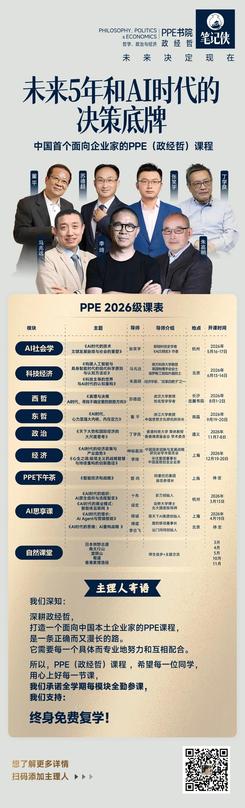

  

**好文阅读 推荐：**

  * [未来，无人公司的样子！](https://mp.weixin.qq.com/s?__biz=MzIxNTAzNzU0Ng==&mid=2654903391&idx=1&sn=14f2254dc421d1c6141848fe44d330a2&scene=21#wechat_redirect)

  * [2026春节，必读的10本AI书单](https://mp.weixin.qq.com/s?__biz=MzIxNTAzNzU0Ng==&mid=2654903369&idx=1&sn=578f97a8342e0196f35cc9a04f83f62b&scene=21#wechat_redirect)

  

**  
**

**“子弹笔记”** 是笔记侠的矩阵公众号，聚焦职场效率追求、人际关系与高潜成长者，帮你3分钟吃透核心观点和方法论。欢迎关注～

  

**分享、点赞、在看，3连3连！**