ACOS: Apple’s Geo-Distributed Object Store at Exabyte Scale

本文为 FAST'26 顶会论文，原文链接为 ACOS: Apple’s Geo-Distributed Object Store at Exabyte Scale - FAST 26\[1\]
    
    
    @article{baronacos,  
      title={ACOS: Apple’s Geo-Distributed Object Store at Exabyte Scale},  
      author={Baron, Benjamin and Bousquet, Aline and Metens, Eric and Pimpale, Swapnil and Puz, Nick and de Saint Sauveur, Marc and Muzumdar, Varsha and Ari, Vinay}  
    }

## 团子观点：ACOS 的关键设计与亮点

作为分布式存储方向（尤其是对象存储）的从业者，读这篇 ACOS 的动机很直接：苹果在单一大规模对象存储里把地理复制、纠删码和多年生产运维的一些经验，很多设计点和我们日常在做的冗余、扩展、成本权衡是同一类问题。下面从 “值得留意的设计” 和 “实际代价” 两方面做个简要梳理，方便读者带着问题读正文。

**双层编码与复制因子。** ACOS 的冗余是 “本地 + 区域” 两层：stamp 内用 \(20,2,2\) LRC 应对盘/节点/机架故障，区域间用按位 XOR 把对象切成 4 数据段 + 1 校验段分布在多区域（XOR-5）。这样整体复制因子从 1.0 的 2.40 压到 2.0 的 1.50，省了跨区域的全量复制。亮点可能不在于 XOR 本身多新颖，而在于和 LRC 组合后，在持久性模型（MTTDL）和可用性（降级/不可用时长）上有清晰的建模和参数表（见表 3），方便做编解码与布局的选型。区域层用 XOR 而不是更重的 RS，也符合 “跨域带宽贵、简单运算更可控” 的工程直觉。

另外，如果读者的方案需要计算**持久性** 这个数据，可以参考本文中的 “马尔科夫模型” 方法。

**统一端点与弹性扩展。** 1.0 的 store 是固定容量、独立生命周期，客户要自己管多端点、多凭证和跨 store 的迁移与均衡，扩容和下线都很重。2.0 改成统一 DNS 端点 + 多区域多 stamp，通过 stamp 权重和 rebalancer 做容量与负载均衡，新老 stamp 的上下线对客户透明。这对 “一个系统吃下多业务、持续加容量” 这种动态容量变化的互联网业务诉求是刚需；限流也拆成部署级和 stamp 级两层，和分段后的流量形态匹配。

**生产运维里的经验。** 论文里对「从 1.0 到 2.0」的迁移写得很真实：客户端与凭证迁移 → 对象异步迁移 → 校验 → 请求代理 → DNS 切换，艾字节级、无停机、对客户透明。但可惜的是，这部分没有详细展开。延迟方面，2.0 因对象被拆到多区域，GET 和 TTFB 会变差；用 DNS 地理路由、元数据非一致读 + 预取（一致读兜底）、以及段区域偏向（优先从 RTT 小的区域取段，宁可用 XOR 重建换掉跨大陆传输）以服务端和客户端延迟。负载均衡器成为瓶颈后，stamp 间流量绕过负载均衡器，由请求处理器自己做健康探测与连接管理，换来 p50/p90 延迟的明显下降。这部分都是非常易懂、实在的经验。

**需要接受的代价。** 2.0 的 GET 延迟和 TTFB 相对 1.0 仍会升高，约 50 ms 量级与跨区域 RTT 一致；元数据用非一致读做预取，要容忍极少量请求的元数据纠错与重试。单区域故障时依赖 XOR 重建，对延迟也有一定影响。整体上，这是一套在成本、持久性、可用性和延迟之间做了明确取舍的 geo 对象存储，论文把两代架构、生产数据和建模展开讲述了下。

这篇论文不算难懂，总体上还是符合分布式存储的典型模式的。对于刚刚接触分布式存储的朋友，尤其是琢磨架构的读者，适合按「设计目标 → 机制 → 评估」顺着读下去。

以下是论文全文翻译。

* * *

## 摘要

过去二十年间, 随着移动计算与互联网流媒体的兴起, 苹果的用户规模与服务种类显著扩大. 伴随这一增长, 数据存储的量与形态也持续攀升, 涵盖备份、个人照片与视频、音乐库、剧集与直播等. 本文介绍 ACOS \(Apple’s Object Store\) ——苹果面向用户与内部服务的对象存储系统, 旨在通过适配多样化的内容与访问模式满足特定需求. ACOS 已上线运行逾十年, 存储了数艾字节 \(exabyte\) 级对象, 每日处理数十亿请求. 凭借采用本地与区域两级复制机制的地理复制架构, ACOS 在成本、可扩展性、可用性与持久性方面表现优异. 本文基于生产环境部署评估其吞吐与延迟表现, 以及其对硬件与数据中心故障的韧性. 文中阐述 ACOS 的设计与演进, 评估其生产性能, 并展示其支撑苹果当前存储需求与未来扩展的能力.

## 1 引言

在苹果内部, iCloud 以及近年来的 Apple TV 等服务依赖一套健壮的存储基础设施. 全球数亿用户每日通过这些服务创建、分享与消费各类数字内容. 因此, 苹果需要一套地理分布式存储系统, 能够以高性价比、可扩展的方式管理对象.

存储与提供这些对象面临独特挑战. 其一, 系统需高效应对对象尺寸的极大差异——从数十 KB 的小型元数据与缩略图到数 GB 的大视频. 其二, 用户基数的增长带来存储量与请求速率的持续上升; 这种快速增长要求系统具备可扩展性, 能够以较小开销平滑增加容量与吞吐, 且不出现性能退化或成本失控. 其三, 用户期望数据安全且随时可访问, 系统须具备高安全性、高持久性与高可用性.

需要存储海量对象的企业通常依赖大规模对象存储系统 \[3\]\[6\]\[9\]\[10\]\[16\]\[28\]\[29\]. 为保证数据可用性与持久性, 这类系统广泛采用多种数据复制机制, 包括完整对象复制以及 Reed-Solomon、本地重构码 \(Local Reconstruction Codes, LRC\) 等纠删码方案. 多数对象存储部署在单一区域, 部分大型企业则采用跨多区域的地理复制 \[9\]\[13\]\[28\]\[29\], 以提升可用性与持久性.

本文描述苹果生产对象存储系统 ACOS 两个连续版本的设计与实现; 该系统已运行十余年, 管理多艾字节数据并处理每日数十亿请求. ACOS 支持多种数据类型, 包括用户生成的照片与视频以及用于分析的内部分析数据集. 系统设计围绕三个主要目标： \(i\) 保证高可用性与数据持久性, 以维持不间断的数据访问并抵御多种故障场景; \(ii\) 优化成本效益, 在维持较低运营开销的前提下经济地管理海量数据; \(iii\) 提供可扩展性, 以透明方式应对存储需求与流量需求的持续增长.

ACOS 1.0 奠定了地理复制架构的基础, 通过本地与区域两级复制机制保障所存对象的可用性与持久性. 本地复制采用分布式 \(12, 2, 2\) LRC \[16\] \(近期改为 \(20, 2, 2\) LRC\) , 以应对数据中心内的磁盘、主机与机架故障; 区域复制采用完整对象复制以应对数据中心级故障. ACOS 2.0 则通过引入 XOR 编码 \(一种比完整对象复制更省存储的复制方案\) 增强区域复制, 使整体复制因子 \(replication factor\) 降至 1.5. 凭借统一部署架构, ACOS 2.0 可透明扩展至多艾字节容量, 支撑苹果服务的持续增长. 本文的贡献包括：

  * • **两代 ACOS 的设计** ：具备高性价比双层编码 \(本地 LRC 与区域 XOR 校验\) 的艾字节级地理分布式对象存储.
  * • **十余年生产部署后的评估** ：包括两代系统在延迟、持久性与可用性机制等方面的性能对比.
  * • **在两代之间无缝迁移数据、优化延迟以及大规模运营对象存储的经验与教训.**

全文结构如下. 第 2 节介绍苹果的各类工作负载. 第 3、4 节分别描述 ACOS 的连续设计与实现. 第 5 节从请求延迟、持久性与可用性机制等方面对比 1.0 与 2.0 的性能, 说明 ACOS 达成设计目标的情况. 第 6 节讨论延迟优化、两代 ACOS 间的迁移以及可用性/持久性与成本的权衡. 第 7 节为相关工作, 第 8 节为结论.

## 2 工作负载

苹果的终端用户使用 iCloud、Apple Maps、Apple TV、Apple Music 等多种服务, 存储需求各异. 例如, 用户可能在 iCloud 中存储照片或流式观看 Apple TV 剧集. 这些不同用例构成 ACOS 的工作负载; ACOS 直接或间接为终端用户以及内部平台或服务提供内容.

ACOS 部署于苹果的数据中心, 是云服务生态的一部分, 负责存储内容并向终端用户分发, 如图 1 所示. ACOS 本身不提供缓存机制; 部分请求 \(如下载对象\) 可能经由内容分发网络 \(Content Delivery Network, CDN\) , 因而仅与 ACOS 间接交互; 其他请求 \(如上传对象, 例如照片\) 则直接与 ACOS 交互. 此外, 部分接入点 \(Points of Presence, PoP\) 可能与 ACOS 交互, 以在靠近用户处处理并提供对延迟敏感的内容 \(如视频转码\) .

作为多租户系统, ACOS 旨在同时满足面向用户与内部工作负载的多样化需求, 二者均要求高可用性与持久性. 各工作负载在对象大小分布及上传 \(字节\) 、下载 \(字节\) 、删除 \(操作\) 等访问模式上各有特点, 表 1 做了汇总.

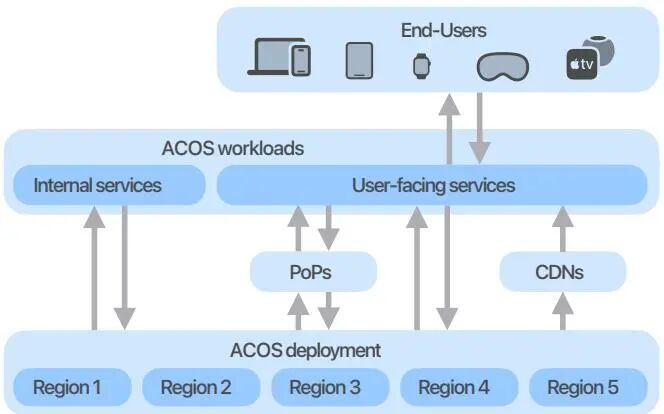图1：终端用户通过苹果设备或浏览器访问使用 ACOS 的服务, 可直接在数据中心访问, 或通过接入点 \(PoP\) 或内容分发网络 \(CDN\) 间接访问.  
| 吞吐占比  
---|---  
  
| GET| PUT| DELETE  
iCloud| 52.0%| 27.0%| 81.0%  
媒体服务| 11.0%| 6.0%| 1.0%  
Maps| 20.0%| 5.0%| 1.0%  
其他| 17.0%| 62.0%| 17.0%  
表1：各工作负载对操作类型的相对贡献.

iCloud 是 ACOS 的核心工作负载之一, 需存储大量终端用户内容, 包括照片、视频、邮件与设备备份 \[38\]. 吞吐与延迟需求因内容类型而异. 例如, 设备备份在设备上异步处理, 对吞吐与延迟要求较低; 照片尤其是视频则要求更高吞吐与更低延迟. 访问模式呈日周期变化, 并随季节波动, 在节假日等时段各类内容均会出现峰值. 除这些时段外, 照片与视频在刚存储时下载与删除率较高, 而备份的下载频率较低.

Apple Music、Apple TV 等媒体服务通常存储数 GB 或更大的大文件, 需拆分为多段以实现高效并发上传与存储. 媒体服务产生的存储内容只增不减, 随新媒体文件加入而增长; 内容几乎不删除, 且读取频率低, 因服务通过 CDN 缓存内容以降低用户端延迟.

Apple Maps 则涵盖地图与 3D 视图、分析工作负载等多种内容, 访问模式各异. 地图与 3D 视图由 CDN 提供, 因此下载频率低、几乎不删除; 分析工作负载则频繁删除与下载.

其他内部工作负载从分析任务到长期存储不一而足, 访问模式差异很大. 苹果内部对象存储源于在同一数据中心内低延迟存储大量战略数据的需求, 涵盖法务文档、制造数据以及包括图片缩略图在内的媒体数据. 这一初始需求推动了第 3 节所述的 ACOS 1.0 设计. 近年来, 为支撑苹果云服务规模增长而带来的存储容量扩张, 则催生了第 4 节所述的 ACOS 2.0——一套统一且高性价比的方案.

## 3 ACOS 1.0

ACOS 1.0 是苹果高可用、高持久对象存储的首个版本, 于 2013 年部署. 其向内部服务提供与 AWS S3 兼容的 API. 存储系统在成对、地理隔离的两个区域以双活 \(active-active\) 配置运行, 任一区域均可接收来自客户端应用的读、写请求. 系统将对象以静态加密 \(encrypted-at-rest\) 的数据块形式存储在磁盘上, 并分布在存储层的众多节点之间.

### 3.1 存储概览

一个 store \(存储单元\) 由位于不同地理区域的两个 stamp \(图章\) 组成; 每个 stamp 是部署在单个数据中心内的独立存储服务. 一个 store 对外暴露唯一端点供客户端存取数据. 每个 stamp 由若干机架组成, 机架上部署计算主机与存储主机. 计算主机运行 ACOS 1.0 的各类应用, 包括请求处理器 \(request handler\) 、协调器 \(coordinator\) 、限流器 \(rate limiter\) 与负载均衡器. 存储主机运行存储层, 并连接 JBOD \(Just a Bunch of Disks\) . 图 2 给出一个 stamp 的布局及主要组件.

不同 DNS 端点可指向单个 stamp 或两个 stamp. DNS 负载均衡将客户端请求分发到负载均衡器. 负载均衡器对外暴露公网 IP, 将流量均匀分配到该 stamp 内所有请求处理器. 每个负载均衡器在将请求转发给请求处理器之前充当公网 TLS 终结点; 因此无法使用直接服务器返回 \(Direct Server Return, DSR\) , 响应必须经负载均衡器返回.

请求处理器是无状态服务, 接受 AWS S3 API 的一个子集 \[1\], 负责校验和计算、加解密; 根据认证系统校验请求签名, 并根据限流应用校验客户端配额. 限流器是分布式服务, 通过实施按客户端速率限制保护 stamp 内各组件.

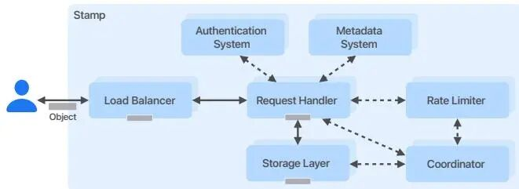图2：ACOS 中 stamp 的布局.

请求处理器与存储层相连, 用于存储与读取客户端对象. 存储层负责向磁盘读写数据, 并通过纠删码提供 stamp 内复制. 协调器应用负责数据放置、检测存储层中的不健康节点, 以及发起并管理修复与垃圾回收. 元数据系统持久化对象元数据, 包括对象在存储层节点中的位置、复制状态以及客户端应用特定信息; 其底层采用 Apache Cassandra \[39\].

ACOS 1.0 各应用间连接均使用 TLS 加密, 各应用维护到其他应用的连接池, 从而避免重复建连并减少带来高 CPU 开销与额外网络延迟的 TLS 握手次数.

### 3.2 存储层

存储层提供有状态、持久化数据存储, 部署在专用存储主机上; 每台主机挂载由多块 HDD 组成的 JBOD.

对象以数据块形式存储在容器 \(container\) 中, 并附带部分元数据与校验和. 对象由客户端应用标识、桶 \(bucket\) 与路径唯一标识. 客户端可一次性上传单个对象, 也可将对象分片后逐片上传 \(多段上传\) . 请求处理器可处理任意大小的对象 \(包括超过单个容器容量的对象\) , 并透明地将其切分为固定大小的段. ¹ 这些段随后存入容器, 从而对客户端隐藏底层存储机制.

¹实践中我们将最大段大小设为 64 MiB.

容器是大型文件 \(约 4～32 GiB\) , 内含多个对象. 容器按簇 \(cluster\) 组织, 如图 3 所示. 簇内每个容器初始为五副本复制 \(图 3a\) . 客户端 PUT 写入的对象先写入复制簇, 直至达到容量后进入密封 \(sealing\) 流程. 密封流程删除数据容器的副本并生成校验容器, 形成密封簇 \(图 3b\) , 采用本地重构码 \(LRC\) 纠删码 \[16\]. \(12, 2, 2\) LRC 为 12 个数据容器 \(分为两 stripe, 每 stripe 六个数据容器\) 生成两个本地校验与两个全局校验容器. 密封后, 簇内所有容器对写操作不可变. 对含有已删除对象的复制簇也会进行密封, 以覆盖删除宽限期. 作为 stamp 内复制机制, \(12, 2, 2\) LRC 编解码器可在约 86.15% 的情况下从每簇四个容器故障中恢复, 其余情况下可从三个故障恢复. ACOS 1.0 最初采用 \(12, 2, 2\) LRC 作为 stamp 内复制布局; 为进一步降低复制因子, 后续引入了 \(20, 2, 2\) LRC 存储新对象.

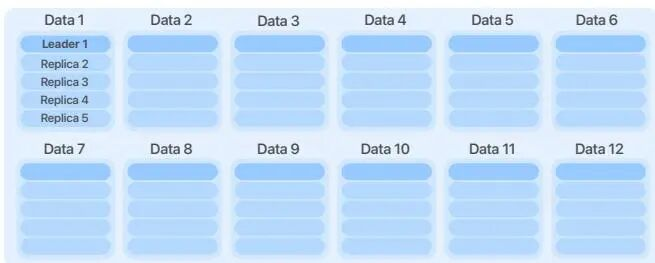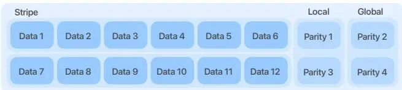图3：ACOS 中 \(12, 2, 2\) LRC 编解码的容器簇布局.

接收客户端请求的请求处理器以 256 KiB 的数据块将对象流式写入复制容器. 复制容器采用基于 ZAB \[34\] 的自研分布式事务日志进行数据流传输, 但使用 Raft \[30\] 进行领导者选举, 并针对对象存储做了优化： \(i\) 对多块对象尽量减少刷盘; \(ii\) 跟踪部分写入后中止的对象. 领导者副本从请求处理器接收数据块并写入自身的事务日志文件, 同时将块转发给其余四个副本; 各副本将事务日志文件刷盘. 一旦达到法定数量 \(quorum\) 的副本存满完整对象, 领导者通知请求处理器, 请求处理器在完成请求前写入包含对象位置的元数据.

### 3.3 容器生命周期

协调器应用负责簇的完整生命周期：从创建与磁盘放置, 到垃圾回收与数据修复.

**放置 \(Placement\) .** 协调器运行放置流程, 持续创建复制容器簇作为对象写入目标. 该流程维持稳定的可写簇数量, 以匹配写入速率. 为最大化可用性与持久性, 放置流程考虑故障域, 将同一簇的容器分布在不同磁盘、主机与机架上, 从而降低硬件故障影响. 为最大化磁盘吞吐, 放置流程保证容器在所有磁盘上均匀分布.

**压缩 \(Compaction\) .** 收到删除请求后, 请求处理器在对象元数据中设置逻辑删除标记 \(tombstone\) ; 超过对象的宽限期后, 对象视为已删除. 随着对象被删除, 协调器运行垃圾回收流程——压缩 \(compaction\) ——以回收空间. 协调器定期识别待压缩的簇、按已删除数据量排序, 并优先调度已删除数据最多的簇进行压缩; 随后由存储应用执行压缩. 存储应用将容器重写为新文件, 跳过已删除对象; 完成后使用 LRC 纠删码重新计算校验容器, 与密封流程类似.

**修复 \(Repair\) .** 在簇的整个生命周期中, 存储层磁盘会发生故障, 带来数据持久性风险. 为缓解该风险, 簇会经历与密封类似的修复流程, 在另一块磁盘上重建缺失的容器数据. 容器故障主要有两类原因： \(i\) 硬件故障; \(ii\) 数据损坏.

硬件故障修复在磁盘、主机或机架宕机时触发. 各进程定期响应协调器的健康检查. 存储应用检测到故障后, 协调器在 30 分钟宽限期后触发修复, 以避免因主机重启、软件发布等短暂故障导致不必要的修复.

数据损坏修复对应磁盘故障, 通常由磁盘年化故障率 \(Annual Failure Rate, AFR\) 刻画. 系统中有多种周期性持久性机制用于检测磁盘上的数据损坏： \(1\) 异步进程扫描所有元数据, 并根据元数据中存储的对象校验和验证完整对象完整性; \(2\) 存储应用上的另一进程扫描磁盘上的每个容器并验证段校验和. 一旦检测到磁盘故障, 立即修复对应容器.

### 3.4 数据可用性

每个 ACOS 1.0 store 依赖两个 stamp 提供数据冗余, 以提升客户端数据的可用性与持久性. 为在单个 stamp 故障时保证数据可用, 各 stamp 的存储应用持续将已存客户端数据异步复制到另一 stamp. 该异步流程会扫描磁盘上所有已存容器, 并将所有待复制对象写入另一 stamp; 对象复制完成后, 存储应用更新其元数据中的复制对象位置. 该复制机制使得我们可以通过将 stamp 设为故障转移 \(failover\) 状态进行 stamp 级维护：处于故障转移时, 该 stamp 将所有客户端请求代理到另一 stamp, 从而保证数据持续可用.

处理客户端 GET 的请求处理器同时利用 stamp 内 LRC 复制与 stamp 间异步复制. 请求处理器首先尝试从容器读取数据; 若失败或超时, 则执行降级读 \(degraded read\) ：依次尝试从不同数据源读取. 先尝试从本地、再从全局 LRC 校验解码对象数据; 最后才回退到从另一 stamp 读取, 成功则返回对象, 失败则返回错误. 每启动一个潜在数据源时, 已有源继续运行, 一旦任一源得到对象数据即流式返回给客户端.

### 3.5 局限

尽管 ACOS 1.0 已在生产环境运行十年, 其可扩展性仍受若干因素制约：存储成本高、store 生命周期复杂难管、元数据系统难以同时提供强一致性与高性能.

**高存储成本.** ACOS 1.0 将跨 stamp 完整复制与 \(20, 2, 2\) LRC 编解码结合, 整体复制因子为 2.40. 若在苹果基础设施上、在不同地理区域的多个数据中心采用更高效的编码方案, 可进一步降低复制因子.

**Store 生命周期.** 每个 store 具有固定、隔离的存储容量, 客户端资源可能跨多个 store, 导致客户端需管理多个端点、凭证、容量预留与配额, 负担较重. 下线老旧 store 需要对每个对象迁移到另一 store, 流程缓慢且复杂, 包含大量繁琐的配置与校验步骤.

**全局可扩展性.** ACOS 1.0 使用的元数据系统存在热点、LIST 操作性能、缺乏操作谓词与跨 stamp 一致性等限制, 难以将 ACOS 扩展为跨多数据中心的统一数据存储系统.

## 4 ACOS 2.0

ACOS 2.0 是 ACOS 1.0 的演进版本. 其提供统一端点、减轻运营负担, 并通过将数据复制因子从 2.40 降至 1.50 降低每字节存储成本. 凭借可扩展设计, ACOS 2.0 可对客户端应用透明地增加存储容量与吞吐. 表 2 与图 4 概括了 ACOS 1.0 与 2.0 的主要差异.

ACOS 2.0 保留第 3 节所述的 stamp 结构, 并扩展为多区域部署架构. 在当前生产部署中, ACOS 2.0 横跨五个区域, 靠近客户端工作负载. 一个区域 \(region\) 即部署在同一数据中心内的一组 stamp; 单个 stamp 可存储约 500 PiB 原始数据.

  
| ACOS 1.0| ACOS 2.0  
---|---|---  
架构| 双区域| 多区域  
区域内冗余| \(20, 2, 2\) LRC| \(20, 2, 2\) LRC  
区域间冗余| 2× 复制| 按位 XOR-5  
整体复制因子| 2.40| 1.50  
元数据系统| 双 Cassandra| ClassVI  
可扩展性| 按 store| 弹性  
端点| 按 store| 统一  
TTFB| 较低| 较高  
表2：ACOS 1.0 与 2.0 对比.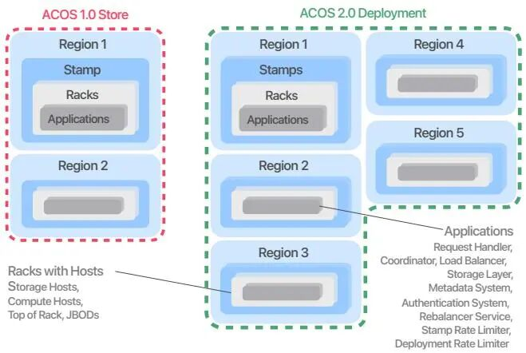图4：ACOS 1.0 的双区域单 stamp store \(左\) 与 ACOS 2.0 的五区域、每区域多 stamp 的多区域部署 \(右\) .

### 4.1 跨区域分段

与在 store 内两个 stamp 间完整复制数据的 ACOS 1.0 不同, ACOS 2.0 将所有对象切分为四段连续等长数据段, 并对所有数据段做按位 XOR 运算得到一段校验段. 该操作使得客户端处理器 \(client handler\) 可从其余四段再生任一段 \(含校验段\) 的任意部分. 这种对象分段使复制因子为 1.5, 并在单区域故障时保证高可用, 代价是 TTFB \(首字节时间\) 升高. 复制因子的计算详见第 4.3 节.

如图 5 所示, 客户端处理器将 PUT 请求的入站对象切分为数据段与校验段, 并分发到部署各区域的区域段处理器 \(segment handler\) . 每个 PUT 请求 \(含分块编码请求\) 必须在头部提供对象长度, 以便在分段前确定每段大小. 接收方段处理器将本段交给存储层存入复制容器.

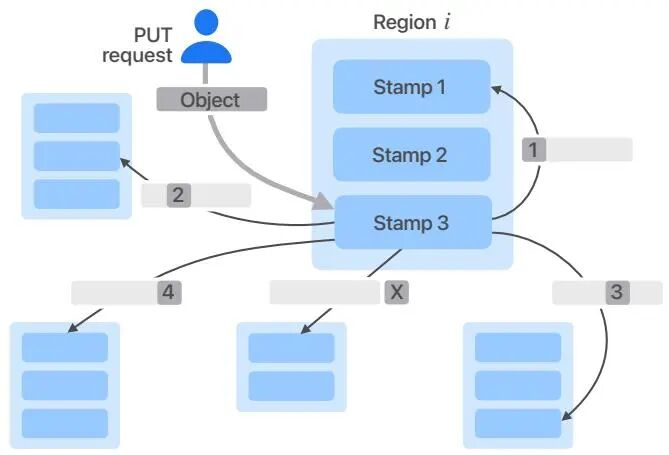图5：ACOS 2.0 的 PUT 请求. 当 stamp 3 的客户端处理器收到客户端的 PUT 请求后, 将完整对象切分为四段等长数据段, 并计算额外段 X, 满足 $x\_\{\tt X\} = x\_1 \oplus x\_2 \oplus x\_3 \oplus x\_4$.

对多段对象, ACOS 2.0 将每个 part 视为完全独立的对象, 与 ACOS 1.0 一致; ACOS 2.0 对每个 part 再分段. 提交 \(commit\) 操作生成的元数据包含所有关联 part 的段位置.

客户端处理器通过拉取全部四个数据段完成完整对象的 GET 请求. 若某段暂时不可用, 客户端处理器使用校验段与其余数据段重建该段, 从而在部分部署不可用时仍可完成 GET 请求.

对对象的范围读取 \(partial read GET\) , 客户端处理器首先尝试读取对应请求范围的数据段. 例如, 100 字节对象的每段为 25 字节, 分布在五个区域; 若客户端请求该对象前 10 字节, 客户端处理器仅拉取第一数据段的前 10 字节. 若该段不可用, 则拉取其余各段的前 10 字节以重建请求范围.

### 4.2 一致元数据系统

将段分布到多区域需要一套能保证跨区域强一致性的元数据系统. 当客户端的 PUT 请求进入区域 A 时, 在其他任意区域处理客户端 GET 的客户端处理器必须能立即访问到该元数据.

ClassVI 是我们自研的元数据系统名称, 类似为 ACOS 2.0 提供支撑的 BigTable \[5\]. 其本地存储引擎采用 RocksDB \[25\], 部署在与 ACOS 2.0 相同的区域; 每个区域包含元数据副本, 以与用户数据相同的持久性保证提供低延迟元数据访问.

ClassVI 不提供多行分布式事务保证, 但通过 Raft 共识算法对所有行级读写保持强一致性. 为降低延迟, ClassVI 允许读操作仅针对本区域单一副本执行; 该性能优化会带来单副本读取的最终一致性权衡.

当客户端 PUT 请求的所有段均写入后, 客户端处理器将包含所有段位置的对象元数据写入 ClassVI. 段位置包含在磁盘上定位所存数据所需的全部信息, 如簇标识、容器索引及对象在容器内的偏移.

客户端处理器收到客户端 GET 请求时, 从 ClassVI 读取对象元数据, 将其中各段位置发给段处理器, 根据可用性拉取所需段.

### 4.3 高可用系统

ACOS 1.0 为客户端 GET 提供强可用性：可承受 stamp 内每容器簇最多四个节点故障, 甚至单区域完全故障, 通过 stamp 内降级读与跨区域副本等机制实现. 如第 3 节所述, 这些机制对应复制因子 2.40.

ACOS 2.0 在单区域故障时仍可通过校验段完成客户端的 GET 与 PUT 请求. 若两个或更多区域不可用, 则无法完成需要这些不可用段的 PUT 或 GET, 客户端处理器会向客户端返回错误. 在此降级模式下, 仅涉及元数据系统的请求仍可由客户端处理器处理, 因其不需要在存储层存取任何客户端数据.

当某数据段不可用时, 客户端处理器可通过 XOR 运算完成 GET：从剩余四段 \(三个数据段与一个校验段\) 拉取并重建缺失数据段.

对于 PUT 请求, 客户端处理器向所有目标区域发送段请求; 只要五段中至少四段写入成功即认为请求成功. 客户端处理器仍会尽最大努力在本次 PUT 中写入最后一段, 若成功则更新对象元数据中的段位置.

各存储应用有一个异步进程遍历容器, 识别缺段的对象. 该进程 \(i\) 从元数据系统读取对象的可用段位置; \(ii\) 拉取这些段的数据; \(iii\) 用 XOR 运算再生缺失段数据; \(iv\) 将生成的段写入远程区域. 为减少拉取段的开销, 该进程仅在五个区域中的两个上运行, 以保证至少存在一个段. 为进一步降低该异步复制开销, 客户端处理器在处理 PUT 时总是尝试写入全部段; 若某段写入过慢 \(如目标存储主机网络或磁盘异常\) , 客户端处理器会先完成请求, 由复制进程异步再生剩余段.

### 4.4 多租户可扩展设计

在 ACOS 1.0 中, 当大客户应用需要超越单 store 容量扩展时, 不得不向多个 store 申请容量. 客户需面对多端点、多凭证、多套限流, 数据管理 \(如在 store 间均衡、迁移、复制\) 也由客户自行负责, 成为主要痛点.

ACOS 2.0 的重要改进之一是统一端点——存储与读取数据的唯一入口. 该端点对应一条 DNS 记录, 解析为部署内负载均衡器的公网 IP. 我们的内部权威 DNS 服务器动态计算负载均衡器 IP, 以最小化客户端与负载均衡器间的网络延迟. 例如, 若客户端从区域 A 向 ACOS 2.0 发送请求, 权威 DNS 将返回区域 A 内某负载均衡器的 IP. 我们通过向主端点的 DNS 记录增删负载均衡器 IP 的 A 记录, 反映部署变更 \(如增删 stamp\) .

随着部署的可扩展性, 每区域 stamp 数量在部署生命周期内逐渐增加; 因此最老的 stamp 会先于最新 stamp 被数据填满. ACOS 2.0 提供多种机制在各 stamp 间均衡数据, 以实现磁盘 IOPS 与占用空间上的均匀资源使用.

在客户端 PUT 时选择 stamp 时, 客户端处理器使用权重决定每段的目标 stamp. 各 stamp 上有一异步周期任务计算可用磁盘容量并上报协调器; 独立服务汇总磁盘容量信息并推导各区域各 stamp 的权重.

除 stamp 权重外, ACOS 2.0 还使用再均衡服务 \(rebalancer\) 在区域内跨 stamp 迁移已有数据. 再均衡器以文件级拷贝方式将密封的数据与校验容器发送到目标 stamp 的目标存储节点. 该方式避免容器密封时的事务日志写盘 I/O 与纠删码 CPU 开销, 是跨 stamp 迁移数据最快、I/O 最省的方式. 无论是新上线还是下线 stamp, 都需要再均衡：可将老 stamp 的数据迁至新 stamp, 清空老 stamp 或释放容量, 以均衡请求与存储负载.

ACOS 2.0 的限流器采用新架构, 包含两个限流服务： \(i\) 部署级——在对象分段前; \(ii\) stamp 级——在对象分段后. 二者与第 3.1 节所述 ACOS 1.0 的限流应用类似. 部署级限流器通过在各 stamp 部署实例、执行预定义的客户端应用限流, 保护整个部署免受流量激增影响. stamp 级限流器通过限制客户端与内部流量 \(含客户端请求与异步段复制\) 保护各 stamp 的存储资源.

## 5 生产结果

本节通过一系列测量评估两个在线生产系统 ACOS 1.0 与 ACOS 2.0 的性能. 因二者均为地理复制系统, 评估重点是比较关键性能指标：请求延迟、持久性及可用性机制. 我们在一个月内从全部主机采集实时流量数据, 以大量真实工作负载保证结果的统计显著性.

### 5.1 请求延迟

评估使用两个服务端请求指标.

  * • **首字节时间 \(Time to First Byte, TTFB\)** ：从收到客户端 GET 请求到向客户端发送响应第一个字节的时间, 包含元数据操作延迟、在磁盘上读取首字节的时间以及传输首字节的网络时间.
  * • **完整对象延迟 \(Full object latency\)** ：从收到客户端请求到向客户端发送响应最后一个字节的时间, 包含元数据操作延迟、在磁盘上读写数据的时间以及传输数据的网络时间.

指标在服务端测量, 但客户端在接收数据或与客户端处理器间传输响应时可能显著影响完整对象请求延迟. 我们测量客户端 GET 的 TTFB, 因该指标与对象大小及客户端与我们的出口网络吞吐限制无关.

由于从 ACOS 1.0 向 ACOS 2.0 迁移, 主要工作负载已迁至 ACOS 2.0, 这解释了两个系统间客户端应用数据的一些差异. 图 6a 给出了 ACOS 1.0 与 ACOS 2.0 中 PUT 与 GET 请求对象大小 \(字节\) 的累积分布函数 \(CDF\) . 图 6 还给出了两系统请求延迟与 TTFB 的对比. 图 6b 显示两系统 GET 的 TTFB 相近, ACOS 2.0 略高. 差异主要来自 ACOS 2.0 中对象段的分布式特性：根据客户端位置与请求范围, 可能需先拉取远程段才能返回 GET 的首字节. 在 ACOS 2.0 中, 99.99995% 的请求仅需非一致读即可获取元数据, 与 ACOS 1.0 无延迟差异. 第 6.2 节将进一步介绍包括元数据预取在内的延迟优化.

图 6c、6d 比较了 ACOS 1.0 与 ACOS 2.0 在两种典型对象大小 \(1 MiB 与 10 MiB\) 下的完整对象 GET 与 PUT 延迟. PUT 对象请求的延迟在两系统间相近, 因两系统中客户端处理器均将客户端数据直接流式写入复制容器; ACOS 2.0 中服务端对客户端数据的缓冲使客户端处理器可并行发送 PUT 段请求. 反之, ACOS 2.0 的 GET 延迟更高, 因为需要从远程区域拉取全部段数据; 两系统约 50 ms 的延迟差与两区域间的平均网络延迟一致.

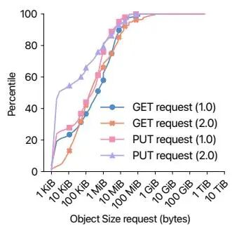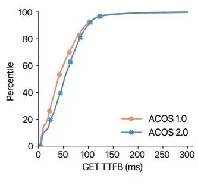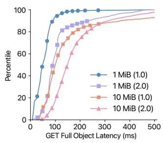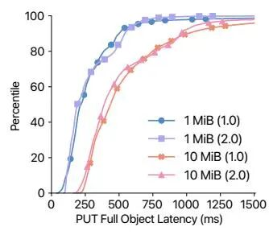图6：第 6.2 节所述延迟优化后的关键延迟性能指标.

### 5.2 持久性与可用性

图 7 测量了 ACOS 1.0 与 ACOS 2.0 在不同可用性与持久性机制下的表现及其对 GET 请求延迟的影响.

在 ACOS 1.0 与 ACOS 2.0 中, 区域间数据复制均保证在区域故障时的持久性与数据可用性. ACOS 1.0 的复制针对每个对象异步执行; ACOS 2.0 则在 99.99% 的情况下在 PUT 请求流程内完成复制, 仅 0.01% 的对象依赖异步复制, 其中 99.8% 在复制容器、0.2% 在密封容器. 图 7a 给出两系统复制滞后 \(replication lag\) 的 CDF, 即 PUT 完成与对应复制流程成功执行之间的时间差. ACOS 1.0 在对象存入一个 stamp 后立即启动复制, 90% 的对象在 10 秒内完成. 图中可见, 因需异步复制的段很少, ACOS 2.0 的段复制滞后比 ACOS 1.0 的对象复制滞后小数个数量级, 体现了 ACOS 2.0 在持久性上的主要优势之一.

图 7b 展示 ACOS 2.0 中区域间可用性机制对完整对象 GET 延迟的影响： \(i\) 无段重建; \(ii\) 有段重建; \(iii\) stamp 故障转移期间的段重建. 区域间段重建在 p90 带来约 0.3 ms 的计算开销. 无 stamp 故障转移时的重建使 GET 延迟增加约 10 ms. 而在 stamp 故障转移期间进行段重建时, 因客户端处理器需从更远区域拉取段、跨数据中心延迟更大, 对 p60 以上分位的 GET 延迟影响可达 50 ms.

图 7c 展示 ACOS 2.0 中 stamp 内可用性机制对段 GET 延迟的影响： \(i\) 使用校验容器进行降级读以重建不可用的密封数据容器; \(ii\) 从密封数据容器读取; \(iii\) 从复制容器读取. LRC 重建在 p90 的计算开销为 2 ms. 使用密封数据与校验容器的降级读使 GET 段延迟在 p50 以下增加约 30 ms, 在 p50 以上增加更大 \(数百 ms\) . 使用校验重建段数据时, LRC 机制优先使用本地校验, 在配置的 500 ms 超时后回退到全局校验, 对 75 分位以上的请求产生影响.

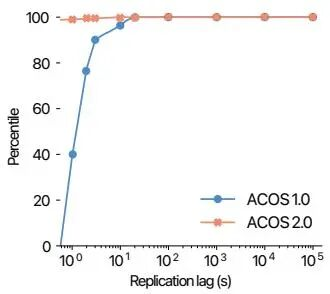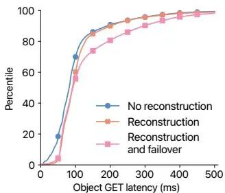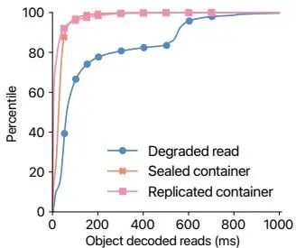图7：持久性与可用性性能指标——\(b\)\(c\) 仅针对 ACOS 2.0.

## 6 讨论

本节讨论在十余年大规模运营存储系统过程中遇到的挑战, 包括系统间海量数据迁移、性能考量以及可用性、持久性与成本的权衡.

### 6.1 从 1.0 到 2.0 的迁移

随着 ACOS 2.0 作为 ACOS 1.0 的替代引入, 我们需将数据迁移至新部署. 部分客户自行完成迁移, 其余数据则由我们通过多个 store 进行大规模迁移. 迁移按以下阶段依次进行.

  1. 1\. **客户端应用迁移**. 将客户专属信息迁移至目标部署：凭证、配置参数、限流与存储配额.
  2. 2\. **对象迁移**. 基于存储应用的进程异步将单个对象迁移至目标部署. 该进程与第 3.4 节所述的复制流程类似, 将每个对象发送至新部署并按第 4.1 节所述以段形式存储. 对象迁移在源 store 仍处理客户端请求的同时进行.
  3. 3\. **对象校验**. 基于存储应用的异步进程校验迁移数据的完整性, 通过计算并比对校验和、校验元数据字段, 确认每个对象的数据与元数据已正确迁移至目标部署.
  4. 4\. **请求代理**. 当既有对象全部迁移完成后, 源 store 的客户端处理器将客户端请求重定向至目标部署的请求处理器. 此阶段源 store 上仍对新增或修改的对象持续运行对象迁移与校验.
  5. 5\. **DNS 切换**. 当对象迁移与校验均完成后, 更新面向客户的 store 端点 DNS 配置, 将 CNAME 记录从源 store 的 DNS 域名指向目标部署的 DNS 域名.

整个迁移在数年时间内完成数艾字节数据, 对客户端应用透明、无停机, 且全程持续处理客户端请求, 并保证任意时刻数据的可用性与正确性.

### 6.2 延迟优化

ACOS 2.0 的地理分布式架构使完整对象 GET 与 TTFB 相对前一系统有所上升. 迁移前我们主导了显著降低服务端延迟 \(最多约 60%\) 与客户端延迟 \(最多约 87%\) 的工作, 以尽量减小从 ACOS 1.0 迁至 ACOS 2.0 对工作负载的延迟影响. 我们在客户端 GET 请求的三个阶段做了改进：DNS 地理路由、元数据预取、段区域偏好.

**DNS 地理路由.** 通过 DNS 地理路由将客户端请求路由到五个 ACOS 2.0 数据中心中最近的一个, 使客户端到服务器的路径最短, 但会导致区域间流量不均衡. 只要各区域能承载自身流量, 我们允许不均衡; 当某区域流量接近预设阈值时, DNS 系统中的安全机制将超额流量路由至其他区域. 除 ACOS 2.0 的通用端点外, 我们还为对延迟敏感的流量提供了专用端点, 供少量低流量用例使用且不受该安全机制影响; 并为对延迟不敏感的流量提供另一端点, 以轮询方式在区域间均衡流量.

**非一致元数据读后的预取.** 除一致读外, ClassVI 提供由同数据中心副本提供的快速非一致读, 在 99.9 分位为个位数毫秒. 对象元数据仅在客户端 PUT 与再均衡时变更, 且 ClassVI 更新传播迅速, 非一致读在多数情况下返回正确元数据. 我们利用这一点乐观地从磁盘预取数据：收到客户端 GET 后, 请求处理器同时发起一致与非一致元数据读; 非一致读完成后立即触发段读; 一致读随后完成时, 请求处理器比对两份元数据; 若一致则开始向客户端流式返回数据; 若不一致 \(目前约 0.001% 的请求\) , 则丢弃预取数据并用正确元数据重新发送段 GET 请求.

**段区域偏好.** 读取对象时, 请求处理器可从对象的五段中任选四段组合. 我们的数据中心相距数百至数千英里, 分布于北美大陆两侧. 请求处理器不随机选四段, 而是优先选择网络往返时间最小的数据中心中的段. 多数情况下会读取校验段并需进行 XOR 重建, 带来少量 CPU 开销, 但避免了慢速的跨国网络传输.

### 6.3 负载均衡器旁路

ACOS 2.0 通过对象分段带来的 stamp 间吞吐提升, 暴露出既有负载均衡基础设施的瓶颈：stamp 负载均衡器无法应对放大后的流量.

在成本与机房空间约束下, 通过增加负载均衡器与架顶交换机等硬件方案不可行. 因此我们采用让 stamp 间通信绕过负载均衡器的策略, 降低了这些组件上的流量. 旁路负载均衡器也有代价：请求处理器须自行实现负载均衡器提供的部分能力, 如健康监测、应对大量到服务端请求处理器实例的连接. 尽管复杂度增加, 旁路负载均衡器仍带来了客户端请求延迟的下降：p50 改善约 22%, p90 约 32%, p95 约 26%.

### 6.4 持久性、可用性与复制因子的权衡

下面给出持久性、可用性与复制因子的模型与假设, 表 3 对不同 LRC 编解码与布局组合做了汇总. 该表体现了更高持久性、可用性与因数据复制带来的存储成本之间的权衡.

**持久性.** 计算与比较存储系统持久性的经典做法是由马尔可夫链模型推导平均数据丢失时间 \(Mean-Time-To-Data-Loss, MTTDL\) , 由 Gibson \[11\] 提出并被多篇工作 \[9\]\[15\]\[16\]\[18\]\[36\] 沿用. 图 8 给出两个 MTTDL 马尔可夫链模型： \(i\) stamp 内簇的 \(20, 2, 2\) LRC 本地模型; \(ii\) XOR-5 的区域模型. MTTDL 定义为从初始状态 \(XOR-5 为 4, \(20, 2, 2\) LRC 为 24\) 到数据丢失 \(DL\) 状态的平均时间. 两模型中, 令  表示单容器或单段的故障率,  表示从缺一个容器或段恢复到健康状态的修复率.

在本地模型中, 状态表示可用容器 \(数据/校验\) 数量. 故障率 λ 刻画容器故障,  刻画故障容器的检测与修复. \(12, 2, 2\) 与 \(20, 2, 2\) LRC 以概率  恢复四个故障容器, 以概率  恢复三个 \[16\]. 容器故障来自硬件故障与数据损坏 \(第 3.3 节\) .

为简化, 模型假设独立同分布的故障率  服从指数分布 \(常用近似 \[9\]\) , 尽管实际年化故障率 \(AFR\) 会变化 \[18\]. 并假设因容器跨机架放置而导致的故障不相关, 以缓解机架级共因故障. 模型仅针对密封簇, 因存临时数据的复制簇影响可忽略. 修复时间用指数分布建模, 假设跨机架带宽不限制修复.

在区域模型中, 每个状态表示可用段数 \(ACOS 1.0 则为对象数\) . λ 为由本地模型 MTTDL 导出的故障率, 表示区域内 LRC 保护失效.  结合本地模型的容器修复率与区域间对象复制率. 例如 XOR-5 中, 初始状态  \(四区域四段\) 以速率  在第五段复制完成时转移到 .

我们使用典型参数计算系统持久性. 本地模型采用保守故障率  \(相对 Backblaze 平均磁盘 AFR 1.35% \[2\] 及 ACOS 观测值\) . 区域模型使用 . 两模型修复率 ,  天, 用于容器/段的检测、修复或复制, 与 \[9\] 类似. 表 3 给出年度 MTTDL. 采用 \(12, 2, 2\) LRC 的 ACOS 1.0 比采用 \(20, 2, 2\) LRC 与 XOR-5 的 ACOS 2.0 持久性更好, 同时满足“11 个九”的 SLA \[1\].

**可用性.** 各区域对周期性健康检查的响应情况定义其运行状态; 若某区域无法响应则视为不可用, 直至恢复响应. 若两个或更多区域同时不可用, ACOS 进入不可用状态. 我们按目标可用性  \(如  对应 99.9999% 服务等级目标 SLO, 即“五个九”\) 对单区域建模. 单区域不可用率为 .

设系统由  个区域组成 \(ACOS 1.0 为 , ACOS 2.0 为 \) , 区域故障为独立事件, 则同时不可用区域数  服从二项分布. 我们区分降级与不可用两种状态.

**降级状态** ：当恰好一个区域不可用 \(\) 时系统处于降级. 该状态影响对未完全复制对象的访问, 并会积压待复制到不可用区域的对象与段. 概率  由式 \(1\) 给出：

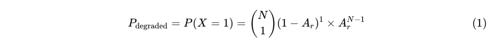

**不可用状态** ：当两个或更多区域同时不可用 \(\) 时系统不可用. 此状态下客户端无法访问数据且无法存储新对象. 概率  为  至  的概率之和, 由式 \(2\) 给出：  
  

表 3 给出降级与不可用状态的年度持续时间. 降级与不可用年度时长随用于存储数据的区域数增加而增加.

**复制.** ACOS 通过不同层级的复制机制、对应不同复制因子提供高可用： \(i\) stamp 内本地复制因子 ; \(ii\) 跨区域复制因子 . ACOS 整体复制因子为 .

本地复制采用  LRC, 含  个校验与  个数据容器, 整体复制因子 . ACOS 1.0 使用的 \(12, 2, 2\) LRC 与 ACOS 1.0/2.0 使用的 \(20, 2, 2\) LRC 的复制因子分别为 1.33 与 1.2.

区域复制在两系统间不同. ACOS 1.0 采用完整对象复制, . ACOS 2.0 采用按位 XOR 复制与单校验段, , 如 .

表 3 给出整体复制因子. ACOS 2.0 的复制因子低于 ACOS 1.0, 这也是其降低存储成本的设计考量. 使用更多存储区域可降低复制因子, 直接降低每字节成本. 在苹果的 ACOS 2.0 中, 结合工作负载对持久性与可用性的要求、数据中心位置约束与成本考量, 我们选择了 \(20, 2, 2\) LRC 编解码与 XOR-5 布局.

编解码| 布局| 持久性 MTTDL \(年\)| 可用性 \(秒\)| RF  
---|---|---|---|---  
本地| 区域| 降级| 不可用  
\(12,2,2\)| 1.0| 4.96×10¹⁰| 4.51×10²³| 631.15| 0.0032| 2.67  
\(20,2,2\)| 1.0| 8.49×10⁹| 1.32×10²²| 631.15| 0.0032| 2.40  
\(20,2,2\)| XOR-3| 8.49×10⁹| 4.38×10²¹| 946.71| 0.0095| 1.80  
\(20,2,2\)| XOR-4| 8.49×10⁹| 2.19×10²¹| 1,262.27| 0.0189| 1.60  
\(20,2,2\)| XOR-5| 8.49×10⁹| 1.31×10²¹| 1,577.82| 0.0316| 1.50  
\(20,2,2\)| XOR-6| 8.49×10⁹| 8.77×10²⁰| 1,893.32| 0.0473| 1.44  
表3：不同 LRC 编解码与布局配置下的持久性、可用性与复制因子 \(RF\) 对比. 可用性指标针对 99.999% SLO, 分别给出降级 \(单区域故障\) 与不可用 \(两区域故障\) 状态的时长.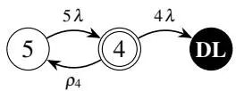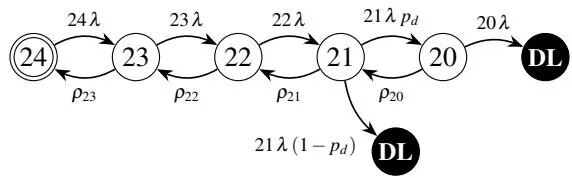图8：上：XOR-5 布局的区域 MTTDL 马尔可夫链模型. 下：\(20, 2, 2\) LRC 编解码的本地 MTTDL 模型. 初始状态以双圈标出, 数据丢失状态标为“DL”.

## 7 相关工作

ACOS 建立在数十年分布式存储系统之上——从基础文件系统到现代地理复制对象存储, 并吸收了纠删码、元数据管理等方面的进展.

**生产对象存储.** 对象存储形态多样：云商业产品、开源与内部部署. Amazon S3 \[1\]、Google Cloud Storage \[12\]、Azure Blob Storage \[26\]、IBM Cloud Object Storage \[17\]、Oracle Cloud Infrastructure Object Storage \[31\] 等商业方案提供按需扩展的字节到 PB 级存储. MinIO \[27\] 与 Ceph \[41\] 是本地 PB 级部署的开源替代. 多家公司描述了与 ACOS 类似的内部对象存储：LinkedIn 的 Ambry \[29\] \(地理分布式、不可变对象\) 、Yahoo\! 的 Walnut \[6\] \(统一云对象存储\) . Google File System \(GFS\) \[10\] 作为 Google Cloud Storage \(GCS\) \[14\] 的前身, 展示了在通用硬件上的可扩展存储. 微软的 Windows Azure Storage \[4\] 是通用对象存储服务. Meta 的存储从 Haystack \[3\] \(小图\) 演进到 f4 \[28\] \(温存储、纠删码\) 和 Tectonic \[32\] \(统一艾字节级\) , 凸显大规模挑战. 与 Tectonic 类似, ACOS 面向统一艾字节级存储, 并增加地理复制.

**地理复制对象存储.** ACOS 为地理复制设计, 以保证数据可用性与灾难恢复. OceanStore \[23\] 奠定了全球级持久存储的早期基础. Ford 等人 \[9\] 分析了在两区域全复制下维持全球分布式环境可用性的权衡. Ambry \[29\] 明确面向地理分布, 主要针对具备最终一致性的不可变数据. 与 ACOS 类似, Meta 的 f4 \[28\] 对温数据在多区域采用基于 XOR 的地理复制纠删码. Pando \[40\] 探索跨区域纠删码以提升存储效率, 代价是更高延迟. Mesa \[13\] 依赖健壮的地理复制策略.

**元数据管理.** 尽管 ACOS 为地理复制, 其仍提供与 AWS S3、Google Cloud Storage、MinIO 类似的强一致性. ACOS 将对象元数据存储在 ClassVI——针对低延迟 SSD 访问优化的分布式键值存储, 与 BigTable \[5\]、Cassandra \[24\] 类似. ClassVI 也地理分布且跨区域强一致, 与 Spanner \[7\]、Dynamo \[8\] 类似. 将元数据拆分为独立可扩展服务是常见做法, 如 Google GFS 使用 Bigtable、后续 Colossus 使用 Spanner. 我们的元数据库方案与 Ambry \[29\]、MinIO \[27\] 等将元数据与对象同址的系统不同, 在元数据密集型工作负载上呈现不同的性能权衡.

**纠删码复制.** 与许多大规模系统一样, ACOS 使用纠删码实现高持久性与存储效率 \[9\]. Reed-Solomon 码 \[35\] 是基础, 系统常采用本地重构码 \(LRC\) 等变体——由 Windows Azure Storage \[16\] 推广并被 Meta \[28\]\[36\]、Google \[33\] 采用. LRC 通过本地校验容器降低修复带宽与 I/O. ACOS 采用 \(20, 2, 2\) LRC, 在存储开销、持久性与修复间取得平衡. 先前工作使用类似宽条带纠删码以降低复制因子、代价是修复带宽 \[15\]\[21\]. ACOS 通过密封将数据从复制转为纠删码, 这是优化冷热数据存储成本的常用手段. 类似的磁盘自适应编码方案根据数据温度或磁盘故障率调整冗余 \[19\]\[20\]\[22\]\[37\].

## 8 结论

本文介绍了 ACOS——一套为满足苹果特定工作负载需求而设计的对象存储. ACOS 在生产环境运行逾十年, 在地理分布式、跨多数据中心的环境中高效服务请求, 具备低延迟与高吞吐. 第二代 ACOS 将复制因子从 2.40 降至 1.50, 同时保持对磁盘、主机、机架与数据中心故障的高持久性与容错能力.

在向下一代硬件 \(尤其是更大容量磁盘\) 过渡之际, 持续应对存储与读取数据量的增长、同时将维护操作消耗的磁盘 IOPS 控制在最低, 仍是重大挑战.

## 致谢

作者感谢 FAST’26 审稿人的宝贵意见、shepherd Juncheng Yang, 以及 Aditya Umrani、Mohit Talwar、Suri Medapati、P.P.S. Narayan 的深入评论与讨论. 我们也感谢 ACOS 的创始成员 Bernard Gallet、Nick Puz、David Hemmo, 以及 Bernard Gallet 与 Ed Nightingale 对 2.0 的愿景. 感谢 SRE、ClassVI 与客户成功团队, 以及 ACOS 的过往贡献者与当前团队成员：Andrey Trubachev, Edward Karpovits, Guillaume Rose, Ilker Yaz, Julien Lesaint, Jun Roh, Maxime Derobillard, Mohini Borse, Nate Li, Nathan Moreau, Partha Krishnamurthy, Thomas Peyrard, Yaniv Pessach.

## 参考文献

`1.` Amazon Web Services, Inc. Amazon Simple Storage Service \(S3\). https://aws.amazon.com/s3, 2026.↩︎  
`2.` Backblaze. Disk Reliability Dataset. https://www.backblaze.com/cloud-storage/resources/hard-drive-test-data, 2024.↩︎  
`3.` Doug Beaver 等. Finding a Needle in Haystack: Facebook's Photo Storage. OSDI, 2010.↩︎  
`4.` Brad Calder 等. Windows Azure Storage: a highly available cloud storage service with strong consistency. SOSP, 2011.↩︎  
`5.` Fay Chang 等. BigTable: A Distributed Storage System for Structured Data. ACM TOCS, 26\(2\), 2008.↩︎  
`6.` Jianjun Chen 等. Walnut: A Unified Cloud Object Store. ACM SIGMOD, 2012.↩︎  
`7.` James C. Corbett 等. Spanner: Google's Globally-Distributed Database. OSDI, 2012.↩︎  
`8.` Giuseppe DeCandia 等. Dynamo: Amazon's Highly Available Key-Value Store. SOSP, 2007.↩︎  
`9.` Daniel Ford 等. Availability in Globally Distributed Storage Systems. OSDI, 2010.↩︎  
`10.` Sanjay Ghemawat 等. The Google File System. SOSP, 2003.↩︎  
`11.` Garth Alan Gibson. Redundant Disk Arrays: Reliable, Parallel Secondary Storage. PhD thesis, UC Berkeley, 1991.↩︎  
`12.` Google. Google Cloud Storage. https://cloud.google.com/storage, 2026.↩︎  
`13.` Ashish Gupta 等. Mesa: Geo-Replicated, Near Real-Time, Scalable Data Warehousing. PVLDB, 7\(12\), 2014.↩︎  
`14.` Dean Hildebrand, Denis Serenyi. Colossus under the hood. Google Cloud Blog, 2021.↩︎  
`15.` Yuchong Hu 等. Exploiting Combined Locality for Wide-Stripe Erasure Coding in Distributed Storage. FAST, 2021.↩︎  
`16.` Cheng Huang 等. Erasure Coding in Windows Azure Storage. USENIX ATC, 2012.↩︎  
`17.` IBM. IBM Cloud Object Storage. https://www.ibm.com/products/cloud-object-storage, 2026.↩︎  
`18.` Saurabh Kadekodi 等. Tiger: Disk-Adaptive Redundancy Without Placement Restrictions. OSDI, 2022.↩︎  
`19.` Saurabh Kadekodi 等. PACEMAKER: Avoiding HeART Attacks in Storage Clusters with Disk-Adaptive Redundancy. OSDI, 2020.↩︎  
`20.` Saurabh Kadekodi 等. Cluster Storage Systems Gotta Have HeART. FAST, 2019.↩︎  
`21.` Saurabh Kadekodi 等. Practical Design Considerations for Wide Locally Recoverable Codes \(LRCs\). ACM TOS, 19\(4\), 2023.↩︎  
`22.` Timothy Kim 等. Morph: Efficient File-Lifetime Redundancy Management for Cluster File Systems. SOSP, 2024.↩︎  
`23.` John Kubiatowicz 等. OceanStore: An Architecture for Global-Scale Persistent Storage. SIGPLAN Not., 35\(11\), 2000.↩︎  
`24.` Avinash Lakshman, Prashant Malik. Cassandra: A Decentralized Structured Storage System. ACM SIGOPS OSR, 44\(2\), 2010.↩︎  
`25.` Meta Platforms, Inc. RocksDB. https://rocksdb.org, 2013.↩︎  
`26.` Microsoft. Azure Blob Storage. https://azure.microsoft.com/en-us/products/storage/blobs, 2026.↩︎  
`27.` MinIO, Inc. MinIO: High Performance Object Storage. https://min.io, 2026.↩︎  
`28.` Subramanian Muralidhar 等. f4: Facebook's Warm BLOB Storage System. OSDI, 2014.↩︎  
`29.` Shadi A Noghabi 等. Ambry: LinkedIn's Scalable Geo-Distributed Object Store. ACM SIGMOD, 2016.↩︎  
`30.` Diego Ongaro, John Ousterhout. In Search of an Understandable Consensus Algorithm. USENIX ATC, 2014.↩︎  
`31.` Oracle Corporation. Oracle Cloud Infrastructure Object Storage. 2026.↩︎  
`32.` Satadru Pan 等. Facebook's tectonic filesystem: Efficiency from exascale. FAST, 2021.↩︎  
`33.` Korlakai Vinayak Rashmi 等. A "Hitchhiker's" Guide to Fast and Efficient Data Reconstruction in Erasure-Coded Data Centers. ACM SIGCOMM, 2014.↩︎  
`34.` Benjamin Reed, Flavio P. Junqueira. A simple totally ordered broadcast protocol. LADIS, 2008.↩︎  
`35.` I. S. Reed, G. Solomon. Polynomial codes over certain finite fields. J. SIAM, 8\(2\), 1960.↩︎  
`36.` Maheswaran Sathiamoorthy 等. XORing Elephants: Novel Erasure Codes for Big Data. PVLDB, 6\(5\), 2013.↩︎  
`37.` Zhirong Shen 等. A Survey of the Past, Present, and Future of Erasure Coding for Storage Systems. ACM TOS, 21\(1\), 2025.↩︎  
`38.` Alexander Shraer 等. CloudKit: Structured Storage for Mobile Applications. PVLDB, 11\(5\), 2018.↩︎  
`39.` The Apache Software Foundation. Apache Cassandra. http://cassandra.apache.org/, 2026.↩︎  
`40.` Muhammed Uluyol 等. Near-Optimal Latency Versus Cost Tradeoffs in Geo-Distributed Storage. NSDI, 2020.↩︎  
`41.` Sage Weil 等. Ceph: A scalable, high-performance distributed file system. OSDI, 2006.↩︎

#### 原论文链接

`[1]` ACOS: Apple’s Geo-Distributed Object Store at Exabyte Scale - FAST 26:  *https://www.usenix.org/conference/fast26/presentation/baron*  

  

  

  

**END**

点赞、在看是对团子持续更新最大的鼓励~

欢迎加我好友，一起进入分布式存储交流群技术交流、闲聊！

  

  

**微信号** 丨dangotech