**关注我们**

**以后就可以常见面啦！👆**

  

分享TrendForce 2026 年 2 月 NAND Flash 市场报告。供应端，2026 年行业扩产保守，仅长江存储、铠侠 / 闪迪新建产线，其余厂商聚焦制程迁移，3D NAND 向 2XX-L/3XX-L 进阶，QLC 占比将升至 29%；长江存储产能持续扩张，全球市占率稳步提升。需求端，2026 年需求位元增长 14.8%，服务器 NAND Flash 消耗量首超移动端，AI 服务器推动高容量 SSD 普及，企业级 PCIe 5.0 SSD 成主流，PCIe 6.0 进入研发阶段。价格方面，2025 年 NAND Flash 价格先跌后涨，2026 年各品类价格大幅上行，整体涨幅达 170%-175%，现货与合约价走势趋同。行业为提升利润率，向高价值高端产品倾斜，制程迁移放缓或致高端产品供应紧张。

  

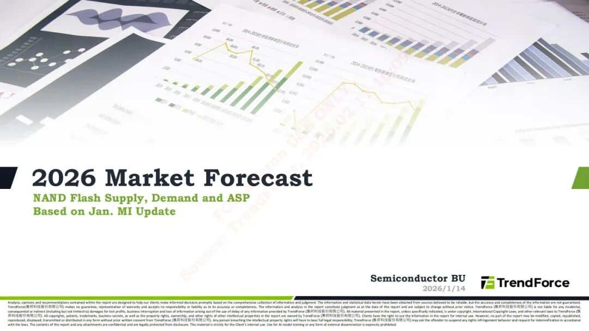

  

  

  

**报告主要内容**

  * NAND Flash 供应端格局

  * NAND Flash 需求段特征

  * NAND Flash 价格与行业策略

  

  

  

**报告主要页面展示**

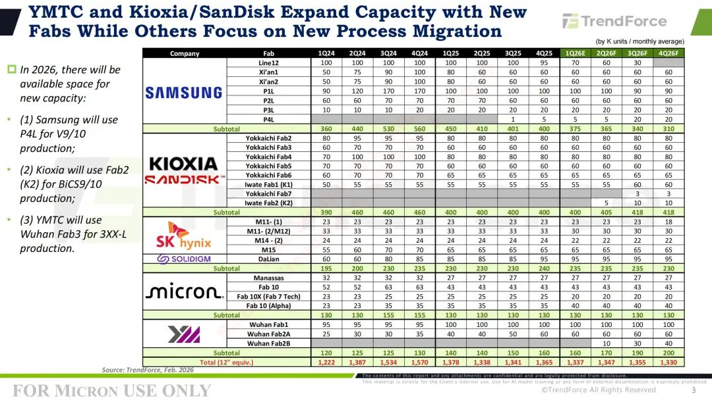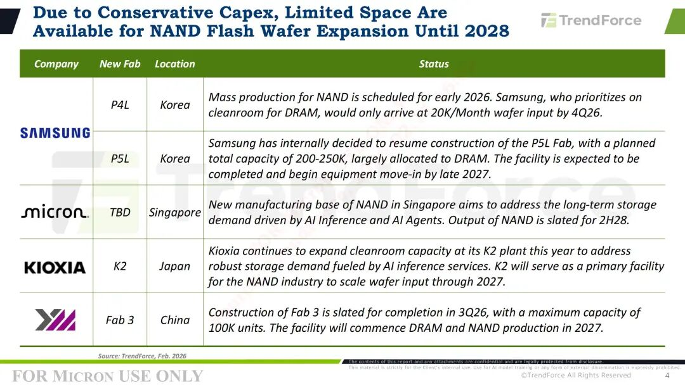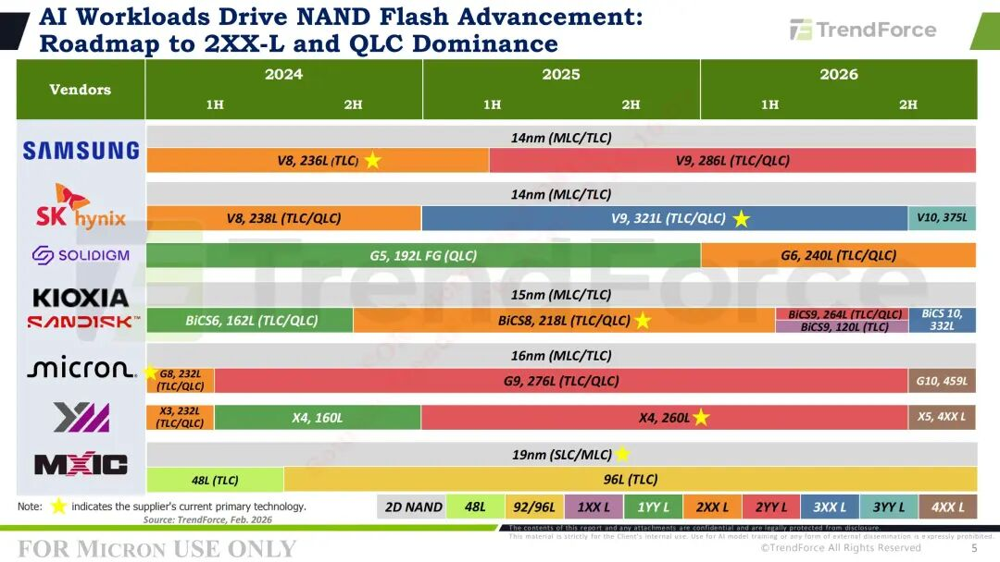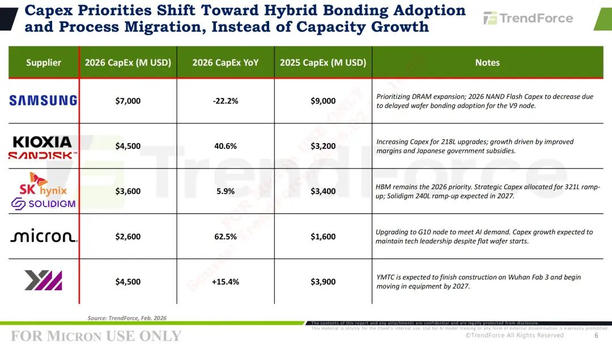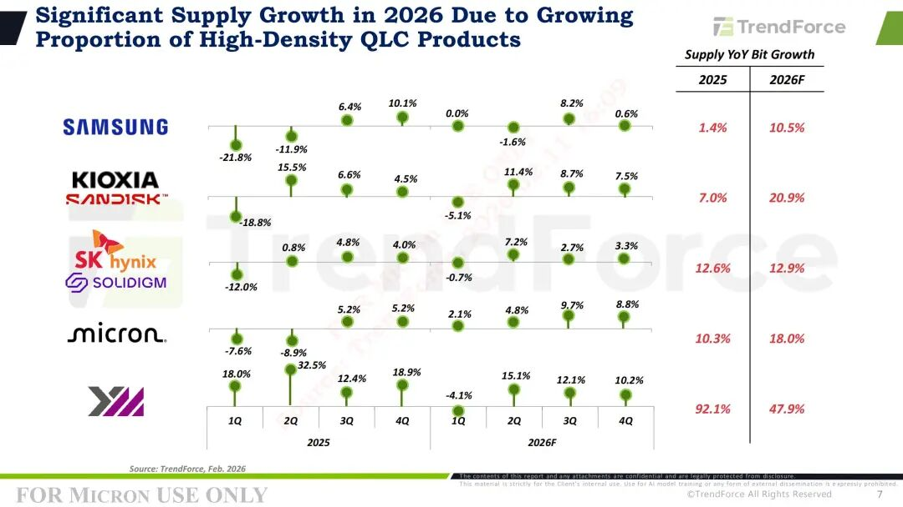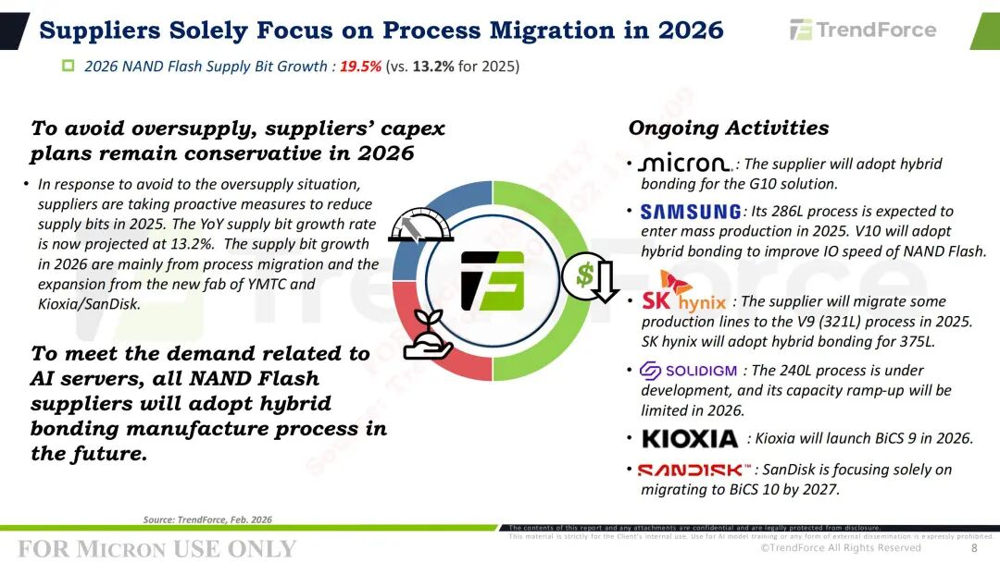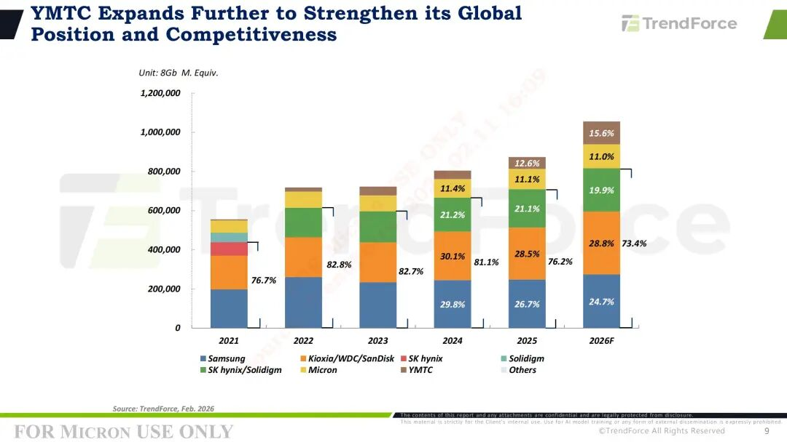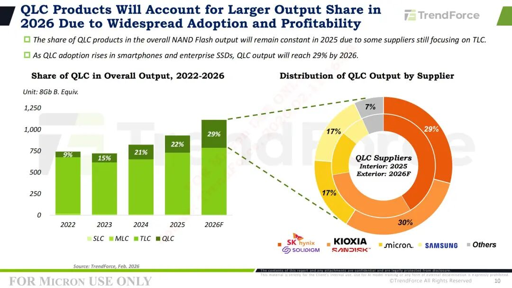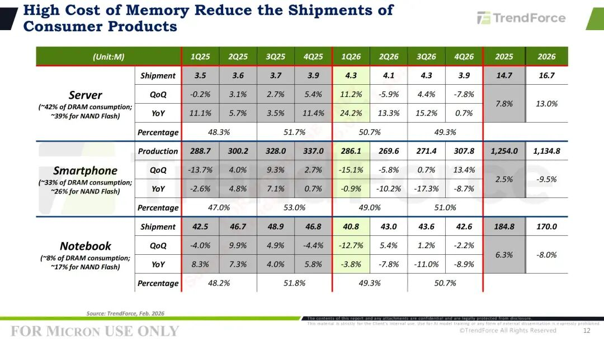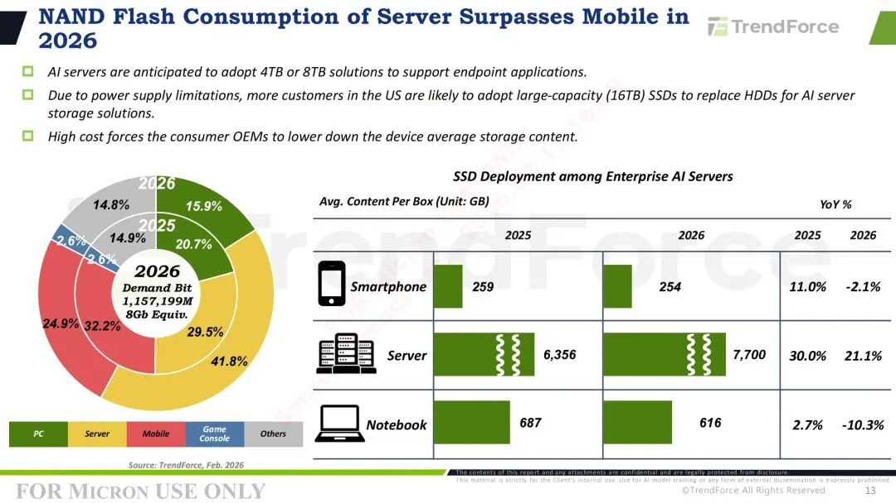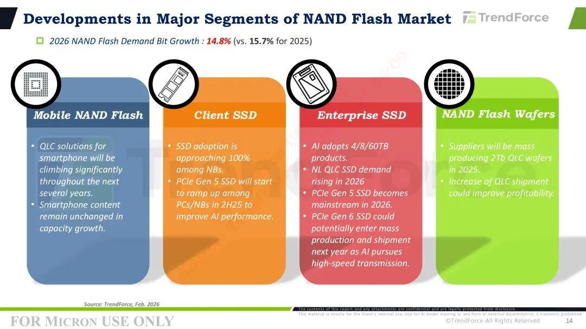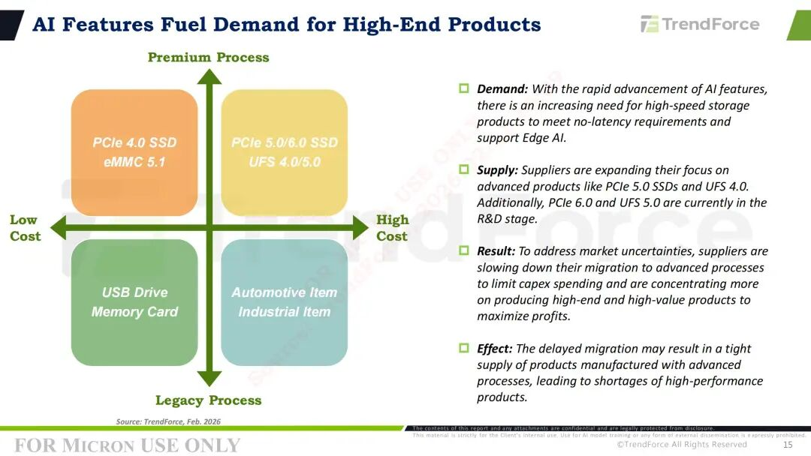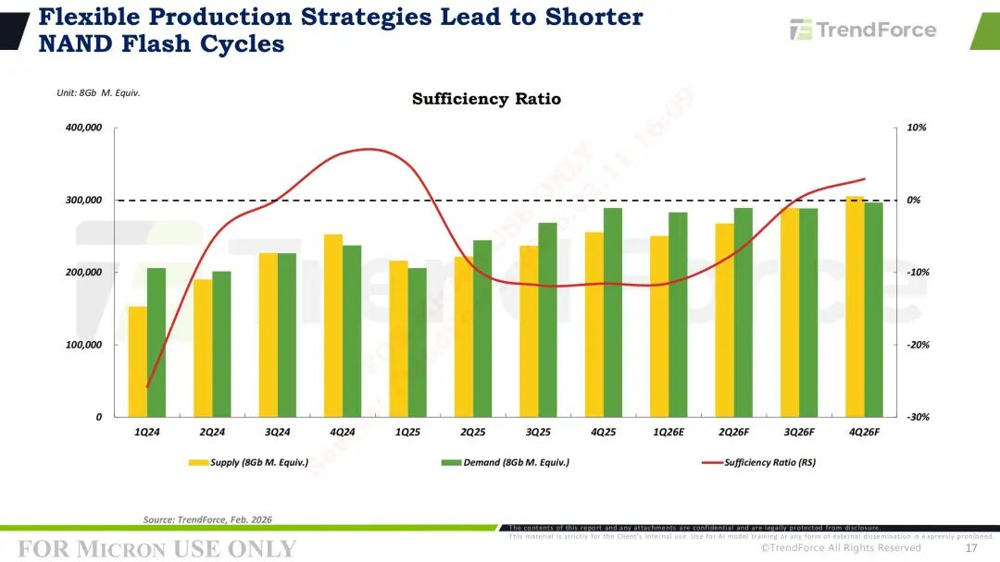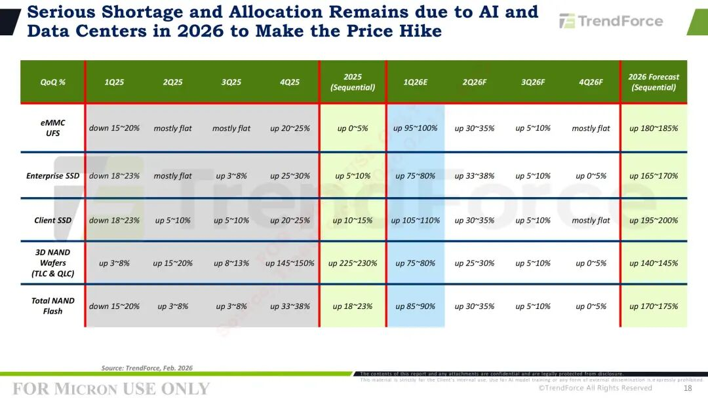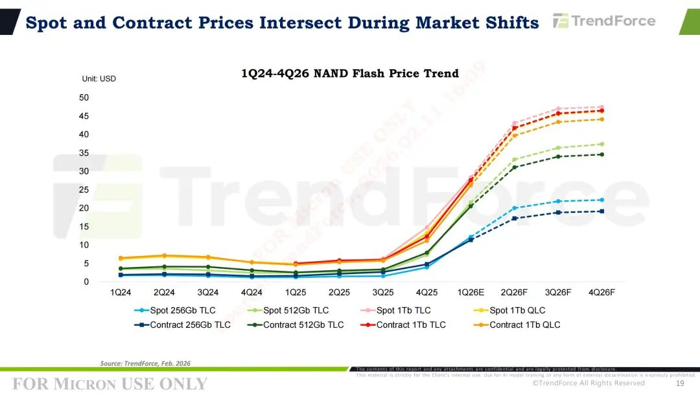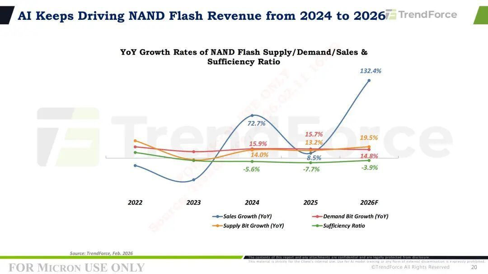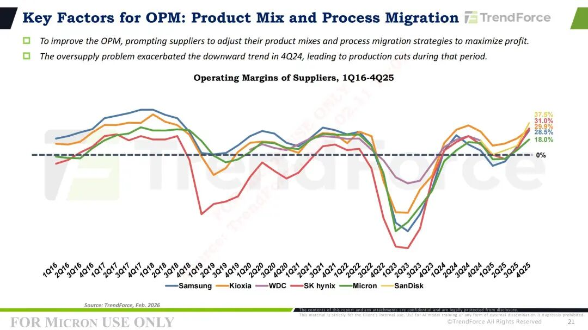

  

  

  

资料收集不易，用于学习交流。需要报告原件的朋友，或有其他资源or翻译需求，欢迎私信沟通！

  

除公众号发布的资料外，我们的知识星球——“锐芯星”还有更丰富和富有价值的资源，包括：

  

  * 业界知名机构的技术和市场分析报告

  * 行业龙头企业的自家技术和产品介绍

  * 科研院所和高校研究成果和讲义教材

  * 金融机构对半导体各领域的分析预测

  

欢迎扫码加入

⬇

  

 ***END***

关注锐芯闻，掌握“芯”讯息