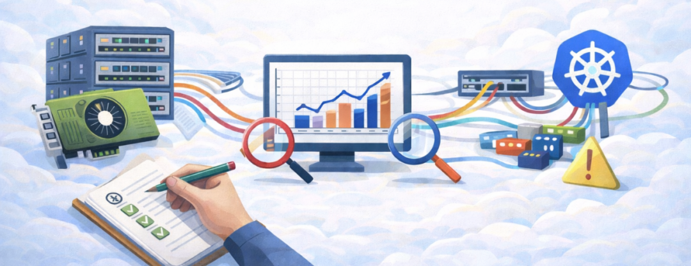
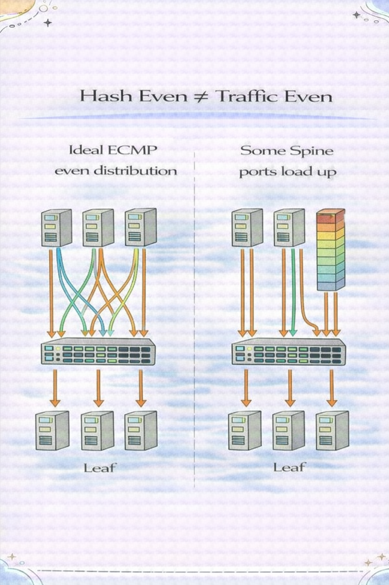
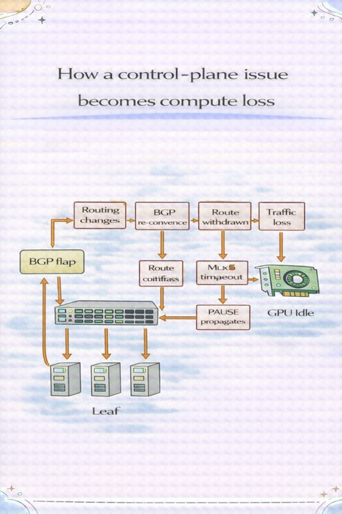
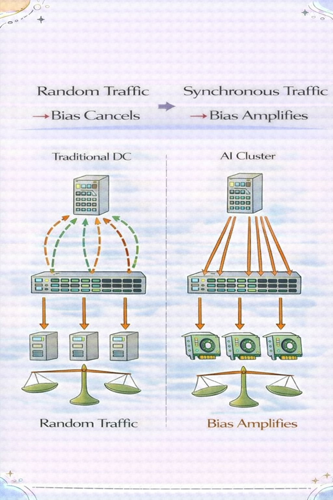

这里是「算力网络架构手记」北京

  * 专注 AI 集群网络架构与性能优化

  * 深入 GPU×RoCE×NCCL×K8s 跨层瓶颈

  * 只拆真实问题，不写概念科普

* * *

  

  

* * *

  

[我决定系统讲一次：AI训练网络通信全路径拆解（课程详情）](https://mp.weixin.qq.com/s?__biz=Mzk0MzY3NTQzOQ==&mid=2247484067&idx=1&sn=c89895fed4a5d264889c06307e37c7b6&scene=21#wechat_redirect)

  

> GPU 很贵。
> 
> 但有时候，真正拖垮训练性能的，是一条路由策略。

  

00

事故背景

  

某 128 卡训练集群。

  

架构：

  * Spine-Leaf Clos

  * RoCEv2

  * 每台 8 卡 8 网卡

  * BGP ToR 接入

  * Host 侧运行 FRR，与 Leaf 建立 eBGP

  

目标：

  * 提高收敛速度

  * 简化大规模扩展

  * 支持等价多路径

  

上线后出现现象：

  * GPU 利用率从 95% 掉到 70%

  * 训练吞吐波动

  * NCCL 偶发 timeout

  * 网络无明显丢包

  

交换机侧指标：

  * 无端口 down

  * 无明显 buffer 爆满

  * ECN 正常

  

一切“看起来正常”。

但性能明显异常。

  

01

第一轮排查：数据面

  

我们习惯从数据面查起：

  * MTU 是否一致

  * PFC 计数器

  * ECN 标记比例

  * Buffer 使用情况

  * NIC 统计

  

结果：

  * 无丢包

  * 无 PFC storm

  * 无 ECN 异常

  

数据面干净。

问题仍然存在。

  

02

关键突破：流量路径分布异常

  

我们做了一件事：

对同一时刻的 AllReduce 流进行路径分析。

  

发现：

> 同一台主机的 8 张网卡，  
> 并没有均匀分布在 Spine 上。

部分 Spine 端口负载 90%+  
部分 Spine 端口只有 40%

但 ECMP 是开的。

为什么？

  

03

真正的根因：BGP 路由属性导致路径偏置

  

深入检查 BGP 表。

  

发现一个细节：

Host 侧 FRR 配置了：
      
      *   *   * 
    
    
    
    next-hop-selflocal-preferenceMED

`而且存在不同优先级策略。`

  

问题出在：

  * Host 侧学习到的多条路径

  * 并非完全等价

  * 有微小属性差异

  

结果：

Leaf 选择路径时：

> 并非真正等价多路径

而是：

  * 偏向某几个 Spine

  

当 AllReduce 启动时：

流量是强同步的。

所有 GPU 几乎同时选定相同路径。

形成确定性拥塞。

  

04

为什么传统数据中心没问题？

  

在传统 DC：

  * 流量离散

  * 启动时间随机

  * TCP 会退避

  

即使路径偏置：

拥塞概率低。

  

但 AI 集群是：

> 同步启动 + 满带宽 + 强依赖。

这会把“微小路径偏置”放大成“确定性瓶颈”。

  

05

放大机制：从路由偏置到训练抖动

  

完整链路如下：

  

1️⃣ BGP 属性微差异  
↓  
2️⃣ Leaf 选路偏置  
↓  
3️⃣ Spine 端口负载集中  
↓  
4️⃣ 队列瞬时抬高  
↓  
5️⃣ ECN 标记增多  
↓  
6️⃣ DCQCN 降速  
↓  
7️⃣ AllReduce 变慢  
↓  
8️⃣ GPU 等待

  

06

为什么监控系统没报警？

  

因为：

  * 没有丢包

  * 没有接口 down

  * 没有 PFC storm

这是一个“性能型故障”，

不是“故障型故障”。

很多 AI 集群问题都属于这一类。

  

07

修复方案

  

我们做了三件事：

## 1️⃣ 保证真正等价的多路径

  * 去除不必要的 MED

  * 统一 local-pref

  * 确保 AS-PATH 等长

  * 使用 BGP add-path

让 ECMP 真正对等。

##   

## 2️⃣ 验证路径分布

在训练启动瞬间抓流：

  * 确认 8 网卡跨 Spine 均匀

  * 确认无单点集中

##   

## 3️⃣ 监控控制面指标

新增：

  * BGP path 变更频率

  * Host 路由收敛时间

  * FIB 变化统计

  

修复后：

  * GPU 利用率恢复到 94%

  * 训练时间缩短 18%

  * 波动消失

  

08

真正的教训

  

很多人以为：

> AI 网络问题一定出在 PFC 或 ECN。

但这次事故说明：

> 控制面的一条路由策略，  
> 可以让整套算力系统损失 20%。

  

09

三个核心认知

  

### 1️⃣ BGP 不再只是“控制面协议”

在 AI 集群里，

它会直接影响数据面性能。

###   

### 2️⃣ ECMP 不是自动均衡

必须验证。

不能假设。

###   

### 3️⃣ 强同步系统会放大一切微小偏差

AI 网络是确定性系统。

不是概率系统。

  

这次事故没有丢包。

没有设备故障。

没有 PFC storm。

只有一条“看似合理”的 BGP 策略。

但它让 128 张 GPU 同时变慢。

> 在 AI 集群里，
> 
> 网络不是辅助系统，  
> 是算力系统的一部分。

* * *

> **如果你也在做 AI 集群架构**
> 
> **欢迎关注「算力网络架构手记」**
> 
> **长期拆解真实算力网络问题**

