公众号记得加星标⭐️，第一时间看推送不会错过。

  

  

前言

  

高带宽闪存 \(HBF：High Bandwidth Flash\) 的出现，旨在解决人工智能的内存瓶颈问题。其理念是将 NAND 闪存像 HBM 一样堆叠起来，从而在提供 HBM 级别带宽的同时，实现 16 倍的容量提升。SK 海力士和闪迪正在联合开发这项技术，目标是在 2026 年底推出样品。从表面上看，它似乎是解决 LLM 推理内存容量问题的完美方案。

  

然而，对SK海力士研究人员发表的H³论文（论文名称：H³: Hybrid Architecture using High Bandwidth Memory and High Bandwidth Flash for Cost-Efficient LLM Inference）进行深入分析后发现，HBF在实际应用中面临的障碍远比最初预想的要大得多。本文从半导体工程师的角度出发，探讨了H³架构的假设和局限性，回顾了HBF在商业化过程中将面临的技术和经济挑战，并考察了业界目前正在开发的替代技术方案。

  

H³ 中只读工作负载的假设在实际的 LLM 推理场景中非常有限。克服 NAND 闪存的根本物理限制（延迟相差 1-2 个数量级）需要 40MB 的 SRAM 缓冲区、DRAM 和复杂的控制器，这削弱了最初“廉价 NAND”的承诺。生产良率、散热管理和可靠性验证等实际障碍比预期更高。CXL 内存、HBM4 和软件优化等替代方案正在更快地走向成熟。

  

为了方便大家了解HBF，在文章最后我们还将附上SK海力士这篇文章的翻译参考。

  

  

  

**HBF 的背景**

**人工智能引发的内存容量危机**

  

  

  

AI工作负载的瓶颈不再是计算性能。为了跟上NVIDIA H100 989 TFLOPS的计算能力，内存必须以同样快的速度提供数据。HBM3以819GB/s的带宽和100ns的访问延迟满足了这一要求，但它存在一个关键弱点：容量。每个GPU（B200）的最大容量仅为192GB，对于在单个GPU上运行像Llama 3.1 405B（FP8模式下约为405GB）这样的大型模型来说，HBM的容量远远不够。

  

更大的问题在于键值缓存（KV cache）。对于拥有 100 万个token上下文（context）的 Llama 3.1 405B 版本，仅预计算的键值缓存就需要约 540GB。如果扩展到 1000 万个令牌，则需要 5.4TB。仅使用 HBM 来处理如此庞大的缓存需要数十个 GPU，这将导致成本和功耗成比例地增加。

  

这就是 SanDisk 和 SK 海力士所称的“内存墙”及其提出的 HBF 方案的背景。

  

HBF的优势显而易见：将NAND闪存与类似HBM的TSV（硅通孔）技术堆叠，即可在相同带宽（8TB/s）下提供HBM 16倍的容量（约3TB）。由于NAND的成本约为HBM的五分之一，因此经济效益也相当可观。表面上看，这似乎是一个完美的解决方案。但我们需要更深入地分析。

  

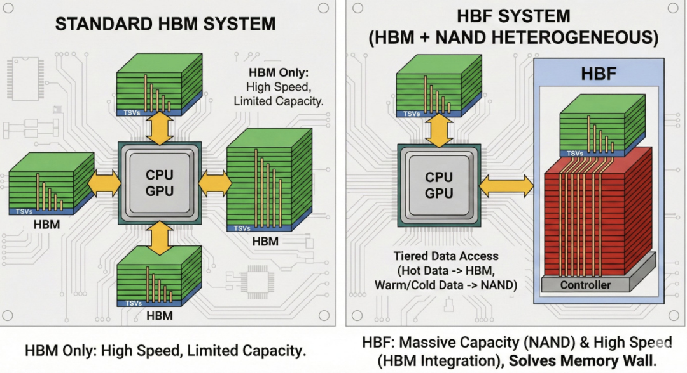

  

  

  

**H³论文的方法**

**混合架构和核心假设**

  

  

  

**H³ 架构概述**

  

SK海力士的研究人员提出的H³（采用HBM和HBF的混合架构）承认HBF单独使用时的局限性，并采用了一种结合HBM和HBF的混合方法。其核心设计工作原理如下：

  

HBM 直接连接到 GPU 的底层，以实现最大带宽。HBF 通过 HBM 基片以菊花链方式连接。HBM 基片内部的地址解码器和路由器将 HBM 和 HBF 的访问隔离。一个 40MB 的基于 SRAM 的延迟隐藏缓冲区 \(LHB\) 可以缓解 NAND 闪存的访问延迟。

  

在这种架构中，GPU 通过统一的地址空间将 HBM 和 HBF 都视为主内存。只读数据（模型权重、预计算的键值缓存）存储在 HBF 中，而动态生成的键值缓存则保存在 HBM 中。

  

**核心假设**

  

一、H³ 的性能声明基于几个重要的假设：

  

工作负载假设：大多数LLM推理数据是只读的。模型权重和共享的预计算KV缓存在整个推理期间不会改变。

  

访问模式假设：LLM推理是确定性的、顺序的。因此，所需数据可以被准确预测并提前预取。

  

性能假设：40MB SRAM 缓冲区达到足够高的命中率（论文中没有明确说明，但隐含地要求 80% 以上），使得 HBF 的 20μs 延迟大部分时间都不会被察觉。

  

延迟隐藏假设：由于 LLM 推理受限于内存带宽，因此 HBF 访问的跳延迟可以充分隐藏。

成本假设：由于 NAND 芯片价格低廉，即使加上额外的组件（SRAM、DRAM、控制器、TSV），整个系统与仅使用 HBM 的系统相比仍然经济。

  

该论文的仿真结果令人印象深刻。在 100 万个token的情况下，吞吐量提升了 1.25 倍；在 1000 万个令牌的情况下，吞吐量提升了 6.14 倍。每功耗吞吐量最高可达 2.69 倍。即使将 HBF 带宽减半，其性能仍然优于仅使用 HBM 的架构。

  

但只有在满足上述所有假设的前提下，才能取得这些结果。而问题就出在这里。

  

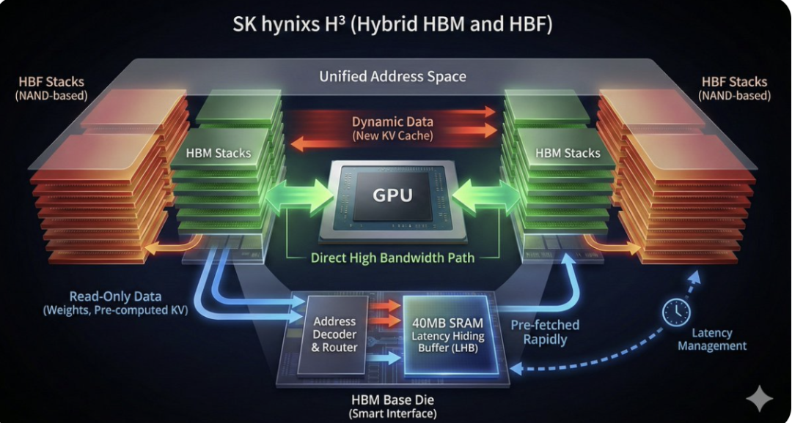

  

  

  

**假设的局限性和技术可行性问题**

  

  

  

**只读工作负载假设的局限性**

  

该论文将模型权重和共享的预计算 KV cache归类为“只读”（read-only），但这种假设在实际生产 LLM 服务中有多有效？

  

一、模型权重的现实意义：

  

微调和 PEFT：在生产环境中，像 LoRA 和 QLoRA 这样的参数高效微调方法很常见。适配器权重虽然很小，但更新频繁。

  

模型版本控制：A/B 测试或逐步推广方案涉及同时提供多个模型版本。HBF 如何处理模型切换？

  

量化变化：在 INT8、FP8 和 FP16 之间动态切换是一种常见的生产优化技术。

  

二、KV Cache的现实情况：

  

预计算缓存的范围：本文提出的缓存增强生成（CAG）是一个有效的用例，但它仅涵盖了整个LLM推理的一小部分。像ChatGPT和Claude这样的通用对话服务会为每个请求生成新的KV Cache。

  

缓存失效：当共享文档更新时，如何刷新预先计算的缓存？鉴于 HBF 的写入耐久性较低，这是一个关键问题。

  

缓存淘汰：管理数百 GB 的共享缓存池需要 LRU 等替换策略，这涉及到写入操作。

  

二、NAND的物理极限：一道无法逾越的障碍

  

即使只读假设成立，仍然存在一个更根本的问题。NAND 单元和 DRAM 单元之间的延迟差异并非架构技巧可以解决的问题。这源于物理定律的差异：

  

DRAM单元：读取和写入电容器中的电荷。仅需电开关操作。10-20纳秒。

  

NAND单元：通过隧穿效应将电子移动到浮栅。需要高电压和较长时间，耗时25-100微秒。

这可是1到2个数量级的差距。这也是英特尔傲腾（3D XPoint）无法取代DRAM的根本原因。即使傲腾的延迟只有约100纳秒，也无法与DRAM的10-20纳秒相媲美。而HBF的延迟只有20微秒？这可是1000倍的差距。

  

40MB 的 SRAM 缓冲区可以“缓解”这种差异，但并不能“解决”它。一旦发生 SRAM 未命中，这种差异就会完全暴露出来。

  

换句话说，“纯只读”工作负载在实践中非常有限，即使保证只读，也无法克服NAND闪存的物理延迟限制。本文的仿真代表的是一种理想化的场景。

  

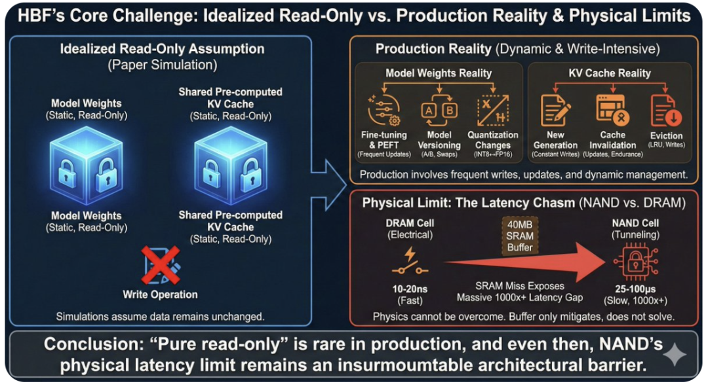

  

  

  

**成本结构真相**

**“廉价NAND”陷阱**

  

  

  

HBF的支持者强调“NAND晶圆的成本远低于HBM晶圆”。没错。单就NAND芯片本身而言，它肯定比HBM芯片便宜。但总成本呢？

  

对于HBM而言，主要成本在于内存芯片、TSV堆叠和封装。控制器集成在GPU内部，无需单独的缓冲区或中间层。其结构相对简单。

  

HBF技术以廉价的NAND闪存芯片为基础，但这并非终点。为了弥补NAND闪存的低延迟，它需要40MB的SRAM缓存。这并非小型缓存，而是容量巨大的高速内存。SRAM的单位面积成本远高于NAND闪存。

  

此外，还需要单独的DRAM来运行FTL（闪存转换层）。就像SSD控制器存储元数据一样，HBF需要工作内存来进行地址映射和损耗均衡。这部分DRAM会增加成本。

  

TSV堆叠和键合本身就是一个成本高昂的工艺。TSV需要在硅片上垂直钻出微小的孔，然后用金属填充。这需要昂贵的设备和精确的工艺控制，任何一个错误都可能导致整个芯片缺陷。HBM采用相同存储芯片的同质堆叠，因此工艺相对标准化。HBF采用异质堆叠，混合使用NAND、SRAM和控制器逻辑芯片。

  

对具有不同特性的芯片进行对准和键合要困难得多。它们的膨胀系数、电性能和可靠性要求各不相同。这显著增加了工艺复杂性，直接导致良率降低和成本上升。诸如钻孔硅通孔 \(TSV\) 时芯片开裂、键合过程中错位或热应力导致的分层等问题发生的可能性也随之增加。

  

封装和测试也变得更加复杂。对于HBM来说，内存访问测试是主要的验证项目。对于HBF来说，则需要验证SRAM缓冲区命中率、FTL精度、损耗均衡算法、ECC（纠错码）运行情况、垃圾回收效率等等。这本质上是SSD控制器级别的复杂性。

  

管理所有这些功能的控制器逻辑本身的成本也不容忽视。HBM 只是一个简单的内存接口，但 HBF 需要一个复杂的控制器来执行复杂的地址转换、预取、缓存管理、损耗均衡和垃圾回收等操作。

  

更重要的是， HBF 架构存在开发成本和风险。它是一种全新的架构，需要大量的研发投入和时间，包括标准化工作、软件生态系统构建和客户验证。HBM 架构已经完成了所有这些步骤，产量稳定，生态系统也已成熟。而 HBF 架构则必须从零开始。

  

早期生产的低良率也至关重要。HBM 最初良率低，单位成本高，但经过几代改进后逐渐提高。HBF 采用比 HBM 更复杂的异构堆叠结构，因此初始良率可能更低。如果良率减半，成本实际上会翻倍。

  

软件集成成本也不容忽视。PyTorch、TensorFlow、CUDA 以及所有 AI 框架的设计都基于 HBM 和 DRAM。要高效利用 HBF 的 SRAM 缓冲区，需要在软件层面优化内存分配策略、数据放置、预取提示等。这需要大量的工程资源。

  

因此，“NAND闪存价格低廉”的说法固然没错，但“HBF系统价格低廉”的说法仍需验证。从廉价的材料开始，所有使其成为实用产品的因素都会推高总成本。HBF要证明其经济优势，不仅需要证明其每GB的价格优势，还需要证明其在实际工作负载下的总拥有成本（TCO）。

  

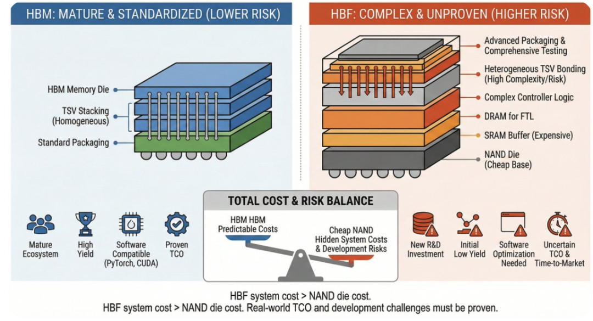

  

  

  

**替代技术解决方案和市场动态**

  

  

  

HBF计划在2026-2027年进行样品测试，而其他技术已经在快速成熟。业界正以不同的方式解决内存容量扩展的同一问题。

  

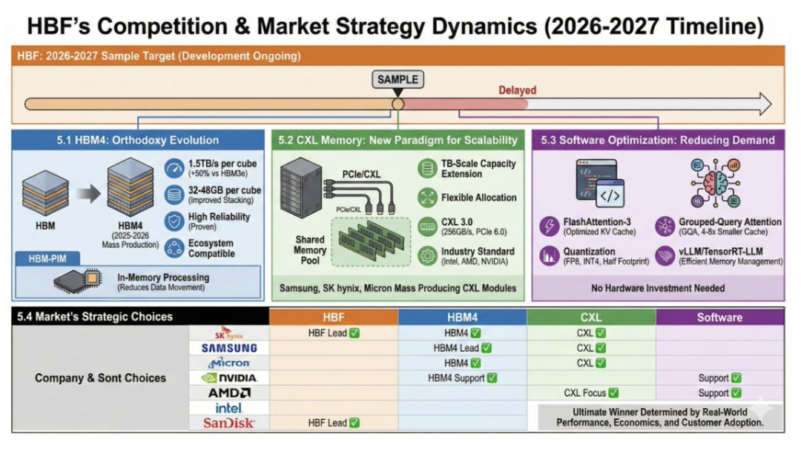

  

**HBM4：常规进化的力量**

  

SK海力士、三星和美光正集中精力研发HBM4。预计量产时间：2026年。

带宽：每立方体 1.5TB/s（比 HBM3e 提升 50%）

容量：每块 32-48GB（采用改进的堆叠技术）

可靠性：保持已验证的 HBM 可靠性

生态系统：与现有软件栈完美兼容

  

如果单GPU容量达到384GB（8个48GB显存单元）成为可能，HBF的“容量优势”就会缩小。此外，HBM4在延迟、可靠性和生态系统方面都已得到验证。

  

HBM-PIM（内存内处理）：三星的 HBM-PIM 技术在内存内部执行简单的操作（向量加法、激活），从而减少数据传输，提高有效带宽。它比 HBF 技术更具创新性，同时又依托于现有的 HBM 生态系统。

  

**CXL 内存：可扩展性的新范式**

  

Compute Express Link \(CXL\) 是一种通过 PCIe 连接 CPU/GPU 和内存的标准。CXL 2.0/3.0 支持内存池化：

  

容量扩展：多台服务器访问共享内存池。可实现TB级扩展。

灵活性：只分配所需资源。提高资源利用率。

带宽：CXL 3.0 基于 PCIe 6.0，传输速度为 256GB/s（x16 通道）。虽然低于 HBF，但其容量扩展性远胜于 HBF。

生态系统：英特尔、AMD、英伟达均支持。行业标准。

  

三星、SK海力士和美光已经开始量产CXL内存模块。这满足了HBF所针对的“大容量内存扩展”需求，但方式有所不同。

  

**软件优化：减少问题本身**

  

除了通过硬件增加内存外，通过软件减少内存使用量的方法也在快速发展：

  

FlashAttention-3：优化键值缓存访问模式，降低内存带宽需求。FlashDecoding++ 将长上下文推理的延迟降低至原来的三分之一。

分组查询注意力（GQA）：被 Llama 3 等最新型号采用。在保持性能的同时，将 KV 缓存大小减少 4-8 倍。

量化：FP8 和 INT4 量化可将内存占用减少一半甚至更少。NVIDIA H100/B200 原生支持 FP8。

vLLM、TensorRT-LLM：优化内存管理的推理引擎。分页注意力机制减少内存浪费，连续批处理提高内存利用率。

  

这些软件优化无需硬件投资即可降低内存压力。等到 HBF 投入生产时，我们可能根本就不需要那么多内存了。

  

**市场中的不同战略选择**

  

SanDisk 和 SK 海力士在 HBF 技术研发方面处于领先地位。有趣的是，其他主要内存厂商选择了不同的技术路线：

  

三星：专注于HBM4和HBM-PIM的研发。尚未发布HBF官方公告。

美光：开始供应HBM3e内存。扩大CXL内存产品线。未提及HBF内存。

NVIDIA：B200、GB200路线图采用基于HBM3e和NVLink的内存扩展策略。

AMD、英特尔：专注于构建CXL生态系统。

  

这表明业界正试图通过不同的技术途径解决同一个“大容量内存扩展”问题。HBF 是一种基于 NAND 的创新方案，HBM4 是对成熟技术的逐步改进，而 CXL 则专注于系统级可扩展性。每家公司似乎都根据自身的技术能力和市场定位选择了最佳策略。

  

最终哪种方法能在市场上胜出，将取决于实际的生产绩效、经济效益和客户接受度。

  

  

  

**HBF 为何依然重要**

**存储器公司的平台战略**

  

  

  

尽管HBF面临诸多挑战，但这项技术之所以备受关注，背后是存储器行业根本性的商业战略转变。传统上，存储器公司是商品供应商。无论是DRAM还是NAND，它们都按照标准化规格生产，并通过价格竞争来获取市场份额。这种模式的问题在于难以实现差异化和利润率低。

  

HBM的出现开始改变这种格局。HBM不仅仅是一种内存芯片，而是一个需要与GPU紧密集成的系统组件。它需要复杂的工程设计，包括TSV堆叠、散热管理、电源管理以及与GPU的接口优化。这为内存公司提供了提供更高价值产品和获得更高利润的机会。

  

HBF是这一趋势的延伸。它不仅提供内存，还提出了一种重新设计整个内存层次结构的解决方案。HBF系统是一个复杂的平台，集成了NAND闪存、SRAM缓冲器、DRAM、控制器和接口逻辑。这使得内存公司能够：

  

在系统架构层面与客户协作

将影响力扩展到软件栈（预取提示、数据放置优化等）

除了简单的价格竞争之外，还要创造技术差异化。

积累知识产权和技术诀窍以提高准入门槛

  

三星的HBM-PIM也遵循同样的理念。通过在内存内部添加计算功能，内存公司从单纯的存储设备供应商转型为计算架构的一部分。美光的CXL内存与之类似，它是一种平台解决方案，改变了服务器系统管理内存的方式。

  

从这个角度来看，HBF 的技术挑战并不一定意味着项目失败。即使 HBF 最终未能取代 HBM 在通用 AI 加速器市场的地位，内存公司也能从中获益：

  

异构存储器堆叠技术

使用NAND作为存储器的专业知识

与GPU/AI加速器供应商的系统级协作经验

可用于未来平台产品开发的知识产权积累

  

SK海力士与闪迪合作开发HBF技术，正是在此背景下展开的。SK海力士在DRAM和HBM领域占据主导地位，而闪迪则在NAND领域遥遥领先。此次合作是一项战略举措，旨在探索存储技术融合和平台化，超越单一产品的成功模式。

  

归根结底，HBF 不仅仅是“容量比 HBM 更大的内存”，它更是内存行业从商品化业务向平台化业务转型的一个例证。无论这款产品最终能否在市场上取得成功，这一转型方向本身对于内存行业的长期生存战略都至关重要。

  

  

  

**科技的承诺与现实的壁垒**

  

  

  

高带宽闪存最初带来了一个极具吸引力的承诺：拥有 HBM 级别的带宽、16 倍的容量以及低廉的 NAND 成本。它看起来似乎能够一举解决人工智能的内存瓶颈问题。

  

但深入分析SK海力士研究人员撰写的H³论文，就会发现要兑现这一承诺需要付出怎样的代价：

  

物理限制：NAND 单元 1-2 个数量级的延迟差异无法通过架构设计来克服。40MB 的 SRAM 缓冲区只是权宜之计，并非根本解决方案。

复杂性爆炸：在“廉价的 NAND”上添加 40MB SRAM、数十 GB DRAM、复杂的 FTL 控制器和困难的 TSV 堆叠，使得整个系统一点也不廉价。

脆弱的假设：H³ 假设的纯只读工作负载和确定性访问模式在实际生产中极其有限。

可靠性问题：NAND 闪存在 GPU 热环境下的老化、读取干扰和耐久性问题能否满足生产要求，目前尚不清楚。

市场冷漠：由于主要参与者保持沉默，而替代技术正在迅速成熟，HBF 的市场定位看起来不明朗。

  

这是否意味着HBF会失败？

  

不。SanDisk和 SK 海力士的技术能力毋庸置疑。他们会在 2026-2027 年的样品阶段证明这项技术有效。但“有效”和“成功”是两个不同的问题。

  

HBF的未来很可能是：

  

针对高度专业化的CAG工作负载，提供有效的利基解决方案

在一些对功率和容量平衡要求极高的特殊市场，例如边缘人工智能设备。

这是旨在弥补“HBM 和 SSD 之间的差距”的补充方案，而不是 HBM 的替代品。

技术始于美好的愿景，但必须克服现实的重重阻碍才能走向市场。HBF 目前就正面临着这道障碍。

  

  

  

**H³：面向低成本大语言模型推理的 HBM+HBF 混合架构**

  

  

  

摘要 

大语言模型（LLM）推理需要海量内存来处理长序列，而高带宽内存（HBM）的容量限制成为一大挑战。高带宽闪存（HBF）是一种基于 NAND 闪存的新型存储器件，其带宽可与 HBM 媲美，且容量大幅提升，但同时存在访问延迟更高、写入耐久性更差、功耗更大等缺点。本文提出一种混合架构 H³，旨在充分发挥 HBM 与 HBF 各自的优势，实现高效协同利用。

  

该架构将只读数据存储在 HBF 中，其余数据存放在 HBM 中。在相同 GPU 数量下，搭载 H³ 的系统可同时处理更多请求，使其非常适用于大语言模型推理中的海量只读场景，尤其是采用共享预计算键值缓存的场景。仿真结果表明，搭载 H³ 的 GPU 系统，其单位功耗吞吐量最高可达纯 HBM 系统的 2.69 倍。该结果验证了 H³ 在处理含海量只读数据的 LLM 推理时所具备的成本效益。

  

引言

大语言模型（LLM）持续发展，已从简单的聊天机器人逐步演进为科研助手、智能体 AI 与多模态 AI 。在这一发展过程中，大语言模型推理所需的序列长度急剧增长，例如最新的 Llama 4 已支持最长达 10M 量级的序列长度。目前已有大量研究致力于高效处理这类超长序列，以及面向多请求共享的长序列数据设计预计算键值缓存（KV cache）。当请求到达时，这些预计算的 KV cache仅被读取而不执行写入操作。在 LLM 推理中以这种方式处理极长序列需要极大的内存容量，并会产生大规模的 KV cache读取。以 Llama 3.1 405B 推理为例，1M 和 10M 长度的共享预计算 KV cache所需容量分别约为 540GB 和 5.4TB，仅存储这些数据就需要数十块 GPU。

  

从硬件角度看，高带宽内存（HBM）的容量难以满足 LLM 推理中不断增长的数据量。为弥补 HBM 的容量短板，研究人员提出了高带宽闪存（HBF）：它通过垂直堆叠 NAND 闪存来模拟 HBM 的结构。HBF 可提供与 HBM 相近的带宽，且容量远大于 HBM，但同时也存在访问延迟更高、写入耐久性更差、单位比特功耗更高等缺点。因此，需要能够扬长避短、充分发挥 HBF 优势的子系统架构与应用场景。

  

本文结合 HBF 的优缺点，提出一种可高效利用 HBF 的混合架构。

本文主要贡献如下：

提出H³混合架构，可高效协同利用 HBM 与 HBF；

探索与 H³ 高度适配的应用场景；

通过基于仿真的性能评估，验证 H³ 的成本效益。

  

**研究动机**

  

A. 海量只读应用场景

  

在大语言模型（LLM）推理过程中，许多数据类型呈现只读特性。例如，LLM 模型权重参数会被反复读取。以 Llama 3.1 405B 为例，采用 FP8 精度时，模型权重约需 405 GB 存储空间，这意味着每处理一个批次就会产生 405 GB 的读取量。

  

特别地，在近期受到广泛关注的缓存增强生成（CAG：cache-augmented generation）中，当 LLM 接收到查询时，会先读取大规模的共享预计算键值（KV）缓存，再进行计算并输出结果（图 1）。换言之，共享预计算 KV cache本质上是只读数据。在 CAG 中，注意力计算采用共享 KV 注意力机制，能够摊薄内存访问开销，因此即使使用较大批次，也不会带来明显的时延上升。通过增大批次大小，可以显著提升系统吞吐量。

  

然而，受限于 GPU 上高带宽内存（HBM）的容量不足，在大批次下运行 CAG 面临巨大挑战。若将海量的共享预计算 KV cache全部存放在 HBM 中，需要更多 GPU，从而大幅提升成本与整机功耗。

  

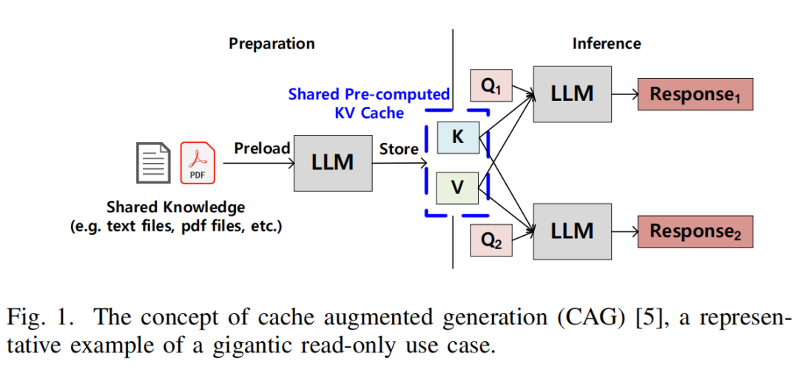

 *图 1 缓存增强生成（CAG）的概念，是海量只读应用场景的典型示例。*

  

B. 高带宽闪存

  

如图 2 所示，高带宽闪存（HBF）通过垂直堆叠 NAND 闪存裸片，并利用硅通孔（TSV）连接基底裸片与闪存裸片，从而实现高带宽。目前，多家存储与闪存厂商正在研发 HBF，目标是达到与 HBM 相近的带宽，同时提供远大于 HBM 的容量。由于 HBF 尚未商用，本文基于其目标设计指标展开研究。

  

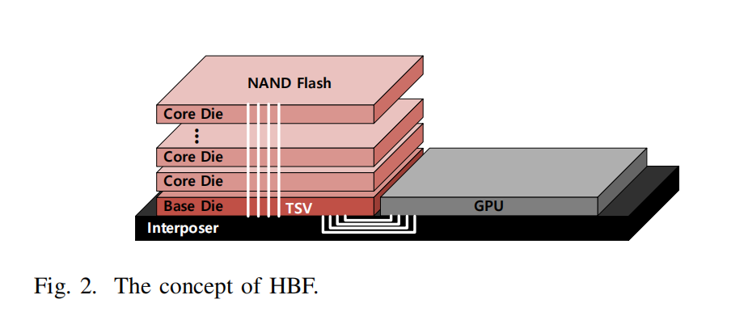

 *图 2 高带宽闪存（HBF）的概念。*

  

HBF 的预期优势：容量可达 HBM 的 16 倍；带宽与 HBM 相当。

  

HBF 的预期不足：访问时延更高（纳秒级 vs 微秒级）；写入耐久性更差；功耗最高可达 HBM 的 4 倍。

  

由于 HBF 优缺点鲜明，仅适合在特定场景下使用，而本节所述的海量只读场景正是其理想应用方向。HBF 的大容量可以存放超大 KV cache与模型权重；同时，由于数据为只读访问，HBF 写入耐久性差的缺点不再成为短板。本文后续将提出方案，用以克服 HBF 访问时延较高的问题。

  

**所提出的架构及其使用方式**

  

A. H³：使用 HBM 和 HBF 的混合架构

  

如 II-B 中所述，由于 HBF 是一种同时具有优点和缺点的器件，单独使用存在局限性。因此，我们提出 H³，一种同时利用 HBM 和 HBF 的混合架构，旨在凸显 HBF 的优势并弥补其不足。混合架构可以有多种实现方式。例如，一种方法是将 HBM 和 HBF 直接放置在 GPU 的管脚区域旁边。然而，这种方法的缺点在于，由于 GPU 上的管脚区域空间有限，会减少 HBM 的数量。

  

为了最大化 HBM 和 HBF 的带宽，如图 3 \(a\) 所示，H³ 中的 HBM 连接到 GPU 的管脚区域，并且 HBM 和 HBF 采用菊花链连接。在 HBM 基底裸片内部，存储器访问通过地址译码器与路由器被分为两条路径：一条访问 HBM，另一条访问 HBF。因此，GPU 可以通过 HBM 基底裸片直接访问 HBF（图 3 \(b\)）。

  

换句话说，HBM 和 HBF 共同作为 GPU 的主存。由于 HBM 和 HBF 均被用作主存，主机在访问 HBM 或 HBF 时使用划分了内存区域的统一地址空间（图 3 \(c\)）。

  

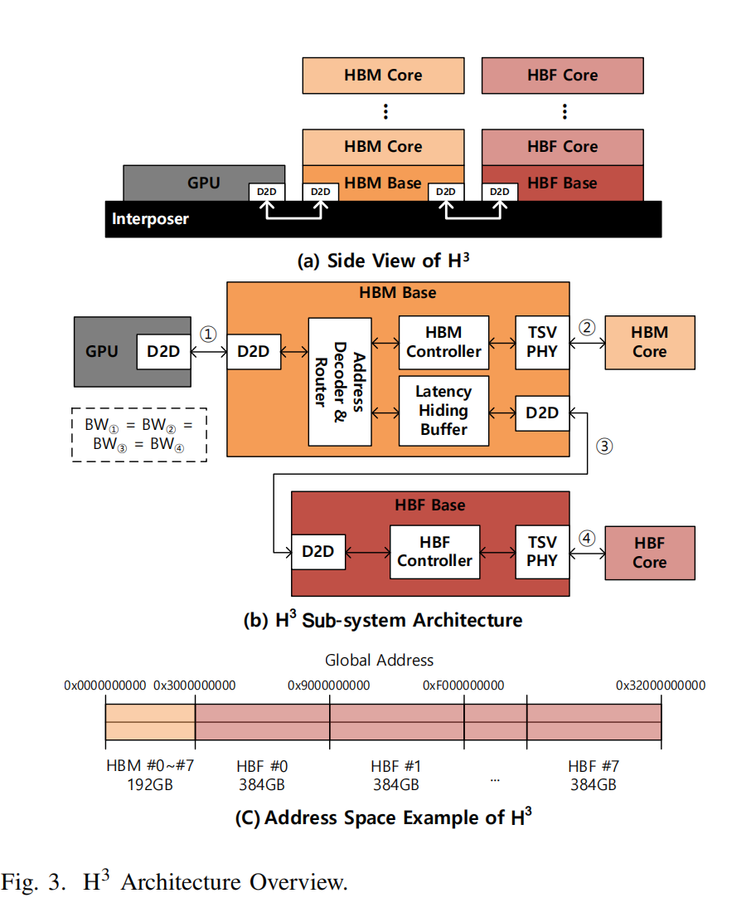

图 3 H³ 架构总览

  

在图 3 \(b\) 中，假设 GPU、HBM 基底裸片和 HBF 基底裸片通过裸片间（D2D）接口连接，并且 GPU 与 HBM 基底裸片之间的带宽等于每个基底裸片与核心裸片之间的带宽。我们同样假设 HBM 和 HBF 控制器位于各自的基底裸片上。这一点可以根据芯片面积情况进行调整。

  

B. 使用方式：面向海量只读数据的大语言模型

  

H³ 适用于具有 II 中所述的海量模型权重和共享预计算键值（KV）缓存的大语言模型推理。这些海量且只读的数据非常适合使用容量大但写入耐久性有限的 HBF。因此，模型权重和共享预计算 KV cache被存储在 HBF 中。此外，生成的 KV cache和其他数据被存储在 HBM 中。图 4 说明了其工作方式。在图 4 中，访问 HBF 时可能会增加跳转时延，但由于大语言模型推理受内存带宽限制，跳转时延可以被充分隐藏。

  

由于大语言模型推理的数据访问模式是确定性的，我们期望在深度学习框架的支持下，可以将数据合理分配到 HBM 和 HBF 中。处理某一特定运算可能需要同时使用存储在 HBM 和 HBF 中的数据。但是，由于运算所需的张量可以被准确预测，因此可以实现张量级调度，从而使得 HBM 和 HBF 之间的争用可控。

  

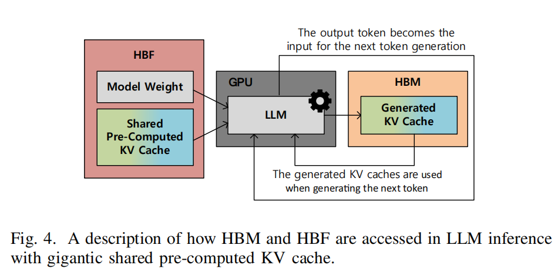

 *图 4 在包含海量共享预计算键值缓存的大语言模型推理中，HBM 与 HBF 的访问方式说明*

  

将 H³ 应用于海量只读场景的优势在于，它支持更大的容量，从而可以在相同数量的 GPU 下实现更大的批次处理。更大的批次处理能够提升吞吐量，最终在运行大语言模型推理系统时降低成本。将 HBF 用于只读场景还具有减少垃圾回收和损耗均衡开销的额外好处。

  

C. 优化：时延隐藏缓冲区

  

由于 HBF 本质上基于 NAND 闪存，其访问时延比 HBM 更长。因此，隐藏其长时延对于将其用作内存至关重要。为了弥补 NAND 闪存的长时延，时延隐藏缓冲区（LHB）—— 一种预取缓冲区 —— 被集成到 H³ 的 HBM 或 HBF 的基底裸片中（在图 3 \(b\) 中，LHB 位于 HBM 的基底裸片中）。对于大语言模型推理，只有前一层完成后才能处理下一层，并且一层中计算所需的模型权重和 KV cache是预先确定的。

  

换句话说，大语言模型推理具有确定性和顺序性的数据模式。因此，可以提前准确预测计算所需的数据，并通过将计算所需的数据持续载入 LHB 来隐藏 NAND 闪存的时延。为了有效利用 LHB，需要修改深度学习框架以提供预取提示。由于预取提示是确定性的，并且预取数据单元为粗粒度的张量级，预取开销预计很小。LHB 的预期大小和芯片面积开销将在后面讨论。

  

**四、评估**

  

A. 实验设置

  

1）方法：由于 HBF 是处于开发阶段的器件，无法进行实际测量。因此，本文基于已在先前研究中得到验证的解析建模，开发了一款内部仿真器，用于评估搭载 H³ 系统的性能。该内部仿真器根据计算时间、数据传输时间以及 GPU 之间的通信时间，估算执行时间、吞吐量、单位功耗吞吐量。计算时间基于 LLM 模型的运算量与 GPU 性能进行计算。

  

HBM 与 HBF 的数据传输时间基于 LLM 模型大小、KV cache大小以及器件带宽进行计算。在计算数据传输时间时，通过考虑张量并行（TP）与数据并行，对数据进行划分与复制以优化性能。此外，GPU 之间的通信时间在假设采用张量并行时所使用的环形全规约（ring all-reduce）的前提下进行计算。

  

2）工作负载：本文选用 Llama 3.1 405B 作为性能评估的工作负载。所选的 Llama 3.1 405B 具有足够的代表性，因为其规模足以与最新的前沿大语言模型相当，且预计算 KV cache与上下文窗口长度相关，而与模型权重大小无关。原始的 Llama 3.1 405B 上下文窗口为 128K，为评估长序列处理性能，本文假设其支持 1M 与 10M 长度。本文假设输入序列长度（ISL）与输出序列长度（OSL）均为 1K，除 ISL 与 OSL 之外的剩余空间由共享预计算 KV cache占用。在当前实验环境下，对于 1M 与 10M 场景，共享预计算 KV cache分别占用总容量的约 35% 与 84%。

  

3）HBF 参数：本文假设所使用的 GPU 为当前最新的 B200。B200 搭载 HBM3e，单 GPU 支持 192GB 容量与 8TB/s 带宽（每个 Cube 为 24GB、1TB/s）。基于 II-B 中 HBF 的相对性能，本文假设 HBF 容量为 3TB，约为 HBM3e 的 16 倍，带宽为 8TB/s，与 HBM3e 相同。结合当前 NAND 闪存的单 Cube 容量与单位比特功耗，本文假设 HBM3e 与 HBF 的单 Cube 热设计功耗（TDP）分别为 40W 与 160W。功耗估算基于当前 NAND 闪存技术。但本文预计，在 HBF 开发过程中通过功耗优化，其功耗将进一步降低。

  

4）硬件配置：本文假设采用 DGX 风格系统。序列长度 1M 的实验使用 8 块 GPU，序列长度 10M 的实验使用 32 块 GPU。这些 GPU 数量是纯 HBM 场景下运行对应序列长度所需的最小 GPU 数量。因此，在 10M 场景中，GPU 服务器之间的通信通过横向扩展互联（如 InfiniBand）实现，而非纵向扩展互联（如 NVLink）。

  

B. 实验结果

  

1）批次大小：通过将海量共享预计算 KV cache存储在 HBF 中，HBM 可获得更多空闲容量，使得搭载 H³ 的 GPU 能够处理更大的批次大小。图 5 展示了在 1M 与 10M 场景下，可处理的批次大小随 GPU 数量的变化情况。在图 5 \(a\) 所示的 1M 场景中，使用 H³ 可处理的批次大小最大为纯 HBM 方案的 2.6 倍。类似地，在图 5 \(b\) 所示的 10M 场景中，使用 H³ 可使批次大小最大达到纯 HBM 方案的 18.8 倍。提升吞吐量的因素有多种，但增大批次大小显然是最重要的因素。

  

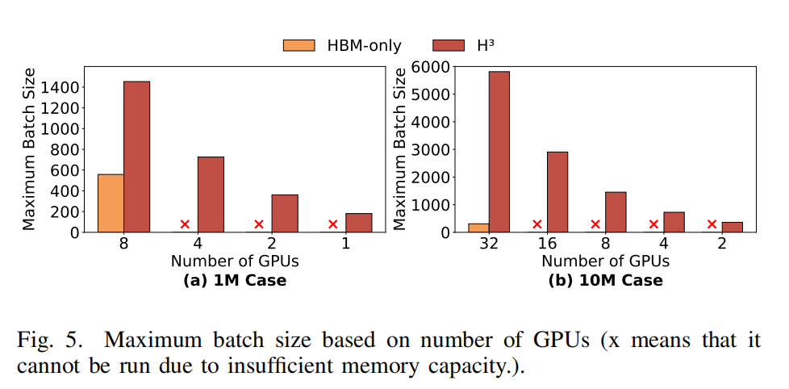

 *图 5 基于 GPU 数量的最大批次大小（× 表示因内存容量不足无法运行）*

  

一个值得关注的现象是，搭载 H³ 的单 GPU 即可运行 1M 场景，仅需两块 GPU 便可运行 10M 场景。这一结果表明，尽管性能会有所下降，但可以以极低的成本处理长序列。

  

2）吞吐量：处理更大的批次大小可带来吞吐量的提升。图 6 展示了每秒token数（TPS）/ 请求，这一吞吐量指标主要由 LLM 推理系统的批次大小与执行时间决定。在 1M 场景下 H³ 的吞吐量为纯 HBM 方案的 1.25 倍，在 10M 场景下为 6.14 倍。这意味着采用 H³ 可在相同执行时间内生成更多token，直接降低 LLM 服务成本。此外，由该结果可预测，随着序列长度增加，吞吐量差距将进一步扩大。

  

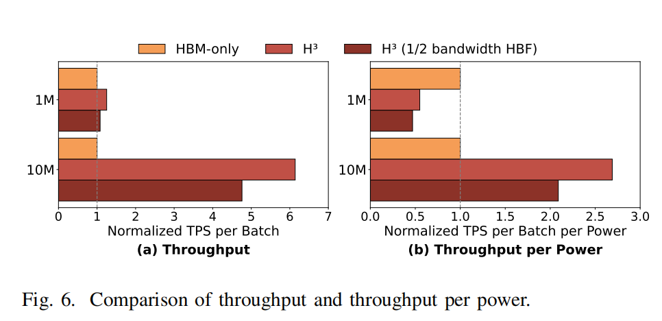

图 6 吞吐量与单位功耗吞吐量对比

  

3）单位功耗吞吐量：为证明尽管增加了功耗更高的 HBF，H³ 仍具备更高的成本效益，本文还开展了单位功耗吞吐量评估。单位功耗吞吐量由仿真得到的吞吐量除以总热设计功耗（包含 GPU 功耗，假设无 HBM/HBF 时为 680W ）计算得到。如图 6 \(b\) 所示，尽管搭载 H³ 的 GPU 热设计功耗更高，但其单位功耗吞吐量最高可达纯 HBM 方案的 2.69 倍。这些结果表明，H³ 可高效低成本地处理海量只读型 LLM 推理任务。

  

4）HBF 带宽降低：尽管本文假设 HBF 带宽与 HBM 相同，但在产品化过程中的实际问题可能导致其支持更低的带宽。因此，本文探究将 H³ 中 HBF 带宽减半对性能的影响。图 6 表明，即使 HBF 带宽减半，在 1M 场景下 H³ 的吞吐量仍优于纯 HBM 方案。此外，在 10M 场景下，H³ 的单位功耗吞吐量仍为纯 HBM 方案的 2.09 倍。对于 H³ 而言，由于并非所有数据都存储在 HBF 中，整体性能不会随 HBF 带宽的降低而同比例下降。

  

C. 时延隐藏缓冲区的芯片面积开销

  

为计算芯片面积开销，首先需要确定 LHB 的容量需求。其由 HBF 的带宽与访问时延计算得到。为不间断地以满带宽向 GPU 提供数据，本文采用双缓冲机制。

  

CapacityLHB = 2 × BWHBF × LatencyHBF . \(1\)

  

容量 LHB = 2 × BW HBF × 时延 HBF . \(1\)

  

式（1）中，容量 LHB、BW HBF、时延 HBF 分别表示 LHB 大小、HBF 单 Cube 带宽与 HBF 访问时延。根据 IV-A，BW HBF 为 1TB/s。基于公开的 SLC NAND 闪存读取访问时延，本文假设时延 HBF 为 20µs。因此，LHB 的容量需求为 40MB。由于当前商用 NAND 闪存产品中观测到的 20µs 时延在 HBF 商用后预计会进一步改善，LHB 的容量需求预计将低于 40MB。

  

基于容量需求可计算 LHB 的芯片面积。考虑到未来 HBF 商用时的基底裸片工艺，本文假设采用最新的 3nm SRAM。已知 3nm SRAM 的比特密度为 0.021µm²。因此，40MB SRAM 核的面积为 6.72mm²。假设额外电路带来 20% 的开销，总面积估算为 8.06mm²。这约为 121mm² 基底裸片面积的 6.7%，考虑到基底裸片的可用空间，该值处于可接受范围。作为参考，121mm² 是当前已商用 HBM 的基底裸片面积，预计未来 HBM 与定制 HBM 的面积将进一步增大。

  

**结论与未来工作**

  

本文提出了 H³ 混合架构，通过有效整合高带宽内存（HBM）与高带宽闪存（HBF），解决了长序列大语言模型推理中 HBM 容量受限的问题。H³ 利用大语言模型工作负载的确定性特征对数据进行合理布局：将海量只读的共享键值（KV）缓存与模型权重存储在 HBF 中，将频繁访问的动态生成 KV cache存储在低延迟的 HBM 中。为缓解 HBF 固有的高延迟问题，本文引入了时延隐藏缓冲区。仿真结果表明，与纯 HBM 架构相比，所提架构能够支持显著更大的批次大小，且单位功耗吞吐量最高提升 2.69 倍，证明其在构建面向海量只读数据的低成本高效益 LLM 推理基础设施方面具有巨大潜力。

  

H³ 是利用 HBF 的多种架构之一。HBM 与 HBF 存在多种协同使用方式（例如 HBM 与 HBF 混合堆叠），在某些场景下甚至可以单独使用 HBF。因此，未来工作将重点探索能够充分发挥 HBF 优势的最优架构，以及适用于 HBF 的其他应用场景。

  
  

\*免责声明：本文由作者原创。文章内容系作者个人观点，半导体行业观察转载仅为了传达一种不同的观点，不代表半导体行业观察对该观点赞同或支持，如果有任何异议，欢迎联系半导体行业观察。

  

 ***END***

  

**今天是《半导体行业观察》为您分享的第 4323期内容，欢迎关注。**

  

**推荐阅读**

  

★[一颗改变了世界的芯片](https://mp.weixin.qq.com/s?__biz=Mzg2NDgzNTQ4MA==&mid=2247732748&idx=1&sn=2ba19055f90ac8ab5512098d039ef391&chksm=ce6e4cfbf919c5eddc8b3af5a147990afc3c7227f59c332d15ed5f8b8a100a4dcb97f59d05d1&scene=21#wechat_redirect)

★[美国商务部长：华为的芯片没那么先进](https://mp.weixin.qq.com/s?__biz=Mzg2NDgzNTQ4MA==&mid=2247735441&idx=6&sn=786b62b5f4edbac37b66f91ff36d0f49&chksm=ce6e5a66f919d37052778a97f49442c77529699f08f3dcf599c99347dcf35da064528aab5222&scene=21#wechat_redirect)

★[“ASML新光刻机，太贵了！”](https://mp.weixin.qq.com/s?__biz=Mzg2NDgzNTQ4MA==&mid=2247738477&idx=1&sn=636a6387c4e83b7e47e6377aba07f8d4&chksm=ce6e269af919af8cc2bfddf1dff60566bfd0169eb1c31d97413c6f97abe8d307cda0b58cc795&scene=21#wechat_redirect)

★[悄然崛起的英伟达新对手](https://mp.weixin.qq.com/s?__biz=Mzg2NDgzNTQ4MA==&mid=2247741738&idx=1&sn=860c31832b6c6e03b152300b991be5f9&scene=21#wechat_redirect)

★[芯片暴跌，全怪特朗普](https://mp.weixin.qq.com/s?__biz=Mzg2NDgzNTQ4MA==&mid=2247746259&idx=1&sn=f9a5a82f84e598d0f2d8b8d2cb1d371e&chksm=ce6e0024f919893285b3069f01821e6bd47cb772c890cacf88874707e1576ecc3d7673290afb&scene=21#wechat_redirect)

★[替代EUV光刻，新方案公布！](https://mp.weixin.qq.com/s?__biz=Mzg2NDgzNTQ4MA==&mid=2247732748&idx=1&sn=2ba19055f90ac8ab5512098d039ef391&scene=21#wechat_redirect)

★[半导体设备巨头，工资暴涨40%](https://mp.weixin.qq.com/s?__biz=Mzg2NDgzNTQ4MA==&mid=2247723271&idx=7&sn=1e4f5124fa7d3f029e4c212823633e1e&scene=21#wechat_redirect)

★[外媒：美国将提议禁止中国制造的汽车软件和硬件](https://mp.weixin.qq.com/s?__biz=Mzg2NDgzNTQ4MA==&mid=2247756729&idx=8&sn=7763455e2146a96c6c5945c7092c9c90&scene=21#wechat_redirect)

  

加星标⭐️第一时间看推送

  

  

求点赞

  

求分享

  

求推荐

  

