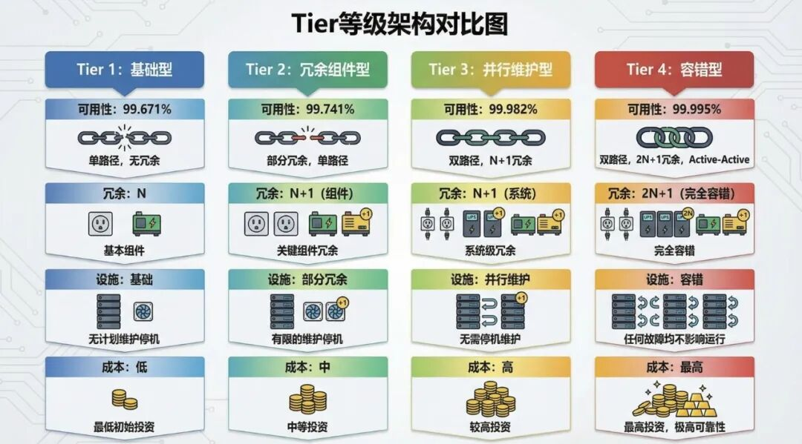

📚 技术科普

# 什么是Tier等级？  
数据中心可靠性标准详解

阅读时间：6分钟 | 难度：⭐⭐⭐☆☆

📖 本文导航

① Tier等级的起源 ② 四个等级详解 ③ 如何选择等级 ④ 认证与常见误区

💡 一句话概括

Tier等级是衡量数据中心基础设施可靠性的国际标准，从Tier I到Tier IV，等级越高，冗余越多，可用性越高，当然造价也越贵。

## 01 / Tier等级的起源

Tier分级标准由美国**Uptime Institute** （正常运行时间协会）于1995年提出，是目前全球最权威、应用最广泛的数据中心可靠性评价体系。

🏛️ 关于Uptime Institute

Uptime Institute是一家独立的咨询机构，专注于数据中心性能标准的研究和认证。其Tier认证已成为全球数据中心行业的"黄金标准"，被金融、互联网、政府等行业广泛认可。

🔍 Tier等级衡量什么？

**• 冗余程度：** 关键设备是否有备份？

**• 容错能力：** 单点故障是否会导致业务中断？

**• 可维护性：** 维护设备时是否需要停机？

**• 可用性：** 全年能正常运行多长时间？

💬 什么是"可用性"？

可用性 = 正常运行时间 ÷ 总时间 × 100%  
  
例如：99.99%的可用性意味着全年停机时间不超过**52.6分钟** 。这对金融交易、在线支付等业务至关重要。

## 02 / 四个等级详解

Tier标准将数据中心分为四个等级，等级越高，基础设施越完善，可靠性越高。

Tier I 基本型 Basic

**可用性：** 99.671%（年停机约28.8小时）  
**冗余架构：** N（无冗余）  
**供电路径：** 单路市电 + 单路UPS  
**制冷路径：** 单路制冷系统  
**维护影响：** 任何维护都需要停机  
**典型场景：** 小型企业、非关键业务、开发测试环境

Tier II 冗余组件型 Redundant Components

**可用性：** 99.741%（年停机约22小时）  
**冗余架构：** N+1（关键组件有备份）  
**供电路径：** 单路市电 + 冗余UPS模块  
**制冷路径：** 单路制冷 + 冗余空调  
**维护影响：** 部分维护仍需停机  
**典型场景：** 中小企业、一般办公应用

Tier III 可并行维护型 Concurrently Maintainable

**可用性：** 99.982%（年停机约1.6小时）  
**冗余架构：** N+1（双路配电）  
**供电路径：** 双路市电 + 双路UPS  
**制冷路径：** 双路制冷系统  
**维护影响：** ⭐ 所有设备可在线维护，无需停机  
**典型场景：** 互联网企业、电商平台、大型企业核心业务

Tier IV 容错型 Fault Tolerant

**可用性：** 99.995%（年停机约26分钟）  
**冗余架构：** 2N或2N+1（完全冗余）  
**供电路径：** 双路独立市电 + 双套UPS系统  
**制冷路径：** 双套独立制冷系统  
**维护影响：** ⭐ 任何单点故障不影响业务运行  
**典型场景：** 金融核心交易、医疗关键系统、政府核心业务

📊 四个等级核心指标对比

指标| Tier I| Tier II| Tier III| Tier IV  
---|---|---|---|---  
可用性| 99.671%| 99.741%| 99.982%| 99.995%  
年停机| 28.8h| 22h| 1.6h| 26min  
冗余| N| N+1| N+1| 2N/2N+1  
配电路径| 单路| 单路| 双路| 双路独立  
在线维护| ✗| 部分| ✓| ✓  
建设成本| $| $$| $$$| $$$$  
  
  

  

▲ 图1：Tier I~IV 等级架构对比图

## 03 / 如何选择合适的等级？

并非等级越高越好，**应根据业务重要性、停机损失、预算等因素综合考虑** 。以下是不同场景的建议：

🏢 中小企业 / 一般办公

**推荐等级：** Tier I 或 Tier II  
**理由：** 业务对连续性要求不高，停机影响有限，优先考虑成本。可使用云服务商的基础配置。

🛒 电商 / 互联网企业

**推荐等级：** Tier III  
**理由：** 业务7×24运行，停机直接导致收入损失。需要支持在线维护，保障促销活动期间稳定。

🏦 金融 / 证券交易

**推荐等级：** Tier IV  
**理由：** 监管合规要求高，停机可能导致巨额罚款和声誉损失。必须具备容错能力。

🏥 医疗 / 政府核心系统

**推荐等级：** Tier III+ 或 Tier IV  
**理由：** 涉及生命安全和公共服务，停机影响重大。需主备双活或异地容灾架构。

💰 建设成本参考（单位：元/平方米）

**Tier I：** 8,000 - 12,000  
**Tier II：** 12,000 - 18,000  
**Tier III：** 18,000 - 30,000  
**Tier IV：** 30,000 - 50,000+  
  
注：实际成本受地区、规模、设备品牌等因素影响，仅供参考。

## 04 / Tier认证与常见误区

✅ Uptime Institute三种认证

**1\. TCDD（设计文件认证）：** 审核设计方案是否符合Tier标准  
**2\. TCCF（建造设施认证）：** 验证实际建造是否与设计一致  
**3\. TCOS（运营可持续认证）：** 评估运营团队的管理能力  
  
💡 完整认证需通过全部三项，每年需复审。

⚠️ 常见误区

❌ 误区1："我们是Tier 3+机房"

Uptime Institute标准中只有Tier I/II/III/IV四个等级，不存在Tier 3+、Tier 3.5等说法。这类表述通常是营销话术，需谨慎评估实际配置。

❌ 误区2：设备达标 = 整体达标

Tier评估的是整体基础设施，包括供电、制冷、消防、安防等全链路。仅UPS或空调达到冗余要求，不代表整体达标。**"木桶原理"——最短板决定整体等级。**

❌ 误区3：Tier IV一定比Tier III好

Tier IV成本高出60%-100%，但可用性仅提升约0.01%。对于大多数互联网业务，Tier III配合良好的运维管理，性价比更高。

❌ 误区4：通过认证 = 永久有效

Tier认证有时效性，特别是TCOS运营认证需要每年复审。设备老化、运维变更都可能导致实际等级下降。

🇨🇳 中国国标与Tier对照

中国《数据中心设计规范》GB 50174将数据中心分为A/B/C三级：  
  
**A级** ≈ Tier III~IV（容错型，金融/政府核心）  
**B级** ≈ Tier II~III（冗余型，大型企业）  
**C级** ≈ Tier I~II（基本型，一般办公）  
  
注：两套标准评估维度不完全相同，对照仅供参考。

### 🎯 知识小测试

问题1：某数据中心可在不停机情况下维护任何设备，但单点故障会导致业务中断，这是哪个等级？

A. Tier II B. Tier III C. Tier IV D. 无法判断

**答案：B**  
解析：Tier III的核心特点是"可并行维护"，但不具备容错能力。Tier IV才能做到单点故障不影响业务。

问题2：Tier IV数据中心的理论年停机时间约为？

A. 约1.6小时 B. 约26分钟 C. 约5分钟 D. 0分钟

**答案：B**  
解析：Tier IV可用性为99.995%，对应年停机时间约26分钟。1.6小时是Tier III的水平。

### 📝 本文小结

**1.** Tier等级是衡量数据中心可靠性的国际标准，由Uptime Institute制定  
  
**2.** 四个等级从低到高：Tier I（基本）→ II（冗余）→ III（可维护）→ IV（容错）  
  
**3.** 选择等级应综合考虑业务重要性、停机损失、预算等因素  
  
**4.** 警惕"Tier 3+"等营销话术，关注完整认证和实际配置

📚 推荐阅读

• Uptime Institute官网（uptimeinstitute.com）  
• 《数据中心设计规范》GB 50174-2017  
• 《数据中心基础设施运行维护标准》GB/T 51314