工作流是让工具去适应创作者。

整理/大田&林致

在今天的2026GDC（Game Developers Conference，游戏开发者大会）现场，叠纸游戏分享了《恋与深空》的剧情演出管线设计。

《恋与深空》全球注册用户超过8000万，这么多用户的游戏体验背后，是一个超过300人的创作团队，涵盖了文案、分镜、动画等多个工种。为了让这300多人高效协同，《恋与深空》团队用六年时间，打磨出了一套面向开发者的内部管线，避免在繁杂的数据转换和跨部门沟通中陷入混乱。

**以下是经过整理的演讲 《Building the Cinematic Pipeline for Love and Deepspace（构建《恋与深空》剧情演出管线）》具体内容：**

大家刚刚看过《恋与深空》的短片，这些画面背后，其实是一个相当庞大的制作团队在支撑。要持续不断地生产庞大体量的剧情演出内容，我们需要一套非常高效且健壮的工具集。为了实现这个目标，我们的管线设计始终围绕着三个核心理念展开：

  * **原生创作****工作流****（Creative-Native Workflows）****：** 管线必须能自然地契合创意团队的工作习惯，这包括文案、叙事设计师以及剧情演出美术。

  * **实时迭代****（****Real-time****Iteration）****：** 创作者必须能够直接在引擎内对他们的工作进行即时预览和修改。

  * **生产规模护栏 （Production-scale Guardrails）：**我们需要一套系统，帮助团队在这样大规模的生产中维持内容的一致性和稳定性。

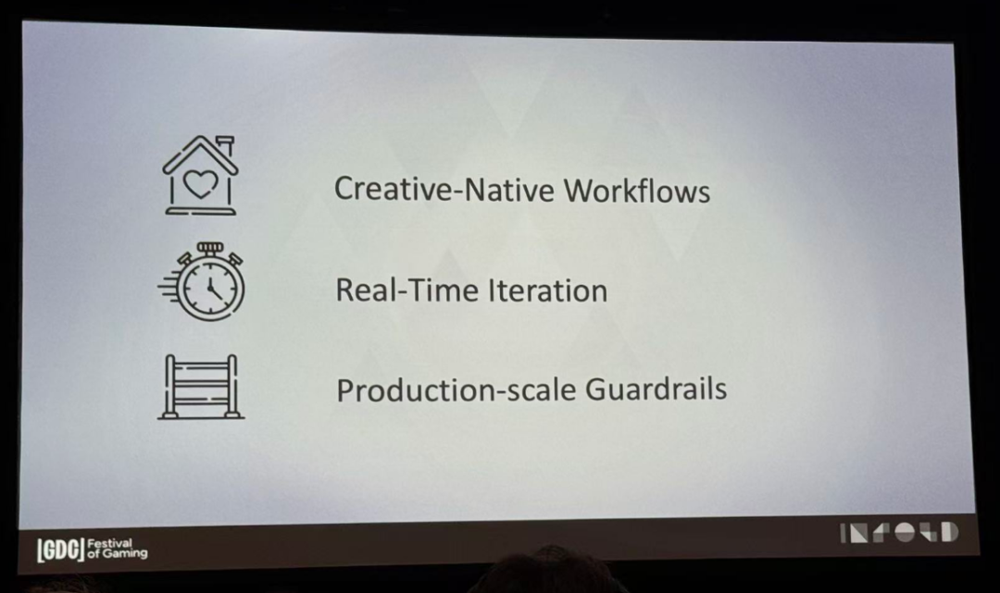  

###   

**01**

**原生创作工作流**

要理解原生创作工作流的重要性，先来看看我们整体的工作流。

流程从剧本撰写开始，接着是分镜设计、语音录制、动画制作，最后所有资产整合到游戏引擎中，和玩法系统组装起来。听起来很简单吧？

但实际上，我们早期的工作流程是这样的：

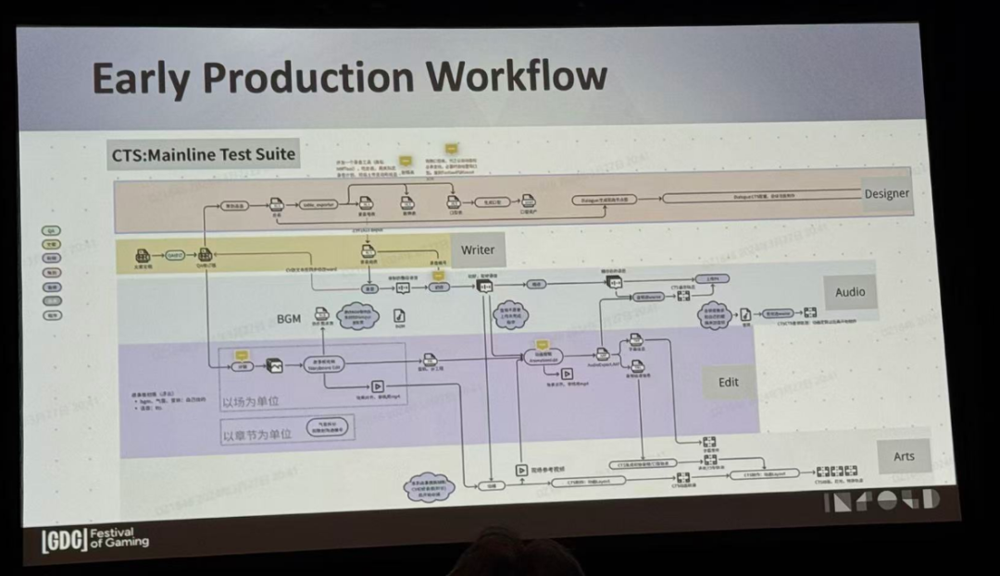

如你所见，不管是数据流还是工作流都相当复杂。

文案们用一套系统自己的系统来标记说话人、记录配音语气提示。音频团队则需要导出单独的录音脚本，因为配音演员在录音时可能会即兴发挥调整台词，或者拆分长句。策划们则需要追踪变动，及时更新。

**那么，为什么管线会变成这么复杂呢？第一个原因是，不同的工种天生就偏好不同的工具。** 文案更习惯在Word里工作，而策划则习惯使用Excel里管理对话数据。甚至同样使用Excel，不同团队使用的表格式也往往完全不同。

**第二个原因在于，每个工种都需要有附加数据。** 策划需要管理对话ID和分支逻辑，而音频团队则需要录音备注和语音相关的元数据。

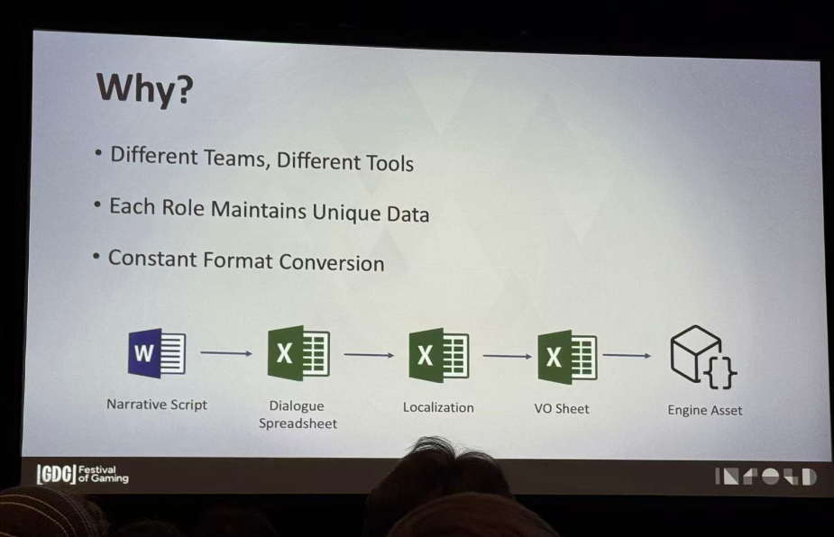

因此，数据必须在各种格式之间不断转换，最后再导入到游戏引擎中。而且每一次转换，都会增加版本控制和数据同步的复杂性。

为了解决这个问题，我们需要统一且灵活的方式来管理对话元数据。所有的对话ID、台词类型、录音备注以及其他生产数据，都需要放在一个中心化的系统里，同时又要保证只有相应的权限角色才能查看和编辑。

但光解决数据问题是不够的，我们还得确保这个工具让使用者觉得顺手。文案写对话应该就像在Word里打字一样；音频团队准备录音时应该像在用电子表格。

**换句话说，是工具去适应创作者的****工作流****，而不是反过来。**

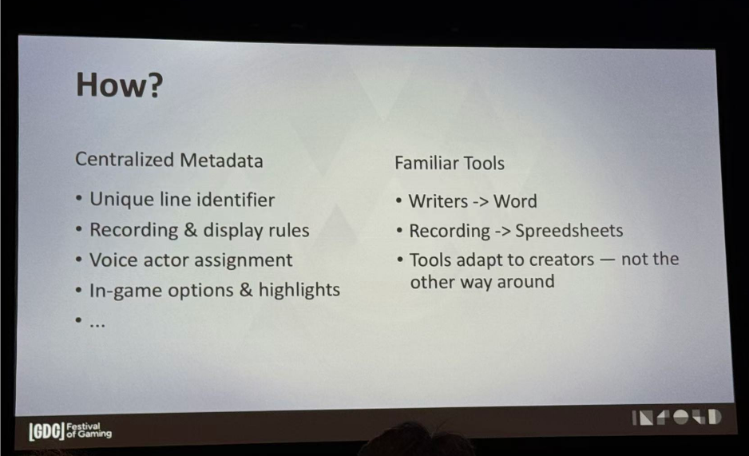

**为此，我们开发了一款名叫“剧情编辑器” （Story Editor）的工具。**对文案来说，它属于开箱即用，文案只需要直接打字就行了，这是一个键盘优先的工作流。

我们在这个文档的形式中加入了一些结构化的设计。在左侧，每一行都有明确的角色定义，告诉系统当前是谁在说话，这段对话属于哪个场景，以及玩家在这个对话节点是否可以做出选择。当然，我们也能访问所有的元数据。

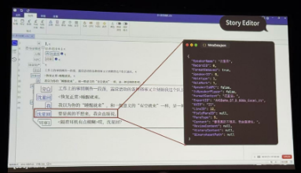

所有的叙事上下文都集中在了一个地方，再也不需要在不同工具之间进行格式转换了。而且因为这个系统是基于架构的，我们可以在需要时轻松添加新的元数据字段，同时保持所有的内容向前兼容。

评审工作流对我们来说也非常重要，我们让这部分体验尽量贴近Word，评审人员可以留下批注建议修改，或者直接使用修订模式修改文本，作者可以逐一过一遍这些修改，选择接受或拒绝。

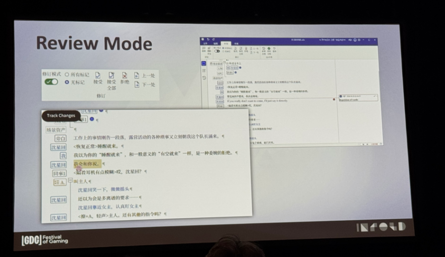

当进入语音录制阶段时，可以将编辑器切换到录音模式。在这个模式下，界面会变成一个类似电子表格的视图，看起来非常像Excel。

这让音频团队能够规划和管理录音批次、追踪进度。录制完成后，他们可以把音频和剧本进行对比，预览语音台词，并管理不同的版本。最后一键把数据和音频资产同步到语音项目中。

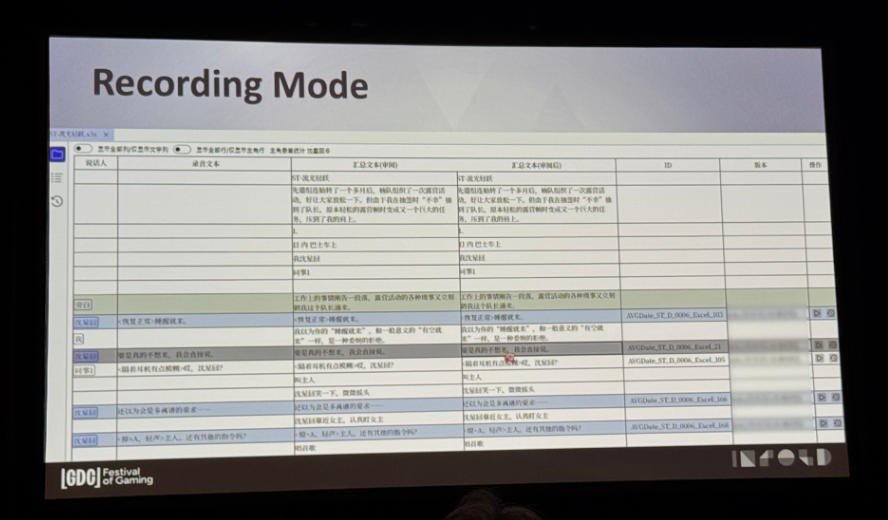

到这里，整个早期的叙事工作流已经被整合到了一个单一的工具中。“剧情编辑器”管理着统一的数据流，同时还为不同工种保留了他们熟悉的工作环境。

我们还在它之上构建了一个SDK，允许团队开发额外的插件和自动化工具，进一步提升生产效率。

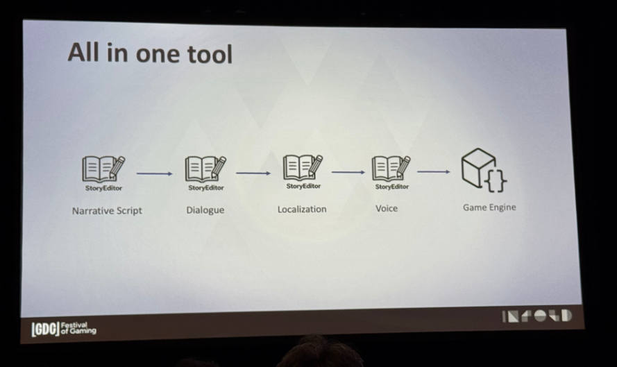

###   

###   

**02**

**实时迭代**

相比早期的创意阶段，动画生产的后期阶段要繁重得多，不同部门之间的迭代很常见。严格的线性工作流会让跨部门的修改极其痛苦。

**所以，我们真正需要的是贯穿整个管线的快速、实时的迭代。**

动捕是生产管线的核心部分。在传统的动捕工作流中，表演数据会流入到DCC（数字内容创作）工具里进行预览，比如MotionBuilder或Maya。

**为了更好地与之契合，我们搭建了一个叫“导演工作室” （Director Studio）的内部系统。**

这个系统将动作捕捉、面部捕捉和摄像机数据整合到了一个统一的系统中。它还能把表演数据实时流传输到实际的游戏内角色和环境中。这大大缩小了动捕预览和最终游戏内效果之间的差距，让导演和演员在制作过程中能做出更准确的决策。

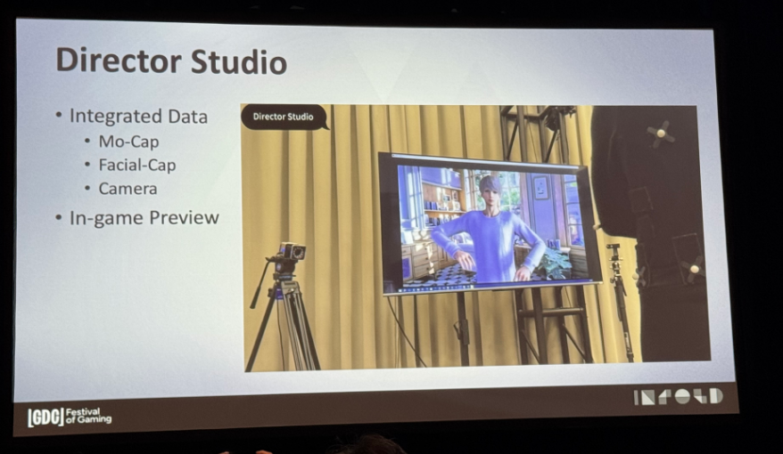

在动作捕捉和动画打磨之后，所有的东西都会被组装到时间轴上，同时加上剪辑和录制好的对话，形成一系列的过场动画。**这些都是在我们的过场动画编辑器里完成的。**

这张截图展示了我们过场动画编辑器的不同面板。每一个过场片段都是由几十条，有时甚至几百条轨道和剪辑片段构成的，每一条轨道代表一个特定的功能。所有的轨道都可以进行实时预览和编辑。美术们就是在这里把所有不同的表演元素组装成最终的过场动画效果。

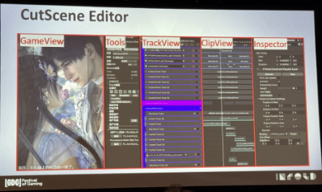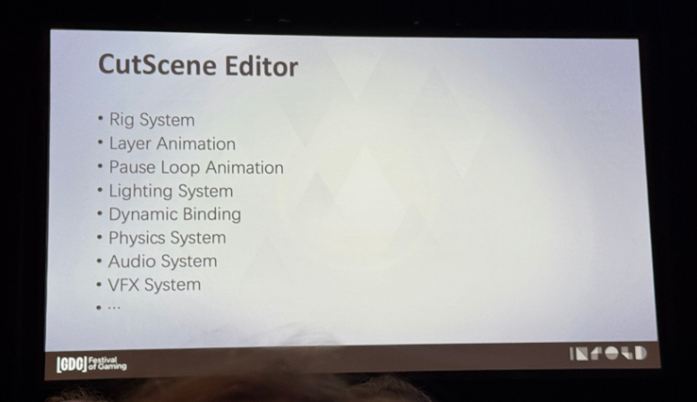

总的来说，这个编辑器包含十几个子系统和许多不同的轨道类型，以支持各种各样的过场动画创作需求。但由于今天时间有限，我重点讲其中四个。

**第一个是细粒度控制器 （Fine-grained Controllers）。**

像前面提到的，过场动画制作中的一个常见痛点，就是在管线后期进行精细的动画调整。比如，将角色的视线与摄像机对齐、协调与道具的交互、或者微调角色之间微妙的互动。

如果通过反复导入导出资产来做这些事，效率会极低，livelink也无法提供动画师所需要的那种响应速度。

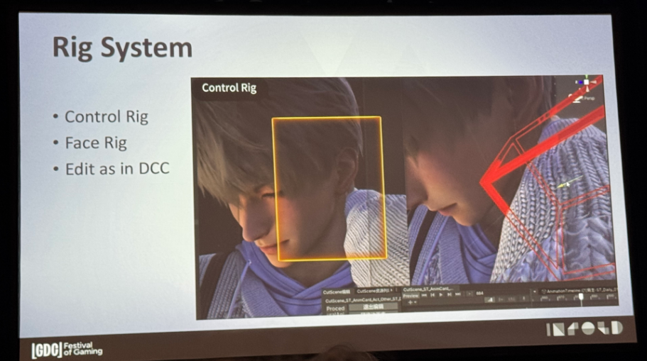

为了解决这个问题，我们在引擎内部直接实现了一套DCC级别的细粒度控制器。这允许动画师在实时调整表演的同时，能跟灯光、技术摄像机等其他部门协同工作，从而确保最佳的最终效果。

**第二个是分层动画 （Layer Animation）。**

动画师会创建可复用的动画片段，可以根据场景需求进行组合。在生产过程中，美术可以选择合适的动画层，并调整它们的权重和播放速度，以达到理想的表演效果。

这样，相同的动画资产就可以生成不同的结果。

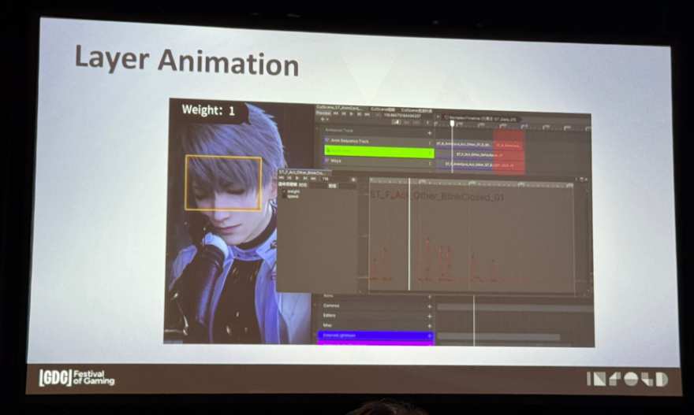

**第三个是暂停循环动画 （Pause Loop Animation）。**

我们的游戏中包含很多QTE，角色需要等待玩家输入才能继续接下来的动作。如果动画只是简单地僵在一个姿势上，表演就会有明显的断裂感，这个时刻的张力也就流失了。

所以我们开发了一个叫做“暂停循环动画”的功能。当游戏进入QTE时，动画系统会切换到一个特殊的循环动画，同时等待玩家的输入。一旦玩家做出反应，系统就会无缝过渡到后续动作，这让表演始终保持鲜活，并保全了场景的过场沉浸感。

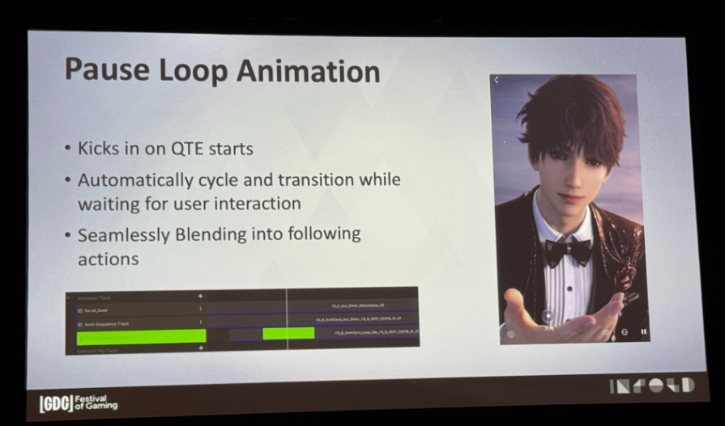

**第四个是灯光系统 （Lighting System）。**

我们的角色使用一个平行光，和多个补充光源配合特写软阴影，再加上几十种后处理效果，有海量的参数需要控制。

灯光美术可以在时间轴上选择特定的参数，并通过打关键帧进行精确调整。

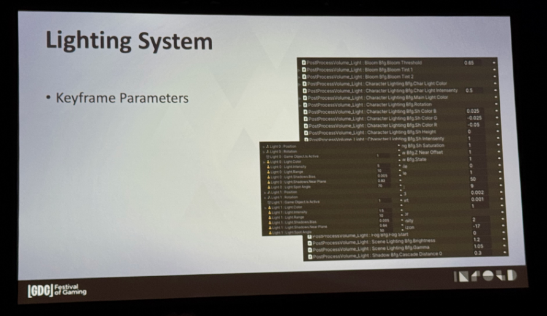

但如果每次都从头搭建一套完整的灯光设置，会非常耗时，也很难在整个游戏中保持视觉一致性。为此，我们引入了一个预设系统。灯光美术可以将一组参数值保存为预设，从而快速搭建一个基础的灯光布置。

这能显著加快制作效率，并有助于保持稳定统一的视觉品质。

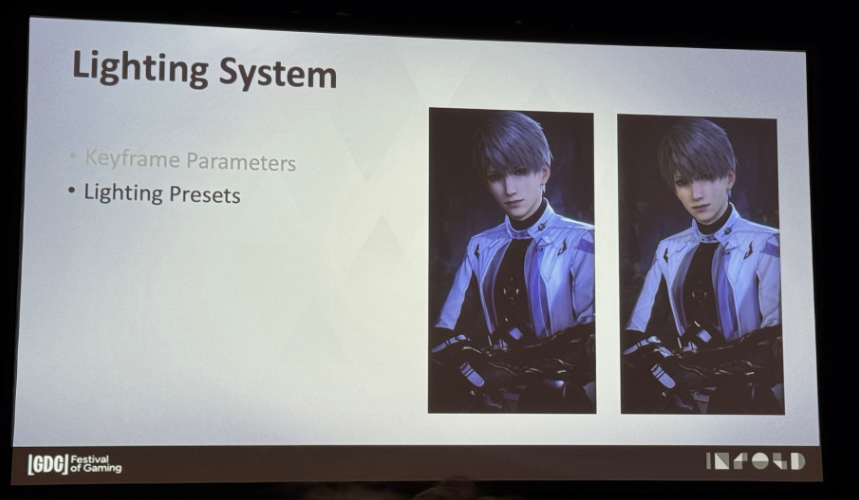

在舞台卡里模拟复杂的舞台灯光效果，需要同步移动许多灯光，所以手动去调整每一盏灯几乎是不可能的。

所以我们借鉴了现实世界中舞台灯光控制台的工作流，并做了一个引擎内版本。这让美术能够控制灯光组，并生成程序化的灯光序列。

有了这个系统，就可以快速可靠地创建出复杂的舞台灯光效果。

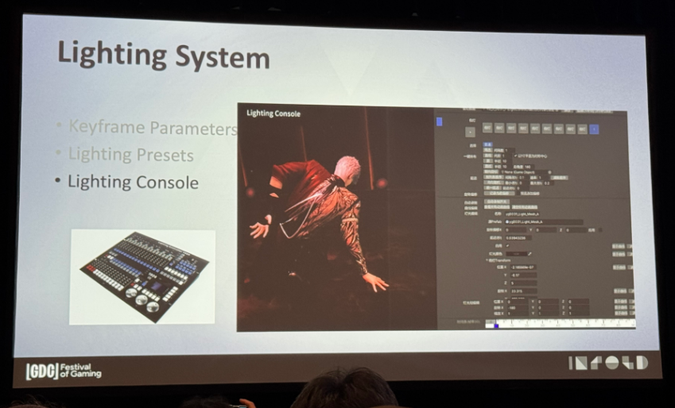  

**03**

**生产规模护栏**

为了支撑大规模的生产，我们还需要强大的护栏。如果没有它们，即使是这么复杂管线里的一个小失误，也很容易演变成系统级的问题，这会耗费大量的时间和精力去Debug。

**首先是资产所有权界定。**

正如前面提到的，过场动画的生产需要多个部门协同工作。团队经常需要参考彼此的工作，但绝对不能意外修改不属于自己职责范围的资产。

因此，我们将过场动画项目划分为基于角色的资产目录，并明确界定了所有权，自动提交工具确保只有属于用户职责范围内的资产才会被提交。比如在“过场动画编辑器”中，灯光美术可以加载动画资产作为参考，但无法修改它们。

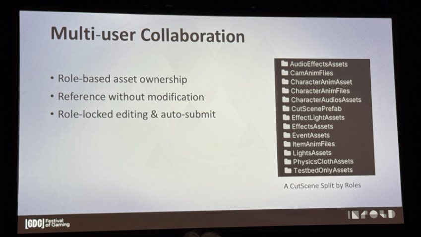

**其次是自动化资产验证流程。**

我们的管线涉及海量的过场片段资产，修改本地文件、合并冲突等还是会导致配置错误。

为了解决这个问题，我们建立了一系列自动化的资产验证流程。这些检查会定期运行，生成报告，一旦检测到问题，就会通知提交者和该模块的所有者。

这让团队能够迅速定位有问题的资产和具体故障，从而快速修复。

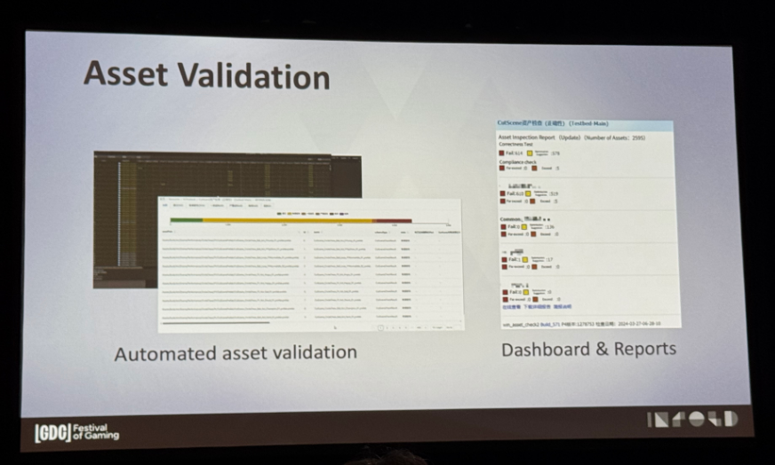

**再次，性能验证也是管线中非常重要的一环。**

我们将性能指标和Debug视图直接整合到了编辑器里。比如，特效美术可以使用Overdraw视图来快速找出需要优化的资产。当一个过场片段完全组装好后，创作者可以直接在编辑器里播放整个序列，同时收集关键的性能指标，结果会以时间轴的形式呈现，有问题的片段会自动高亮显示。

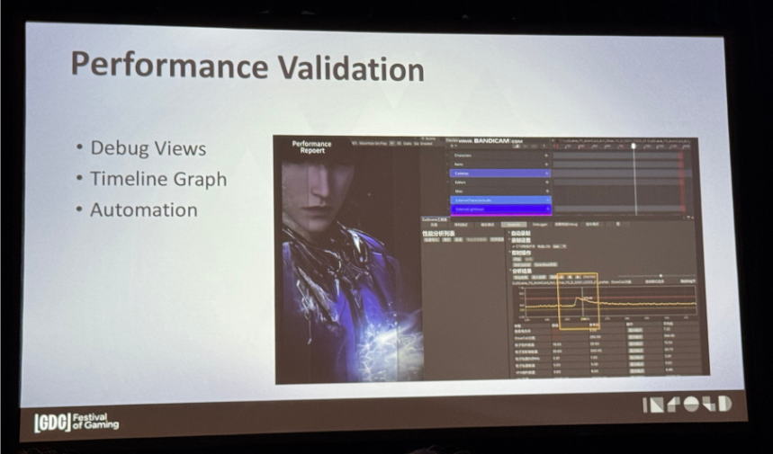

我们刚才讨论的性能剖析工具主要是在生产阶段使用的，用于在开发环境里进行快速诊断。然而，游戏最终要跑在各种各样的移动设备上，面对诸多不同的芯片组和操作系统，性能差异可能会非常大。

为了应对这种情况，我们实现了多个画质分级，并且渲染管线也包含了多个不同的执行路径。

我们还搭建了一个性能监控平台，由我们的自动化测试框架驱动，每天24小时在数百台设备上跑测试。这让我们能持续收集不同软硬件配置下的性能数据，并在每次发布前揪出潜在的性能热点。

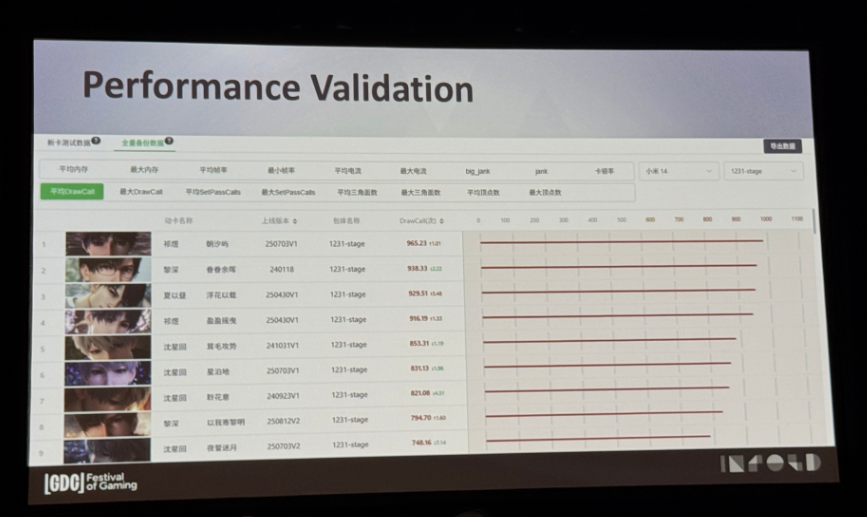

**还有视觉回归监测。**

从美术资产到渲染管线的修改，很多因素都可能无意中影响最终的视觉效果。一旦发生这种情况，程序往往要花好几个小时回滚版本，找到变更源头。

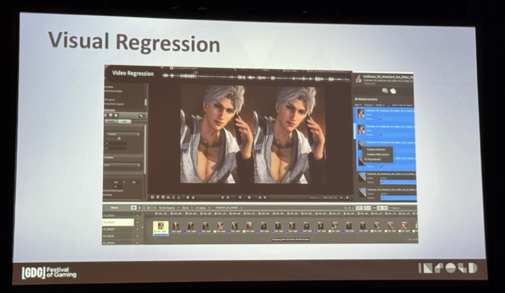

为了解决这个问题，我们建了一个渲染农场，每天晚上都会录制视频进行自动化对比。我们还发现QA和美术复查问题的速度也快多了，因为对比视频比直接在游戏引擎里检查资产要容易得多。

**我们还构建了许多Debug工具来帮助工程师更快地诊断问题。**

例如，我们为角色动画的混合树及其运行时状态提供了可视化工具，还能复现过场动画之间的过渡状态，这类地方很容易出现动画抖动或者跨过场对象的生命周期错误等问题。

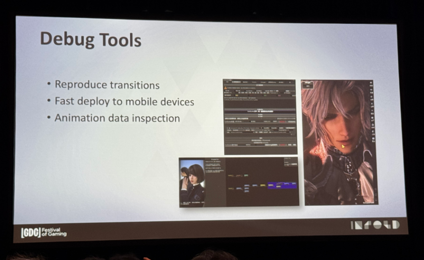

**最后，我们支持快速打包并部署到移动设备上，以便进行快速的真机测试。**

至于实时游戏环境，我们使用了腾讯的Crash Sight来收集和分析崩溃报告，它提供了实时的搜索、统计和分析工具，能让我们迅速定位问题，并对生产环境中的崩溃做出响应。

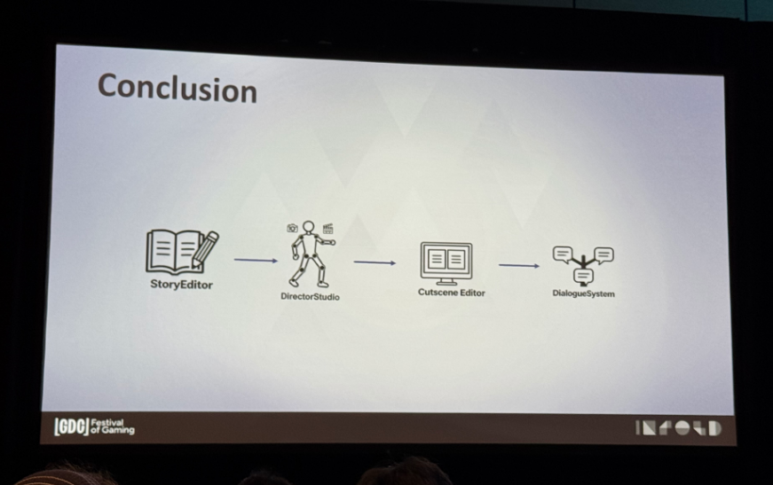

今天其实只是涵盖了我们管线中几个关键的部分。在过去的六年里，这条管线从一个勉强能用的状态，进化成了一个能够让我们团队持续高效、高质量地产出剧情的系统。它是整个团队多年来不断试验、迭代和持续优化的结果，这一切离不开每一个人的贡献。

感谢大家的聆听。

**游戏葡萄招聘商务经理，**  

**点击「阅读原文」可了解详情**

**  
**

**推荐阅读**

[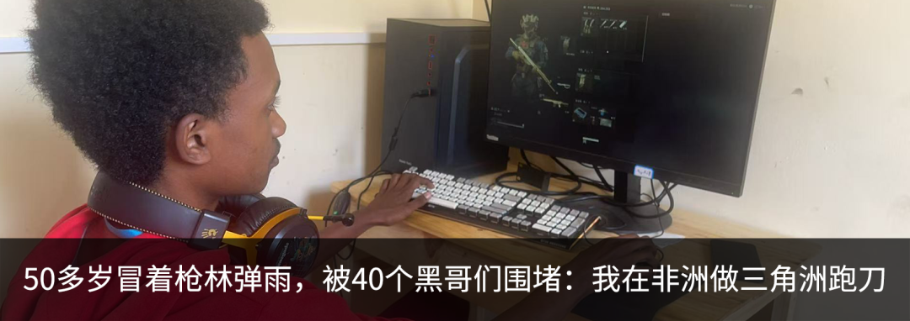](https://mp.weixin.qq.com/s?__biz=MjM5OTc2ODUxMw==&mid=2649998238&idx=1&sn=744230952baba33dfa29e95fb9762ebe&scene=21#wechat_redirect)

****[极限汉化丝之歌](https://mp.weixin.qq.com/s?__biz=MjM5OTc2ODUxMw==&mid=2649988922&idx=1&sn=66d9ccf2039946882faaf2b522f96039&scene=21#wechat_redirect) | [对话鹰角主策](https://mp.weixin.qq.com/s?__biz=MjM5OTc2ODUxMw==&mid=2649986669&idx=1&sn=e41dca32686f3dd55cb3325a016e665f&scene=21#wechat_redirect)********|[AI零代码开发](https://mp.weixin.qq.com/s?__biz=MjM5OTc2ODUxMw==&mid=2649997136&idx=1&sn=189d3946c51df6d8a083b37523bfded7&scene=21#wechat_redirect)****  
****

**[起底游戏周边](https://mp.weixin.qq.com/s?__biz=MjM5OTc2ODUxMw==&mid=2649991471&idx=1&sn=a6852e969e479749bf2ae7232b2154b6&scene=21#wechat_redirect)****|[白银之城](https://mp.weixin.qq.com/s?__biz=MjM5OTc2ODUxMw==&mid=2649992889&idx=1&sn=dbfd49ce360fff779dd22cdfb56f2452&scene=21#wechat_redirect) | [离职字节创业](https://mp.weixin.qq.com/s?__biz=MjM5OTc2ODUxMw==&mid=2649994774&idx=1&sn=6e3072042f5006f5cf41db8e33551b90&scene=21#wechat_redirect)**********

[对话终末地](https://mp.weixin.qq.com/s?__biz=MjM5OTc2ODUxMw==&mid=2649993644&idx=1&sn=9cf99849502c1c1c476f77c354d02cff&scene=21#wechat_redirect) ****|[ 对话前沐瞳CEO](https://mp.weixin.qq.com/s?__biz=MjM5OTc2ODUxMw==&mid=2649993937&idx=1&sn=f0c30e68c98f20fb65d4b5a47fcb9edf&scene=21#wechat_redirect) | [对话鸣潮总监](https://mp.weixin.qq.com/s?__biz=MjM5OTc2ODUxMw==&mid=2649995292&idx=1&sn=ba83cd8ad3b8551f2b4c95d98c46cd79&scene=21#wechat_redirect)****

游戏行业书籍推荐：葡萄书房  

******点击下方名片，关注公众号**

**（ 星标可第一时间收到推送和完整封面）**