编辑 / 游戏那点事 斯蒂芬  
‍‍‍

> AI永远是一种工具，而不是目的。

最近，随着OpenClaw的爆火，一时间在全国掀起了一股全民“养虾”热潮，想必游戏行业的各位也都在密切关注着AI的话题。AI产品引发空前热度，实话说我已经记不清这是第几回了。

从最开始的ChatGPT，到后来的Suno AI、Sora、Deepseek、Seedance......似乎AI对我们固有认知造成冲击的频率正在不断加提速，这意味着AI技术迭代的步伐正在加快，甚至快到足以给整个社会带来一定的焦虑感。

对于游戏行业来说亦是如此，随着AI技术的突破，行业内的从业者各有各的观点，笔者时常也会和一些从业者朋友聊到类似的话题，我经常会听到，AI发展起来了，没准哪天行业就不需要我了之类的说法。最终归纳下来，大家聚焦的核心其实都是在于AI将会以一种怎样的方式影响，甚至改变游戏行业。

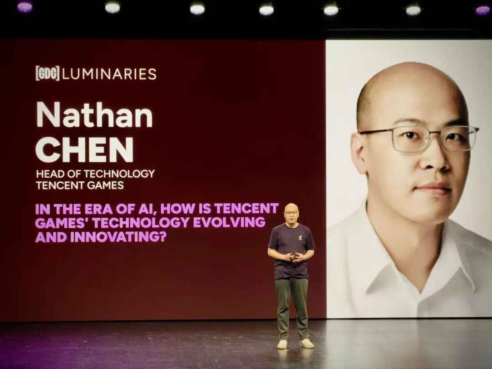

在AI浪潮下，我们所熟知的一批国内大厂早早地就开始了各自的探索，在最近的GDC2026上，腾讯游戏作为游戏行业的巨头，其技术负责人陈冬也登上了演讲的舞台阐述了腾讯游戏对于AI技术的理解，作为头部厂商，面对当下AI给游戏行业带来的冲击与变革，腾讯游戏选择了“不焦虑”。

以下为演讲内容翻译，为优化阅读体验有所改动：

  

01

2025是AI进入行业的重要里程碑

大家下午好，非常感谢GDC今天邀请我来到这里。请先让我做一个简短的自我介绍，并介绍一下腾讯游戏。

我现在是腾讯游戏的技术负责人，腾讯游戏如今触达了数以亿计的用户，一直以来，驱动着我们的一个问题是：如何利用前沿技术去打造更令人惊艳的游戏？我已经在腾讯游戏工作了超过17年，负责为我们的游戏提供技术平台。近年来，AI 已经成为我工作的重点。

今天，几乎所有人都在谈论AI，它是一项非常令人惊叹、充满创新性、也具有革命性的技术。这里就会带出一个问题：AI应该如何被应用在数字游戏产业中？

这是一个充满复杂性与创造力的领域，我也非常好奇大家如何看待这个问题。今天，我想从腾讯游戏的视角，来展示我们对这个问题的一些思考：AI目前在行业中的位置、腾讯游戏的一些AI创新实践，以及我对于AI创新未来方向的一些想法。

如今，AI已经被部署到了我们生产流水线的许多环节，但深度整合仍然有限。请看下面这张图，浅色柱表示2024年，深色柱表示2025年，这里最突出的是，2025年成为了一个里程碑式的年份。

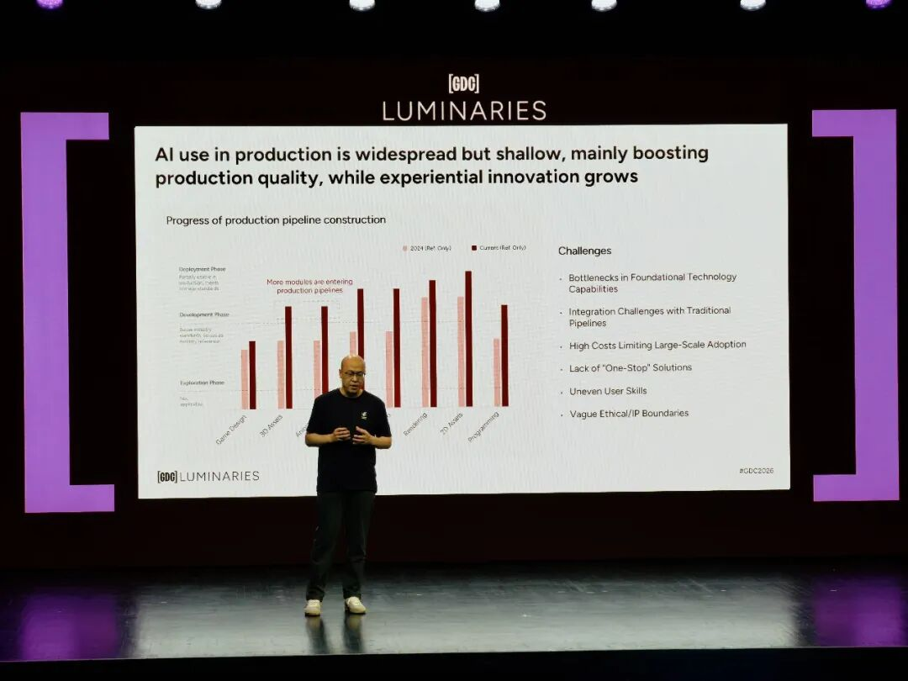

在很多关键领域，包括3D和动画，AI工具开始真正进入行业，我记得很清楚，在2024年底时，整个行业还在犹豫是否要投资3D生成，以及要投入多少；到了2025年，势头发生巨大变化，3D生成已经出现了明显的进展。

我们现在已经可以开始认真考虑，并逐步探索、试验它在生产中的应用。虽然在它能够被完全部署进我们的生产流水线之前，它离我们的期望仍然存在很大差距，但考虑到现今AI的发展速度，未来它只会越来越好。

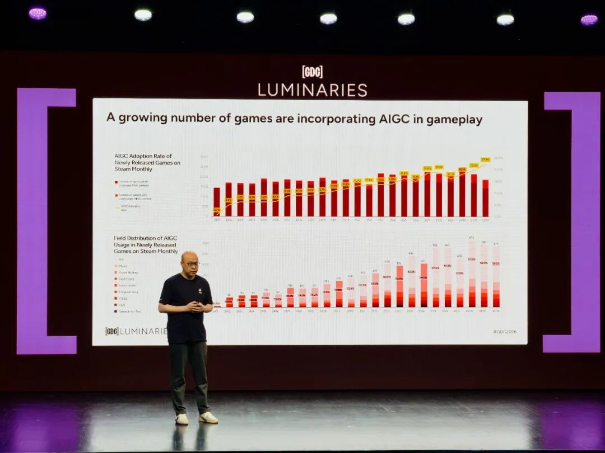

如果你去看这些数据，就能清楚地看到趋势，来自Steam的数据也反映了这种采用率不断上升的趋势，到2025年底，AI工具的采用率已经超过了20%。

总体上来看，这些数据表明AI和游戏之间的连接正在变得越来越强，如果AI能在未来帮助我们创造出更多高质量的游戏，那么我认为会有越来越多的工作室愿意去使用AI工具。

  

02

AI永远是一种工具 

而不是目的

那么腾讯游戏是如何探索AI的？我们又如何去看待它在生产中发挥的价值和扮演的角色呢？

在腾讯游戏，我们始终认为，AI在游戏开发中的角色，应该是扩展创意边界、赋能创作者，而不是取代人类的创造力。

因此我们应用AI的原则，始终围绕着提升开发、运营和玩家体验，通过减少重复任务、提升内容质量来实现这一点。

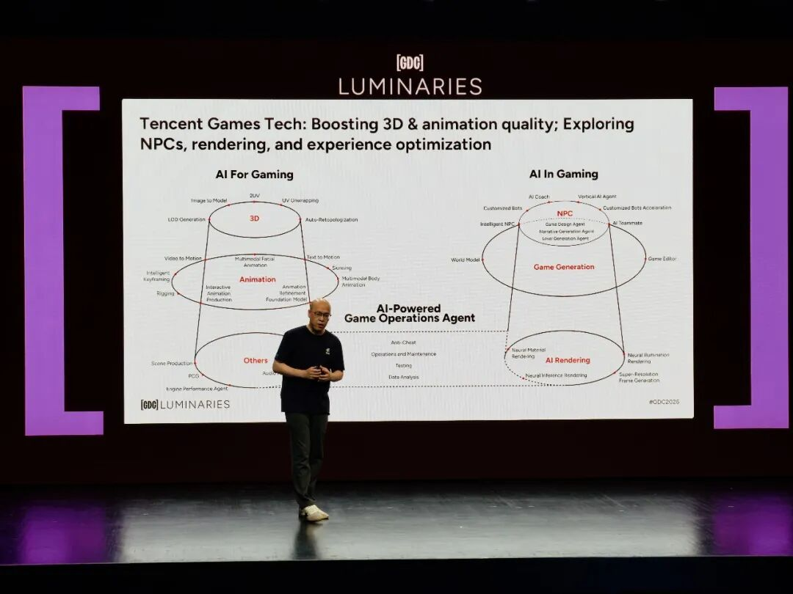

所以对于我们来说，AI永远是一种工具，而不是目的。具体来说，我们会重点关注通过AI去提升3D动画的制作质量，同时也在积极探索和优化与体验相关的领域，例如AI NPC、渲染，以及游戏生成。在我们正在开发的所有AI工具和技术中，今天我会重点讲三个对我们来说最成功的方向，我会和大家分享一些真实实践。

这是一个3D角色资产应用的案例。从3D美术师的视角来看，生产流程里有一些阶段是他们所热爱的，因为在这些阶段中，他们可以充分释放创造力。比如概念设计，它的核心就是去定义角色的个性与叙事，这是一个纯粹的创造环节，还有像建模和贴图这样的阶段也是如此。

但另一方面，也有一些重复性的工作，是美术师并不那么喜欢、但又不得不做的。比如UV展开。它涉及到大量繁琐、规则化的工作，要把一个3D网格展开成平面。它是必要的，但也是一个很“磨人”的过程。像拓扑、LOD生成等其他阶段也类似。

面对这两种不同类型的工作，AI应该为我们的美术师提供不同的帮助和价值。在创造阶段，AI的作用是辅助，但人类的创造力始终占据主导，它需要根据人的方向去生成高质量草稿，而最终的判断和控制权必须掌握在艺术家手里。

而偏实践性的阶段，我们则可以把AI嵌入到更完整的工作流中，帮助艺术家减少重复劳动，让他们把更多时间花在创作上。

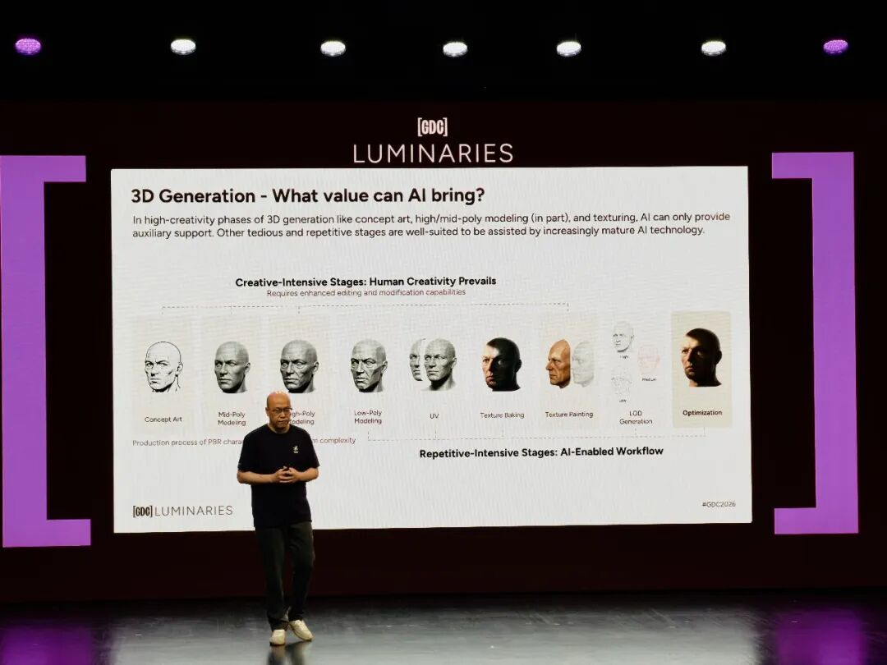

在那些重复、密集的阶段里，我们已经在拓扑、LOD生成以及UV展开等领域取得了真实进展。当你从一个高模开始，它显然无法直接用于实时渲染。如果按照传统流程，美术师会基于这个高模去创建一个低模，并尽可能保留高模上的细节。

借助AI，我们正在改变这一点。我们的工具可以自动以高模作为输入，生成可直接投入生产的低模，同时保留细节。这为美术师节省了大量时间和人力劳动，LOD创建和UV展开也是同样的逻辑。所有这些工具不仅仅是在节约时间，更是在把创造力“夺回来”，让我们的艺术家能够专注于他们最擅长、也最喜欢做的事。

接下来让我们以3D模型生成为例，看看AI如何在这些创作阶段支持艺术家。

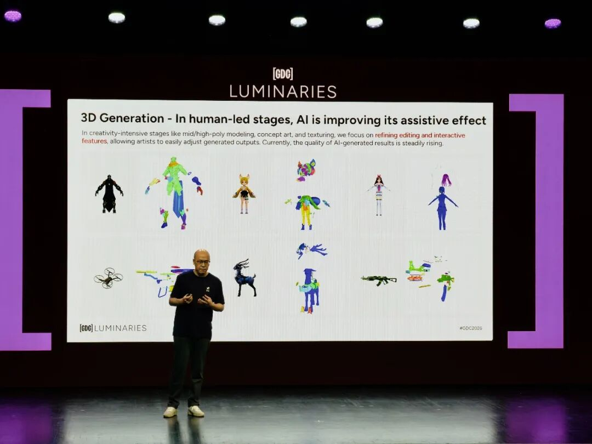

如果你仔细看屏幕上的3D生成过程，可能会注意到，不同部分是在同时生成的。艺术家会先把一个模型拆分成不同部件，比如角色的护甲或者武器组件，然后直接放进我们的AI工具中，接着AI就可以并行地生成拓扑，给予艺术家更细致的控制权。

这类工具一个很大的顾虑，是拓扑质量。不同于传统算法，我们的AI是从海量专业艺术家的模型数据中学习而来的。这意味着，AI生成出来的拓扑不仅干净，而且会尽量遵循像艺术家一样的边线流向和结构规则。这会产出可直接投入生产、并适用于后续阶段的网格。

简而言之，我们的AI不是“随便生成一个3D资产”，而是在生成符合游戏美术标准和风格的资产，帮助艺术家更快、更高质量地把自己的想法带到现实中。即使我刚刚展示了一些非常惊艳的3D生成结果，但它实际上仍然处于早期测试阶段。它还有很长的路要走，但我们预计它将在不久的未来真正融入我们的生产流水线。

展望未来，我们希望在创造阶段引入更智能的交互，比如我们正在开发能够更深入理解3D资产的AI和数字人能力。这样，我们的AI工具就能够自动添加硬边与边线循环。我们的艺术家也可以只用一句简单的提示词，去修改几何体和贴图。

  

03

“Spark More and Everything”

在腾讯游戏，我们有一句口号叫“Spark More and Everything”。我们在3D模型生成领域所做的所有探索，最终都指向同一个目标，那就是帮助艺术家激发更多创造力。

一旦前面几个阶段已经产出了高质量资产，下一步就是“赋予生命”。接下来，我们来看看AI如何被应用在动画制作中。

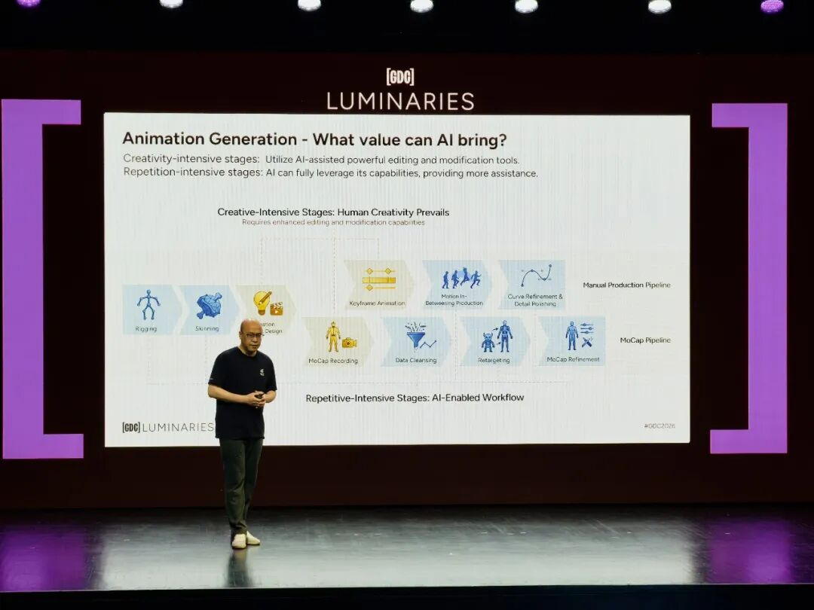

首先，我们来看动画制作流程：在完成绑定、蒙皮和动画概念设计之后，我们通常会在手工关键帧路线和动捕路线之间做选择。和3D管线类似，动画流程里也有一些阶段允许动画师表达更多创造力，比如动画概念设计、关键帧动画等阶段。但与此同时，它也包含了大量繁琐而重复的工作。

其中的骨骼生成正是重复阶段里的一项关键任务，为此我们开发了业内首个由超过十亿参数驱动的骨骼生成模型。虽然这个模型规模不算特别巨大，但它的表现很突出。

这个模型以角色网格作为输入，自动输出一个可直接投入生产的骨骼结构。该模型支持人形角色和非人形角色，准确率超过70%。它不仅能生成主要骨骼，还能生成附加骨骼，比如用于绿色植物、服装，以及像裙摆这样飘动物体的附加骨骼。

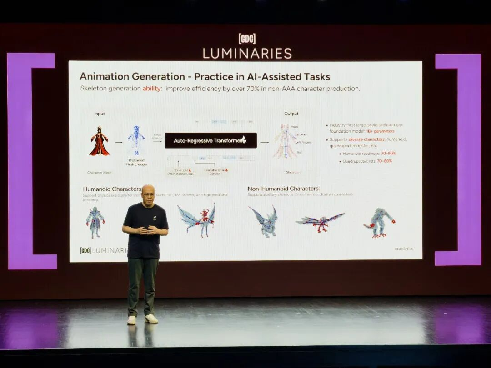

未来，我们希望把这个模型的准确率提升到90%。如果能够做到这一点，它就可以帮助我们的艺术家节省更多时间，让他们把更多精力放在创造上。

此外，自动蒙皮是我们最早、也是领先的AI应用之一，它能够自动把网格绑定到骨骼上。传统的蒙皮流程依赖于艺术家手工刷权重，这是一个非常繁琐且耗时的工作，艺术家的反馈表明，这个AI工具对于标准复杂度的中等角色，能够把蒙皮制作时间缩短85%以上。当然，当涉及到细节修整以及对蒙皮结果进行最终判断时，还需要交由人工来处理。

不仅如此，智能帧插值，也是我们工作流里另一个很典型的AI辅助任务。这个过程会以稀疏关键帧作为输入，为大范围动作自动生成平滑且多样化的动画。

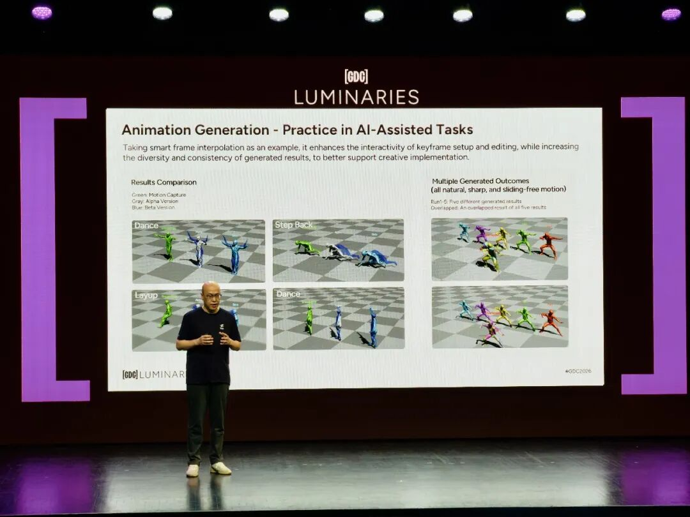

在左边，你们可以看到，我们的动画模型生成的结果，与艺术家制作的标准结果进行对比。蓝色帧是关键帧。如果仔细看第一排逐帧动画，我们的alpha版本会有一点角色漂移，但beta版本表现得更好，模型实现了更加真实的腿部支撑，以及更自然的重心转移。

在右边，我们展示了AI基于同样输入关键帧，生成多样化高质量动画变化的能力。有了智能帧插值工具，艺术家就可以把更多时间花在不同动作方案的创意设计上，这对动画师来说是一件非常棒的事。

接下来，我们来看文本生成动作和视频生成动作这两个AI工具。正如大家看到的，在左边，我们的文本生成动作工具能够很好地遵循指令，生成高保真动作。而视频生成动作工具则可以从任意以人物为主体的视频中重建人体动作，包括手指细节以及稳定的脚底接地效果。

当艺术家只有一个比较粗略的动作概念时，我们的AI工具可以帮助他们快速生成多个版本作为参考，甚至一次给出十种不同的方案，以帮助艺术家更快地把自己的想法落地。

在未来动画生成的演进方向上，还有很多值得期待的方向。而交互式动画是我们最兴奋的领域之一。原因在于，多样化的互动正是连接玩家与虚拟世界的桥梁，正是这些互动增强了内容自由度与沉浸感。我们实现这一目标的路线图，分成三个阶段，最终目标是让交互式动画能够实现对复杂事物的理解与指令规划。

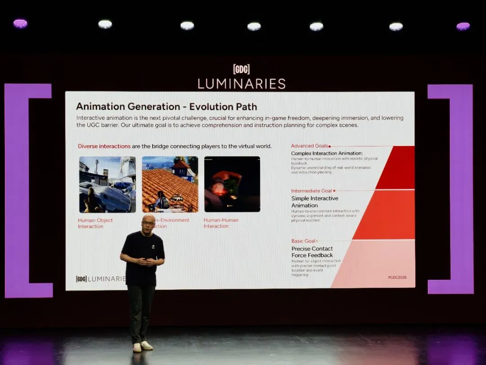

最后，总结一下我们在动画领域的实践。我们正在探索多种不同的方法，并会继续研究AI如何帮助动画师减少重复劳动、释放创造力。

  

04

AI让NPC真正地“活着”

接下来，让我们转向AI NPC，这也是一个非常热门的话题。在AI技术快速演进的推动下，NPC在决策、动画、语言和语音方面都已经取得了显著进展。因此，NPC的应用场景也已经大大超越了传统角色。现在，AI NPC可以担任智能游戏教练、合作队友，甚至是情感陪伴者。

这不仅能给玩家带来新鲜且更有吸引力的体验，也为未来玩法打开了巨大的新可能。在腾讯游戏，我们正在积极探索各种类型的AI NPC，并应用于我们的游戏产品中。

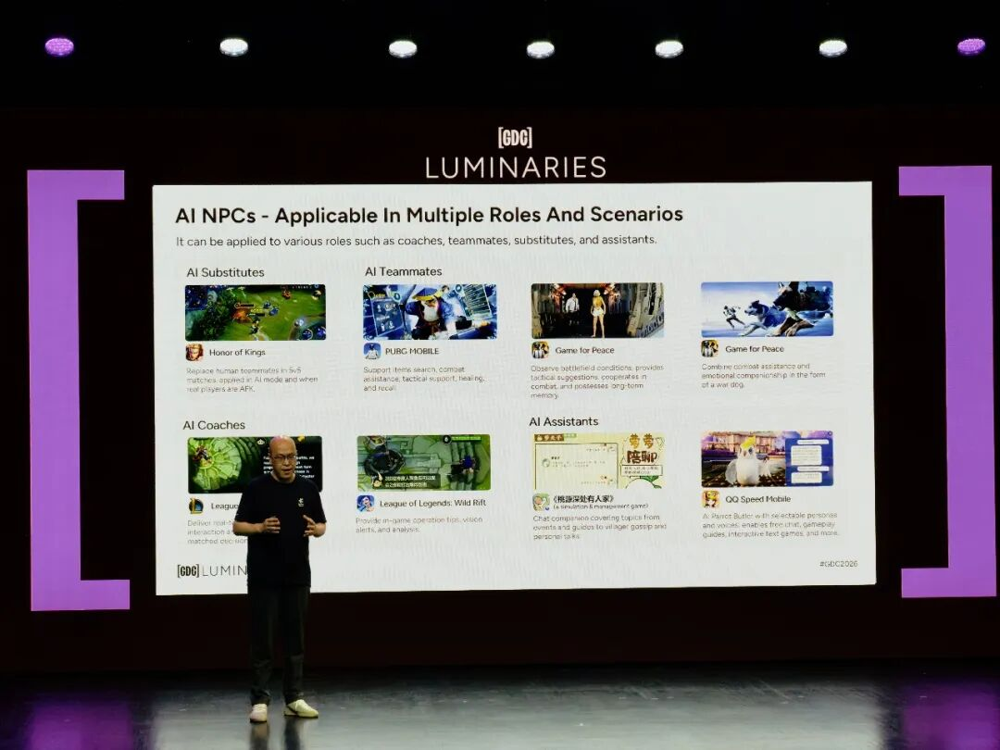

比如，当玩家掉线并离开一场比赛时，我们的AI替身可以无缝接管，与剩余玩家一起继续比赛。与此同时，我们也正在《英雄联盟》的相关方向上试点这种功能。它可以为玩家提供个性化指导，帮助新玩家更快上手，也帮助回归玩家更快找回自己熟悉的英雄。

然而，正如我们在当前项目实践中所看到的，现在的这些NPC仍然在很大程度上是功能性的。这意味着，它们基本上都是为完成某些特定任务而设计的，而它们的能力仍然相对有限。

如果NPC能够更好地与玩家、与其他NPC互动，并且和这个世界一起共同成长，会怎样？

基于这个想法，我们设想了构建一个NPC生态系统的可能性。正如图中所展示的那样，NPC将作为具备涌现能力的智能体，在相邻环境中自然生长，提供引导，并推动模拟运行。

与此同时，玩家则提供行为和选择，而系统则负责模拟世界规则。正如右侧图示所展示的，系统会通过自上而下的多层控制来引导叙事方向，确保创作质量，而轨迹与一个个事件又会通过交互共同驱动自下而上的涌现式叙事。

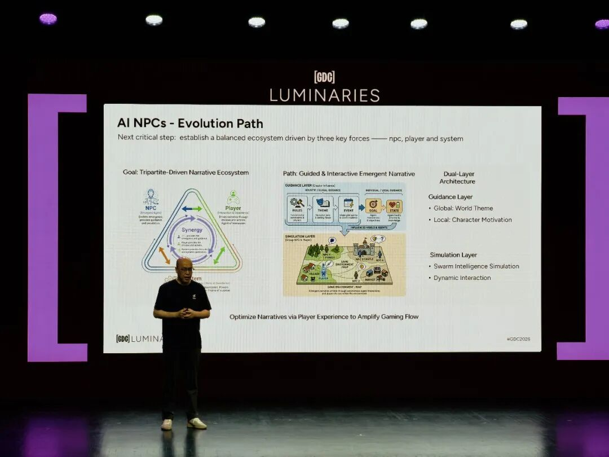

这只是我们面向未来的一个概念，但我们相信，随着AI的持续演进，下一代NPC 将会为玩家带来更丰富、更深层的体验。

  

05

游戏开发永远离不开人类的创造力

现在，来到我们分享的最后一部分，也就是AI在运营中的实践。在腾讯游戏，我们有十余款已经运营多年的游戏，其中一些甚至已经持续运营了十多年，并且至今仍然表现强劲。我们在长期游戏运营方面积累了非常丰富的经验，支撑着数亿活跃用户。

在这个领域，我们正在构建各种类型的AI Agent，来帮助标准化这些经验。这套AI系统使我们能够提供更强的安全保障，确保更高的游戏质量，并最终提升我们的运营效率和玩家体验。

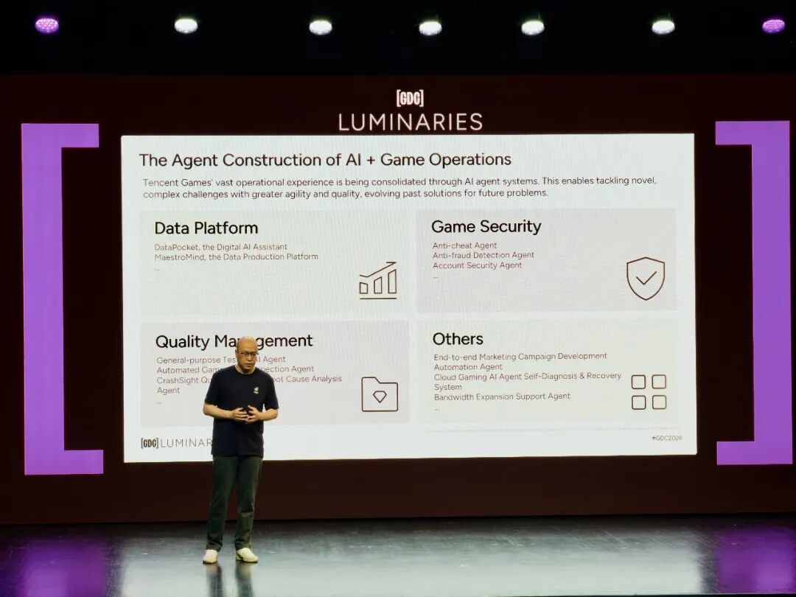

展望未来，我无法确定AI最终会以什么样的方式发展，但我确实希望，游戏创作者能够在创作中获得更多乐趣和成就感，而玩家则能体验到更加精彩、更加沉浸的游戏。

今天，我不会深入做过于宏大的预测。相反，我只想简单分享一个可能帮助塑造未来的世界模型愿景。提到世界模型，我相信很多人已经听过很多，也许你们中的一些人会很好奇：世界模型到底会对游戏产生什么真正的影响？

我们已经看到，人们现在已经习惯于通过提示词来生成图片和视频。那么，为什么我们不能也用提示词来生成游戏呢？我不能确定世界模型是否一定会被广泛使用，但它确实带来了一种可能性——把真正的感知与想象带入交互体验的可能性。

我不知道那个时刻什么时候会到来，但我知道，游戏同时由创造力与精确控制构成。无论世界模型未来变得多么先进，它们都始终会是工具，就像我们今天使用的所有工具一样。

游戏开发永远离不开艺术家的愿景、经过深思熟虑的玩法设计，以及我们的艺术家与工程师的专业能力。

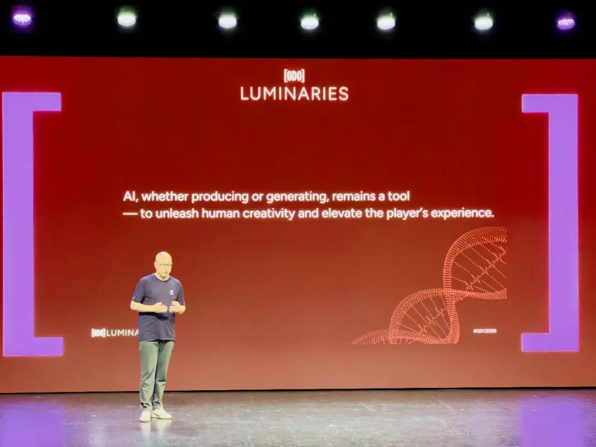

在展示了腾讯游戏这么多AI实践之后，我想用这样一句话来结束今天的分享：AI，无论是用于制作，还是用于生成，始终都只是帮助释放人类创造力、提升玩家体验的工具。谢谢大家。

推荐阅读  

[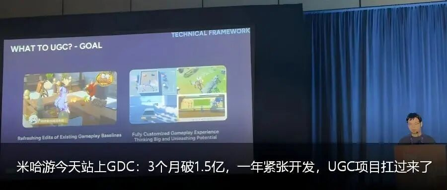](https://mp.weixin.qq.com/s?__biz=MjM5MDEwMTk2MA==&mid=2651287684&idx=1&sn=04ea9cdf911f8e1c277c6c3c7c38cbb0&scene=21#wechat_redirect)  
[时尚百货城](https://mp.weixin.qq.com/s?__biz=MjM5MDEwMTk2MA==&mid=2651287579&idx=1&sn=99c28ba8f8df3d0e1ec26f1c41a40546&scene=21#wechat_redirect)丨[三国杀](https://mp.weixin.qq.com/s?__biz=MjM5MDEwMTk2MA==&mid=2651287684&idx=2&sn=edce1bbcbbb93162170635eb8ccf178f&scene=21#wechat_redirect)丨[米哈游维权报告](https://mp.weixin.qq.com/s?__biz=MjM5MDEwMTk2MA==&mid=2651287498&idx=1&sn=9c17833930833d7c07c6d68246b90990&scene=21#wechat_redirect)  
[杀戮尖塔2](https://mp.weixin.qq.com/s?__biz=MjM5MDEwMTk2MA==&mid=2651287474&idx=1&sn=f7c685f6613dfb5ee1a700325a968eb5&scene=21#wechat_redirect)丨[2月中国手游收入榜](https://mp.weixin.qq.com/s?__biz=MjM5MDEwMTk2MA==&mid=2651287432&idx=1&sn=5f736799814d202da43e34f75be8b4bd&scene=21#wechat_redirect)丨[失落星船马拉松](https://mp.weixin.qq.com/s?__biz=MjM5MDEwMTk2MA==&mid=2651287394&idx=1&sn=a809f420906d87efc3ed2d1a7b0cfef0&scene=21#wechat_redirect)  
[小游戏榜](https://mp.weixin.qq.com/s?__biz=MjM5MDEwMTk2MA==&mid=2651287343&idx=1&sn=8ef8d6d50446e08e69f681655d3eb4af&scene=21#wechat_redirect)丨[2月全球手游收入榜](https://mp.weixin.qq.com/s?__biz=MjM5MDEwMTk2MA==&mid=2651287394&idx=2&sn=3aab4acd084f2264a9dfff45e92e3b8a&scene=21#wechat_redirect)丨[绝区零震动技术](https://mp.weixin.qq.com/s?__biz=MjM5MDEwMTk2MA==&mid=2651287266&idx=1&sn=058369f73cc0219839e04973d66144c8&scene=21#wechat_redirect)  

推荐观看

—— 点击下方公众号名片，即刻关注我们 ——

——————— Ps ———————  

游戏那点事近期为游戏圈同行们开启了【新交流群】。新群专门用以日常交流、最新消息交换、圈内八卦、干货分享、和游戏唠嗑等。有兴趣一起聊聊行业的朋友可以加微信328624956或cxx2744，添加时请备注公司和职位。

——————— End ———————

行业交流 / 行业爆料 / 合作沟通 / 加交流群：

请加微信 cxx2744 或 328624956

