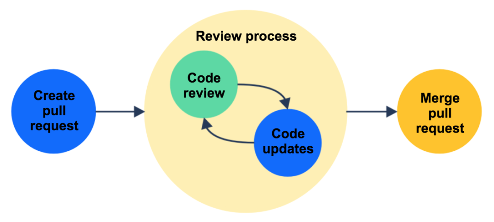
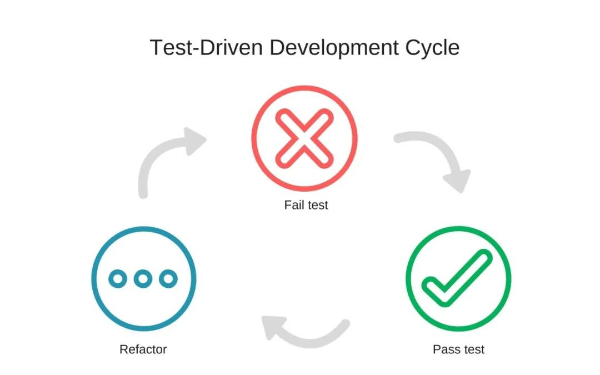
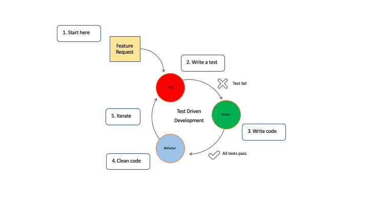

标签：人才培养｜工程文化｜绩效｜AI编程｜新人管理

常见场景：新人接到一个看似简单的需求，先把需求整段丢给 AI，让它生成一坨可运行代码；CI 绿了就提 PR。评审时被问到“为什么要这样设计、失败时怎么排查、边界条件是什么”，新人只能翻回 AI 的回答，解释不清，也改不动。

* * *

## 01｜KPI 误区：把“工具使用”当“产出”，会把组织推向错误优化

在“强推 AI 使用率”的案例类型里，最常见的管理动作是：把“AI 使用率”做成 KPI——例如要求新人每日必须使用、提交中必须体现、周报里要汇报“用 AI 提效多少”。这类做法的问题不在于鼓励使用工具，而在于**把手段当结果** 。

当 KPI 指向“用得多”，团队会自然地优化到：

  * **更多生成** ：倾向把问题拆成“让 AI 生成更多代码”，而不是“让系统更正确、更易维护”

  * **更少思考** ：新人最容易形成“先生成、后解释（甚至不解释）”的工作习惯

  * **更低可追责性** ：一旦出现缺陷，根因分析会变成“AI 生成的”，而不是“我理解了什么、验证了什么、缺失了什么”

这会导致一种组织层面的错配：管理层以为在推动效率，实际上是在推动**风险累积速度** 。  
（参考链接 https://newshacker.me/story?id=47206663 指向一个讨论页，但当前无法核对其正文，因此本文不引用其中任何具体引语与数据；如果提及讨论，也只能说“有讨论/有观点（不确定）”。）

* * *

## 02｜新人成长断裂：不理解就无法排错、重构与承担

“复制粘贴化”最危险的部分不是代码质量波动，而是**成长路径被切断** ：新人跳过了“建模—推导—验证—定位”的关键训练。

在真实工程里，新人的价值增长往往来自三种能力的稳定提升：

  1. **排错能力** ：面对线上问题能缩小范围、验证假设、定位根因

  2. **重构能力** ：理解现有约束，做出低风险改动，让系统更易维护

  3. **边界意识** ：知道什么情况会失败、哪里是隐含假设、哪些输入必须防御

如果新人主要依赖 AI 产出代码，但没有被要求“解释与验证”，就会出现典型症状：

  * PR 能过，但问到“为什么这样写”只能复述表层理由

  * 一旦测试不稳/线上告警，第一反应是“再问一次 AI”，而不是复现与定位

  * 代码能跑但不可维护：命名随意、层次混乱、缺少契约与测试

  * 对系统约束缺乏感知：性能、并发、容错、兼容性、数据一致性等

这会把组织推向一个结构性风险：**代码由新人写，责任由资深背** 。久而久之，资深会被拖入“救火与返工”，新人却无法建立可迁移的工程能力。

* * *

## 03｜组织对策：把“验证与解释”纳入交付定义，让 AI 成为放大器而非替代品

解决思路不是“禁用 AI”，而是把交付标准从“提交了多少代码/用了多少 AI”，改为“是否完成可追责、可验证的工程闭环”。关键抓手是：**在 Definition of Done（DoD）里写清楚解释与验证要求** 。

### 3.1 把“可解释”写进 PR 规则

给新人一个明确的交付模板（可复制到 PR 描述中）：

  * 需求目标：一句话说明要解决什么问题

  * 方案选择：说明为什么选 A 不选 B（哪怕很简短）

  * 关键假设：输入、边界、失败模式

  * 验证方式：有哪些测试/日志/监控证明它是对的

  * 回滚策略：出问题怎么回退（哪怕是“安全开关/配置开关”）

### 3.2 把“可验证”写进交付定义（DoD）

下面这张表可作为团队落地标准，避免变成口号：

交付项| 最低要求（新人）| Reviewer 关注点  
---|---|---  
功能正确性| 至少 1 个单元测试覆盖核心路径| 测试是否验证了“行为”，而不只是“跑通”  
边界与失败模式| 列出 2-3 个边界条件与处理方式| 是否明确输入契约、异常策略  
可观测性| 关键分支有日志/指标（按团队规范）| 出问题能否定位到模块与原因  
可解释性| PR 描述可回答“为什么这样设计”| 能否用自己的话讲清楚，而非贴 AI 原文  
可维护性| 命名/结构符合规范，避免无意义抽象| 是否引入未来难改的耦合  
  
> 注意：这里并不要求新人“写很复杂的文档”，而是要求他们在交付中完成“理解—验证—解释”的闭环。AI 可以辅助，但不能替代责任。

* * *

## 04｜训练方法：反向推导、故障演练、单元测试驱动，让新人“学会用 AI”

如果组织只要求“用 AI 写得快”，新人会更快地失去对系统的掌控。更有效的训练，是把 AI 变成“学习助教 + 验证伙伴”，并建立可重复的训练节奏。

### 4.1 反向推导训练：从代码倒推需求与约束

做法：给新人一段已有代码（或 AI 生成代码），要求他们输出：

  * 这段代码解决的需求是什么？

  * 依赖了哪些隐含假设？

  * 哪些输入会让它失败？失败时会怎样表现？

  * 如果要扩展一个新需求，最可能改哪里、风险是什么？

目标：让新人习惯“读懂—再改”，而不是“生成—就交”。

### 4.2 故障演练：人为制造 bug，让新人练定位闭环

做法：在测试环境/练习仓库里，准备一些常见故障点（例如空指针、边界条件、超时、并发竞态、配置错误等），让新人按固定流程处理：

  1. 复现问题（记录最小复现步骤）

  2. 缩小范围（加日志/断点/二分排查）

  3. 提出假设并验证（不要只“猜”）

  4. 修复并补测试（防止回归）

  5. 写复盘（根因、触发条件、预防手段）

这里 AI 可以用来辅助提出排查路径，但新人必须自己完成“证据链”。

### 4.3 单元测试驱动：用测试把“理解”写出来

最容易落地、也最能防止“复制粘贴化”的方式，是把新人任务改成“先写测试，再写实现”，或至少“实现必须带测试”。原因很简单：**测试迫使你说清楚行为** 。

可执行清单（给新人/导师都能用）：

  * 每个 PR 至少新增/更新 1 个单元测试

  * 测试用例覆盖：正常路径 + 1 个边界 + 1 个失败模式

  * 测试名称能读出需求（不是 test1/test2）

  * 关键逻辑有断言，不是只跑通

  * 修 bug 必须先加复现测试，再修复

* * *

## 05｜绩效指标替代：从“用 AI 多少”转向“交付质量与可维护性”

要让改造真正发生，绩效指标必须跟着改。不然组织会继续在错误方向上优化。

可替代的指标不需要“完美量化”，但应满足两点：**能反映风险、能引导正确行为** 。下面是一组更贴近工程现实的选择（按成熟度分层使用）：

  * **缺陷密度（趋势）** ：不追求绝对值，关注团队/模块在一段周期内是否变好

  * **复盘质量** ：是否能写清根因、触发条件、预防动作；是否推动流程改进

  * **可维护性信号（组合）** ：例如复杂度趋势、重复代码趋势、测试覆盖关键模块情况（具体工具与口径由团队自定）

  * **交付可解释性** ：抽检 PR 描述是否能自洽、是否包含验证与边界说明

  * **返工率/回滚次数（趋势）** ：只做趋势观察，避免惩罚文化导致隐瞒（这一点尤其重要）

如果有人提议“从 HN 讨论看大家也这么做”，只能说：相关页面**可能** 存在讨论与观点（不确定），但在无法核对正文时，不应作为组织决策依据。真正可依赖的，是你团队的缺陷、返工、评审质量与新人独立承担能力是否改善。

* * *

## 结论｜30 天改造计划：让 AI 成为能力放大器，而不是组织风险放大器

改造的核心不是减少 AI，而是把 AI 拉回到工程闭环里：**用 AI 生成没问题，但必须用验证与解释完成交付** 。下面给出一个可执行的 30 天计划（按周推进）：

### 第 1 周：止损与对齐

  * 统一口径：停止把“AI 使用率”作为主要 KPI（至少不再单独考核）

  * 发布 PR 模板：强制包含“方案选择/关键假设/验证方式”

  * 更新 DoD：把“至少 1 个单元测试 + 边界/失败模式说明”写进最低交付标准

  * 选 1-2 个试点小组先跑通流程

### 第 2 周：训练闭环（从写代码到能排错）

  * 安排 1 次“反向推导”练习：用现有代码让新人输出需求、假设、边界

  * 安排 1 次“故障演练”：按复现—定位—修复—补测试—复盘的流程完成

  * Reviewer 新规则：不接受“AI 说的”作为解释；必须是提交者自己的证据链

### 第 3 周：把质量信号接入日常节奏

  * 每周抽检 5 个 PR：只看“解释与验证”是否达标，形成反馈清单

  * 建立轻量复盘机制：每个线上问题（或重要缺陷）必须有 1 页复盘（短也可以）

  * 引入趋势指标：返工率/回滚次数/缺陷趋势（不做惩罚，做改进依据）

### 第 4 周：固化到绩效与培养路径

  * 绩效替代：把“复盘质量、可维护性信号、缺陷趋势、评审通过质量”纳入评价

  * 新人成长里程碑： 

    * 能独立解释核心模块的 3 个关键假设
    * 能独立完成一次故障定位并补上回归测试

    * 能在 PR 中清楚说明验证方式与回滚策略

  * 复盘改流程：把常见问题沉淀成 checklist（例如边界条件清单、测试模板）

> 30 天的目标不是“立刻把缺陷降到多少”（本文不做数据承诺），而是让团队在同一条工程正确性与可维护性的轨道上前进：交付可解释、问题可定位、改动可回归。

* * *

 *参考资料：*

  * https://newshacker.me/story?id=47206663 （讨论页链接；正文与具体观点当前无法核对，本文未引用其中引语与数据）