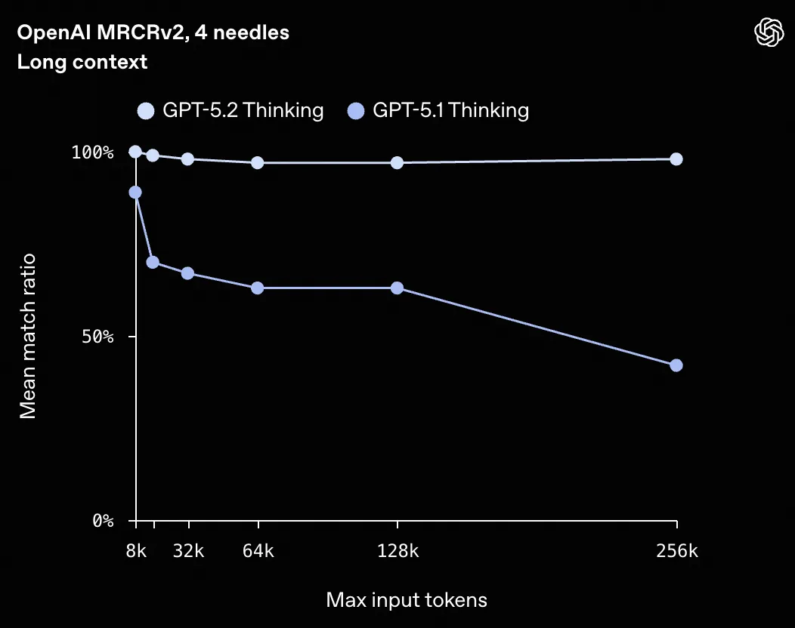

作者 | 黄东旭

过去几周，我对于 Vibe Engineering 的实践有了更多的体会, 今天再次总结一下。其实也能看出来我避免使用 Vibe Coding 这个词，是因为当下的重点已经不再是代码，而是一些更高维度的东西。另外，本文的 AI 含量我会尽量控制在 5% 内，可以放心阅读😄。

之前我提到的我开始的 TiDB Postgres 重写项目已经不再在是个玩具。在前几天出差的路上, 因为长途飞行没有网络, 我仔细 review 了一下这个项目的代码, 虽然一些地方略有瑕疵, 但是总体质量已经很高, 我认为已经是接近生产水平的 rust 代码，和以前我理解中的早期原型的定义很不一样。

顺便提一句, 我认为这个项目从一开始就选择 rust 是一个无比正确的决定, rust 的严谨性让 AI 能写出更接近 bug free 的 infra code \(对比我另一个项目 agfs 的 shell 和它自带的脚本语言 ascript，由于这项目使用 python，项目变大后，可维护性就大大降低，但此时重写已经很困难，只能捏着鼻子慢慢重构\)，所以现在已经是 2026 年了， 如果你要再启动一个新的 backend infra 项目, rust 应该是你的第一选择。

TiDB PostgreSQL Cloud

验证差不多后，我也邀请了几位我团队内的几个顶尖的 vibe coder 加入项目, 看看 100% 的 AI Native 研发模式能在多快把这个项目推进到何种程度，无论如何都很想看看，应该会很有意思。

下面说说自己最近的一些感受。

1 当前关于 Vibe Engineering 的所有的认知都会在 1 个月内严重过时 

并非危言耸听，哪怕我正在写的这篇文章，如果你是 2026 年 2 月看到，那么很遗憾，本文聊到的东西很可能已经过时，这个领域发展的太快，很多今天的 SOTA 也许下个月就过时了。而且很有意思，过去很多对 Vibe Coding 嗤之以鼻的大佬，例如 DHH，Linus，Antirez 等，在 2025.12 月开始纷纷改口，我觉得这是相当正常的，去年 12 月开始，AI 编程工具和头部的模型突然有一个跳跃式的进步，突然对于复杂任务和大型项目的理解，以及写出代码的正确率有了极大的提升。这进步大概来自于两个方面：

一方面头部模型在长上下文（>256K\) 的支持，尤其是关键信息的召回率提升惊人

例如上面是 GPT-5.2 在长上下文的召回表现和 GPT-5.1 对比很明显，要知道对于 Agent Coding 的场景来说，通常是多轮次推理 + 长上下文（因为要放更多的代码和中间推理结果）才能更好的有大局观，大局观的正确是对于复杂项目起到决定性因素。在这种场景下，你可以做一个简单的计算，一个模型（类似 GPT-5.1\) 每轮的召回率 50%，大概 3 轮后，正确的召回率就会降低到 12.5%, 而 GPT-5.2 仍然能保持 70% 以上。

另外一个进步是主流的 Vibe Coding 工具的 Context Engineer 实践日益成熟，例如 Claude Code / Codex / OpenCode。从用户体验到最佳实践，肉眼可见的越来越好，例如对于 Bash 的使用，Subagent 等，这方面越来越多的资深 Engineer 的重度使用和经验分享会对这些工具的进化提供数据飞轮，尤其是 AI 也在深度的开发这些工具，迭代速度只会更快。

其实这个进步也并不是去年 12 月那个时间点的突然什么黑科技爆发，其实前几个月一直在进步，不过还不能长时间离开人工干预，更像是那个时间点，主流 Coding Agent 的质量超过了一个临界点：100% 的无人工干预下完成长时间的 Agentic Loop 成为可能。

2 Hire the best \(model\)，否则就是在浪费生命 

上面所有提到的进步，我个人感觉只反映在了最顶尖的闭源头部模型中。我听到很多朋友和我反馈到：“我感觉 AI 编程还是很傻啊？并没有你提到那么聪明”，我首先会反问，你是不是只是用着 $20 一个月那种入门模型？如果是的话，那先去用一阵 $200 以上的 Pro Max 档次的，也许有惊喜。

我个人认为，目前主流的模型，即使并非头部那档，作为 chatbot 处理大多数普通人的短上下文的日常工作是完全足够的，哪怕是 GPT-4 在和你讲人生道理的时候也已经足够把你说得一愣一愣了。

作为人来说，我们的直觉或者是一些简单的 CRUD Demo 已经无法评估这些模型之间的智商差距了。但是在复杂的项目的开发中，这个差距是极端明显的。

根据我个人的实践来说，当下能用来进行大型 Infra 项目（数据库，操作系统，编译器等）开发的模型大概就两个：GPT-5.2 \(xhigh\) + Opus 4.5，还有半个算是 Gemini 3 Pro。

大概上个月我主要用着 opencode + oh-my-opencode + Opus 4.5 但是最近两周转向到了 codex + gpt-5.2 的组合，下面分析一下这几个模型的一些脾气和调性，仅仅是个人感受，而且是在后端 Infra 软件开发这个领域，仅供参考。

Opus 4.5 的风格是速度很快，是个话唠，由于 Sonnet 4 有严重 reward hacking 问题，例如是在解决不了 bug 的时候会偷偷的构造作弊的测试然后糊弄过去，所以导致很长一段时间我都不太敢用 Sonnet 系列模型干复杂的事情，但是这点在 Opus 4.5 中解决得很好，即使在模型冥思苦各种尝试想都搞不定的情况下也没有选择作弊，让我放心不少，但是 Opus 的问题是 reasoning 和做 investigation 的时间太少，动手太快，以至于发现不对的时候，又返回头确认假设和研究，这样的特性催生了像 ralph-loop 这样的奇技淫巧。比方说，同样的一个 prompt 在 Claude Code 结束后又通过 stop hook 重新调用，再完整走一遍流程，不断地逼近最终的结果。

相比之下，GPT-5.2 更像是一个更加小心谨慎、话不多的角色。我最开始用 Codex 的体验其实不算太好，因为我一直觉得它有点太慢了。主要是因为我习惯用它的 xhigh 深度思考模式，在真正开始写代码之前，它会花很长时间去浏览项目里的各种文件和文档，做很多准备工作。可能也是因为 Codex 的客户端不会告诉你它的计划和大概需要多久，所以就显得过程特别长。有时候一些复杂的任务，它前期的调查可能就要花上一到两个小时。但是经过长时间思考后它完成的效果通常是更好的，尤其是在一个项目的大体框架已经稳定，Codex 考虑得更周全，最终也体现出更少的 bug 和更好的稳定性。

对于第三个顶级模型，也就是 Gemini 3 Pro。虽然我也知道它的多模态能力非常吸引人，但就复杂任务的 Coding 场景而言，至少从我个人的体验来看，它的表现并没有 Opus 4.5 和 GPT-5.2 那么强。不过它确实针对一些快速的前端项目 Demo 和原型制作做了一些优化，再加上它的 Playground 模式，让你在需要一些炫酷的小 Demo 或前端项目时能更快实现。

其实一个比较反直觉的事情是，过去我们经常说 Vibe Coding 只能搞一些比较简单的事情，比如上面那些小 Demo 或 CRUD 项目，你会看到网上各种各样的 KOL 其实都在做这种小原型，反而大家觉得对于一些像后端这种核心的基础设施代码，当前 AI 还是搞不定的。我以前也这么想，但从去年 12 月份开始，这个结论可能需要修正了。这里面的原因是，其实这类基础设施的代码通常是由顶级工程师长期精雕细琢而成，它们有清晰的抽象、良好的测试，甚至代码本身经过多轮重构后也相当精炼。所以当 AI 具备足够的上下文空间 + 更好的推理能力 + 更成熟的 Agentic Loop + 高效的工具调用时，这类 Infra 代码的开发和维护反而是能最有效地利用这些顶尖大模型的智商的场景。

在实际的工作中，我经常会让多个 Agent 互相协作，或者使用一些复杂的工作流来把它们编排在一起，并不会让一个模型来完成所有的事情。后面我会再分享一些我自己实践中的具体例子。

3 人在什么时候进入？扮演什么角色？

上面提到了，这些顶级模型再配合主流的 Vibe Coding 工具，基本上已经能超越大多数资深工程师的水平了。这不仅体现在能写出更少 bug 的代码，也体现在在 review 中能发现更多人类工程师可能看不到的问题，毕竟 AI 真的会一行一行仔细看。

所以人在这个过程中扮演什么样的角色，哪些阶段只有人才能做？根据我自己的实践来说，第一当然是提出需求，毕竟只有你才知道你想要啥，这很显然，但是有时确实也挺难的，毕竟人很难从一开始就准确描述自己想要什么，这时候我会用一个偷懒的办法：让 AI 来角色扮演，比方说，我在开发 PostgreSQL 版本的 TiDB 时，我就让 AI 假设自己是一个资深的 Postgres 用户，从开发者的视角告诉我有哪些特性是非常重要、一定要实现而且 ROI 比较高的，让它列出 N 个这样的功能点，然后 AI 就会根据它的理解生成一个需求列表，接下来你再和 AI 对这些需求逐个打磨，这其实是一个高效冷启动的方法。

第二是在需求提出后，现在的 Coding Agent 大多都会和你有一个规划阶段（Planning），会反复确认你的需求。在这个过程中其实有一些技巧，比如不要给 AI 太具体的方案，而是让 AI 来生成方案，你只需要关注最终你想要的结果；提前告诉 AI 有哪些基础设施和环境的问题，让它少走弯路。

另外，我通常会在提出需求的第一阶段就要求 Agent 做的一些关键动作。比如无论接下来做什么，都要把计划和 todo 列表放在一个 work.md 或 todo.md 这类文件里。还有，每完成一个阶段的工作，就把上一阶段的经验教训更新到 agents.md 里。第三点是当一个计划完成并且代码合并后，把这个工作的设计文档添加到项目的知识库中（.codex/knowledge）。这些都是我会在一开始提需求时就放进去的内容。

第二个阶段就是漫长的调查、研究和分析的阶段。这个阶段其实基本上不需要人做什么事情，而且 Agent 的效率比人高得多，你只需要等着就好。唯一需要注意的就是在 Research 的过程中，我通常会告诉模型它拥有无限的预算和时间，尽可能充分地进行调研。另外，如果你的模型有推理深度的参数的话，我建议在这个阶段把它们全部调到 xhigh 的级别。虽然这会让过程变慢，但在这个阶段多烧一些 token、做好更好的规划、了解更多上下文，对后续的实现阶段会更有帮助。

实现阶段没什么特别好说的，反正我现在基本不会一行行去看 AI 的代码。我觉得在实现阶段唯一要注意的就是，要么你就让 AI 完全去做，要么你就完全自己做，千万别混着来，我目前是倾向于完全零人工干预的模式效果更好。

第四个阶段人就变得非常重要了，那就是测试和验收结果的阶段。其实在我个人和 AI 开发项目的过程中，我 90% 的时间和精力都花在了这个阶段：也就是如何评估 AI 的工作成果，我觉得在 Vibe Coding 时：There's a test, there's a feature，你只要知道如何评估和测试你要的东西，AI 就一定能把东西给你做出来。另外值得注意的是，AI 在实现过程中会自动帮你添加很多单元测试，但说实话，这些单元测试在微观层面基本都能通过，毕竟 AI 写这种局部代码时已经很难出 bug。但 AI 不擅长的是集成测试、端到端测试。比如在开发一个 SQL 数据库时，哪怕每个细节的单元测试都没问题，但整合到一起时集成测试可能会出错。所以我在完成大目标前，我一定会先和 AI 一起做一个方便的集成测试框架，并提前准备好测试的基础设施，收集和生成一些现成集成测试的用例，尽量一键能运行那种，这样在开发阶段就能事半功倍，而且关于如何使用这些测试的基础设施的信息，我都会在正式开始前就固化在 agents.md 里，这样就不用每次沟通的时候都再告诉它该怎么测试了。关于测试从哪来的问题，我自己的经验是你可以让 AI 帮你生成，但一定要告诉它一些生成的逻辑，标准和目的，另外就是千万不要把生成测试的 Context 和实际进行开发工作的 Agent 的 Context 混在一起。

第五个阶段是重构和拆分。我发现当前的 Coding Agent 在面对单一模块复杂度超过大约 5 万行代码之后，就开始很难在 1-shot 里把问题一次性解决掉（但反过来这也意味着，只要任务复杂度控制在这个阈值之下，在一个足够好的 first prompt 驱动下，很多事情确实可以做到 1-shot AC），Agent 通常不会主动去做项目结构和模块边界的治理，你要它把功能做出来，它恨不得把所有东西都写进几个几万行的大文件里，短期看似很快，长期就是债务爆炸。我自己在这个阶段的做法通常是先停下来，用自己的经验进行模块拆分，然后在新的架构下进行 1～2 轮的重构，之后又可以高并发度的进行开发了。

4 多 Agent 协同编程的一些实践 

前面提到我现在使用 Coding Agent 的时候，通常不会只用一个，我自己的工作流会尽量让多个 Coding Agent 同时工作。这也是为什么有时候在一些项目上会花掉好几千美金，因为你必须把并发跑起来。当然，并发和吞吐是一方面，但另一方面我觉得让不同的 Agent 在不共享上下文的前提下互相 Review 工作，其实能显著提高质量。这就像在管理研发团队时，你不会让同一个人既当运动员又当裁判。相当于 Agent A 写的代码交给 Agent B 来 Review，往往能发现一些 A 看不到的问题。通过这样的循环往复，你就会更有信心。

例如，我在实际工作中现在用得比较好的一个工作流是这样的：首先让 GPT-5.2 在 Codex 下生成多个功能的设计文档，做出详细的设计和规划，第一阶段把这些规划文档都保存下来。然后在第二阶段，依然用 Codex 根据这些需求文档一个一个去实现功能。在实现的过程中，就像我前面提到的那样，记录 To-Do、经验教训，并在接近完成的时候，在代码通过测试并准备提交之前停下，把当前的工作区交给另一个 ClaudeCode 或 OpenCode，在不提供上下文的情况下，让 ClaudeCode 来 Review 当前还未提交的代码，根据设计提出修改建议。然后再把这些建议发回给 Codex，让 Codex 来评论这些建议，如果有道理就修改代码。改完之后，再让 ClaudeCode \(Opus 4.5\) 那边再次 Review，直到双方都觉得代码已经写得很不错了，再提交到 Git 上，标记这个任务完成，更新知识库，然后进入下一个功能的开发。

另外在一个大型项目中我会同时开多个 Agent \(in different Tmux\) 并行开发多个功能，但我尽量让它们负责完全不同的模块。比如一个 Agent 修改内核代码，另一个 Agent 做前端界面，这样就能分开进行，如果你需要在一份代码上做一些彼此不太相关的工作时，可以利用 git 的 worktree 让多个 Agent 在不同的 git 分支上各自工作，这样也能快速提升吞吐量。

5 未来的软件公司和组织形态 

未来的软件公司会是什么形态呢？反正从我自己的实践和与一些朋友的交流来看，至少在当下，团队中用 Coding Agent 的 token 的消耗呈现出一个非常符合二八定律的分布，也就是说，最头部的用 AI 用得最好的工程师，他们消耗的 token 可能比剩下 80% 的工程师加起来还要多，而且 Coding Agent 对于不同工程师产出（质量，吞吐）的增益是不一样的，这个方差非常大，也就是对于用的最好的一群人，他们的增幅可能是 10x，但是普通人可能也就是 10%，而且唯一的瓶颈是人工的 code review 和一些无法被自动化的线上运维工作（我觉得也很快了）而且这样的特点能够让这些头部的工程师在 AI 的协助下可以无边界的工作，也就是会有越来越多的 one-man army 出现，只是目前我认为和 token 消耗是正相关的，你能花掉多少 token，大致代表你能做的多好。

另外我发现一个很有趣的现象，同样是 10x 的工程师，他们各自的 Vibe Coding 工作流和最佳实践其实并不相同。也就意味着，两个顶尖的 Vibe Coder 是很难在一个项目中（的同一个模块）协作。这种工作方式更像是头狼带着一群狼群（Agents），在一片自己的领地里面耕耘，但是同一片领地里很难容纳两匹头狼，会造成 1+1 < 2。

在这样的组织形态下，我觉得传统意义上的“团队协作方式”会被重新定义。过去我们强调的是多人在同一个代码库、同一个模块里高频协作，通过评审、讨论、同步来达成共识；但在 Vibe Engineering 这种模式下，更有效的方式反而可能是强解耦的并行。管理者要做的是把问题切分成足够清晰、边界明确的“领地”，让每一个头部工程师带着自己的 Agent 群，在各自的领域里做到极致。

从管理的角度看，这其实是一个挺大的挑战。因为你不能再用统一流程、统一节奏去约束所有人。对顶尖的 Vibe Coder 来说，过多的流程和同步反而会显著拉低效率，甚至抵消 AI 带来的增益。管理者更像是在做“资源调度”和“冲突隔离”：确保不同头狼之间尽量少互相干扰，同时在必要的时候，能够通过清晰的接口、契约和测试来完成协作。

因为上面的种种，AI-Native 的研发组织其实很难自底向上从一个非 AI-Native 的组织中生长出来，因为大多数开发者面对变革的时候的第一反应其实并不是拥抱，而是回避和抵触，但是时代的进步不会因为个人的意志转移，只有主动拥抱和被动拥抱的区别。

大概就写到这里吧，总的来说，在这样一个大环境下，对个人而言意味着一场深刻的转变，就像我之前在朋友圈里提到的，我身边最好的工程师们有一些已经陷入了或多或少的存在主义危机。

但是作为具体的 Builder 的我来说是兴奋的，因为造物，在当下，门槛变低了许多，如果你能从造物中能获得成就感和找到人生的意义，那恭喜你，你活在一个最好的时代。但反过来，作为一个抽象的 “人” 来说，我又是悲观的，人类是否准备好面对这样的工具？以及这样工具带来的对于社会和整个人类文明的冲击？

我不知道。

今日好文推荐[员工公开群“怒怼”追觅CEO？俞浩发声：专项整改！携程回应被立案调查；“死了么”APP征新名：谐音梗玩脱了？| Q资讯](https://mp.weixin.qq.com/s?__biz=MjM5MDE0Mjc4MA==&mid=2651272102&idx=1&sn=e1b7f09b05f45ad0dafbfa8c41c2e682&scene=21#wechat_redirect)[Agent 不是渐进升级，而是要“换代”了：Cursor 工程负责人放话未来三到六个月，行业将迎来大变局](https://mp.weixin.qq.com/s?__biz=MjM5MDE0Mjc4MA==&mid=2651272073&idx=1&sn=e6cb79c96f2f160515fe40a95e591201&scene=21#wechat_redirect)[烧掉数万亿 Token、数百 Agent 连跑一周：Cursor“从零写浏览器”，结果是拼装人类代码？](https://mp.weixin.qq.com/s?__biz=MjM5MDE0Mjc4MA==&mid=2651272015&idx=1&sn=2da79f242cb27f99a1d4bfe96fb326b1&scene=21#wechat_redirect)[IDE消亡之年？Steve Yegge两句狠话：2026年还用IDE就不行，每天烧500–1000美元Token才合理](https://mp.weixin.qq.com/s?__biz=MjM5MDE0Mjc4MA==&mid=2651271969&idx=1&sn=5fde427047dff93e3aef7c6b8c2a0e26&scene=21#wechat_redirect)会议推荐

InfoQ 2026 全年会议规划已上线！从 AI Infra 到 Agentic AI，从 AI 工程化到产业落地，从技术前沿到行业应用，全面覆盖 AI 与软件开发核心赛道！集结全球技术先锋，拆解真实生产案例、深挖技术与产业落地痛点，探索前沿领域、聚焦产业赋能，获取实战落地方案与前瞻产业洞察，高效实现技术价值转化。把握行业变革关键节点，抢占 2026 智能升级发展先机！

