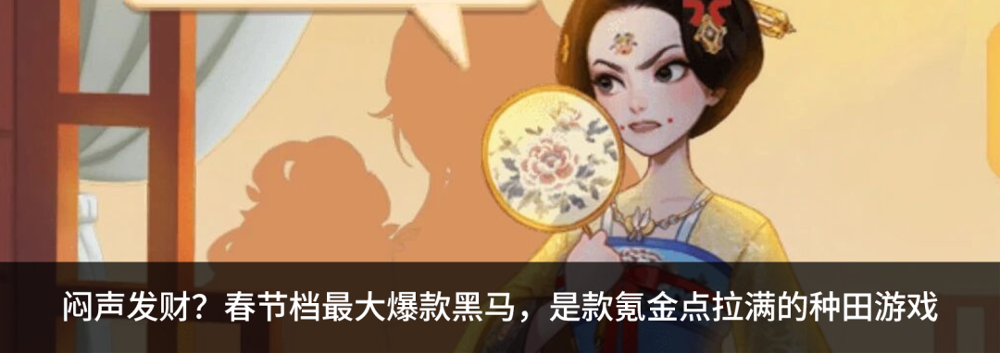

编者按：原文标题为《当造梦成本归零｜影视行业的未来五年》，但文章所讲述的绝大多数细节，都可以在替换名词之后直接适用于游戏行业。对于AI为内容行业带来的冲击，本文抽丝剥茧地提供了数字、预测和判断。不少游戏公司老板和制作人也为文章点了推荐。文**｜** 郑林**封面来源****｜** 《Babylon》截图

作者介绍：伴山文化创始人，影视出品人、制片人、编剧。代表作品包括悬疑剧《新生》（制片人/编剧）、《你好，旧时光》《棋魂》《了不起的女孩》等高口碑剧集，投资出品院线电影《孤注一掷》《南京照相馆》《群星闪耀时》等。曾联合创立小糖人传媒，任联合创始人兼CEO。此前任中国文化产业投资基金投资经理、内容领域首席专家，长期从事文化产业投资与研究。本科毕业于北京电影学院导演系，研究生毕业于美国哥伦比亚大学，获国际经济与金融硕士学位。

  

这篇文章想了很久，写得很快。

起因是一个具体的困惑：我从电影学院导演系入行，做了快二十年影视——做过文娱产业投资、创办了影视公司、制片、写剧本、盯现场盯后期、也投资出品过几部你可能看过的电影——但从2025年下半年开始，我越来越不确定自己正在做的事，三年后还是不是同一件事。

这不是焦虑。焦虑是你不知道会发生什么。我的问题是：我大致知道会发生什么，但我不确定该怎么应对。

于是我花了几个月时间，把自己能想到的问题逼到底。不是那种"AI将改变一切"的空话——那种话不值得写两万字。我想回答的是几个非常具体的问题：什么东西正在变得不值钱？什么东西正在变得更值钱？变化会以什么顺序发生？爆款内容会长什么样？钱最终被谁赚走？以及，像我这样的人，到底应该做什么？

写完之后我发现，最让我自己意外的结论，不是哪个技术判断——而是一个关于"人"的判断。它改变了我对接下来要做的每一件事的想法。

这篇文章里有一些数字，有一些我可能会说错的预测，也有一些行业里大家心知肚明、但很少有人愿意写下来的判断。全文大约两万两千字，读完需要四十分钟。如果你在看AI赛道、在用AI做内容、在影视行业想下一步怎么走，或者只是在想技术到底会把创作这件事带向哪里——这篇文章可能值得你花四十分钟。

不是因为我的答案一定对。是因为这些问题，我们谁都绕不过去。 

# **序言：**

# **一条成本曲线，断裂了******

2026年2月7日，距离春节档开战还有十天。

影视行业严阵以待。为了院线排片率和几十亿的票房，各家资本做着最后的近身肉搏，照例盘算着今年谁能押中爆款。没有人注意到，一颗陨石已经悄然落入深海。

就在这天，字节跳动在即梦平台悄悄放出了Seedance 2.0的灰度测试。几天前，快手刚刚上线了可灵3.0。

没有发布会，没有预热。两家公司前后脚，把各自憋了大半年的底牌摊在桌上。然后，整个创作者圈层炸了。冯骥——《黑神话：悟空》的制作人——试完Seedance 2.0之后半夜发了一段话，他说：**"AIGC的童年时代，正式结束了。"** 几天后，马斯克在X上转发了一段Seedance 2.0的生成视频，只写了三个词：**"It's happening fast."******

我自己也在第一时间进行了测试。我接触了近二十年影视 ——从电影学院导演系入行，做过投资、创业、制片人、编剧，经手过影视产业的各个环节。说实话，看到生成结果的那一刻，第一反应不是兴奋，是沉默了很久。

不是因为画面有多完美——它还有瑕疵，懂行的人一眼能看出来。让我沉默的是两件事。第一，它开始"懂"镜头语言了。不再是把画面动起来那么简单，它知道什么时候该切特写、什么时候该拉远景，甚至懂得用运镜制造情绪的呼吸感。第二，速度和成本。一条2分钟的科幻短片，从概念到成片，总成本不到200块，一天内可以完成。

**200块。******

而今年开战的春节档里，正在厮杀的重工业视效片，**3到5亿** 是起步价。

两个世界，在同一个春节，正面相撞了。当然，还有大洋彼岸正在准备律师函的好莱坞六大制片公司。

影视行业提倡降本增效已经有六七年了。如今，一部30集的S级古装剧集，平均成本依然在2亿元人民币以上。现场动辄几百人，从开发到播出，整个周期三年起步。大银幕更夸张：成本控制在1亿左右的只能叫"中等体量"，参与暑期档和春节档角逐的重工业视效片，投资规模从3亿起跳，个别项目直逼8到10亿。

所有这些钱、这些年、这些人，本质上都在干同一件事——**对抗物理世界的摩擦力。**

我也经历过这样的场面，为了一场日出的光线，几百号人扛着设备在外景地等三天。为了一个三秒钟的爆炸镜头，后期团队在机房里渲染两个月。为了让一座虚构的城池拥有烟火气，美术部门反复打磨几个月。这就是我们这个行业一百年来的基本面：重资产、长周期、高度依赖物理世界的配合。

而现在，可灵3.0已经能原生输出4K、60帧的连续画面。Seedance 2.0可以根据一段文字描述，自动规划分镜和运镜，同步生成画面与音效。一条15秒的高清视频，算力成本在百元量级以内。并且，这个数字还在以肉眼可见的速度往下掉。

当然，它们还远远做不了一部完整的电影。单段生成时长目前在4到15秒之间，角色跨镜头的一致性刚刚达到"商业可探索"的门槛，复杂的情感表演和复杂物理交互仍稍显力不从心。这些都是事实，都是现阶段的硬限制。但如果只盯着这些限制，你会犯一个致命错误。我们真正应该关注的，不是此刻的画面，而是变化的斜率。

2025年初，AI视频还基本停留在"让一张图动起来"的阶段，角色一动就变形，物理规律形同虚设。12个月后的今天，我们已经站在了多镜头叙事、原生音画同步、自动分镜的起跑线上。以这个迭代速度——而所有底层技术指标都在指向加速而非放缓——再给它两到三年，画面本身将不再是任何问题。

把这两组数字放在一起看：

一边是：**数亿预算，上千人团队，三到五年周期。**

另一边是：**一个三到五人的小队，几十万的算力账单，几个月的迭代周期。**

这不是效率的提升。这是一条维系了整个影视产业百年命脉的成本曲线，正在断裂。

很多同行——包括我非常尊敬的一些前辈——试图把AI类比为"数码相机替代胶片"：工具升级了，但导演还是导演，行规照旧。我理解这种判断背后的心理需求，但我认为它严重低估了变革的量级。

更准确的参照系，是2007年的初代iPhone。

iPhone不仅仅淘汰了诺基亚。它在五年内顺手埋葬了便携GPS、MP3播放器和卡片相机，然后在废墟上催生了微信、Instagram和移动支付——这些如今万亿市值的产业，在iPhone发布那天连名字都还没有。

AI对娱乐产业的冲击，正在沿着同样的路径展开：它不是在现有的产业流水线上替换掉某个工种，而是会同时改写生产方式、组织形态、分发逻辑和变现模型。

基于此，我试图做一个推演——

到2031年，过半的虚构类视频内容将由AI生成或深度参与生成。在科幻、奇幻、高概念动画这些重度依赖视觉奇观的品类中，这个比例大概率会超过80%。不是线性的缓慢爬坡，而是指数级的跃迁——正如iPhone从2007到2012只用了五年，就彻底重塑了人类的移动世界。

过去一百年，从好莱坞到横店，我们整个行业所有商业逻辑的地基，都建立在同一个前提上：**造梦是极其昂贵的事。** 因为贵，所以权力集中在能凑齐这笔钱的少数人手里。因为贵，所以试错空间极小，行业天然趋于保守。因为贵，所以创作者不得不在资本和平台面前交出相当一部分的控制权。

这块地基，正在我们脚下松动。

所以，不要再问"AI会不会改变这个行业"了。

真正值得每个从业者认真想一想的问题是：**当视觉奇观的供给趋于无限，当造梦的成本不再是门槛，在这场新的游戏里，什么才是真正稀缺****的****？**

# **第一问：  
**

# **AI打碎了旧规则****  
**

# **未来****真正稀缺****的是什么****？**

> 视觉奇观正在变得廉价，但情感共鸣不会。AI时代最值钱的人类能力是“审美工程”——不是知道怎么跟AI说话，而是知道应该让AI做什么。

技术在指数级突变。但人类的生物学底层——我们为什么需要故事，我们如何被打动，我们愿意为什么掏钱——几乎亘古未变。

在谈论任何AI工具和商业模式之前，先锚定这个不变的底座。

人类消费虚构内容，底层驱动力从来只有三种：

**刺激。** 对未知、悬念和视觉奇观的本能饥渴。安全环境下的肾上腺素。所有爆米花大片和短视频爽剧的底层逻辑，都建立在这一层。

**共情。** 看见别人的命运，体验自己未曾经历的情感。我们在银幕前流泪、愤怒、释然，是因为大脑的镜像神经系统让我们不由自主地代入了他人的处境。所有伟大剧集和电影的核心引擎，都在驱动这一层。

**逃离与陪伴。** 在现实的高压中，进入一个可控的平行世界，获得身份的延展、关系的替代、或纯粹的心理庇护。游戏、虚拟社区、以及正在快速成型的AI伴侣产品，需求根基都在这一层。

从古希腊露天剧场到抖音竖屏短剧，这三种需求从未改变。变的只是承载它们的介质。

但这里有一个关键判断，我认为大多数人会搞反——

当AI让视觉奇观的生成成本趋近于零，这三种需求里，哪一种会成为商业上的硬通货？

直觉答案是"刺激"。AI最擅长生成炸裂画面，未来就是视效军备竞赛，谁的画面更炸谁赢。

我认为恰恰相反。

原因是一条基本的心理规律：**纯感官刺激的阈值衰减极快。** 第一次看到AI生成的逼真巨龙喷火，你会震撼。第十次，麻木。第一百次，无感。视觉奇观的"保鲜期"正在一代比一代短——2009年《阿凡达》的3D效果让全球观众惊叹了好几年；而今天，一段AI生成的震撼画面，生命周期可能只有几周，就会被更新的生成结果淹没。

真正抗衰减的是共情。

**奇观正在变得廉价。但情感共鸣不会。**

一个让你牵挂的角色、一段让你心碎的关系、一个精准击中你此刻人生处境的故事弧线——这种情感连接不会因为"看多了"而贬值。恰恰相反，它会随着你投入时间的增加而加深。你不会因为"已经看过太多好故事"而对下一个好故事免疫。

**一部好作品 =**

**10,000次你无法外包给AI的判断** **

关于 AI影视，当前最流行的一个误解是："未来任何人输入一句话，就能生成一部好莱坞水准的电影。"

这在逻辑上不成立。

AI是极其强大的概率生成器——给定一个提示，它能穷尽像素和声波的排列组合，输出成千上万种"可以"的结果。但它没有方向感。

一部100分钟的优秀电影，本质上是创作者做出的上万次微小而精确的审美判断的总和。每一次判断，都是在AI提供的无数个"可以"的选项中，选出那唯一一个"对"的。

做一个思想实验。

同一段AI生成的素材：一个女人站在医院走廊尽头，背对镜头。

一个没有经验的用户看到这个画面，觉得构图不错，光影不错，直接用了。

一个好的创作者会看到：走廊的灯光太平了，需要掐掉漫反射，只留一束冷硬的顶光，让眉骨在眼窝处投下浓重的阴影。她的肩膀线条太放松，应该微微绷紧——因为她刚做了一个艰难的决定。背景不该是静音，应该有极远处ICU监护仪的微弱滴答声，把观众的潜意识拉进医疗场景的紧张氛围。这个镜头应该比"正常节奏"多停留一秒半——让观众从"看到她"过渡到"感受到她"。

这四个调整中的每一个，都可以写进Prompt让AI重新生成。技术上完全做得到。但问题从来不是"AI能不能执行"，而是"谁知道应该这样做"。能提出这些要求的人，本身就已经具备了创作直觉——而这种直觉，是多年浸泡在故事、画面和人类情感中训练出来的审美肌肉记忆。

工具变了。但判断力的稀缺性不仅没有降低，反而被放大了。

因为AI给你的选项空间从一个变成了一万个。在十个选项里挑出最好的那个，和在一万个选项里挑出最好的那个，后者对判断力的要求是指数级上升的。

这就是为什么"提示词工程"（Prompt Engineering）只是一个过渡态——它解决的是"怎么跟AI说话"的问题。而真正的核心能力，是知道"应该让AI做什么"。

我把这种能力叫做**审美工程****（ Taste Engineering）**。

它的本质是：在AI提供的无限可能性空间中，做出那些让作品从"正确"跃迁到"动人"的关键选择。AI负责生成海量的变量，人类负责提供方向。

这跟科技行业正在发生的事高度相似。程序员越来越少逐行写代码，而是用自然语言描述意图，让AI生成代码，然后凭经验和直觉做取舍——业内管这叫Vibe Coding。影视创作正在经历同样的转变，从逐字逐帧手工打磨，到用持续的审美判断力驾驭AI输出。

但有一个关键区别：代码的"对错"有客观标准——能不能跑通、有没有bug，而叙事没有。这意味着在影视创作中，“审美工程”的壁垒比代码领域更高、更难被拉平。

**审美，是 AI时代最反脆弱的人类能力。**AI越强大，能生成的选项越多，从中挑出"对的那一个"的判断力就越值钱。

**旧稀缺正在消散，新稀缺正在成型** **

我们可以画一条清晰的分界线。

过去一百年，影视行业的稀缺资源是什么？是资金和人脉——凑齐几个亿做一部大片的组盘能力。是大规模协作——协调几百人剧组吃住行和档期的管理能力。是技术流程——动辄几个月甚至一两年的后期渲染和特效制作。

这些资源正在快速贬值。当一个3到5人的团队用几十万的算力预算就能生成同等画质的内容，资金门槛不再是门槛。当AI接管了大量技术执行层面的工作，巨型团队不仅不再必要，组织惯性反而可能变成转型的阻力。

最近有一条新闻值得注意：一个做并购投资的金融人，不会写一行代码，用AI Agent给GitHub上十九万星的开源项目提交修复，72小时进入贡献者前三十——排在他前后的全是十年经验的硅谷工程师。当"执行"本身可以被委托给AI，它就不再是稀缺资源。

正在急剧升值的是另外三样东西：

**审美工程能力。** 这是区分90分作品和60分作品的核心变量，也是目前AI最无法替代的人类能力。后面的章节会详细展开它在实际生产中的具体形态。

**世界观架构能力。** 一个能自洽、能衍生无限故事线和数字资产的底层宇宙设定。漫威花了十五年才建立起横跨数十部电影的叙事宇宙，未来的AI原生团队可能在一两年内构建出同等复杂度的世界。

**超高人才密度的小团队。** 这可能是最容易被低估的新稀缺。未来的内容生产单元不再是几百人的剧组，而是三到五人的核心团队——一个懂叙事的人、一个懂视听审美的人、一个懂AI工作流的人、一个懂商业化的人。每个人都是跨界的复合型选手，一个人的产出顶过去一个部门。而这样的人，全行业可能凑不出几百个。

谁能发现、吸引和组织这样的人，谁就掌握了AI时代内容产业最核心的生产资料。

不是算力，不是模型，不是资金。

**是人。但是完全不同定义下的 "人"。******

但稀缺本身不等于值钱。接下来的问题是：当供给爆炸，这些新稀缺的能力，能在产业链中兑现为多大的定价权？

要回答它，最好先看看上一次供给爆炸时发生了什么。

2016到2020年，智能手机的普及和4G网络让视频的拍摄与分发成本趋近于零。供给端经历了一场历史级的大爆发。

结果是一次极其残酷的价值链重分配。

一边，中间层被大面积压缩。那些靠"设备壁垒"和"信息差"活得不错的腰部制作团队——传统的宣传片公司、中低端TVC团队、缺乏内容灵魂的流水线PGC厂牌——突然发现自己的生存逻辑被釜底抽薪了。一个品牌过去花三十万找制作公司拍一条TVC，播放量可能不如实习生用手机拍的15秒短视频。一台iPhone加剪映，配合素人原生态的网感，不是"差不多好"，而是在传播效率上碾压了"精美的平庸"。**当 "够用"的东西免费了，"还行"就不再是一门生意。**

另一边，头部个体获得了超额溢价。海外的Mr. Beast、国内的李子柒、影视飓风，这些超级个体凭借极致的个人特质和内容辨识度，单人或小团队的商业变现规模反超了传统电视时代的一线制作公司。

最后，平台成为了绝对的权力中枢。平台垄断了分发渠道和算法推荐权，不仅掌控流量的生杀，更攫取了产业链中最大份额的利润。内容成了算法机器里随时可替换的燃料。

看着这套已经写好的剧本，很多人自然而然地推断：AI视频时代不过是旧戏重演——成本再次归零，平台继续吃掉一切，创作者继续在算法推荐池里被极限挤压。

如果讨论的是信息类短视频，这个推断毫无破绽。

但在虚构类深度叙事的战场上，这个推断会是致命的误判。

**浅层注意力经济与深层情感经济，运行的是两套完全不同的规则。**

短视频的消费模式是被动投喂。用户打开App，算法决定你看什么，单条内容停留时间以秒计。用户对绝大多数单条内容的情感投入极低，也很少有主动选择的意愿。在这个模式下，算法就是上帝，平台权力天然最大化。

但虚构类深度内容——一部让你追了三季的剧集、一个你投入了两百小时的游戏世界、一组你深度共情的角色群像——它的消费模式是主动选择。用户是带着期待和情感预期来的，是"我要看这个"，不是"随便给我推点什么"。

这个区别导致了截然不同的经济学结构：

在浅层注意力经济中，内容是流量的燃料，平台是分配流量的中枢。内容可以被替换、被遗忘，平台不可被绕过。

在深层情感经济中，关系倒过来了。**用户的忠诚度绑定在内容上，不在平台上。** 长视频平台的用户会因为一部剧完结而取消订阅。游戏玩家会跟着IP从一个平台迁移到另一个平台。情感绑定的锚点是内容本身，不是渠道。

这是理解后面所有判断的关键前提。

**当 AI让60分的虚构内容泛滥，90分内容的稀缺性反而被放大了。**

AI驱动的虚构内容大爆炸一定会发生。但它带来的不是所有内容的平等升值，而是一次极端的两极分化。

想象一下那个场景：当任何人都能用AI生成"看起来还不错"的视频故事，平台上的虚构内容供给会出现指数级的膨胀。用户面临的不是"选择变多了"，而是"信噪比急剧恶化了"。在一片60分内容的汪洋中，发现一部真正好的作品，成本大幅上升。

这个时候会发生什么？

平台会用更强的AI推荐系统来应对信息过载。这在一定程度上有效，但它有一个结构性的天花板：算法推荐越强，用户越被动——体验越趋向浅层消费——而这恰恰与深度虚构内容"主动选择、情感投入"的本质相矛盾。

另一条路径会同时出现：**真正的超级内容开始自带引力场。** 它不需要平台推荐来"被发现"——口碑、社交传播和品牌认知让用户主动寻找它。用户不是在平台的货架上刷到了一部好剧，而是带着明确意图打开它。

游戏行业已经走通了这条路。《原神》不依赖任何单一应用商店来获取用户——它本身就是入口。用户直接下载、进入、留存、持续消费。这个模式在影视领域还没有发生，但AI正在创造它发生的条件：制作成本从亿级降到百万级，跨语言配音在几天内完成，一个小团队的顶级作品可以同时触达全球主要语言市场。当这些条件同时成立，超级内容为什么还需要把自己塞进别人的平台？

**在 AI驱动的供给爆炸中，定价权的迁移方向不是从创作者到平台，而是从平台到创作者——但只限于那些能做出超级内容的人。**

60分的内容在新世界里毫无定价权。它是算法池里的燃料，跟短视频时代没有区别。但90分以上的内容，将第一次拥有独立于平台的议价能力和变现路径。差距不是线性的，而是断崖式的。

**在供给无限的海洋里，最值钱的不是海水，是那座拥有独特引力的岛屿。**

而要理解这座岛屿到底长什么样——它的生产方式如何运转、它的时间表是什么——我们需要先拆解AI对整条影视制作链的传导路径。

# **第二问：**

# **这场变革会怎样发生？****  
**

# **2026-2031产业重塑时间表******

> 这不是一个瞬间事件，而是沿产业链逐环节倒下的多米诺骨牌。编剧最先被重新定义，实拍从默认项变为可选项，传统后期被出厂能力直接覆盖，语言墙在2028年前后基本拆除。

序言里，我们用两组数字勾勒了成本曲线断裂的轮廓，也点出了底层逻辑的切换：从"捕捉"到"生成"。但"断裂"不是一个瞬间事件，它是一场沿着产业链逐环节传导的连锁反应——像多米诺骨牌一样依次倒下。接下来我试图给出一张具体的时间表：什么东西会先变，什么东西会后变，以及——最关键的——什么东西不会变。速度取决于什么？

**推演的前提：四个关键变量** **

任何关于 "未来五年行业会怎样"的预判，如果不先交代它依赖的前提假设，就只是在画饼。有四件事的走向，决定了这场重构的速度和路径。

**变量一：跨镜头的一致性与可控性。**

很多人把技术瓶颈理解为"AI能不能生成更长的视频"——10分钟、30分钟、甚至90分钟的连续画面。这个理解偏了。

实际的创作场景不是让AI一口气吐出一部长片。它是一场一场戏地做：这场戏在医院走廊，下场戏在手术室，再下场在熙来攘往的大街上。真正卡脖子的问题是——当你分场景、分镜头地生成这些素材时，角色的脸还是不是同一张脸？衣服的褶皱、光线的色温、空间的透视关系，能不能在不同镜头之间保持一致？已经生成的画面，能不能精确地微调某个局部，而不是每次都要推倒重来？

这才是从"AI实验短片"跨越到"AI叙事长片"的真正门槛：不是连续生成时长，而是跨镜头的一致性、连续性和可微调性。

目前，Seedance 2.0和可灵3.0在单镜头和短序列上已经展现出“商业可探索”的水准。下一代模型——按目前各家公开和半公开的迭代节奏，大概在2026年下半年到2027年——正在集中攻克这个问题。

**变量二：算力成本的下降斜率。**

很多人把算力成本理解为一条匀速下降的直线——每年便宜一点，渐进式地普惠。实际情况更像台阶：在某个节点，成本会因为模型架构的代际突破或芯片工艺的换代而骤降。每18个月下降60%到70%，不是一条平滑的斜坡，而是一段平台期之后的突然坍塌。

这意味着，产业的反应窗口比线性思维预估的要短得多。你觉得还有三年缓冲，可能一次模型换代就把时间压缩到了十八个月。

**变量三：创作者的采纳速度。**

技术成熟不等于产业变革。中间差的那一环，是人。

关键问题是：多快会有足够多的优秀创作者真正把AI融入日常工作流？目前头部传统影视人的采纳率还很低——这不难理解，已有的工作惯性、团队结构、甚至身份认同都是阻力。但另一边，一批AI原生的创作者正在快速涌现，他们没有旧包袱，天然用AI的方式思考和创作。

这两股力量不会缓慢汇合。更可能发生的是，AI原生创作者先做出几部现象级作品，传统创作者在压力下被迫跟进——跟当年流媒体逼传统影视公司转型，是同一个剧本。

**变量四：监管环境的地域差异。**

不同市场对AI生成内容的政策态度，会直接影响产业落地的节奏和地理分布。这个变量的展开留到本章后半段，它是不可忽略的结构性因素。

**三种情景** **

基于这四个变量的不同 走向，我做了三种推演。不是为了精确预测——精确预测在这种量级的变革面前毫无意义——而是为了框定一个合理的可能性区间。

**基准情景 ——最可能的路径。**跨镜头一致性在2027年基本解决，复杂场景仍需人工精调。单位算力成本到2028年降至当前的五十分之一到百分之一。到2031年，过半的头部虚构类内容由AI深度参与生成，制作周期从"以年计"压缩到"以月计"。换句话说，2031年的一个顶级制作团队，可能只有五个人，但他们的产能相当于今天一个两百人的公司。

**加速情景 ——技术超预期突破。**如果下一代模型在跨镜头一致性和世界连贯性上实现飞跃式进步，上述时间表整体前移12到18个月。到2029年，科幻、奇幻、动画等重度依赖视觉奇观的品类中，绝大多数内容由AI直接生成，影视资产和游戏资产在底层数据上开始打通。

**保守情景 ——瓶颈超预期顽固。**跨场景的角色一致性到2029年仍需大量人工干预。AI的主战场集中在已经成熟的环节：单镜头视觉生成、标准化后期特效替代、多语种本地化、辅助编剧的预可视化。全面的AI原生长叙事制作延后，但传统后期产业链仍被深度重塑。

但即使在最保守的假设下，有一点不会改变：**传统制片模式的成本结构已经不可持续。** 区别只在于三年还是五年。方向没有悬念——唯一的悬念是谁先动。 

**产业链各环节的传导路径**** ****

方向确定之后，接下来的问题是：具体怎么传导？哪些环节先变，哪些后变，哪些会被替代，哪些会被重新定义？

**编剧与创意：最不可能被替代，****但****一定会被重新定义**

产业链传导的起点，是离"人"最近的环节。

AI在目前阶段，还不具备真正的"目的性"。一个好故事的核心——人物弧线的设计、主题的提炼、情感节奏的编排——仍然需要人类的洞察力和审美判断。"目前阶段"这个限定词很重要。AI的能力边界在持续扩展，保持开放比武断画线更明智。

但编剧的工作方式会发生根本变化。

传统编剧的工作流是高度串行的：构思概念→写大纲→写分场→写台词→交付剧本→等拍摄反馈→修改。一部剧集走完这个流程，短则一年，长则三五年。AI时代的编剧工作流正在变成同时推进、即时可见的。编剧写下"深夜，她一个人坐在餐桌前，对面的椅子是空的，桌上摆着两副碗筷"——几分钟后，AI已经生成了多个视觉版本：不同的光线、不同的餐桌陈设、不同的人物坐姿。编剧即时判断："碗筷太整齐了，应该有一副是用过的——她等了很久，先吃了，又放下了。"当场调整。

**反馈循环从 "以月计"压缩到"以分钟计"。**过去，编剧写完剧本至少要等半年才能看到拍出来的效果，经常发现跟想象完全不一样——但已经没有机会调整了。未来，创意和视觉之间几乎可以实时同步。

我把这种创作方式叫做**"即时创作"** ——创意、视觉和叙事不再是流水线上的先后工序，而是在同一个时空中并行发生、互相校准。它对创作者的要求不是降低了，而是大幅提高了：你需要同时具备叙事直觉、视听审美和AI工具的驾驭能力。第一章提到的审美工程，在这里落地为一种具体的工作形态：编剧的核心任务，从"亲手写出每一句话"变成了"在AI提供的大量可能性中，做出那些让故事真正动人的选择"。

到2027年底，这种工作方式将成为AI原生创作者的标准配置。同时，一批从游戏设计、视觉艺术、甚至完全非影视背景的创作者会快速涌入——他们没有旧包袱，天然用这种方式思考和创作。对传统编剧来说，这不是"要不要学新工具"的问题，而是整个创作范式在迁移。

创意端的重新定义说完了。接下来看物理端——拍摄现场会发生什么。

**实景拍摄：从 "默认选项"到"可选项"**

行业里有两种声音：一种认为拍摄会完全消失，以后全靠生成；一种认为AI顶多是辅助，实拍永远是核心。

真实的图景大概率在两者之间，但会比多数人预想的更偏向前者。

到2029年前后，两类实景拍摄会大幅缩减：场景依赖度高的虚构内容（古装、科幻、奇幻、战争），以及群演密集型场景（万人战争、城市街景）。前者不再需要搭景转场，后者的人力协调成本被AI基本归零。

会保留实拍需求的是另一些东西：需要纪录片级"毛边感"的极端写实题材，以真人明星为核心卖点的内容，以及刻意追求手工质感的作品——就像今天仍有导演选择胶片，不是因为技术更优，而是颗粒感本身就是美学表达。实拍不再是产业必需品，而是审美选择。

同时，一种全新的拍摄形态正在浮现：引导拍摄（Reference Shooting）。创作者用手机快速拍摄动作、表情、空间参考，作为AI生成的输入锚点。Seedance 2.0的"全能参考"功能已经支持这种工作方式。未来，这可能成为"实拍"这个词最主要的含义。

关键的变化不是"拍摄消失了"，而是**拍摄从默认选项变成了可选项** 。创作者第一次真正拥有了选择权：这场戏是应该实拍以获得某种不可替代的生命力质感，还是AI生成以获得完全的视觉控制和成本优势？光是拥有这个选择权，就已经改变了一切。

当源头素材的生成方式变了，下游的后期逻辑也必须跟着变。

**后期与特效：**

**概念本身在发生变化**

传统特效产业的本质，是用大量熟练技工的时间来"手工修补"实拍素材与想象画面之间的差距。绿幕抠像、离线渲染、逐帧合成——一个高度依赖人力堆砌的行业。

AI正在把这个逻辑翻过来。当视频由AI原生模型直接生成，模型在生成画面时就已经理解了光影逻辑和深度信息。特效不再是拍完之后加上去的东西，而是画面生成时就已经在里面的东西。

标准化调色、环境特效、常规的物理模拟——爆炸、坍塌、水流——这些过去需要一个二十人团队逐帧打磨数个月的工作，AI可以在一个下午完成初版，质量正在快速逼近人工水平。

**执行层面的工作大规模迁移到 AI，但判断层面的工作不仅不会消失，价值反而会被放大。**未来最有价值的后期人才，不是手速最快的技术执行者，而是审美判断力最强的视觉导演。"顶尖"的定义变了，但对顶尖的需求更大了。

从编剧到拍摄到后期，创制端的变革都指向同一件事：大幅度提效降本。但接下来这个环节不一样——它不是让东西变便宜，而是让市场变大。

**本地化****：****  
**

**一道正在消失的语言墙**

过去，一部优秀的中文剧集要卖到全球市场，面临巨大的文化折损。字幕没人愿意看，配音出戏、唇形对不上、演员的情绪在翻译中严重断裂。一句"你辛苦了"的分量，英文里找不到对等物。对非英语内容来说，语言障碍是全球化最大的单一阻力。

这道墙正在被拆开。今天已经有商业化产品可以做到：提取原片角色的音色特征和情绪曲线，生成多语种配音，同时重绘角色的唇形和面部肌肉运动，实现接近母语级的视听同步。

而AI的能力不止于配音。当内容本身就是AI生成的，同一个故事在中国市场可以渲染亚洲面孔和北京街景，在拉美市场渲染拉美裔面孔和圣保罗街头，连角色的肢体语言和文化习惯都可以做适配。这不是"翻译出海"，这是内容从诞生那一刻就天然具备多市场版本。

2026年的技术离完美还有距离，情绪的微妙层次和文化特定的语言节奏仍需人工精调。但到2028年前后，这项技术将成熟到足以覆盖绝大多数商业内容的出海需求。

语言墙拆掉之后，内容的可触达市场从单一语种扩展到全球——这直接改写了下一个环节的经济学。

**发行：**

**从 "版权批发"到"全球直达"**

前面几个环节讲的都是"怎么做内容"。最后一个环节是"做完之后怎么送到观众手里"。

传统影视发行的本质是B2B的版权批发：制片方把版权卖给平台，平台买断或分账，然后面向用户分发。创作者和观众之间隔着厚重的中间层。AI正在从两个方向同时压缩它。

生产端，制作成本大幅下降，创作者对平台买断费的生存性依赖随之降低。过去一部剧投入上亿，不卖给平台就血本无归。未来投入两三百万，创作者有底气探索更多元的变现路径。

分发端，当本地化让内容天然具备多语种能力，创作者可以绕过传统的海外版权分销链条，直接通过社交媒体、独立App或垂类平台触达全球用户。

传统平台买断和分账不会消失，但在头部内容变现中的占比持续下降。头部IP会开始探索独立入口和D2C（直接面向用户）模式。创作者和用户之间的中间层——不是消失了，而是被大幅压薄了。

**发行权力的重心，正在从 "谁控制渠道"向"谁拥有最好的内容和最强的用户情感绑定"迁移。**

这场传导的速度，还受一个外部变量的约束——监管。中国的监管逻辑红线清晰严格（深度伪造、版权侵权），但在商业应用层面给出了相对充裕的空间，加上没有好莱坞式的集体谈判惯性，制度转换的摩擦力更低。这不是价值判断——每个市场的选择都有其深层原因。但它构成了一个事实：对于在中国起步的AI原生内容团队来说，这意味着一个珍贵的先发窗口。或许，最长三到五年。

这个窗口不会永远存在。

**收拢成****一笔账** **

拆解完各环节，收拢成一个数字。

以一部中等偏上制作水准的国产剧集为参照——24集，每集45分钟——单分钟综合成本在10万元左右。到2028至2029年，AI原生团队制作同等视觉品质内容的单分钟成本，保守估计降至传统模式的二十分之一到五十分之一。

但这部分真正想说的，不是"同样的东西变便宜了"，而是**"过去做不了的东西，变得可能了"** 。成本曲线的坍塌释放的不是效率，是自由度。而当创作的自由度被释放，内容的形态本身会发生变异——它不再被"影视"或"游戏"的旧边界所定义。这是下一个问题要回答的事。

# **第三问：**

# **未来的爆款内容，**

# **到底会长什么样？******

> 未来的爆款不是纯影视也不是纯游戏，而是“坚硬的叙事内核+弹性的AI交互外层”——被动观影不会消亡，但IP会从静态版权进化为可持续互动的活性资产。

过去三十年，好莱坞花了几十亿美元试图让电影“可以玩”，几乎全部失败了。游戏花了同样多的钱试图让游戏“像电影”，成功了几个——但代价是单款开发成本膨胀到三五亿美元、团队规模上千人。

两边都在往中间靠拢，但中间始终隔着一堵墙：渲染成本与实时交互的天然互斥。要么画面达到影视级的逼真，但观众只能被动观看；要么给玩家高度自由，但画质必须向算力妥协。你可以选一头，但不能全要。

生成式AI正在拆掉这堵墙。

当AI的生成速度和画质持续逼近实时渲染的门槛，电影、剧集和游戏之间那条基于技术限制画出的分界线就开始松动了。未来的娱乐产品不会整齐地落入"影视"或"游戏"的分类框里，它会栖息在一条连续的光谱上——从完全被动的沉浸式观影，到深度交互的开放世界体验，以及两者之间无数种我们今天还无法命名的混合形态。

我把这条光谱叫做**"流动的叙事"（Liquid Narrative）** 。

同一部作品里，你可以在某些段落被动地跟随一个精心编排的故事弧线，在另一些段落主动探索角色的过往和世界的角落，然后再回到主线。切换是无缝的，选择权在你手里。

但在展开这个图景之前，需要先把一个边界说清楚。

**被动观影会消亡****吗？** **

提出 "融合"，很容易被理解为"未来所有内容都会变成交互式的"。确实有这样一种声音：既然AI能生成一切，固定的剧本和导演的权威将成为历史，观众应该自己掌控一切。

我认为这个判断在心理学层面就站不住。**控制权在多数时候不是礼物，而是负担。******

人的决策能力是有限资源，会随使用而消耗。当一个人结束了十小时高强度的认知劳动，坐到沙发上打开一部剧，他最不需要的就是 "更多的选择"。他需要的是把控制权交出去——让一个比自己更懂叙事节奏的创作者来掌舵，带他走过一段精心设计的情感旅程。这不是"被动"，这是主动的心理让渡。

与之相关的是心流。被动观影是人类最容易进入心流状态的娱乐形式之一——创作者替你做好了所有决策，你只需要跟随。而交互式内容有一个天然的矛盾：每一次要求用户做选择，都是一次对心流的打断。"我们的内容可以互动"不是卖点。如果交互没有服务于更深的情感连接，它就只是一个让观众出戏的按钮。

这不意味着交互式叙事本身有问题——游戏行业已经证明深度交互可以创造极其强大的情感体验。真正有意思的对照恰恰来自游戏行业内部：《最后生还者》系列从头到尾几乎没有分支选择，玩家只能沿着创作者铺好的路往前走——但它是游戏史上口碑最高、单品收入最高的作品之一——后来HBO把它改编成了剧集，同样大爆。玩家在拥有了完全的行动自由之后，依然大量选择那些"替你决定好了一切"的体验。人类对"被带领"的需求，比技术乐观主义者以为的要顽固得多。

所以我的判断是：**在可预见的未来，被动观影和轻度交互仍然会占据虚构类内容消费的绝对主体。** 深度交互会快速增长，但它更可能以被动叙事的"增强层"存在——嵌入其中，丰富体验——而不是取代那个基座。

接下来的问题是：如果被动叙事仍然是基座，"流动的叙事"到底是什么样的产品形态？ 

**融合态产品长什么样？**** ****

我用一个模型来描述它：**坚硬内核 +弹性外层。**

坚硬内核，是一条由顶尖创作者精心打磨的主线叙事。每一个节奏点、每一次情感转折都经过极致优化，不容篡改——这就是审美工程的最终产物。

弹性外层，是围绕主线、由AI实时或准实时生成的可选交互内容。它是流动的、个性化的、由用户的好奇心驱动的。它延伸了作品的深度和用户的停留时长。

想象2029年前后，一个AI原生团队发布了一部融合态剧集。用户打开它，看到的是影视级的画面品质——光影、质感、表演的微妙层次，达到今天顶级制作的水准。

大部分用户、大部分时间，会选择"主线模式"——像看一部精品剧集一样从头看到尾，不做任何操作。创作者对叙事节奏、视角切换和情感爆破点拥有完全的控制权。这是坚硬内核。

但在主线之外，弹性层提供了几种可能：

**视角切换。** 某场关键桥段中，观众可以选择从另一个角色的视角重新经历这场戏。AI根据已有的角色设定和场景信息，生成该角色视角下的画面和内心独白。不改变剧情走向，但提供了叙事的纵深。想想《权力的游戏》第三季里的"红色婚礼"——如果你能切到席间任何一个角色的视角重看那场戏，每个人看到的是完全不同的故事。

这件事我有切身体会。我做《新生》时，整部剧就是罗生门结构——同一段事实，从不同人的视角各讲一遍，观众自己拼出真相。我们一直想把这种多视角叙事做得更彻底，但传统模式下，每多拍一个视角就是多一倍的成本，也没有成熟的商业模式来承接它。现在这个限制正在消失。

**可探索的支线。** 主线推进到某个场景时，用户可以选择"走进去"，以类似游戏的方式体验其中的一段——主线叙事中嵌入的"可玩段落"。

**剧后的角色对话。** 一集结束后，用户可以与角色展开基于剧情记忆的AI对话。问角色为什么做了那个决定，听角色用符合设定的语气来回应。

这三层功能不会同时成熟。角色对话在技术上最接近就绪。Character.ai、星野（MiniMax）、猫箱（字节跳动）等产品也已展现出基本的对话能力和用户粘性。2026到2027年，结合视频IP的角色对话会开始出现可用产品。

视角切换需要AI在已有场景和角色设定的约束下生成一致性高的新视角内容，难度更高。在基准情景下，大约2028年初步可用，但质量仍需人工审核。

可玩的嵌入式交互段落是难度最高的——它需要叙事引擎和交互引擎的深度融合，需要AI在受限空间内实时生成交互内容。初步的商业化产品可能要到2029年前后。

所以正确的策略不是等所有功能就绪后一次性推出，而是**渐进式叠加** ：先用极致的主线叙事建立用户基础和认知，然后逐步开放弹性层。每叠加一层，用户就不只是"看完即走"，而是开始"住进去"。

**IP范式的迁移：**

**从静态版权到活性资产**

融合态产品如果成立，它改变的不只是内容的形态，还有IP的商业本质。

传统IP是静态资产。一组角色和故事被固定在若干部电影或剧集中，用户与IP的关系是间歇性的：上映时关注，下映后遗忘，续集上映时再关注。

当AI赋予角色持续的记忆、个性化的对话能力和跨场景的存在感，角色不再只活在剧集播放的那十几个小时里。它可以在剧集之外继续"存在"。**IP从静态资产变成了活性资产。******

这个方向的先行者已经出现 ——但也已经暴露了问题。

2024年，AI角色陪伴赛道经历了一轮快速爆发。海外的Character.ai月活一度排在全球AI应用前三名。国内的星野、猫箱等产品也跑出了五百万级月活。但到了2025年下半年，这个赛道明显降温——多款产品月活下滑。

原因是多方面的，但有一个产品层面的根本问题：**这些 AI角色****背后没有一个真正的故事****。** 用户与一个凭空创建的虚拟人对话，新鲜感消退后，情感连接的深度和持久度是有上限的。角色缺乏故事背景的支撑，就像一个你在街上偶遇的陌生人——聊几句可以，但很难建立真正的牵挂。

中国市场早就验证过相关的需求：乙女游戏。《恋与制作人》在2018年上线后迅速成为现象级产品，核心驱动力就是用户对虚构角色产生的强烈情感绑定。但乙女游戏的交互是预设的、有限的——你和角色的关系只能沿着编剧写好的几条线走。用户的情感投入很深，但表达空间很窄。

AI打开了这个瓶颈。它让角色可以在预设叙事之外，与用户进行真正个性化的、开放的、有记忆的互动。但——AI本身并不能凭空创造情感连接。它只能延续和深化由优质叙事所建立的情感连接。

**真正的爆发点在 "高品质叙事IP+AI角色技术"的交汇处。**

想象一个用户先在一部精品融合剧集中与某个角色建立了深度共鸣——为他的命运牵挂，为他的选择纠结，被他的某句台词击中。然后发现这个角色可以在剧集之外与自己持续互动，记住共同的经历，用符合设定的方式回应自己。这种情感连接的强度和商业价值，会远超任何没有叙事锚点的AI聊天机器人。

有人会用电影《Her》来反驳——那个AI没有任何叙事前史，照样让人类坠入深爱。但Samantha之所以动人，是因为她和Theodore在日复一日的对话中从零开始共同构建了一段叙事。叙事IP的优势恰恰在于：它把这个"从零开始"的过程大幅压缩了，用户带着已有的情感记忆进入互动，起点就在半山腰。

叙事建立情感，AI延续情感。两者缺一不可。

这对IP的商业模式意味着几个根本性的变化：

变现的时间轴从"脉冲式"变成"持续式"。传统IP高度依赖首播窗口期，收入曲线是陡峭的尖峰然后快速衰减。融合态IP加上AI角色，用户在首播结束后仍与角色保持高频互动，收入曲线变成一条持续的长线。

单用户**LTV（用户终身价值）** 大幅提升。过去，一个用户为一部剧贡献的价值是一次性的——一张票或一个月的订阅费。未来，用户与AI角色的持续互动会不断产生新的付费场景。

IP的防御壁垒从法律版权升级为情感沉没成本。当用户与一个AI角色积累了几百小时的对话记忆和情感历史，这种关系本身就是极强的壁垒。用户不会轻易抛弃一个"了解自己"的角色，就像人们不会轻易离开一个经营了多年的社交网络。版权可以被挑战，但情感记忆无法被复制。

在这条叙事光谱上，未来的赢家不会站在任何一个极端。

不是"让观众随便改结局"的全交互产品——那忽视了人类对被带领的深层需求。也不是"看完就走"的传统剧集——那放弃了AI带来的全部增量空间。而是那些既能用极致的审美把观众按在椅子上流泪，又能用AI让角色在故事结束后继续活在用户生活里的人。

坚硬的内核给你艺术的高度。弹性的外层给你商业的纵深。能同时做到这两件事的人，会定义下一个十年的娱乐产业。

# **第四问：**

# **天花板在哪里？**

# **钱会被谁赚走？******

> 传统影视的天花板不是内容不够好，而是商业结构不允许它值更多的钱。当头部IP进化为“内容即目的地”的独立生态，一家影视内容公司的利润结构可以第一次向米哈游和泡泡玛特看齐。

过去一百年，影视是一门天花板被锁死的生意。不是内容不好，而是商业结构不允许它值更多的钱。简单来讲，这不是一门好生意：投入高、风险大、回报周期短、利润空间十分有限。

剧集的天花板是溢价的封顶。一部投资1亿人民币的剧集，平台买断价如果是1.1亿，制片方的利润空间就被锁死在那1000万。无论这部作品引发了多大的社会共鸣、产生了多少铁粉，后续的流量红利、会员增长和用户数据都与创作者无关。制片方赚的是"加工费"，不是"品牌溢价"。

电影的天花板是关系的断裂。电影看似直面观众，但中间隔着院线排片和发行渠道。你无法在电影落幕后继续触达那些为你流泪的人。观众是面目模糊的统计数字，不是可以沉淀的资产。

两种困境，同一个根源：创作者与用户之间，始终隔着厚重的中间层，而中间层吃掉了天花板。

前面描述的融合态产品——坚硬内核加弹性外层、AI角色持续互动——第一次从结构上提供了打破这个天花板的可能。当一个角色能让用户每天回来，一条故事线能让用户追上三年，承载它的到底应该是别人的平台，还是它自己？

答案指向一种新模式。我称之为**"内容即****目的地****"（Content as****Destination）** 模式。

泡泡玛特的Labubu，靠IP形象撑起了一家数千亿市值的公司，因为用户不是在"购买商品"，而是在主动走进一个情感目的地（强大到索尼正在为它反向开发电影）。那么，一个从第一天就拥有完整叙事宇宙和AI角色互动能力的超级IP，天花板在哪里？

AI原生的超级内容会走类似的路：先用主线叙事把用户吸引来，再用独立入口把用户留下来，然后用交互层和AI角色让用户持续地待在里面、持续地付费。这个入口最终是App、小程序、还是某种今天还不存在的东西，不重要。重要的是内容本身成为用户主动前往的目的地，而不是货架上等着被翻牌的候选者。

这个模式不会一夜之间取代传统发行。它会先在少数达到"超级内容"阈值的头部IP上跑通，然后逐步扩展。大量中腰部内容仍然依赖平台分发——但头部一旦迁移，留给中间层的利润就开始塌缩。那么，重新分配出来的利润，到底流向了哪里？

**一个 IP到底能做多大****？**** ****

在传统影视里，这个问题的答案令人沮丧。

一部超级现象级电影，票房30亿，片方分账大约10亿，扣掉制作和宣发，利润5到8亿——听起来不少，但只要同期押错一两部片子，这笔利润就被抹平了。剧集的利润空间前面算过，更薄。而且无论电影还是剧集，都是一次性的脉冲：上映结束，收入归零，团队解散，下个项目从头再来。

再看其他赛道。《原神》单款产品年收入据第三方估算达数百亿人民币。泡泡玛特2025年预计营收超过300亿，数千亿市值——王宁用审美和角色设计证明了一件事：情感溢价可以撑起一个商业帝国。而他才刚刚开始动用叙事这张牌。

影视内容拥有的情感穿透力——让人哭、让人失眠、让人为一个虚构角色的命运争吵三天——是所有内容形态中最强的。但在商业变现的维度上，它的天花板反而远低于潮玩和游戏。原因不是内容不值钱，而是传统影视的商业结构从来没有给情感溢价一个兑现的通道。 

AI原生的融合态产品，第一次打通了这个通道。 

做一个粗略的测算。一个全球化的融合态IP，假设积累了1000万活跃用户。其中70%只看主线叙事，贡献基础订阅；20%使用交互层和AI角色对话，ARPU是基础用户的3到5倍；5%到10%深度绑定，高频互动、消费数字衍生品，ARPU（单用户付费额）是基础用户的20倍以上。按照游戏行业已经验证的付费分层模型推算，单个IP的年收入可以到数亿甚至数十亿人民币——而核心团队可能只有5个人。 

这不是科幻。这是把已经被验证的商业模型，叠加到拥有更强情感穿透力的叙事内容上。泡泡玛特证明了审美的商业爆发力，米哈游证明了虚构世界可以产生持续性收入。AI原生超级内容同时具备两者的特征——而它的情感密度，比潮玩和游戏都更高。

这意味着一件过去十几年在一级市场不可想象的事：一家内容公司，可能拥有接近泡泡玛特或米哈游的利润结构。

过去，"影视内容公司不赚钱"几乎是投资圈的共识——高度依赖个体才华，无法标准化复制，现金流脉冲式波动。这个共识在传统模式下完全成立。但AI原生时代，底层经济学变了：制作成本从亿级降到百万级，试错代价不再致命；融合态产品和AI角色层提供持续性收入而非一次性票房；全球化触达让单个IP的市场天花板扩大数倍。押错了，损失可控。押中了，回报倍数可能是整条产业链中最惊人的。

**利润会被截走吗？**** ****

但这个判断需要放在整条产业链里校验 ——内容层的利润真的是最高的吗？还是说底层的模型公司、中间的工具公司会把钱先截走？

产业链大致分成三层：底层是大模型与算力，中间层是工具与工作流，顶层是内容与IP。逐层来看。

底层大模型会吃掉内容层的利润吗？不太可能。大模型的商业模式更接近云计算——高资本密度、强规模效应、赢家通吃，全球最终可能只剩几个主要玩家。利润稳定可观，但受算力成本硬约束，天花板由基础设施的物理极限决定。对内容层而言，底层模型越强大，内容的产出质量越高、制作成本越低——技术进步对内容层是纯粹的杠杆，不是威胁。值得注意的是，当前最强的视频生成模型背后站着字节、快手这样的超级平台，它们有能力也有意愿从底层一路延伸到内容层。但历史反复证明，掌握基础设施的巨头，很少同时是做出最好内容的人。

中间层工具会吃掉内容层的利润吗？很难。工具层的结构性问题在于议价权。底层大模型每一次版本更新，都可能把某项独立工具的功能直接内置——这意味着工具层的定价空间始终被上游压着。能够持续创造价值的，是那些深度绑定行业Know-how、积累了不可替代的创作决策数据的垂直工具。但即便是这类公司，它们服务于内容层，而非反过来对内容层形成利润挤压。一个对上游缺乏议价权的层级，很难对下游建立定价权。

回过头看内容层。用户的情感绑定锚定在角色和故事上，不在渲染引擎上——底层技术栈随便换，都不影响用户的忠诚度。一旦IP建立了情感锚点，用户与角色几百小时的对话记忆和情感积累，构成了一种不依赖法律保护的天然壁垒——版权可以到期，情感记忆无法复制。这是整条产业链上护城河最深、利润率天花板最高的位置。

成熟的数字经济生态中有一个反复出现的利润分配规律：基础设施层和顶层品牌都能获得高利润，被反复挤压的是中间缺乏壁垒的工具和渠道层。AI原生娱乐产业大概率会呈现同样的结构：两端强，中间弱。

而对于真正想在这个浪潮里建立长期价值的人来说，答案指向同一个位置：不是做模型，不是做工具，是做那个让用户大笑、流泪、失眠、然后第二天回来继续跟角色说话的东西。

# **第五问：**

# **未来 1500天，谁会赢？******

> 大部分AI内容公司会死于“审美通胀”，真正被碾碎的是靠关系和及格线活着的中间层，而最终胜出的是同时具备叙事直觉、视听审美、AI操控力和商业感知的跨界操盘手。

前面四个问题拆解的是逻辑。这一个问题要给判断。

以下五个判断，是我基于前面所有推演，给出的可以用来做决策的结论。它们中的一些，可能会有些反常识。

**一、大部分 AI内容创业公司活不过18个月。死因不是缺钱，是"审美通胀"。******

今天你用最新模型做出了一段惊艳的短片，拿到融资。三个月后模型升级，你的 "惊艳"变成了所有人的起步线。你以为自己领先了半个身位，但其实你只是站在了一条不断上升的地板上。

这就是**审美通胀（ Aesthetic Inflation）**。

在AI时代，纯技术层面的领先半衰期只有3到6个月。模型会迭代，工具会普及，今天的惊艳明天就是标配。唯一抗通胀的资产是品味本身——对人性的洞察，对情感节奏的把控，对"什么时候该给观众一记重锤、什么时候该留白"的直觉。这些东西无法被代码加速。

大部分AI内容创业公司的真实死因，将是**"除了会用工具，一无所有"** 。

我给一个具体的预测：未来三年，AI内容赛道会出现一批融资过亿的创业公司——但其中大多数活不过18个月。死因不是缺钱，是审美通胀：它们拿到融资时的技术优势，会被模型的免费升级彻底抹平。

**二、 AI不会带来创作的"大同"，只会制造更极端的"价值折叠"。******

围绕 AI最大的集体误判，是把它理解为"创作平权"——未来人人都能做出好内容，百花齐放。

**AI带来的是创作平权，不是创意平权。** 任何人都可以生成一段精美的画面，但"精美"本身因此丧失了一切定价权。当所有人都能一键生成电影级画面，精美就变成了新的零点。

在无限供给中，价值不会均匀分布，只会极端折叠。就像智能手机没有让人人成为顶流，反而造就了极少数现象级创作者一样——这不是大同世界，这是一场极端的头部绞杀。未来五年，全球虚构内容市场90%的利润，将集中在不超过1%的超级IP手中。

审美通胀的直接后果，就是价值折叠。工具层面人人平等，品味层面赢家通吃。

**三、巨头不会轰然倒塌。真正被碾碎的是靠 "关系和凑合"活着的中间层。******

不要盲目唱衰传统影视巨头。拥有海量 IP库存的公司正坐在一座金矿上——AI让"唤醒老IP"的边际成本降到了极低。只要完成组织转身，他们的起点依然很高。

这场技术海啸真正要吞噬的，是庞大且脆弱的中间层。

过去，大量制作公司既没有核心IP，也没有极致审美，靠着"组盘子的社会关系"和"及格线上的执行力"承接平台外包，赚取加工费。这条代工传送带养活了无数人。但当大模型把及格线变成出厂设置——任何人都能生成"还行"的画面、"还行"的故事、"还行"的成片。

纯粹的执行层和纯粹的关系层就同时失去了存在的理由。**在 AI时代，"还行"不再是一种商业模式。**

**四、当 "制造"趋于零成本，"发现"将成为最昂贵的特权。******

当内容供给趋于无限，最稀缺的不再只是 "谁能做出好内容"，还有一个同样关键的问题：谁能帮用户在无限噪音中找到那个最击中灵魂的世界？

算法推荐擅长迎合浅层多巴胺——你刷了十个悬疑短片，它再给你推十个。但算法很难预判深层情感的共鸣。它不知道你今晚需要的不是又一个反转，而是一个让你安静流泪的故事。

未来必定会出现一种新型的"审美买手"品牌。他们不一定自己生产内容，但凭借极致的选品眼光和审美背书，拥有极高的信任溢价。用户愿意盲信他们的推荐——就像今天人们愿意盲买茑屋书店的选品、愿意不看片名就买A24出品的电影票一样。

这是一片被绝大多数人忽视的蓝海。大多数人的目光都盯着内容生产端的军备竞赛，很少有人注意到"发现"这个环节的价值正在悄悄变大。当供给趋于无限，最终掌握定价权的可能不只是最好的创作者，还有最好的审美买手。

**五、穿越这场淘汰赛的，不是任何一种现有工种。******

不是只懂编剧的人，不是只懂摄影的人，不是只懂后期的人，也不是纯粹的技术极客。是同时具备叙事直觉、视 听审美、AI操控能力和商业感知的跨界操盘手。

这种人今天几乎不存在于任何一个现成的人才池里。传统影视人懂叙事和影像，但不懂AI；AI原生一代懂技术，但缺少对人性和叙事的深度训练。两边都只有半张地图。

但反过来想：正因为这种人极度稀缺，谁先成为这种人，谁就拥有了整个AI内容时代最不可替代的竞争力。找到他们，或者成为他们。

知道谁会出局只回答了一半。剩下的一半是：具体怎么上桌？

**三条赛道**** ****

前面四个判断勾勒了这场淘汰赛的地形。接下来要回答的是：在这块地形上，最值得投入的事情是什么？

三个方向。它们在实践中会流动、重叠、演化，但底层逻辑截然不同。

**赛道一：超级工作室（ Super Studio）******

品味溢价最高、护城河最深、也最难做。

核心逻辑：聚集极高密度的跨界人才，建立完全闭环的AI原生工作流，只做一件事——创造和运营全球级的超级IP，并将其演化为独立的内容生态。

壁垒不在技术栈。技术是通用的，谁都能调用同样的模型。壁垒在三样东西：审美的一致性、世界观的深度、以及团队的化学反应。这三样都极度依赖人，极难复制，极需时间沉淀。

核心团队通常是3到5个节点：一个掌控叙事和世界观的灵魂人物，一个将创意意图翻译为AI视觉输出的视觉导演，一个负责交互层和AI角色引擎的架构师，一个负责全球社区运营和商业化的主理人。每个人都是跨界的复合体，一个人的产出可能抵得上传统模式下数十人的团队。

第四问里算过这笔账——单个IP的年收入可以到数亿甚至数十亿人民币，团队却小到一间办公室坐得下。这是传统影视完全无法想象的人效比。

但天花板也在这里：核心团队的精力和注意力是有限的。一个Super Studio能同时高质量运营的IP大概率不超过2到3个。当它想规模化，不能像传统公司那样"招更多人"——因为人越多，品味越容易被稀释。更可能的扩张方式是孵化更多独立小队，每个小队有自己的审美主张和IP，共享底层的工具、数据和发行基础设施。这就自然延伸出了第二条赛道。

**赛道二： AI创作者的赋能网络******

当 3到5人的微型团队成为内容生产的主力单元，层层汇报的大型影视公司就管不动他们了。顶尖创作者不再需要依附于庞大的制片厂体系。但他们依然需要一个赋能中枢。

这种新型机构不是传统的MCN，不靠流量抽成过日子。它做的事更像是：用风投的眼光选人，用制片厂的能力扫平制作和发行的障碍，用成熟的体系帮创作者把内容变成钱，再在底下铺一层企业级的AI工业底座。

有人会问：基础大模型已经足够便宜且易用了，创作者自己调API不就行了？

"生成一段惊艳的Demo"和"交付一部工业级的长篇叙事"是两个完全不同的工程挑战。在一个长篇项目中维持角色外貌的绝对一致、光影风格的统一、物理世界逻辑的连贯，需要在基础模型之上训练专属的微调模型。这涉及大规模的私有化算力、高并发调用、以及核心数字资产的数据隔离——不是几个创作者买几台电脑能解决的事。

作为对价，机构获取IP的早期股权和长尾分账。这条赛道的价值在于它从根本上改变了内容投资的风险结构。传统影视投资是单片押注，九死一生。赋能网络本质上是一个组合逻辑——支撑100个优秀团队，其中5到10个跑出全球级超级IP，整个组合的回报就是指数级的。这和YC不自己做产品、只赋能顶尖创业者的底层逻辑如出一辙。

在实践中，这两条赛道的边界最终会模糊。一个跑通模式的赋能网络必然会孵化出自己的核心内容厂牌，一个顶级的Super Studio在工具和方法论溢出时也会开始投资外部团队。殊途同归——新一代的数字内容集团，内生核心IP，外接创作者生态。

**赛道三：融合态内容的承载平台******

前面说的融合态产品 ——影视级画质加交互加AI角色——需要一个地方承载。

一些顶级IP会建自己的独立入口，但大量的中大型IP需要一个通用底座，就像Steam之于PC游戏、Spotify之于音乐、Bilibili之于ACG社区一样。

这个平台要让用户在同一个界面里"看"一部剧集、"玩"其中的交互段落、"聊"剧中的AI角色、"买"数字衍生品——所有体验无缝切换。今天没有任何一个现有平台是为这件事设计的。Steam不擅长被动观影，Netflix没有交互引擎，长视频平台的整个架构不是为交互而生的。融合态平台要在这些巨头的能力边界之间，找到一个今天还不存在的交叉地带。

这是三条赛道中技术壁垒最高的，需要大量资本和至少3到5年的产品打磨。但一旦建成，它就是产业基础设施。

**新估值坐标系**** ****

三条赛道画完，最后说一个所有创业者和投资人都会面对的现实问题：这类公司该怎么估值？

传统的影视估值工具——项目制票房预测、版权摊销、P/E倍数——仍然是底层框架，但衡量指标需要根本性的更新。过去衡量的是"这部作品能卖多少钱"，未来需要衡量的是"这个IP生态能持续产生多大的情感引力"。

三个核心指标，我认为可能会成为AI原生内容公司的通用语言——也是判断一个IP到底算不算成了的标尺。

**情感留存率（ Emotional Retention Rate）****。** 主线内容结束后，仍然保持活跃互动的用户占比——AI角色对话、社区参与、付费行为，都算。类比游戏行业的D30/D90留存率。如果一部融合态剧集首播结束30天后，仍有显著比例的用户保持每周活跃互动，说明IP建立了强情感绑定，而不只是一次性消费。这个指标直接决定IP的长尾变现能力。

**付费纵深比（ Monetization Depth Ratio）。**头部5%付费用户的ARPU与基础用户ARPU的倍数。传统影视接近1，游戏行业的头部产品可以达到20到50倍。一个AI原生内容产品如果展示出接近游戏行业的付费纵深，说明它的交互层和AI角色层真正跑通了。这是区分"真融合"和"伪融合"的硬指标。

**IP活性指数（IP Vitality Index）。** 一个IP在不同场景和介质中的同时活跃维度数——主线叙事、AI角色互动、用户二创社区、数字衍生品，四个维度同时活跃则活性指数为4。传统影视IP的典型状态是1到2。活性指数越高，IP对任何单一平台的依赖度越低。

当一家公司能同时展示高情感留存、高付费纵深、高IP活性，且核心团队保持极高的人才密度——它的估值框架不应该参照传统影视公司，而应该向顶级游戏公司甚至SaaS公司靠拢。因为它的收入是持续性的、全球化的、且具有用户粘性驱动的自然增长。

**五条原则：穿越这场变革的行动锚点**** ****

全文两万多字的推演，最终压缩成五条原则。它们不是预测 ——预测会过期。它们是我认为在这场变革中，做任何决策之前值得先想一遍的东西。

**原则一：审美工程原则****。** AI负责生成海量的变量，人类负责提供方向。一部好作品等于一万次你无法外包给AI的判断。在无限可能性中做出那个从"正确"跃迁到"动人"的选择——这是AI时代最值钱、也最无法被替代的人类能力。工具会迭代，审美不会贬值。

**原则二：审美通胀原则****。** 纯技术层面的领先，半衰期只有3到6个月。模型会升级，你今天的惊艳就是明天所有人的起步线。唯一能穿越周期的抗通胀资产，不是算力，不是工具，是品味——对人性的洞察、对情感节奏的把控、对"什么时候该给观众一记重锤、什么时候该留白"的直觉。除了会用工具之外，你还有什么？这个问题值得每天问自己一次。

**原则三：坚硬内核原则****。** 被动观影不会消亡，人类对"被带领"的需求比技术乐观主义者以为的要顽固得多。一条由顶尖创作者精心打磨的主线叙事，永远是一切商业模式的地基。弹性的交互外层可以延伸深度、拉长停留、放大收入——但没有坚硬的内核，外层就是空转。先把观众按在椅子上，让他们哭，让他们笑，再谈别的。

**原则四：内容即目的地原则。** 用户的忠诚度绑定在角色和故事上，不在平台上。当一个IP能让用户每天回来、一条故事线能让用户追了三年还不肯走，它就不再需要被塞进别人的货架。超级内容终将成为用户主动前往的独立入口——不是被平台推荐刷到的，而是用户带着期待主动打开的。

**原则五：价值折叠原则****。** AI带来的是创作平权，不是创意平权。当所有人都能一键生成电影级画面，"精美"就变成了新的零点。在无限供给中，价值不会均匀分布，只会极端折叠——未来五年，全球虚构内容市场90%的利润，将集中在不超过1%的超级IP手中。**花会开得更多，果实会更加集中。** 认清这一点，比掌握任何一个工具都重要。

# **结语：**

# **给造梦者的时代备忘录******

1927年，《爵士歌手》第一次让电影屏幕发出了声音。当时的无声电影巨头们认为这不过是一个喧闹的杂耍噱头，会破坏默片纯粹的视觉艺术。五年后，有声片占据了全球银幕的95%。

历史从不重复其表象，但总在重复其结构。

2026年的今天，当我们看着AI生成的那些还带着瑕疵的视频片段时，我们听到的，正是同一种声音——一个新范式在敲门。大多数人看到了瑕疵，少数人听到了巨响。

这篇文章写给后者。

全文两万多字，归根到底只说了一件事：当成本曲线断裂、供给趋于无限，这个行业里唯一不贬值的东西，是人对人的理解。

写这篇文章的过程中，我反复在想一个问题：这一切会不会太乐观了？

成本曲线的坍塌是真实的。模型能力的飙升是真实的。但人类社会对新事物的接纳，从来不按技术的时间表走。监管会收紧，市场会震荡，泡沫会破裂，无数团队会在审美通胀中阵亡。这些都是确定会发生的事。

但有一件事同样确定——这场变革的方向不会逆转，而在这个方向上，人的位置不会被取消。

算法可以生成完美的爆炸和逼真的哭腔，**但机器不知道自己为什么哭。** 它没有经历过爱而不得的绝望，没有在深夜的十字路口体会过命运的荒谬。这些深藏在人类经验里的伤痕与渴望，是所有伟大故事的源代码。AI的能力边界还在扩展，我们对此保持敬畏，保持开放。但至少在此刻，故事的源代码还握在人手里。

对于真正具备这种洞察力的创作者来说，AI是人类文化工业史上最慷慨的一次赋权。它把好莱坞级别的工业能力，直接交到了三五个人的手中。从今天起，想象力不再受制于预算，品味不再受制于产能，共情力可以几乎无损地穿透语言的壁垒。

Anthropic创始人Dario Amodei在2026年初写过一句话："人类即将被赋予几乎难以想象的力量。但真正未知的是，我们的体系是否具备驾驭这种力量的成熟度。"

他说的是AI对整个人类文明的影响。但这句话放在我们这个行业里，一个字都不用改。

赋权不等于保证成功。工具对所有人都是平等的，审美的竞争从来不讲公平。供给越多，头部越集中。大部分人会在审美通胀中迅速失去先发优势，然后发现自己除了会用工具，什么都没有。真正能穿越周期的，是那些在工具不断升级的浪潮中始终保持品味优势的极少数人。

我在这个行业待了快二十年。在导演系学过怎么讲故事，也在投资端学过怎么算账，自己做创作，也做创业。见过太多才华横溢的人被资金和体制卡住，也见过太多钱堆出来的平庸。写到最后我才意识到，导读里说的那个"关于人的判断"到底是什么——不是焦虑，是一种迟到的释然：那些真正懂故事、懂人心的人，终于可以站着把作品做出来了。

这是我写这篇文章的真正原因。不只是做一个旁观的分析者。

未来五年，这个行业里最值钱的东西，不是最强的模型，不是最多的算力，不是最快的工具——而是一个真正懂行的人在看完一千个AI生成的画面后，安静地指着其中一个说：

"就是这个。"

不是因为它像素最高，不是因为它最炫技，而是因为它让你看到的那一秒，胸口有什么东西被轻轻撞了一下。

那个"轻轻一撞"，算法算不出来。

* * *

**  
**

**游戏葡萄招聘内容编辑，**  

**点击「阅读原文」可了解详情**

  

**推荐阅读**

**  
**

**  
**

[年轻人爆仓](https://mp.weixin.qq.com/s?__biz=MjM5OTc2ODUxMw==&mid=2649982653&idx=1&sn=afc516909c5e9f4db40c30b0d904e389&scene=21#wechat_redirect) | **[8000成本AI创业](https://mp.weixin.qq.com/s?__biz=MjM5OTc2ODUxMw==&mid=2649981762&idx=1&sn=7ec884a4afbadbacd28f46b2ca3fc751&scene=21#wechat_redirect) **|[对话鸭科夫](https://mp.weixin.qq.com/s?__biz=MjM5OTc2ODUxMw==&mid=2649983686&idx=1&sn=865637b52640a0d1a95ac317e356f6d0&scene=21#wechat_redirect)  
****

**[星布谷地](https://mp.weixin.qq.com/s?__biz=MjM5OTc2ODUxMw==&mid=2649984061&idx=1&sn=25e9f3f21bc4f80dbba1ea3e3c4cb116&scene=21#wechat_redirect) ****|****[望月重做](https://mp.weixin.qq.com/s?__biz=MjM5OTc2ODUxMw==&mid=2649983633&idx=1&sn=accb63deb9bdd48937fc29528c286373&scene=21#wechat_redirect) ****|******[灰境行者](https://mp.weixin.qq.com/s?__biz=MjM5OTc2ODUxMw==&mid=2649981003&idx=1&sn=5d232fc60d9342a65ee13f9f26946e1d&scene=21#wechat_redirect)********  

[明日方舟终末地](https://mp.weixin.qq.com/s?__biz=MjM5OTc2ODUxMw==&mid=2649984599&idx=1&sn=4459498d3d8354841dd8e90d80765b2b&scene=21#wechat_redirect) **|****[无限大](https://mp.weixin.qq.com/s?__biz=MjM5OTc2ODUxMw==&mid=2649979140&idx=1&sn=28f70620382cf8fdf9310ab9a93f8072&scene=21#wechat_redirect) ******************|[字节AI玩原神](https://mp.weixin.qq.com/s?__biz=MjM5OTc2ODUxMw==&mid=2649985225&idx=1&sn=8b5e12704eac9b60c5d8d8f88486b8a3&scene=21#wechat_redirect)****

****  
****

**游戏行业书籍推荐**  

******点击下方名片，关注公众号**

**（星标可第一时间收到推送和完整封面）**