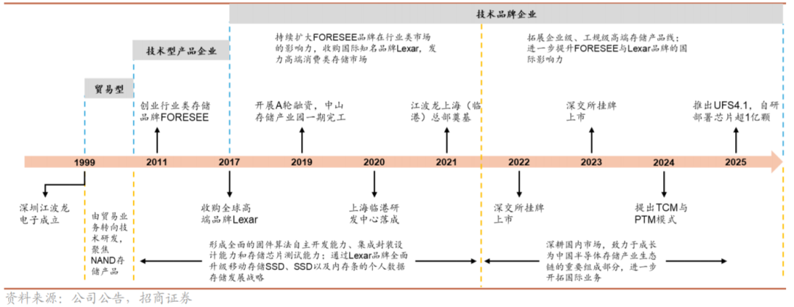
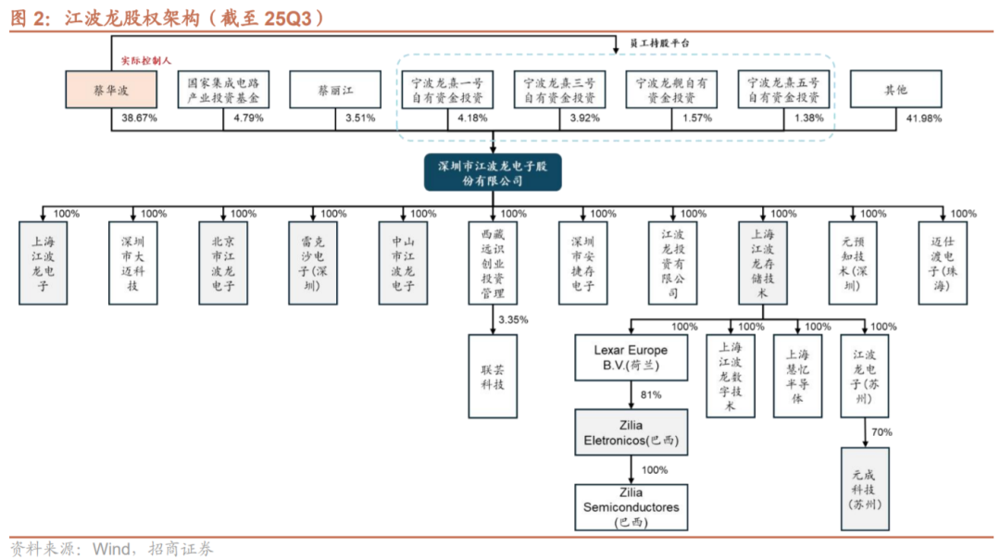
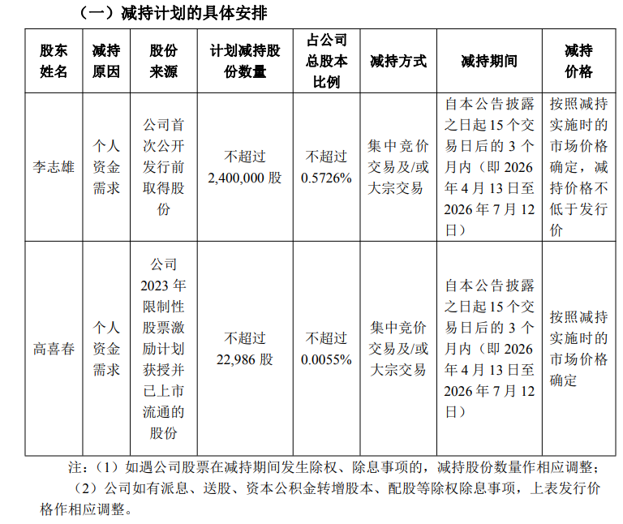
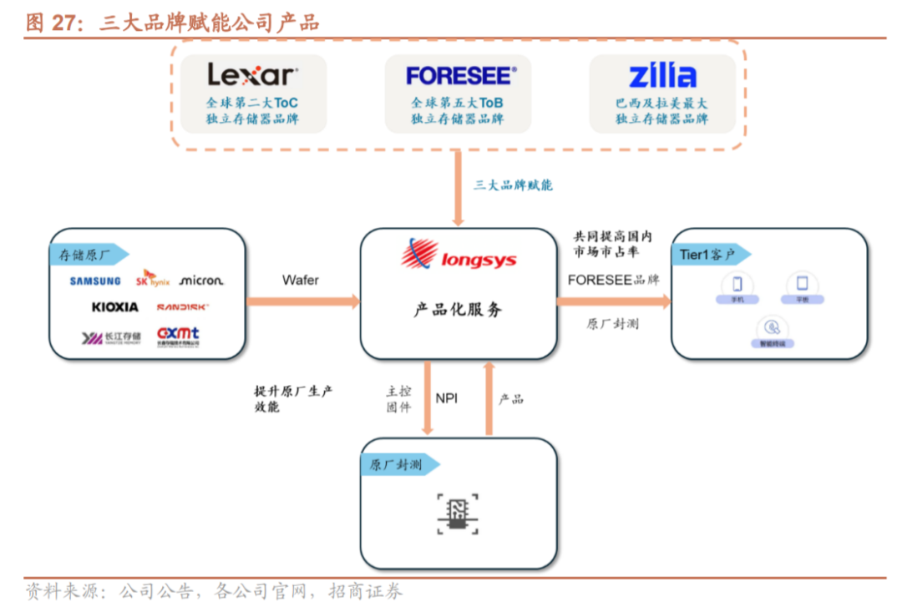
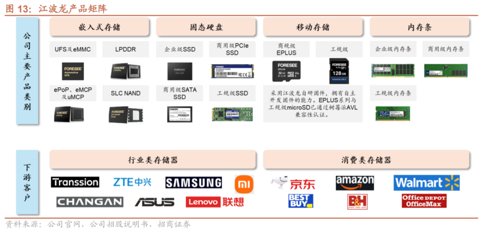
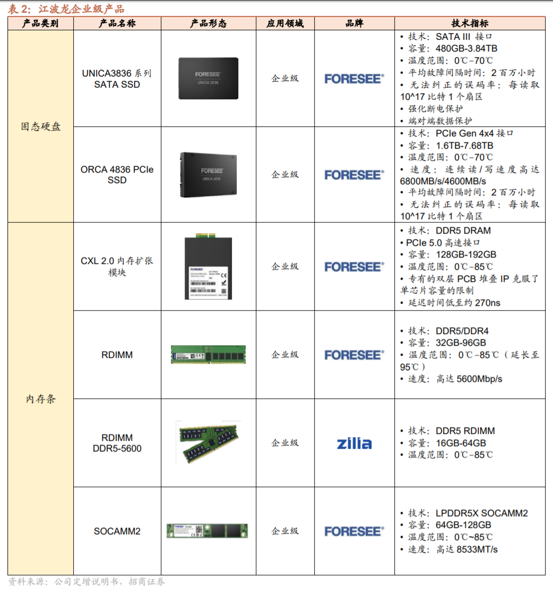
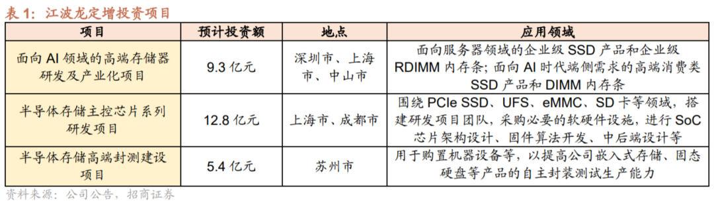
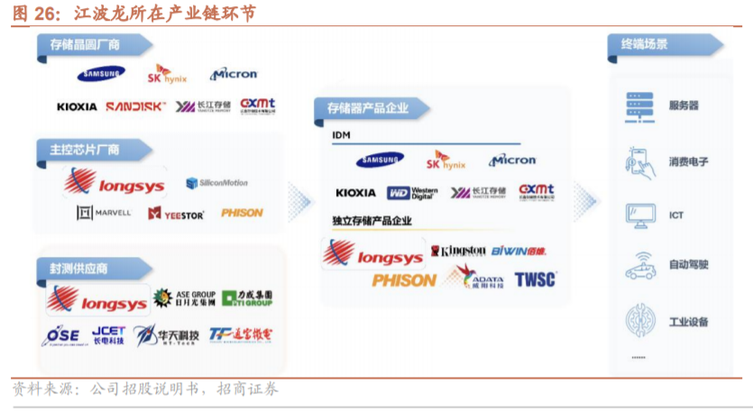

## 1.发展历程

江波龙成立于 1999 年，聚焦 NAND Flash 与 DRAM 的研发与销售，经过多年工艺积累，从最初的贸易型公司逐渐发展转型为技术品牌企业，形成了“自研芯片设计+固件算法开发+存储设计及封测制造”的全栈能力，可实现各类存储产品全栈定制与一站式交付。根据灼识咨询的数据，公司是全球第二大独立存储器企业及中国最大的独立存储器企业。

股权结构

## 2.2026年管理人员减持情况

## 3.公司品牌及产品

目前的江波龙已从传统的“模组代工厂”转型为拥有三大品牌、具备\*\*“设计+算法+封测”\*\*全栈能力的存储技术领军企业。

### 3.1 品牌矩阵与产品分布

品牌名称| 品牌定位| 核心产品线| 主要应用领域  
---|---|---|---  
Lexar \(雷克沙\)| 国际高端消费存储| 高阶存储卡 \(SD/CFexpress\)、高性能 SSD、移动存储 \(U盘/移动硬盘\)、DRAM 内存条。| 专业摄影、电竞玩家、高端个人办公、多媒体创作。  
FORESEE| 行业类存储 \(B2B\)| 嵌入式存储 \(UFS/eMMC\)、企业级 SSD \(eSSD\)、RDIMM 内存条、车规级存储、工业级存储。| 智能手机、AI 服务器、智能汽车、工业控制、智能穿戴。  
Zilia \(原巴西存储\)| 拉美区域龙头| 针对当地市场的内存模组、SSD 以及半导体封测服务。| 拉美地区的 PC 组装、数据中心及消费电子市场。  
  
（1）FORESEE：品牌产品采用自研固件，主要面向 ToB 行业类存储。公司于2011 年创立FORESEE，为行业类存储品牌，FORESEE 产品采用自研固件，支持大规模生产和定制，经过十多年深耕存储产品行业，FORESEE 已建立全面的产品组合，包括嵌入式存储、固态硬盘、移动存储及内存条，广泛应用于各类存储应用场景。  

（2）Lexar：国际高端消费存储品牌，2024 年品牌收入占比达 20%。公司于 2017年收购国际高端消费存储品牌 Lexar，其在摄影、视听和户外运动拍摄设备领域久负盛名。Lexar 产品涵盖存储卡、移动硬盘、U 盘、Workflow（桌面备份站）、PCIe 和 SATA 固态硬盘以及 DDR5 和 DDR4 内存条。Lexar 持续发挥了中国高效的供应链优势，并结合全球化渠道布局，实现了市场的快速扩张，Lexar 构建了覆盖全球六大洲的完整渠道覆盖，Lexar 产品已在全球60 多个国家和地区实现销售。2024 年来自 Lexar 品牌营收 35.25 亿元，占比达 20%。  

（3）Zilia：巴西及拉美最大存储器品牌，2024 年品牌收入占比达 13%。2023 年公司完成巴西头部存储厂商 SMART Brazil 的收购与更名后，顺势推出 Zilia品牌。Zilia 品牌的产品面向商业客户，包括嵌入式存储、固态硬盘及内存条。凭借 Zilia 在巴西存储市场 27 年的专业经验，Zilia 帮助公司进入拉丁美洲市场。2024 年来自 Zilia 品牌营收占比达 13%，25H1 该品牌收入 13.88 亿元，同比增长 40.01%。

3.2 核心产品、下游客户及应用领域

#### 1\. 嵌入式存储 \(智能终端核心\)

产品形态：UFS 4.1 、eMMC 5.1。

应用领域：旗舰手机、平板电脑、智能电视、智能穿戴。

下游品牌：小米、荣耀、OPPO、vivo、传音等主流手机厂商。

产品地位：国内领先。特别是 UFS 4.1 配合自研 WM7400 主控，实现了“以闪存补内存”的 HLC 技术，是端侧 AI 手机的关键组件。

（1）eMMC5.1：eMMC（embedded MultiMediaCard）是一种较早的存储标准。

•

5.1 版本：是 eMMC 协议的终极成熟版。

•

性能：理论读取速度大约在 250-400MB/s。

•

应用场景：现在的中低端手机、智能电视、行车记录仪、智能穿戴（如手表）。

•

布局：江波龙在 eMMC 领域非常强势，尤其是车规级 eMMC。他们的自研主控 WM6000 已经大规模用在 eMMC 5.1 产品上，出货量破亿。提供稳定现金流。

（2）UFS 4.1：UFS（Universal Flash Storage）是目前旗舰手机的标配，结构上比 eMMC 高级得多，支持双向读写。

•

4.1 版本：这是目前最顶级的版本之一（通常在 2025-2026 年的旗舰机上出现）。

•

性能：读取速度可突破 4000MB/s。这比 eMMC 5.1 快了整整 10 倍！

•

应用场景：高端 AI 手机、平板、智能座舱的高阶主机。

•

解决痛点：现在的手机要跑端侧大模型（AI 手机），需要极快地加载模型参数，UFS 4.1 是硬指标。

•

UFS 4.1 主控（WM7400）：既能够省下交给海外大厂（如慧荣、群联）的授权费，还能配合自研的 HLC 算法（让 UFS 模拟内存功能）。

•

HLC 技术的关键：AI 手机内存（RAM）很贵，江波龙的 UFS 4.1 配合 HLC 技术，可以让手机在内存不够时，从 UFS 硬盘里“借”一部分速度极快的空间当内存用。这就是他们的技术溢价。

* * *

#### 2\. 企业级存储 \(AI 算力核心\)

•

产品形态：CXL 2.0 内存扩展模块、SOCAMM \(新型内存\)、eSSD \(企业级固态硬盘\)、RDIMM。

•

应用领域：AI 数据中心 \(AIDC\)、云计算、高性能计算 \(HPC\)。

•

下游品牌：浪潮、超聚变、联想、中兴，以及头部云服务商。

•

产品地位：国产化领头羊。其 CXL 2.0 模块是解决 AI 服务器“内存墙”问题的核心方案，2025 年上半年企业级业务收入增长达 138.66%。

（1）企业级 PCIe SSD 

在智算中心、AI 数据中心（AIDC）里，为了配合 GPU 的超高算力，必须使用 NVMe PCIe 5.0 SSD。只有 PCIe 接口能提供超过 10GB/s 的带宽。

布局：江波龙 2026 年业绩爆发，核心支撑就是他的 PCIe 5.0 企业级 SSD。如果还在卖 SATA 接口的盘，他根本进不去 AI 服务器的供应链。

技术护城河：SATA 的主控芯片非常简单，谁都能做，没门槛。

利润增长点：PCIe 5.0 的主控芯片极其复杂，全世界能稳量产的公司没几家。江波龙如果能把自研的 PCIe 主控塞进自家的 eSSD 里，他省下的不是几块钱的零件费，而是摆脱了对国外芯片巨头（如群联、慧荣）的技术税。

（2）CXL 2.0 内存扩展模块

角色：内存池化扩展（Memory Expansion）。

配合方式：当 RDIMM 插槽用完，但 AI 模型（如万亿参数的大语言模型）还是放不下时，CXL 2.0 登场了。

•

它通过 PCIe 5.0 接口，把江波龙的 CXL 内存扩展模块 挂载到系统里。

•

关键点：它让 CPU 觉得这些外挂的 CXL 模块就是“自家人”的内存，延迟极低。

•

解决痛点：它解决了“插槽不够”的问题，通过 CXL 技术，服务器内存容量可以轻松翻倍，而不需要更换昂贵的主板。

CXL 2.0 内存扩展模块可以解决以下问题：1）DDR5内存频率极高，CPU附近布线超过8-12根内存插槽信号干扰严重导致系统不稳定，同时服务器内部散热成为问题，通过PCle通道外接布线，可以在不干扰主内存的情况下增加内存；2）降低使用单一高内存条的成本；3）在新服务器架构中，可以通过 CXL Switch（交换机） 把江波龙的内存模块组成一个“内存池”，多服务器共享。  

（3）RDIMM\(带寄存器的双列直插内存模组\)

简单来说就是服务器专用的“增强版内存条”。相比我们电脑里的普通内存（UDIMM），它多了一个特殊的芯片—Register（寄存器）。

•

核心优势

◦

超大容量扩展：普通主板插 4 根内存可能就到极限了，RDIMM 通过寄存器减轻了 CPU 的信号负担，让一台服务器可以插 24 根甚至更多内存条，容量轻松达到 TB 级别。

◦

纠错能力 \(ECC\)：由于服务器运行的数据非常多，内存偶尔会产生一个电子位翻转（比特错误）。RDIMM 能自动发现并纠正这些错误，防止系统崩溃蓝屏。

◦

稳定性：它能对地址和控制信号进行重新驱动，保证在高频率、大容量下依然稳如泰山。

•

应用场景：云服务器（阿里云/腾讯云）、金融交易系统、大语言模型（LLM）的内存预加载。

（4）SOCAMM \(新型内存\)

SOCAMM（LPCAMM的一种，全称为 Small Outline Compression Attached Memory Module）是目前存储行业最前沿的内存形态创新。简单来说，它解决了目前内存领域一个困扰了20 年的矛盾：“插槽内存（快不起来）”与“焊接内存（没法升级）”之间的对立。

主要应用于端侧AI

* * *

#### 3\. 汽车与工业存储

•

产品形态：车规级 eMMC、UFS、BGA SSD。

•

应用领域：智能座舱、ADAS \(自动驾驶辅助\)、行车记录仪。

•

下游品牌：进入了多家国产主流新能源车企供应链（如比亚迪、吉利等相关配套体系）。

•

产品地位：车规级量产先锋。自研 WM6000 \(eMMC 5.1\) 主控芯片累计出货超 1 亿颗，打破了车规存储主控的垄断。

（1）BGA SSD

BGA SSD 就是把一整块固态硬盘“浓缩”成了一个指甲盖大小的芯片。通常我们见到的 SSD 是像“巧克力棒”一样的长条（M.2 接口），而 BGA SSD 则是通过先进封装技术，将主控芯片、闪存颗粒（NAND Flash）甚至缓存（DRAM）全部封装在一个 BGA（球栅阵列）封装的单颗芯片内。

应用领域：

智能汽车（重点方向）：

•

用途：用于自动驾驶系统（ADAS）和智能座舱。

•

优势：汽车内部空间狭小且长期处于颠簸环境，BGA SSD 的“抗震”和“小体积”是唯一选择。

二合一笔记本 / 超极本：

•

用途：Surface、iPad Pro 类设备或超薄本。

•

优势：为了把电池做大，主板必须尽可能小，BGA SSD 节省了 80% 以上的存储空间。

嵌入式工业设备：

•

用途：加固型电脑、无人机、手持终端。

* * *

* * *

### 3.3 产品的行业地位与核心优势

1.

市场占有率：

•

FORESEE \(B2B\)：在全球嵌入式存储市场排名第五（国产第一）。

•

Lexar \(B2C\)：在全球存储卡和闪存盘市场排名第二。

2.

技术地位——从“买办”到“自研”：

•

自研主控突破：成功研发并流片 UFS 4.1、eMMC 5.1、PCIe SSD 等多款主控芯片。这意味着公司在毛利分配中拿到了“芯片设计”的一块，提升了扣非净利润的含金量。

•

全产业链能力：收购元成苏州和Zilia后，江波龙具备了“晶圆封测+成品组装”的完整链路。在 2026 年信创背景下，这种“纯血国产”的身份使其在政府和金融数据中心拥有极高的准入优先级。

3.

商业模式地位——TCM 模式（存储联合定制）：

•

江波龙通过 TCM 模式，将自己从单纯的供应商变成了晶圆厂（如长存、三星）与最终客户（如手机巨头）之间的“技术服务中枢”，有效平滑了存储价格剧烈波动的风险。

### 3.4产品矩阵

  
4.公司当前看点

### 4.1公司通过定增投资旨在增强三种能力：

#### 项目1.AI领域高端存储器

服务器领域的企业级SSD产品和RDIMM内存条，端侧SSD和DIMM

•

企业级 SSD：它需要极高标准的可靠性筛选测试（Burn-in Test）。项目一会投入大量的自动化测试设备，模拟 AIDC 服务器在极端高温、高压下的运行环境。

•

RDIMM：它涉及 DDR5 高频信号仿真。项目一的研发投入主要用于确保这些长条内存能稳定地在服务器上跑起来，不产生信号衰减。

#### 项目2.存储芯片架构设计、固件算法开发和中后端设计

现代高端存储主控“就是”一颗特殊的 SoC

在早期的存储行业（如 U 盘或简单的 SATA SSD），主控芯片功能单一，通常只被称为“Controller”。但到了 PCIe 5.0 和 UFS 4.1 时代，主控的复杂度已经发生了质变。

•

SoC 的定义：System on Chip（系统级芯片），即将 CPU、内存控制器、接口模块、加密模块等集成在一颗芯片上。

•

存储主控的现状：如江波龙定增项目中提到的高性能主控，它内部不仅集成了多核 ARM（如 Cortex-R 系列） 或 RISC-V 处理器作为指挥大脑，还集成了极其复杂的 LDPC 纠错引擎、PCIe 5.0 物理层接口、DDR 控制器以及负责 AI 协同的加速单元。

•

总结：它不仅是 SoC，而且是一颗高算力、强实时性、高可靠性的专用 SoC。

#### 项目3.半导体存储高端封测

涉及：eMMC/UFS/BGA SSD

把切割好的原始晶圆（Bare Die）和主控芯片直接封在一个黑色的方块里的 SiP（系统级封装）。

对应项目| 核心产品| 封装/制造类型| 技术重点  
---|---|---|---  
项目一 \(9.3亿\)| 企业级 SSD、RDIMM、AI PC 内存| 模组级组装与系统测试| 复杂的电路板（PCB）设计、信号完整性、散热管理、系统级兼容性测试。  
项目二 \(12.8亿\)| 自研主控芯片| 芯片设计 \(Fabless\)| 逻辑架构、算法固化、流片（Tape-out）。  
项目三 \(5.4亿\)| eMMC、UFS、BGA SSD、嵌入式存储| 芯片级封装 \(SiP/Stack Die\)| 晶圆减薄、多层颗粒叠加（在指甲盖大小内叠 16 层闪存）、打金线、塑封。  
  
## 5.公司上下游

产业链上，公司与主要存储晶圆原厂、主控芯片厂及封装厂建立了长期稳定的合作伙伴关系。

#### 1.在存储晶圆领域

公司与三星电子、美光科技、西部数据（闪迪）均有长期合作关系，近年来与国内晶圆原厂长江存储、长鑫存储已开展业务合作。

#### 2.在主控芯片领域

公司基于慧荣科技、联芸科技、Marvell 等主流厂商的主控芯片自主开发固件软件，并且深度参与主控芯片架构的定制，以实现高性能、高品质、创新型产品方案。

#### 3.在封装领域

公司与华泰电子、京元电子、矽品精密、华天科技、深科技等行业领先的封装厂商密切合作，通过自主设计的集成封装方案推动产品创新。

## 6.未来看点

1.存储市场的景气度，下游服务器需求是否依然保持旺盛需求，其企业级 eSSD 和 RDIMM 能否进入核心服务器 OEM 厂（如浪潮、联想、戴尔）以及大型互联网厂商（如字节、阿里）的白名单。 2.自研主控芯片是否得到验证，能否顺利应用到自己产品得到客户认证。观察其 WM7400 \(UFS 4.1\) 和 PCIe 5.0 SSD 主控 在 2026 年的大规模流片和客户侧压力测试表现。如果能顺利实现\*\*“自研 SoC + 国产颗粒（长江/长鑫）”\*\*的全国产化方案，在信创和本土供应链安全背景下，将拥有极高的议价权。 3.CXL2.0内存拓展模块能否得到大量订单。 是否有\*\*头部互联网大厂（字节、腾讯等）或服务器 OEM 厂（浪潮、联想）\*\*的测试通过或小批量供货信息。

4.端侧AI如AI手机和AI PC存在大量需求。是否拿到了主要 PC 厂商（如联想、华硕）的 2026 年新机型定点。

5.高端封装良品率。元成苏州在 16 层甚至更高叠层封装（Stack Die）上的良率表现。