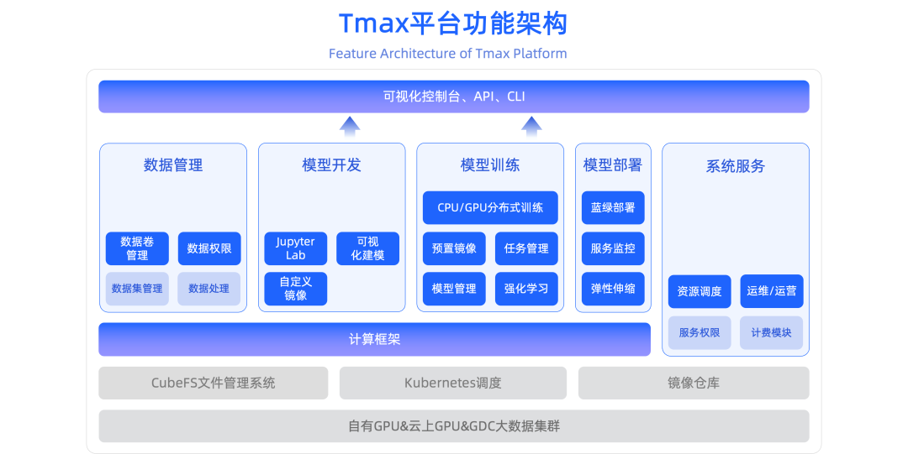
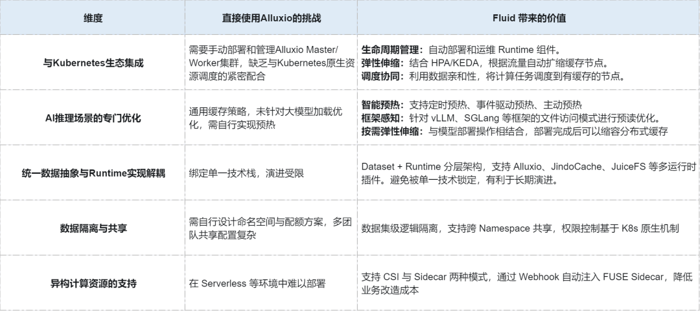
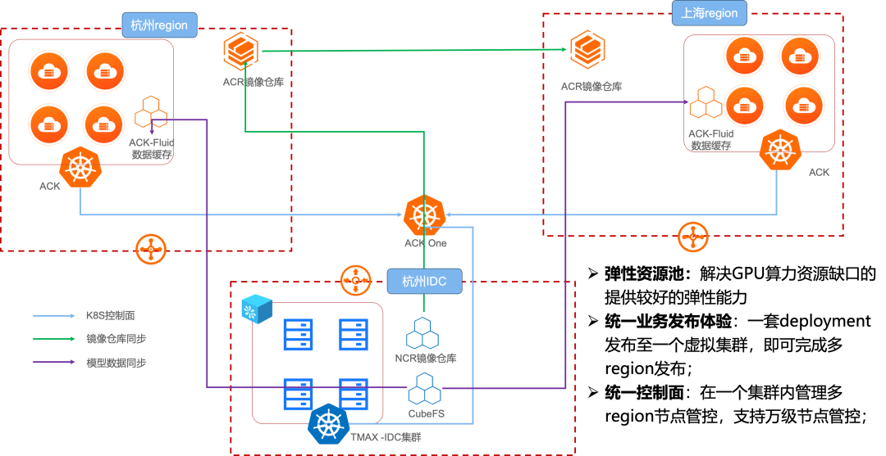
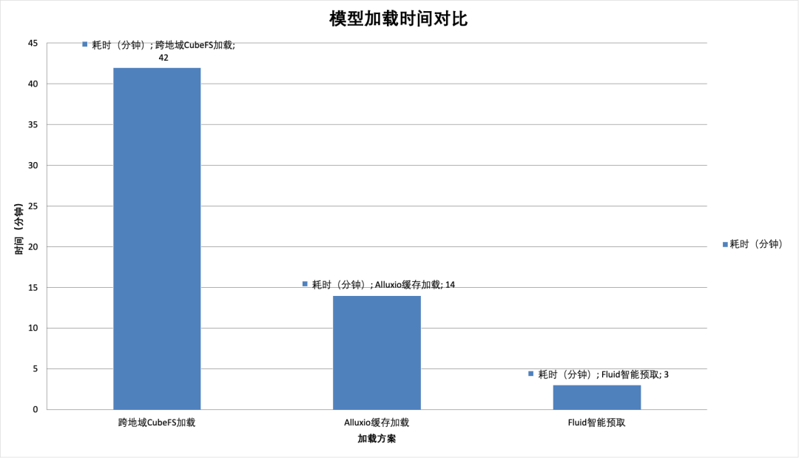

作者 | 廖海峰，张翔 

**背景：游戏行业智能化浪潮下的**

**基础设施不断演进**

作为中国领先的游戏研发与运营公司，网易游戏旗下拥有《梦幻西游》《大话西游》《蛋仔派对》等国民级游戏产品，以及游戏资产交易平台“藏宝阁”等重要服务生态。随着游戏产品矩阵的不断扩大和用户体验需求的持续升级，网易游戏需要处理的数据类型和业务场景日益复杂多样。

而大模型正深刻改变游戏行业。**在 NPC 智能化、自动化剧情生成、角色动作捕捉及游戏资产生成等场景，特别是 RPG 与社交类游戏中，大模型已成为核心竞争力。** 为了更好地通过生成式 AI 支持业务发展，网易游戏打造了面向云原生的 **Tmax AI 机器学习平台** ，提供灵活的资源调度、高效的 AI 开发效率与易托管的 AI 服务。

Tmax 平台构建于 Kubernetes 之上，整合了 Kubeflow、自研调度器及 CubeFS 文件管理系统，支持从 Jupyter 交互式开发到分布式训练、再到模型推理部署的全链路 AI 生命周期管理。然而，随着大模型推理业务规模爆发，平台在 **资源弹性、数据访问效率与多地域协同** 方面面临严峻挑战。

**挑战：大模型推理服务的**

**“不可能三角”**

在构建推理服务时，我们面临着成本、效率与弹性的多重制约：

1\. GPU 资源的稀缺性与异构性

受限于供应链，高端 GPU 资源稀缺且价格昂贵，且存量资源卡型复杂（异构混部）。这要求平台必须实现分钟级弹性伸缩，绝不能按业务峰值长期空置资源。

2\. 业务峰值差异导致的资源浪费

不同游戏业务的推理负载呈现显著差异：

  * **时段分布不均** ：不同游戏业务的流量高峰分布在一天中的不同时段（如晚间游戏高峰、白天办公工具使用高峰）

  * **资源需求异构：实时推理** 、批量处理、模型微调等场景对 GPU 类型、显存、网络的要求各不相同

  * **按峰值预留的低效性** ：为每个业务单独预留峰值资源会导致整体利用率低下，资源浪费显著

按峰值叠加满足所有业务将导致 **资源浪费率高达 60% 以上** 。

3\. Serverless 冷启动的致命延迟

虽然阿里云 ACS Serverless 容器理论上能解决弹性问题，但大模型加载成为致命瓶颈。从远程存储拉取一个 70B 模型（约 140GB+）到 GPU 显存通常耗时 10-15 分钟，这完全抵消了 Serverless 的弹性优势。

4\. 多地域存储管理复杂度和计算资源的碎片化

  * **跨地域管理难题** ：GPU 资源分布在多个地域，但模型数据需要高效同步和统一管理。

  * **存储性能瓶颈** ：大模型文件（通常 70-500GB）从远端存储加载到 GPU 节点速度慢，成为推理延迟的主要因素。

  * **多环境运行时支持** ：需要同时管理 IDC 物理机、云上 ECS 实例和 Serverless 容器服务等多种计算资源中的存储访问。要求存储抽象必须具备 **跨集群、跨云厂商的一致访问接口** 。

**方案选型：为何选择**

**Fluid+AlluxioRuntime？**

针对大模型推理的多地域部署的缓存加速需求，直觉上直接部署 Alluxio 集群比较简单。在技术选型过程中，我们深入评估了直接使用 Alluxio 与基于 Fluid 构建完整解决方案两种路径。

二者抽象层级与架构定位的根本差异

· Alluxio：本质是分布式缓存引擎，提供内存级数据访问能力，核心价值在于作为计算与存储间的虚拟化层，提供统一命名空间与缓存加速。

· Fluid：是基于 Kubernetes 及 Alluxio 等底层系统的云原生数据编排平台，以 **数据集** 为中心进行抽象，深度集成于 Kubernetes 生态。

  *   *   *   *   *   *   *   *   *   *   *   *   *   *   *   *   *   * 

    
    
    # Fluid 的数据集抽象示例apiVersion: data.fluid.io/v1alpha1kind: Datasetmetadata:  name: game-modelsspec:  mounts:  - mountPoint: s3://game-registry/models/    name: models    options:      fs.cos.accessKeyId: <access-key>    encryptOptions:      - name: fs.s3.accessKeySecret        valueFrom:          secretKeyRef:            name: s3-secret            key: accessKeySecret            

这种抽象层级的差异决定了二者解决不同层次的问题。

最终我们选择 Fluid 而非直接使用 Alluxio，是基于以下多个维度的综合考量：

选择 Fluid 的综合考量：分析结论

对于我们的大模型推理场景，选择 Fluid 而非直接使用 Alluxio，是基于以下核心判断：

  1. **抽象匹配** ：Fluid 的"数据集"抽象更贴近 AI 应用的数据使用模式，而 Alluxio 的"文件系统"抽象更底层。

  2. **运维简化** ：封装 Alluxio 的运维复杂性，提供了 Kubernetes 原生的管理体验。

  3. **场景优化** ：针对 AI/ML 场景进行了专门优化，直接解决了大模型加载的关键痛点。

  4. **生态集成** ：作为 CNCF 孵化项目，Fluid 与云原生生态的集成深度和未来兼容性更好。

  5. **长期投资** ：多 Runtime 架构避免了对单一技术的依赖，为未来技术演进留出空间。

落地实践：声明式数据基础设施

基于 Fluid 的云原生抽象能力，我们构建了“计算 - 缓存 - 存储”三层解耦架构：

  1. 底层存储：CubeFS/OSS 存储原始模型权重。

  2. 加速层：Fluid + AlluxioRuntime 构建分布式缓存层，跨地域提供统一访问接口。

  3. 计算层：Kubernetes 集群（含 Serverless 容器）运行推理服务，通过 PVC 挂载数据。

架构设计关键配置实践1\. 自动预热机制

针对 DeepSeek-R1 等超大模型，启用了 Fluid 的应用预取功能，大幅缩短冷启动时间。

  *   *   *   *   *   *   *   *   *   *   * 

    
    
    annotations:  # 开启预取优化  file-prefetcher.fluid.io/inject: "true"  # 指定是否等待预取容器完成后再启动主容器，默认为 false  # file-prefetcher.fluid.io/async-prefetch: "false"   # 指定预取的超时时间，默认为 120s，对于 DeepSeek-R1 等超大模型建议调大。超时时间仅在 async-prefetch=false 时生效。  file-prefetcher.fluid.io/prefetch-timeout-seconds: "2400"  # 指定预取的文件范围。推荐调整为待加载模型目录下的全部文件。支持 glob 通配格式。如果不填写，默认值是这个  # 例 1：pvc://llm-model/*.safetensors  # 例 2: pvc://llm-model/mymodels/deepseek-r1/  file-prefetcher.fluid.io/file-list: "pvc://llm-model/"

2\. 智能弹性：GitOps 与定时伸缩

针对游戏业务明显的早晚高峰特征，我们结合 `CronHorizontalPodAutoscaler` 与 Fluid `DataLoad`实现了全自动化的“潮汐式”管理：

  * 高峰前：自动扩容缓存节点，并触发模型数据预热。

  * 低峰后：自动缩容缓存节点，释放资源。

  *   *   *   *   *   *   *   *   *   *   *   *   *   *   *   *   *   * 

    
    
    受业务形态的影响，Tmax 在固定时段会有更高的用量需求，因此简单的配置定时缓存节点的弹性伸缩策略能到达到不错的收益.apiVersion: autoscaling.alibabacloud.com/v1beta1kind: CronHorizontalPodAutoscalermetadata:  name: scale-evening-models  namespace: defaultspec:   scaleTargetRef:      apiVersion: data.fluid.io/v1alpha1      kind: AlluxioRuntime      name: tmax-model   jobs:   - name: "scale-down"     schedule: "0 0 7 ? * 1"     targetSize: 10   - name: "scale-up"     schedule: "0 0 18 ? * 5-6"     targetSize: 20

使用定时预热

  *   *   *   *   *   *   *   *   *   *   * 

    
    
    apiVersion: data.fluid.io/v1alpha1kind: DataLoadmetadata:  name: prewarm-evening-modelsspec:  ...  policy: Cron  schedule: "0 0 18 * *" # 每日 18 点执行数据预热。  loadMetadata: true # 数据预热时同步后端存储系统数据变化。  target:  - path: /path/to/warmup # 指定了需要预热的后端存储系统路径。

3\. 跨 namespace 的缓存共享

在 Tmax 平台中，存在“公共模型仓库”与“多业务项目组”并存的场景。如果每个项目组（Namespace）都单独部署一套 Dataset 和 Runtime，将导致：

  1. **存储冗余** ：同一个 DeepSeek-V3 模型在集群中被重复缓存多次。

  2. **内存浪费** ：多套分布式缓存系统占用大量内存资源。

  3. **管理混乱** ：模型版本更新需要通知所有项目组手动同步。

Fluid 提供了跨 Namespace 共享（Cross-Namespace Referencing） 能力，完美解决了这一痛点。

  * Model-Hub Namespace：由平台管理员维护，部署 `AlluxioRuntime` 和 `Dataset`负责对接底层存储并进行数据预热。

  * Game-Project Namespace：分配给各游戏项目组，无需部署 Runtime，只需创建一个引用型的 Dataset 指向 Hub 中的数据集

管理员在 `public-services` 命名空间发布模型：

  *   *   *   *   *   *   *   *   *   *   *   * 

    
    
    # 在公共空间创建实际的数据集和运行时apiVersion: data.fluid.io/v1alpha1kind: Datasetmetadata:  name: deepseek-base  namespace: public-servicesspec:  accessModes:    - ReadWriteMany   mounts:    - mountPoint: s3://common-models/deepseek-v3      name: model-root

授权业务组在 `game-team-a` 命名空间引用：

  *   *   *   *   *   *   *   *   * 

    
    
    apiVersion: data.fluid.io/v1alpha1kind: Datasetmetadata:  name: shared-model  namespace: game-team-aspec:  mounts:  - mountPoint: dataset://public-services/deepseek-base # 核心：指向公共空间的数据集    name: deepseek-mount

收益

  * **一次预热，全员加速** ：模型只需在公共空间加载一次，所有授权的业务组即可通过本地网络访问，无需重复下载。

  * **资源节省** ：缓存层内存占用降低 60%-80%（取决于共享比例）。

  * **极速启动** ：新开服的游戏业务无需等待模型下载，直接挂载公共缓存，实现秒级启动。

性能与成本收益

经过超过一年的生产环境运行，Fluid + AlluxioRuntime 的组合不仅解决了技术层面的 I/O 瓶颈，更为网易游戏带来了显著的业务价值。以下是我们在性能加速、成本节约、高并发稳定性等方面的具体收益细节：

1\. 性能维度：12 倍启动加速，让 Serverless 真正落地

在大模型 Serverless 弹性场景中，“冷启动速度”直接决定了方案的可行性。

  * **加载耗时大幅缩短** ：以 DeepSeek V3/R1 等大参数模型为例，通过对比实测：

    * **基线（跨地域直连 CubeFS）** ：受限于网络带宽与长链路延迟，平均耗时 36 分钟。

    * **优化一阶段（传统 Alluxio）** ：部署缓存后缩短至 14 分钟，但仍受限于元数据同步和预热效率。

    * **优化二阶段（Fluid 智能预读）** ：开启 AI 应用预读，耗时骤降至 3 分钟。

  * **收益：12 倍** 的性能提升，使得原本因“启动太慢”而无法使用的 Serverless 算力资源重新具备了生产可用性

2\. 成本维度：TCO 显著降低，消除“资源碎片”

通过 Fluid 的编排能力，我们成功打破了 GPU 资源与存储资源的高昂绑定关系。

  * **存储成本降低显著** ：得益于 跨 Namespace 数据共享机制，原本散落在不同项目组的相同基础模型（Base Model）无需重复存储和缓存。单份缓存数据支撑了上百个推理 Pod 的运行，大幅削减了分布式缓存集群的内存开销。

  * **GPU 利用率提升** ：通过“潮汐式”自动伸缩，我们不再需要按照业务最高峰值（Peak）常驻昂贵的 GPU 实例。配合 3 分钟极速启动，业务可以在低谷期安全地将 GPU 资源缩容至极低水位，整体 GPU 资源闲置率降低了约 20%。

**3\. 稳定性维度：化解“惊群效应”，保障高并发**

在游戏版本更新或活动期间，会有数百个推理服务实例同时启动（并发拉起）。

  * **保护底层存储** ：若数百个 Pod 同时直接访问底层的对象存储（OSS/S3），极易触发带宽限流或存储服务过载（Thundering Herd Problem）。Fluid 充当了巨大的流量“挡板”，所有高并发请求均由本地缓存层响应，彻底消除了底层存储的 I/O 抖动风险。

  * **推理吞吐稳定** ：本地化的数据访问将 I/O 延迟从毫秒级（ms）降低至微秒级（μs），确保了 GPU 不会因为等待数据而空转，保障了推理服务的 P99 延迟稳定性。

4\. 效率维度：算法团队的“零感知”体验

对于算法工程师而言，基础设施的复杂度被完全透明化。

  * **接口统一** ：无论底层是 S3、HDFS 还是 CubeFS，算法工程师只需像操作本地文件一样操作 PVC 挂载目录，无需在代码中引入复杂的 SDK。

  * **环境一致性** ：从开发环境（Jupyter Notebook）到生产环境（Serverless Deployment），使用同一套 Dataset 定义，消除了“开发能跑，上线报错”的环境差异问题。

结 语

网易游戏通过 Fluid 的实践，成功构建了高效、弹性、成本优化的大模型推理数据基础设施。这一实践不仅解决了 GPU 资源紧张、业务峰值差异、弹性伸缩困难等迫切问题，更为游戏行业探索 AI 原生体验提供了可靠的基础支撑。

在游戏行业与 AI 技术深度融合的今天，基础设施的现代化已成为创新的基石。Fluid 作为云原生数据编排的优秀代表，其在网易游戏的成功应用，为整个行业提供了可借鉴的范例。未来，随着技术的不断演进和场景的持续拓展，“以数据为中心”的架构设计已成为企业降本增效、构建竞争力的关键路径，推动游戏行业进入一个更加智能、个性化和沉浸式的新时代。

最后，特别感谢 Fluid 社区的徐之浩、玖宇和顾荣老师。正是因为有这样负责任的维护者和快速的社区响应，才使得我们的技术探索之路更加平坦，让云原生 AI 架构在网易游戏顺利落地。

作者简介

廖海峰 \(Senior Infrastructure Engineer\)：负责网易互娱 AI 基础设施平台的算力基础设施构建和稳定性保障，致力于为大规模游戏 AI 业务提供坚实的算力底座与服务支撑。

张 翔 \(Head of AI Infrastructure\)：负责网易互娱 AI 基础设施平台的技术演进与架构设计，致力于构建高性能、高可用、低成本的 AI 基础设施平台。

会议推荐

2026，AI 正在以更工程化的方式深度融入软件生产，Agentic AI 的探索也将从局部试点迈向体系化工程建设！

QCon 北京 2026 已正式启动，本届大会以“Agentic AI 时代的软件工程重塑”为核心主线，推动技术探索从「AI For What」真正落地到可持续的「Value From AI」。从前沿技术雷达、架构设计与数据底座、效能与成本、产品与交互、可信落地、研发组织进化六大维度，系统性展开深度探索。开往 2026 的 Agentic AI 专列即将启程！汇聚顶尖专家实战分享，把 AI 能力一次夯到位！

##### 今日荐文

[昆仑万维：AI编程能力纳入绩效考核，实行末位淘汰；云厂大规模宕机，员工曝是自家AI干的；Claude被特朗普封杀后登顶App Store | AI周报](https://mp.weixin.qq.com/s?__biz=MzU1NDA4NjU2MA==&mid=2247657188&idx=1&sn=14f14dae107372ef43dd3d1b3d823d74&scene=21#wechat_redirect)

[史诗级输血！亚马逊、英伟达、软银联手投出 1100 亿美元，OpenAI 估值冲上 7300 亿美元](https://mp.weixin.qq.com/s?__biz=MzU1NDA4NjU2MA==&mid=2247657164&idx=1&sn=96022a60eb48c4d6e458661a2f9021f4&scene=21#wechat_redirect)

[黄仁勋每天都用的AI工具，要抢金融行业饭碗了？](https://mp.weixin.qq.com/s?__biz=MzU1NDA4NjU2MA==&mid=2247656889&idx=1&sn=1d9bf89db93be7ae8e2ea615baa462fe&scene=21#wechat_redirect)

[史上最“疯狂”高中：没有老师、全靠AI？全员入学定创业项目，目标是成为领域顶尖专家](https://mp.weixin.qq.com/s?__biz=MzU1NDA4NjU2MA==&mid=2247656853&idx=1&sn=e2e4a1d2ab9b482367b9012c1a9aabd3&scene=21#wechat_redirect)

[不怕你走，就怕你不用AI写代码！OpenAI Codex负责人亲口承认：内部已很少再打开IDE](https://mp.weixin.qq.com/s?__biz=MzU1NDA4NjU2MA==&mid=2247656750&idx=1&sn=c8acb75a1e1b2e6ea0d57d6eb85f6533&scene=21#wechat_redirect)

你也「在看」吗？👇