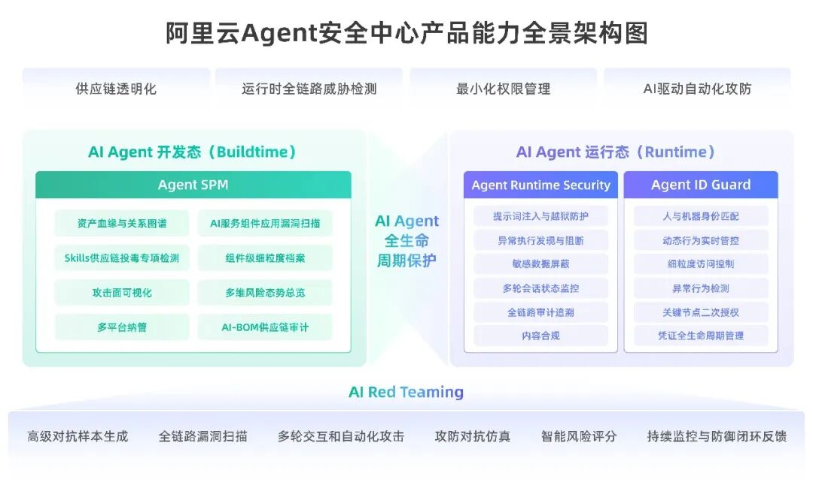
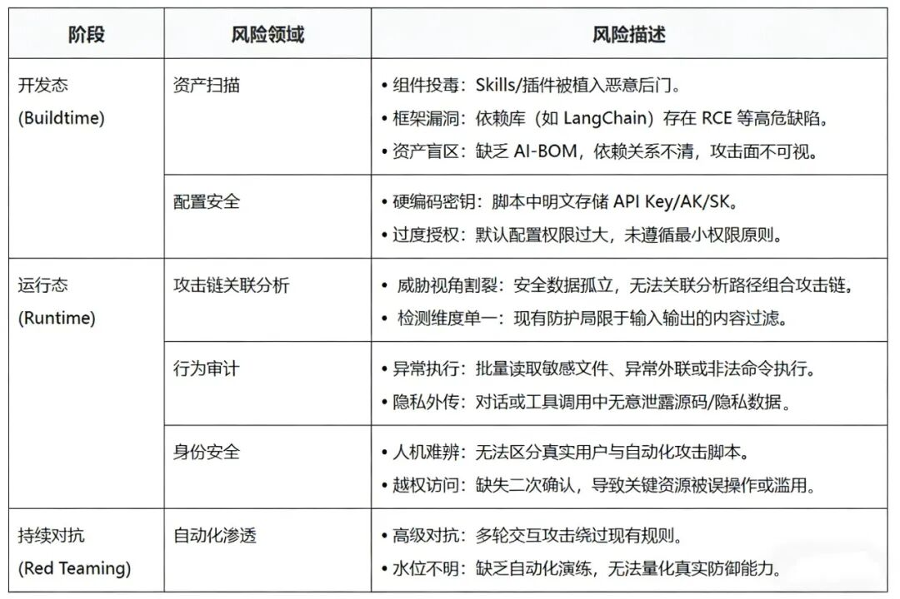
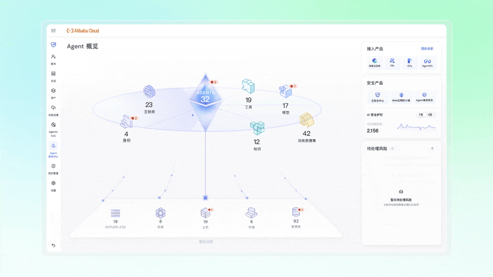
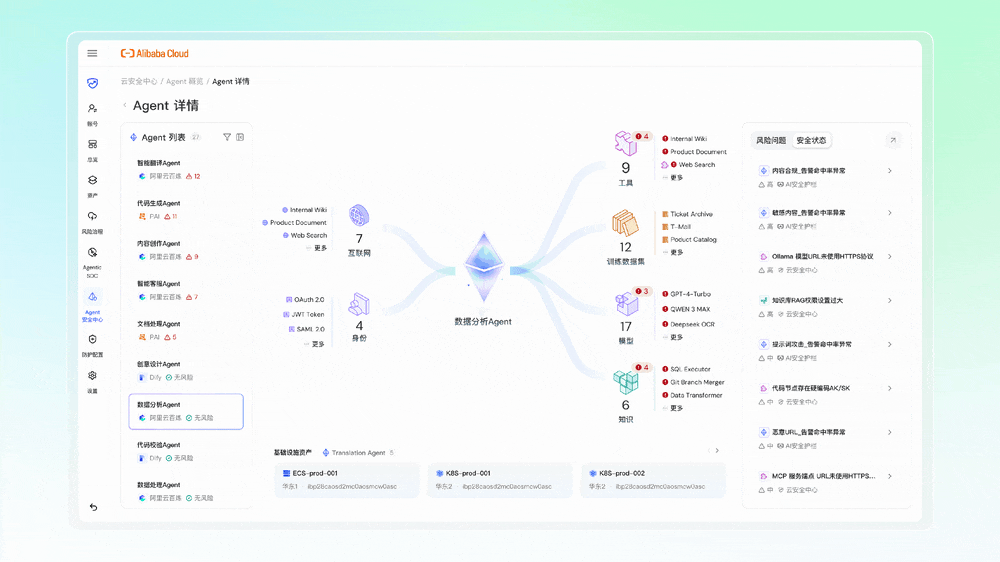
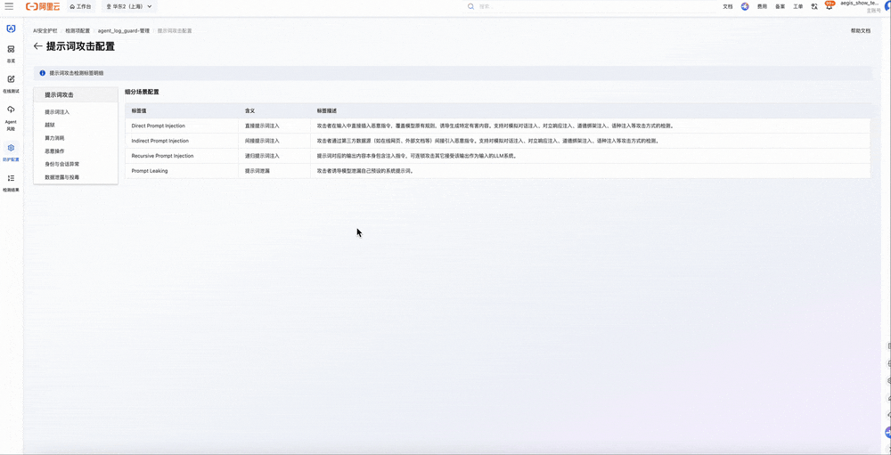
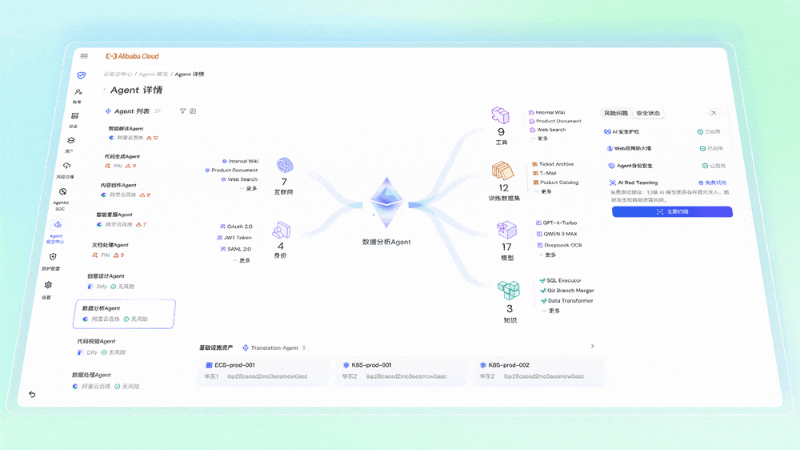

“龙虾热”破圈突围，安装热情席卷全球，Agent数量一夜暴涨。

以OpenClaw为代表的开源Agent正进化为能自主调度执行任务的“数字打工人”。**Agent和Skill技术架构，成为完美搭档进一步释放了基础模型的生产力** 。

  

这种系统级执行能力和灵活技能体系，快速推动了Agent加速生产级任务落地。与此同时，“安全黑洞”也悄然形成。以“龙虾”为代表的，被总结为“安全角度绝对噩梦”的开源项目，推出伊始就被曝出存在大量公网暴露实例、API密钥裸奔的情况。权限的错误配置，让“小龙虾们”的执行表现像“知道家里所有秘密出门办事的笨小孩”。全球某些头部企业，已严禁员工在办公设备上运行OpenClaw。

生产力进步的效率诉求，技术迭代是必然趋势，Agent数量爆发已成为现实。如何安全地把权限委托给Agent，让企业在每年万级增长的Agent数量中，释放潜能的同时搭建全方位防御管理体系，**AI Agent需要一个全新安全框架下的统一防御体系** 。

  

  

**阿里云重磅新品**  
**Agent安全中心**

  

  

区别于传统安全理念，**以Agent资产为视角，构建AI原生安全防护思路** ，阿里云重磅推出Agent安全中心！

  

  

企业一般面临两类AI Agent的资产，内部自研Agent + 外部Agent，在关注这两类资产的安全风险的时候，视角应各有异同；同时，为了降低管理复杂度，需要一个全链路的串联视角。

阿里云Agent安全中心，**提出覆盖开发态（Buildtime）与运行态（Runtime）的Agent全生命周期防护框架** ：

  

  

  

**AI Agent典型风险和防御思路**  

  

  

开源Agent技术框架下，**全生命周期面临的核心安全技术风险可概括为以下三类** ：

  

  

**对应地，防御方应具备四大核心能力以应对技术风险：**

  

  
  
**识别全量资产**  

  

为同时管理自研与外部AI Agent应用，**平台须具备Agent资产的自动发现与使用模式识别能力** ，包括对不同协议（如大模型特定功能端口）的适配。

  

  

**Agent安全中心深度适配云服务器ECS、轻量服务器、容器ACK以及阿里云百炼、PAI、AgentRun、Dify、AgentKit五大AI主流平台级资产** ，实现对企业AI基础设施的全景透视。主打资产透视与源头治理，**通过Agent SPM能力** ，平台自动对接阿里云百炼、Dify等主流开发平台，不仅识别Agent实体，**更深度解析Skills、MCP协议等核心组件** ，构建完整的资产血缘图谱。

  

结合**AI-BOM供应链审计与Skills投毒专项检测** ，清晰展示三方依赖关系，快速定位隐藏后门；同时利用Agentless无代理**扫描OpenClaw、LangChain等框架漏洞** ，让资产家底与安全态势清晰可见。

  

  
  
**AI Agent身份安全**  

  

Agent身份安全面临新的挑战：**企业内Agent数量远超人类，且身份动态变化** （如委托、任务切换），传统基于人的身份系统无法适配。**当Agent身份与密钥分散在各系统** ，亟需统一的中央化管理系统，实现身份、权限与密钥的全局一致管理，并识别与防护API、协议等层面的数据泄露风险。

  

  

聚焦动态防御与身份管控。Agent ID Guard则实施严格的身份治理，**通过人与机器身份匹配、细粒度访问控制及关键节点二次授权** ，防止权限滥用与凭证泄露，守住安全最后一道防线。

  

  
  
**为大模型Agent设置AI安全护栏**  

  

AI时代最核心的差异化防护思路，大模型和Agent的输入输出安全、对抗性测试与模型扫描需要保障，**AI原生集成安全护栏** 强化Agent资产的自身防护能力和运行时安全检测。

  

AI安全护栏构建了以“运行时行为”为核心的Agent动态防护体系，**聚焦间接提示词注入、身份伪造、数据窃取、越权访问及工具投毒等核心威胁** 。该体系通过智能标签与事件解读实现告警闭环管理；依托AI生成的**链路事件摘要自动推演风险路径，精准定位根源** ；并提供全景拓扑与节点时间线，直观呈现且支持下钻审计“AI应用-大模型-工具”全链路调用关系及风险分布。

  

  

  

通过以上三大功能板块，**串联Agent资产、身份、运行时检测，实现全链路运行时威胁检测** ，即面向AI Agent构建全生命周期的动态安全防护体系，实现从单点防御向统一管控、从静态规则向行为智能的演进。

  

  
  
**AI****Red Teaming**  

  

自动化攻防测试，用于突破模型内置护栏，时刻验证评估防御有效性。

  

  

通过高级对抗样本生成、多轮交互自动化攻击及智能风险评分，模拟真实黑客视角进行“红队演练”，实现从被动防御到主动免疫的进化，为企业打造坚固的智能体安全底座。

  

**四大核心能力，以Agent为视角融入阿里云Agent安全中心！**

  

  

**阿里云Agent安全中心**  
**AI原生防护的极致效率**

  

  

Agent安全中心，一脉相承于阿里云十几年积累的云原生安全理念和最佳实践，**将原子化安全能力深度集成基础模型和Agent平台，打通云上跨产品、平台、权限和接口** ，AI原生化思路实现从Agent感知到风险溯源的全链路安全闭环：

  

  
  
**资产/服务/组件/工具一键穿透，供应链风险透明化**  

  

  * **Agentless零侵入采集：** 针对ECS等工作负载可利用无代理（Agentless）扫描技术，支持秒级对超过200种AI/Agent工具与组件、150+服务的分类和识别。无代理方式无需安装插件不对业务进行侵入，即可精准提取目录结构与关联脚本，解决负载资源占用高等痛点。

  

  * **全域资产梳理：** 精准识别150+种AI服务与180+种核心组件，自动化完成AI-BOM（软件物料清单）构建，让供应链资产透明可见。

  

  * **资产血缘链路分析：** 穿透Agent资产组件的调用层级，自动化梳理依赖关系，让隐匿的“影子”资产无处遁形，实现资产可见度100%覆盖。

  

  * **深度风险治理：** 内置17种Agent自身配置风险检测模型，并集成2500+专项漏洞规则库，从配置合规到代码漏洞，全方位梳理供应链风险，确保AI应用安全可控。

  

  
  
**人/机器/行为/内容多维检测，覆盖运行时全链路**  

  

  * **构建“行为-内容-身份”全链路闭环，打破单点孤岛：** 通过关联分析完整攻击链路的威胁，整合输入输出管控与身份凭证校验、精准阻断组合攻击，确保Agent运行全程可信可控。

  

  * **多引擎协同识别 ：**覆盖内容安全、提示词攻击、敏感数据泄露、恶意URL检测及Agent全链路风险检测五大类核心能力，支持阿里云百炼、Dify平台Agent一键接入，实时检测运行时的全链路风险，并精准识别越狱、提示词注入、恶意操作、身份绕过、数据投毒等30+类细分风险，构建无死角安全防线，确保风险全面覆盖与高效拦截。

  

  * **Agent细粒度身份与权限控制 ：**依托Agent ID Guard，对Agent在运行过程中的访问请求实施细粒度授权校验，防止Agent越权访问、凭证滥用和高危操作失控，守住安全防线。支持10+企业身份源无缝集成和身份同步，支持覆盖数十种Agent的部署环境（如本地、云厂商、IDC的各类服务器和容器），支持管理上百种常见应用的细粒度权限管理。

  

  
  
**持续渗透+主动验证，自动化攻防对抗AI速度**  

  

  * **主动风险验证：** 从开发态（Buildtime）到运行态（Runtime）的持续主动风险验证，打破单点视角，统一发现并治理跨越各个生命周期阶段的安全风险。

  

  * **AI驱动的意图识别：** 引入大模型能力，基于自然语言描述与逻辑编排进行语义分析，深度识别传统规则无法触达的隐蔽恶意意图与潜在违规行为，赋予安全防护“思考”能力。

  

  * **体系化对抗：** 面向基础模型与Agent持续开展AI Red Teaming自动化对抗演练，支持对假定角色越狱、DAN越狱、提示词泄露、混淆/Token走私等12类提示词攻击手法进行自动化攻击测试；支持300+高质量提示词攻击样本，对DeepSeek等基模攻击成功率为50%以上。

  

“龙虾”等开源Agent的最终价值，不在于单点能力的爆发，在于构建一个可见、可控的智能生态。阿里云Agent安全中心，以全新安全理念透视新生安全风险，让每一行代码与依赖清晰可溯，让AI生产力安全释放。

**目前Agent安全中心已全面开放公测，访问控制台即可免费试用。**

https://yundun.console.aliyun.com/?&p=sas\#/agentAsset/overview/cn-hangzhou

  

  
  
**点击此处“阅读全文”访问控制台**