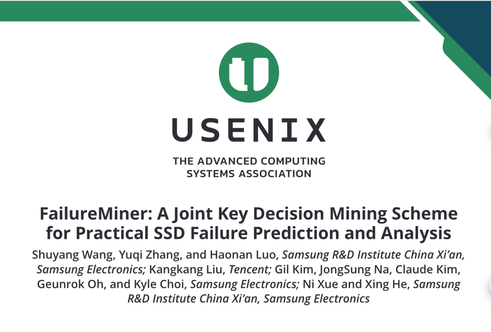
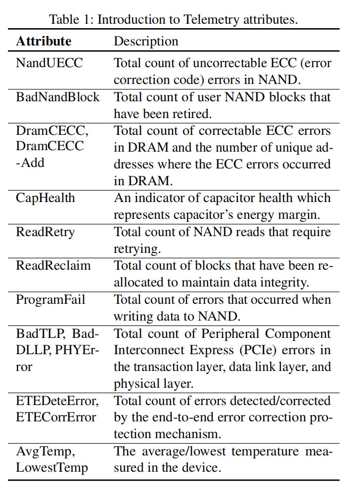
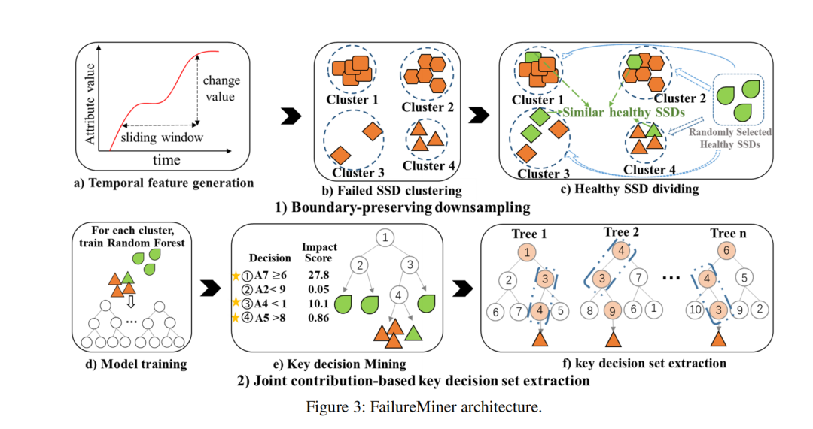
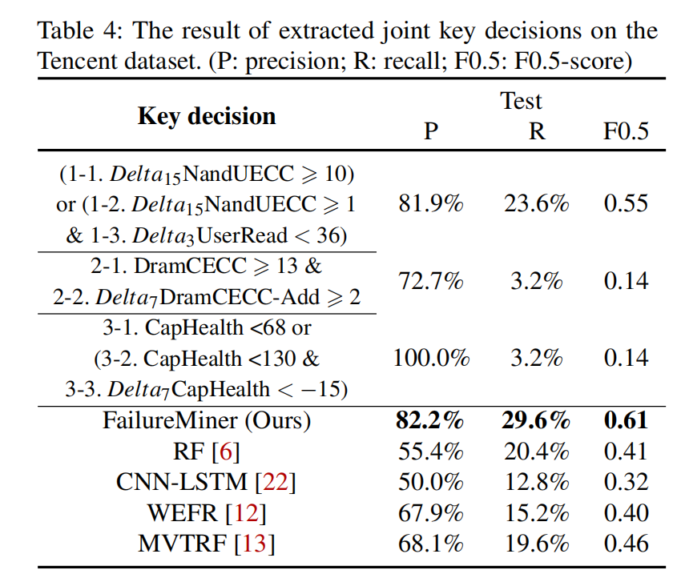
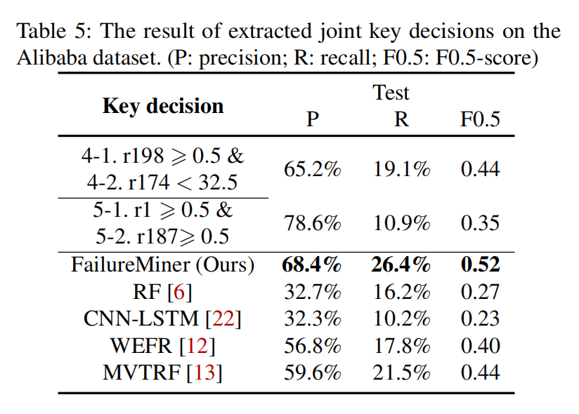
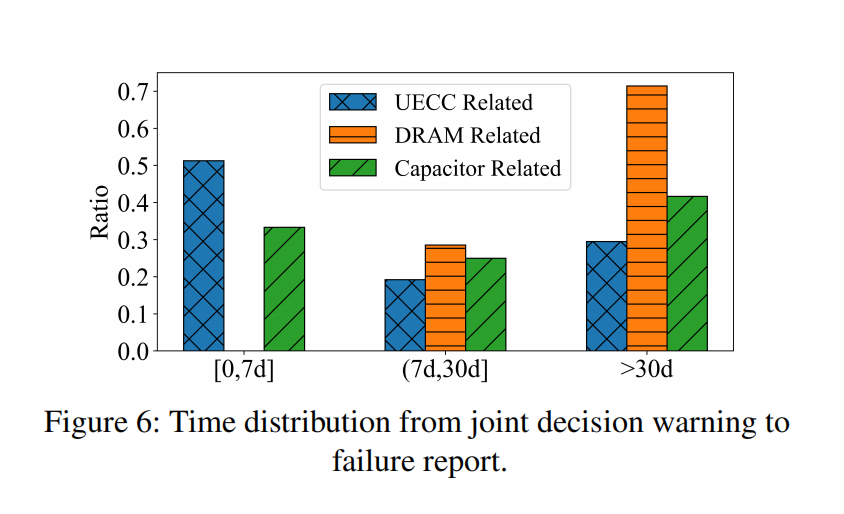
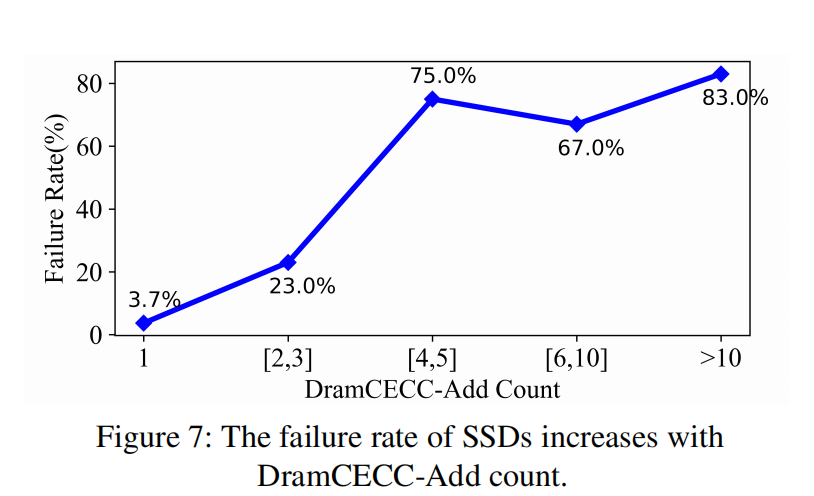
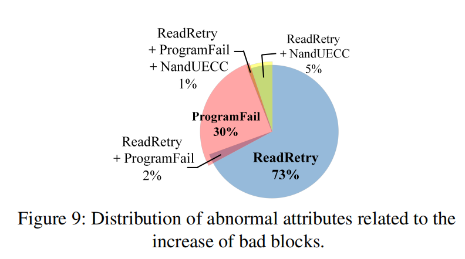
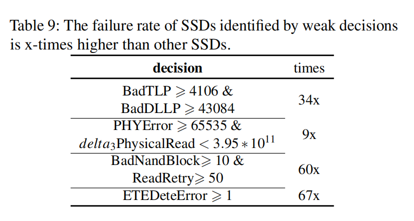

这篇发表在2026年存储领域顶会FAST的论文，由三星西安研究院、腾讯和三星电子联合完成，是少有的真正在超大规模生产环境落地验证的SSD故障预测研究。简单来说，提出了一套叫FailureMiner的新方案，解决了行业里SSD故障预测“不准、看不懂、难落地”的老问题，还在腾讯数据中心的35万多块企业级SSD上跑了一年多，成功提前预警了上百次SSD故障，核心效果比行业现有最好的方案提升了一大截。

接下来我们就按论文的逻辑，用通俗的话把这套方案的核心内容、效果和价值讲清楚，不纠结复杂公式，只抓关键要点。

  

扩展阅读：

[SSD上电过程中DDR Training解读](https://mp.weixin.qq.com/s?__biz=MzIwNTUxNDgwNg==&mid=2247495986&idx=1&sn=962320e8f9f3d3fc5bd58e72d3654bfa&scene=21#wechat_redirect)

[16K IU：大容量SSD的IO架构革命](https://mp.weixin.qq.com/s?__biz=MzIwNTUxNDgwNg==&mid=2247495770&idx=1&sn=cd77bf0bf196af36f1a0af4e95ec8dc0&scene=21#wechat_redirect)

[1亿IOPS SSD？别开玩笑了！](https://mp.weixin.qq.com/s?__biz=MzIwNTUxNDgwNg==&mid=2247496541&idx=1&sn=deedc58c90c6b3dbc3dab6df2b4c054c&scene=21#wechat_redirect)

* * *

## 一、为啥SSD故障预测是数据中心的大难题？

现在的企业级数据中心里，SSD（固态硬盘）早就成了存储核心，不管是云服务、AI训练还是日常业务，都靠它存数据、提速度。但SSD一旦出故障，轻则丢数据，重则服务器宕机、业务中断，损失可能特别大。

  

为了提前发现SSD故障，行业里早就有了成熟的思路，简单说分三步：先处理数据→再训练模型→最后分析模型结果。但实际用起来，这三步里藏着三个绕不开的痛点，也是这次研究要解决的核心问题。

### 1\. 健康盘太多，故障盘太少，模型学不会“区分好坏”

企业级SSD的质量很稳定，年故障率不到0.3%，也就是说，数据中心里健康的SSD和故障的SSD比例能达到1000:1甚至更高。为了让模型能正常训练，行业会删掉一部分健康盘的数据，但传统的删除方法特别“粗暴”，要么随机删，要么挑几个“代表”删，结果把那些和故障盘特征特别像、差一点就故障的健康盘也删掉了。

  

这么做的后果很明显：模型没见过“长得像故障的健康盘”，学不会健康和故障的细微差别，要么漏看故障，要么把很多健康盘当成故障盘——在腾讯35万盘的规模里，哪怕0.1%的误判，都会多出几百次无效的硬盘更换，既费钱又费人力。

### 2\. 筛选故障指标太粗糙，把“辅助判断的关键信息”扔了

SSD运行时会产生很多监控指标（比如闪存错误数、缓存状态、温度等），为了让模型更高效，行业会先删掉那些看起来和故障无关的指标。但问题是，有些指标单看没用，和其他指标搭配起来，就是判断故障的关键。

比如判断一个人是不是感冒，单看“嗓子干”不算数，但“嗓子干+发烧+流鼻涕”就很准。传统方法会把“嗓子干”这种单看没用的指标删掉，结果模型少了关键的辅助信息，漏判很多故障。

### 3\. 模型算出来“要故障”，却说不清“为啥要故障”

现在很多故障预测模型都是“黑盒”：输入数据，模型告诉你这个SSD大概率要故障，但说不清楚是哪个指标出了问题、到了什么数值会故障、多个指标怎么搭配代表故障。

  

对数据中心的运维人员来说，这个结果等于没说——换SSD需要停业务，仅凭一个“概率”，谁敢随便操作？而且看不懂原因，也没法针对性处理故障、跟硬盘厂商反馈问题。

## 二、FailureMiner的设计目标：就盯三个核心需求

既然行业的痛点是“不准、看不懂、难落地”，FailureMiner的设计目标就特别明确，完全冲着生产环境的实际需求来，不是为了在实验室刷漂亮指标：

  * 测得准，少误判：不仅要能找到故障盘，更要把误判的健康盘降到最少，避免无效运维；
  * 看得懂，有依据：不仅要预测故障，还要明确告诉运维“哪个指标超标、标到多少、哪些指标一起超标代表故障”，让运维敢决策；
  * 好部署，易维护：模型不用太复杂，计算速度快，哪怕运维不懂机器学习，也能轻松用起来。

## 三、FailureMiner核心方案：两大模块，解决所有痛点

FailureMiner的整体思路很简单，针对前面的三个痛点，设计了两个核心模块，从“数据处理”到“模型结果提取”形成完整闭环，两个模块相辅相成，少了一个效果都会大打折扣。我们挨个讲，都是大白话版的核心逻辑。

### 模块一：边界保留下采样——删健康盘，但留“长得像故障的”

这个模块专门解决“健康盘太多、模型学不会区分”的问题，彻底颠覆了传统的删数据思路，核心就是不盲目删健康盘，只删和故障盘一点都不像的，把长得像故障的健康盘全留着。具体分三步，特别好理解：

  * 先抓SSD的指标变化：SSD故障前，很多指标会有异常波动（比如错误数突然变多），所以先计算3天、7天、15天内的指标变化值，抓住这些“故障前兆”；
  * 把故障盘分堆，定“故障边界”：把所有故障盘的指标拿出来，按故障特征分50堆（每堆代表一种故障类型，比如闪存故障、缓存故障），再给每堆定一个“边界”——离堆中心最远的故障盘，就是这个故障类型的边界；
  * 只留边界内的健康盘：把健康盘的指标和每堆故障盘对比，落在“故障边界”里的健康盘，就是和故障盘长得像的，全留着；边界外的健康盘，才放心删掉。同时为了让模型训练更稳定，再随机留一点边界外的健康盘。

  

这么操作之后，每堆里的健康盘和故障盘比例会从几百比一降到16比一，模型既能正常训练，又见过“长得像故障的健康盘”，能精准学会两者的差别，从根源上减少误判和漏判。

### 模块二：联合贡献度关键决策集提取——从模型里挖出“看得懂的故障规则”

这个模块是FailureMiner的核心创新，专门解决“指标筛选粗糙、模型结果看不懂”的问题，简单说就是让模型不仅能预测故障，还能吐出一条条清晰的“故障判断规则”，比如“15天内闪存不可纠正错误数≥10，同时3天内用户读数据量<36，这个SSD大概率要故障”。

  

这套规则不是凭空来的，而是从模型里一步步挖出来的，分三步：

  * 分堆训练简单模型：针对前面分好的50堆故障盘，每堆单独训练一个随机森林模型（为啥选这个模型？因为故障盘太少，复杂的深度学习模型学不好，这个模型简单、快、还容易解释），训练时用SSD的所有指标，不提前删，避免扔了辅助信息；
  * 从模型里挑“真有用的判断规则”：随机森林模型训练完后，会生成上万条判断规则（比如“某指标≥X”），但大部分是没用的。研究人员改进了行业里的分析方法，只挑那些真正能帮模型判断出故障的规则，把没用的全过滤掉；
  * 把有用的规则组合起来，找“故障组合规则”：单条规则判断故障不准，比如“闪存错误数≥10”不一定代表故障，但和另一条规则搭配就很准。这里借鉴了“找关联规律”的方法，把单条有用的规则组合起来，计算每条组合的实用性，最终挖出那些一起出现就代表故障的“组合规则”——这就是最终给运维的、看得懂的故障判断依据。

简单说，这个模块把“黑盒模型”变成了“白盒规则”，运维不用懂模型，只要看这些规则，就能判断SSD会不会故障、为啥会故障。

## 四、实验验证：效果是真的好，还能跨场景用

研究人员用了两个真实的数据集做测试，一个是腾讯自己的（35万多块三星SSD，2年的7000多万条监控数据，788次真实故障），一个是阿里的公开数据集（2万块SSD，1000多万条数据），测试结果能直接反映真实场景的效果。

### 1\. 核心效果：比行业最好的方案准太多

用三个关键指标判断效果：精确率（判为故障的盘里，真故障的比例）、召回率（能找到多少真实故障盘）、F0.5分数（优先看重精确率，贴合生产需求）。

在腾讯的数据集里，FailureMiner的精确率达到82.2%，召回率29.6%，相比行业现有方案，精确率平均提升38.6%，召回率平均提升80.5%。更厉害的是，它只靠3条核心的“故障组合规则”，就比那些用上万条规则的传统模型效果好得多。

### 2\. 泛化能力：换盘、换数据集，照样好用

在阿里的公开数据集里，虽然SSD型号、监控指标和腾讯完全不同，但FailureMiner依然表现很好，精确率68.4%，召回率26.4%，还是比行业其他方案强。这说明它不是为三星SSD定制的“专属方案”，而是能推广到不同品牌、不同型号SSD的通用方案。

### 3\. 效率：训练快、预测快，不费服务器

在普通的企业级服务器上，FailureMiner完整训练一次只需要1673秒（不到半小时），一次预测所有SSD只需要6秒，比深度学习模型快太多。而且生产环境里只需要每季度重新训练一次，完全不会增加运维负担。

### 4\. 两个模块缺一不可

研究人员还做了测试：只用边界保留下采样，模型效果会提升一大截；只用联合贡献度规则提取，效果也会提升；两个模块一起用，效果是最好的，证明这两个创新点是真正的“强强联合”。

## 五、生产落地：35万盘跑了一年，还挖出了SSD的核心故障规律

这篇论文最有价值的地方，不是实验室的漂亮指标，而是真正在腾讯数据中心落地了，还从落地数据里挖出了企业级SSD的核心故障规律，给运维和硬盘厂商都提供了实打实的参考。

### 1\. 腾讯落地的核心经验：误判比漏判更可怕

FailureMiner在腾讯35万多块SSD上跑了一年多，成功预警上百次故障，研究人员也总结了两个超实用的落地经验，对所有数据中心都适用：

  * 误判的代价远大于漏判：哪怕0.1%的误判，在超大规模数据中心里都会带来几百次无效运维，所以故障预测一定要优先保证“准”，再追求“能找到更多故障”；
  * 运维只认“看得懂的规则”：黑盒模型的“故障概率”再高，运维也不敢随便换盘；但清晰的“组合规则”能告诉运维故障原因、紧急程度，运维能直接根据规则做决策，效率大幅提升。

### 2\. 三大核心SSD故障模式：不同故障，不同应对策略

从落地的“故障组合规则”里，研究人员拆解出了企业级SSD最常见的三类故障，还明确了每类故障的紧急程度和处理方法，运维可以直接照做：

  * 闪存不可纠正错误故障：最紧急的故障，简单说就是SSD的闪存芯片读不出数据了，51%的这类预警SSD会在一周内真故障，必须紧急更换，否则会直接导致数据丢失、业务中断；
  * 缓存（DRAM）故障：属于“慢故障”，缓存芯片出了小错误，错误数覆盖的地址越多，故障概率越高（超过3个地址，故障率飙升到60%以上）。71%的这类预警SSD会在30天以上才故障，运维有充足的时间慢慢做业务迁移，再换盘；

  * 电容故障：SSD的掉电保护电容出问题了，平时不影响使用，但突然断电会丢数据。故障紧急程度看SSD的工作负载：高负载的盘要尽快换，低负载的盘可以慢慢换，不用急。

### 3\. 四大SSD“亚健康信号”：这些指标异常，盘更容易坏

除了能直接预测故障的“强规则”，研究人员还挖出了一些“弱规则”——这些指标异常不一定代表会故障，但符合这些规则的SSD，故障率是普通盘的数倍甚至数十倍，属于“亚健康”，运维可以重点关注：

  * PCIe传输错误超标：这类盘的故障率是普通盘的9-34倍，还和服务器型号有关，大概率是服务器和SSD的兼容性问题；
  * 坏块数+读重试次数超标：坏块数≥10且读重试≥50的盘，故障率是普通盘的60倍，大多是读数据时出的问题；

  * 端到端错误超标：这类故障率是普通盘的67倍，其中90%的错误来自缓存，和前面的缓存故障相印证。

这些“亚健康信号”能帮运维提前给SSD做风险分级，重点关注高风险盘，进一步降低故障概率。

## 总结

这篇FAST 2026的论文，没有陷入“堆复杂模型、刷实验室指标”的内卷，而是从数据中心的真实痛点出发，用两个简单又创新的模块，解决了SSD故障预测的老问题，还完成了超大规模的生产落地。

  

对数据中心来说，它提供了一套“又准、又好懂、又好部署”的SSD故障预测方案；对SSD行业来说，它挖出了真实的故障规律，推动了产品质量的提升；对整个工业领域来说，它提供了一套可复用的故障预测思路。这也是这篇研究能从众多顶会论文中脱颖而出的核心原因：真正解决了实际问题。

  
  
  

如果您也想针对存储行业分享自己的想法和经验，诚挚欢迎您的大作。  
投稿邮箱：Memory\_logger@163.com （投稿就有惊喜哦~）

  

**《存储随笔》自媒体矩阵**  

如您有任何的建议与指正，敬请在文章底部留言，感谢您不吝指教！如有相关合作意向，请后台私信，小编会尽快给您取得联系，谢谢！  

