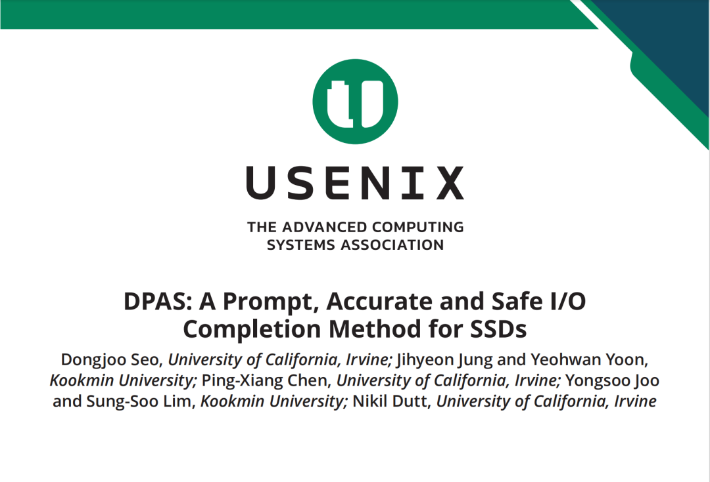
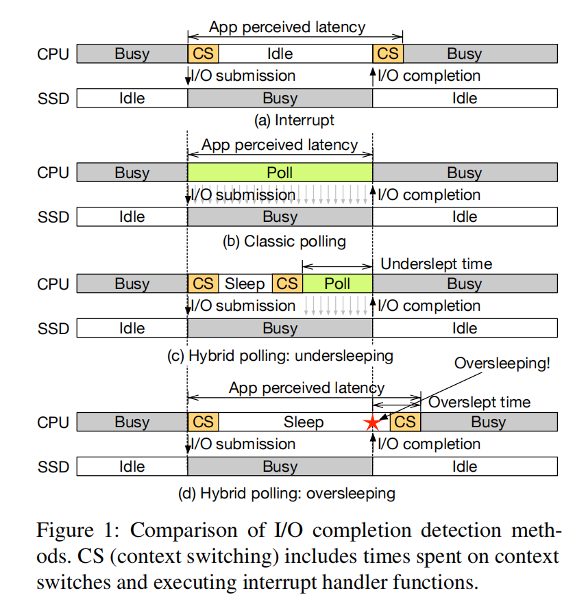
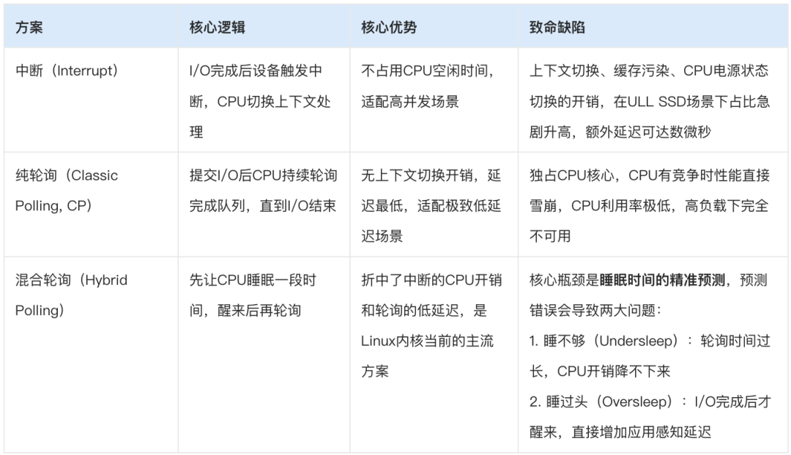
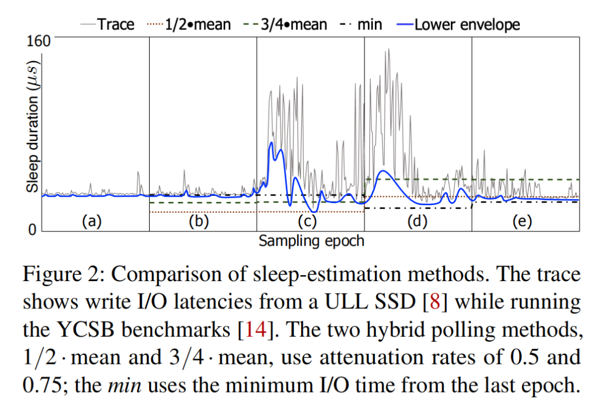
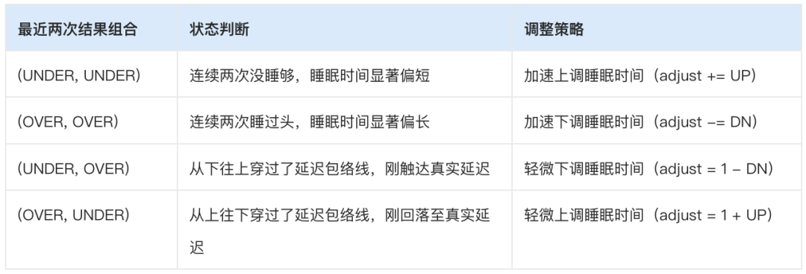
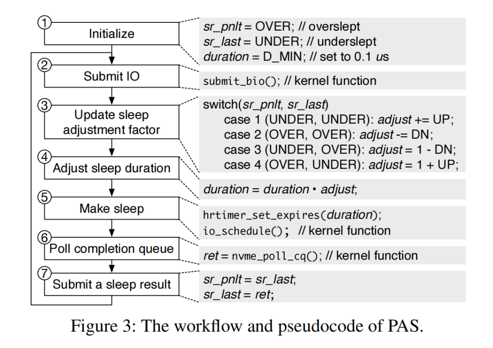
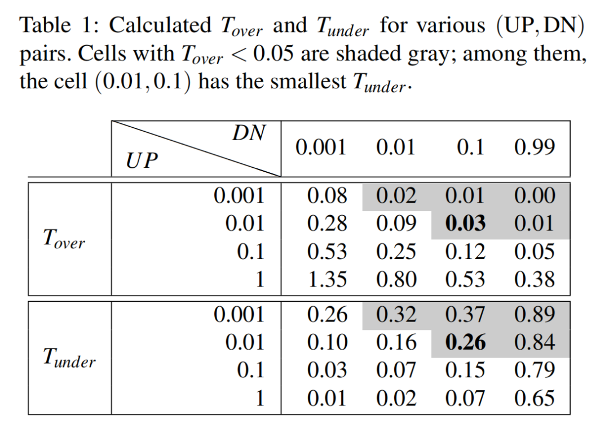
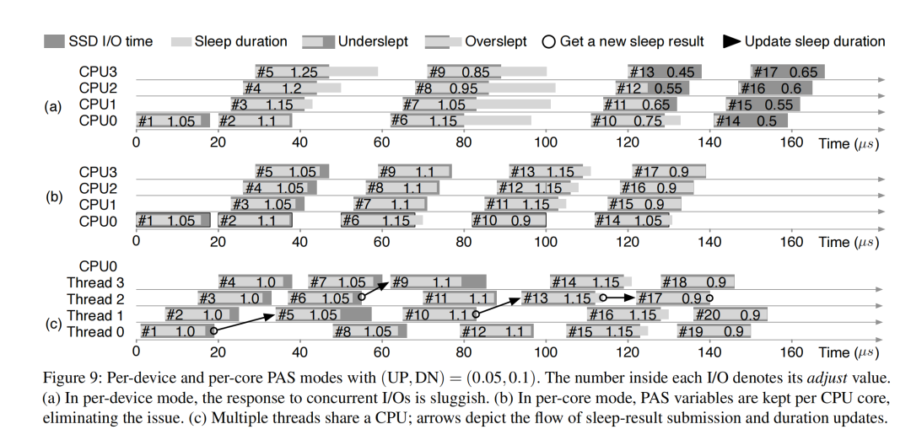
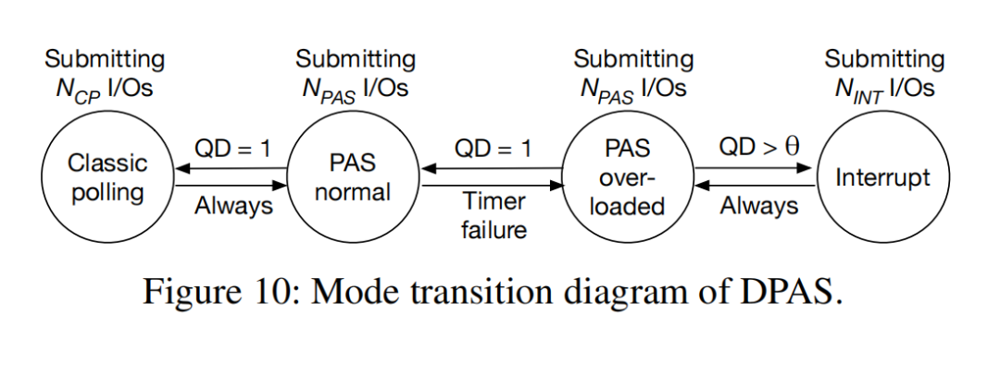

作为存储系统领域的顶会，USENIX FAST每年的论文都代表着行业最前沿的技术方向。在2026年第24届FAST会议上，来自加州大学欧文分校和韩国国民大学的团队带来的《DPAS: A Prompt, Accurate and Safe I/O Completion Method for SSDs》，直击了现代超低延迟（ULL）SSD普及下，I/O完成路径的核心痛点。

  

## 一、背景：SSD越来越快，I/O完成机制却拖了后腿

论文的引言与背景章节，清晰地定义了当前存储系统的核心矛盾：SSD的硬件延迟已经进入微秒级，而传统的I/O完成机制的软件开销，正在成为性能瓶颈。

  

我们先把三种经典I/O完成方式的底层逻辑与核心缺陷讲透，这也是DPAS方案要解决的根本问题。

### 1\. 三种经典方案的能力边界

### 2\. 现有混合轮询方案的三大无解痛点

论文中重点剖析了Linux原生混合轮询（LHP）、EHP、HyPI等主流方案的核心缺陷，这也是整个行业的共性难题：

  * 响应滞后：基于固定周期的统计，跟不上延迟突变  
LHP以100ms为周期统计I/O延迟的均值，睡眠时间设为均值的50%；EHP把周期缩短到10ms，用周期内的最小延迟做预测。但无论周期长短，只要是epoch-based的方案，就必然存在滞后性——I/O延迟发生突变后，必须等到下一个周期才能更新策略，在微秒级的SSD场景下，这个滞后足以造成严重的性能损失。
  * 逻辑缺陷：无法区分设备延迟与系统调度误差，引发「延迟搁置」  
所有现有方案都只统计「总I/O耗时」，但这个耗时里包含了两部分：SSD本身的硬件延迟，和OS调度、预测错误导致的oversleep延迟。  
  
当CPU出现竞争，OS调度不及时导致睡过头时，现有方案会错误地把调度延迟当成「SSD硬件延迟升高了」，进而继续拉长后续的睡眠时间，陷入「越睡越过头，越过头越拉长睡眠时间」的恶性循环，论文中将其定义为latency shelving（延迟搁置），这个问题往往需要数个周期才能恢复。
  * 极端场景失效：高CPU竞争下直接退化为忙等  
当CPU核心被严重超售时，OS调度器无法按时唤醒睡眠的线程，无论睡眠时间设多短，都会出现严重的oversleep。此时PAS之外的混合轮询方案会持续降低睡眠时间，最终降到0，退化为「反复调用定时器却不睡眠」的忙等循环，性能甚至比纯中断模式还差。

## 二、核心创新一：PAS——用极简二元状态机，解决混合轮询的预测难题

针对现有混合轮询的核心缺陷，论文首先提出了PAS（Prompt, Accurate and Safe） 算法，这也是DPAS的核心底座。PAS的设计哲学极具工程美感：不用复杂的统计模型，不用离线 profiling，仅通过最近两次I/O的睡眠结果，就能实现per-I/O级的睡眠时间动态调整。

### 1\. PAS的三大设计目标

PAS从根源上重构了混合轮询的预测逻辑，目标完全对准现有方案的痛点：

  * 即时响应：I/O行为变化时立刻调整，无需等待下一个统计周期
  * 精准追踪：持续贴合I/O延迟的下包络线（lower envelope），最大化睡眠时间，最小化CPU开销
  * 安全容错：能区分「SSD硬件延迟上升」和「预测/调度导致的oversleep」，彻底解决延迟搁置问题

### 2\. 核心原理：二元结果驱动的自适应调整

PAS最颠覆性的设计，是放弃了对「I/O绝对延迟」的统计，转而关注每次睡眠的二元结果：

  * UNDER：睡醒后I/O还没完成，睡眠时间太短
  * OVER：睡醒后I/O已经完成，睡眠时间太长

它只用最近两次I/O的结果组合，就可以决定下一次睡眠时间的调整方向，逻辑如下：

整个工作流完全闭环，论文中的图3给出了完整的执行流程：

  * 初始化：设置初始睡眠时间为0.1μs（避免初始oversleep），初始结果组合为\(OVER, UNDER\)
  * 提交I/O后，根据最近两次的结果组合，计算睡眠调整因子adjust
  * 用adjust更新睡眠时间，通过Linux内核高分辨率定时器hrtimer执行睡眠
  * 睡醒后轮询I/O完成队列，获取本次的睡眠结果（UNDER/OVER）
  * 更新结果队列，进入下一次I/O的调整循环

### 3\. 关键参数校准：平衡性能与安全

论文通过仿真实验PAS-Sim，完成了核心参数的校准，这里的设计充分体现了对存储场景的深刻理解：

  * 核心参数UP/DN：最终选定UP=0.01，DN=0.1，DN/UP=10:1。这个比例的核心逻辑是：oversleep的代价远大于undersleep——睡过头会直接增加应用可见的延迟，而没睡够只是多消耗一点CPU。因此下调的步长要远大于上调的步长，优先保证不出现严重的oversleep。
  * 动态灵敏度调整：固定的UP/DN无法适配所有场景，论文中做了第二重优化：当连续两次结果相同时，认为灵敏度不足，通过HEATUP放大UP/DN；当结果不同时，认为灵敏度过高，通过COOLDN缩小UP/DN。最终选定HEATUP=0.05，COOLDN=0.1，同时固定UP:DN=1:10，限制UP的范围在\[0.001, 0.01\]，避免过度调整。
  * 并发I/O支持：原生per-device模式下，多核心并发I/O会出现结果过期、覆盖、锁竞争的问题。论文给出的解决方案是per-core模式：每个CPU核心维护独立的PAS变量，同核心多线程场景下，仅第一个完成的I/O可提交结果，仅第一个看到新结果的I/O可更新睡眠时间，彻底解决了并发冲突问题。

### 4\. PAS的核心收益

微基准测试显示，针对4KB随机读场景，PAS比Linux原生混合轮询LHP降低了21个百分点的CPU占用，同时保持了相当的IOPS性能，这是对现有混合轮询方案的降维打击。

## 三、核心创新二：DPAS——动态模式切换，实现全场景性能最优

PAS完美解决了混合轮询的睡眠预测问题，但它依然继承了混合轮询的两个固有缺陷：

  * 内核定时器本身存在固定开销：哪怕设置1μs的无oversleep睡眠，对比纯轮询也会有4%的性能损失；  

  * 高CPU竞争下的定时器失效：当OS调度严重滞后时，PAS会持续降低睡眠时间至0，退化为无效忙等，性能甚至不如中断模式。

  

基于此，论文提出了DPAS（Dynamic PAS），核心逻辑是：没有任何一种I/O完成方式能在所有场景下最优，那就通过运行时状态检测，在纯轮询、PAS、中断三种模式之间动态切换，取长补短。

### 1\. DPAS的状态机设计

DPAS设计了一套极简且鲁棒的状态机，将运行模式分为4类：纯轮询（CP）、PAS正常模式、PAS过载模式、中断（INT）模式，模式切换完全基于运行时的两个核心指标：定时器失效事件、I/O队列深度（QD）。

  

核心切换规则如下：

  * PAS正常模式 → 纯轮询模式：连续100个I/O的平均队列深度QD=1，说明是单线程串行I/O，无CPU竞争，纯轮询的性能最优。切换后执行1000个纯轮询I/O，自动切回PAS正常模式，保证自适应能力。
  * PAS正常模式 → PAS过载模式：检测到定时器失效（睡眠时间降至0），说明出现了CPU竞争，进入过载模式，重新采集100个I/O的QD数据。
  * PAS过载模式 → 中断模式：若平均QD超过阈值θ（NAND SSD设为1，3D XPoint SSD设为3），说明CPU竞争严重，PAS已无收益，切换到中断模式。切换后执行10000个中断I/O，再切回PAS过载模式——更长的执行窗口是为了避免严重竞争下的模式颠簸（thrashing）。
  * 模式回退规则：仅当QD回落至阈值以下，且定时器失效事件消失，才会从过载/中断模式逐步回退到PAS正常模式，保证稳定性。

### 2\. 工程实现的轻量化

论文中DPAS的实现完全基于Linux 5.18内核的多队列块层，工程化落地性极强：

  * 内存开销极低：每个CPU核心仅需592字节的PAS变量，+104字节的DPAS模式切换逻辑，全系统开销可忽略不计；
  * 代码改动极小：仅修改了9个内核源文件，新增1224行代码，删除30行代码，兼容性极强，无侵入式的架构改动；
  * 无需逐设备调参：仅需根据SSD类型（3D XPoint/NAND）设置一个阈值θ，其余参数全场景通用，开箱即用。

## 四、实验验证：全场景碾压现有方案，可复现性拉满

顶会论文的核心说服力来自严谨的实验验证，论文的第4章用了整整13页的篇幅，通过微基准、真实Trace回放、宏基准、极限场景、泛化性、能效六大维度，完成了DPAS的全面验证。

### 1\. 实验环境

  * 硬件平台：Intel Xeon Gold 6230 20核CPU，192GB DDR4内存，关闭超线程保证实验可复现；
  * 测试SSD：覆盖三类主流产品，Intel Optane DC P5800X（3D XPoint，ULL企业级）、三星983 ZET（SLC Z-NAND，企业级）、SK海力士P41 Gold（TLC NAND，消费级）；
  * 对比方案：中断（INT）、纯轮询（CP）、Linux原生混合轮询（LHP）、EHP、PAS、DPAS；
  * 测试负载：FIO微基准、SNIA真实I/O Trace、YCSB on RocksDB数据库宏基准，覆盖从合成负载到真实业务的全场景。

### 2\. 核心实验结果解读

#### （1）核心性能收益

  * 无竞争场景：DPAS与纯轮询性能持平，比中断模式在3D XPoint SSD上提升30%的IOPS，同时PAS比LHP降低21个百分点的CPU占用；
  * CPU竞争+I/O干扰双压力场景：这是最贴近真实业务峰值的场景，DPAS在3D XPoint SSD上比中断模式提升9%的YCSB性能，在TLC NAND SSD上提升5%，而纯轮询、LHP、EHP均出现不同程度的性能暴跌，甚至低于中断模式。

#### （2）极限场景的稳定性

  * 高CPU超售场景：4个CPU核心运行32个线程，纯轮询的OPS直接暴跌至中断模式的62%，PAS也出现明显性能下滑，而DPAS通过切换到中断模式，始终保持比中断模式更高的性能；
  * I/O干扰场景：后台运行脉冲式大I/O模拟业务抖动，LHP、EHP的性能随着脉冲间隔增大持续下降，而DPAS与PAS保持完全稳定的吞吐量，尾延迟仅为纯轮询的1/30，彻底解决了延迟搁置问题。

#### （3）泛化性与能效

  * 泛化性测试：在10款不同型号的消费级/企业级SSD上，DPAS除1款外，均实现了全场景性能最优，证明了其无需逐设备调参的通用能力；
  * 能效测试：高CPU竞争场景下，纯轮询因执行时间最长，能耗最高；DPAS通过自适应模式切换，能耗与中断模式接近，同时保持了更高的性能，实现了性能与能效的兼顾。

## 五、技术思考与行业价值

论文的讨论与结论章节，不仅总结了方案的价值，也给出了未来的优化方向，站在行业视角，这套方案的意义远不止于学术创新。

### 1\. 技术方案的核心亮点

这篇论文最厉害的地方，不是发明了颠覆性的技术，而是把工程化的优雅与实用性做到了极致：

  * 它没有用复杂的神经网络（如LinnOS），也没有需要离线profiling的黑盒模型，只用极简的二元状态机，就解决了行业多年的共性难题；
  * 代码改动极小，无侵入式设计，完全具备上游到Linux主线内核的条件，能让整个Linux生态的存储栈直接受益；
  * 全场景自适应，无需用户手动调参，无论是企业级ULL SSD，还是消费级TLC SSD，都能获得稳定的性能收益。

### 2\. 未来的优化方向

论文中也坦诚了方案的可扩展空间，这也是行业后续可以跟进的方向：

  * CPU节省模式：对于优先保证CPU空闲、而非极致IOPS的场景，可以禁用纯轮询路径，仅保留PAS+中断的组合，牺牲少量性能换取更多的CPU算力余量；
  * 动态中断聚合：DPAS当前在中断模式下没有中断聚合机制，高并发I/O下可能出现中断风暴，未来可接入vIC等动态中断聚合方案，进一步提升高吞吐场景的性能。

### 3\. 行业落地价值

  * 对于Linux内核社区：DPAS有望替代当前Linux内核的LHP方案，成为新一代默认的混合轮询机制，从底层提升整个操作系统的存储I/O性能；
  * 对于企业级存储：在数据库、云原生、高性能计算等场景，ULL SSD的普及正在加速，DPAS能充分释放低延迟SSD的硬件性能，同时解决业务高峰期的性能抖动问题，提升系统稳定性；
  * 对于消费级存储：哪怕是普通的消费级TLC SSD，DPAS也能带来5%左右的性能提升，且完全是纯软件优化，无需额外硬件成本，普适性极强。

## 六、总结

回到论文的标题，DPAS的三个核心词——Prompt（即时）、Accurate（精准）、Safe（安全），恰恰切中了现代SSD I/O完成机制的所有痛点。在存储硬件不断突破延迟下限的今天，软件栈的优化早已不是「锦上添花」，而是决定硬件性能能否充分释放的「胜负手」。

  

这篇FAST '26的论文，用最极简的工程方案，解决了最核心的行业问题，兼具学术创新性与工程落地性，是近年来存储系统领域难得的「能直接用」的顶会成果。目前论文的完整artifact已经开源在GitHub，感兴趣的开发者可以直接编译测试，亲手验证这套方案的性能收益。

  

  
  
  

如果您也想针对存储行业分享自己的想法和经验，诚挚欢迎您的大作。  
投稿邮箱：Memory\_logger@163.com （投稿就有惊喜哦~）

  

**《存储随笔》自媒体矩阵**  

如您有任何的建议与指正，敬请在文章底部留言，感谢您不吝指教！如有相关合作意向，请后台私信，小编会尽快给您取得联系，谢谢！  

