作为存储系统领域的顶会，USENIX FAST 每年的论文都代表着全球存储技术的工业化前沿与学术创新方向。在2026年第24届FAST大会上，上海交通大学与阿里云、Solidigm联合发布的《Here, There and Everywhere: The Past, the Present and the Future of Local Storage in Cloud》，堪称云本地存储领域的“史诗级实践白皮书”，也获得了FAST‘26 “Awarded Best Paper\!”

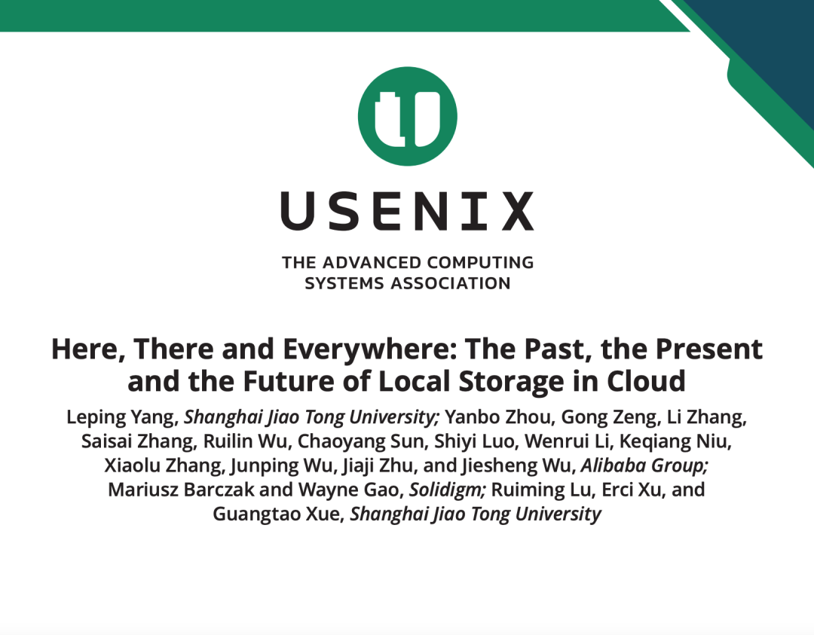

这篇论文首次完整公开了阿里云从2017年到2023年，三代商业化云本地存储架构的完整演进路径、核心设计取舍、大规模落地数据，更提出了突破本地存储物理架构天花板的下一代混合方案。

  

扩展阅读：[顶会FAST24最佳论文｜阿里云块存储架构演进的得与失](https://mp.weixin.qq.com/s?__biz=MzIwNTUxNDgwNg==&mid=2247491536&idx=1&sn=d927aa060768f9199160d84c6ae1806b&scene=21#wechat_redirect)

  

* * *

一、背景：云本地存储的核心矛盾——性能红利与架构瓶颈

在正式拆解三代架构之前，我们需要先搞清楚：云厂商为什么要死磕本地存储？它的核心价值与天生短板到底是什么？

### 1\. 云本地存储的本质与核心价值

云本地存储（也叫临时存储/Ephemeral Storage），是AWS、Azure、阿里云等头部云厂商的核心存储品类，其核心架构是将SSD/HDD物理直连到计算服务器，通过虚拟化技术以虚拟磁盘（VD）的形式暴露给虚拟机/裸金属实例。和计算存储分离的云盘（EBS）相比，它的核心优势是近物理盘的极致性能：

  * 没有数据中心网络的两跳开销，延迟可压缩到十微秒级；
  * 能充分释放NVMe SSD的硬件性能，IOPS和吞吐上限远高于同规格云盘；
  * 成本远低于高性能云盘，是CDN缓存、大数据Shuffle、AI推理中间结果存储等场景的刚需。

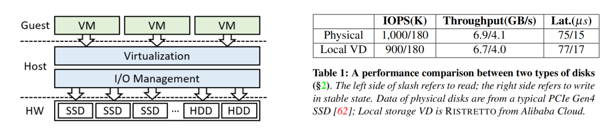

论文中给出的实测数据显示，阿里云第三代本地存储RISTRETTO的虚拟盘，4KB随机读IOPS可达900K，顺序读吞吐6.7GB/s，读延迟77μs，和企业级PCIe Gen4 NVMe物理盘的性能差距几乎可以忽略不计。

### 2\. 绕不开的两大核心挑战

云本地存储的演进，始终围绕着两大核心矛盾展开：

  * 硬件性能红利与软件栈瓶颈的矛盾：2017-2023年，企业级NVMe SSD的4KB随机读IOPS从50万飙升到150万，顺序吞吐从PCIe Gen3的3GB/s翻倍到Gen4的6GB/s。但传统内核态存储栈，在高IOPS场景下会触发频繁的上下文切换，论文实测显示，内核栈方案最多只能发挥NVMe SSD 9.54%的IOPS能力，CPU占用却高达140%，完全无法承接硬件的性能红利。
  * 极致性能与云原生能力的矛盾：物理直连的架构带来了极致性能，但也天生存在三大短板（论文中定义为LDL\_1-3）：

    * 可用性弱：本地盘年故障率约0.44%，一旦盘坏，用户业务会面临小时级不可用，且无原生冗余机制；
    * 弹性差：容量和性能上限被物理服务器的SSD规格锁死，无法像云盘一样秒级扩缩容；
    * 可访问性差：只能在大规模部署的区域提供，小区域部署易出现资源闲置，利用率极低。

  

阿里云三代本地存储架构的演进，本质上就是先解决第一个矛盾，把硬件性能吃满；再试图突破第二个矛盾，打破本地盘物理架构的天花板。

## 二、过去：三代架构的工业化演进，从软件优化到软硬协同

论文中用三款浓度递增的意式咖啡命名三代架构，恰好对应了云本地存储从“基础萃取”到“极致浓缩”的演进过程，每一代都精准解决上一代的核心痛点，同时在大规模生产环境中完成了验证。

### 第一代：ESPRESSO（2017）—— 用户态栈，释放NVMe性能红利

ESPRESSO是阿里云第一代基于NVMe SSD的云本地存储方案，核心目标是解决内核栈的性能瓶颈，把NVMe SSD的性能真正释放出来。

#### 核心设计

  * 彻底抛弃传统内核态存储栈，基于SPDK（存储性能开发套件）将整个I/O栈搬到用户态；
  * 用轮询模式（Polling）替代传统中断模式，避免高IOPS下频繁的上下文切换；
  * 为每个I/O线程绑定专属CPU核心，采用无共享数据结构，最大化CPU亲和性，减少锁竞争和同步开销。

#### 落地成果与性能

  * 2017年正式商业化，最终部署规模达数万台物理服务器；
  * 单台服务器搭载12块PCIe Gen3 NVMe SSD，可实现最大38.4GB/s顺序吞吐、576万随机读IOPS，相比传统HDD内核栈，软件开销降低82.35%；
  * 8VD实例在4核CPU下，实现384.8万IOPS，是同配置内核栈方案的8.7倍。

####   

#### 核心局限（SWL\_1-3）

纯软件优化的方案，天生带着无法突破的短板：

  * 不支持裸金属实例：必须占用主机CPU核心运行I/O栈，无法把所有CPU资源交付给用户；
  * CPU利用率极低：专属绑定的CPU核心，99分位实际利用率不足60%，且突发I/O场景下无法通过调度弥补，造成大量资源浪费；

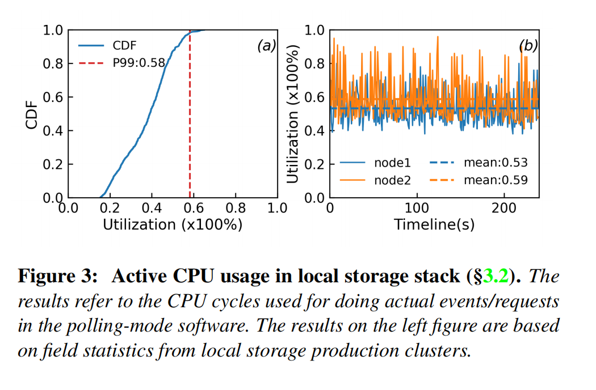

  * 仍存在上下文切换开销：I/O完成时需要通过eventfd通知虚拟机，带来5-12μs的额外延迟，队列深度越深，和物理盘的性能差距越大。

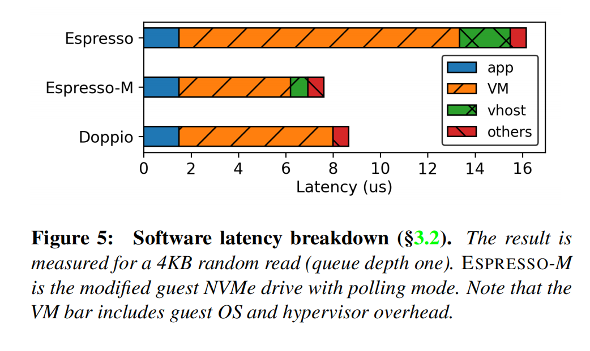

### 第二代：DOPPIO（2019）—— ASIC硬件卸载，释放主机CPU

ESPRESSO解决了“性能释放”的问题，但核心痛点是“占用主机CPU”。DOPPIO的核心目标，就是通过硬件卸载，把I/O处理从主机CPU彻底剥离。

#### 核心设计

  * 采用商用ASIC架构的DPU（数据处理器），将存储虚拟化、I/O处理全量卸载到硬件；
  * 单颗DPU管理2块NVMe SSD，通过SR-IOV技术将SSD划分为多个VF（虚拟功能），以PCIe直通的方式挂载给虚拟机；
  * 用硬件MSI中断替代软件中断，I/O请求从虚拟机直达DPU，全程无需主机CPU参与，也无需虚拟机和管理程序之间的上下文切换。

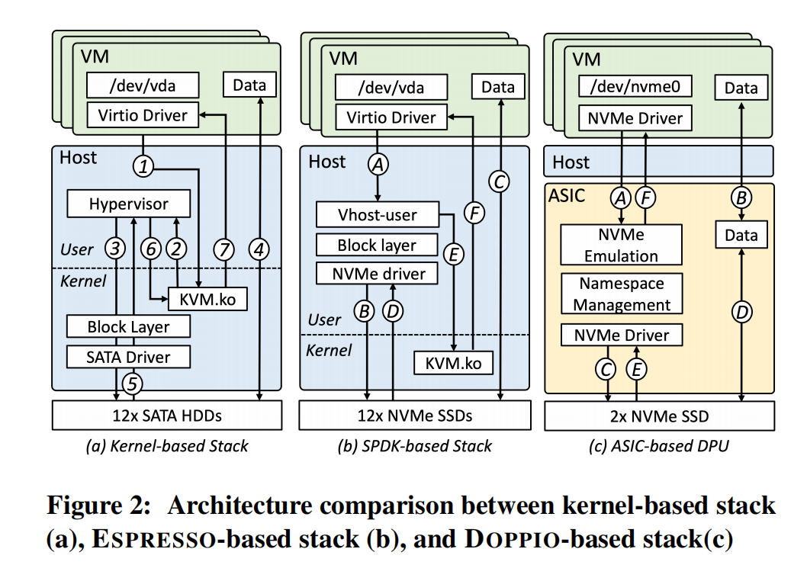

#### 落地成果与性能

  * 2019年正式商业化，两年内完成数千节点的大规模部署；
  * 同12块PCIe Gen3 SSD配置下，实现38.4GB/s顺序吞吐、600万随机读IOPS，性能略高于ESPRESSO；
  * 完全不占用主机CPU，既支持裸金属实例，也能为虚拟机实例多释放6个vCPU核心。

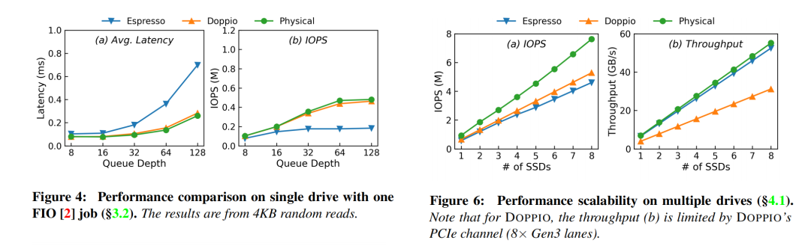

#### 核心局限（HWL\_1-2）

ASIC硬件的“固化”属性，让它在快速迭代的存储行业中很快暴露短板：

  * 跟不上SSD硬件的演进速度：ASIC的流片迭代周期长达数年，而NVMe SSD的性能从2017年到2023年翻了2-3倍。实测显示，DOPPIO的单颗DPU最多只能发挥Gen4 SSD 130万IOPS的能力，完全无法跑满硬件上限；
  * 无法支持新兴云原生特性：ASIC的逻辑在制造时就已固化，面对逻辑卷管理（LVM）、ZNS分区命名空间等新特性，几乎无法快速适配，灵活性远低于软件方案。

  

论文中也提到，虽然FPGA能缓解灵活性问题，但功耗和资本支出（CapEx）会大幅上升，完全不适合公有云的大规模落地。

### 第三代：RISTRETTO（2023）—— ASIC+SoC软硬协同，平衡性能与灵活性

前两代方案，一个胜在灵活、输在CPU占用；一个胜在硬件卸载、输在固化不灵活。RISTRETTO的核心设计哲学，就是融合两者的优势，用软硬协同的方式，同时实现“极致性能、零主机CPU占用、极致灵活”三大目标。

  

#### 核心架构设计

RISTRETTO是一块定制化PCIe扩展卡，核心由两大模块构成，通过内部PCIe总线互联：

  * ASIC模块：负责性能敏感的基础路径，包括NVMe控制器仿真、DMA引擎、I/O请求解析与封装、硬件中断直注，支持超过1000个VF，实现I/O路径的硬件级加速；
  * ARM SoC模块：集成4核Cortex-A72核心+64GB DRAM，运行基于SPDK的Runtime软件栈，提供可定制的块抽象层，支持LVM、RAID、FTL、ZNS等各类云原生特性，实现完全的软件定义能力。

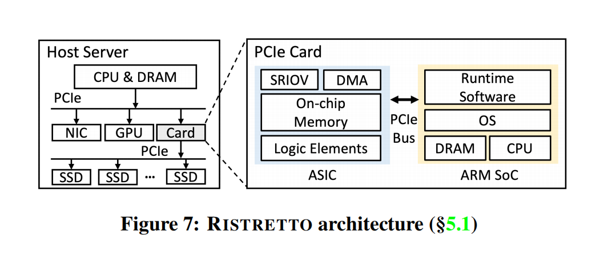

整个I/O数据流的核心逻辑是：虚拟机发出的NVMe请求，先由ASIC通过DMA直接获取，解析后通过虚拟队列转给SoC处理云原生特性，再转回ASIC封装为标准NVMe请求下发给SSD；I/O完成后，由ASIC直接向虚拟机注入硬件中断，全程完全不经过主机CPU，也无需主机内存参与数据搬运。

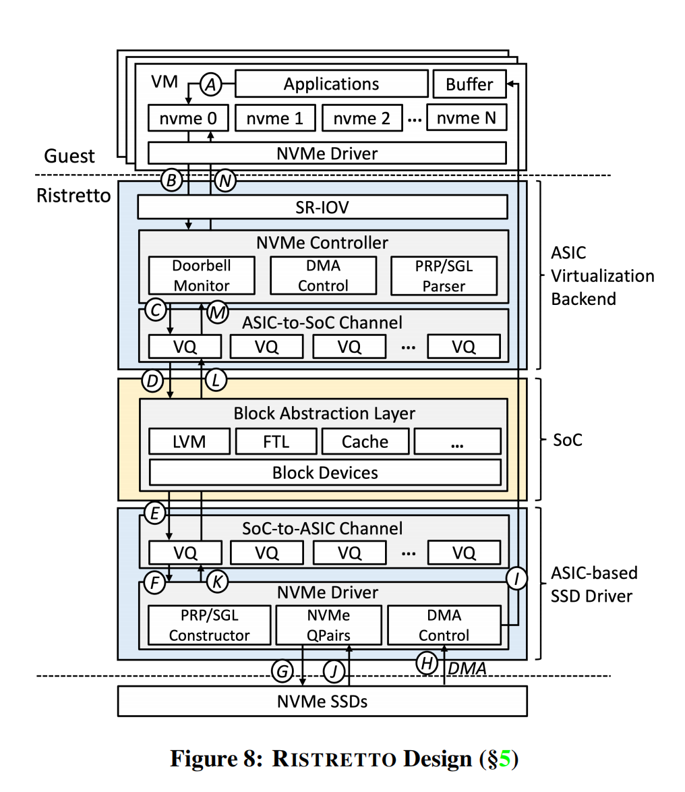

#### 落地成果与性能

  * 2023年正式商业化，目前已完成数千节点的部署；
  * 单实例8块PCIe Gen4 SSD配置下，实现53GB/s总顺序吞吐、738万总随机读IOPS，单VD随机读IOPS达94.9万，相比DOPPIO提升80%，性能无限接近物理NVMe SSD；
  * 管8块SSD仅需4个ARM核心，远低于ESPRESSO所需的8个Xeon核心，也比DOPPIO所需的4颗DPU硬件成本更低，TCO大幅优化。

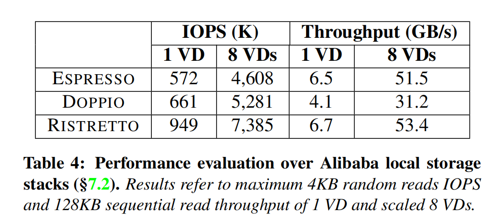

#### 核心局限：摸到了本地盘的物理天花板

RISTRETTO已经把本地存储的性能、灵活性、硬件效率做到了极致，但它依然无法突破物理直连架构的天生短板——也就是前文提到的可用性、弹性、可访问性三大核心局限。

  

论文中也明确指出：哪怕RISTRETTO的性能已经和物理盘无异，但在LLM推理、动态扩缩容等对可用性和弹性有强需求的场景，纯本地盘依然不是最优解。这也引出了论文最核心的前瞻性探索：云本地存储的未来，到底在哪里？

## 三、现在与未来：突破物理边界，本地+云盘的混合架构

既然纯本地盘的物理架构存在无法突破的天花板，那有没有办法既保留本地盘的极致性能和低成本，又继承云盘的高可用、高弹性？

论文给出了两个探索方向，其中的LATTE混合架构，堪称云本地存储的“终局思路”。

### 方向一：高性能云盘EBSX替代本地盘

阿里云的高性能云盘EBSX，通过持久化内存（PMem）和100Gbps高速网络，已经能实现30μs延迟、1M IOPS、6GB/s吞吐，完全达到了本地盘的性能水准，且天生具备云盘的高可用、高弹性、全域可访问能力。

但它的核心问题是成本过高：同4TB容量、同性能规格下，EBSX的价格是RISTRETTO本地盘的20倍。对于本地存储的主流场景（缓存、临时数据存储）来说，三副本冗余带来的高可靠性完全是“性能过剩”，用户无法接受如此高的成本溢价。

### 方向二：LATTE——本地+云盘混合存储架构（PoC）

LATTE的核心设计思路，是“前端本地盘扛性能，后端标准云盘做持久化”，用分层架构融合两者的核心优势，在性能、成本、可用性之间找到最优平衡。它的命名也延续了咖啡的隐喻：拿铁是浓缩咖啡+牛奶的融合，正如本地盘+云盘的结合。

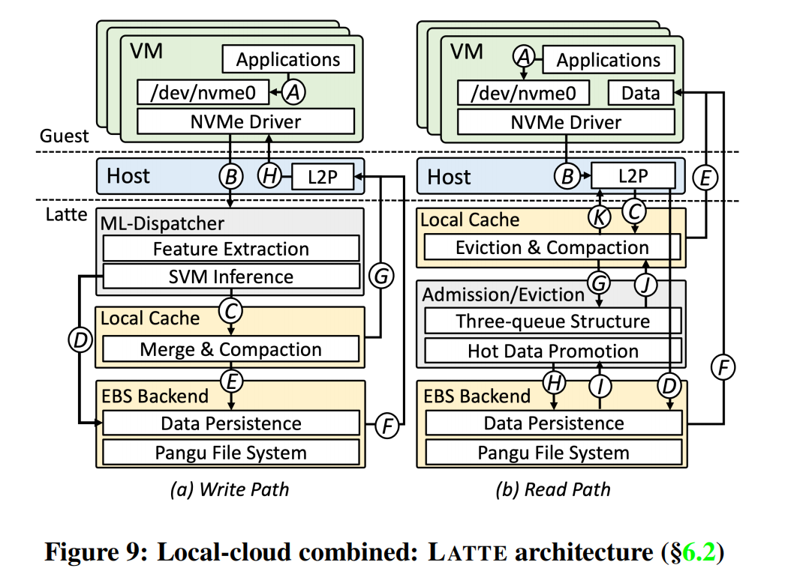

#### 核心架构设计

LATTE基于阿里云和Solidigm联合开源的CSAL存储加速框架构建，核心做了三大创新：

  * 双路径I/O架构：前端用RISTRETTO本地盘作为高性能缓存，后端用标准经济型EBS云盘作为持久化存储。写请求分为写缓存和写直通两条路径，读请求优先命中本地缓存，未命中则从后端云盘读取，同时做热点数据晋升。
  * 轻量级ML I/O调度器：基于线性SVM模型实现I/O路径的智能决策，输入滑动窗口内的I/O大小、队列深度、缓存/后端延迟等特征，输出“走缓存还是走后端”的二分类结果。模型推理延迟仅200ns，完全不影响I/O路径；每60秒检测负载变化，若延迟方差超过阈值，5秒即可完成模型重训练，适配业务负载的动态变化。

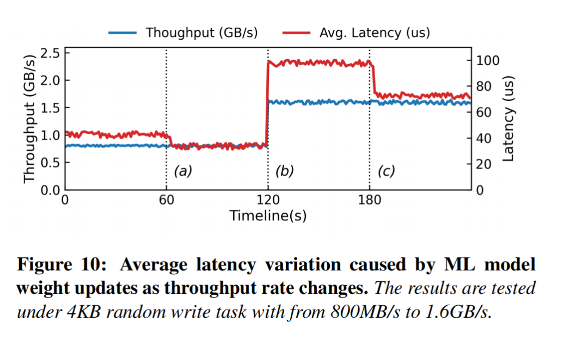

  * S3FIFO缓存准入与淘汰机制：基于S3FIFO三队列结构实现缓存管理，解决缓存场景中普遍存在的“one-hit-wonder”（仅访问一次的数据占用缓存）问题。首次读未命中时，仅记录元数据，不直接插入缓存；只有二次及以上访问的热点数据，才会晋升到本地缓存。实测显示，该设计在真实业务Trace中，读命中率超过82%，最高可达90.23%。

  

同时，LATTE直接去掉了传统分层存储的日志结构合并和GC开销，因为这部分能力已经由后端EBS云盘原生支持，大幅简化了架构设计。

  

#### 核心优势与实测数据

论文通过完整的基准测试，验证了LATTE的颠覆性价值：

  * 极致性价比：性能与EBSX持平，价格仅为其1/5~1/10；自动扩缩容模式下，同4TB容量的价格仅为RISTRETTO的2.1~4倍，远低于EBSX的19倍。
  * 企业级可用性：所有数据最终都会通过合并或刷写落盘到EBS后端，可实现与标准EBS同等的可用性和可靠性；本地盘故障时，业务可直接路由到后端云盘，不会出现服务不可用；还支持O\_DIRECT/O\_SYNC写穿模式，实现强数据持久化。
  * 突破物理限制的弹性：容量上限不再受本地盘约束，可弹性扩容到后端EBS的最大规格；IOPS可弹性扩缩容到最高100万，彻底打破物理SSD的规格限制。
  * 全域可访问性：单台服务器只需1块SSD，即可拆分出多个LATTE实例，无需再为每台服务器配置8~12块SSD，大幅降低了部署门槛，可实现全域覆盖，解决资源闲置问题。

  

性能实测方面，LATTE的表现同样惊艳：

  * 75%缓存命中率下，实现8.9GB/s顺序读吞吐、7.8GB/s顺序写吞吐，超过EBSX和物理SSD；
  * 真实业务Trace回放（社交网络、AI模型推理、大数据Shuffle）中，写延迟远低于标准EBS，接近本地盘；
  * MySQL Sysbench测试中，写场景的QPS甚至超过了纯RISTRETTO本地盘，只读场景性能与EBSX持平。

## 四、工业化验证：完整的测试评估与架构思考

论文用了整整一章的篇幅，通过微基准测试、宏基准测试、资源消耗分析，完成了对所有方案的工业化验证，核心结论可以总结为3点：

  * 性能层面：RISTRETTO的延迟、IOPS、吞吐均无限接近物理NVMe SSD，是纯本地盘方案的最优解；ESPRESSO受软件上下文切换影响，延迟最高；DOPPIO受ASIC PCIe通道限制，吞吐无法跑满Gen4 SSD；LATTE在75%命中率下，综合性能超过EBSX，部分场景超越纯本地盘。
  * 资源效率层面：RISTRETTO管8块SSD仅需4个ARM核，ESPRESSO需要8个Xeon核，DOPPIO需要4颗ASIC DPU，RISTRETTO的硬件效率和TCO优势显著。
  * 场景适配层面：纯本地盘方案适合对性能有极致要求、能容忍数据丢失的缓存类场景；LATTE则同时覆盖了性能、可用性、弹性需求，适配AI、数据库、大数据等绝大多数云原生场景。

  

在讨论章节，论文也回应了行业最关心的几个问题：

  * 这套架构并非阿里云专属，所有方案均基于开源SPDK和商用硬件构建，对AWS、Azure等其他云厂商有极强的参考价值；
  * LATTE的单盘多实例拆分能力，能大幅缓解云厂商本地存储“计算-存储资源静态绑定”的行业痛点，提升资源利用率；
  * RISTRETTO的块抽象层原生支持NVMe-oF，可无缝对接远端存储，架构本身也能适配计算存储分离的趋势。

## 五、结语：云本地存储的终局，是融合

回顾阿里云这十年的三代架构演进，我们能清晰地看到一条完整的技术迭代逻辑：

  * 从内核态到用户态，解决“能不能释放硬件性能”的问题；
  * 从软件到硬件卸载，解决“能不能不占用主机CPU”的问题；
  * 从纯硬件到软硬协同，解决“能不能兼顾性能与灵活性”的问题；
  * 最终从纯本地到本地+云混合，解决“能不能突破物理架构的天生天花板”的问题。

  

这篇论文的价值，绝不仅仅是公开了阿里云三代商业化存储架构的核心细节，更重要的是它给整个行业指明了方向：云本地存储的未来，从来不是“纯本地”和“纯云盘”的二选一，而是两者的深度融合。

  

用本地盘承接极致性能需求，用云盘补齐可用性、弹性的短板，最终在性能、成本、可靠性之间，找到最适合公有云大规模落地的最优解。这既是工业化实践对学术创新的反哺，也是云计算“软件定义一切”核心理念的又一次完美印证。

  

  

  
  
  

如果您也想针对存储行业分享自己的想法和经验，诚挚欢迎您的大作。  
投稿邮箱：Memory\_logger@163.com （投稿就有惊喜哦~）

  

**《存储随笔》自媒体矩阵**  

如您有任何的建议与指正，敬请在文章底部留言，感谢您不吝指教！如有相关合作意向，请后台私信，小编会尽快给您取得联系，谢谢！  

