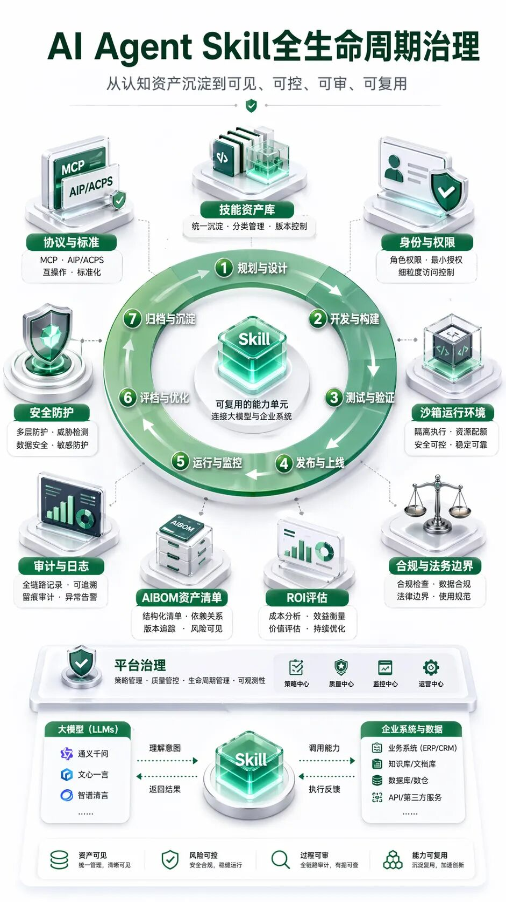
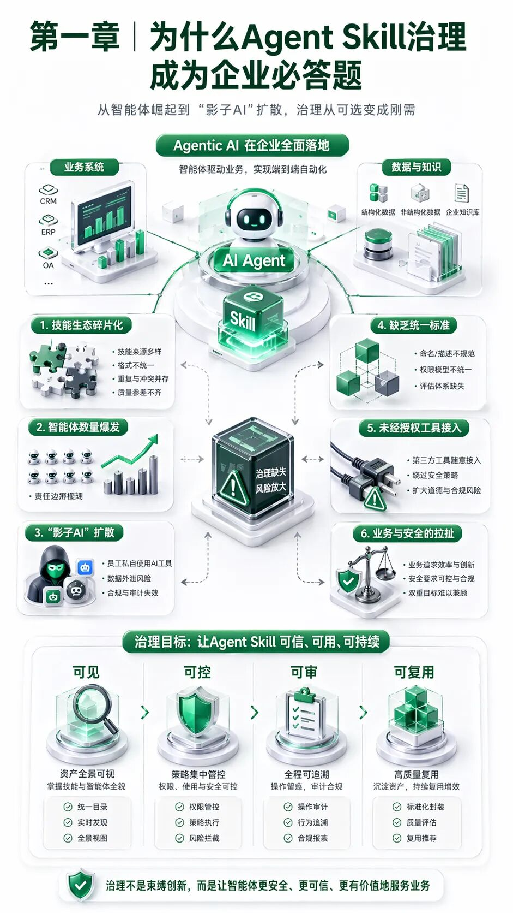
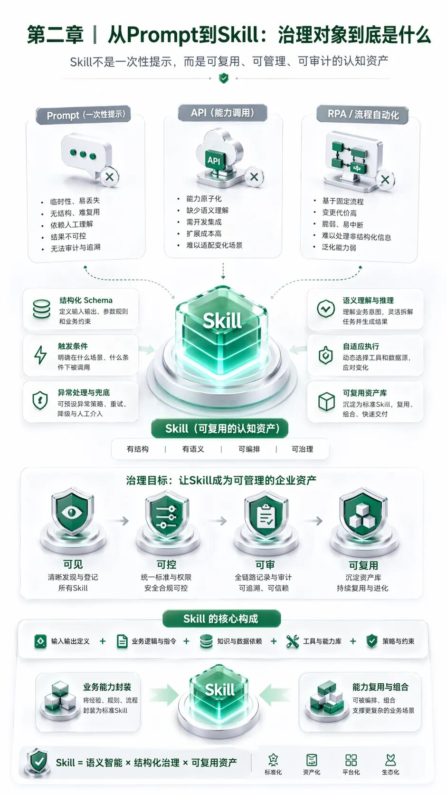
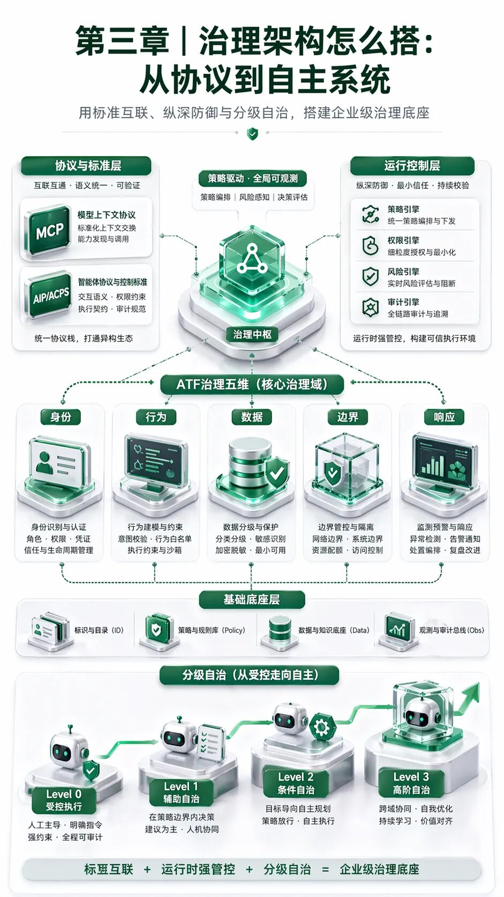
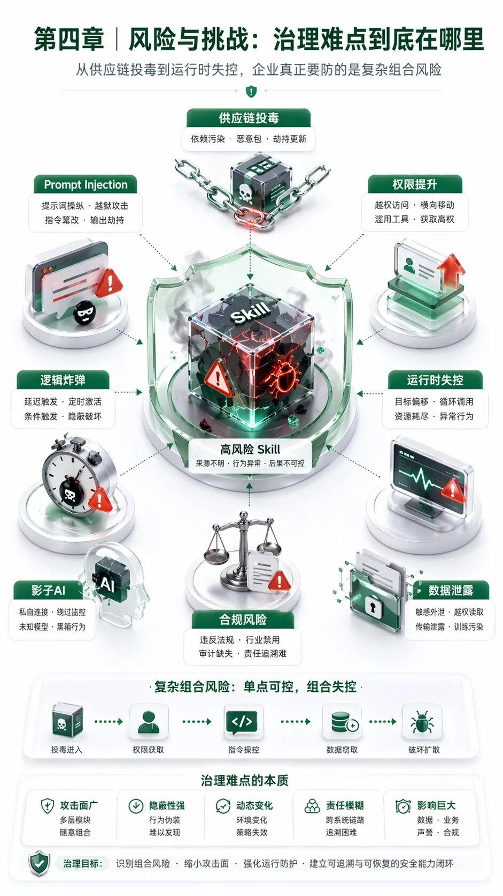
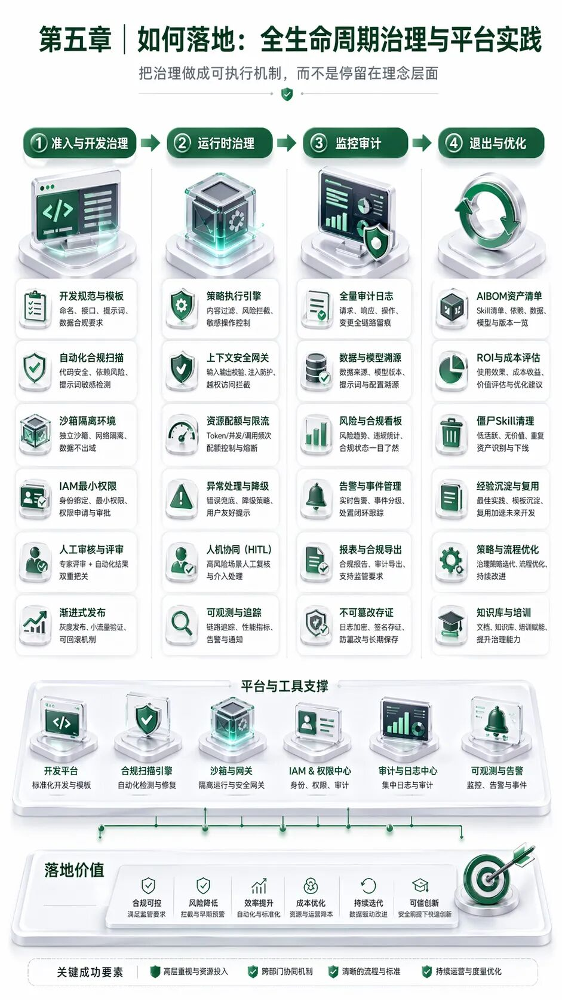

企业AI Agent规模化落地的治理框架、风险边界与实施路径  

摘要：AI Agent正在从“会回答问题”的工具，进入“能理解目标、调用工具、执行流程”的阶段。在这个过程中，Skill不再只是提示词、脚本或接口封装，而是承载企业知识、流程经验和操作权限的认知资产。本文围绕Skill的定义、治理目标、标准架构、风险识别与落地路径，整理出一套面向企业的全生命周期治理框架：先把资产看清，再把权限管住，再把运行过程审计下来，最终让Skill从可用走向可信、可复用和可持续。

导语  

当企业开始大规模使用AI Agent时，一个现实问题会迅速浮出水面：真正决定Agent能力边界的，不只是底层大模型，而是它能调用哪些工具、理解哪些业务规则、执行哪些流程，以及这些能力是否被安全地管理起来。

Skill正是在这个位置出现的。它把一段可复用的业务能力封装起来，让Agent在合适的任务场景下按需调用。一个Skill可以是报表生成流程，可以是数据质量检查规则，也可以是工单处理、代码审查、客户服务、运维巡检等一套标准化动作。

但Skill越有用，治理难度也越高。因为它往往同时连接知识、数据、系统和权限。一旦Skill来源不清、权限过大、运行过程不可追踪，就可能带来数据泄露、越权操作、流程中断、供应链投毒等问题。对于企业来说，Skill治理不是锦上添花，而是AI Agent规模化落地前必须补齐的基础设施。

从工具能力走向治理能力

当Skill从个人经验、社区样例和临时脚本中走出来，进入企业生产流程，它就必须接受与软件资产、数据资产同等级别的治理。下面从背景、概念、架构、风险和落地五个层面展开。

一、为什么Skill治理成为企业AI落地的关键  

从生成内容到执行任务，风险边界被重新定义

过去一段时间，企业对AI的主要关注点集中在内容生成、知识问答和辅助分析。此时，AI系统大多停留在“建议者”角色，即使回答存在偏差，也通常需要人来判断和执行。进入Agent阶段后，系统开始具备规划、记忆、工具调用和多步骤执行能力，AI从“给出答案”转向“完成任务”。这意味着风险不再只存在于回答质量中，也存在于操作链路、数据流向、权限使用和业务后果中。

Skill是Agent执行任务的重要抓手。它把业务知识、操作步骤、调用脚本、参考文档和约束规则集中封装，使Agent能够在特定领域表现得更稳定、更专业。对企业而言，这种能力非常有价值，因为它可以把分散在员工经验、流程文档和系统接口中的知识沉淀下来，形成可复用资产。

问题在于，Skill一旦进入生产环境，就不再是普通文档或代码片段。它可能读取数据、调用接口、写入系统、触发审批、修改配置，甚至影响外部客户体验。治理的核心，就是要让企业知道有哪些Skill存在、谁创建了它、它能访问什么、什么时候被调用、执行了哪些动作，以及出现问题后能否追溯和回滚。

“影子智能体”让企业看不清真实风险

在很多组织里，业务团队为了提高效率，会自行接入AI工具、导入插件、复制社区Skill，或者用低代码方式快速搭建内部Agent。这种探索本身并不一定有问题，但如果没有统一目录、统一审批和统一审计，就会形成“影子智能体”。它们可能已经进入关键流程，却没有被安全团队、IT团队和管理层充分看见。

影子智能体的风险并不只来自恶意使用，更多来自“好心办坏事”。例如，一个用于自动整理客户反馈的Skill，可能在没有脱敏的情况下把客户信息传给外部模型；一个用于自动化运维的Skill，可能因为缺乏环境边界而误操作生产资源；一个用于知识库检索的Skill，可能因为权限继承不当而让普通员工访问到敏感资料。

因此，企业必须把Skill纳入正式资产管理。治理的第一步不是限制创新，而是建立可见性。只有先看清资产全貌，才谈得上风险分级、权限控制、审计留痕和复用推广。

Skill正在成为企业新的知识资产形态

传统企业资产包括代码、接口、数据表、流程制度、模型文件和知识文档。Skill的特殊之处在于，它把这些要素重新组合成一种可执行的认知资产：既包含“怎么理解任务”的知识，也包含“如何完成任务”的流程，还可能包含“调用什么工具”的执行路径。

这种资产的价值不只体现在效率提升上，也体现在组织知识沉淀上。过去，很多关键流程依赖少数专家，交接成本高，复用效率低。通过Skill封装，企业可以把专家经验转化为标准能力，再通过版本管理、权限管理和效果评估持续迭代。

但资产化也意味着责任化。越是核心的Skill，越需要明确归属人、维护周期、适用范围、版本记录和退出机制。否则，企业很容易积累大量无人维护、权限不清、逻辑过时的“僵尸Skill”，长期看反而会增加系统复杂度和安全负担。

二、Skill到底是什么：从提示词到认知资产  

Skill不是更长的提示词

很多人最初会把Skill理解为一段复杂提示词。这个理解只说对了一小部分。提示词通常是一次性的交互指令，依赖上下文窗口，缺乏稳定的结构、边界和生命周期管理。Skill则更像一个可被Agent识别、加载、执行和审计的能力单元。

一个成熟的Skill通常包含名称、用途、触发条件、输入输出要求、操作步骤、异常处理、依赖资源、参考材料和安全约束。它既可以告诉Agent“遇到什么任务时使用我”，也可以告诉Agent“执行过程中不能做什么”。这使Skill具备了比提示词更强的复用性和可治理性。

从治理角度看，提示词管理主要关注内容质量和指令效果，而Skill治理还必须关注身份、权限、依赖、审计、版本、供应链与运行时风险。把Skill当作提示词管理，容易低估它进入生产环境后的影响范围。

Skill也不等同于API或RPA

API提供的是确定性的系统能力，通常由程序按照固定参数调用。RPA则更多模拟人在界面上的点击、输入和复制粘贴。Skill与它们的差异在于，它处在语义理解和系统执行之间，既要理解任务目标，也要选择合适步骤，还要在异常情况下调整路径。

例如，“生成本周经营分析”这个任务，如果用API实现，可能需要调用固定接口并拼接报表；如果用RPA实现，可能是打开多个系统下载数据再填表；如果用Skill实现，则可以把指标口径、数据源选择、异常校验、图表生成、结论模板和人工复核要求统一封装，让Agent按业务目标执行。

这并不意味着Skill取代API或RPA。更准确地说，Skill会把API、脚本、RPA、知识库和业务规则重新编排成Agent可理解的能力包。API解决连接问题，RPA解决遗留界面操作问题，Skill解决面向目标的业务能力复用问题。

企业治理要围绕四个目标展开

第一是可见。企业需要建立Skill目录，记录每个Skill的来源、负责人、版本、依赖、权限、适用范围和运行状态。没有目录，就无法判断哪些Skill正在被使用，也无法定位潜在风险。

第二是可控。Skill必须遵守最小权限原则。它能读什么、能写什么、能调用哪些外部系统、能否联网、能否访问敏感数据，都应当被明确声明并由平台强制执行，而不是只写在说明文档里。

第三是可审。Agent执行Skill的过程需要留下可追溯日志，包括触发原因、输入数据、调用工具、关键决策、输出结果和人工审批节点。审计不是为了事后追责而已，也是为了持续优化Skill质量。

第四是可复用。治理不能只做管控，还要服务效率。通过统一标准、资产库和评价机制，企业可以让高质量Skill跨团队复用，减少重复建设，形成可沉淀、可传播的组织能力。

三、治理体系怎么建：标准、架构与权限边界  

用标准解决“各做各的”问题

Skill生态早期最容易出现碎片化：不同团队用不同目录结构，不同工具定义不同元数据，不同平台采用不同加载方式。短期看这有利于快速试验，长期看却会造成迁移困难、审计困难和复用困难。因此，企业需要尽早确立内部Skill标准。

一个实用的Skill标准至少应包含四类内容：一是元数据，包括名称、描述、适用场景、负责人、版本和风险级别；二是执行说明，包括触发条件、输入输出、步骤约束和失败处理；三是依赖资源，包括脚本、配置、参考文档、模型或外部服务；四是安全声明，包括所需权限、数据范围、网络访问和人工确认要求。

标准化还有一个重要价值：它可以让Skill具备渐进式披露能力。Agent不需要一开始加载所有细节，而是先读取简要说明，匹配任务后再加载详细步骤，真正执行时才读取脚本或参考材料。这既节省上下文，也降低敏感信息暴露范围。

用资产库承接Skill的全生命周期

企业不应让Skill散落在个人电脑、聊天记录、代码仓库和临时文档中。更合理的方式，是建设企业级Skill资产库。资产库不是简单文件夹，而是一个带审批、版本、权限、标签、搜索、评分和审计能力的治理入口。

在资产库中，每个Skill都应有清晰状态：草稿、待审核、试运行、正式发布、限制使用、废弃下线。不同状态对应不同权限和流程。例如，草稿Skill只能在开发沙箱使用；试运行Skill只能在低风险场景中使用；正式Skill必须通过安全扫描、依赖审计和业务负责人确认。

资产库还应支持分层管理。通用基础Skill由平台团队维护，例如文件处理、检索、代码分析、报表生成；行业业务Skill由业务部门维护，例如风控评估、客户分层、采购审核；高风险Skill由安全、法务和业务共同管理，例如资金操作、生产变更、客户数据导出。

用身份和权限边界降低运行时不确定性

Agent系统的一个关键治理原则是：不要让Skill天然继承人的全部权限。更安全的做法是为Agent和Skill分配独立身份，并让它们按任务申请最小必要权限。这样，即使某个Skill出现问题，影响范围也能被限制在授权边界内。

权限边界应覆盖文件系统、数据库、网络、API、密钥、环境变量和外部服务。对于只需要读取知识库的Skill，不应允许写入业务系统；对于只需要生成草稿的Skill，不应允许自动发送正式通知；对于只需要访问测试环境的Skill，不应具备生产环境权限。

高风险操作必须引入人工确认。尤其是涉及资金、合同、人员、生产配置、客户隐私和跨境数据传输的任务，Agent可以负责分析、生成计划和准备材料，但真正执行前应暂停等待授权。治理的目标不是让AI完全失去自主性，而是让自主性在可接受边界内运行。

用审计日志还原Agent的决策链

传统系统日志通常记录接口调用和错误信息。Agent审计需要更进一步，记录“为什么调用”“基于什么上下文调用”“调用前后状态如何变化”。因为Agent的风险常常不在单个接口，而在一串工具调用组合后的业务结果。

建议企业至少记录五类信息：谁发起了任务，哪个Agent和Skill参与执行，什么时候执行，访问了哪些数据和系统，输出了什么结果。对于关键步骤，还应记录模型中间判断、人工审批意见和异常处理过程。

审计日志应尽量不可篡改，并与安全监控、合规审计和质量评估系统打通。一方面，它能在事故发生后支持定位和追责；另一方面，它能帮助团队发现Skill常见失败模式，反向改进说明文档、输入Schema和权限策略。

四、风险在哪里：供应链、运行时与合规底线  

开放生态带来供应链投毒风险

Skill通常由指令、脚本、配置、依赖包和参考文件组成，这使它天然具备供应链属性。企业如果直接从公开社区复制Skill，或者在没有审查的情况下引入第三方Skill，就可能把恶意代码、隐藏指令、硬编码密钥、过度权限声明和不可信依赖带入内部环境。

恶意Skill并不一定表现得很明显。它可以伪装成正常工具，例如文件下载器、日志分析器、表格处理器或系统监控器，在大多数情况下正常工作，只在特定输入、特定时间或特定环境中触发异常行为。常见风险包括提示注入、权限提升、数据外传、逻辑炸弹和凭据窃取。

因此，企业应把Skill发布流程类比软件发布流程。进入资产库前，需要做静态扫描、依赖审计、敏感信息检查、权限声明校验和人工代码复核。对于第三方Skill，还应记录来源、许可证、维护状态和安全评估结论。

运行时失控来自概率系统与业务系统的叠加

传统软件大多按固定逻辑执行，测试覆盖后行为相对可预测。Agent则不同，它会根据上下文生成计划，并在执行中动态选择工具。模型幻觉、目标理解偏差、上下文污染和外部工具异常，都可能导致Agent错误调用Skill。

例如，Agent可能把测试环境误判为生产环境，把草稿内容当作正式指令，把用户建议当作管理员授权，或者在为了完成目标时绕过中间检查。这些问题不一定来自恶意攻击，更多来自复杂系统中的边界不清。

运行时治理要解决两个问题：一是提前限制，防止Agent获得不必要的能力；二是实时观察，发现异常行为后能及时中断。具体做法包括沙箱隔离、网络白名单、只读文件系统、敏感操作审批、异常调用检测、速率限制和自动下线机制。

数据安全与个人信息保护是底线

Skill经常需要读取业务数据、客户数据、日志数据和知识库内容。只要数据进入Agent链路，就必须考虑最小化、脱敏、留痕和访问控制。尤其是涉及个人信息、商业秘密、合同文本、财务数据和生产运维数据时，不能把“模型能力强”当作放开权限的理由。

企业应建立数据分级制度，并把数据等级映射到Skill权限。低风险公共知识可以开放给通用Skill，高敏感数据只能由经过审批的特定Skill在受控环境中访问。输出内容也要做检查，避免把敏感字段、内部路径、密钥片段或客户信息带出边界。

当Skill调用外部API、海外服务或第三方模型时，还需要特别关注数据出境、合同责任和合规审查。对外提供AI能力时，也应明确AI身份标识和内容生成责任，避免用户误以为所有输出都经过人工确认。

治理不能只依赖制度文本

很多企业会先写管理办法，但如果没有技术平台配合，制度很容易停留在纸面。Skill治理必须把规则转化为系统能力：权限不是提醒开发者注意，而是平台默认拒绝越权访问；审计不是要求人工记录，而是系统自动采集；下线不是发通知让大家停止使用，而是资产库和执行网关统一禁用。

有效治理通常是制度、平台和运营三者结合。制度定义边界，平台强制执行，运营负责持续盘点和改进。只靠其中任何一个，都难以覆盖Skill从开发、测试、发布、运行到退出的完整链路。

五、如何落地：全生命周期治理与平台选型  

准入阶段：先定标准，再允许进入资产库

Skill的准入阶段决定了后续治理成本。企业应要求所有Skill在进入资产库前完成基本信息登记，包括用途、负责人、适用范围、输入输出、依赖资源、权限需求和风险等级。缺少这些信息的Skill不应进入正式环境。

安全检查应前置到开发流程中。代码中不能硬编码密钥，日志中不能输出敏感数据，配置中不能使用过宽权限，依赖包要有明确来源。对于涉及外部联网、数据库写入、文件删除、消息发送和生产变更的Skill，应自动标记为高风险并进入更严格审批。

业务负责人也需要参与准入。因为安全团队能判断技术风险，但不一定知道业务流程是否合理。一个Skill是否应该自动通过审批、是否可以修改客户状态、是否能够触发财务动作，需要业务负责人给出明确边界。

运行阶段：把Skill放进受控执行环境

发布后的Skill不应直接在任意机器上运行，而应进入受控执行环境。这个环境需要具备沙箱隔离、权限注入、密钥管理、网络控制、日志采集和异常中断能力。这样才能保证Skill即使出错，也不会突破系统边界。

运行时还应支持风险分级。低风险Skill可以自动执行，例如文档摘要、格式检查、知识检索；中风险Skill可以在限定范围内执行，例如生成工单、准备报表、提交草稿；高风险Skill必须人工确认，例如删除数据、修改生产配置、发送外部通知、执行资金相关动作。

企业还可以设置自主权等级。最低等级只允许只读分析，中间等级允许在白名单场景中执行有限操作，高等级可以处理复杂任务但必须接受实时监控。自主权不是一次性授予，而应根据Skill质量、业务成熟度、历史表现和风险等级动态调整。

监控阶段：用指标判断Skill是否值得继续存在

Skill发布后并不代表治理结束。企业应持续观察它的使用频率、成功率、失败原因、人工接管率、平均耗时、权限命中情况和异常告警。一个高质量Skill不仅要能完成任务，还应稳定、可解释、可维护。

ROI评估也很重要。某些Skill看似先进，但使用次数很少、维护成本很高、风险等级很高，长期看未必值得保留。相反，一些简单Skill如果能在高频场景中稳定节省时间，就应优先推广和优化。

对于长期未使用、无人维护、依赖过时、风险升高或业务流程变化后不再适用的Skill，应建立退出机制。下线前要识别依赖方，给出替代方案，保留必要审计记录，并从资产库和执行网关同步禁用。

平台选型：按组织阶段选择治理深度

不同企业不必一开始就建设复杂平台。开发者团队和小型创新团队可以先从标准目录、代码仓库、简单审批和日志记录开始，重点是避免Skill散落和权限失控。中小企业更适合建设私有化Skill资产库，把开发、审核、发布、复用和下线统一起来。

大型企业则需要更完整的治理平台，尤其是多租户隔离、跨部门权限管理、统一身份、审计报表、供应链扫描、沙箱执行和合规证据留存。对于金融、制造、政企和医疗等强监管行业，平台还应重点支持数据分级、审批链路、出境控制和不可篡改日志。

选型时不要只看功能清单，还要看治理闭环是否完整。一个平台如果只支持Skill开发，却不支持运行时控制和审计，适合试验但不适合生产；如果只强调安全拦截，却缺少资产复用和开发体验，也容易被业务团队绕开。理想状态是让安全治理嵌入日常开发和使用流程，而不是成为额外负担。

落地路线：从最小闭环开始

企业可以从一个最小闭环开始：先建立Skill登记模板和命名规范，再选择一个高频低风险场景试点；随后把Skill放入统一仓库，增加版本管理、负责人、权限声明和运行日志；当试点稳定后，再扩展到审批、沙箱、依赖扫描和ROI评估。

最值得优先治理的不是最炫目的Skill，而是最接近核心数据和核心流程的Skill。例如数据导出、生产变更、客户信息处理、合同生成、财务审核、运维脚本执行等场景，一旦出错影响更大，应优先纳入严格治理。

最终目标是形成一套可复制的组织机制：业务团队能提出需求，开发团队能标准化封装，安全团队能设置边界，平台团队能提供运行环境，管理者能通过仪表盘看见资产价值和风险状态。到这一步，Skill才真正从个人技巧变成企业资产。

  

真正成熟的AI Agent，不是能调用更多工具，而是能在清晰边界内，把企业知识安全、稳定、可审计地转化为行动。

  

参考资料

[网信小兵说安全: 2026年最新人工智能Agent、Skills、MCP和A2A的核心概念与对比](http://mp.weixin.qq.com/s?__biz=Mzg2MDg5MzA5MA==&mid=2247486453&idx=1&sn=cf726d82bfee186b877b925d8f87d4b8&chksm=cf1e2aa5421bc52f49eb87f896ba6539c9509eb42fcce12a7eb5592cec083bdd77d818f2df17&scene=21#wechat_redirect)

[AI智能体one: AI时代入门指南：一文读懂Agent、Skill、MCP、Memory等核心概念](http://mp.weixin.qq.com/s?__biz=MzYyMTA5Mzg4Mg==&mid=2247483658&idx=1&sn=7dc4aa5c679613bad7874b53399049b0&chksm=fe36af4388a2b387c93d6e4b22f7fae48f7c10c8f80e89fffdcbdb7c46bd0a45acded3c71104&scene=21#wechat_redirect)

[Desync InfoSec: AI技能生态的"狂野西部"：安全治理何时到来](http://mp.weixin.qq.com/s?__biz=MzkzMDE3ODc1Mw==&mid=2247490163&idx=3&sn=9792634bad890b1844bae365dd1c5001&chksm=c3201c25df6a4e2dd5bea64a5e1d71d60f353f7ee38274273c17a33787ea9bee62a64b7479d5&scene=21#wechat_redirect)

[IDC咨询: 智能体安全：2026年AI落地过程中最容易被低估的治理挑战](http://mp.weixin.qq.com/s?__biz=MzA5MTc1NzQzOQ==&mid=2651801043&idx=1&sn=e31a6e484e5265a5d38c57f7a5b5daa4&chksm=8ada840d3e042f5da80df658dcff676a3ba8755cc4994585e9922cc02912fce62aba540a5da7&scene=21#wechat_redirect)

[逆熵寻生: 从0到1，编写自己的第一个agent skill](http://mp.weixin.qq.com/s?__biz=MzY4NzI2NTczOQ==&mid=2247483768&idx=1&sn=39de8e3d747175b9f631077db9a60692&chksm=f213e53cba54320c7e05401ecb41d6e3760cd272228cc9787f9557a1e278ac40398de71121e2&scene=21#wechat_redirect)

[Keeron分享: 从第一性原理出发解析 Agent Skill](http://mp.weixin.qq.com/s?__biz=MzYzNDUzMTg5OA==&mid=2247483677&idx=1&sn=597059a521df736b15eac3933561a7fc&chksm=f1b4408c25d50c455b9898b2f9bb56596caff7d1f1d5ee6cc885ef6cae29497c56ee5d3766a6&scene=21#wechat_redirect)

[CxO卓越圈: 企业级 AI Agent 技能\(Skills\)架构与治理：从 API 集成到认知资产库的战略演进](http://mp.weixin.qq.com/s?__biz=MjM5NTM3MzQ2Mw==&mid=2456467089&idx=1&sn=b1aa67305fef997f14cfd5352053d687&chksm=b01616d7d444d195f708fd02f60d700d4621f8258db97b99d6a98f07083b3d037628a0c63165&scene=21#wechat_redirect)

[鹅厂AI研习社: 干货下载｜信通院×腾讯云联合发布：《AI Agent安全实践指引》全文](http://mp.weixin.qq.com/s?__biz=Mzg3NDY1NzA0MQ==&mid=2247489235&idx=1&sn=3668afdfd02e5f41c621e306fbb205cf&chksm=cf7847c5f1425f1a280e6e7fa15afd4164e135d55552c57dc3be963a3a15b5c4e8cad2bdb86d&scene=21#wechat_redirect)

[亘心: AI Agent Skill 完全指南：从概念到实战自定义](http://mp.weixin.qq.com/s?__biz=MzIwMTAzMzM3MA==&mid=2456516803&idx=1&sn=ea5abf088916ceb8fa9d890fd3830b13&chksm=80d7ed11bd8e6aac1fd5a208a2e9f76e1a49ac876edd1b4d6eb290fc2f927a49c9c7dda9d2b4&scene=21#wechat_redirect)

[hopesy: Agent Skill](http://mp.weixin.qq.com/s?__biz=MzIxMzMyNDc0MA==&mid=2247489319&idx=1&sn=01329eeba1b1cff8b4f89d1b028130ed&chksm=964e832de1beac26cf2fadd0327a064b87d158a0a6da4562fa58d25800d605aa8986ba0ffe8d&scene=21#wechat_redirect)

[智能体互联: AIP智能体互联标准技术解析索引整理](http://mp.weixin.qq.com/s?__biz=MzA3NDc1NDI3MQ==&mid=2652540228&idx=1&sn=c0da1b44f4a752d7304f0a947ce35f16&chksm=85350ad55710ce183dbe58adaf2bba151d1d5dc5a874f203f607de9d3c8b2fa43b9c41fd1bf7&scene=21#wechat_redirect)

secrss.com: AI Agent生态新威胁:Skills武器化与完整攻击链解析 - 安全内参 | 决策者的网络安全知识库

[云计算与数字化研究所: 中国信通院卫斌等：强化智能体技能（Skills）治理，推动技能从可用到可信高质量发展](http://mp.weixin.qq.com/s?__biz=MzU2OTM4MTU1Mg==&mid=2247499866&idx=1&sn=ec6b9bc5ea302a50ff710803284f8109&chksm=fd5aa06eb6b7ed5f355f7691865ca74e300654ac00c1a6465c3f020e845ad10457adade55b5b&scene=21#wechat_redirect)

[中伦视界: 从某头部电商平台诉Perplexity案看中国AI Agent的合规红线：治理必要性与制度因应](http://mp.weixin.qq.com/s?__biz=MjM5ODI5MzI0NA==&mid=2651695220&idx=3&sn=c37f0c5efc437ae033749792de303cb0&chksm=bc946ce077dab3f6c114aa5a3a6cac36f552055fba99f94e49519ed134b83b4d3827f4371641&scene=21#wechat_redirect)

[腾讯安全: 中国信通院联合腾讯云发布《AI Agent安全实践指引》：企业看得清、用户用得稳、风险可追溯](http://mp.weixin.qq.com/s?__biz=Mzg5OTE4NTczMQ==&mid=2247529213&idx=1&sn=adeb23ed448fb8858c07b7cdc3b285f8&chksm=c12bde391e9d6be41fe470d1167218aeeb6919ddbf396e67130a994365570b7ad3fef3890266&scene=21#wechat_redirect)

[AI Agent入门到放弃: Anthropic Trustworthy Agents 分析指南](http://mp.weixin.qq.com/s?__biz=MzIwODM1OTYzOQ==&mid=2247487594&idx=1&sn=21e140ef828c7a8962ff365864f6ee34&chksm=96c7912c2ca301bfa85695db671d436c8c7e5b26569e90ef6f2d35528e59bfde099902e896d8&scene=21#wechat_redirect)

aliyun.com: 企业AI治理必读:JBoltAI Agent OS核心逻辑-阿里云开发者社区