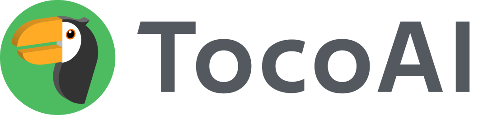

作者按：都在说Harness，问题是怎么和AI交流大家都没共识 ：）

在网易云音乐做技术管理的十年，我始终有一个观点：运维的技术路径比开发快半拍。

不是说运维技术更强，而是运维面对的问题更纯粹——对面坐着的是机器，不是业务。机器没有情绪，不会改需求，不会今天说高可用明天说先跑通再说。正因为如此，运维更早被逼着把问题想清楚：怎么描述一个系统的状态？怎么让变更可追溯？怎么让一个新人接手不靠口传心授？这些问题开发也有，只是业务的噪音把它们遮住了，让大家觉得"能跑就行"是个合理答案。

大道至简，运维走过的那条路，开发迟早要走。不是因为谁规定了，而是软件活得够久之后，那些被遮住的问题会一个一个冒出来：为什么新人上手要三个月？为什么改一个字段要开半天会？为什么 AI 生成的代码采纳率只有百分之十几？我们今天讲 Harness Engineering，提了不少听起来很新的概念——但有时候回头一看，答案也许早就写在别人的笔记本上了。

* * *

# 01

# 当 k8s 重新定义运维之后

k8s 出现之前，运维靠的是手艺。服务怎么部署、怎么扩容、故障了怎么恢复，这些东西散在每个运维的脑子里、Shell 脚本里、还有那些没人敢动的 wiki 里。人越老越是座孤岛，离职了就带走一切。这个问题 Google 碰得更早。2003 年他们内部跑着 Borg，论文里那句话我一直觉得是整件事的核心：用户用声明式配置语言向 Borg 描述任务。不是告诉它执行第一步第二步，而是告诉它我要的最终状态是什么，让机器自己负责抵达。k8s 后来把这个思路带出了 Google，变成了整个行业的基础设施语言。但这里有个问题值得停下来想想：为什么是DSL，不是程序，也不是自然语言？用程序当然可以，Pulumi、CDK 就是这么做的。但程序描述的是过程，不是状态。你写"创建一个 3 副本的 Deployment"，代码里一定会混进异常处理、顺序依赖、各种副作用。系统最后跑成什么样，得把代码在脑子里跑一遍才知道。而且程序没有静止形态，它是活的，复杂度没有边界，Review 从哪里切都不对。Google Cloud 2020 年有篇文章《Understanding Configuration as Data in Kubernetes》说得很直接：IaC 虽然被广泛采用，但有个根本缺陷——代码在开发者意图和运行时行为之间建立不了契约。意图藏在执行逻辑里，没有一个能被单独审查的表达层。用自然语言呢？问题反过来了——表达力太强，强到可以轻松说出那些荒谬性不显而易见的话。"部署一个高可用的服务"，每个人读完都点头，但副本数是几？跨几个可用区？节点挂了怎么办？歧义不报错，只在生产事故里现身。Dijkstra 1978 年说过这句话，拿到今天的 AI Prompt 工程里，还是一记响亮的耳光。DSL 站在两者中间，各取所需。像程序一样精确，模糊就是编译错误；像自然语言一样可读，不用理解执行流程就能看懂意图。更关键的是，DSL 描述的是"想要什么"，不是"怎么做到"——这是人和机器之间最干净的契约层。以 k8s 最常见的场景为例，部署一个用户服务：

  *   *   *   *   *   *   *   *   *   *   *   *   *   *   *   *   *   *   *   * 

    
    
    apiVersion: apps/v1kind: Deploymentmetadata:  name: user-servicespec:  replicas: 3                    # 我要 3 个副本  selector:    matchLabels:      app: user-service  template:    spec:      containers:      - name: user-service        image: user-service:1.2        resources:          requests:            memory: "256Mi"            cpu: "250m"          limits:            memory: "512Mi"

没有"先拉镜像再启容器再注册负载均衡"。你只是描述了终态，k8s 自己负责抵达并维持它。任何人读这份 YAML，不需要理解执行流程，就知道这个服务长什么样。k8s 的 YAML 能成为云原生的通用语言，不是因为 YAML 格式多优雅——批评它的人多了去了——而是背后那个设计决策：在正确的抽象层上，用正确的表达介质。

* * *

# 02

# Spec Coding 说对了方向，但停在了半途

后端研发，正站在十年前运维站过的那个路口。行业现在有个共识，叫Spec Coding。先写 Spec，再让 AI 生成代码；用 Spec 约束 AI 的边界；把 Spec 当需求和实现之间的桥梁。方向是对的，但大多数团队卡在了一个尴尬的地方：Spec 本身没被认真对待。今天大多数团队的 Spec，本质上是加了点结构感的自然语言。写在 Markdown 里、Notion 里、飞书里，格式挺整齐，但机器没法校验，歧义还在，跟代码之间没有任何强绑定。项目启动那天是准的，三个月后开始漂移，六个月后成了历史文献。这和 Google Cloud 批评 IaC 的问题一模一样：意图和运行时行为之间，没有契约。更根本的问题是，自然语言 Spec 没法被引擎驱动。只能喂给 AI，然后祈祷它理解正确。没法生成确定性的结构，没法校验和代码是否一致，没法在字段变更时自动追踪影响范围。AI 很擅长 Programming，写出能跑的代码。但在没有约束的情况下持续做 Software Engineering，它做不好。Google 在《Software Engineering at Google》里说的那句话我觉得是整件事的核心：一个系统真正的成本，不在写下它那一刻，而在它存活的每一天。Spec Coding 的思路是对的，但它需要一个前提：Spec本身必须是形式化的。运维领域喊了很多年"Infrastructure as Code"，真正让这口号落地的，不是更好的文档规范，是声明式 DSL——机器可解析、可校验、可驱动的表达介质。后端研发需要的，是同样意义上的一次形式化跃迁。

* * *

# 03

# DSL-SPEC：后端研发的表达归宿

同样的场景换到后端。"查询用户详情，包含所属公司信息"，这需求再普通不过。写进自然语言 Spec，每个人都读得懂；但 DTO 怎么组织、关联关系怎么处理、Converter 和 Assembler 谁来写，全靠 AI 自由发挥，也全靠 Review 兜底。用 DSL-SPEC 描述，它长这样：

  *   *   *   *   *   *   *   *   *   *   *   *   *   *   *   *   *   *   *   *   *   *   *   *   *   *   *   *   *   *   *   *   *   *   *   *   *   *   *   *   *   *   *   *   * 

    
    
    entity user {  Long   id         主键 PK  String name       姓名  Long   company_id 所属公司 FK  Date   created_at 创建时间}entity company {  Long   id       主键 PK  String name     公司名称  String location 地址}entity project {  Long   id         主键 PK  String name       项目名称  String status     状态 (ACTIVE / DONE)  Long   user_id    所属用户 FK  Date   started_at 开始时间}dto user_with_company_dto {  fromEntity: user  expandList: [    {      foreignKey: company_id      # 通过外键正向扩展      field: company      dto: company_base_dto       # 嵌入公司基本信息    },    {      foreignKey: user_id         # 反向扩展，一个用户对应多个项目      field: projects      dto: project_base_dto    }  ]}readPlan searchUserList {  return:     user_with_company_dto  pagination: true  orderBy:    created_at DESC  query:    company.name like #companyNameLike         # 按公司名模糊搜索，跨表访问无需手写 join    AND created_at >= #createdFrom             # 注册时间范围    AND created_at <= #createdTo    AND projects contains (status == 'ACTIVE') # 至少参与一个进行中的项目  filter projects:                             # 返回的项目列表只保留进行中的    status == 'ACTIVE'}

不需要写 Converter、DataAssembler、Manager 接口、SQL 关联查询。只是描述了数据的意图——我要一个用户 DTO，嵌套公司信息，通过 company\_id 关联。引擎自己生成所有结构性代码。两者的设计哲学，是同一枚硬币：  
| k8s YAML| TocoAI DSL-SPEC  
---|---|---  
描述的是| 服务的终态| 数据结构的意图  
机器做的是| 调度、维持状态| 生成结构性代码  
人不需要关心| 如何部署、扩容| 如何写 Converter、Assembler  
歧义处理| 格式错误即报错| 结构冲突即校验失败  
变更成本| 改 replicas 值，其余不动| 改一个字段，级联自动更新  
太阳底下没有新鲜事。UML 当年想做的事，本质上和这个是一回事——对业务的高程度抽象。它的思路没问题，但那个时代的环境不支持它落地：没有 AI，抽象和代码之间的鸿沟还得靠人填；需求一变，大家先改代码，UML 就落后了。就像 2005 年你想做个性化歌单，没有机器学习协同过滤，歌单只会比榜单传播效率更差。不是想法不对，是环境没到。AI 时代到来，让这件事第一次真正有了落地的土壤。我们不过是在用 AI-native 的方式，重新做一遍 UML 想做但没做成的事。DSL-SPEC 不是另一种需求文档，也不是 prompt 模板。它是系统唯一的真相来源——人类可读，机器可解析，引擎可驱动。Spec和代码的关系，永远是=，不是≈。

* * *

# 04

# 能 DSL 化的，就尽量 DSL 化

当然，研发没有运维那么纯粹。不是所有东西都能 DSL 化。强行 DSL 化的尽头，是造出另一门编程语言，那就走回头路了。但在能 DSL 化的部分，就应该尽量 DSL 化。我深深认为，以后的 Spec Coding 一定是这样一个结构：DSL-Spec 为骨骼，NLP-Spec 为血肉。骨骼决定系统不会塌，血肉负责填满那些只能意会的业务细节。两者各归其位，才是真正的系统维护之道。运维同学花了十年才等来 k8s。我们不用等那么久了。

* * *

  

TocoAI是行业内首款将AI技术与软件工程思想完美结合的工具，创始人为前网易云音乐CTO曹偲。

关注 TocoAI 公众号，回复Github，获取TocoAI Github地址了解更多详情。