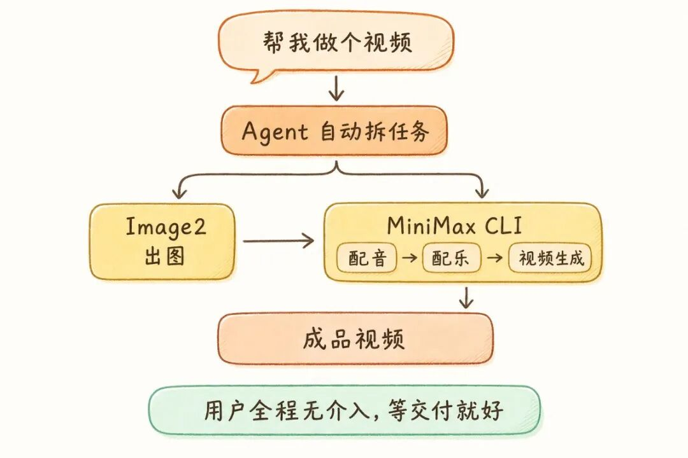
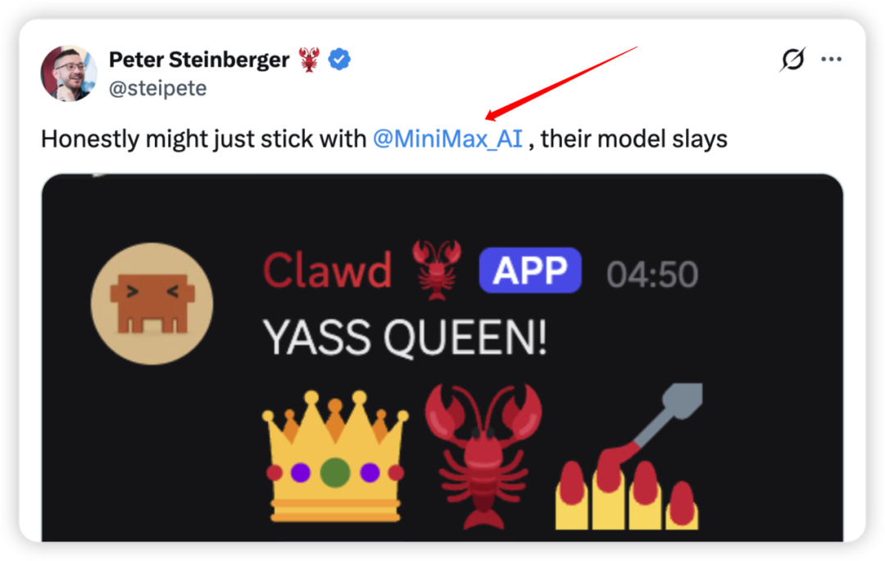
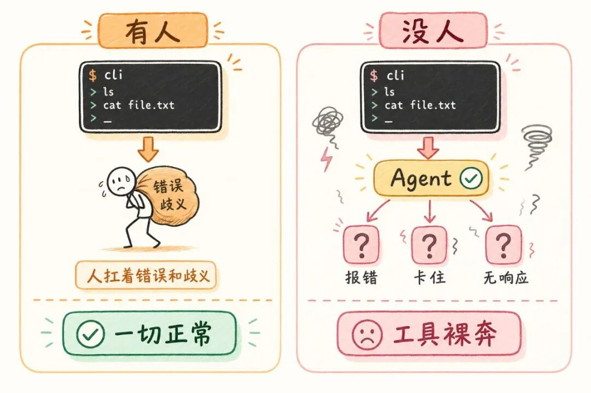
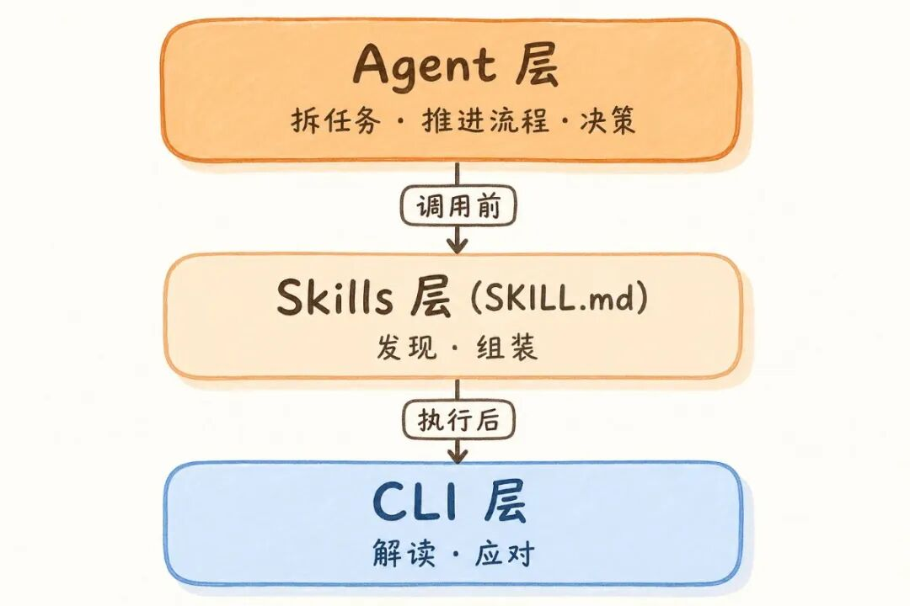
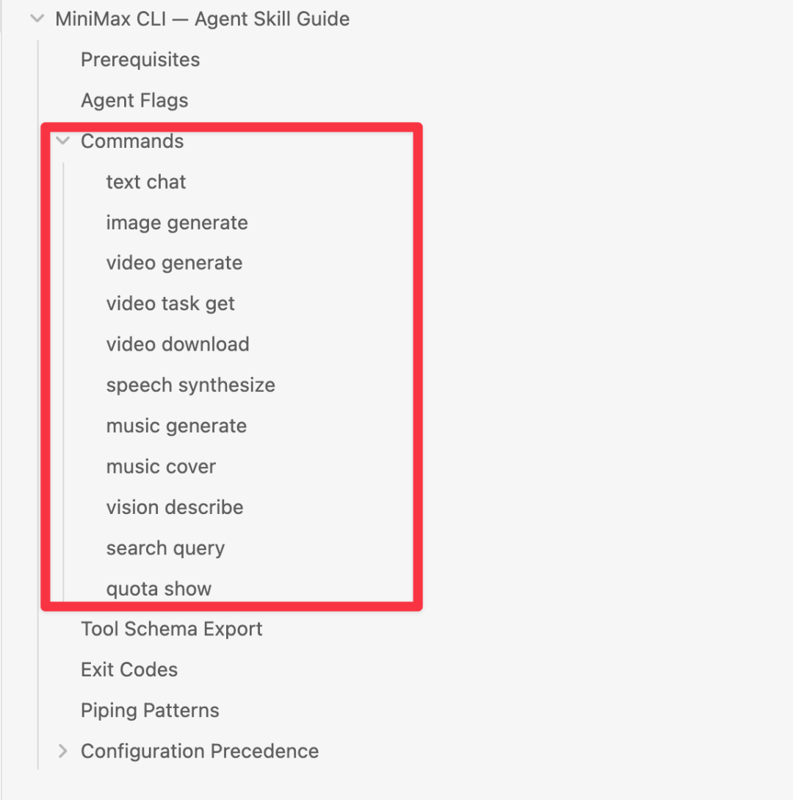
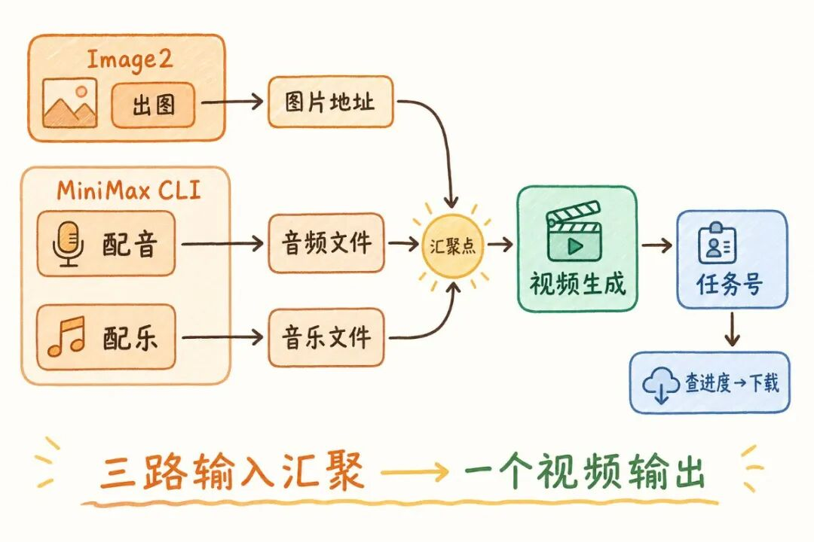
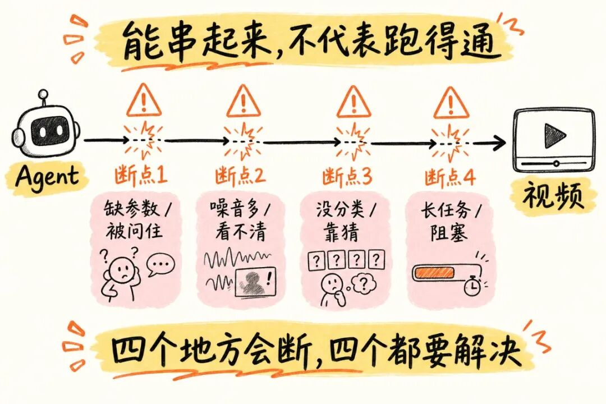
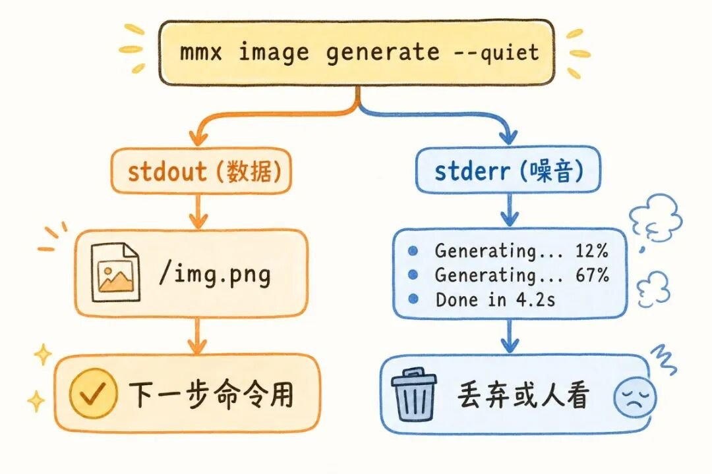
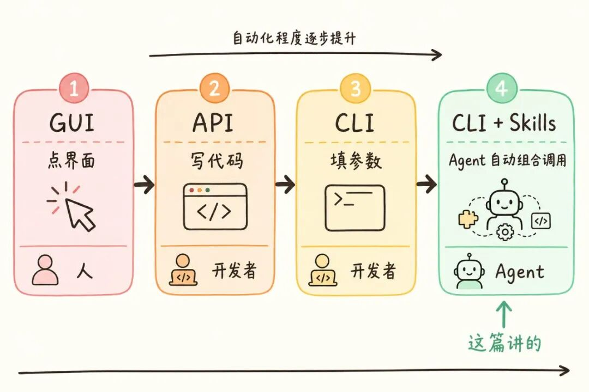

我发了一句话：“帮我做个视频”  
Agent 自己拆任务  
调 Image2 出图  
调 MiniMax CLI 配音、配乐、把图变成视频  
把结果取回来。

MiniMax CLI 跑的那段  
自动化程度非常高  
中间没有停顿、没有报错、没有问我问题  
等它交付成品就好  
基本不用介入。

  

MiniMax 的模型一直很强  
OpenClaw 和 Hermes 都推荐使用  
@steipete 说"their model slays"

体验了他们的CLI  
发现他们的 Agent 基建搭建，同样是国产第一梯队  
值得拆解一遍。

# Agent 是怎么做到的

MiniMax CLI 是怎么让 Agent 做到的？

在讨论这个问题之前  
先看一个容易忽略的事

以前人用 CLI 的时候，其实替工具做了四件事：

  * **发现** ——搜文档，找到该用哪个工具、哪条命令

  * **组装** ——凭经验填对参数，把命令串起来

  * **解读** ——从终端输出里过滤噪音，读懂报错

  * **应对** ——回答执行中弹出的提问，等长任务跑完

以前这不是问题——用工具的是人，这四件事人天然就会。

但现在用工具的变成了 Agent  
发现、组装、解读、应对  
人做的这四件事，没人教它怎么做。

**人是工具的容错层。拿掉人，工具必须自己容错。**

CLI 本身只管执行——文本、图片、视频、语音、音乐、看图、搜索，每项一条命令  
它把调用门槛从写代码降成了填参数：

  * 网页端：人点

  * API：Agent 先写一段连接代码

  * CLI：Agent 直接填参数

但光有 CLI 不够  
CLI 是给人设计的——人知道该调哪条命令、参数怎么填、结果怎么接  
直接把 CLI 扔给 Agent，它用不起来。

后来去看它的文档  
我发现 MiniMax 没有直接把 CLI 交给 Agent  
它在 CLI 和 Agent 之间加了一层——一份叫 SKILL.md 的说明书  
把人做的那些隐性工作翻译成 Agent 能理解的规则：

# Agent 怎么找到每一步的命令

人做的四件事里的前两件——**发现** 和**组装** ——全写在 SKILL.md 里。

Agent 不是直接调 CLI  
它先读 SKILL.md  
从里面知道该用什么命令、参数怎么填、结果长什么样  
然后才去调 CLI

**首先，Agent 怎么知道该用这个工具。**

Agent 的工具箱里有很多工具  
你说"帮我做一个短视频"  
它怎么知道该用 mmx-cli？

答案在 SKILL.md 的第一行——工具简介里写了"当用户想生成文本、图片、视频、语音、音乐时，使用 mmx"  
Agent 读到这句  
就把 mmx-cli 从工具箱里拿出来了。

人可以搜文档、问同事、试错  
Agent 不行  
如果工具没有在第一屏告诉 Agent “我能做什么”  
Agent 就不知道这个工具存在。

**然后，它要知道该用哪条命令。**

Agent 决定用 mmx-cli 以后  
你要它生成配音  
用 `speech synthesize` 还是 `text chat`？

SKILL.md 的 Commands 把能力逐项列出来了：

一张摊开的能力地图——Agent 看一眼就知道哪个命令做哪件事，不需要猜。

**接下来，参数怎么填。**

选好命令以后  
SKILL.md 里每条命令都用固定格式写：能力说明 → 命令句式 → 参数 → 例子 → 返回结果。

比如生成配音：
    
    
    mmx speech synthesize --text "*****" --output json --quiet  
    # → audio file path

> 意思是：用 mmx 生成语音，文本填在 text 后面，结果以 JSON 格式返回

视频生成、音乐生成也是同样的格式。Agent 不需要从零拼命令：

  * 能力说明告诉它"能做什么"

  * 命令句式告诉它"怎么调用"

  * 例子告诉它"完整调用长什么样"

  * 返回结果告诉它"下一步能拿到什么"

**最后，这些命令能串成链。**

每一步的输出是下一步的输入：

Agent 能串起来，因为 Skills 告诉它每一步会返回什么：

  * Image2 返回图片地址

  * speech synthesize 返回音频文件

  * video generate 接收图片 + 音频，返回任务号

一步的输出就是下一步的输入。跨工具也能串成链。

# 这条链为什么没卡住

调用的问题 SKILL.md 解决了  
但执行之后呢？

人做的四件事里还有后两件——**解读** 和**应对**  
过滤噪音、读懂报错、回答提问、等长任务跑完  
这些 SKILL.md 管不了  
得靠 CLI 本身的设计来接。

能串起来，不代表跑得通  
四个会断的地方。

## 缺参数会被问住

Agent 发出 `mmx video generate` 命令  
如果 CLI 运行到一半问"Choose aspect ratio: 1\) 16:9 2\) 1:1"（选一个画面比例）  
Agent 就卡了——它发的是一次完整命令调用，中间不答题。

人看到提示会输入选项  
Agent 不会  
它只会停在"我发出的命令还没有结束"。

mmx-cli 的做法：`--non-interactive` 缺参数直接失败，`--yes` 跳过确认。

把"等人补充信息"的交互  
变成"成功或失败"的状态  
Agent 不需要回答终端问题  
只需要根据状态决定下一步。

## 终端噪音太多

Agent 调用 speech synthesize 以后  
终端可能输出进度条、提示语、耗时统计、报错信息、最终文件路径  
人能自己跳过噪音找结果  
Agent 不行。

而且 Agent 的上下文是有成本的  
终端输出越长，消耗的 token 越多  
如果把进度、提示、耗时都塞进上下文  
很快就被无关信息占掉了。

mmx-cli 的做法：把输出分成两路——结果走一路，进度和提示走另一路  
就像快递分拣，包裹走传送带，广告单走垃圾桶  
`--quiet` 去掉装饰  
`--output json` 返回机器可读结果  
Agent 只看结果那一路，拿到路径，交给下一步。

结果不是给人复制的，而是直接给下一步命令使用的：
    
    
    AUDIO=$(mmx speech synthesize --text "一段旁白" --quiet)  
    mmx video generate --image "sunset.png" --audio "$AUDIO" --quiet  
    

> 第一行生成配音，把返回的音频路径存起来；第二行把音频和图片一起交给视频生成命令

## 失败了没有分类

如果 video generate 失败了  
Agent 看到一段英文报错：“authentication failed”（认证失败）  
人能读懂  
但 Agent 不应该靠理解一段英文来判断下一步。

mmx-cli 的做法是退出码：
    
    
    0  成功      2 参数错    3 认证错  
    4  额度不足  5 超时     10 内容安全  
    

> 每种失败对应一个数字，Agent 看数字就知道该怎么处理，不用读英文报错

失败从"读一段自由文本"  
变成"看一个标准状态"  
Agent 先看数字做一级判断：是参数错就补参数，是认证错就提示用户，是额度不足就换策略。

不靠一段报错文字自己联想原因。

## 视频没生成完

这是任务链里最容易卡住的一步  
视频生成需要几分钟  
如果 CLI 一直等到完成，整条链就停了。

mmx-cli 的做法是 `--async`：
    
    
    mmx video generate --async --quiet       → taskId  
    mmx video task get --task-id <id>        → Processing / Success  
    mmx video download --file-id <id>        → preview.mp4  
    

> 三步：发起视频生成拿到任务号 → 用任务号查进度 → 完成后下载视频文件

视频任务不是"等在终端前"  
而是变成"拿到任务号，后面继续查和取"  
task id 把长任务变成可管理对象：先发起，再查询，最后下载。

**面向 Agent 的 CLI，不是把终端变好看。是把终端变成接口。**

你可能会问：这个 SKILL.md 谁来写？  
答案是 MiniMax 官方维护的，随 CLI 一起发布  
你不需要自己写说明书  
装好 mmx-cli，Agent 就能读到它。

# 以后怎么看一个工具行不行

MiniMax CLI 是一个案例  
但"人是容错层"这件事是通用的——以后看一个工具适不适合 Agent  
就看人做的那些隐性工作  
有没有真正被工具自己替代：
    
    
    调用前（Skills 层）  
      发现：Agent 能不能找到该用什么工具、什么命令  
      组装：能不能知道参数怎么填、命令怎么串  
      
    执行后（CLI 层）  
      解读：结果干不干净、失败分不分类  
      应对：会不会中途问人、长任务能不能继续  
    

三句话：Agent 拆任务。Skills 教调用。CLI 不中断、低 token、标准化交结果。

MiniMax CLI 不是取代 Agent  
它是 Agent 的多模态执行层。  
下次让 Agent 用一个工具，先看一眼：**它有 Skills 吗？**