随着客户端平台向更轻薄、更节能的方向演进，系统构建者越来越关注所有组件（包括存储）的可预测功耗。2025年8月，NVM Express组织在NVMe 2.3基础规范中正式引入了一项革命性的电源管理特性——NVMe Power Limit Config。这一特性赋予主机对设备行为更精确的引导能力，确保性能目标与平台功耗预算保持一致。

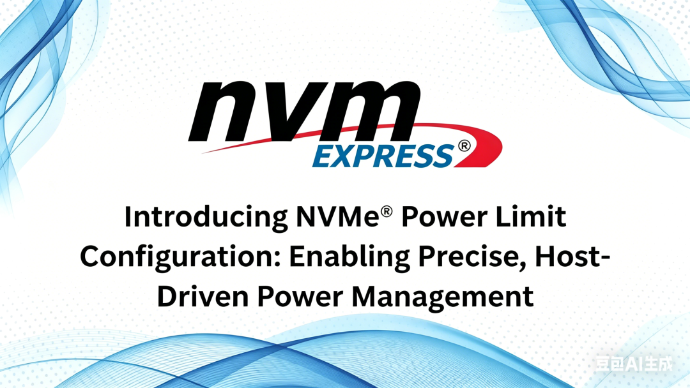

## 1\. 传统NVMe电源管理的局限性

在深入了解Power Limit Config之前，我们需要先回顾一下传统NVMe电源管理的工作方式及其存在的根本缺陷。

  

传统NVMe设备会发布一组预定义的电源状态（Power States, PS），每个状态都有一个关联的最大功耗值（以瓦特为单位）。例如，一个典型的消费级NVMe SSD可能会提供以下电源状态：

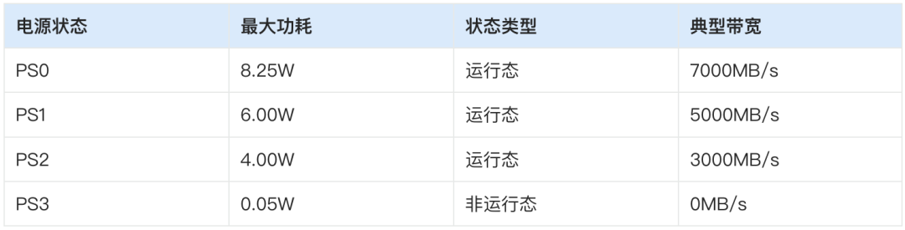

主机通过`Set Features`命令来切换设备的电源状态。此外，NVMe还支持自主电源状态转换（APST），允许设备在空闲一段时间后自动进入更低功耗的状态。

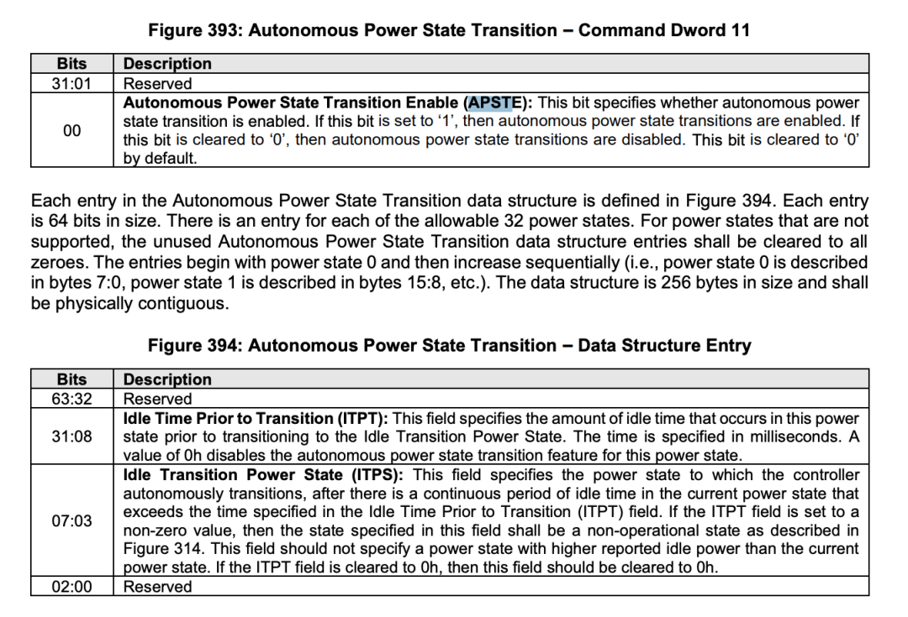

尽管这种机制在操作系统完全运行后工作得相当不错，但它存在几个无法忽视的严重问题：

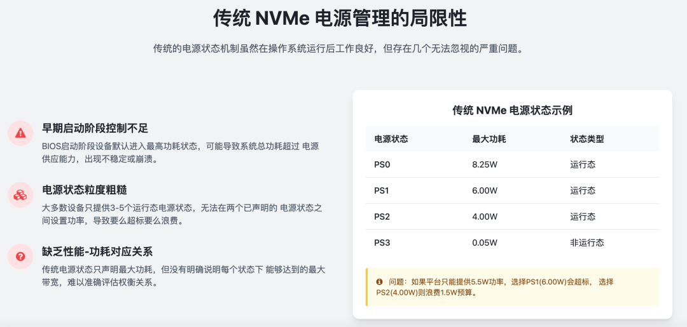

当系统条件发生变化时（如电池电量低、温度过高），传统机制只能在预定义的电源状态之间切换，无法实现平滑的功率调整。

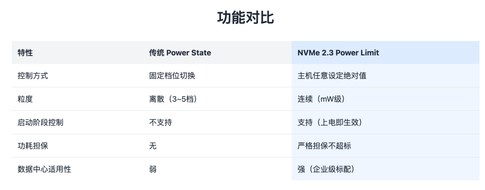

## 2\. NVMe Power Limit 功能核心原理

NVMe Power Limit 是 NVMe 规范中定义的精细化电源管理特性，允许主机通过标准协议命令动态设置 NVMe 控制器的最大功耗上限。控制器会根据设定的功耗阈值，自动调整硬件性能参数和工作负载调度，在不超过功耗预算的前提下最大化 I/O 性能。

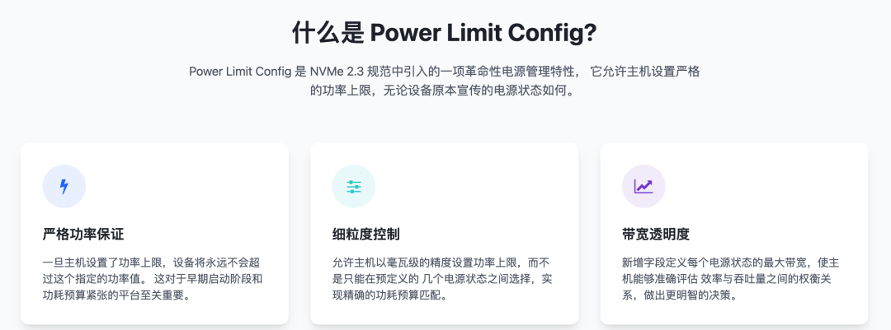

Power Limit 功能通过 NVMe 的Power Management Feature（Feature Identifier: 02h）实现：

  * 主机通过`Set Features`命令向控制器发送功耗上限值（单位：毫瓦）

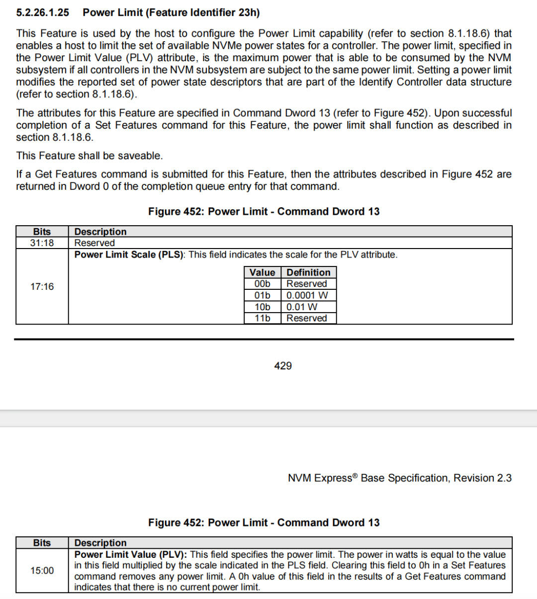

  * 控制器通过`Get Features`命令向主机报告当前实际功耗和支持的功耗范围
  * 支持多级功耗限制（通常分为 PL1、PL2、PL3 等不同持续时间的阈值）
  * 与 Host Controlled Thermal Management（HCTM）功能协同工作，温度过高时自动触发功耗限制

  

当实际功耗接近或超过设定的 Power Limit 阈值时，控制器会按以下优先级执行调节：

  * 后台任务限流：降低垃圾回收、磨损均衡等后台操作的优先级和执行速度
  * 动态调频调压 \(DVFS\)：降低 CPU 核心和 NAND 接口的工作频率与电压
  * I/O 队列深度限制：限制主机提交的 I/O 命令队列深度
  * NAND 电源门控：关闭部分空闲的 NAND 闪存通道和芯片
  * 紧急降频：当功耗严重超标时，强制进入低功耗电源状态

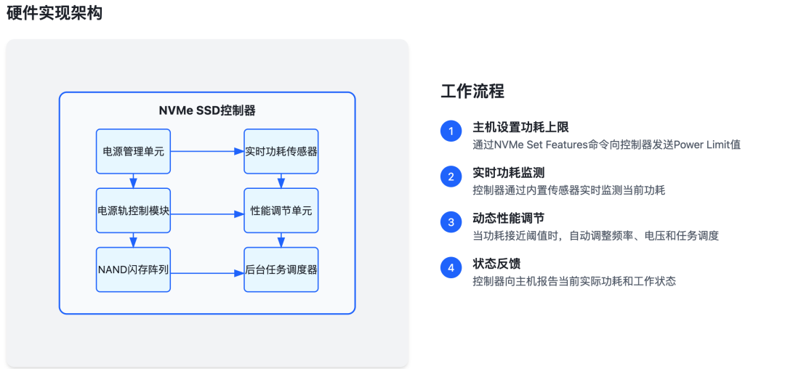

Power Limit 与 NVMe 的 32 个电源状态 \(PS0-PS31\) 协同工作：

  * 每个电源状态都有对应的最大功耗和性能参数
  * Power Limit 设置会覆盖电源状态的默认最大功耗
  * 控制器会根据当前功耗自动在不同电源状态之间切换
  * 支持非操作电源状态的功耗限制，进一步降低空闲功耗

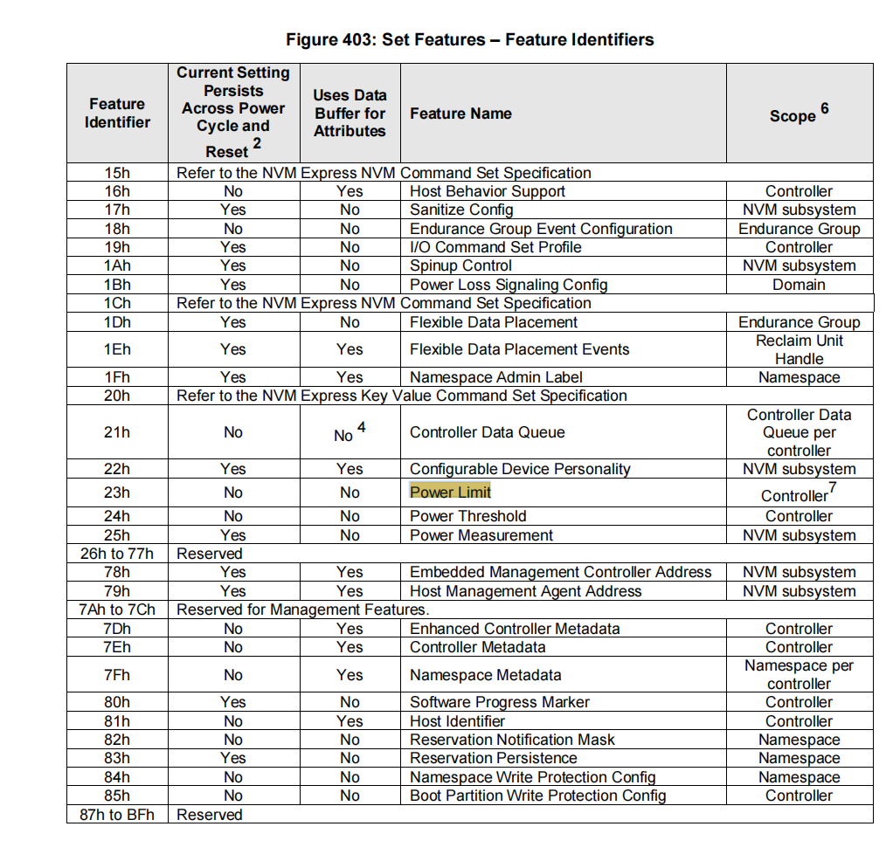

规范强制要求：如果控制器支持Power Limit，那么它必须支持从Minimum到Maximum之间的所有整数值，不能有任何间隙。

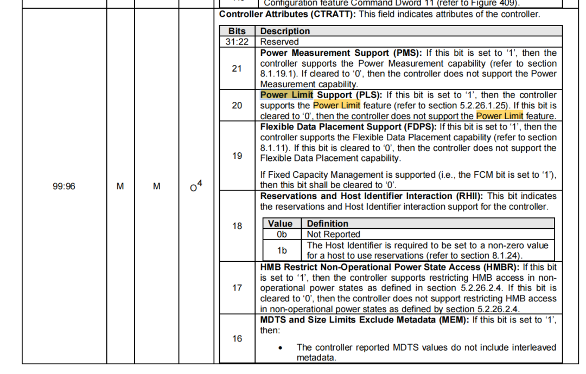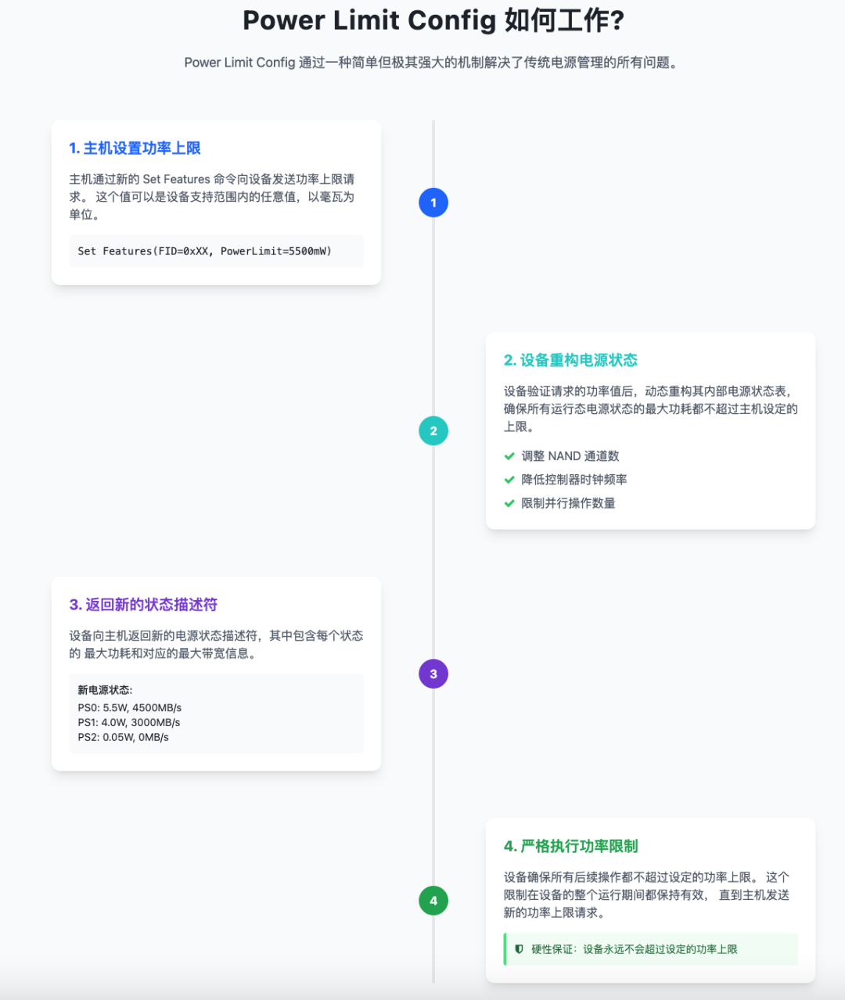

## 3\. 应用场景分析

虽然Power Limit Config对所有类型的NVMe设备都有价值，但以下几个场景受益最为显著：

（1）轻薄笔记本电脑

这是Power Limit Config最重要的应用场景。轻薄本通常具有非常严格的热和电气约束：

  * 电池供电时功率预算有限
  * 散热系统能力有限
  * 对启动稳定性要求高  

  

Power Limit Config允许笔记本电脑：

  * 从设备上电的那一刻起就强制执行功率限制
  * 在电池电量低时临时降低SSD功耗以延长续航
  * 防止SSD在高负载时过热影响其他组件

  

（2）紧凑型系统与嵌入式设备

紧凑型台式机、迷你PC和嵌入式设备通常也有严格的功耗和散热限制。Power Limit Config允许这些系统使用高性能NVMe SSD，同时确保不会超过系统的设计限制。

  

（3）旧系统升级

许多较旧的系统（特别是笔记本电脑）的PCIe插槽设计功率较低，无法支持最新的高性能NVMe SSD。Power Limit Config允许这些旧系统通过降低SSD的功率上限来兼容新的存储设备，而不会出现稳定性问题。

  

（4）数据中心与边缘计算

在数据中心和边缘计算环境中，Power Limit Config可以帮助：

  * 更精确地管理机架级功耗
  * 在电力受限的边缘位置部署更多存储设备
  * 实现更精细的能源管理和成本控制

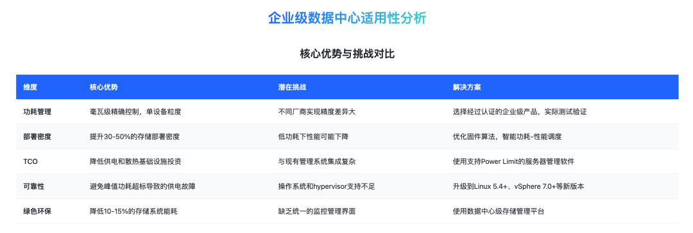

小编基于AI设计了一个模拟评估器，可以清晰对比不同功耗对比下性能/延迟/能耗比信息，对选型评估具有非常大的参考意义：

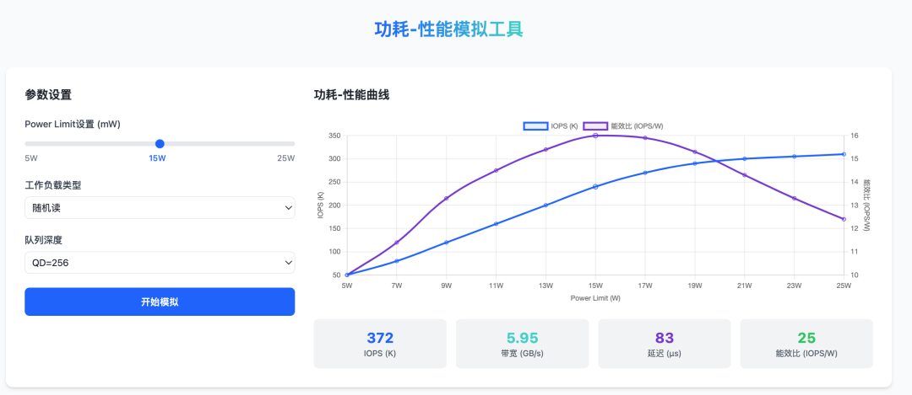

Power Limit 不是是软件限速，它是纯硬件电路级的强制约束，固件只是配置参数，运行时完全不参与控制环路。同时，它不是限制平均功耗，而是能限制10μs级的瞬时峰值功耗，规范强制要求"任何时刻都不能超过"。这是Power Limit最核心、最不为人知的部分，也是它能做到微秒级响应的根本原因。

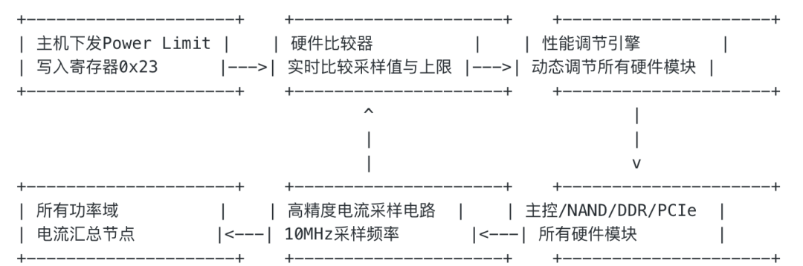

与Thermal Throttling不是是一回事，Power Limit 优先级远高于温控，且是主动预防而非事后补救

## 4\. 与PCIe规范的交互与兼容性

Power Limit 与 PCIe Base Specification 中的 Slot Power Limit 机制协同工作：

  * PCIe Slot Power Limit 是主板侧的限制
  * NVMe Power Limit 是SSD侧的限制
  * 主机应该将NVMe Power Limit 设置为不超过PCIe Slot Power Limit

  

关于热插拔支持场景：

  * Power Limit 配置在热插拔过程中会保留
  * 当SSD被热拔出再插入时，会自动恢复之前的Power Limit设置
  * 这是NVMe 2.3新增的重要特性

  

上电时序与枚举阶段控制，这是Power Limit最革命性的特性：

  1. SSD上电 → 进入默认PS0状态
  2. PCIe枚举完成（<100ms）
  3. 主机立即下发Set Features 0x23命令
  4. Power Limit 在<1ms内生效
  5. 此时SSD还没有完成初始化，也没有加载任何驱动

  

关键优势：

  * 彻底解决了传统Power State无法控制启动阶段功耗的问题
  * 避免了多盘同时上电时的电流浪涌
  * 这是数据中心高密度部署的必要条件

  

Power Limit 是NVMe历史上第一个真正意义上的"硬实时"电源管理系统。它通过纯硬件的闭环负反馈控制，实现了微秒级的功耗响应和毫瓦级的控制精度，从根本上解决了数据中心和边缘计算中SSD功耗不可控的问题。

  

  
  
  

  

如您有任何的建议与指正，敬请在文章底部留言，感谢您不吝指教！如有相关合作意向，请后台私信，小编会尽快给您取得联系，谢谢！

  

**  
**

**《存储随笔》自媒体矩阵**  

  

