[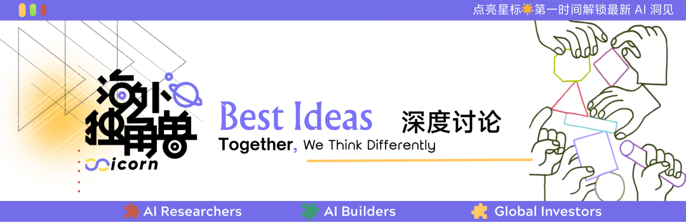](https://mp.weixin.qq.com/mp/appmsgalbum?__biz=Mzg2OTY0MDk0NQ==&action=getalbum&album_id=4157672299245862924&scene=21#wechat_redirect)

  

作者：Daniel

编辑：Cage

  

  

过去一年，我们见证了 AI 对软件工程的颠覆。Claude Code、Codex 等工具已经成为了每个程序员标配，不少人一年前可能 80%的代码还是亲自去写，但一年后的今天这个数字小于 1%。下一个被 AI 颠覆的环节，似乎就是运维。

  

但在现实里，运维侧的 AI 变革节奏远不及开发侧。代码是中间态产物，提效后可以大量产出测试功能用于实验；而 SRE 直接面对生产环境与客户价值，任何失误的成本极高。这一本质差异使得 AI SRE 的渗透速度受到极大的约束：当前产品普遍从排障切入，如果要延伸至生产变更与自动上线，可能还需要相当长的时间积累信任。

  

许多客户目前仍处于“表现出兴趣”而非真正大规模部署的阶段。目前市面上所有的 agent 都只做只读的假设验证，不做任何写操作。毕竟写操作在生产环节中极为危险，大公司的系统一旦崩溃，每秒损失都是天然数字。

  

当前市场上，AI SRE 产品形态主要分化为两条路线。

  

**•** 巨头 Datadog 为代表的“全家桶”模式：类似苹果生态的强耦合设计：内部上下文完整、场景覆盖深，但定价高昂（Bits AI 的归因分析功能处理 5 个告警约需 30 美元）。运维市场天然分散，客户几乎不可能将所有工具链集中采购自单一厂商。

  

**•** AI Native startup 中以 Resolve 和 Traversal 为代表的“开放集成”模式：他们自身不提供底座，适配多云与混合云环境，这类型公司虽然更 AI Native，但极度依赖对接质量，通常需要供应商深度介入才能真正跑通。

  

海外独角兽之前研究过 [Traversal ](https://mp.weixin.qq.com/s?__biz=Mzg2OTY0MDk0NQ==&mid=2247521186&idx=1&sn=c0809db8532570a2e64ca39abd353cff&scene=21#wechat_redirect)。相比之下，Resolve 选择的技术路径是更为务实和落地的。创始团队是经验丰富的创业老兵。创建了 OpenTelemetry 这个 CNCF 里活跃度第二高的项目。

  

Resolve AI 在从 stealth 以来仅 16 个月，获得超过 1.5 亿融资，估值达 10 亿美元。天使投资人名单包括 Jeff Dean、Fei-Fei Li 等。

  

  

  

  

  

**01.**  

  

**产品拆解：环境记忆 × Multi-Agent**

  

Resolve 专注于“AI for Prod”（生产环境 AI），让 AI 像资深 SRE 工程师一样理解、调查和解决生产问题。核心机制是环境上下文积累：系统持续学习客户的生产环境（服务拓扑、历史事故、部署记录），在调查时将这些记忆注入给 agent，让它“认识”这套系统，进而产生数据飞轮。

  

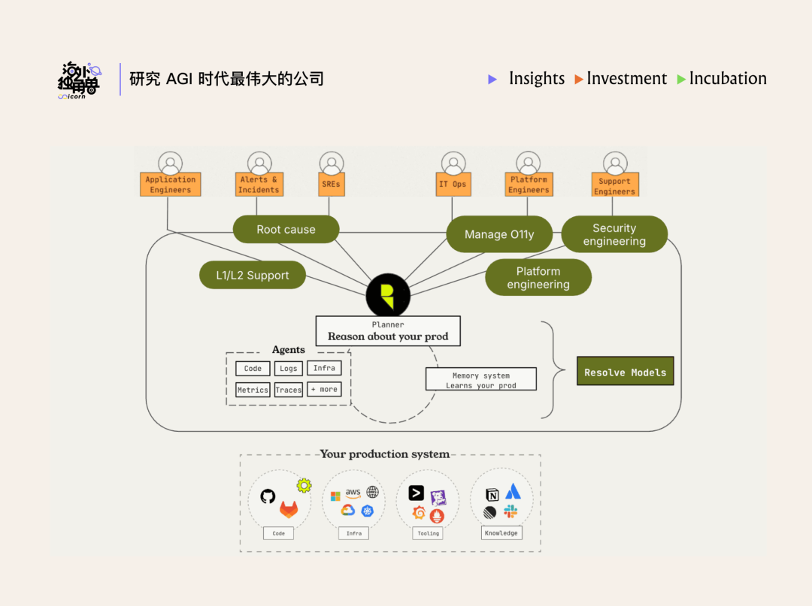

  

一个中央记忆系统 + 多个并行专职 agent + 广泛的工具集成。

  

**•** Knowledge Agent 负责搜索结构化知识：Runbook、历史事故记录、团队文档、Slack 历史消息。对应底部集成的工具是 PagerDuty、Azure DevOps、Slack、Notion。这个 agent 回答的问题是“我们之前遇到过类似的问题吗？当时怎么处理的？”

  

**•** Telemetry Agent 负责可观测性数据：日志、指标、trace。对应底部集成的工具是 Grafana、Datadog（图标可识别）、以及其他 APM 工具。这个 agent 回答的问题是“现在的指标异常在哪里？日志里有什么报错？trace 显示哪个调用链断了？”

  

**•** Code Agent 负责代码仓库：最近的 commit、PR、代码变更历史。对应底部集成的是 GitHub 和 GitLab。这个 agent 回答的问题是“最近有没有相关的代码变更？是哪个 commit 引入了这个问题？”

  

**•** Infra Agent 负责基础设施状态：DNS、AWS、Azure、GCP 等云平台的资源状态、配置变更。这个 agent 回答的问题是“基础设施层面有没有异常？是否有配置变更、扩缩容操作、网络问题？”

  

官网上列出了五个 demo 应用场景，具体拆分来看：

  

场景一：Kafka 健康检查

  

**•** Resolve AI 读取代码库后，自动绘制出覆盖 Go、C\#、Kotlin 三种语言的服务架构图，接着查询 metrics，找到 checkout 服务 P99 延迟高达 15 秒、单节点上跑了 78 个 Pod 远超上限，并用红黄绿三色标注各组件的健康状态。

  

**•** 传统做法：是工程师手动查 k8s dashboard、翻 deployment YAML、跑 kubectl 命令，再在文档里手工维护一张很快就会过时的架构图：发现问题全靠经验和巡检频率。

  

**•** 核心区别：从“人去找问题”变成了“问题被自动发现”，架构图永远是最新的，关联分析也不再依赖个人记忆。

  

场景二：限流设计

  

**•** Resolve AI 先读取实际流量数据：3848 次请求、各端点的占比分布。再读代码，发现 checkout 一次调用会触发 11 个下游服务、Kafka 存在 4 到 6 秒的延迟，最终给出量身定制的三档限流配置，每一个数字都有明确的数据来源。

  

**•** 传统做法：架构师凭经验拍一个数字，或者参考通用最佳实践文档，再拉会讨论，结果往往与系统实际特征脱节，需要多轮调整。

  

**•** 核心区别：AI 建议基于真实数据，而不是通用模板。

  

场景三：成本优化

  

**•** Resolve AI 读取 k8s 节点配置后，发现 m7g.xlarge 实例上跑了 78 个 Pod，而该节点的合理上限是 58 个，随即按 AWS 实际定价逐项计算出月度节省金额，输出一张带优先级的表格。

  

**•** 传统做法：需要 Cloud FinOps 工程师定期导出账单、对照 CloudWatch 指标、在 Excel 里手动估算，发现问题有明显滞后，且高度依赖专职角色。

  

**•** 核心区别：技术判断能被翻译成了财务语言：不再是一个个运维告警，而是每月的具体损失。

  

场景四：事故响应

  

**•** 从告警触发开始，Resolve AI 同时展开五条并行调查线：指标、链路追踪、日志、代码和基础设施，最终定位到 ValkeyCartStore 中同步锁叠加 30 次指数退避的代码缺陷，给出完整证据链，全程自主完成。

  

**•** 传统做法： on-call 工程师被叫醒后，逐一登录不同系统、手动翻日志、拉群讨论，MTTR 通常在 30 分钟到数小时之间，高度依赖个人经验。

  

**•** 核心区别：AI 能比人工排查更早发现时序因果关系。

  

场景五：自动生成 PR

  

**•** Resolve AI 发现 perOrgScheduleJob 在 3 小时内产生了 2706 条无用的 INFO 日志，定位到两行代码，随即生成完整的 diff、commit message 和 PR 描述，并注明影响范围。

  

**•** 传统做法：通常被丢进 backlog 后再无人问津；即使有人愿意做，也需要找到文件、理解上下文、写改动、写说明，每项耗时 20 到 30 分钟。

  

**•** 核心区别：AI 把大量传统人工不愿意去做的事情自动完成，工程师只需要 review 和点 merge。

  

我们可以发现，它的工作具有以下特点：

  

**•** 把系统“读”进来，而不是靠记忆

  

每次对话时，Resolve 会先把客户的代码库、deployment YAML、历史日志、Runbook 等资料索引成一个动态知识图谱。这相当于让一个新工程师提前把所有文档都读完。

  

**•** 多个专职 Agent 同时干活

  

遇到问题时，它不是一个 Agent 排队查完再查下一个，而是多个 Agent 同时出发：Code Agent 去看代码变更，Telemetry Agent 去查指标和链路，Knowledge Agent 去翻历史 Runbook 和 Slack 记录，Infra Agent 去查 AWS/k8s 配置。这种并行能力需要完整的 Agent 编排系统，规划器决定调查策略，专门化 Sub-Agent 执行各自的调查任务，最后汇总推理。这个编排层能力是 Resolve AI 的核心工程壁垒。

  

**•** 像经验丰富的工程师一样对原因进行打分排名

  

它不是找到第一个可疑原因就停下来，而是同时维护多个假设，给每个假设打置信度分数，用新证据持续更新排名，最终锁定最高置信度的那个。这和有经验的工程师排查思路一样，只是快很多。

  

**•** 数据飞轮：用得越久越准

  

每次调查结束后，系统会把这次事故的根因、修复方式、涉及的服务关系写回 Resolve.md。下次遇到类似问题，它能直接调用这段历史记忆，这意味着用了半年的 Resolve 和刚上线的 Resolve，能力差距很大。这也是它最重要的护城河：替换它的成本随使用时间线性增加。

  

**•** 读操作全自主，写操作留给人审批

  

查日志、查代码、查 metrics，完全自主执行，不需要人批准。但生成 PR、执行回滚、重启服务，必须人工确认才能执行。这个设计让它在高风险操作上不会“误伤”，同时又能把大量的读取分析工作完全自动化掉。

  

  

  

**02.**  

  

**持续学习生产环境的 Proactive Agent**

  

在任何事故发生之前，Resolve 就已经在工作了。系统通过 Satellite Component（一个部署在客户数据中心内部的本地节点）持续读取生产环境的实时状态，服务拓扑、依赖关系、部署历史、配置变更、历史事故记录。这些信息被自动抽象成一份"Resolve.md"的动态知识文档，由系统自动维护更新，不需要工程师手动编写。

  

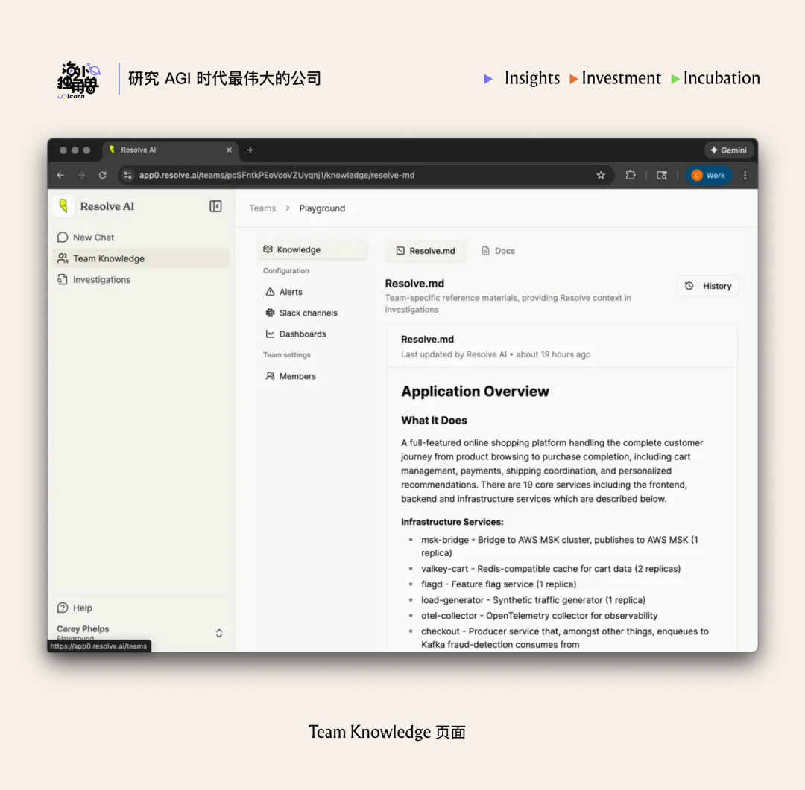

  

比如这个页面详细记录了该客户所有 19 个核心服务的功能、副本数量和依赖关系，最近一次更新由 Resolve AI 在 19 小时前自动完成。这份文档是系统调查的“记忆基础”，每次事故处理完毕，新的经验会被写回文档，下次遇到类似问题时调查起点就更高。

  

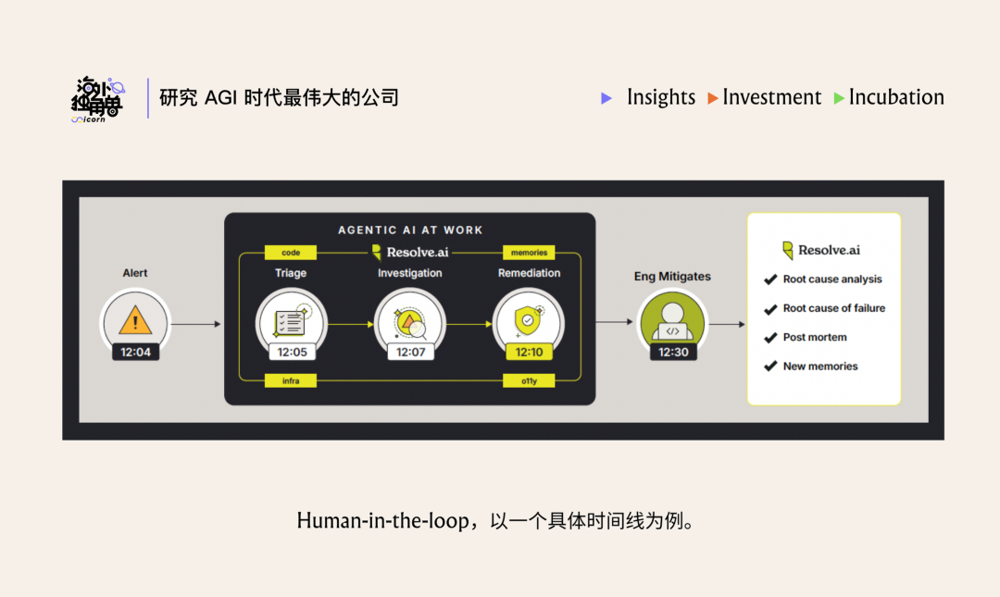

  

**•** 12：04 一条告警触发，系统立刻自主启动，无需叫醒工程师

  

**•** 12：05 完成分诊（判断告警真实性、定位涉及的服务和数据范围）

  

**•** 12：07 完成跨代码、基础设施、日志、指标四个数据源的并行调查（同时生成多个假设并按置信度排序，锁定根因）

  

**•** 12：10 输出完整的调查报告和具体修复方案，这时候工程师才第一次介入，拿到的不是一堆原始日志，而是“根因是什么、证据在哪、建议怎么修”的完整结论，直接做判断和执行，

  

**•** 12：30 处置完毕。整个过程中系统自主完成了最耗时的 6 分钟调查，工程师只需要花 20 分钟做最终决策，事后复盘报告也由系统自动生成。

  

这里的实现方式更符合现实生产环境中的现况：

  

**•** 生产系统的写操作风险极高，一个错误的自动回滚可能造成更大的故障，所以保留人工审批是必要的安全边界；

  

**•** 这也是现阶段 enterprise 客户真正愿意采购的方案，完全自主执行的 AI 在生产环境还没有被大规模信任。

  

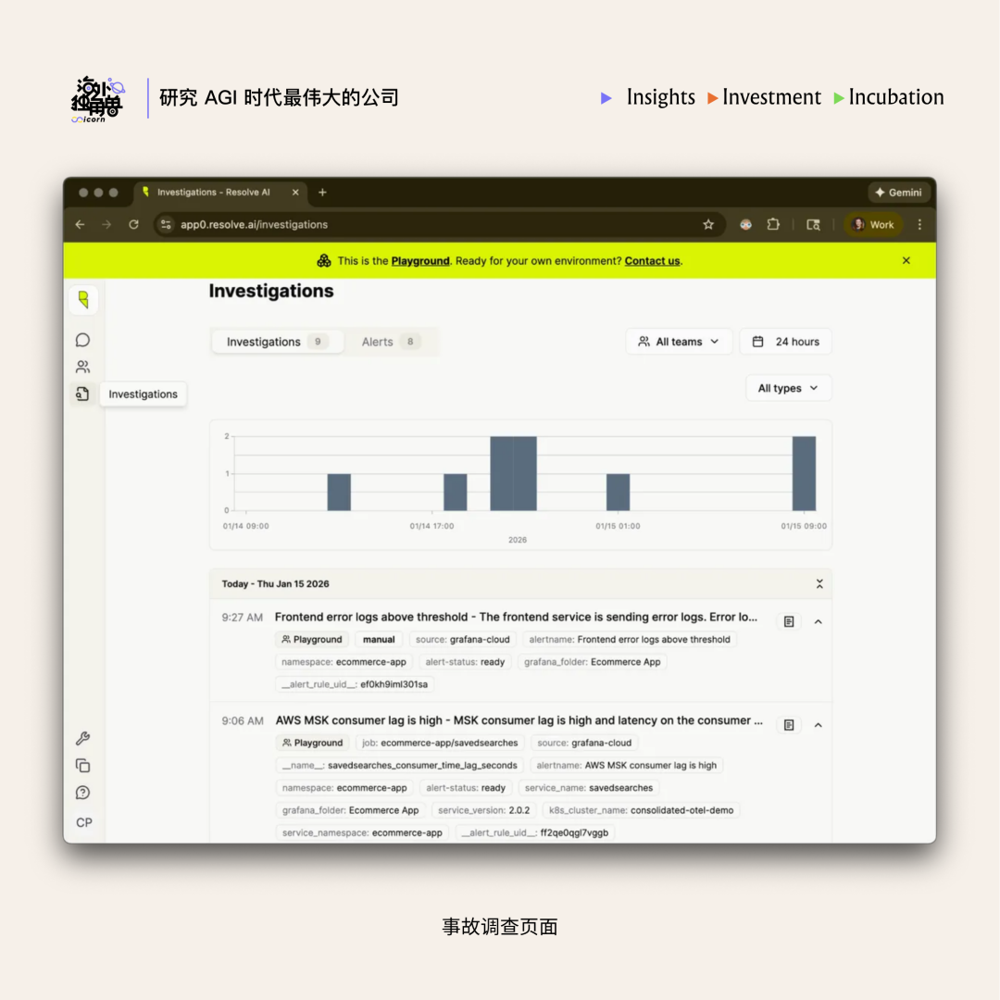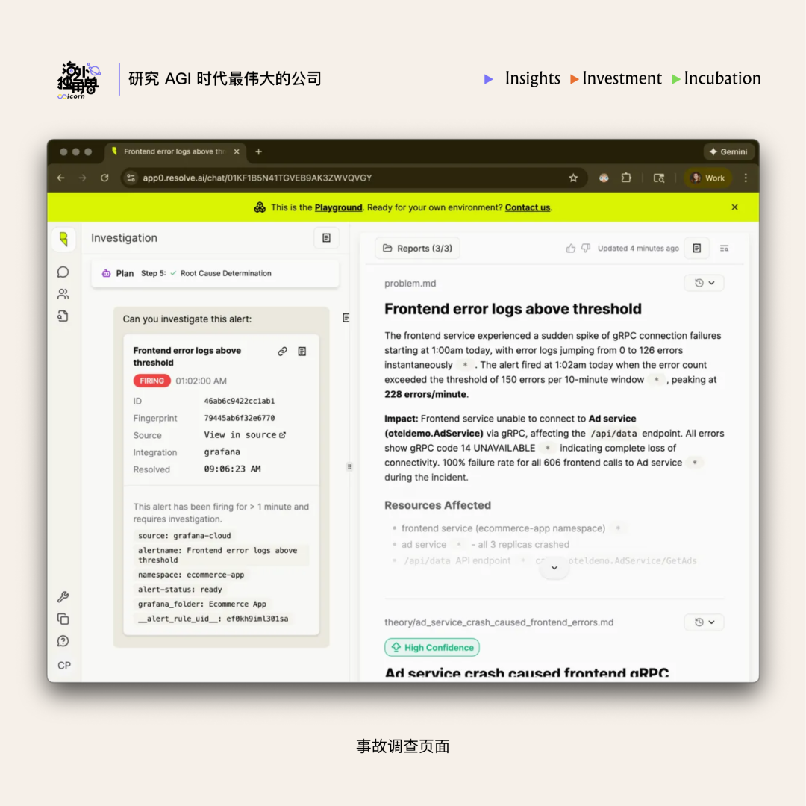

左右滑动以查看全部内容

  

比如在一次 Frontend gRPC 连接失败的案例中，系统不是简单告警，而是精确给出了完整因果链，Frontend 服务从凌晨 1：00 起 gRPC 错误从 0 跳至 126 个，峰值 228 错误/分钟，根因是 Ad service 的 3 个 replica 全部崩溃导致 /api/data 接口 100%不可用，共 606 次调用失败，gRPC code 14 UNAVAILABLE。报告中每个关键数字旁都附有可追溯的证据引用链接，工程师可以直接点击验证原始数据，而非盲目信任 AI 结论。

  

  

  

**03.**  

  

**融资与客户信息**

  

**融资情况**

  

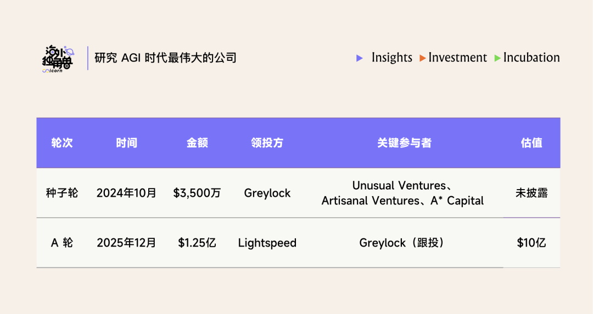

  

Resolve AI 从 stealth 出来仅 16 个月，已完成两轮融资，累计超过 1.5 亿美元：2024 年 10 月种子轮由 Greylock 领投，融资 3,500 万美元；2025 年 12 月 A 轮由 Lightspeed 领投，融资 1.25 亿美元，估值达 10 亿美元，Greylock 跟投。

  

公司的天使投资人名单同样豪华，不仅有 Google DeepMind 的首席科学家 Jeff Dean 和 AI 教母李飞飞，还吸引了 AWS CEO 、Snowflake CEO、前 GitHub CEO 等业界大佬的认可。

  

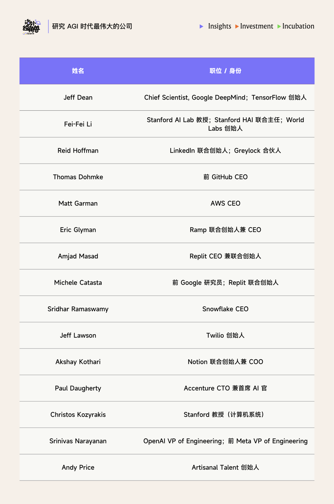

  

**客户与商业进展**

  

截至 A 轮融资（2025 年 12 月），Resolve AI 已积累 20+ 家企业客户，ARR 约 $400 万，员工约 120 人。从种子轮时的早期客户 DataStax、Uni、Blueground，到 A 轮时进入 Coinbase、Zscaler、Salesforce、MongoDB、MSCI、Toast 等头部企业。

  

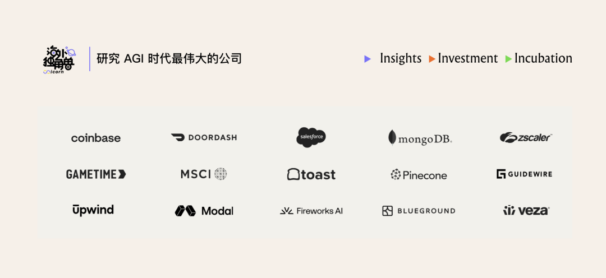

  

Coinbase ：其告警根因调查时间缩短 72%，且 Coinbase 工程团队在 AWS re：Invent 2025 上公开为 Resolve AI 站台。

  

Zscaler ：该公司每日需处理约 15 万条告警，引入 Resolve AI 后每次事故所需工程师数量减少 30%。

  

DoorDash：DoorDash 同期测试了多家 AI SRE 产品，采取 multi-vendor 策略。与此同时，前 DoorDash 广告平台高级工程总监 Shahrooz Ansari 已加入 Resolve AI。

  

  

  

**04.**  

  

**行业老兵的第三次并肩作战**

  

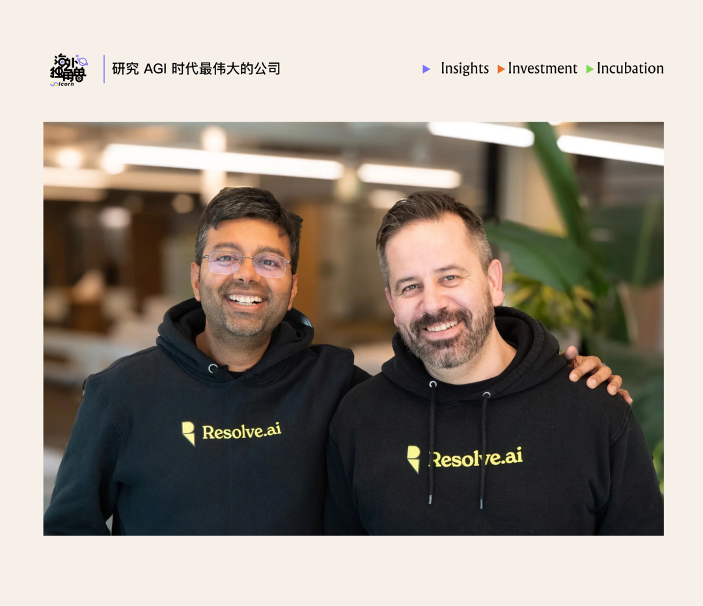

  

两位创始人都是可观测的行业老兵，并且一同经历 20 年同窗、12 年共事，经历了从 Log Insight 到 Omnition 再到 Splunk 的完整周期，Resolve AI 是两人的第三次联合创业。Resolve AI 做的事情是同一个愿景的第三次迭代，从日志分析（Log Insight）到分布式追踪（Omnition/OpenTelemetry），再到 AI 自主推断根因（Resolve AI）。

  

**Spiros Xanthos — CEO**

  

Spiros 是希腊人，本科毕业后赴美攻读伊利诺伊大学香槟分校（UIUC）计算机科学博士。 他联合创建了 OpenTelemetry。这是可观测性领域的事实标准协议，被全球几乎所有科技公司使用。他有四次创业经历：

  

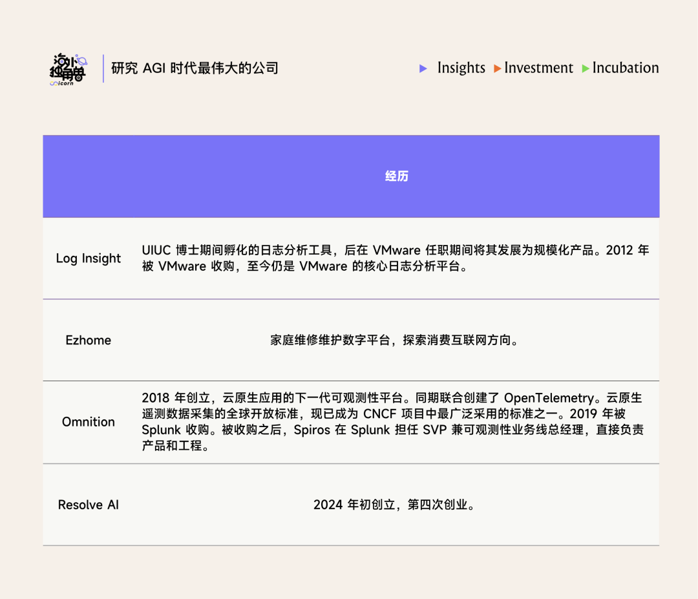

  

**Mayank Agarwal — CTO**

  

Mayank 来自印度，本科毕业于印度理工学院德里分校（IIT Delhi），随后在 UIUC 取得计算机科学博士学位（2004-2009 年），研究方向为分布式系统与云计算。和 Spiros 两人在 UIUC 读博期间相识，此后共事至今超过 12 年。

  

Mayank 的职业路径与 Spiros 高度交叉但侧重不同，Spiros 更偏产品和商业，Mayank 更偏系统架构和技术深度：

  

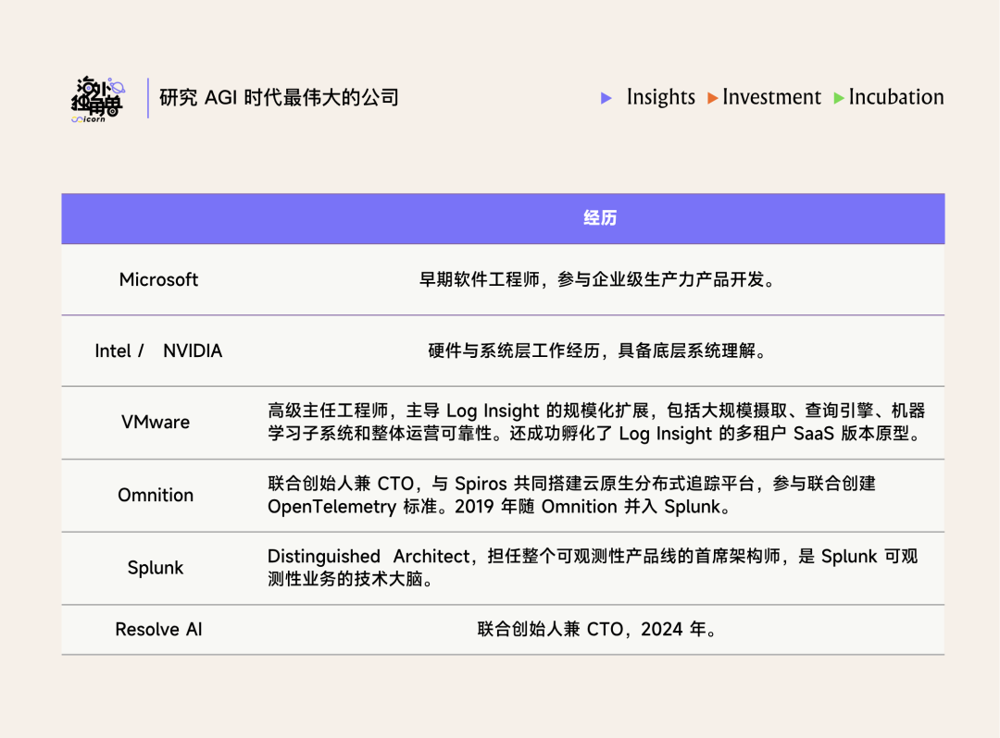

  

**两人创业的成名作：OpenTelemetry**

  

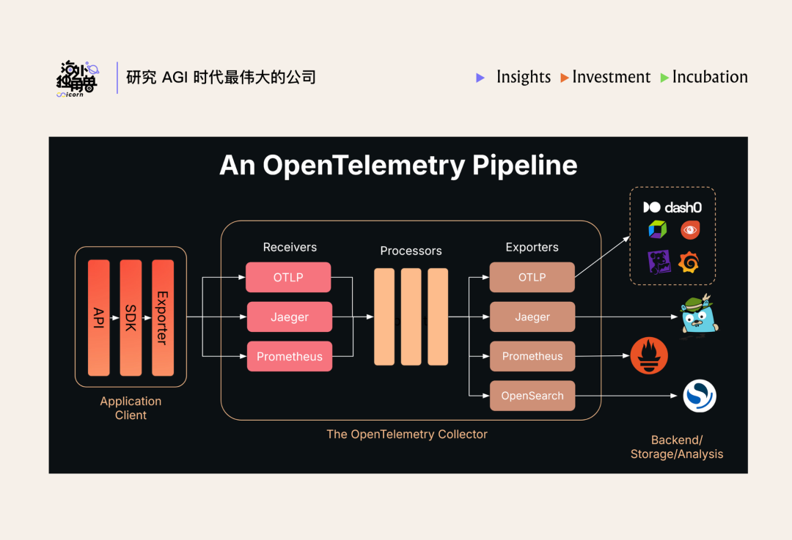

  

现在是 CNCF 里活跃度第二高的项目，仅次于 Kubernetes，已经成为遥测数据采集的事实标准。 近 50%的云原生企业用户已经采用了这个项目。

  

它解决了一个长期折磨工程师的痛点。在 OTel 出现之前，一个跨多云部署的应用需要同时维护 CloudWatch（AWS）、Azure Monitor（Azure）、Stackdriver（GCP）等多套工具，工程师光是 debug 一个请求就要同时盯着五个 dashboard。 OTel 的核心价值主张是 instrument once， export anywhere，接入一次，数据可以导入任何后端工具。

  

  

  

**05.**  

  

**Resolve 与 Traversal 核心差异在哪里？**

  

值得注意的是，resolve 和 traversal 的产品也都在快速迭代，对他们功能特性的评价都在动态变动过程中。目前整个赛道各家都处于探索阶段，离终局还有较长的路要走。但具体来看，他们的特点也都很鲜明：

  

**创始团队风格**

  

Resolve.ai 的团队更像是一个工程团队，而 Traversal 更像是一个学术团队。

  

Traversal 的联创团队学术底色浓厚，三位联创均是因果机器学习领域的 AI 研究员出身。CEO 是哥伦比亚大学教授，联创是 Cornell 的助理教授。唯一具有一线实战背景的是联创曾经担任量化交易员。他们更像是一个为了验证因果学习在 AI SRE 里路线的团队。

  

而 Resolve，正如上文所说，是典型的连续工程创业者，有更强的实战经验和创业决心。五位创始团队核心成员已是第三次合作创业，团队磨合程度和行业资源积累均远超常规初创公司。

  

**部署架构**

  

从架构上来说，Resolve 是更偏保守、务实、也更符合企业安全要求的一方。

  

Resolve 采用“Satellite”模式，在客户数据中心内部署一个本地卫星节点。该节点可读取所有数据，但数据本身不离开客户环境，仅将经过安全层脱敏处理后的极小量元数据传回 Resolve 主系统。这套架构是赢得大量金融客户的关键：以 Coinbase 为例，其连日志都不对外开放（涉及交易数据），但 traces、metrics 和 dashboard 可以访问，Resolve 照样能完成 debug。此外，这一设计也赋予客户更高的数据主权，一旦 Resolve 平台出现问题，客户可立即关闭本地节点，彻底切断访问。

  

Traversal 则倾向于集中式云端架构，通常需要在企业各业务服务器上广泛部署 Agent，终端直接与供应商云端通信。这种方式部署侵入性更强，数据控制权相对更弱，一旦供应商侧发生安全事件，客户的集成系统将面临直接暴露风险。

  

**根因推断深度**

  

在根因推断深度上，Traversal 则被认为走得更深。

  

Resolve 底层主要依赖传统机器学习做相关性匹配，擅长将告警与潜在问题进行高维度关联，但本质仍是“症状识别”，无法深入推断跨系统的依赖关系或网络路径。Traversal 构建了专门针对 SRE 可观测性场景训练的推理模型，能够像“深度思考的 AI”一样自主进行因果溯源：它摄取企业过去三个月的监控数据进行反向训练，拥有极大的上下文窗口，不仅读取日志，还能深入理解代码库及其依赖关系，最终通过检索 GitHub 提交历史，精准指向某段代码。

  

  

  

**06.**  

  

**AI SRE 的现在与未来**

**  
**

**•** AI SRE 可能会诞生下一代 Datadog

  

从商业格局来看，AI SRE 可能是下一代可观测性基础设施的雏形。Datadog 的商业模式本质是 observe + store，依靠数据存储量计费；AI SRE 的能力边界则延伸至 observe + analyze + act，将价值从被动存储转移到主动决策。Datadog 自身的 Bits AI 尝试切入这一方向，但受制于自身的存储计费模式与缺乏完整 production system context 的先天局限，难以做得足够深入，这给了 AI SRE 创业公司留下了时间窗口。

  

**•** Claude Code 吞噬一切？SRE 是否有独立机会

  

Claude Code 似乎在吞噬与 coding 相关的一切，比如现在已经可以通过接入外部工具的方式具备 sub-agent 协作能力，能读代码、读日志、做多步推理，但 SRE 还是可能存在独立机会：一方面，AI SRE 需要的 Always-on 系统本质上是 proactive agent，是一个需要编排引擎、状态管理、权限控制的完整系统，目前的 coding 工具离这一层还比较远。另一方面，大量运维的行业 know-how 和细节还在人脑中，事件记忆、runbook 积累、故障模式库，都需要专门的数据架构来沉淀和检索。如果 AI SRE 公司能抢先获得这部分数据积累，会有很大的先发优势。

  

**•** SRE 的难点在“破案”

  

许多人认为 AI SRE 的技术瓶颈在于“读懂日志”。事实上，解析 logs、traces、metrics 等 telemetry 数据并不需要专门训练的领域模型，现代自然语言模型本身就具备理解结构化与半结构化数据的能力。真正的难点在于“如何破案”：一个真正成熟的 SRE 工程师需要从一个 alert 出发，在海量 noisy 数据中追溯完整的因果链条，像侦探小说一样一步步逼近真相。这个过程要求模型具备 long chain-of-thought 推理、long horizon 规划，以及大量并行 sub-agent 的协同，这是当前 AI agent 架构面临的前沿挑战。

  

**•** 模型只是一部分，Context 才是核心工程问题

  

即便推理能力过关，模型智能也只占整个 SRE 瓶颈的一部分。更大的挑战来自 context 的组织与提取：客户系统的 runbook 往往分散、过时，关键的 tribal knowledge 存在于少数老员工的脑子里而非任何文档，大量监控数据 noisy 也会干扰 agent 的判断方向。如何从复杂生产系统中高效提取、结构化并持续维护 context，是 AI SRE 真正的核心工程难题。

  

**•** AI 会像资深工程师那样，越用越强

  

AI SRE 产品的使用本身极度依赖训练数据的积累。每一次 debug 成功或失败都是清晰的 reward signal，agent 对特定客户系统的理解会随时间持续加深，形成难以迁移的系统级认知资产。AI SRE 若能将自身运维工程师那样，这隐性知识系统化沉淀，逐步学习原本存在人脑海里的运维经验。其战略价值将远超一般 SaaS 工具的替换成本。

  

**•** AI SRE 最终的天花板取决于软件价值的分布

  

从更长远的视角审视，AI SRE 的市场天花板并非固定不变。软件越不可靠、宕机损失越大，运维的战略价值就越高。但如果未来大量由 AI 生成的软件生命周期极短、被快速迭代替换，这类软件的运维价值本就有限。运维行业的长期空间，最终取决于未来软件价值的分布是否会发生结构性变化，到底是高价值、长生命周期的核心系统是否仍将占据主导，还是被大量“用完即弃”的 AI 生成代码稀释？

  

  

排版：夏悦涵

  

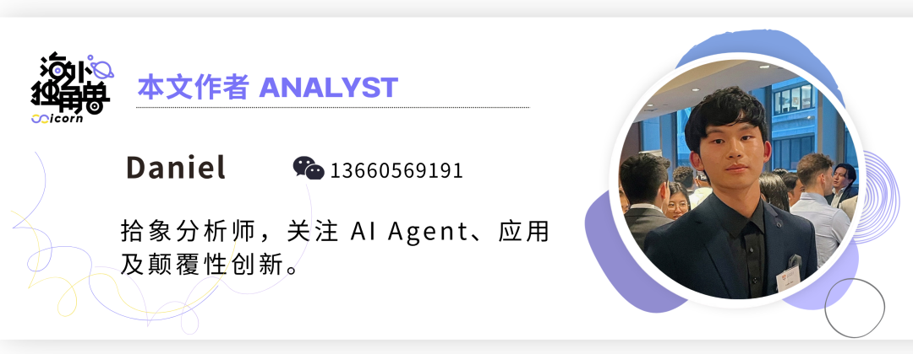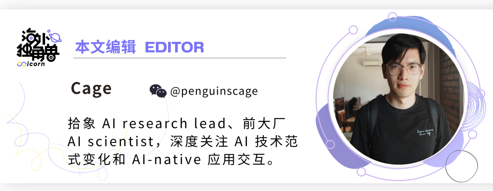

  

延伸阅读

[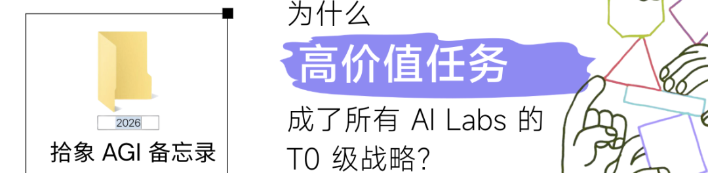](https://mp.weixin.qq.com/s?__biz=Mzg2OTY0MDk0NQ==&mid=2247523665&idx=1&sn=b607c984c18bc1034b07686a4902166d&scene=21#wechat_redirect)

为什么「高价值任务」成了所有 AI Labs 的T0 级战略？｜ 拾象 AGI 备忘录

  

[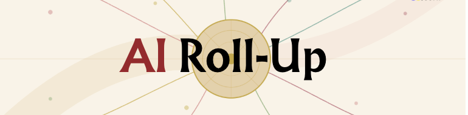](https://mp.weixin.qq.com/s?__biz=Mzg2OTY0MDk0NQ==&mid=2247523621&idx=1&sn=f4fc598883044147f69ed1ff44ac25e8&scene=21#wechat_redirect)

硅谷火了一年的 AI Roll-Up，正在把“买公司”变成新的 AI 创业模式

  

Physical Intelligence：机器人需要一个“个人电脑时刻”

  

[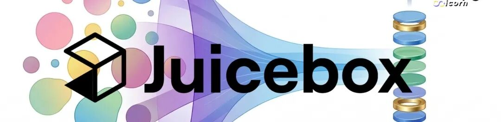](https://mp.weixin.qq.com/s?__biz=Mzg2OTY0MDk0NQ==&mid=2247523407&idx=1&sn=e04fdb48e2c13cefe7c1c19991ce23ce&scene=21#wechat_redirect)

Juicebox：用 AI 把 HR 工作提效 2 倍，4 人团队实现 $10M ARR

  

[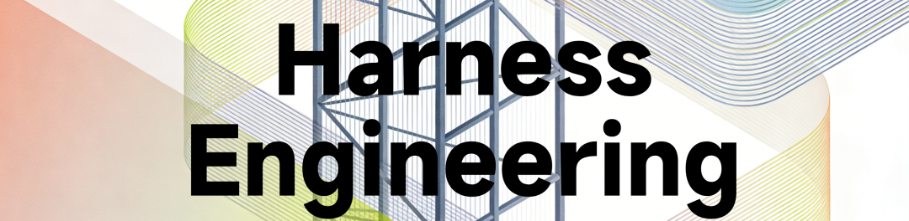](https://mp.weixin.qq.com/s?__biz=Mzg2OTY0MDk0NQ==&mid=2247521760&idx=1&sn=49916720e9f8a753fc3b30f58bf2231d&scene=21#wechat_redirect)

Harness is the New Dataset：模型智能提升的下一个关键方向

