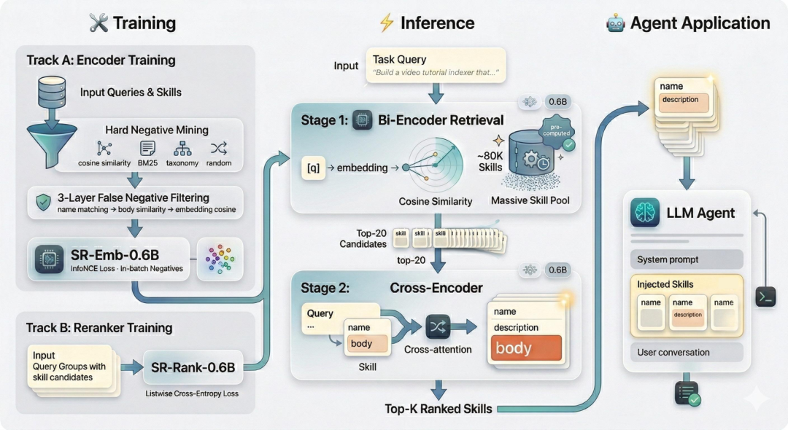
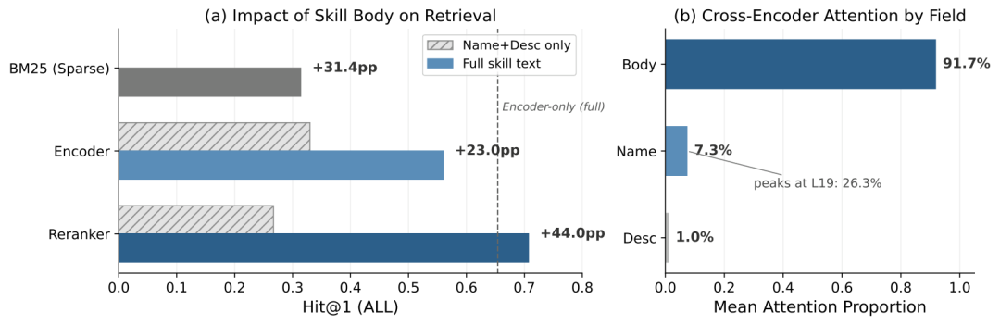
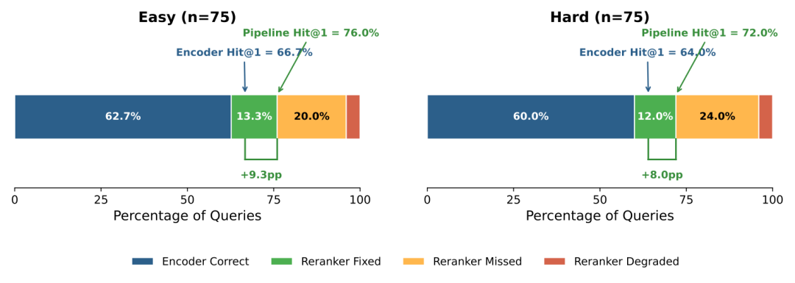
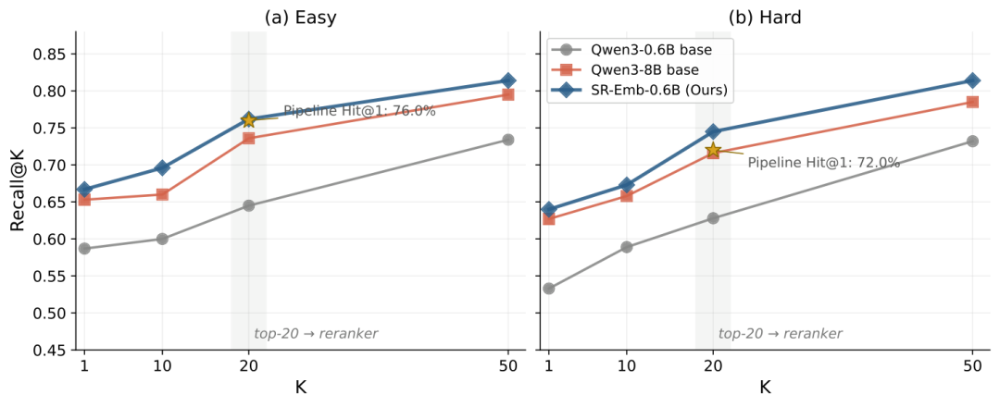
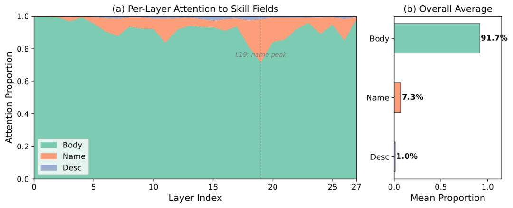

**一句话讲清楚👉🏻** 阿里团队在8万规模技能池上系统研究了LLM Agent的技能选择问题，发现"技能描述"根本不够用——真正决定选择准确率的是技能的完整实现代码（body），并且仅用1.2B参数的微调模型就超越了8B零样本基线。

* * *

## 当Agent技能池膨胀到数万个，怎么办？

2025到2026年，AI Agent的生态经历了爆发式增长。从Claude Code、Codex CLI到各类开源Agent框架，一个共同的趋势是：社区贡献的技能（skills/tools/plugins）数量已经膨胀到数万个。光是GitHub上的awesome-openclaw-skills仓库就收录了上百个技能分类，涵盖代码审查、数据库迁移、API集成、文档生成等方方面面。

但问题也随之而来。当你面对一个拥有数万技能的仓库时，你不可能把所有技能都塞进Agent的上下文窗口里——那会撑爆context window，让推理成本飙升，更别提大量低质量和重复的技能了。

更麻烦的是，社区技能仓库存在严重的**功能重叠** 问题。比如搜索"git"相关的操作，你可能会找到几十个功能相似但实现细节不同的技能：有的用shell脚本，有的用Python，有的支持PR自动合并，有的只做commit检查。名字和描述可能都很像，但真正的差异藏在实现代码里。

这就是技能路由（Skill Routing）问题的核心：给定用户任务，从数万个候选技能中准确选出最合适的那个。

尽管这个问题在实际中非常紧迫，但学术界的研究几乎是空白。现有的benchmark如SkillBench、ToolBench主要评估Agent在给定技能后能否正确使用，却没有研究"如何从大规模技能池中找到正确的技能"这一上游问题。

阿里巴巴的研究团队最近发布了一篇论文，首次对大规模技能路由问题做了系统性的实证研究。他们构建了包含约8万个技能和75个专家验证查询的评测基准，得出一个关键结论：**技能的完整实现文本（body）才是决定选择准确率的关键信号** ，而非业界普遍认为的名称和描述。

基于这一发现，他们提出了**SkillRouter** ——一个仅1.2B参数的两阶段检索-重排序流水线，在技能路由准确率上超越了参数量8B的基线模型。

## 一个被忽视的前提：名称+描述真的够用吗？

当前几乎所有的Agent框架（包括Claude的Agent Skills、OpenClaw等）在处理技能选择时，都采用了一种叫渐进式披露（Progressive Disclosure）的设计模式：

  * 第一层：技能的名称和描述常驻上下文
  * 第二层：被选中后才加载完整的SKILL.md指令
  * 第三层：按需调用脚本和资源文件

这个设计的隐含假设是：技能名称和描述包含了足够的信息来做出正确的选择。

阿里团队通过严格的实验，直接推翻了这个假设。

他们在一个包含约8万技能的池子上，用75个专家验证的查询测试了多种检索方法，对比了两种输入配置：

  * **nd（name + description）** ：只用技能名称和描述
  * **full（name + description + body）** ：使用完整技能文本，包括实现代码

结果很有意思：

**BM25关键词检索** ：只用名称+描述时，Hit@1准确率降到了**零** 。也就是说，技能名称和描述与用户查询之间几乎没有词汇重叠。加上body后，恢复到34.7%。

**稠密编码器** ：Qwen3-Emb-0.6B从58.7%暴跌到22.7%，下降36个百分点。即使是13倍参数量的8B模型（30.7%），也无法弥补body缺失带来的损失——0.6B用完整文本（58.7%）的表现远超8B只用名称描述（30.7%）。

**重排序器更糟** ：只用名称+描述的重排序器甚至比不用重排序还差。最好的nd交叉编码器组合只有30.7%的平均Hit@1，而不用重排序的encoder有56.0%——重排序器基于不充分信息自信地打乱了原本更好的排序。

这些结果揭示了一个核心问题：**名称和描述提供的区分度太低了** 。在数万个功能重叠的技能池中，光靠"pdf-merger"这样一个名字和一句"合并PDF文件的工具"这样的描述，根本无法区分几十个功能相似的技能。真正的区分信号藏在body里——具体的实现逻辑、使用的库、参数配置、错误处理方式等。

## 核心发现：91.7%的注意力集中在body上

为了理解body为什么如此重要，阿里团队对交叉编码器重排序器（SR-Rank-0.6B）的注意力分布进行了详细分析。他们将注意力权重按技能文本的三个字段（name、description、body）进行分区，结果发现：

**body字段获得了91.7%的注意力权重** ，name只占7.3%，description仅占1.0%。

这意味着，当模型在判断"这个技能是否适合当前任务"时，几乎把全部"注意力"都放在了技能的实现代码上，而名称和描述基本被忽略了。

更有趣的是注意力的**分层演变模式** ：

  * **早期层（0-6层）** ：几乎100%关注body内容（97.3%），执行token级别的内容理解
  * **中间层（7-20层）** ：name的注意力逐渐上升，在第19层达到峰值26.3%——这些层在做名称级别的语义匹配
  * **后期层（21-27层）** ：重新回到body主导（91.7%），利用body中的详细信息做出最终判断

用一句话总结就是：**模型先读懂代码（body），再对照名称做匹配，最后回到代码做决定** 。

这个发现对系统设计有直接的指导意义：

  1. 技能路由系统必须能访问完整body，仅靠名称+描述的路由方案从根本上就是受限的
  2. Agent架构中存在天然的"隐藏body不对称性"——最终使用技能的Agent因为上下文限制看不到body，但路由组件必须能看到
  3. 这不是一个可选优化，而是一个必要条件

## SkillRouter：1.2B参数的精巧设计

基于"body是决定性信号"这一核心发现，阿里团队设计了SkillRouter——一个两阶段的检索-重排序流水线，总计仅1.2B参数（0.6B编码器 + 0.6B重排序器）。

 *SkillRouter流水线架构。第一阶段：双编码器检索将约8万技能缩减到Top-20候选。第二阶段：交叉编码器重排序产生最终排名。两个阶段都使用完整技能文本。*

###  第一阶段：双编码器检索（Bi-Encoder Retrieval）

**基础模型** ：对Qwen3-Emb-0.6B进行微调，得到SR-Emb-0.6B。选择0.6B规模是为了支持在消费级硬件（比如笔记本CPU）上部署。

**训练数据构建** ：团队构建了37,979个（查询，技能）配对的训练集。技能从约8万个开源技能中分层采样，确保51个功能类别都有覆盖。对于每个技能，用GPT-4o-mini生成合成用户查询——提示词要求模型基于技能的metadata和body内容生成一个真实的任务描述，但**不能提及技能名称** ，确保查询反映的是功能需求而非技能身份。

**困难负样本挖掘** ：这是训练的关键环节。每个查询采样10个负样本，来自四个互补来源：

  1. **语义负样本（4个）** ：用基础模型计算embedding，取余弦相似度Top-50中非正样本的技能——这是最难的负样本，语义相近但功能不同
  2. **词汇负样本（3个）** ：BM25在Top-50中选取，捕获词汇重叠的混淆项
  3. **分类负样本（2个）** ：从同一类别中随机采样不同名称的技能，提供同领域的干扰项
  4. **随机负样本（1个）** ：从不同类别均匀采样，作为简单的标定负样本

**假负样本过滤** ：社区技能库存在大量功能重叠——不同名称的技能可能提供几乎相同的能力。在对比学习中，这些重复项会变成假负样本，污染训练信号。团队采用了三层过滤管线：

  1. **名称去重** ：移除与查询的ground-truth技能同名的负样本
  2. **文本重叠** ：移除body文本三元组Jaccard相似度大于0.6的负样本
  3. **Embedding相似度** ：移除余弦相似度大于0.92的负样本，捕获词汇匹配遗漏的语义重复

总共移除了约10%的挖掘负样本对。

**损失函数** ：使用batch内InfoNCE损失：

其中  表示余弦相似度， 是温度超参数，用于锐化相似度分布，鼓励模型在候选技能间做出细粒度区分。 是第  个查询， 是对应的正样本技能， 是batch内所有技能（包括正负样本）。

### 第二阶段：交叉编码器重排序（Cross-Encoder Reranking）

**基础模型** ：对Qwen3-Reranker-0.6B进行微调，得到SR-Rank-0.6B。

**输入格式** ：每个候选技能以name + description + body的扁平拼接形式呈现给重排序器，使交叉编码器能够执行token级别的交叉注意力——前面分析过，91.7%的注意力集中在body字段上。

**训练数据** ：对32,283个训练查询中的每个查询，用训练好的SR-Emb-0.6B编码器检索Top-20候选，每个候选列表包含20个带有二元相关性标签的技能，构成一个训练组。同样应用三层假负样本过滤。

**损失函数** ：团队对比了两种损失函数：

**列表式交叉熵（Listwise CE）** ：

其中  是交叉编码器的相关性分数， 是正样本技能， 是温度参数。这个公式直接建模候选之间的相对排序。

**逐点式二元交叉熵（Pointwise BCE）** ：

其中 ， 是sigmoid函数。

**结果惊人** ：列表式CE比逐点式BCE高出**30.7个百分点** 。逐点式甚至让重排序器的表现跌到了encoder-only水平以下（43.3% vs 65.4%）。

原因在于技能池的高同质性。当encoder检索出的Top-20候选都是语义高度相似的技能（比如几十个"git管理"技能）时，逐点式BCE独立处理每个（查询，技能）对，sigmoid输出趋近于一个狭窄区间，排序几乎等同于随机。而列表式CE对整个候选列表做softmax，强制模型直接比较候选之间的差异——这正是从一堆相似技能中挑出正确那个所需要的机制。

## 实验结果：全面碾压基线

### 编码器检索结果

在约8万技能的评测基准上，SR-Emb-0.6B以65.4%的平均Hit@1成为最强编码器基线，甚至超过了参数量大13倍的Qwen3-Emb-8B（64.0%）。这证明了任务特定的微调比简单增大模型规模更有效。

将同样的微调方案应用到8B模型上，SR-Emb-8B达到68.0%的平均Hit@1。从0.6B到8B的规模增益（+2.6pp）相比8B基础上的微调增益（+4.0pp）更为温和，进一步说明数据和训练对这个任务比规模更重要。

### 端到端流水线结果

SkillRouter主流水线（SR-Emb-0.6B + SR-Rank-0.6B，共1.2B参数）取得了**74.0%的平均Hit@1** 。相比最强的零样本8B流水线（Qwen3-Emb-8B + Qwen3-Rank-8B，68.0%），高出6.0个百分点。

这个增益在不同维度上都保持一致：

  * Easy级别：+8.0pp
  * Hard级别：+4.0pp
  * 单技能查询：+6.2pp
  * 多技能查询：+5.9pp

将同样的方案扩展到8B规模，SR-Emb-8B + SR-Rank-8B达到**76.0%的平均Hit@1** 。一个有意思的现象是，编码器质量的贡献大于重排序器规模：升级编码器（0.6B到8B）贡献+1.3pp，单独升级重排序器只增加+0.7pp。

 *技能body是决定性信号。左图：移除body导致所有方法下降29-44个百分点。右图：交叉编码器注意力分布显示91.7%集中在body上，name仅7.3%，description仅1.0%。*

###  重排序器到底贡献了什么？

为了理解编码器和重排序器各自的贡献，团队进行了逐查询的贡献分解分析。在150个查询（75个Easy + 75个Hard）中：

  * **编码器和重排序器都正确** ：92个（61.3%）
  * **重排序器修正了编码器的错误** ：19个（12.7%）
  * **重排序器把正确的搞错了** ：6个（4.0%）
  * **两者都错了** ：33个（22.0%）

重排序器净贡献为\*\*+8.7pp\*\*的Hit@1增益。只有4.0%的查询被重排序器搞坏，而12.7%的查询被成功拯救。这种"少破坏、多帮助"的特性使得流水线组合是可靠的正向收益。

 *重排序器贡献分解。重排序器拯救了12.7%编码器失败的查询（绿色），仅导致4.0%的退化（红色）。净贡献：+8.7pp Hit@1。*

##  消融实验：哪些设计选择是关键的？

### 假负样本过滤：+4.0pp

移除三层假负样本过滤后，平均Hit@1从65.4%降到61.3%。效果在Hard级别上几乎翻倍（-5.3pp vs -2.7pp），说明假负样本对模型区分高度相似技能的能力影响最大。

有趣的是，假负样本主要影响**精度** 而非**召回** ：R@50仅下降0.7pp，但Hit@1下降4.0pp。这与假负样本的本质一致——它们教会模型把本应相关的技能推开，导致模型仍然能在Top-50中找到正确技能，但无法将其排到第一位。

### 列表式损失：+30.7pp

前面已经提到，列表式CE比逐点式BCE高出30.7个百分点。逐点式训练的重排序器（43.3%）甚至比不用重排序的encoder-only（65.4%）还差了22个百分点。

这是因为在高同质性的技能池中，候选列表里的技能往往高度相似（几十个"docker管理"或"git操作"技能）。逐点式BCE独立对每个候选打绝对分数，面对一堆相似候选时sigmoid输出趋近于同一区间，排序退化为随机。列表式CE通过softmax在整个候选列表上做归一化，强制模型学习候选之间的相对差异。

### Recall天花板分析

SR-Emb-0.6B在K=20时捕获75.4%的ground-truth技能，K=50时达到81.4%。这意味着约20%的正确技能根本不在Top-20候选集中，重排序器对此无能为力。这是当前系统的主要天花板，未来可以通过提升encoder召回率或增大候选窗口来突破。

 *SR-Emb-0.6B在不同候选集大小下的Recall@K。K=20时平均捕获75.4%的正确技能，K=50时达到81.4%。星号标记了完整流水线在K=20时的Hit@1。*

##  定性分析：两个典型案例

### 案例一：编码器的推理捷径

查询要求Agent从本地教学视频中提取章节时间戳。正确的技能是speech-to-text（基于Whisper的音频转录），因为提取时间戳的第一步是语音识别。

基线编码器被表面关键词"video"误导，检索出视频编辑工具（Video Clipper, video-explorer），将正确技能排在第25位（0.6B模型）或第6位（8B模型）。

而SR-Emb-0.6B通过任务特定的微调，学到了"视频+时间戳 → 语音转录"这一间接语义映射，将正确技能排在第1位。这说明微调让编码器学到了规模无法提供的推理捷径。

### 案例二：重排序器的拯救

某个查询要求将数据库迁移脚本转换为Docker Compose配置。encoder检索出的Top-20候选中包含正确技能，但将其排在第8位——前面的候选是一堆与"docker"和"database"表面相关的技能。

SR-Rank-0.6B通过交叉注意力深入分析每个候选的body内容，发现只有目标技能同时涉及"数据库迁移"和"Docker Compose生成"两个核心能力，将其提升到第1位。这体现了body级别的交叉注意力比encoder的独立embedding比较更具区分力。

## 效率与部署：笔记本CPU就能跑

SkillRouter的一个关键设计目标是支持**端侧部署** 。随着OpenClaw等个人Agent产品的流行，技能路由需要在消费级硬件上运行，而不能依赖云端API或大型GPU集群。

整个流水线仅1.2B参数（0.6B + 0.6B），而对比的基线模型Qwen3-Emb-8B单独就有8B参数，NV-Embed-v2有7B参数。

推理时，技能embedding预先计算并存储在向量索引中。对于每个用户查询，流水线只需：

  1. 用0.6B编码器编码查询
  2. ANN搜索预索引的技能embedding
  3. 用0.6B交叉编码器重排序Top-20候选

步骤1和3各自只需要一次0.6B模型的前向传播，步骤2通过标准ANN库实现亚线性时间复杂度。这种架构完全可以在笔记本CPU上运行，无需云端API访问。

## Attention分布的深层解读

 *各层注意力在技能字段上的分布。第19层显示name注意力峰值（26.3%），表明中间层执行名称级别的语义匹配，之后层重新回到body做最终判断。*

论文中还有一个有意思的发现是注意力的**层间演变模式** 。团队分析了28层x16个注意力头在75个核心查询上的表现，发现注意力分布随层深呈现"body → name → body"的三阶段模式：

**早期层（0-6）** ：97.3%的注意力集中在body。这些层在做基础的内容理解——token级别的代码语义解析。技能的实现逻辑、使用的库、参数类型等信息在这些层被初步提取。

**中间层（7-20）** ：name的注意力逐步上升，在第19层达到峰值26.3%。这些层在做跨字段的语义匹配——将技能名称与查询中的关键词进行对齐。这一步可以类比为"看一眼文件名确认这是不是我要找的东西"。

**后期层（21-27）** ：注意力重新回到body主导（91.7%）。在确认名称大致匹配后，模型回到body做最终的精确判断——这个实现方式是否真的能解决我的问题？参数格式是否兼容？有没有我需要的特定功能？

description在所有层中的注意力都不超过1.4%，说明它携带的信息完全被body所覆盖——body中自然包含了描述信息，而且更详细。

这种"粗筛 → 名称确认 → 精筛"的注意力模式，和人类程序员在技能仓库中搜索的行为模式惊人地相似：先浏览代码实现理解功能，再看一眼名字确认方向，最后仔细阅读代码判断是否合适。

## 对业界的启示

阿里团队的这项研究对LLM Agent生态系统有几个直接的影响：

**1\. 渐进式披露设计需要重新审视**

当前Agent框架普遍认为名称+描述就足够做技能选择，但这项研究表明这是一种错误的假设。如果路由层看不到body，准确率会暴跌30-40个百分点。系统设计者需要确保路由组件有权限访问完整技能文本。

**2\. 隐藏body不对称性是真实的设计约束**

最终使用技能的Agent因为上下文限制看不到body（太长了），但路由组件必须能看到body。这不是设计上的便利，而是必要的架构决策。路由层和Agent之间存在天然的信息不对称。

**3\. 微调比堆参数更有效**

在技能路由这个特定任务上，0.6B的微调模型超过了8B的零样本基线。任务特定的数据和训练策略比盲目扩大模型规模更有价值。这对资源受限的部署场景尤其重要。

**4\. 技能仓库的同质性需要专门处理**

社区技能仓库中大量功能重叠的技能给训练带来了独特的挑战。假负样本过滤（+4.0pp）和列表式损失（+30.7pp）都是针对这种同质性设计的。未来的技能路由系统必须考虑这个特点。

**5\. 紧凑模型的端侧部署成为可能**

1.2B参数的流水线可以在笔记本CPU上运行，这让个人Agent产品的本地技能路由成为现实。用户不需要将查询发送到云端，技能选择可以完全在本地完成，保护隐私的同时降低了延迟。

## 总结

阿里团队的这项研究首次系统地回答了"大规模Agent技能池中如何选择正确技能"这一关键问题。核心发现颠覆了业界的普遍认知：技能的完整实现代码（body）才是决定选择准确率的关键，而非名称和描述。

基于这一洞察设计的SkillRouter，以仅1.2B参数的紧凑流水线实现了74.0%的Top-1路由准确率，在可比条件下超越了参数量大数倍的基线模型。更关键的是，这个方案可以在消费级硬件上部署，为个人Agent产品的技能路由提供了切实可行的技术路径。

这项工作也揭示了当前Agent架构中的一个深层矛盾：Agent因为上下文限制看不到技能body，但准确的技能选择又必须依赖body。如何在保持Agent上下文效率的同时解决这个信息不对称，将是未来Agent系统设计的重要课题。

## 资源链接

📄 论文链接  
https://arxiv.org/abs/2603.22455

⭐️关注我，实时跟进AI最新进展⭐️