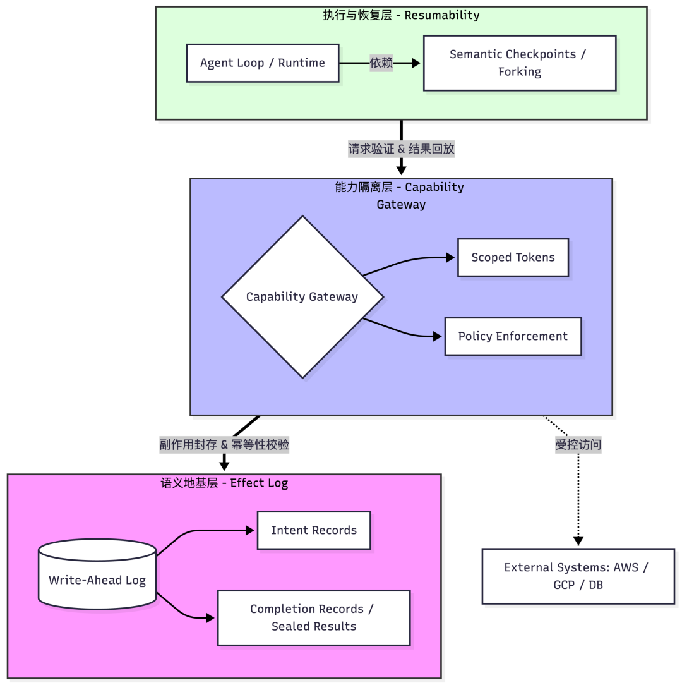
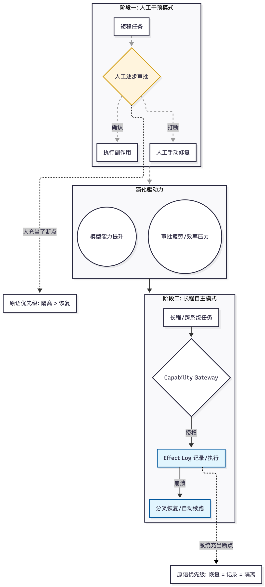
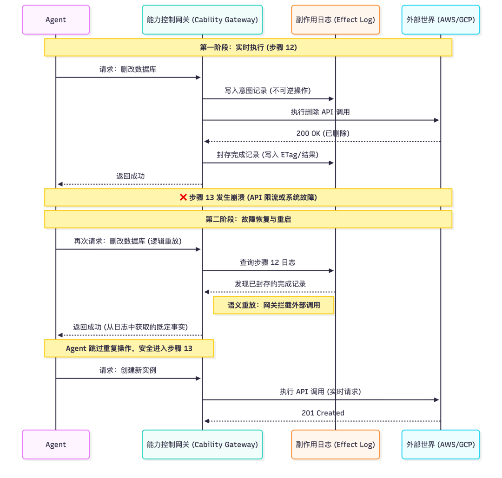

想象一个帮客户做跨云迁移的 Agent。前两小时它完美地在 AWS 和 GCP 之间配置了 VPC，拉起了实例，并在第 12 步删改了旧数据库。然后在第 13 步，它因为一个罕见的 API 限流崩溃了。

你该怎么办？重试？它会再修改一遍数据库；重启？它不知道哪些实例已经拉起。没有有效状态恢复，现在你的整个云环境就是一团乱麻。

这是一个贴近现实的场景，任何在生产中跑过超过 10 步的 Agent 都会遇到类似的问题，只是程度不同。这篇文章试图**解释为什么这个问题是结构性的，为什么现有的 Infra 没有解决它，以及解决它可能需要什么。**

* * *

##  Agent 的执行特征

大多数团队把 Agent 当成大模型的 wrapper，给它挂上几个 tool call ，加一些简单的 Harness 就上线部署了。但当你赋予 Agent 真实的系统权限，让它长时间自主运行，才会发现其执行特征跟我们熟悉的任何软件形态都不太一样。

它同时具备五个属性：**长程运行、敌意输入、真实权限、不确定决策、真实副作用。**

长程运行意味着崩溃是很大概率发生的。敌意输入并不是说用户故意攻击你，而是跟浏览器里跑客户端 JavaScript 同一个意思：Agent 处理的输入（邮件内容、网页文本、API 返回值）随时可能包含注入指令，你必须在架构层面假设输入不可信。真实权限意味着 Agent 持有 API key、数据库凭证、云平台 token。不确定决策来自 LLM 本身：同样的 prompt，不同时间点会产生不同的输出。真实副作用意味着每一步操作都可能改变外部世界的状态：发了的邮件收不回来，删改了的数据库恢复不了。

最近出圈的龙虾 OpenClaw 把这个问题推到了前台。赋予模型真实系统权限能带来能力跃迁，但也把安全风险从理论变成了现实。

这五个属性单独拿出来都不新鲜。数据库有事务语义来处理副作用，浏览器有沙箱模型来处理敌意输入，分布式系统有 checkpoint 来处理长程运行。Agent 的难点在于它把这五个属性同时绑在了同一条执行链上，而且没有任何现成的系统是为这个组合设计的。即便权限收紧、动作都可审批，长程运行 + 不确定决策也让可恢复语义成为硬需求。

* * *

## 两个错位的假设

现有的 Agent Infra 建立在两个过时的假设上。

第一个是**威胁模型** 的假设。整个⾏业在⽤服务器代码的安全假设运⾏客户端代码。除了用户输入之外，服务器假设全部可信、执⾏环境受控、API surface 由你定义。而 Agent 读取的内容是敌意的，持有真实密钥，在你控制不了的环境⾥执⾏。它的威胁模型是浏览器，而不是服务器。

第二个是**执行模型** 的假设。现有的执行 Infra 为**确定性、短时、无状态** 的任务设计：一个请求进来，处理完，返回结果。**Agent 的执行是概率性的、长程的、带状态的。它的 决策路径不可复现，副作用不可撤销，而且运行时间长到崩溃是统计必然**。把这样的执行塞进为以请求/进程为容错单位的 Infra 里，问题不会在 demo 阶段暴露，会在生产规模暴露。

这两个假设的具体后果是三个缺失：没有副作用日志，出了事无法回答到底发生了什么；没有可恢复的执行状态，中断后无法从任意点恢复上下文与环境；没有隔离边界，权限与数据暴露给不可控输入。

* * *

## 三条缺失的原语

从上面两个错位出发，我认为正确的 Agent Infra 需要补上三条原语。这三个原语有严格的构建顺序：副作用必须先被封存，能力边界才能被正确执行，恢复才能是安全的。

**一、 Effect Log**  
这是另外两个原语的**地基** 。生产恢复以语义正确为先，调试回放以可复现为先。**核心思路是把外部世界的副作用做成一套 write-ahead log。**

有副作用的调用在执行前先写 intent record，记录幂等键、预期影响范围、审批级别。执行后写 completion record，记录请求、响应、etag，以及是否已发生不可逆变化。恢复时，只读调用可以直接重放；有副作用的调用默认返回 completion record 中封存的结果，不再触碰外部世界。

Effect Log 的关键是把 tool call 按可恢复语义做最小分类并规定恢复策略：

  * • 纯读调用可以重放，若要可复现调试则直接返回封存响应而不是重打外部请求；
  * • 幂等写调用带幂等键，恢复时允许重放，必要时由中介层用 effect log 去重补齐幂等；
  * • 不可逆写调用一律禁止重放，恢复时直接返回 completion record 中封存的结果，把它当作已发生的事实；
  * • 读写混合调用最危险，必须把读到的响应/版本指纹先写入 intent record 并在 completion record 里一并封存，恢复时禁止重新读取，只能基于封存的读快照继续推进，避免外部状态漂移导致逻辑分叉。

这些分类是 tool 的开发者在注册 tool 时主动声明的接口契约，就像 HTTP method 的语义约定一样，GET 是安全的、PUT 是幂等的，这些并非服务器推断出来的，而是 API 设计者承诺的。现实中会有模糊地带：一个 Stripe refund 调用带有 idempotency key 但结果不可撤回，它同时符合幂等写和不可逆写。裁决原则是按最保守的分类处理——如果一个调用的任何维度是不可逆的，恢复时就按不可逆写对待，返回封存结果而不是重放。错误地把不可逆操作重放一次的代价，远高于错误地跳过一次幂等重试。“接口契约”在生态初期有可能会面临集成摩擦，所以智能语义标注也是值得探索的方向。

回到开头的场景：Effect Log 在第 12 步删改库发生的瞬间就写下了 completion record。崩溃恢复时，infra 读到这条记录，直接返回已封存的结果，重改的问题从根本上被排除。这些分类是接口契约，必须由 Capability Gateway（能力控制网关）强制执行。

**二、能力隔离**  
有了 Effect Log 做地基，下一步是画出**能力边界** 。

不把真实凭证直接交给 Agent 进程，而是通过一个 Capability Gateway 中介所有外部访问。Agent 拿到的是有时间限制、有范围限制、可即时撤销的临时令牌。权限边界在 Infra 层强制执行，不依赖模型的自觉。

这跟浏览器的安全模型是同一个思路：Tab 页拿不到 OS 的直接访问权，不是因为 JavaScript 代码承诺不越界，而是因为浏览器在架构上就不给它这个能力。

你给 Agent 的权限范围就是它的爆炸半径。这个 tradeoff 永远存在：权限越大，Agent 越有用，但出事时的损害也越大。关键是要有意识地做这个选择，而不是把所有权限 yolo 一股脑塞给 Agent。

崩溃触发后，scoped token 即刻失效。即便崩溃是因为注入了恶意指令，Agent 也已经没有凭证可以继续操作，我们开源的 ClawShell 是这方面具体实践。

**三、分叉恢复**  
有了封存的副作用事实和独立的能力边界，分叉才是安全的。

Agent 的执行本质上是搜索：它在一个巨大的决策空间里探索路径。这个搜索并非一条线，而是一张图。每个分支需要独立的 checkpoint，这是一份语义闭包：模型输出、tool 输出，以及 effect log 的游标位置。恢复时能精确回到某个节点继续推进，而不必从头来过。

分叉恢复不只是性能优化。它是让 Agent 系统能够调试的前提条件。没有它，出了问题你只能盲猜。可追踪性从第一天起就必须内建在 Infra 里，事后补不了。

  

回到开头的场景：你看到的不再是一个死掉的任务，而是执行图上的一个精确断点。你可以从第 12 步之后的状态直接续跑，带着完整的上下文，避免从头来一遍。

* * *

## 从 Uptime（保活） 到 Resumability（可恢复性）

在 SaaS 时代，Infra 的核心指标是 Uptime。我们用多副本、自愈、冗余来确保SLA。

但对于 Agent，Uptime 是代理指标。你无法保证一个运行 48 小时的 Agent 永远不遇到网络抖动或硬件故障。我在 Cloudflare 做 Edge Infra 的时候学到一个原则：**设计目标不应该是保证机器不挂，而是在故障发生时保住执行语义的正确性。**

正确的指标是 Resumability：能不能在任意时间点重新进入执行，完整恢复状态、上下文和环境？

这是一个从保证不死到允许随时死掉并满血复活的范式转变。一个可以被中断然后被正确恢复的 Agent，比一个理论上永远不停但遇到硬件故障就没有退路的 Agent 更可靠。

这个转变还有一个不直觉的推论：对 Agent 来说，扩容往往不是加更多的副本，而是垂直给同一个 Agent 更大的机器。垂直扩容在实践中通常意味着 checkpoint 然后 restart，这让 Resumability 从异常路径变成了常态操作。如果你的 Infra 没有把恢复当作一等公民来设计，扩容本身就会变成风险源。

* * *

## 现有 Infra 的抽象层错位

我想强调一点：下面提到的这些系统在各自的抽象层上都是正确的。问题是 Agent 的需求恰好落在它们的抽象层之外。

**Kubernetes 解决的是资源与进程隔离。** 它能把容器关起来，但看不见 tool call 语义。一个被注入恶意指令的 Agent，所有危险行为都发生在合法渠道里：真实 API key、正常 HTTP 请求。对容器来说，一个 Agent 在正常调 API 和一个 Agent 在执行注入指令是完全一样的流量。

**Firecracker 和 gVisor 提供了更细粒度的工作负载隔离。** Firecracker 的 microVM 结合了 VM 的隔离与容器的速度，gVisor 在用户空间提供了 Linux-like 的应用内核。它们都在隔离层上做了有价值的工作，但隔离层和语义层是两回事。它们能告诉你一个进程不应该访问另一个进程的内存，但不能告诉你一个 Agent 不应该用它持有的 API key 去执行一个由注入指令触发的操作。

**Modal 和 E2B 在代码执行沙箱层做了有价值的工作。** Modal 的 Python-native 执行环境降低了部署摩擦，E2B 明确把自己定位成让 Agent 安全执行代码的隔离沙箱。但代码隔离和能力隔离是不同的问题。Agent 拿到一个干净的沙箱后，仍然可以用持有的真实 API key 调任意外部服务。崩溃恢复、副作用记录、幂等重放，还是得在应用层自己实现。

**WASM 和 un ikernels 有前景，但成熟度不够**。Python 的 C-bindings 在 WASM 里几乎无解，unikernels 虽然缩小了攻击面，但不保证完整的 Linux 语义——而调用 bash 恰好是 Agent 目前最强的能力之一。

这些系统的共同特点是：它们做到了 execution isolation（把代码关起来），但没有提供 semantic isolation（把能力与副作用关起来）。这个区分在传统场景里不重要，因为传统软件的逻辑是确定性的、可信的，Agent 打破了这个前提。

* * *

## 编排层为什么补不上这个缺口

有人会说，Temporal 或者 Netflix Conductor 不是已经解决了 durable execution 的问题吗？它们确实解决了，但解决的是不同前提下的问题。

Temporal 和 Conductor 提供了持久化 workflow 历史、断点恢复、幂等重试。这些能力在微服务编排场景里非常有价值。但它们都有一个核心前提：workflow 的代码逻辑是确定性的、可信的。Temporal 官方明确要求 workflow code 必须 deterministic，改动可能引入 non-determinism 时需要用 Worker Versioning 或 patching APIs 来保护运行中的 workflows。

LLM 从根本上打破了这个前提，具体来说有两个问题。

  * • 第一，Temporal 的容错依赖 replay 机制，前提是代码是确定性的。LLM 崩溃后重放，会走不同的决策路径。你必须把每次 LLM 调用的结果全部缓存，replay 时直接返回缓存结果。这时候你实际上是在 Temporal 之上自己实现了一套状态机，Temporal 的 replay 机制反而变成了额外的约束成本。
  * • 第二，Temporal 的最根本的基础假设，是代码逻辑本身是可信的，只是 Infra 会出错，比如网络抖动、进程崩溃、机器故障等。但 Agent 的问题是 LLM 输出本身不可信，Temporal 会忠实地执行一个 prompt injection 攻击，因为从它的视角看，这就是 workflow 的正常逻辑。这意味着需要在 Temporal 的执行模型之外，独立构建类似 Capability Gateway 的能力隔离层 ，但 Temporal 没有这层预留集成点，它的 activity 边界是执行边界，不是信任边界。你需要自己在两套系统的接缝处维护一致性，而这个接缝处恰好是攻击面最大的地方。

所以 Temporal 和 Conductor 可以作为上层编排。但能力隔离与副作用语义必须在它们外部先成立，编排可以在其上组织流程，但不能替代语义地基。

* * *

## 一个隐含的赌注

这篇文章有一个隐含假设：Agent 的主流形态会收敛到长程、高权限、带真实副作用的自主执行。

这并非是唯一可能的路径。另一种演化方向是 Agent 保持短程、低权限、每一步都需要人类审批的模式。如果那个路径成立，上面说的三个原语的优先级会发生变化：能力隔离仍然重要，但 effect log 和分叉恢复的紧迫性会低很多，因为人类审批本身就是一种断点。

我选择押注长程自主执行这个方向，原因有两个。第一，模型能力在快速提升，每一步都要求人类审批的模式在体验上会越来越不可接受，就像你不会愿意每点一个链接都弹一次安全确认框。第二，Agent 的价值本质上来自自主性——能独立完成一段复杂的、跨系统的工作流。如果每一步都需要人盯着，那它就只是一个更花哨的自动补全。

即使在人类审批模式下，审批的粒度也会随着信任积累而逐渐粗化。一个团队第一次让 Agent 删库删表会要求人工确认，但第 10 次成功执行之后，这个审批就会被取消或者自动通过。这意味着长程自主执行是一个必然的演化方向。审批会被疲劳打败：系统一旦跑顺，人会取消审批；如果审批过多，流程压力也会逼着你跳过。

* * *

## Infra 的真正使命是做熵减

LLM 带来的不确定性不会消失，model 能力的提升不会让这个问题自动解决。更强的模型意味着更多的自主权，更多的自主权意味着更大的爆炸半径。  

LLM 本身的任务就是不停在做熵增，而 Infra 的真正使命是做熵减。

**Agent loop 决定行为。**

**Infra 决定边界。**

回到开头的场景：没有针对 Agent 设计的 Infra，开发者面对的是一片废墟：数据库已经没了，实例处于未知状态，客户可能已经跑路，甚至要求索赔。如果有了对 Agent 设计的正确的基础原语，Agent 在第 13 步失败，开发者收到通知，打开 effect log，看到第 12 步的数据库删改已经完成并被封存，然后点击恢复。执行从故障的精确断点 fork 出来，携带完整上下文，不存在重复执行已完成操作的风险，丝滑地从崩溃里面恢复了。

**Infra 不应该追求模型永远正确，而是让模型的错误变得可预测、可隔离、可挽回。在模型的不可预测性周围画出确定性的边界，用系统的确定性收敛模型的不确定性。**

我在 Cloudflare 和 Kong 做上一代分布式执行系统的时候，infra 解决的是算力如何被高效分配。在 Agent 的时代，infra 要解决的是不确定性如何被安全收敛。

现有的 infra 还远远不够，当 Agent 的自主权从分钟级任务扩展到天级甚至周级，当 Agent 的容错单位从进程变成语义执行，我们的Infra 栈应该从执行层开始重建。