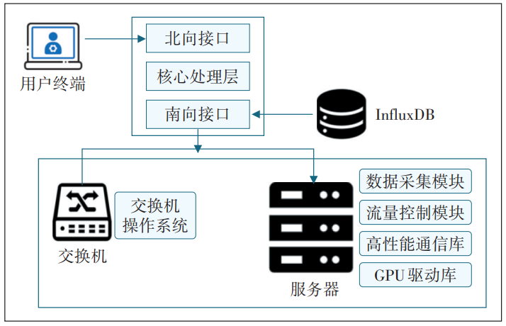
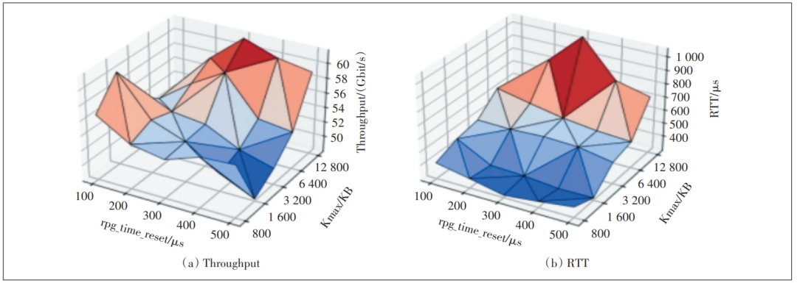
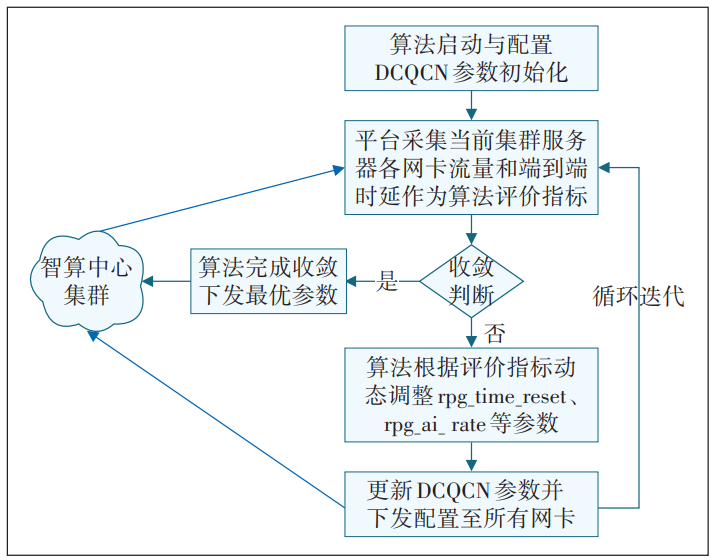

**摘 要**

为应对大规模智算中心运维复杂、性能保障难的挑战，研究基于端网协同的智能运维关键技术。以某省联通端网管控智能运维平台为例，分析精细化状态监测与告警、大规模网络拓扑，发现与“同轨拓扑”校验以及基于改进模拟退火的AI-DCQCN自适应拥塞控制等技术。结果表明，该方法能实现计算与网络资源深度关联分析与故障诊断，自动化拓扑校验保障网络架构正确性，AI-DCQCN技术可显著提升RDMA网络带宽（约20%）并降低时延。

  

**Part.1**

**概述**

** *1.1***

**研究背景与意义**

近年来，以大语言模型为代表的人工智能技术飞速发展，并快速渗透至社会各领域。其模型参数与训练数据规模的指数级增长，引发了对计算能力需求的爆炸式增长。为满足此需求，全球掀起建设智能计算中心（简称智算中心）的热潮，旨在提供大规模、高性能算力基础设施。

智算中心有着不同于传统数据中心的显著特征：超大规模计算集群（如“万卡集群”）、高性能互联网络（基于RDMA技术的低时延、高带宽、无损以太网RoCEv2）及复杂长周期的AI训练负载。这些特征给智算中心运维管理带来了严峻挑战。在规模与复杂性方面，对海量异构设备（GPU服务器、交换机、DPU等）的管理、状态监控和故障定位难度剧增。在性能与稳定性方面，AI训练任务对网络时延、带宽和零丢包极为敏感，任何微小网络抖动、拓扑错误或拥塞都可能导致计算效率大幅下降甚至任务失败，RDMA网络自身的复杂性（如PFC与拥塞控制的交互）也增加了稳定运行难度。在运维效率方面，传统依赖人工经验、被动响应的运维模式难以满足快速部署、高效优化和及时排障的需求。

在此背景下，研究和构建面向智算中心的智能化、自动化、端网协同运维系统已迫在眉睫。“端”指计算节点（服务器、GPU、网卡等），“网”指网络基础设施（交换机、链路等），端网协同旨在打破计算域与网络域壁垒，实现状态统一感知、问题智能诊断和资源联动优化。此类对智能运维系统的研究与实践，对保障大规模AI训练任务高效稳定运行、最大化智算中心投资回报率、支撑国家人工智能战略发展具重要理论意义和实践价值。

** *1.2***

**国内外研究现状**

国内外已开展大量针对数据中心及高性能计算集群运维管理的研究，相关技术正逐渐向智能化、自动化演进，成为AIOps研究热点。

在状态监测与告警方面，传统SNMP轮询难以满足智算中心对实时性和粒度的要求，相关研究转向基于流式遥测、gRPC等技术的精细化、高频数据采集。机器学习被应用于异常检测、根因分析和故障预测。部分研究探索通过大语言模型构建网络管理助手。然而，如何有效关联“端”（如GPU内部状态）与“网”（如RDMA网络参数）的细粒度指标，进行跨域深度诊断仍是挑战。

在网络拓扑管理方面，网络拓扑的准确性至关重要。此方面的研究包括利用LLDP、BGP-LS等进行物理和逻辑拓扑自动发现以及在SDN环境下由控制器统一管理拓扑信息。但在大规模智算中心场景，如何高效地进行拓扑一致性校验（规划与实际对比），特别是针对AI集群特有的“同轨”连接等特殊优化拓扑的自动化校验，相关研究尚不充分。

在RDMA网络优化方面，RoCEv2作为主流技术，其拥塞控制机制是研究热点。DCQCN是被广泛应用的基础算法，但其静态参数的局限性日益凸显。虽有HPCC、TIMELY等改进方案，但部署时可能需修改硬件或协议栈，存在实现复杂度和成本高的问题。利用AI/ML方法自适应优化DCQCN参数成为更具实践性的探索方向，但设计低开销、高效率、鲁棒性强的在线优化算法仍是关键。

在端网协同与AIOps集成方面，端网协同与AIOps的集成是重要趋势，但能全面覆盖监控、拓扑、拥塞控制等多方面，并实现深度端网协同的一体化智能运维平台，特别是在大规模RDMA智算中心场景下的实践案例和深入研究仍相对较少。

** *1.3***

**研究目标与创新点**

本文旨在研究基于端网协同的智算中心智能运维系统关键技术，并以“某省联通端网管控智能运维平台”研发实践为例进行阐述和验证。具体研究目标包括：精细化、关联化的端网状态监测与智能告警机制；大规模智算网络拓扑发现与一致性校验技术，包括“同轨拓扑”等AI集群特有的校验方法；基于AI的RDMA网络自适应拥塞控制技术。

本文主要创新点如下：第一，提出一套面向RDMA智算中心的端网协同智能运维框架并进行了实践，该框架整合了关键技术，强调计算域与网络域的联动；第二，深入研究并验证AI-DCQCN技术的有效性，展示改进模拟退火算法动态优化DCQCN参数提升网络性能的成效，提供低开销、易部署的RDMA网络优化方案；第三，聚焦智算网络特有的运维痛点，重点研究“同轨拓扑校验”等针对AI集群优化需求的特定技术；第四，对基于“某省联通端网管控智能运维平台”案例进行分析，使研究内容更具落地性和参考价值。

  

**Part.2**

**平台系统架构设计**

为应对智算中心运维挑战，某省联通端网管控智能运维平台作为一种端网一体化智能运维的实践，面向智算中心复杂异构网络场景，通过统一资源纳管、状态实时监测、异常快速定位和自动调优机制，支撑超大规模GPU训练任务稳定运行。

** *2.1***

**系统总体架构**

某省联通端网管控智能运维平台（简称“平台”）采用分布式模块化设计（见图1），包括用户界面层、核心逻辑层和网络数据接入层。北向提供统一标准服务接口，支持CLI和Web 2种用户交互界面。核心逻辑层控制组件部署于管理服务器，承担核心策略控制、指令下发与状态展示功能。网络数据接入层组件Agent以轻量化守护进程的方式部署在计算服务器和交换机节点上，实现资源状态采集、任务执行与本地回传。平台通过SNMP、gRPC等标准协议与设备交互，支持标准以太网环境下的广域部署。

**图1 某省联通端网管控智能运维平台系统架构**

平台架构兼容主流操作系统（如Ubuntu、Centos），并支持在Kubernetes容器编排环境中运行。在数据存储方面，该平台采用MySQL与InfluxDB分离存储，分别负责结构化信息与高频时序数据的管理。此架构设计具备良好的扩展性与异构兼容性，可覆盖万卡级别的智算中心环境。

** *2.2***

**核心功能模块**

平台聚焦“统一感知—智能判断—自动处理”的闭环管控目标，围绕算力资源、网络拓扑、告警管理、运维工具等方面，构建了完善的功能体系。

2.2.1 资源可视与多租户管理

平台支持对GPU服务器、交换机、光模块等资源的统一识别与拓扑构建，可实时展示设备间连接关系、运行状态及负载情况。引入多租户资源隔离机制，实现按租户划分服务器资源的访问权限，保障“资源共享、数据隔离”的并行运维模式。

2.2.2 网络拓扑发现与一致性校验

平台基于LLDP协议自动构建静态拓扑关系，结合导入的规划拓扑信息，实现网络拓扑的实时一致性校验。特别具备AI集群特有的“同轨连接”检查能力，有效辅助识别拓扑误连、不一致等问题，提升网络部署准确性，最大化AI训练时的网络性能。

2.2.3 智能监控与告警体系

平台内置状态监测模块，支持对Nvidia、昇腾等多型号异构GPU的关键指标进行时序采集与可视化呈现，通过PFC、CNP、DCQCN状态、端口流量统计等维度反映网络运行状态。集成巡检机器人与告警中心，支持多维度告警规则设定，并通过Webhook接入邮件、企业微信等通知渠道，实现故障闭环与及时响应。

  

**Part.3**

**核心功能模块与**

**关键技术**

本章重点研究精细化状态监测与智能告警、大规模网络拓扑发现与一致性校验、基于AI的自适应拥塞控制这3项关键技术。

** *3.1***

**智能监控与告警技术**

智算中心的正常运行依赖底层硬件和网络健康，传统孤立监控难以有效应对该问题，需精细化、智能化、具备关联分析能力的监测告警。面向智算特征的多维数据采集是基础，需深入监控核心组件：GPU深度指标（利用率、功耗、温度、显存、NVLink带宽等，秒/毫秒级采样），RDMA网络关键技术（RoCE网络PFC/ECN计数、DCQCN状态、端口错包/丢包）以及物理层健康度（光模块参数）。平台通过Agent采集并存入时序数据库。

** *3.2***

**大规模网络拓扑感知与一致性校验技术**

网络拓扑是智算的“骨架”，其正确性直接决定通信性能的上限，尤其影响AllReduce等集合通信操作的效率。由人工确认大规模集群的线缆准确性几无可能，自动化发现与校验成为研究重点。

基于LLDP协议的自动拓扑发现，交换机和服务器可发现其直连接口对端设备信息，并由此动态构建网络拓扑图。该过程的关键在于拓扑一致性校验与可视化：校验实际与规划拓扑的连接存在性/正确性、端口状态，特别是智算网络特有的“同轨拓扑”校验。该校验验证GPU—网卡—交换机端口映射是否符合特定通信模式优化设计，对保证集群达到理论聚合带宽、避免局部热点至关重要。通过探测实际连接与GPU-NIC绑定，并与预设“同轨”规则进行对比，显示“错轨”并可视化呈现差异。

** *3.3***

**AI-DCQCN自适应拥塞控制技术**

在采用ROCE构建的智算中心无损网络中，拥塞控制机制对保障低时延、高吞吐和零丢包至关重要。DCQCN作为当前广泛应用的拥塞控制算法，其核心思想是通过网络设备（交换机）检测拥塞并标记ECN，由接收端反馈CNP给发送端，发送端根据收到CNP信息调整发送速率。然而，DCQCN性能表现高度依赖一系列复杂参数配置，包括控制速率增加的提速时间间隔（rpg\_time\_reset）、加性增加速率（rpg\_ai\_rate）、超速增长速率（rpg\_hai\_rate），以及控制速率下降的最大下降比例（rpg\_min\_dec\_fac）、降速监控周期（rate\_re‑duce\_monitor\_period）等数十个参数。

3.3.1 传统DCQCN参数调优的困境

传统手动参数调优面临严峻挑战，具体如下。

a）参数间高度耦合与非线性影响。DCQCN参数并非独立作用，它们间存在复杂的相互影响。参数间调整对网络性能的影响如图2所示，实验研究表明，简单调整单参数可能带来性能提升错觉，但同时调整多参数时，网络吞吐量（Throughput）和RTT（Round-Trip Time）往往呈现非单调、凹凸变化的复杂关系。过于激进的参数组合可能导致过度注入、队列堆积，反而触发更多CNP甚至PFC，导致性能意外下降。

**图2 参数间调整对网络性能的影响**

b）调优复杂度高与可复用性差。参数众多且相互耦合，使通过遍历或简单试错来寻找全局最优解极为困难，时间复杂度极高。更重要的是，不同规模、拓扑、硬件构成的智算集群，其最优参数组合往往不同，导致手动调优结果难以在不同集群间复用。

c）无法适应动态负载。AI训练负载具有高动态性和突发性，静态配置的DCQCN难以实时适应变化的流量模式和网络状况，导致资源利用率低或性能抖动。

3.3.2 面向智算网络的AI-DCQCN技术研究

为了克服手动调优的局限性，研究基于智能化算法的DCQCN参数自适应优化技术成为必然趋势。与需要消耗额外算力且可能存在模型泛化问题的深度强化学习等方法相比，采用基于启发式算法的自动调优方法，具有与现有系统耦合度低、无需额外算力消耗、适应场景广泛等优点。以“某省联通端网管控智能运维平台”集成的AI-DCQCN功能为例，探索该技术的实现原理与实践。AI-DCQCN在实验中采用了基于改进模拟退火的算法。

AI-DCQCN的核心是一个闭环的“感知—评估—决策—执行”自适应优化系统（见图3），其关键技术环节如下。

**图3 AI-DCQCN自适应优化系统**

**3.3.2.1 精准实时的状态感知（Sensing）**

精准实时的状态感知是算法决策的基础，平台须具备从集群中所有相关服务器网卡实时、高精度采集关键性能指标的能力。采集的指标包括：

a）瞬时流量：反映当前网络负载，支持毫秒级流量监控。

b）端到端时延（RTT）：反映网络拥塞和传输路径状况。利用ib\_send\_lat等探测手段获取。这些指标共同构成算法迭代过程中的性能评价指标。

**3.3.2.2 基于改进模拟退火的智能决策（Decision）**

该算法的目标是根据实时评价指标，动态搜索并确定一组最优DCQCN参数组合，其特点如下。

a）多参数协同调整。同时优化速率增加（rpg\_time\_reset，rpg\_ai\_rate，rpg\_hai\_rate）、速率降低（rpg\_min\_dec\_fac，rate\_reduce\_monitor\_period）、边界条件（rpg\_min\_rate， rpg\_byte\_reset，min\_time\_be‑tween\_cnps）等多个关键DCQCN参数。

b）探索与利用平衡。模拟退火算法通过“温度”参数控制搜索过程。

（a）迭代前期（高温区）：采用大步长调整参数，并根据参数特性设置不同的增减趋势概率（如倾向rpg\_ai\_rate，减少rpg\_time\_reset），充分探索参数空间，避免局部最优。

（b）迭代中期（中温区）：调整参数增减概率（如各50%），允许参数逆向调整，增加跳出局部最优的可能性。

（c）迭代后期（低温区）：采用较小步长（如原步长1/4），在当前最优解附近精细搜索，以获得更优参数。

（d）可靠实时的参数执行（Actuation）：优化后的参数需被快速、可靠地下发至集群中所有服务器网卡。例如，某省联通端网管控智能运维平台通过Master-Agent架构，利用gRPC等通信机制，将控制器计算出的新参数实时推送并应用到各节点。

  

**Part.4**

**应用实践与效能分析**

** *4.1***

**关键技术赋能的典型应用场景**

大模型训练周期长，对计算和网络性能的稳定性与极致性要求高，因此组合应用关键技术至关重要。

a）训练前环境校验。在启动大规模训练任务前，利用自动化拓扑一致性校验，确保物理连接符合最佳实践，消除因布线错误导致的潜在性能瓶颈。同时，运用自动化性能诊断工具集对参与训练的节点进行通信性能基准测试（NCCL测试），剔除慢节点，保证智算集群健康。

b）训练中性能优化。在训练过程中，AI-DCQCN技术根据实时监测到的网络负载和时延，动态调整RoCE网络拥塞控制参数，抑制网络拥塞，最大化有效带宽利用率，从而缩短模型训练时间。

c）训练中状态监控。精细化状态监测技术实时追踪GPU利用率、功耗、温度及网络关键指标。运维人员可通过可视化监控大盘直观掌握训练集群的运行状态，及时发现与训练任务相关的性能抖动或异常。

智算中心组件多、依赖复杂、故障定位难。智能运维技术旨在缩短故障处理时间，变被动响应为主动预防。

a）快速故障定位。当训练任务中断或性能下降时，基于关联分析的智能告警系统能够整合不同层面（GPU错误、网络端口Down、PFC计数突增、光模块功率异常等）的告警信息，并结合实时与历史监控数据，帮助运维人员快速缩小故障范围，定位根因，显著降低MTTD（Mean Time To Detect）和MTTR（Mean Time To Repair）。自动化诊断工具（如“寻找慢节点”）也可按需运行，辅助定位疑难杂症。

b）主动健康管理。通过光模块健康度检测等方式，在硬件彻底失效前识别潜在风险，触发预防性维护，避免业务中断。对历史警告数据和监控指标进行趋势分析，识别易故障设备或链路，指导维护资源投入。

c）自动化巡检与闭环。配置机器人巡检任务（如服务器可达性、GPU状态、关键端口连通性），定期自动检查集群健康状况，异常时自动告警并通过Web‑hook等方式接入第三方系统，通知运维团队，形成自动化运维闭环。

** *4.2***

**性能评估指标**

衡量效能需要科学的评估体系，主要维度有：网络与计算性能指标（有效带宽、通信延迟、丢包率、作业完成时间JCT、GPU利用率），运维效率指标（MTTD、MTTR、自动化水平、告警准确率与信噪比）以及资源利用率指标（网络链路利用率、计算资源利用率）。

** *4.3***

**实际部署成效分析**

AI驱动的网络性能优化成效显著，AI-DCQCN实践数据表明，较默认/专家调优方式，本方案使RDMA网络带宽平均提升约19.5%（24节点带宽从30.4 GB/s至38.2 GB/s），时延降低，负载适应性增强。

在运维效率与稳定性改善（定性分析）方面，自动化拓扑校验、智能告警关联、诊断工具预计将显著缩短MTTD/MTTR；主动运维（如光模块监测）提高系统稳定性；自动化（AI-DCQCN、拓扑校验、性能测试）降低人力成本和技能要求；可视化提升运维体验。

  

**Part.5**

**结束语**

本文针对大规模智算中心所面临的运维挑战，研究了基于端网协同的智能运维关键技术，并以“某省联通端网管控智能运维平台”的实践为背景，分析了3项核心技术的实现方式和成效。在精细化状态监测与智能告警方面，强调深入采集GPU和RDMA网络等核心组件状态，结合关联分析、主动预警等智能化手段，提升告警的准确性和可行动性；在大规模网络拓扑发现与一致性校验方面，阐述自动化拓扑发现与校验的必要性，探讨了面向AI集群优化需求的“同轨拓扑”校验技术及其对网络性能保障的关键作用；在基于AI的自适应拥塞控制（AI-DCQCN）方面，利用改进模拟退火算法对DCQCN参数进行动态优化，并通过实证数据验证其在显著提升RoCEv2网络性能、降低时延和增强负载适应性方面的有效性。研究表明，将这些关键技术集成于端网协同的智能运维框架中，可有效应对智算中心复杂运维需求，确保AI训练任务高效稳定运行，进一步提升资源利用率与运维效率。

尽管本文探讨的技术展现了显著优势，但在实践中仍存一些局限性。由于智算中心的设备可能来自不同供应商，运维系统需持续适配各类硬件接口和私有特性以实现统一监控和管理，因此在异构硬件兼容性方面仍存在挑战。随着集群规模向十万卡甚至百万卡级别演进，网络直径增大、控制信令延迟等问题将愈加突出，现有拓扑管理、拥塞控制、故障诊断技术在超大规模环境下的可扩展性和实时性将面临考验。虽然AI-DCQCN等智能优化算法效果显著，但它们对特定网络环境、流量模式及硬件平台具有一定依赖，在更广泛和更复杂场景下的泛化能力与鲁棒性仍需进一步验证和提升。此外，当前基于告警关联与指标分析的根因定位方法在面对复杂偶发的“静默”故障或多因素耦合故障时，其定位深度与准确性也还有较大提升空间。

  

**作者简介**

杜量，中级工程师，硕士，主要从事算力网络、人工智能方向的研究工作；

曾楚轩，高级工程师，博士，主要从事算力网络、人工智能方向的研究工作；

邓玲，正高级工程师，硕士，主要从事算力网络、5G无线、传输网络方向的研究工作；

杨杰，中级工程师，硕士，主要从事算力网络、超智算集群架构方向的研究工作；

周钰，助理工程师，硕士，主要从事下一代互联网方向的研究工作；

曹畅，正高级工程师，博士后，主要从事算力网络、下一代互联网等方向的研究工作。

延伸阅读 |   
[数据中心机房规划、建设及运维管理，值得收藏学习！](https://mp.weixin.qq.com/s?__biz=MzA4NDkwNDI2OQ==&mid=2651033127&idx=1&sn=86121355b92a5a5c3d4db2496c491720&scene=21#wechat_redirect)[建成不是终点！数据中心A级标准满载测试，筑牢数字底座安全防线](https://mp.weixin.qq.com/s?__biz=MzA4NDkwNDI2OQ==&mid=2651033119&idx=1&sn=e37a40d18147270ebb94b45ad18f480a&scene=21#wechat_redirect)

[AI算力狂飙，800V高压直流+绿电直连或成下一代数据中心标配](https://mp.weixin.qq.com/s?__biz=MzA4NDkwNDI2OQ==&mid=2651033035&idx=1&sn=711908e874ea2d6910ae2f4bff0456cc&scene=21#wechat_redirect)

[2025年数据中心行业重大宕机事件盘点](https://mp.weixin.qq.com/s?__biz=MzA4NDkwNDI2OQ==&mid=2651033154&idx=1&sn=5dffabbd7e090ce6a7964285c9f48971&scene=21#wechat_redirect)

[一份全面的机房搬迁方案，一个ppt详解](https://mp.weixin.qq.com/s?__biz=MzA4NDkwNDI2OQ==&mid=2651033166&idx=1&sn=bead4c18cf4b0f0ddfc2632a4a17edf7&scene=21#wechat_redirect)