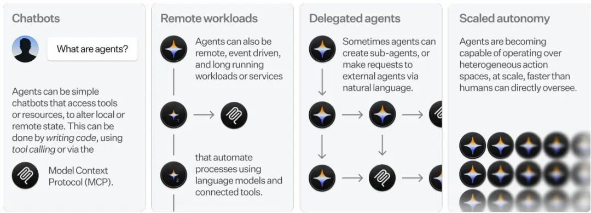
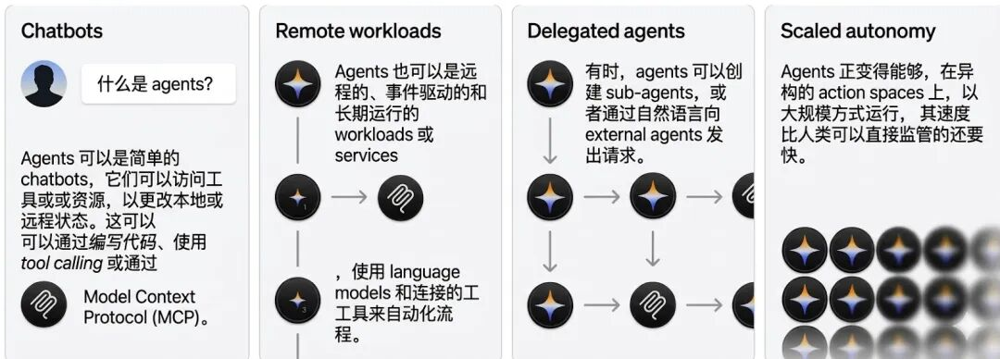
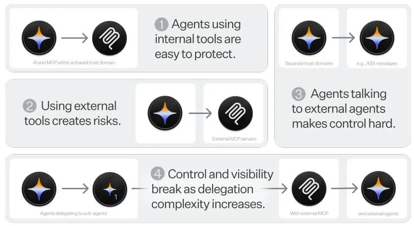
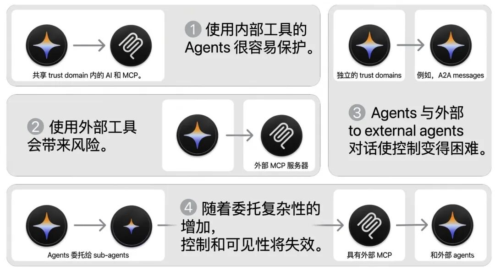

本文是 OpenID 前段时间发布的《Identity Management for Agentic AI》的中文翻译版本。

> 本文译自 https://openid.net/wp-content/uploads/2025/10/Identity-Management-for-Agentic-AI.pdf

# 智能体 AI 的身份管理 \(Identity Management for Agentic AI\)

AI 智能体世界中授权、认证与安全的新前沿

主编：Tobin South

2025年10月

## 执行摘要

AI 智能体的快速崛起在认证、授权和身份管理方面带来了紧迫的挑战。当前以智能体为中心的协议（如 MCP）凸显了对明确的认证和授权最佳实践的需求。展望未来，实现高度自主智能体的愿景引发了关于可扩展访问控制、以智能体为中心的身份、AI 工作负载区分以及委托授权等复杂的长期问题。本白皮书面向处于 AI 智能体与访问管理交叉领域的利益相关者。它概述了保护当今智能体可用的现有资源，并提出了一个战略议程，以解决对未来广泛普及的自主系统至关重要的基础性认证、授权和身份问题。

### 当今的框架可处理简单的 AI 智能体场景：

  * • **AI 智能体与传统软件存在根本区别** ；它们对外部服务采取自主行动，表现出非确定性、灵活且能实时适应的行为，而不仅仅是执行预定的指令。
  * • **现有的 OAuth 2.1 框架用于 AI 智能体时，在具有同步智能体操作的单一信任域内表现良好** （例如，访问内部工具的企业智能体，消费者通过 AI 工具访问其服务），但在跨域、高度自主或异步的场景中，以及需要智能体同时代表多名人类用户使用或执行委托权限的场景中，可能会显得力不从心。
  * • **模型上下文协议 \(MCP\) 在采用率上处于领先地位** ，它是构建智能体时连接语言模型与外部数据源和工具的关键框架。其他方法依然存在且应得到支持，包括函数调用（工具使用）和智能体对智能体（例如 A2A）通信协议。
  * • **企业单点登录 \(SSO\) 和 SCIM 配置有助于启用企业智能体** ，并促进集中的智能体生命周期管理，以及对各种 AI 智能体用例的权限和访问进行治理。
  * • **企业安全规范 \(Profiles\) 为安全采用 AI 提供了基线** 。为降低风险，本文建议 AI 智能体应符合现有身份标准中严格且可互操作的规范。诸如“企业安全身份互操作性规范 \(IPSIE\)”等工作组可对此提供指导，通过确保实施稳健的控制措施，让组织有信心采用 AI。
  * • **以用户为中心的同意模型是消费者智能体的基础** 。对于连接第三方消费者服务（如电子邮件、社交媒体、财务数据）的智能体，已建立的 OAuth 2.1 用户同意流程是授予委托授权的主要机制，因此透明度和清晰的范围 \(Scope\) 定义对于用户信任至关重要。

### 未来存在关键挑战：

  * • **应避免智能体身份碎片化** 。供应商可能会开发专有的智能体身份系统，这将迫使开发者进行重复的一次性集成，从而降低开发效率。此外，创建多种安全模型（每种模型都有不同的风险和漏洞）也会损害安全性。
  * • **智能体对用户的模拟应被委托授权所取代** 。目前，智能体的行为往往与用户难以区分，从而造成了问责缺口和安全风险。真正的委托需要明确的“代表（on-behalf-of）”流程，在此流程中，智能体在证明其委托范围的同时，仍可被识别为与其代表的用户不同的实体。
  * • **人类监督和用户同意存在可扩展性问题** 。随着智能体的激增，用户将面临数以千计的授权请求，从而因下意识批准而产生安全风险。灵活智能体的预先授权和范围界定与最小权限原则相矛盾。
  * • **递归委托会产生风险** 。生成子智能体或向其他智能体传达任务的智能体会创建复杂的授权链，且缺乏清晰的范围衰减 \(scope attenuation\) 机制。
  * • **代表并向人类团队汇报的智能体缺乏支持** 。虽然 OAuth 和 OpenID Connect 是为个人用户授权而设计的，但智能体可被用于群组中的共享代码库或聊天频道。在这些多用户环境中，不同用户可能拥有不同级别的权限，但都在单一语境下共享同一目标。目前尚无流行的协议支持共享智能体。
  * • **可信的自主性缺乏自动化验证** 。要超越“人在回路 \(human-in-the-loop\)”的安全模型进行扩展，需要新的程序化方法，以确保智能体的行为持续符合其操作目标和约束。
  * • **浏览器和计算机操作 \(computer-use\) 智能体打破了当前的授权范式** 。直接（或通过 MCP 进入浏览器编排器）控制视觉界面的智能体绕过了所有传统的基于 API 的授权控制。保护开放网络免受封锁，将需要对网络机器人或网络智能体进行强有力的认证。
  * • **智能体的多面行为使身份问题复杂化** 。技术进步允许智能体自主行动，这要求智能体拥有自己的凭证、权限和审计线索。此外，智能体的性质可能是混合的，使其能够在独立执行和代表用户行动之间切换。

## 目录

**1 这次智能体有何不同？** 5

1.1 定义 AI 智能体 5

1.2 智能体需要特定的认证与授权 6

1.3 目标读者 6

**2 针对当前用例的即时解决方案** 8

2.1 智能体及其资源 8

2.2 智能体协议 8

2.3 MCP 9

2.4 认证 9

2.5 动态客户端注册 10

2.6 授权 10

2.7 智能体的异步授权 10

2.8 AI 智能体的身份 11

2.9 SSO 与配置 12

2.10 智能体身份与授权的运营化 13

2.11 弥合可审计性差距 13

2.12 应用安全护栏 14

2.13 智能体对智能体 14

2.14 即时解决方案总结 14

**3 自主智能体身份与授权的未来问题** 17

3.1 智能体身份的架构模型 17

3.2 委托授权与传递信任 18

3.3 注册表与外部工具的动态连接 20

3.4 可扩展的人类治理与同意 20

3.5 高级挑战与更广泛的影响 22

3.6 经济层：身份、支付与金融交易 23

3.7 第3部分总结 24

**4 稳健的智能体授权示例用例** 25

4.1 高速智能体与同意疲劳 25

4.2 异步执行与持久委托授权 25

4.3 跨域联合与可互操作信任 25

4.4 动态智能体网络中的递归委托 26

4.5 IAM 作为信息物理智能体的安全系统 26

4.6 代表多名用户行动的智能体 27

**5 结论** 28

# 智能体 AI 的身份管理 \(Identity Management for Agentic AI\)：

## AI 智能体世界中授权、认证与安全的新前沿

Tobin South, Subramanya Nagabhushanaradhya, Ayesha Dissanayaka

Sarah Cecchetti, George Fletcher, Victor Lu, Aldo Pietropaolo

Dean H. Saxe, Jeff Lombardo, Abhishek Shivalingaiah, Stan Bounev

Alex Keisner, Andor Kesselman, Zack Proser, Ginny Fafs

Andrew Bunyea, Ben Moskowitz, Atul Tulshibagwale

Dazza Greenwood, Jiaxin Pei, Alex Pentland

## 贡献者

本报告由 Tobin South 于 2025 年 4 月启动，为 OpenID 基金会 \(OpenID Foundation\) 编写。报告是与人工智能身份管理社区组 \(Artificial Intelligence Identity Management Community Group\)、斯坦福忠诚智能体计划 \(Stanford's Loyal Agents Initiative\) 以及众多独立审阅人和贡献者合作完成的。特别感谢 WorkOS 支持了本报告的完成，提供了作者的时间，并为测试本文中的观点做出了实际贡献。

许多合作者、共同作者、顾问和审阅人对本作品做出了贡献。特别感谢以下人员的直接贡献：Subramanya Nagabhushanaradhya, Sarah Cecchetti, Ayesha Dissanayaka, George Fletcher, Aaron Parecki, Pamela Dingle, Tom Jones, Aldo Pietropaolo, Lukasz Jaromin, Tal Skverer, Wils Dawson, Andor Kessleman, Stan Bounev, Kunal Sinha, Bhavna Bhatnagar, Nick Steele, Abhishek Maligehalli Shivalingaiah, Victor Lu, Chris Keogh, Govindaraj Palanisamy \(Govi\), Alex Keisner, Mahendra Kutare, Pavindu Lakshan, Michael Hadley, Zack Proser, Cameron Matheson, Dan Dorman, Zack Prosner, Alex Pentland, Jiaxin Pei, Dazza Greenwood, Ginny Fahs, Andrew Bunyea, Ben Moskowitz, Atul Tulshibagwale, Jeff Lombardo, Elizabeth Garber, 以及 Gail Hodges。

## 1 这次智能体有何不同？

理解 AI 智能体独特的身份、认证、授权和审计需求的第一步，是确切地定义它们是什么以及它们为何不同。

image

图 1：不同类型 AI 智能体的示例，以及它们如何在不断提高的自主性水平上使用工具，例如模型上下文协议 \(MCP\)。

### 1.1 定义 AI 智能体

AI 系统正席卷全球，形式多种多样，从使用语言模型的聊天界面到使用传统机器学习技术的内部工作流自动化。在本文语境中，界定 AI 智能体的关键在于，**基于 AI 的系统能够在模型推理时根据所做的“决策”采取“行动”以实现特定目标的能力** 。这超越了仅生成文本输出的简单聊天机器人。与遵循预定义规则和指令的传统软件不同，AI 智能体可以从上下文中学习，适应新情况，并自主做出决策。传统软件通常需要手动更新来处理新场景，而 AI 智能体利用上下文和推理来提高性能并进行适应。它们可以通过 API 以及专门的智能体通信协议（如模型上下文协议 MCP）或浏览器界面进行交互。其中一些行为可能类似于标准的远程工作负载或应用程序，但由于其高度灵活、非确定性和上下文相关的性质而截然不同。

通常，“智能体”被定义为使用语言模型与外部资源交互的、经过识别和授权的软件。在整篇文章中，需要考虑的智能体示例包括：

  * • 调用特定 AI 中心工具（通过 MCP）的、由语言模型支持的聊天界面。
  * • 使用语言模型的远程工作流自动化，其中系统输入会导致工具使用调用和数据库交互（即软件和语言模型在一个工作负载中集合，具有重复但非确定性的行为）。
  * • 半自主的思维链式智能体，它们执行一系列连续步骤，并在文本“思考”与向外部工具或数据库发出请求之间交替进行。

虽然存在许多 AI 系统，但鉴于该技术目前的进展和投资，本文主要关注基于大型基础模型的智能体系统（例如 ChatGPT、Claude、Gemini、LLaMa，以及建立在这些模型之上并允许其访问外部工具的系统）。其他的智能体定义更加广泛，例如专注于网络搜索的 AI 系统或直接与计算机交互的计算机操作 \(computer-use\) 智能体。这些都是值得讨论的重要用例，但为了保持焦点清晰，这不在本文讨论范围内。

最后一个关键区别在于交互范式本身。传统软件客户端——无论是网络、桌面还是移动端——基于结构化、明确的用户输入（如点击按钮、提交表单或菜单选择）进行操作。这些动作代表了清晰、可审计的意图授权。相比之下，AI 智能体旨在解释非结构化和多模态输入。用户不仅可以通过文本，还可以通过文档、图像、录音或视频文件提供指令。例如，用户可能会上传一张扫描的发票图像并附带语音命令，或者转发一封复杂的电子邮件并通过其发出指令。这对智能体施加了巨大的解释负担，要求其从缺乏传统 UI 显式机器可读同意信号的数据中提取语义含义，识别委托授权的范围，并制定执行计划。指令点的这种模糊性是新认证和授权模型的主要驱动力。

### 1.2 智能体需要特定的认证与授权

所有在线工作负载都需要认证和授权——基于智能体的工作负载也不例外。然而，智能体正变得越来越自主，能够在与多个外部工具按顺序交互的同时参与多步骤流程。这引发了关于用户同意、特定监管影响（例如“人在回路”要求）、智能体治理以及在大规模和动态环境中的访问控制粒度的独特担忧。从服务的角度来看，智能体代表了一组非常特定的工作负载，这对如何处理它们具有重要影响，本文将对此进行概述。

此外，随着 AI 智能体和特定外部资源数量的增长，以及智能体操作复杂性的增加，对 AI 智能体交互进行手动或细粒度授权将变得难以为继。设计可扩展且稳健的信任、治理和安全系统对于在此规模下实现发现、注册和授权至关重要。

智能体具有高度灵活、非确定性以及连接外部资源的性质，这对智能体身份、治理、认证、授权、最小权限、审计及其他相关方面提出了特定挑战。这种灵活性源于解释复杂、非结构化输入并与动态外部资源集交互的需求，它给智能体身份、治理、认证、授权、最小权限和审计带来了特定挑战。这些挑战及其引发的问题是本白皮书的重点。

### 1.3 目标读者

本白皮书探讨了塑造 AI 智能体生态系统的三个主要群体所面临的独特但相互关联的安全和身份挑战：

  * • **对于 AI 实施者和架构师** ：它提供了关于使用 OAuth 2.1 等基础标准和 MCP 等新兴协议从头构建安全且可互操作的智能体系统的技术指导。
  * • **对于企业和安全领导者** ：它概述了治理、风险和集成策略，详细说明了如何应用 SSO 和 SCIM 等熟悉模型来管理智能体生命周期并确保合规性。
  * • **对于消费者平台和产品领导者** ：它侧重于用户信任的基础，解决可扩展同意、真正的委托授权以及设计对最终用户透明且安全的智能体交互等核心挑战。

**本报告第 2 部分总结了智能体身份和授权的现状，并指出了相关资源以供进一步研究** 。

高能力自主系统的近期发展将继续给 AI 智能体的授权和认证带来新的挑战和问题。

**第 3 部分探讨了这些高级 AI 系统可能产生的风险和挑战，不同身份和认证方法在降低风险方面可能发挥的作用，以及这些系统可能面临的挑战** 。

## 2 针对当前用例的即时解决方案

随着 AI 智能体的快速开发和推出，我们必须仔细考虑如何授权它们的活动并提供问责机制，确定它们代表谁行事，如何对它们进行认证、监控、审计、治理，以及授予这些智能体何种范围和权限。总体而言，本节基于现有的、广泛接受的规范，为当前的 AI 智能体实施提供指导。

### 2.1 智能体及其资源

从核心上看，与外部服务、数据源或工具交互的 AI 智能体充当着客户端应用程序的角色。无论是一个编排复杂工作流的复杂语言模型，还是一个较简单的自动化流程，只要其请求访问或操作超出自身操作边界的资源，就类似于传统软件客户端发出的请求。因此，适用于任何客户端应用程序的认证和授权基本原则对 AI 智能体同样至关重要。多年来在 Web 和移动应用程序中实施 OAuth、OpenID Connect 和其他认证技术所积累的丰富知识和既定最佳实践，为保护基于智能体的系统提供了一个坚实的起点。

AI 智能体可能会寻求访问各种各样的资源。这些资源可能包括通过 API 获取的结构化数据（例如客户关系管理、库存系统或财务数据），来自知识库或文档存储的非结构化信息，计算服务，甚至其他 AI 模型。智能体框架极其多样化，智能体与资源交互的机制也各不相同。由于智能体有时既可以充当客户端也可以充当服务器，因此讨论这一点可能比较困难。为了一般性的目的，我们可以将智能体视为向远程服务器发出请求的客户端工作负载（与用户同步或异步）。这些服务器必须可靠地识别智能体（和/或智能体代表其操作的用户），并确定其被允许执行的操作。

### 2.2 智能体协议

尤其是在大型语言模型 \(LLM\) 的背景下，智能体越来越多地使用专门定义的“工具”或“插件”。虽然不总是这样，但这些工具通常是对现有 REST API 的封装，配备了对其功能和输入参数的描述，旨在使 AI 模型能够发现并调用它们以执行特定操作，如发送电子邮件、查询数据库或获取实时信息。

AI 智能体日益增长的复杂性和自主性推动了专门通信协议的发展，以标准化智能体与远程服务或其他智能体的交互方式。虽然存在许多协议，但模型上下文协议 \(MCP\)\[1\] 似乎在采用率方面处于领先地位，而其他协议如智能体对智能体协议 \(A2A\)\[2\] 也获得了广泛的商业投资。本质上，MCP 旨在促进基于模型的接口与多样化的外部工具和数据资源生态系统之间的连接。MCP 本身的演变突显了稳健授权讨论的重要性：其最初的设计并未包含认证\[3\]，但随后的社区反馈和技术讨论促使积极整合了认证和授权方面的考量。

### 2.3 MCP

MCP 使用客户端-服务器架构为 AI 模型提供资源、提示和工具。资源是由应用程序控制的只读数据源，如文件或 API 响应，为模型提供上下文。相比之下，工具是由模型控制的功能，允许 AI 执行操作，例如调用外部 API 或运行计算。AI 应用程序（客户端）连接到 MCP 服务器以访问这些组件。其他功能正在考虑中，例如诱导 \(elicitation\)\[4\]（用于向智能体用户请求输入）以及用于与用户通信的动态 UI\[5\]。通信使用诸如 Streamable HTTP 或 stdio 等传输方式，通过允许服务器向客户端推送更新来支持异步操作。

鉴于其目前的发展轨迹、社区参与度及其发展的示例性质，本节中的大部分详细探讨将集中在 MCP 上。然而，所讨论的原则和挑战广泛适用于更广泛的 AI 智能体协议领域及其与外部资源的安全集成。

### 2.4 认证

稳健的认证是授权的关键先决条件，也是 AI 智能体安全访问资源的基础。任何服务的核心问题都是授权：该智能体此时是否被允许代表该实体执行此操作？认证提供了回答该问题所需的可验证的“谁”。当智能体代表用户行动时，必须解决两个不同的认证挑战：

  1. 1\. **智能体认证** ：智能体软件本身必须作为受信任的客户端进行认证。这确认了智能体是其声称的合法实体，通常（但不总是）通过工作负载标识符来建立。
  2. 2\. **用户认证与委托** ：人类用户必须经过认证，并且他们将特定权限委托给智能体的意图必须被捕获。

MCP 的持续演变突显了正确处理此事\[6\]的重要性。社区已趋向于使用 OAuth 2.1 作为标准框架，强制实施现代安全实践，如 PKCE（用于代码交换的证明密钥）\[17\]，以防止授权码拦截攻击。

一个关键的架构建议是，资源服务器（例如实施 MCP 的服务器）应将认证和授权决策外部化给专用的授权服务器或身份提供商 \(IdP\)，而不是实施专有逻辑。这种关注点分离是现代安全架构中的一项基础最佳实践，并在 MCP 规范\[7\]中得到推荐。它在单一信任域（如企业环境）内特别有效。它允许集中化的策略和身份管理，使 IT 管理员能够通过单点登录 \(SSO\) 使用现有的企业凭证来治理智能体配置和权限。这种方法还可以通过集中同意管理使用户受益；访问权限可以由更广泛的策略来治理，而不是针对智能体可能使用的每个单独工具批准权限，从而减少用户摩擦和同意疲劳的风险。

MCP 尚未完全标准化的一个重大挑战是，MCP 服务器如何代表智能体向游平台进行认证。在智能体向 MCP 服务器认证后，该服务器必须向最终工具（例如 Salesforce, GitHub）发出自己的经过认证的 API 请求。目前，这通常依赖于自定义实现。

最后，维护安全的智能体会话需要关注整个认证生命周期，尤其是对于异步操作。长时间运行的任务可能会超过初始访问令牌的寿命，因此需要安全的令牌刷新策略，且不能损害最小权限原则。这包括实施适当的令牌过期或撤销，维护所有认证事件的审计日志（可能与特定授权进行身份绑定），并确保在智能体凭证遭到破坏或不再需要时能及时撤销。

### 2.5 动态客户端注册

MCP 协议的可扩展性方法利用了动态客户端注册 \[16\]，允许任何客户端向服务器注册并获取凭证。虽然这种模式在“多对多”生态系统中提供了无摩擦的入职体验，但它引入了一个关键的安全漏洞：它创建了大量的匿名客户端。未经认证的公共注册端点允许在没有任何与真实开发者、组织或责任方链接的情况下创建客户端。这导致完全缺乏书面记录，为端点滥用（例如通过大规模注册进行的拒绝服务攻击）打开了大门，并使得稳健的客户端识别和证明变得不可能。对于任何企业或高安全性环境，这是一个高风险。

已经提出了各种方法将客户端链接到更稳健的身份。例如，客户端 ID 元数据 \[14\]，它建议为 MCP 支持基于 URL 的 OAuth 客户端 ID 元数据文档，允许客户端在 HTTPS URL 上托管元数据。服务器获取并验证它，以便在无需预先注册或动态注册的情况下建立信任。客户端 ID 元数据也可用于非 MCP 工作负载，其他替代的工作负载身份范式也是如此。

### 2.6 授权

在成功认证之后，授权规定了 AI 智能体被允许进行的具体操作。需要注意的是，正如目前的 MCP 规范所定义，授权治理的是 MCP 客户端与 MCP 服务器之间的关系。MCP 服务器获得代表用户访问下游 API 或资源的授权的机制是不同的。

在客户端-服务器交互中，授权利用了标准的访问控制模型，如基于角色的访问控制 \(RBAC\)、基于属性的访问控制 \(ABAC\) 或更细粒度的方法。鉴于语言模型通常具有非确定性，在部署 AI 智能体时，最小权限原则尤为关键 \[20\]。

### 2.7 智能体的异步授权

许多 AI 智能体工作流的异步性质，对于获取在初始授权授予中未涵盖的操作的用户批准，带来了根本性的挑战。当智能体自主运行时——可能在用户初始指令后数小时或数天执行任务——要求对敏感操作进行实时授权变得不切实际。客户端发起的反向通道认证 \(Client Initiated Backchannel Authentication, CIBA\) \[7\] 通过将授权请求与用户的认证响应解耦，提供了一个解决方案。CIBA 允许客户端通过带外机制启动最终用户的认证，使智能体能够在请求授权的同时继续处理，等待用户批准。

这种架构特别适合 AI 智能体，原因有三：智能体可以请求高风险操作的授权，而无需阻塞其整个工作流；用户在其认证设备上收到通知，可以在方便时批准或拒绝请求；系统维护所有授权决策的清晰审计线索。CIBA 支持三种交付模式——轮询 \(poll\)、探测 \(ping\) 和推送 \(push\)——每种模式都针对不同的智能体架构进行了优化。在轮询模式下，智能体定期检查授权状态，这是批处理场景的理想选择。探测模式涉及授权服务器在决策可用时通知智能体，从而减少不必要的网络流量。推送模式将完整的授权结果直接传递给智能体，从而实现最快的响应时间。对于在需要“人在回路（human-in-the-loop）”监督的监管框架下运行的 AI 智能体，CIBA 提供了一种标准化机制，既能确保有意义的人类控制，又不会降低用户体验。该协议对绑定消息 \(binding messages\) 的支持允许智能体提供关于请求操作的丰富上下文，即使与原始任务启动相隔很长时间，也能帮助用户做出明智的授权决策。

基于这些带外原则，模型上下文协议 \(MCP\) 还支持一种“诱导 \(elicitation\)”能力，该能力可以通过“URL 模式”进行扩展 \(SEP-1036\[8\]\)。此机制允许 MCP 服务器通过浏览器将用户引导至一个外部受信任的 URL，进行不应通过 MCP 客户端本身传递的敏感交互。这对于获取第三方 OAuth 授权、安全收集凭证或处理支付流程尤为相关，且不会将敏感数据暴露给中间系统。通过利用标准 Web 安全模式和清晰的信任边界，URL 模式诱导提供了一个安全管道，用于获取明确的用户同意或凭证，然后由 MCP 服务器使用这些凭证完成委托操作。这确保了即使是高度敏感或跨域的授权也能得到安全、异步的处理，并在需要时保持人类监督。

### 2.8 AI 智能体的身份

在 AI 智能体的背景下，身份的概念是多方面的，不仅限于简单的用户模拟，且在认证、授权和可审计性中发挥着关键作用。

在当前使用 MCP 的实践中，用户交互的主机（例如 Claude Desktop 或 Cursor 等编程 IDE）连接到 MCP 客户端以管理与特定 MCP 服务器的通信（注意，主机和 MCP 客户端可能具有不同的标识符）。带有 PKCE 的 OAuth 2.1 用于保护智能体到 MCP 服务器的认证流程。虽然此 MCP 客户端带有在动态客户端注册期间生成的客户端 ID，但这并不是一个稳健的独立工作负载身份。尽管客户端 ID 元数据可以为系统用户（例如，使用 MCP 的 Claude Desktop）提供更稳健的标识符，但这作为工作负载身份或 AI 智能体标识符仍然不足。

此处可以使用其他工作负载身份标准来为 AI 智能体创建稳健的标识符。例如，面向所有人的安全生产身份框架 \(SPIFFE\) 及其运行时环境 SPIRE 提供了一个模型。SPIFFE 提供了一种标准化的身份格式和一种自动向工作负载颁发加密可验证身份文档 \(SVID\) 的机制，无论其在何处运行。通过与 SPIRE 集成，可以为 AI 智能体配置一个短期、自动轮换的身份，该身份可用于与其他服务进行相互认证，从而在不依赖 API 密钥等静态共享机密的情况下建立信任。

虽然 SPIFFE/SPIRE 模型在受控基础设施内建立可验证身份方面功能强大，但它从根本上依赖于对该基础设施的了解和控制来证明工作负载的身份。这给 AI 智能体带来了重大挑战，因为 AI 智能体旨在跨越异构信任边界运行，而在这些边界中，这种基础设施级信任是不共享的。智能体的身份必须是可移植的，并且对于对其宿主环境不可见的第三方是可验证的。

然而，即使是像 SPIFFE/SPIRE 这样稳健的工作负载身份框架，也可能无法完全满足大规模智能体系统的独特需求。传统工作负载的身份确认其是“什么”，但在智能体的背景下，其“行为”同样重要。智能体身份必须富含有关其底层模型、版本和能力的元数据，以实现基于风险的访问控制。此外，由于智能体旨在跨组织边界运行并代表用户行事，其身份必须具有高度可移植性，并原生设计为与 OAuth 2.1 的委托授权模型集成。这种对动态行动者更复杂、可治理且可互操作的身份的需求，正是新兴的特定于智能体的身份解决方案旨在填补的空白。

对更负责任和功能更丰富的身份模型日益增长的需求，正推动商业身份与访问管理 \(IAM\) 市场的重大转变。认识到传统的服务账户不足以满足 AI 智能体的动态生命周期和独特治理需求，身份供应商已开始将其视为一等实体。除了在客户端注册期间分配的身份外，供应商正在开发和推出专用的 AI 身份管理解决方案（例如 Microsoft Entra Agent ID、Okta AIM 等）。这些平台旨在使用类似于人类用户的工作流来支持智能体的发现、批准和审计。这些方法与传统的 IAM 服务账户有相似之处，但专为满足智能体跨信任边界自主交互的需求而构建。这些智能体身份系统之间的互操作性仍然有限，除非它们趋同于通用标准，否则供应商将开发专有方法。

很大一部分智能体活动涉及代表人类用户行事。典型的工作流目前并不针对这一点，我们将在更具前瞻性的第 3 部分关于委托身份中讨论支持这些“代表（on-behalf-of）”范式。

### 2.9 SSO 与配置

AI 智能体的企业部署需要一个稳健的身份管理基础设施，以便与现有的企业系统集成。通过联合身份提供商实现的单点登录 \(SSO\) 能够使用户使用其现有的企业凭证访问智能体平台和管理界面。这种已建立的人类身份模式必须扩展到非人类的智能体身份。

跨域身份管理系统 \(SCIM\) \[10\] 协议是自动管理用户生命周期的标准，通过与 HR 系统同步访问权限，在员工加入、职位变动或离开组织时授予、更新或撤销权限。这种生命周期管理对于智能体本身同样至关重要，因为它们需要正式的创建、权限分配和最终的退役流程。为了解决这个问题，目前正在开展实验性工作，旨在扩展 SCIM 协议以正式支持智能体身份。例如，提议的《跨域身份管理系统：智能体身份架构草案》\[22\] 定义了一种新的 AgenticIdentity 资源类型。这允许在 IAM 系统中将智能体视为一等实体，拥有其自己的属性、所有者和组成员资格。

通过使用扩展的 SCIM 模式，组织可以像配置用户一样将智能体配置到服务中。这实现了集中的 IT 管理，使得智能体权限不再通过临时流程管理，而是由用于管理人类员工的相同自动化、策略驱动的工作流进行治理。随着 AI 智能体的普及并需要访问多个企业应用程序，集中管理其生命周期和同意流程对于维护安全性、合规性和运营效率变得至关重要。利用 SCIM 等标准化协议实现此目的，使企业能够对这类新身份应用熟悉的治理模型。

关键是，这种生命周期管理必须延伸到一个稳健且可验证的取消配置 \(de-provisioning\) 流程。智能体的“离职”是一个关键的安全功能，代表其生命周期中最后的权威步骤。当智能体退役时——或者更紧急的是，当其身份被怀疑受损时——仅仅撤销其当前凭证是不够的。正式的取消配置信号，例如对智能体 AgenticIdentity 资源执行的 SCIM DELETE 操作，可确保身份本身被永久移除。此操作必须传播到所有集成系统，保证智能体及其所有相关权利都被不可撤销地清除，从而将其作为潜在的持久威胁向量予以消除。

### 2.10 智能体身份与授权的运营化

智能体身份和授权的原则只有在能够可靠执行时才有效。这方面一个成熟的架构模式是授权逻辑的外部化，它将策略执行点 \(PEP\) 与策略决策点 \(PDP\) 分离（参见 NIST SP 800-162 \[9\]）。PEP 是拦截传入请求的组件（例如 API 网关、服务网格 sidecar 或中间件），而 PDP 是基于定义的策略做出授权决策（例如“允许”或“拒绝”）的专用服务。这种关注点分离使应用程序开发人员能够专注于业务逻辑，而安全和平台团队则可以集中管理策略。

这一模型在智能体生态系统中至关重要，因为它引入了大量的自主决策。虽然智能体本身是其自身操作逻辑的决策点，但它所交互的基础设施需要一个单独的授权决策点来治理其行为。这些架构模式为实施特定的智能体安全模型提供了一个具体的位置。PEP 是解析委托凭证并区分授权用户与代表其行事的智能体的理想场所。

此外，在与非智能体感知的现有系统进行接口时，集中式 PEP（如网关）成为一个强大的转换层。它可以检查现代、丰富的智能体身份令牌，并将其交换为下游服务所需的简单 API 密钥或传统凭证，从而在新兴的智能体生态系统与组织现有的技术投资之间提供关键的桥梁。OpenID 基金会的 AuthZEN（授权服务）工作组正在努力标准化 PEP 与 PDP 之间的通信协议，该工作组正在为这些类型的外部化授权决策开发一个可互操作的 API。

### 2.11 弥合可审计性差距

这些架构模式的一个关键优势是弥合了困扰许多当前 AI 系统的关键可审计性差距。如今，智能体代表用户进行的 API 调用通常在记录时与用户直接采取的操作难以区分，从而造成了问责和取证的黑洞。通过实施真正的委托授权，提交给 PEP 的凭证包含了人类委托人和智能体行动者的独特标识符。这使得 PEP 能够生成丰富的审计日志，不仅明确记录了谁授权了某个操作，还记录了哪个具体的智能体实例执行了该操作。捕获这些丰富的上下文数据是调试、满足合规性要求以及最终构建可信赖的自主系统的基础，在这些系统中，每个操作都可以追溯到其源头。例如，在 JWT 中，act \(actor\) 声明\[9\]可以提供一种手段来表达已发生委托，并识别被授予权力的行动方。

### 2.12 应用安全护栏

AI 中的安全护栏 \(Guardrails\) 指的是旨在确保 AI 系统安全、合乎道德并在预定边界内运行的机制、策略或约束。安全护栏可以包括技术控制，例如限制对敏感数据的访问、执行使用策略或监控输出中的有害内容。它们有助于防止意外行为，降低风险，并引导 AI 智能体负责任地行事，并符合人类价值观，从而维护信任。

这些机制是传统身份治理与管理 \(IGA\) 原则的关键扩展。虽然成熟的 IGA 计划确定了谁可以访问什么资源，但 AI 安全护栏提供了一个更专业、实时的控制层，专注于智能体如何使用该访问权限，特别是当数据与 AI 模型交换时。例如，虽然 IGA 可能授予智能体访问客户数据库的权限，但 AI 安全护栏会在操作点执行策略，例如在将个人身份信息 \(PII\) 发送给 LLM 进行摘要之前自动屏蔽该信息。这解决了智能体范式的独特风险，例如敏感数据泄露给模型及其输出的非确定性性质。通过将 AI 特定的安全护栏与强大的 IGA 基础相结合，组织可以创建一个深度防御策略，不仅治理智能体的权利，还治理其行为。

### 2.13 智能体对智能体

MCP 是访问资源的一种常见范式。在某些情况下，对远程 MCP 服务器的工具调用被用于请求外部 AI 智能体的操作或响应。这方面一个更广泛的例子是新的智能体对智能体 \(A2A\) 协议，旨在允许智能体与其他智能体进行结构化通信。还存在许多其他类似的协议，所有这些协议的愿景都是为了实现智能体间的通信和任务完成。A2A 提供了如何执行认证的大纲\[10\]，但在上述许多问题上仍未给出答案。当授权不仅限于访问另一个智能体，还涉及到对下游智能体的操作范围或资源使用设置限制时，A2A 引入了额外的复杂性。我们将在第三部分对此进行更深入的探讨。

### 2.14 即时解决方案总结

**智能体和当今的认证与授权模式适用于在单一信任域内使用多个工具的同步智能体，但不适用于异步或多域环境。**

对于 AI 智能体的当今认证与授权解决方案，在基础用例方面提供了一种有效且易于理解的模式：即单个智能体在统一的信任域内访问多个工具。当企业用户与需要查询公司 CRM、更新项目管理工具并从内部知识库获取数据的 AI 助手交互时，现有的带有 PKCE 的 OAuth 2.1 流程，结合 MCP 等协议，可提供稳健的安全性。这些场景受益于共享的身份提供商、一致的授权策略和集中的同意管理——智能体接收一个工作负载身份，通过企业 IdP 进行认证，并使用由 IT 管理员管理的限定权限访问各种内部工具。然而，这种已得到良好解决的模式只是冰山一角。一旦智能体需要在信任边界之外操作——例如企业智能体既要访问内部 Salesforce 数据，又要访问外部市场研究 API，或者当智能体开始将任务委托给可能位于不同安全域的其他智能体时——当前框架便暴露出明显的缺口。

这种模式开始瓦解，部分原因是根植于对特定基础设施控制权的身份机制（如 SPIFFE/SPIRE）无法自然地扩展到不共享基础设施可见性或控制权的跨组织环境。如下一节所示，随着递归委托（智能体生成子智能体）、委托链中的范围衰减 \(scope attenuation\)、保持问责制的真实代表用户 \(on-behalf-of\) 流程，以及不同智能体身份系统尝试通信时的互操作性噩梦，挑战呈指数级增加。虽然在单个组织的控制范围内安全连接一个智能体到多个工具是可能的，但自主智能体在开放网络上无缝运行的更宏大愿景在很大程度上仍未解决，这也正是下一节的主题。

image

图 2：在信任域（例如单个企业）内和跨信任边界的智能体到工具 \(MCP\) 和智能体到智能体 \(A2A\) 类型的示意图。随着外部通信和委托的增加，复杂性、安全风险、可观测性和身份挑战都会变得更加困难。

#### 最佳实践

随着 AI 智能体、MCP 和企业身份管理的融合，出现了几个通用的最佳实践：

  * • **使用标准协议** ：实施 OAuth 2.1 \[8\] 等开放框架进行认证，使用 SCIM 进行生命周期管理，而不是自定义的认证、授权和配置机制。
  * • **认证** ：大多数智能体对资源和智能体对智能体的交互都应进行认证。虽然某些环境不需要认证，但高安全性环境绝不应允许匿名访问。
  * • **严格实施最小权限原则** ：不应授予智能体对受保护资源的广泛访问权限，其权限管理方式应与其将输出信息给的用户的权限保持一致。
  * • **自动化智能体生命周期管理** ：通过配置 SCIM 等标准，处理跨多个系统的智能体配置和取消配置以及所有权转移等复杂事件，而不是将智能体管理与单个用户的工作流紧密耦合。
  * • **为治理维护清晰的审计线索** ：记录所有认证事件、授权决策和智能体操作。这有助于满足未来的合规性要求，阻止恶意的智能体行为，并促进欺诈取证检测。
  * • **为互操作性而设计** ：构建适应性强的身份系统，使其能够随着 IPSIE 等新兴标准和未来的 MCP 规范共同演进。

## 3 自主智能体身份与授权的未来问题

尽管第 2 节中的解决方案满足了当前的需求，但 AI 发展的轨迹指向智能体将以更大的规模和更高的自主性运行。这种飞跃引入了一类新的复杂且面向未来的身份与访问管理挑战。这些问题超越了简单的客户端-服务器认证，并要求在数百万非人类行为者充斥的世界中，从根本上重新思考身份、委托、同意和治理。

### 3.1 智能体身份的架构模型

最基本的挑战是确定智能体是谁或是什么。如今，智能体的身份通常只是一个客户端 ID，这对于传统工作负载来说信息不足且缺乏区分度，对于可扩展、安全的生态系统来说也不够用。随着智能体工作负载的激增，稳健且可互操作地识别它们变得至关重要。除了标识符之外，智能体还可以拥有描述其性质、能力、发现和治理的元数据或属性。这些属性也会影响其权利。

智能体身份的标准只有在支持企业和消费者所需的架构模式时才有效。随着供应商开发专有系统，碎片化已成为一种风险。为了避免未来智能体需要数十个身份才能运行，存在几种值得考虑的关键模型：

  * • **增强型服务账户** ：这是近期最可能的企业模式，该模型扩展了熟悉的工作负载身份概念。智能体被视为一种服务，但其身份令牌富含智能体特定的元数据（例如 agent\_model, agentprovider, agent\_version），这些元数据通过 SPIFFE/SPIRE 等标准或专有扩展进行断言。
  * • **委托用户子身份** ：对于直接代表用户行事的智能体来说是基础，该模型创建一个与其用户会话本质上链接并从中派生的身份。这是“代表（on-behalf-of）”\(OBO\) 流程的正式实现，其中智能体的身份虽然不同，但与用户的权力不可分割。
  * • **联合信任与互操作性** ：智能体需要一个可互操作的信任架构，以便在没有中央 IdP 的情况下跨不同域运行。这种架构可以使用已建立的框架构建，例如 OpenID 联合（具有基于 HTTPS 的标识符），或利用 X.509 证书的系统，从而实现不同 OpenID 和非 OpenID 身份系统之间的验证。这是一项丰富且正在兴起的工作。
  * • **主权与可移植的智能体身份** ：每个智能体实例都可以被分配一个全局唯一且可验证的标识符以进行问责，使用如 DID 或其他目前正在标准化的方案。通过管理其自身的加密密钥，智能体可以在点对点交互中直接断言其身份，从而实现更加开放和去中心化的生态系统。

诸如 OpenID Connect for Agents \(OIDC-A\) \[12\] 等提案旨在通过定义核心身份声明、能力和发现机制来标准化这一点。此类标准对于确保互操作性以及提供稳健审计线索和安全所需的细粒度识别至关重要。更一般地说，识别智能体 \[4\] 将涉及了解采取行动的具体实例以及该系统的属性。

### 3.2 委托授权与传递信任

一旦智能体拥有了身份，它就需要行动的权力。目前，智能体经常以对外部服务不透明的方式（例如通过屏幕抓取和浏览器使用）**模拟** 用户，造成了重大的问责缺口和安全风险。解决方案是转向明确的**委托授权** 模型 \[20\]。

#### 从模拟到委托（代表/On-Behalf-Of）

代表 \(OBO\) 模式并非新问题，但 AI 智能体的激增使其成为大规模解决的关键挑战。这导致了关于如何使用现有标准实施动态委托和同意的更具规范性的指导。基础模式是真正的 OBO 流程，如“代表用户的 AI 智能体 OAuth” \[21\] 等提案所探讨的那样。这与模拟有着本质区别，因为它产生的访问令牌包含两个不同的身份：授权的用户（例如在 `sub` 声明中）和获准行动的智能体（例如在 `act` 或 `azp` 声明中）。这从第一步起就建立了清晰、可审计的链接。

#### 递归委托与范围衰减

智能体生态系统的真正威力源于递归委托：即一个智能体通过将子任务委托给其他更专业的智能体来分解复杂任务的能力。这是构建复杂应用程序的基础模式，允许主智能体编排智能体网络以实现目标。然而，这种模块化引入了在多跳委托链中管理授权的巨大安全挑战。这产生了一个重大的传递信任问题，因为链末端的资源服务器必须能够通过加密方式验证回溯到原始用户的整个委托路径，而不仅仅是发出请求的最终子智能体。这种端到端的可验证性是将每个操作链接到其源头的明确审计线索的基础。当链跨越信任域边界时，挑战会被放大，因为一个组织的智能体向另一个组织进行委托，需要稳健的身份联合模型来在不同的安全系统中保留授权上下文。

解决这个问题需要**范围衰减 \(scope attenuation\)** ：即在委托链的每一步逐步且可验证地缩小权限的能力。机制的选择取决于所需的信任模型和架构。对于集中管理或中心辐射型生态系统，OAuth 2.0 令牌交换 \[3\] 提供了一种标准化的在线方法，即智能体代表子智能体向授权服务器请求范围缩小的令牌。这集中了策略控制并简化了撤销，但引入了延迟。相比之下，对于更去中心化和动态的智能体网络，像 Biscuits \[19\] 和 Macaroons \[2\] 这样的现代基于能力的令牌格式支持离线衰减。这些令牌允许持有者在不联系原始发行者的情况下创建受限版本的令牌，将权力和约束嵌入凭证本身。这种方法由对象能力 \(OCap\) 安全模型支撑，其中持有令牌即为权力的证明。虽然 OCap 提供了强大、细粒度的安全性，但其与现有 Web 标准的集成以及离线撤销的挑战仍然是积极探索的领域。

#### 撤销挑战

在这些架构中，一个关键且很大程度上未解决的问题是**撤销** 。在传统的 OAuth 2.0 中，撤销 bearer 令牌可能具有挑战性。在使用离线衰减令牌的去中心化系统中，这个问题被放大了。如果用户撤销了主智能体的访问权限，就没有清晰、即时的机制将该撤销向下传播到可能已经进一步委托的离线令牌链中。

几种基于标准的方法正趋于融合以解决此问题。OpenID 基金会的共享信号框架定义了一种传达安全事件的协议，允许近乎实时地传播撤销。确保这些机制的一致实施是企业规范的一个关键目标，例如由“企业安全身份互操作性规范”\(IPSIE\[11\] 工作组开发的规范，其中包括可靠终止会话的要求。这方面出现的一种机制是 OpenID 提供商命令，该协议使 OpenID 提供商 \(OP\) 能够向依赖方 \(RP\) 发送直接、可验证的命令——例如“未授权”——以终止特定用户账户的会话。通过利用这些标准，用户在身份提供商处撤销智能体访问权限的决定可以在整个生态系统中可靠地传播。

这种无法保证及时、全系统撤销的情况使得主动风险缓解变得至关重要。与其仅仅依赖基于时间的过期（这不适合高速智能体），不如通过执行次数来限制凭证。这种方法授予智能体严格限制的操作次数，确保即使撤销被延迟，潜在影响也是可预测地受限的。这项技术是在这些复杂的自主系统中执行最小权限和管理信任的有力工具。

#### 取消配置与下架

虽然撤销解决了智能体活动会话的立即终止问题，但取消配置代表了智能体身份及其相关权利的永久和完全移除。这种区别至关重要；一个被破坏的智能体身份如果仅仅被“撤销”，可能会保留其底层的注册和信任关系，代表着一种休眠但持久的威胁。取消配置是对违规或生命周期结束事件的最终响应，但其实施在企业和消费者环境中存在很大差异。

在企业中，智能体被视为非人类员工，其“下架”必须是一个结构化、可验证的流程。当由安全警报等事件触发时，智能体的核心身份在中央 IdP 中终止（理想情况下通过 SCIM DELETE 操作），这也使所有相关凭证失效。然后，IdP 必须使用共享信号框架 \(SSF\) 等协议向所有联合域广播取消配置信号。这确保从所有访问控制列表 \(ACL\) 中清除智能体的标识符以防止孤立特权，并安全地转移或停用其拥有的任何有状态资源。此流程的失败会造成持久的后门，留下可被利用的数据资产，并可能导致严重的审计和合规失败。

对于消费者平台，取消配置是维护用户信任和隐私的问题。该过程由用户直接启动，例如当他们删除自定义智能体或撤销其平台权限时。

最终，虽然与传统身份生命周期管理有共同的原则，但 AI 智能体的取消配置代表了一个根本不同且更为关键的挑战。与生命周期缓慢且集中管理的人类身份或通常局限于可预测范围的传统工作负载不同，智能体是为高速、自主和跨域操作而设计的。这种组合使它们在受损时具有独特的危险性。智能体掌握着人类的委托权力，但以机器的速度和规模运行，从而极大地扩大了潜在违规的爆炸半径。此外，其递归委托权力的能力意味着单个受损身份可能在整个子智能体生态系统中引发级联故障。因此，稳健的取消配置不仅仅是操作上的最佳实践；它是安全和信任的基石。如果缺乏可验证的、高速的能力来在所有信任边界内永久擦除恶意智能体的存在，我们就无法构建一个安全且可治理的自主生态系统。

### 3.3 注册表与外部工具的动态连接

自主智能体的一项令人兴奋的能力是其能够基于用户意图动态发现并连接到新的工具和服务。这就需要一个稳健的服务发现基础设施。这方面的一个典型例子是 MCP 注册表 \(MCP Registries\)\[12\]，这是一个旨在标准化 MCP 服务器如何发布并被客户端发现的开放目录。虽然此类注册表解决了可发现性这一关键问题，但它们也为身份和访问管理引入了一个重大挑战：在初次接触时建立信任。当智能体查询注册表并识别出一个新的、此前未知的服务器来完成任务时，资源服务器与该智能体之间没有预先存在的信任关系，反之，智能体的用户也没有基础去信任该服务器。

这对用户体验和安全性提出了一个关键问题，特别是对于在后台运行的半自主智能体而言：用户如何为与几分钟前可能还不知道存在的服务的交互授予认证和委托权限？这种场景超越了简单的预先同意，需要能够处理异步、带外授权的架构。前面讨论的客户端发起的反向通道认证 \(CIBA\) 等框架变得至关重要，它提供了一种机制，允许智能体暂停其工作流，并在建立连接和共享任何数据之前，在受信任的设备上安全地请求明确的用户批准。这种动态信任建立是构建开放且可互操作的智能体生态系统（而非局限于预先批准的围墙花园式服务）的基础要求。MCP 注册表所面临的这些挑战同样适用于智能体对智能体式的通信，或以自然语言向第三方发出的外部请求。

### 3.4 可扩展的人类治理与同意

随着智能体的激增，其操作的巨大数量给人类监督带来了根本性的可扩展性挑战。像欧盟 AI 法案 \[5\] 这样的监管框架强制要求对高风险 AI 进行“有效监督”（第 14 条），但要求人类批准每一项自主行动是不可能的。单个用户可能拥有数十个智能体每天做出数千个决策，从而导致无法管理的权限提示洪流。这种“**同意疲劳** ”不仅降低了用户体验，而且由于用户开始下意识地批准请求，反而自相矛盾地降低了安全性。

#### 面向可扩展治理的设计

解决这一问题需要超越传统的交互式同意，转向治理的新架构模式：

  * • **智能体授权的策略即代码** 。管理员或用户定义设定智能体操作范围（例如预算限额、数据访问层级、API 调用速度）的高级策略，而不是让用户为每个操作点击“批准”。然后，IAM 系统通过程序强制执行此策略。
  * • **基于意图的授权** 。用户用自然语言批准高级意图（例如，“为我预订即将到来的会议行程”）。系统将其转化为一组特定的、最小权限的许可，然后在后台强制执行。
  * • **基于风险的动态授权** 。策略决策点可以实时评估智能体请求操作的风险。常规、低风险的操作会自动获得许可。然而，异常请求将动态触发**客户端发起的反向通道认证 \(CIBA\)** 流程，以请求明确的、带外的人类批准。

#### 自然语言范围 \(Scope\)

用户自然地用通俗易懂的语言表达意图（“帮我写报告，但不要访问机密数据”），这很灵活，但缺乏安全执行所需的精确度。解决方案在于一种混合方法：使用 AI 帮助将高级自然语言指令转化为正式的、机器可读的访问控制策略。用户批准直观的指令，而系统强制执行可审计的、确定性的资源约束，确保即便智能体误解了用户意图，仍能受到限制。

#### 安全护栏作为风险缓解措施

安全护栏 \(Guardrails\) 充当关键的防御层，防止不良的智能体行为并确保遵守预定义的边界。它们直接解决了自主系统固有的几个关键问题：

  * • **防止意外信息共享** ——安全护栏可以强制执行严格的访问控制，确保只有经批准的数据和资源与 AI 模型进行交换。这可以防止数据泄露和信息泄漏，同时保护敏感信息。
  * • **屏蔽敏感信息** ——安全护栏可以在数据被处理或与 AI 模型共享以执行任务之前，自动检测并屏蔽敏感数据，如 PII 或财务详情，从而进一步增强数据隐私和安全。
  * • **控制意外操作** ——通过定义允许的操作和输出，安全护栏可以阻止智能体执行超出其预定范围的操作，即使其核心程序存在错误或误解了指令。
  * • **限制资源消耗** ——智能体有时可能会消耗过多的计算资源或进行过多的 API 调用。安全护栏可以设置速率限制和资源配额，以防止系统过载和不必要的成本。
  * • **维护合规性** ——监管框架和内部策略通常需要特定的行为和限制。安全护栏可以通过程序强制执行这些合规要求，降低法律和声誉风险。
  * • **确保道德一致性** ——安全护栏可以设计为防止智能体生成有害、有偏见或不道德的内容，或从事歧视性行为。

### 3.5 高级挑战与更广泛的影响

除了这些核心问题外，地平线上还隐现着其他几个高级挑战。

#### 将身份绑定到行动和输出

仅仅识别智能体是不够的；我们必须能够无可辩驳地将该身份与其执行的行动和生成的内容绑定。这是建立问责制、不可否认性和可审计性的基础。诸如内容来源和真实性联盟 \(C2PA\) \[6\] 等倡议为数字资产提供防篡改元数据，为创建智能体驱动活动的可验证审计线索提供了宝贵的经验。

#### 隐私与问责制

代表用户运行的已识别智能体在问责制和隐私之间制造了深刻的张力。审计所需的可追溯性使得跨域跟踪成为可能，这可能会创建全面且可能敏感的行为档案。**选择性披露** 机制——利用零知识证明和匿名凭证等加密技术——提供了一条前进的道路。这些机制允许智能体证明特定声明（例如，“有权访问医疗数据”）而不透露其底层身份，但将这些技术与现有身份标准和监管要求集成仍然是一个重大挑战。

#### 表现层问题：浏览器和计算机操作智能体

一类独特的智能体，如 OpenAI 的 Operator，通过直接操作用户界面（浏览器、GUI）而非调用 API 来运行。这颠覆了安全模型，因为这些智能体实际上是在表现层模拟人类用户，绕过了所有传统的基于 API 的授权控制。将其行为与用户的行为区分开来几乎是不可能的，这在我们当前的授权框架中造成了巨大的缺口，像 Web Bot Auth 这样的倡议正开始通过为这种表现层交互创建身份和认证机制来解决这一问题。

#### 保护开放网络与区分智能体

最后，智能体的激增加剧了在线检测机器人的老问题，但增加了一个关键的新维度：需要在恶意机器人和合法的、增值的 AI 智能体之间进行区分。随着网站部署更激进的机器人拦截措施以防止数据抓取和滥用 \[11\]，代表用户执行任务且行为良好的智能体面临被拒之门外的风险。这迫切需要一种标准化的方式，让负责任的智能体浏览网络。

一种有前途的方法以 **Web Bot Auth** 的形式出现，这是 IETF 的一项提案 \[13\]，允许智能体通过加密方式直接在其 HTTP 请求中证明其身份。这种方法充当“智能体护照”，使用 HTTP 消息签名将可验证的身份附加到流量上，而不管其 IP 地址如何。这一举措正通过 Browserbase 等智能体基础设施提供商与 Cloudflare 和 Vercel 等主要网络安全和平台公司之间的合作获得显著的发展势头。

这里的关键是将以浏览器为中心的认证与针对基于 API 的智能体讨论的工作负载身份模型（例如通过 MCP）区分开来。Web Bot Auth 向网络服务器认证智能体平台，以证明其是开放网络上负责任的行为者。相比之下，API 智能体的工作负载身份将智能体认证到特定的、有权限的 API 端点，通常作为代表用户的委托授权流程的一部分。前者是关于为公共网络访问建立信任基线，而后者是关于为私有资源访问强制执行细粒度权限。

通过 Web Bot Auth 等协议进行稳健的智能体识别可以实现一个更细致、双层的网络，其中已识别、受信任的智能体被授予许可访问权限，而匿名智能体则受到限制。这引发了关于开放网络未来以及区分人类和智能体流量需求的深刻问题，这一挑战从技术上的人类证明 \(proofs-of-humanity\) \[1\] 延伸到了商业身份验证服务。

### 3.6 经济层：身份、支付与金融交易

自主智能体的效用部分在于其参与经济活动的能力，例如访问付费数据源、购买商品或编排服务。这种能力对现有的电子商务和 API 安全模型提出了根本性的挑战，因为这些模型主要建立在交易时的直接人类互动和同意之上。这种转变需要新的协议来管理授权、验证用户意图并确保智能体驱动的商业活动中的问责制。几个新兴标准针对这一问题的不同方面，各自具有不同的机制和预期应用。

#### FAPI：保护高风险 API

对于任何涉及高风险和不可逆转操作的交易，例如银行转账或证券交易，底层的 API 交互必须遵守最高的安全标准。OpenID 基金会的 FAPI 1.0 和 2.0 规范为此提供了一个既定的安全规范。FAPI 并非特定于智能体；相反，它强化了 OAuth 2.1 框架以保护高风险资源服务器。其强制性规定，包括发送者受限的访问令牌（通过 mTLS 或 DPoP）、更强的客户端认证以及严格的同意记录要求，提供了一个基础安全层。任何从事受监管或高价值金融操作的智能体系统都需要与受此 FAPI 规范保护的 API 进行交互，以确保交易完整性和不可否认性。

#### 智能体支付协议 \(AP2\)：商业交易的可验证意图

作为在 API 安全层之上的协议，Google 新推出的智能体支付协议 \(AP2\)\[13\] 旨在解决自主商业交易中捕获和验证用户意图的特定问题。作为 A2A 和 MCP 等协议的扩展开发，其主要机制是授权书 \(Mandate\)，这是一种经过加密签名的数字构件，作为用户指令的可审计证明。AP2 定义了一个两阶段流程来创建不可否认的审计线索：

  * • **意图授权书 \(Intent Mandate\)** \- 当用户发出被捕获为已签名意图授权书的高级指令时。这为整个交互提供了可审计的上下文。
  * • **购物车授权书 \(Cart Mandate\)** \- 一旦智能体找到符合条件的操作，用户对该特定购买的批准将签署一份购物车授权书。对于预授权任务，如果意图授权书的条件得到精确满足，智能体可以代表用户生成此授权书。

这种证据链通常使用将授权书绑定到用户身份的可验证凭证 \(VC\) 进行签名，直接回答了授权和真实性的关键问题。

#### KYAPay：用于程序化入职的身份关联令牌

当智能体必须首次与新服务交互，且不存在预先存在的用户账户或支付关系时，会出现一个独特的挑战。KYAPay 协议\[14\] 通过将身份和支付授权紧密耦合到一个单一的、可移植的令牌中，解决了这个“冷启动”问题。该协议定义了一个“了解你的智能体” \(KYA\) 流程，将传统的 KYC/KYB 身份验证扩展到智能体本身。输出是一个 JSON Web 令牌 \(JWT\)，它将经过验证的身份声明与支付信息捆绑在一起。这允许智能体在与新服务的一次原子交互中执行程序化入职和支付。

### 3.7 第3部分总结

最后，构建一个可扩展的智能体生态系统需要解决整个运营图景。智能体的身份不是静态的；它需要稳健的**生命周期管理** ，从安全的创建和注册，到权限更新，再到最终的可验证退役。这种受管理的身份成为可发现性的锚点，使智能体能够通过安全、经过认证的注册表查找受信任的服务并与之交互，而不是在未经审查的荒野中运行。反过来，整个具有身份感知的基础设施可以作为一个关键的**策略决策点** 。授权层成为实施系统性安全护栏的理想场所，不仅强制执行访问控制，还包括监管约束、安全协议和负责任的 AI 原则。至关重要的是，为了使该生态系统蓬勃发展，它绝不能变成一个围墙花园。

## 4 稳健的智能体授权示例用例

为了让智能体身份和访问管理的未来挑战具体化，本节概述了按复杂性增加排序的六个场景。每个案例都说明了传统的身份和访问管理 \(IAM\) 框架在面对 AI 智能体独特的运营特征时的独特失效模式，从而证明了对新的、以智能体为中心的解决方案的需求。

### 4.1 高速智能体与同意疲劳

最直接的挑战来自于单一信任域内智能体行动的巨大速度。考虑一个负责优化数字广告预算的企业 AI 智能体。营销分析师发出的一个高级指令：“重新分配预算以最大化点击率”，可能会在几秒钟内转化为数百个离散的 API 调用，用于暂停广告活动、调整出价和转移资金。一种基于同步、用户中介的同意来处理每个敏感操作的传统 IAM 模型是站不住脚的。用户将面临无法管理的授权提示流，导致**同意疲劳** 以及未经尽职调查就下意识地批准请求。此场景证明，对于高速智能体，每操作一次的授权必须被更稳健的预授权、**基于策略的控制** 模型所取代。智能体必须在资源服务器强制执行的明确定义的运营范围（例如预算限额、批准的目标）内运行，从而将安全态势从交互式同意转变为程序化治理。

### 4.2 异步执行与持久委托授权

下一级的复杂性涉及执行长时间运行的异步任务的智能体。例如，可能会指派一个企业流程智能体来进行新员工入职——这是一个跨越数天或数周的工作流。该智能体必须与多个内部服务交互，以便从 IT 部门配置硬件，在 HR 系统中创建身份，并为用户注册福利计划。基于短期、受用户会话约束的访问令牌的 IAM 模型与此模式根本不兼容。智能体需要一个持久的、**委托的身份** ，该身份是 IAM 系统中的一等公民，与其发起用户不同，允许其在较长时间内独立进行认证。此外，如果工作流中的某个步骤需要例外批准（例如，签约奖金超出政策限制），智能体必须有一个标准化的机制来升级请求。诸如**客户端发起的反向通道认证 \(CIBA\)** 流程等协议提供了一个解决方案，使智能体能够从相应的人类决策者那里请求安全的、带外的授权，而无需停止其整个操作。

然而，这种持久身份也代表了一个高价值的目标。一旦受损，该智能体将成为一个持久的威胁向量，能够长时间在多个企业系统中进行恶意活动。这种升高的风险状况证明，简单的令牌撤销是不够的；该场景要求立即且完全的跨系统**取消配置** 能力，以确保受损身份在 HR 系统、IT 基础设施和所有其他集成服务中被永久消除。

### 4.3 跨域联合与可互操作信任

当智能体的任务跨越组织边界时，孤立的、特定于企业的 IAM 局限性就变得显而易见了。考虑一个财务顾问智能体，它必须代表用户聚合来自用户的银行（信任域 A）、第三方投资平台（信任域 B）和信用报告机构（信任域 C）的数据。在此场景中，没有单一的身份提供商 \(IdP\) 可以作为所有域中身份和授权的真实来源，并且智能体面临着向域 B 证明其拥有源自域 A 的合法、用户委托权力的关键挑战。解决方案需要建立在可互操作标准之上的联合架构，允许信任跨越这些边界安全地转移。对于复杂的多跳工作流，IETF 在“跨域身份和授权链”\[18\] 方面的工作定义了一种使用 OAuth 2.0 令牌交换来保留原始身份上下文的模式。智能体可以向另一个域出示来自一个域的令牌，该令牌将被交换为一个新的、包含原始用户和客户端身份的令牌，从而确保完整的审计线索。

在更集中的企业场景中，“身份断言授权授予”\[15\] 草案提供了另一种机制，允许智能体使用来自受信任企业 IdP 的身份断言来获取第三方 API 的访问令牌，从而实现对跨应用程序访问的集中控制。另外，在可能不存在通用 IdP 的更去中心化的生态系统中，智能体可以出示一个加密封装其委托权力的可验证凭证。这些方法中的每一种都说明了 IAM 从集中式功能演变为基于“启用可验证、可审计的委托权力证明”这一核心原则构建的标准化、可互操作信任架构的必要性，该证明可以跨不同的安全域安全传递和理解。

### 4.4 动态智能体网络中的递归委托

展望未来的架构，主智能体可能需要通过委托给实时发现并参与的专业第三方智能体网络来组合任务。这引入了**递归委托** 的关键挑战，即智能体必须将其一部分权力传递给子智能体（类似于俄罗斯套娃）。针对这一现实的 IAM 模型必须支持多跳委托链，其中权限在每一步都逐步缩小，以强制执行最小权限原则——这一过程被称为**范围衰减 \(scope attenuation\)** 。例如，具有广泛数据分析权限的主智能体可以将特定数据收集任务委托给子智能体，但仅授予其自身访问权限和运营预算的一小部分。这种网络中的信任是去中心化的，必须在每一步进行证明。这可能需要像 **Biscuits** 或 **Macaroons** 这样的令牌格式，它们允许令牌持有者在离线状态下创建令牌的更受限版本。权力变得嵌入凭证本身且可验证，消除了不断回调中央授权服务器的需要，并实现了安全、去中心化的协作。

### 4.5 IAM 作为信息物理智能体的安全系统

IAM 的终极挑战在于治理自主智能体，这些智能体的行动对现实世界具有直接且潜在不可逆转的后果。对于管理城市供水网络或自主送货无人机群的智能体来说，授权不再是关于控制数据访问；它成为了系统安全案例的基本组成部分。委托权力必须表示为一个复杂的、机器可读的策略，定义一个安全的操作范围（例如，“维持水库水位在 X 和 Y 之间；绝不超过压力 Z”）。智能体的身份必须与其行动无可辩驳地绑定，以进行取证分析并确保不可否认性。对于超出此范围的高后果决策，智能体必须触发一个高保证、可审计的升级路径到人类操作员，确保人类判断是产生现实世界影响的行动的最终仲裁者。在这些信息物理系统中，IAM 超越了其传统角色，成为了核心的安全和策略执行层。

### 4.6 代表多名用户行动的智能体

OAuth 的设计初衷是使工作负载能够代表一名人类使用该人类的一部分权限访问受保护的资源。智能体正越来越多地被用作团队的一部分，智能体的输出可能会被写入多个用户有权访问的代码库或聊天频道。如果智能体仅代表一名用户行动，它可能会通过 MCP 或 A2A 收集其他用户无权访问的上下文，并可能将其包含在输出中。例如，您可以想象一位 CFO 让智能体在聊天频道中回答问题。虽然 CFO可能有权访问薪资数据，但并非频道的每个成员都有。因此，智能体可能会因为能够根据 CFO 的权限行动而泄露机密薪资信息。它缺乏一种标准化的方法来尊重在频道中所有用户之间重叠的权限子集。基于属性的访问控制 \(ABAC\) 和细粒度授权可以用来解决这个问题，但在任何实施中都会出现复杂性和挑战。

## 5 结论

AI 智能体从简单工具向自主行动者的快速演变，标志着数字身份格局的一个关键转折点。正如本文所概述，该行业并非从零开始。现有的基础框架为保护当今的智能体提供了稳健且即时可用的解决方案。关注点分离、应用最小权限以及确保清晰审计线索的最佳实践，是构建下一代智能体系统必须基于的基石。

然而，一个真正互联且自主的智能体生态系统的未来，要求实施者超越这一基础向前看。它开启了一个身份与权力的开拓性新时代，其定义特征是**以真正的委托取代模拟，以可扩展的治理取代同意疲劳** ，以及**以可互操作的信任取代专有孤岛** 。解决递归委托、范围衰减以及可验证的企业级安全规范问题，是当前的核心工作。

**这是行动的号召** 。成功驾驭这一未来取决于全行业的通力协作，并且存在明确的贡献途径：

  * • **对于开发人员和架构师** ，当务之急是在现有标准的安全基础上进行构建，同时设计具有灵活性的系统，以整合委托授权和智能体原生身份的新兴模型。关键在于，这意味着要符合企业规范（如 IPSIE 开发的规范），以确保其解决方案安全、可互操作，并为企业采用做好准备。
  * • **对于标准机构** ，挑战在于加速开发将这些新概念规范化的协议，确保未来的生态系统建立在互操作性的基础之上，而不是由专有、碎片化的身份系统拼凑而成。
  * • **对于企业** ，当务之急是开始在其 IAM 基础设施中将智能体视为一等公民，并建立稳健的生命周期管理，涵盖从配置到安全、可验证的取消配置、治理策略以及清晰的问责界限。

从认证简单客户端到为自主智能体建立可信身份的旅程，不仅仅是一次技术升级；它是我们在线管理信任方式的一次根本性演变。通过将这些挑战视为创新的机遇，我们可以共同构建一个生态系统，从而安全、负责任地释放 AI 智能体的巨大潜力，并造福所有人。

## 关键术语与缩略语

术语| 定义  
---|---  
人工智能 \(AI\)| 一种能够智能响应用户意图或指令的系统。通常由语言模型支持。  
AI 智能体 \(AI Agent\)| 一种基于 AI 的系统，能够在模型推理时根据所做的“决策”采取自主“行动”以实现特定目标。  
认证 \(Authentication\)| 验证身份的过程。对于智能体，这包括认证智能体软件本身（客户端认证）和授权权力的人类用户。  
授权 \(Authorization\)| 确定经过认证的实体被允许访问或使用的特定操作和资源的过程。  
身份与访问管理 \(IAM\)| 确保正确的实体（用户或智能体）拥有对技术资源的适当访问权限的广泛策略和技术框架。  
OAuth 2.1| 一种现代授权框架，允许应用程序获得对用户账户的有限访问权限。它是保护智能体访问 API 的基础标准。  
模型上下文协议 \(MCP\)| 一种用于连接 AI 模型与外部工具、数据源和资源的领先协议，使智能体能够执行操作。  
智能体对智能体 \(A2A\) 协议| 一种旨在允许 AI 智能体与其他智能体进行结构化通信以完成任务的通信协议。  
单点登录 \(SSO\)| 一种认证方案，允许用户使用单套凭证登录多个独立软件系统，常用于企业中管理对智能体平台的访问。  
SCIM \(跨域身份管理系统\)| 一种用于跨不同系统自动管理用户和智能体身份生命周期（例如创建、更新、取消配置）的标准协议。  
工作负载身份 \(Workload Identity\)| 分配给软件应用程序本身（如 AI 智能体）的唯一、可验证身份，使其能够在不使用静态机密（如 API 密钥）的情况下向其他服务进行认证。  
SPIFFE / SPIRE| 一种框架 \(SPIFFE\) 和运行时环境 \(SPIRE\)，用于向软件服务提供强大、可验证且自动轮换的工作负载身份。  
委托身份 \(Delegated Identity\)| 智能体拥有的一种持久的、一等公民身份，与发起用户的身份不同。这允许智能体在长时间内独立进行认证并运行以执行异步任务。  
委托授权 \(Delegated Authority\)| 一种授权模型，在此模型中，用户明确授予智能体代表其行动的权限，并具有特定、有限的范围。  
代表 \(OBO\) 流程 \(On-Behalf-Of Flow\)| 实现委托授权的技术模式，其结果是一个访问令牌，其中包含授权用户和执行操作的智能体的不同标识符。  
模拟 \(Impersonation\)| 一种高风险场景，其中智能体的行为方式与用户无法区分（例如直接使用用户的凭证），从而造成问责和审计线索的缺失。  
客户端发起的反向通道认证 \(CIBA\)| 一种 OpenID 标准，允许智能体异步且带外地请求用户授权，非常适合长时间运行的任务或当高风险操作需要明确、非破坏性批准时。  
递归委托 \(Recursive Delegation\)| 一个过程，其中智能体将子任务及其部分权力委托给另一个智能体，从而创建一个多步骤授权链。  
范围衰减 \(Scope Attenuation\)| 在递归委托链的每一步逐步缩小权限以强制执行最小权限原则的过程。  
撤销 \(Revocation\)| 立即让智能体的活动凭证（如访问令牌）失效以终止其当前会话。  
取消配置 \(De-provisioning\)| 从所有系统中正式且永久地移除智能体的身份及所有相关访问权限，这是其生命周期的最后一步或对违规的响应。  
同意疲劳 \(Consent Fatigue\)| 一种安全风险，指用户被来自高速智能体的过多授权提示淹没，开始在没有适当审查的情况下下意识地批准请求。  
策略执行点 \(PEP\)| 拦截来自智能体的传入请求并强制执行授权决策的架构组件（例如 API 网关）。  
策略决策点 \(PDP\)| 基于定义的策略做出授权决策（例如允许或拒绝）的集中式服务，然后由 PEP 强制执行。  
信任域 \(Trust Domain\)| 一个独特的系统或环境，其中单一权威机构（如一家公司的身份提供商）负责对用户和服务进行认证和授权。智能体通常需要跨多个信任域运行。  
安全护栏 \(Guardrails\)| 旨在确保 AI 智能体安全并在预定边界内运行的技术约束或策略，例如通过屏蔽敏感数据或限制资源消耗。  
Web 机器人认证 \(Web Bot Auth\)| 一种新兴协议，允许合法的 AI 智能体在其 HTTP 请求中以加密方式证明其身份，帮助网站将其与恶意机器人区分开来。  
  
## 参考文献

  * • \[1\] Steven Adler, Zoë Hitzig, Shrey Jain, Catherine Brewer, Wayne Chang, Renee DiResta, Eddy Lazzarin, Sean McGregor, Wendy Seltzer, Divya Siddarth, Nouran Soliman, Tobin South, Connor Spelliscy, Manu Sporny, Varya Srivastava, John Bailey, Brian Christian, Andrew Critch, Ronnie Falcon, Heather Flanagan, Kim Hamilton Duffy, Eric Ho, Claire R. Leibowicz, Srikanth Nadhamuni, Alan Z. Rozenshtein, David Schnurr, Evan Shapiro, Lacey Strahm, Andrew Trask, Zoe Weinberg, Cedric Whitney, and Tom Zick. Personhood credentials: Artificial intelligence and the value of privacy-preserving tools to distinguish who is real online. 2024.
  * • \[2\] Arnar Birgisson, Joe Politz, Ankur Taly, Mohsen Vaziri, and Moses Liskov. Macaroons, 2014. URL https://github.com/rescrv/libmacaroons.
  * • \[3\] Brian Campbell, John Bradley, Nat Sakimura, and Dave Tonge. Oauth 2.0 token exchange. Technical Report RFC 8693, RFC Editor, 2020. URL https://www.rfc-editor.org/rfc/rfc8693.
  * • \[4\] Alan Chan, Noam Kolt, Peter Wills, Usman Anwar, Christian Schroeder de Witt, Nitarshan Rajkumar, Lewis Hammond, David Krueger, Lennart Heim, and Markus Anderljung. IDS for ai systems. 2024. URL https://arxiv.org/abs/2406.12137.
  * • \[5\] European Parliament and Council of the European Union. Regulation \(eu\) 2024/1689 of the european parliament and of the council on harmonised rules on artificial intelligence \(artificial intelligence act\), 2024. OJ L, 2024/1689, 12.7.2024.
  * • \[6\] Coalition for Content Provenance and Authenticity. C2pa specification. C2PA Specification v1.3, 2024. URL https://c2pa.org/specifications/specifications/1.3/specs/C2PA\_Specification.html.
  * • \[7\] OpenID Foundation. Openid connect client initiated backchannel authentication flow - core 1.0. OpenID Foundation Specification, 2020. URL https://openid.net/specs/openid-client-initiated-backchannel-authentication-core-1\_0.html.
  * • \[8\] Dick Hardt and Aaron Parecki. Oauth 2.1. IETF Internet-Draft draft-ietf-oauth-v2-1-13, 2024. URL https://datatracker.ietf.org/doc/html/draft-ietf-oauth-v2-1-13.
  * • \[9\] Vincent C. Hu, David Ferraiolo, Rick Kuhn, Adam Schnitzer, Kenneth Sandlin, Robert Miller, and Karen Scarfone. Guide to attribute based access control \(abac\) definition and considerations. Technical Report NIST Special Publication 800-162, National Institute of Standards and Technology, 2014. URL https://nvlpubs.nist.gov/nistpubs/SpecialPublications/NIST.SP.800-162.pdf.
  * • \[10\] Phil Hunt, Kelly Grizzle, Morteza Ansari, Erik Wahlstroem, and Thomas Hardjono. System for cross-domain identity management: Protocol. Technical Report RFC 7644, RFC Editor, 2015. URL https://www.rfc-editor.org/rfc/rfc7644.
  * • \[11\] Shayne Longpre, Robert Mahari, Anthony Chen, Naana Obeng-Marnu, Damien Sileo, William Brannon, Niklas Muennighoff, Nathan Khazam, Jad Kabbara, Kartik Perisetla, Xinyi Wu, Enrico Shippole, Kurt Bollacker, Tongshuang Wu, Luis Villa, Sandy Pentland, and Sara Hooker. The data provenance initiative: A large scale audit of dataset licensing & attribution in ai. 2023. URL https://arxiv.org/abs/2310.16787.
  * • \[12\] Subramanya Nagabhushanaradhya. Openid connect for agents \(oidc-a\) 1.0: A standard extension for llm-based agent identity and authorization. 2025. URL https://arxiv.org/abs/2509.25974.
  * • \[13\] Mark Nottingham. Web bot auth. IETF BOF Request bofreq-nottingham-web-bot-auth, 2024. URL https://datatracker.ietf.org/doc/bofreq-nottingham-web-bot-auth/.
  * • \[14\] Aaron Parecki. Oauth client id metadata document. IETF Internet-Draft draft-parecki-oauth-client-id-metadata-document, 2024. URL https://datatracker.ietf.org/doc/draft-parecki-oauth-client-id-metadata-document/.
  * • \[15\] Aaron Parecki, Karl McGuinness, and Brian Campbell. Identity assertion authorization grant. IETF Internet-Draft draft-ietf-oauth-identityAssertion-authz-grant, 2024. URL https://datatracker.ietf.org/doc/draft-ietf-oauth-identity-assertion-authz-grant/.
  * • \[16\] Justin Richer, John Bradley, Michael Machulak, and Phil Hunt. Oauth 2.0 dynamic client registration protocol. Technical Report RFC 7591, RFC Editor, 2015. URL https://www.rfc-editor.org/rfc/rfc7591.
  * • \[17\] Nat Sakimura, John Bradley, and Narendra Agarwal. Proof key for code exchange by oauth public clients. Technical Report RFC 7636, RFC Editor, 2015. URL https://www.rfc-editor.org/rfc/rfc7636.
  * • \[18\] Arndt Schwenkschuster, Pieter Kasselman, Kelley Burgin, Michael J. Jenkins, and Brian Campbell. Identity and authorization chaining across domains. IETF InternetDraft draft-ietf-oauth-identity-chaining, 2024. URL https://datatracker.ietf.org/doc/draft-ietf-oauth-identity-chaining/.
  * • \[19\] Biscuit Security. Biscuit. Biscuit Security Framework, 2024. URL https://www.biscuitsec.org/.
  * • \[20\] Tobin South, Samuele Marro, Thomas Hardjono, Robert Mahari, Cedric Deslandes Whitney, Dazza Greenwood, Alan Chan, and Alex Pentland. Authenticated delegation and authorized ai agents. 2025. URL https://arxiv.org/abs/2501.09674.
  * • \[21\] Thilina and Ayesha Dissanayaka. Oauth for ai agents on behalf of users. IETF Internet-Draft draft-oauth-ai-agents-on-behalf-of-user, 2024. URL https:// datatracker.ietf.org/doc/draft-oauth-ai-agents-on-behalf-of-user/.
  * • \[22\] Mark Wahl. System for cross-domain identity management: Agentic identity schema. IETF Internet-Draft draft-wahl-scim-agent-schema, 2024. URL https://datatracker.ietf.org/doc/draft-wahl-scim-agent-schema/.

#### 引用链接

`[1]` 模型上下文协议 \(MCP\):*https://modelcontextprotocol.io/*  
`[2]`智能体对智能体协议 \(A2A\):*https://a2aprotocol.ai/*  
`[3]`设计并未包含认证:*https://github.com/modelcontextprotocol/modelcontextprotocol/pull/133*  
`[4]`诱导 \(elicitation\):*https://modelcontextprotocol.io/docs/concepts/elicitation*  
`[5]`动态 UI:*https://github.com/idosal/mcp-ui*  
`[6]`正确处理此事:*https://aaronparecki.com/2025/04/03/15/oauth-for-model-context-protocol*  
`[7]`MCP 规范:*https://modelcontextprotocol.io/specification/2025-06-18/basic/authorization*  
`[8]`SEP-1036:*https://github.com/modelcontextprotocol/modelcontextprotocol/issues/1036*  
`[9]`act \(actor\) 声明:*https://datatracker.ietf.org/doc/html/rfc8693\#section-4.1*  
`[10]`大纲:*https://a2a-protocol.org/dev/specification/\#4-authentication-and-authorization*  
`[11]`IPSIE:*https://openid.net/wg/ipsie/*  
`[12]`MCP 注册表 \(MCP Registries\):*https://github.com/modelcontextprotocol/registry*  
`[13]`智能体支付协议 \(AP2\):*https://cloud.google.com/blog/products/ai-machine-learning/announcing-agents-to-payments-ap2-protocol*  
`[14]`KYAPay 协议:*https://www.kyapay.ai/*