「 点击上方"GameLook"↑↑↑，订阅微信 」

2026年的游戏行业，一夜之间到了言必谈AI的地步，仿佛谁不提AI就会被时代狠狠抛弃。AI是几乎每一家上市公司财报的宠儿、是今年GDC大会的主线议题、是游戏招聘行业的最新关键词……不难发现，AI已经成为了下一轮周期的入场券。

在弥漫行业的普遍“AI焦虑”中，游戏行业更关心的是，站在变革的关键节点，谁能够率先将AI落地复杂游戏场景，就能提前抢跑AI时代。

米哈游是AI赛道中下场最早、落地最广的游戏厂商之一。

在近期的校园宣讲会上，米哈游崩坏IP首次分享了项目组内的AI应用，信息量巨大，几近毫无保留，并给出了清晰的招人标准。我们得以进一步看清，从Agent到AI Gameplay、AIGC，他们在AI赛道探索实践的阶段成果。

步入 AI 应用下半场，核心比拼不再是浅层应用。基于硬核自研能力、将AI与游戏管线深度结合，针对AI前沿技术，投人力、投资源预研，摒弃赛马、内部开源解决实际问题的组织模式……他们似乎比外界想象中跑得更快、更远。

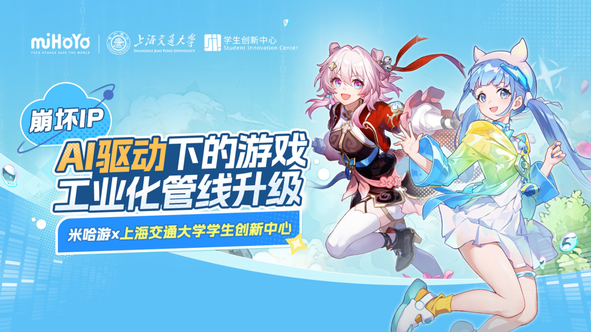

不止跑通“最后一公里”，崩坏IP自研Agent的底气是什么？

大家还在“大香蕉”里排队出图，GPT-image-2的公开又引发了新一轮刷屏热潮，从刷爆春晚的Seedance2.0生成视频，再到全民热潮的Openclaw“小龙虾”……靠着高频脉冲式迭代，AI一次次出现在公众舆论的视野。但在游戏行业，AI从演示到落地应用生产，还需要经历漫长的“最后一公里”。

游戏外包大厂Keywords Studios的高管透露，他们测试了市面上500款AI游戏开发工具，能用的只有大概6款。技术落地要么输出不稳定，要么质量不可控。原因很简单，游戏是AI落地最复杂、也最困难的应用场景。唯一的方法是自己训练模型、自己打磨流程。

基于自主感知、自主决策、自主执行的特性，AI Agent正在成为AI落地游戏开发的核心发力点，各家都在纷纷布局自研Agent。崩坏IP项目组也不例外，早在“小龙虾”爆火前，就已经端出了专注于研发提效和团队协作的自研AI Agent系统：Echo Agent。

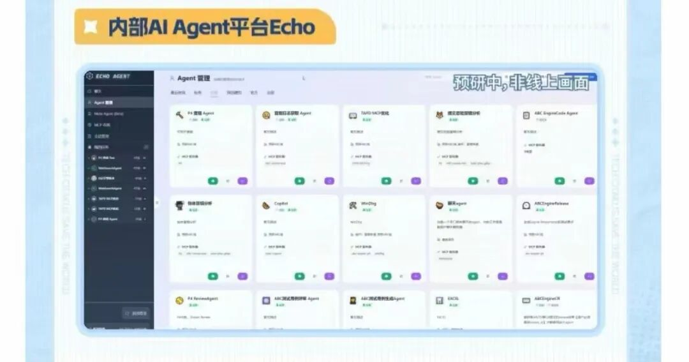

去年崩坏IP的AI专项招募计划已经曝光了Echo Agent

这里面其实存在一个问题，性价比更高的选择其实是等工具成熟、等管线跑通，等行业趟出一条路来。在已经涌现出诸多外部开源平台的情况下，为什么还要花大力气卷自研AI Agent？

项目组的回答是3个关键词：

一是“技术积累”，自研不仅能培养工程师们、也能培养每一个使用者对AI的理解。目前崩坏IP项目组几乎人人拥有自己的个性化Agent小助手，提升工作效率，很多标准化管线也都用上了Agent。

二是专为游戏定制开发，Echo Agent可以更快聚焦游戏垂类场景的开发需求，部分能力甚至能早于主流产品2-3个月。

三是更方便内部开源、全员共建生态。Echo Agent也是一个巨大的社区，每位项目组成员都能够创建skill，并一键在Echo Agent上发布，分享给组内组外解决相似的问题。不同成员也能方便地调用开放市场的各类开发工具，组装自己的Agent，解决个性化问题。

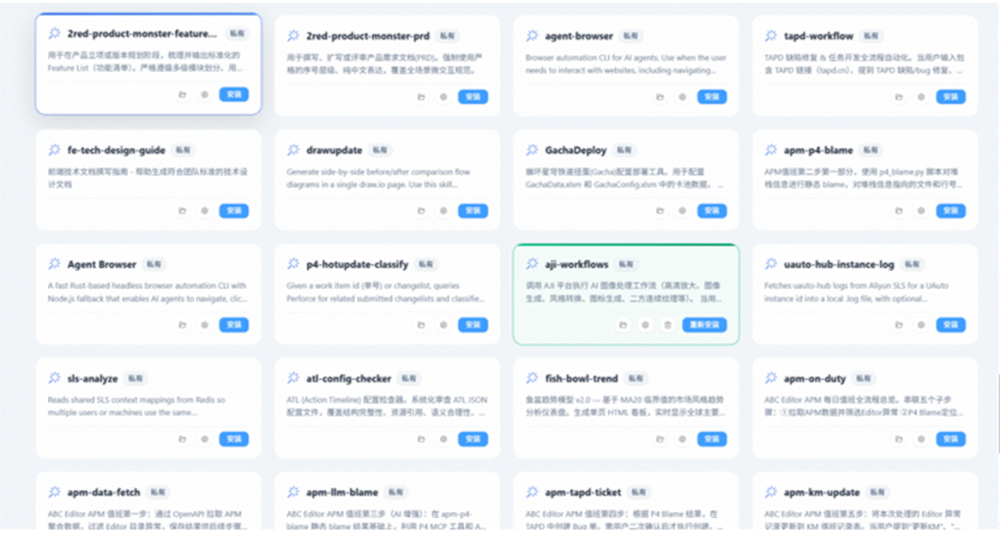

想要落地自研AI Agent应用，需要实打实地解决每个环节的具体问题。

就拿引擎管线来说，以前引擎一旦报错崩溃，全靠资深同学对完全不同崩溃分析路径的经验判断，流程费事又费力。现在Echo Agent可以快速找出故障原因，给出修复办法，还能精准通知到对应负责人，全程自动完成问题排查和分析。

在关卡设计环节上，设计师只用简单描述需求，短短几秒就能生成可用的3D模型，再也不用花好几个小时手搓“占位物件”。就算是不懂代码的市场、运营人员，也能靠Echo Agent轻松搭建适配自己工作的软件系统。不管是玩家调研、问题处理，还是分析市场热点、游戏数据、创作者生态，都能更全面、更准确、高效地完成。

当把Echo Agent集成进Unity引擎编辑器后，策划只要截一张图，就能一键搞定 NPC 对话、任务逻辑等。目前这项功能已经被拓展应用，哪怕是耗时一小时的完整长线任务也能自动配置完成。

值得一提的是，Echo Agent还能帮助策划快速验证游戏的白盒创意。

多数创意夭折在萌芽阶段，往往是因为缺乏快速验证机制。当Echo Agent已前置配置好了需要的游戏harness，只需要简短的对话和草图，AI就能像一只专业团队，写代码、画UI、生成Demo。

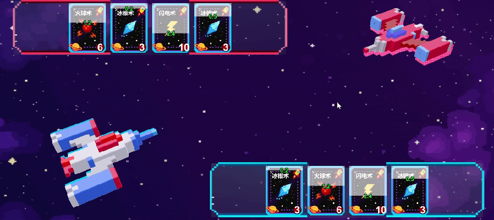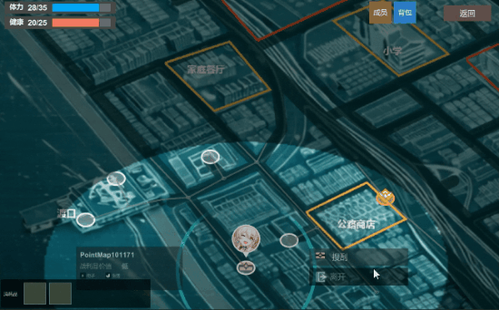

策划利用Agent制作的玩法白盒

从校园宣讲会的展示来看，赛车游戏、2D搜打撤、星际对战……只要策划有灵感，AI随时都能产出，大大缩短了玩法创意的验证链路。

随着Echo Agent接入崩坏IP游戏研发全流程，确保项目组能腾出时间更好地打磨产品、更快地验证创意，而不是在试错环节浪费大量时间。当创意的试错成本被大幅压缩、不再昂贵，人就敢想更疯狂的东西。

除了已有的技术应用外，崩坏IP项目组仍在进行AI前沿技术的长期预研储备，比如尝试基于Echo Agent组成了一个Agent Team，产品、引擎开发、测试、美术、策划等各类游戏职能均由多个AI Agent自主完成，配合开发了一款3D开放世界游戏Demo。项目组并不吝于在过程中投入资源，这也是沉淀收获，明确下一步的必要投入。

从AI帕姆到下一代AI Native Gameplay：让你推真实“活”过来

从这两年AI在游戏行业的实际应用来看，有两个核心关键词——提质增效与体验创新。这是前沿技术围绕用户需求和业务痛点的具体化、实践化落地，其中最重要的就是体验创新，也是最容易被用户感知到的部分。

AI固然与降本提效高度关联，但如何重塑游戏形态和交互体验，也是AI时代的命题之一。拥有互动功能的AI NPC Agent，可能是这两年业内落地最快、用户感知最明显的重要方向。

《崩坏：星穹铁道》4.2版本刚刚实装上线的“帕姆帮帮（测试版）”（以下简称：AI帕姆），正是为了帮助玩家专注于游戏的核心乐趣而生。

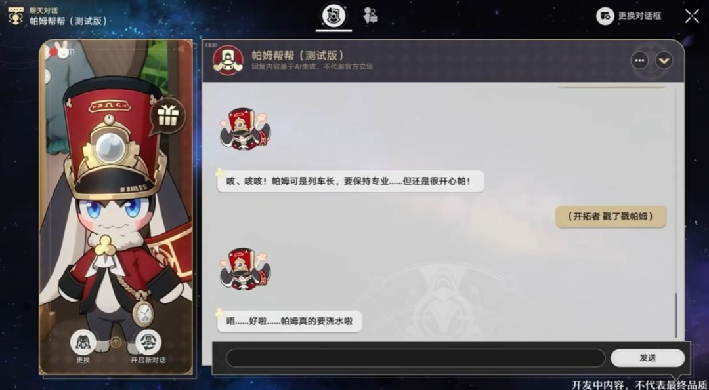

刚刚迎来三周年庆的《崩坏：星穹铁道》，在长线运营中积累着不断扩大的世界观、剧情、玩法系统与角色信息，一定程度上对玩家造成了认知负担。作为玩家“超级助理”的AI帕姆，正好能够提供配队、光锥、遗器的完整方案，且支持一站式流转和追踪、提醒刷取进度，大大降低理解门槛，确保玩家将精力聚焦到体验本身；另外，AI帕姆也可以理解游戏剧情、世界观、人物关系等知识，随时满足玩家提问、探讨的需求。

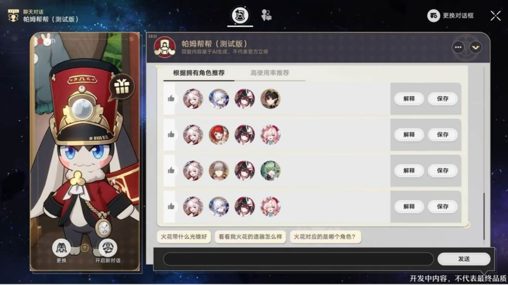

AI帕姆为玩家提供配队方案

打造一个拥有自我意识、能够满足玩家动态情感交互的鲜活角色，则是崩坏IP项目组打造AI帕姆的另一个初衷。崩铁角色是鲜活的——有自己的性格、有自己的爱好，项目组希望让玩家同他们建立起长线、深度的情感羁绊，有和玩家的专属记忆、也有符合自身人设的自主行为、用一种更生动的方式与玩家互动。

换言之，项目组希望AI帕姆并不是一个只能聊天、单向输出的人机NPC，它需要拥有真实的“灵魂”。

为了解决这个问题，项目组下足了功夫。

表现层上，AI在理解对话上下文的同时，会实时生成情绪标签，然后直接调用帕姆的3D模型、动作库和表情库。逻辑层上，帕姆生成回答时，会额外去比对自己的关系网络、过往印象和主观态度，从而能够让回答拥有"情绪染色"，更最贴近帕姆本人。记忆层上，AI帕姆为每位玩家建立独立的专属档案，确保每次对话不是“阅后即焚”，而是“好久不见”，从而构建与玩家的特殊羁绊。

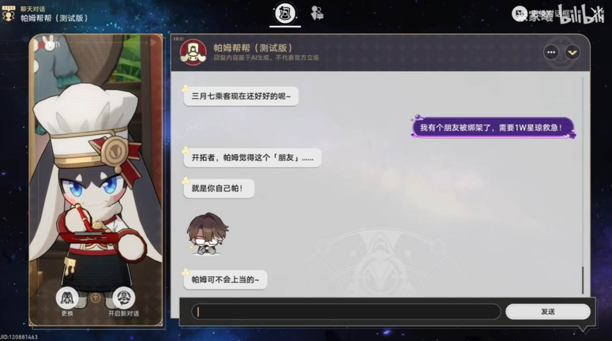

玩家尝试骗AI帕姆要星琼，回答很符合帕姆性格

作为面向千万活跃用户的智能NPC Agent，庞大的使用基数也意味着高并发、高成本、低效率。崩坏IP项目组基于自研，从零搭了一套异构推理集群，改变算力的组织方式，协同多个不同功能的模型，针对游戏高并发做了大量底层深度定制，让不同规格的硬件与算力，承接玩家需求。“稀疏MoE架构”确保针对问题调用最对口的模型，“思维蒸馏”模式，则确保调用的模型，都掌握了基模的推理能力，从而大幅提升效率、降低成本。

值得一提的是，AI帕姆并非限期出现的版本任务，项目组在设计之初，就考虑到了同后续更新版本保持适配。在架构上，模型和知识库完全分离，彻底解耦，使得同一个模型能够适配不同角色，为未来的功能扩展，乃至下一代AI Native Gameplay打下了基础。

在这场面向在校学生的分享会上，项目组爆料了正在进行中的游戏玩法尝试。其中之一便是将类狼人杀体验与《崩坏：星穹铁道》玩法融合，让玩家可以和AI驱动的游戏内角色一起玩狼人杀。

该玩法源于策划从多个Agent合作完成一系列工作时得到的灵感，也是崩坏IP项目组在探索AI Gameplay方面的一个重要切片： AI NPC的行为不是依靠行为树驱动，而是基于角色性格和习惯涌现。

当教会他们如何根据自己的知识，性格，习惯，获得的信息，以及与玩家的共同记忆，来决定自己的沟通方式、行为逻辑。崩铁的角色，不仅“活”了过来，也能成为玩家最好的陪玩伙伴。

这意味着，未来玩家或许可以选择与藿藿、桂乃芬一起密室逃脱，也能选择与刃和卡芙卡一起玩一把星核搜打撤……随着游玩次数的增多，崩铁角色也能越来越了解你，并最终带来定制化的游戏体验——在游戏圈陷入存量市场的今天，这种由AI技术带来的游戏体验增量，将是驱动行业继续向前走的新引擎。

自研AIGC平台，让创作者专注创作本身

过去两三年，AIGC技术的确是赋能游戏圈的技术加成项，却也是一个最敏感的地带。

海外频频出现因游戏大作采用AIGC内容，迅速被卷入舆论漩涡：如《Arc Raiders》因使用AI语音陷入争议；前段时间的韩游《红色沙漠》也因游戏场景存在多幅AI生成的装饰性画作引发争议，最终删除了相关内容并道歉。

其实，回溯自生成式AI爆发之初，AIGC的合理用法和使用边界，一直都是玩家、创作者和行业共同关注的焦点。如今的游戏圈，海外大厂面对AIGC时如履薄冰，独立游戏团队更是唯恐避AI不及，Steam提交审核时需要标注自己“是否使用AI”，明确表明坚持“手搓”的态度。

然而，AIGC带来的技术红利不单单是作用于短期生产提效，更将长久深刻地改变游戏产品形态和体验，这是游戏公司既担忧、又不得不快速押注的前沿技术领域。这种矛盾、拧巴的心态下该如何对待AIGC，也是AI时代所有公司不得不面对的一场大考。

对于既敏感、又重要的AIGC，崩坏IP项目组有着自己的清晰认知：AI无法代替核心创作，而是填补原本的体验空白。

在校园宣讲会的提问环节，面对现场同学关于AIGC边界的犀利提问，项目组负责人直接表示：“AI不是代替美术”。他们对AI的定位是缩短“想法”到“可验证效果”的距离，AI无法代替核心创作，而是填补原本的体验空白。

在崩坏IP项目组看来，游戏美术管线有两类工作性质很不一样。一类是创意主导的——概念设计、角色原画、整体风格定调，这些需要审美判断和创造力，AI达不到品质要求。另一类是生产主导的——拆三视图、贴材质、做站桩对话的动作、跨平台渲染异常检测，这些量极大、规则相对明确的领域，AI更像是为美术团队增加的一组不知疲倦的助手，帮助他们完成很多机械性、重复性的工作，让创作回归创意本身。

这也是为什么，崩坏IP项目组进一步打造自研AIGC平台“AJI”。一方面是为开发团队提供最便捷的AI能力，不需要自己搭环境、调参数、写prompt，仅靠自然语言就可以生成图片、预览效果；另一方面确保AI能够解决真实的业务问题，AJI中针对业务场景训练自有模型，能够实现通用模型无法解决的垂直场景的真实需求，如特定风格的纹理生成、贴图风格迁移等。

换言之，就是为了把AI能力拉到制作同学手边，同时确保这个能力真的能解决实际的业务问题。

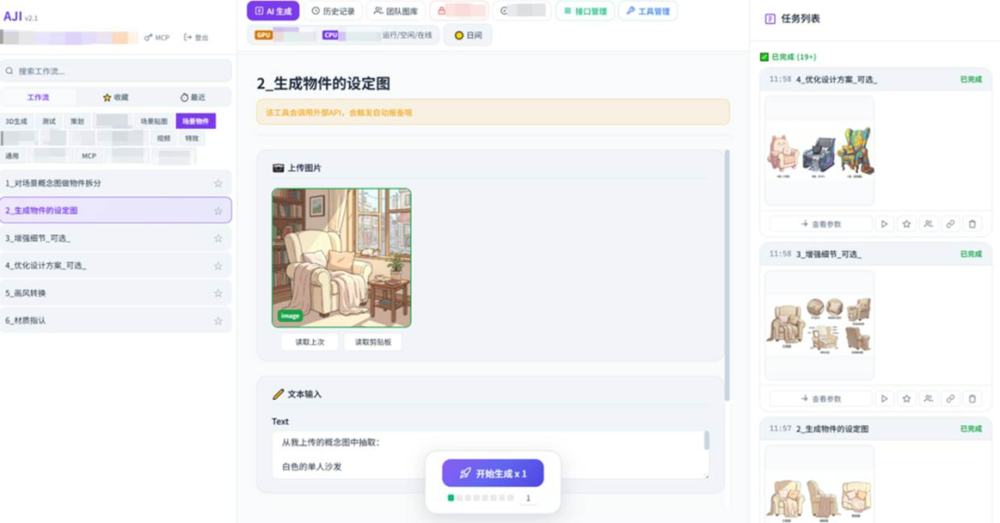

自研AIGC平台“AJI”

目前，崩坏IP项目组内部正在通过AIGC工具，帮助创作者快速地验证想法、拓宽设计涵盖的可能性，比如制定视频方案时，提出创意的人往往无法用文字精准地描述思路，需要借助模型生成静帧，或是寻找分镜师绘制分镜等繁琐步骤。现在可以直接生成AI Demo，减少了沟通成本和制作的不确定性。

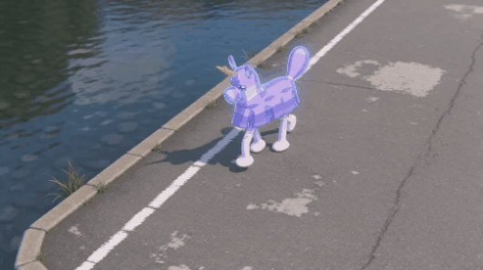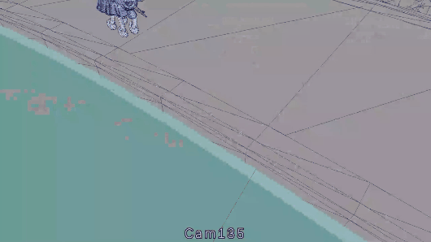

AIGC工具生成动态分镜，验证表现、将演出意图可视化，动画师按需K动画

摆脱重复性劳动，让项目组将更多精力专注于内容设计，也是AI融入管线后的成果之一。

过往从场景原画中拆出每一个物件，需要画出三视图，量大费时、但创造性不高。现在用AI，可以直接从原画中提取三视图设定。此前的渲染异常检测往往需要人工检查，三个平台、不同分辨率和画质、多个不同的场景——数量巨大、容易漏看，如今直接用AI先过滤所有包体，再提交可疑画面供人工校验，大大节省了人工成本。

更重要的是，AIGC可以帮助崩坏IP项目组提升玩家的体验。那些原本数量庞大、无法靠动画师手工制作的“站桩”对话，可以通过项目组在研的模型，根据角色说话的语义和语气，自动生成配套的肢体动作。比如说到“邀请”时会有手势，说到“警告”时会有防御性的肢体语言……这相当于用极低的成本，填补了原本的体验空白。

校招会上，项目组也分享了预研中的场景布设：通过引擎预处理，根据场景的法线与深度图，筛选家具资产库，进行家具在场景中的定位识别，再通过后处理将识别结果映射回引擎的世界坐标系，结合Agent微调穿模、悬空，最终直接生成Unity中的实际场景。

崩坏IP项目组正在进行的AIGC预研，是希望将AI能力与游戏引擎结合。当把重复劳动变成指令，让指令生成的结果更符合审美与逻辑，项目组也将拥有时间、精力去做更多提升玩家体验的内容与创意。

AI时代，需要什么样的技术宅？

印象中，GameLook似乎很少看见厂商在校园宣讲会上对如此多的AI技术的积累和实践毫无保留地分享。为什么崩坏IP项目组愿意这么做？

归根结底还是那两个字：人才。

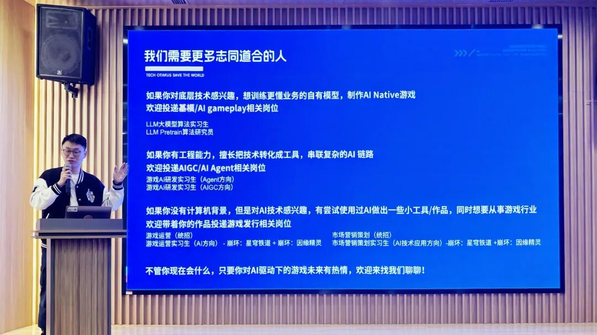

AI时代的竞赛，早已不是单纯的技术军备竞赛，"人才"才是决定长期胜负的核心变量。这两年，AI人才争夺战在全球范围内进入白热化阶段，招聘逻辑本身也在被重新定义。

崩坏IP项目组在宣讲会上大量曝光AI实践，某种程度上也是一次双向选择的信号——让真正适合的人看清楚这里在做什么，愿意加入一起做。

至于AI时代需要什么样的技术宅？简单来说，崩坏IP项目组想要招聘的不只有技术专家，同样包括拥有AI思维的复合型人才。

如果对底层技术感兴趣，可以投递 AI Foundation 岗位，做基模，研究“智能”本身，去挑战训练出更懂业务的自有模型；如果擅长把技术转化成工具，可以投递Agent 工程岗位；如果不是技术背景出身，但具备用AI高效解决真实问题的能力——理解需求、拆解任务、驾驭工具、判断结果质量，可以投递AI 策划、游戏发行岗位。

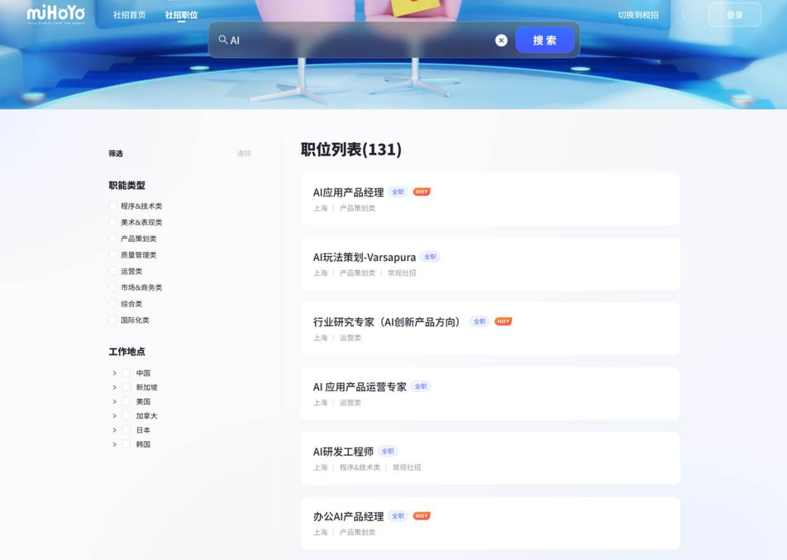

米哈游官网社招AI相关岗位

对于立志要在“2030年打造出全球十亿人愿意生活在其中的虚拟世界”的米哈游而言，拥抱前沿技术、寻找一同拯救世界的技术宅，始终是这家公司不变的技术愿景。也许在不远的未来，我们就能看到更具想象力的玩法、更具个性化的体验、更丰富沉浸式的表现和更多元的产品形态——这才是大家共同期待的，AI驱动下的游戏升级。

····· End ·····

  

* * *

  

**招聘游戏内容编辑，**欢迎** 有兴趣的同学投递简历**

  

**GameLook 每日游戏产业报道**

全球视野 / 深度有料

爆料 / 交流 / 合作：请加主编微信 igamelook

广告投放 : 请加 微信：Amyly588

简历投递邮箱 : 282187419@qq.com

长按下方图片，"识别二维码" 订阅微信公众号

····· 更多内容请访问 www.gamelook.com.cn ·····

Copyright © GameLook® since 2009

  

觉得好看，请点这里 ↓↓↓