文 / 游戏那点事 弦问

这个春天，游戏行业的风向，突然变得难以辨认。

AI像被按下了“快进键”。让辅助工具向核心生产力快速转变，同时也促使人才市场的需求急剧变化。

赶上这个历史节点的春招，在我看来成为了最具有“紧张”感的一届。

  

01

冷热交替 

这个春招太“乱”了

所谓的紧张感并非来自机会的绝对紧缺，而是行业各层岗位的预期和稳定性被打破，既看不清“人才-岗位”关系的准确落点，又怕抓不住变革的风口。

这一点，厂商和求职者一样紧张。

对于厂商而言，极速变化的需求迫使他们在人才战略上更加激进、无常。

一方面，是老话题“降本”。 近来国内外企业频繁出现“洗牌”操作，各大招聘平台关于裁员的传言也在持续发酵，大有点风声鹤唳的意味。

一位游戏公司的HR告诉我，有些员工前脚刚入职，彼时招聘尚未有对AI相关的明确要求，后脚就因为招聘需求大改，在职时间仅有两周多就要被裁撤。

另一方面，AI岗位却在飞速膨胀。裁员的同时，企业争相给AI加码押注，相关的岗位数量显著上升。

其实也不难理解，当AI在研发管线上带来了制作成本的显著降低，不仅会使利润率提高，还会让头部厂商有更大的拓展空间和试错能力。

在这种趋势下，厂商们的转型可能是在未来市场立足的基础。甚至因为头部厂商的“一步快，步步快”，让游戏市场激活马太效应，挤兑中游厂商的生存空间。

简而言之，就是会出现“大厂疯抢人才，中下游谨慎招人，总体同步裁撤”的人才市场乱流。

前不久，作为心动CEO的黄一孟发推文表示要亲自带AI游戏创作实习生，其对AI人才的渴求可见一斑。许多朋友感慨，员工自己的工资已经比不上手中的Token额度了。

可以预见的是，AI接入产线后，公司评判员工的工作不仅要看实际内容产出，还有了更容易量化的标准——事实上，不少企业已经将AI消耗的算力加入了KPI考核当中。

至此，对求职者来说，对未来的恐慌在所难免。面对更迭迅速的市场需求，自己往哪个方向发展，有没有足够的竞争力，都需要考虑——甚至说，再晚点上车，游戏行业是不是就不要我了？

而视角一转，哪怕是在职的人也不乏有看春招岗位的情况。

一个在外包岗位的朋友告诉我，他看不清楚AI能提效多少，但能看见身边的同事都快走光了。并且不只是外包，正编也有受到牵连的情况。

“说不定，下个月就到我了。”这是很多在职者对现状的不安。

从业者和厂商的凉热两面，揭示了机遇与风险并存的时代焦虑画像。

所以这次春招，我们着重去关注了各厂商的热招岗位，试图去预见即时性的人才流动趋势，具现行业里扩招和裁撤之间的“温度差”。

  

02

人才流向一线城市 

进入头部厂商的“收割场”

我们阅览了各地区一共135家游戏公司的招聘需求，汇总了其中的热招岗位（腾讯、网易因岗位太多，单独展示，不纳入汇总）。其中上海地区32家，广深地区40家，北京地区36家以及杭州地区10家，此外还有如厦门、成都等新兴游戏圈21家。

虽然部分厂商没有较明确的热招设定，但我们也尽量还原了官网的核心需求，以助于现象分析。

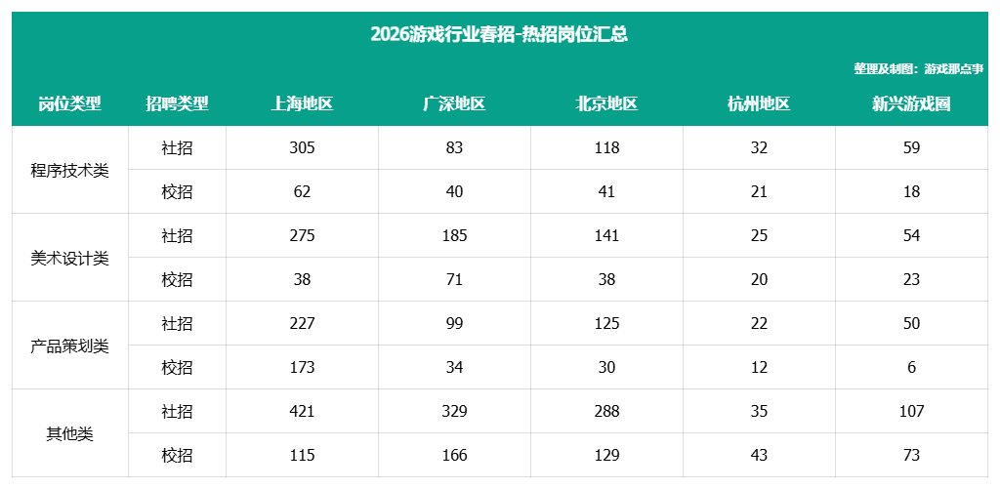

在数量上，如同往年，今年的招聘大盘仍然向一线城市高度集中。其中上海地区热招总岗位1616个，占比约 39.1%，稳居行业中心，同时也描画出近期的主要人才气流。

其次广深、北京地区分别以1007、910的热招岗位数量并驾齐驱。与上海一同占据了所汇总的热招岗近86%，组成了人才争夺战的最前线。

值得一提的是，别看在大盘上似乎人才缺口巨大，但并非行业整体都在“猛招”。

例如上海地区所统计的32家厂商，仅凭鹰角和米哈游两家的热招岗数量就占了655个，约为40%。这也和前文所说的“大厂疯抢人才，中下游谨慎招人”相应。

而杭州与新兴游戏圈热招总量相对较小（210、390个）。但校招比例偏高，可见企业在这些区域的人才孵化布局，兼顾未来增长潜力。

岗位结构上，三大岗位的总体热招需求接近。社招和校招的比例比起往年也并未有明显的偏移。

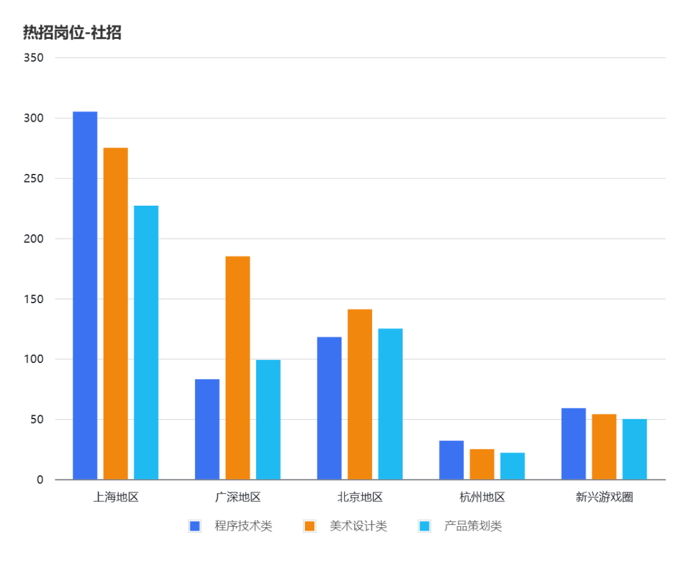

但能看到广深地区在美术设计类岗位上，社招和校招都有着明显偏重。

而上海地区的校招岗位上，产品策划类尤其火热。头部企业通过校招大量补充玩法设计上的新鲜血液，或许也是未来人员结构变化的信号。

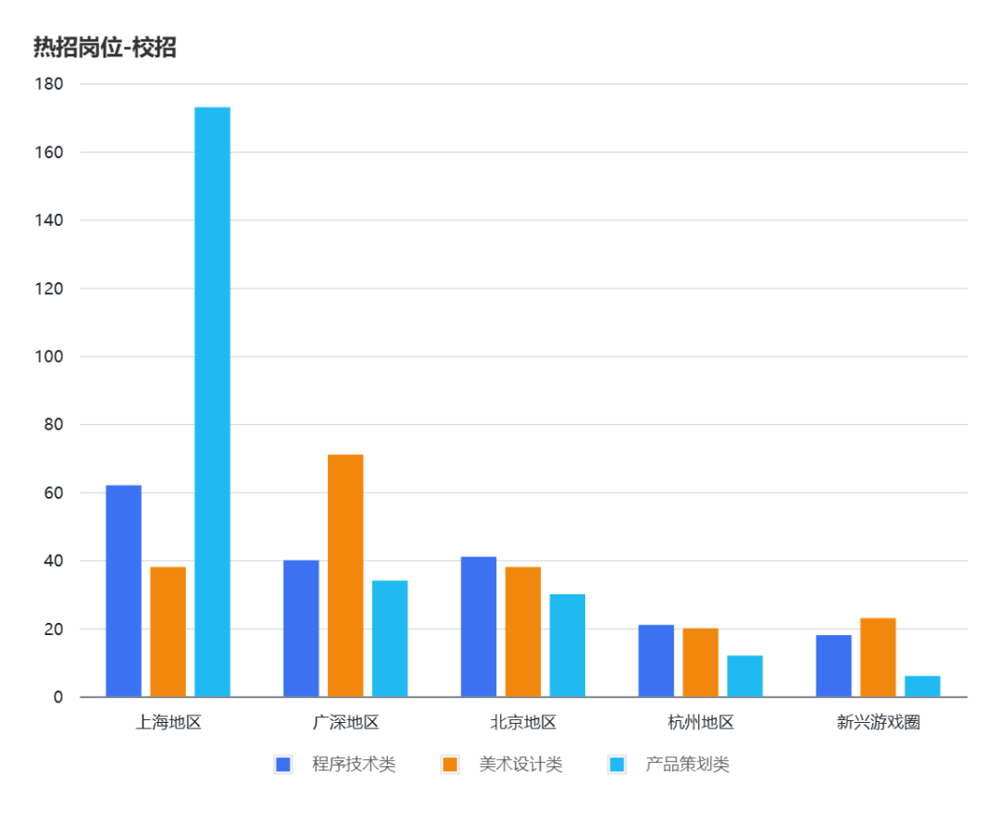

如果关注热招岗位的细分，还会发现今年名称中带有“AI”的岗位显著增多。其中不乏有大模型开发、前后端开发、产品、策划和美术方面的岗位，大有覆盖全类别的趋势。

总体而言，哪怕AI开始深度接入产业链路，在招聘岗位上也仍未呈现出就业机会的稀缺。“抢人才”依旧是主旋律。

一方面，如今应用AI仍然需要专业人员的优化调整，开发AI管线也需要大量的时间磨合。虽然人事调整难以避免，但相应的岗位类别依旧离不开足够数量的人力支撑。

另一方面，AI带来的产能提升有目共睹，但这也会促使项目周期的缩短。在这AI产业链路还在转化的窗口期，仍然需要足够的人才密度去承接项目迭代的加快。

以下为游戏那点事整理的各地区热招岗位信息，部分内容可能存在滞后，请以各公司官网最新招聘信息为准。

  

03

头部汇聚 

血雨腥风的上海“滩”

1.米哈游

米哈游代表作《原神》《崩坏：星穹铁道》《绝区零》，在研《崩坏：因缘精灵》《星布谷地》《雨之城》等多款预研产品。

主打二次元。热招岗位涵盖技术、美术、产品及其他类，在核心研发、AI赋能和国际化运营等岗位上需求较多。

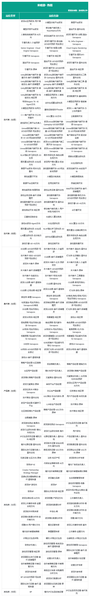

（上下滑动查看）

社会招聘网址：https://jobs.mihoyo.com/social-recruitment/mihoyo/42280/\#/position

校园招聘网址：https://join.mihoyo.com/\#/campus/position

2.鹰角网络

鹰角网络代表作《明日方舟：终末地》《明日方舟》，主打二次元RPG与塔防，热招岗位覆盖技术、美术、策划、运营。自《明日方舟：终末地》大获成功后，鹰角对于人才的招聘需求持续高涨，岗位整体显示企业在核心研发与内容把控上高度集中，同时注重经验型人才的补充和团队稳定。

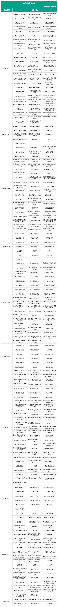

（上下滑动查看）

社会招聘网址：https://jobs.hypergryph.com/\#/jobs?zhineng=&page=1

校园招聘网址：https://jobs.hypergryph.com/campus\_apply/hypergryph/26326\#/

3.叠纸游戏

叠纸游戏代表作《无限暖暖》《恋与深空》《闪耀暖暖》等，主打换装、大世界与女性向。热招岗位覆盖技术、美术、策划及运营，岗位方向丰富且细分，招聘重心集中在核心岗位与经验型人才。

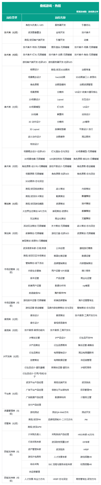

（上下滑动查看）

社会招聘网址：https://papergames.jobs.feishu.cn/social/position/list

校园招聘网址：https://papergames.jobs.feishu.cn/campus/position/list

4.莉莉丝

莉莉丝代表作《剑与远征》系列，《万国觉醒》等，主打卡牌与SLG。热招岗位覆盖技术、美术、策划，岗位偏向高级与细分方向，招聘重心集中在核心岗位与成熟人才。

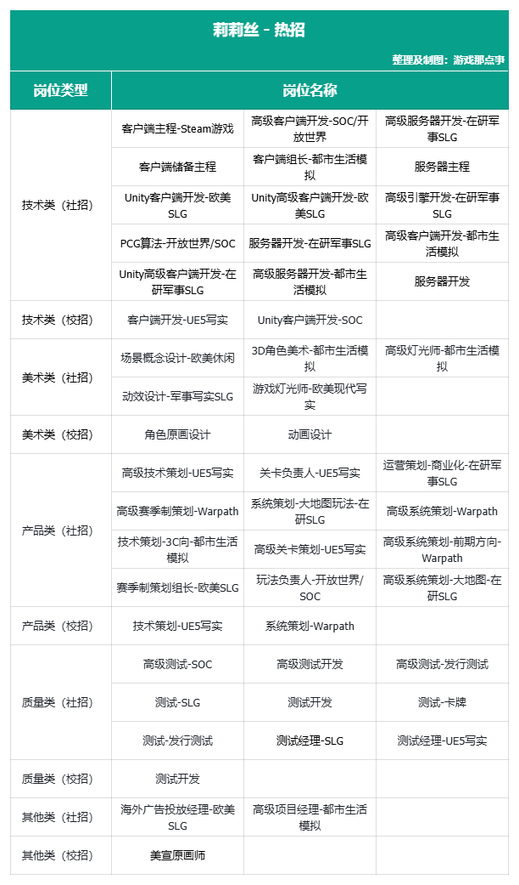

（上下滑动查看）

社会招聘网址：https://lilithgames.jobs.feishu.cn/career

校园招聘网址：https://lilithgames.jobs.feishu.cn/campus

5.心动

心动网络代表作《心动小镇》《出发吧麦芬》，主攻模拟经营与放置RPG。热招岗位覆盖技术、美术、产品及其他类，岗位方向多样且细分，招聘重心偏向核心岗位与经验型人才。

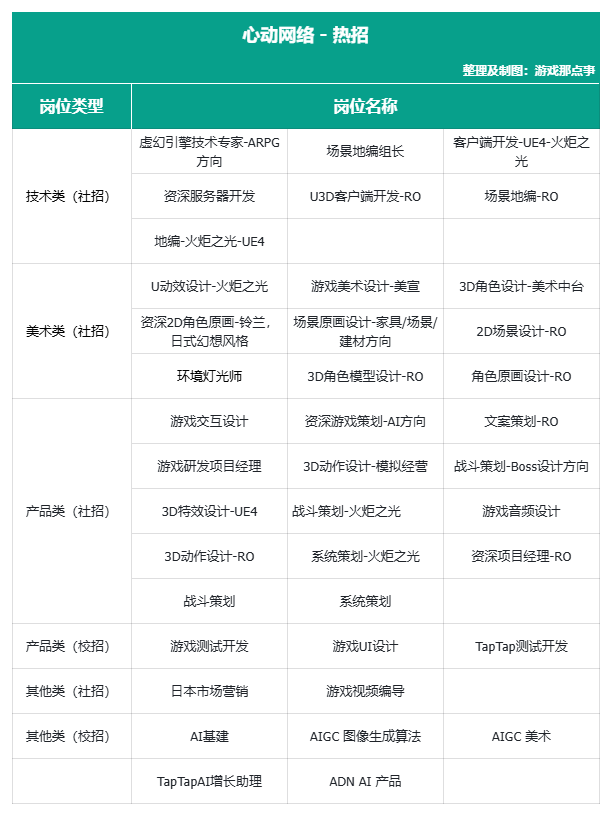

（上下滑动查看）

社会招聘网址：https://hr.xd.cn/social/?lang=zh\#/

校园招聘网址：https://hr.xd.cn/campus\#/

6.蛮啾网络

蛮啾网络代表作《蓝色星原：旅谣》《碧蓝航线》，覆盖二次元与RPG。热招涵盖策划、美术、研发及发行，技术含客户端与服务器，美术含原画与动画，策划覆盖系统与任务。

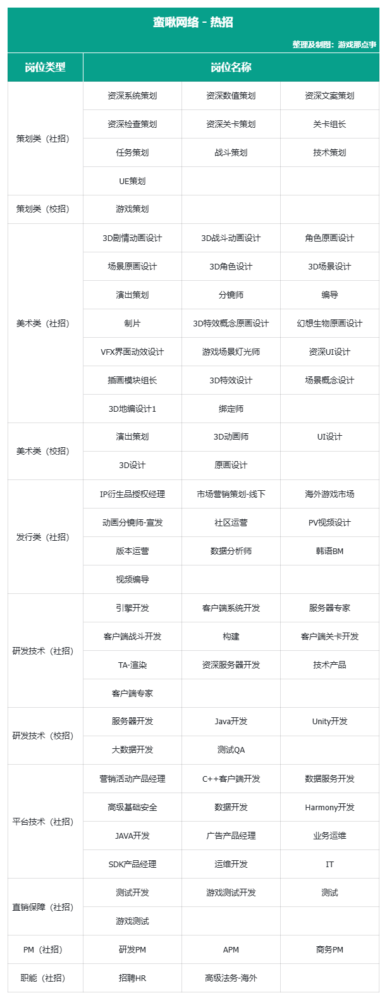

（上下滑动查看）

社会招聘网站：https://ooia5293gn.jobs.feishu.cn/index/position/list

校园招聘网站：https://ooia5293gn.jobs.feishu.cn/542332

7.悠星网络

悠星网络代表作《碧蓝航线》《蔚蓝档案》《星塔旅人》等，主打二次元。热招岗位覆盖技术、美术、产品、发行及职能类，招聘重点集中在核心研发与美术策划岗位，同时兼顾经验型人才。

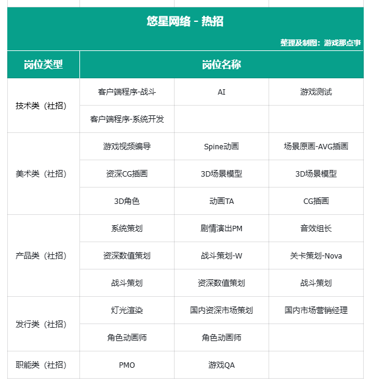

社会招聘网址：https://app.mokahr.com/apply/yostar/26843\#/?anchorName=default\_joblist&sourceToken=

8.散爆网络

散爆网络代表作《少女前线：追放》《少女前线》，主打二次元战棋和策略。热招岗位覆盖技术、美术、产品及其他类，招聘重点集中在核心研发与玩法策划，同时兼顾经验型人才和实习生。

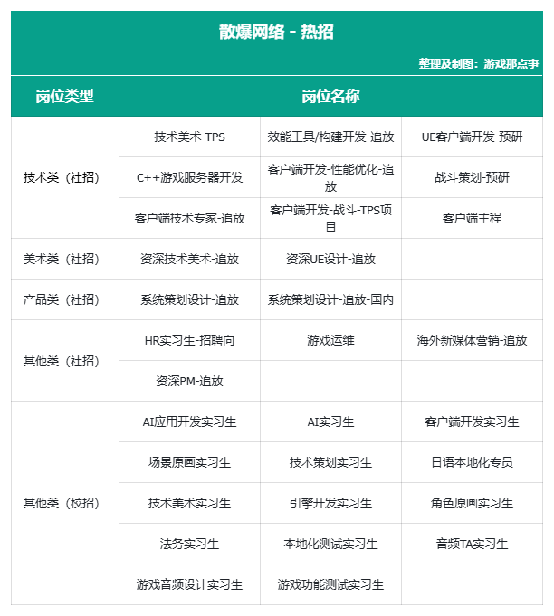

社会招聘网站：https://app.mokahr.com/social-recruitment/micateam/142158?locale=zh-CN\#/

校园招聘网站：https://app.mokahr.com/campus-recruitment/micateam/146166\#/

9.哔哩哔哩

哔哩哔哩代表作《三国：谋定天下》《命运-冠位指定》等，主要围绕SLG与二次元卡牌。热招岗位覆盖技术及游戏类岗位，招聘重点集中在核心研发与游戏算法岗位，同时兼顾经验型人才。

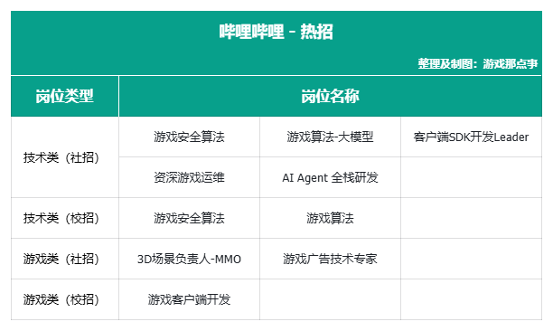

社会招聘网址：https://jobs.bilibili.com/social/positions

校园招聘网址：https://jobs.bilibili.com/campus

10.巨人网络

巨人网络代表作《超自然行动组》《球球大作战》《征途》，覆盖微恐搜打撤、休闲竞技与MMO。热招岗位包括美术、技术及其他类，招聘重点集中在美术与客户端开发，同时兼顾经验型人才。

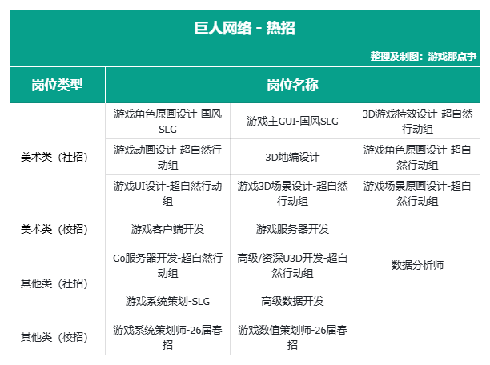

社会招聘网址：https://app.mokahr.com/apply/ztgame/37485/\#/

校园招聘网址：https://hr.ztgame.com/campus/

11.乐元素

乐元素代表作《开心消消乐》《偶像梦幻祭2》，在研新品《白影之城》，岗位覆盖二次元、休闲与女性向。热招岗位涵盖市场、美术及其他类，招聘重点集中在核心研发、美术设计及产品运营，同时兼顾经验型人才。

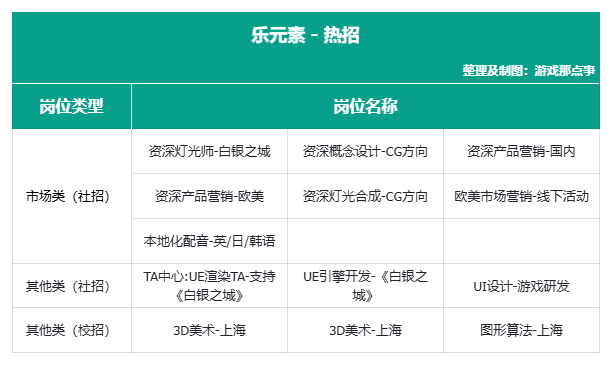

社会招聘网址：https://app.mokahr.com/apply/leyuansu/2358\#/

校园招聘网址：https://app.mokahr.com/campus\_apply/leyuansu/2357\#/

12.育碧中国

育碧中国代表作《彩虹六号》《刺客信条》，主攻动作与射击。热招岗位覆盖综合类，岗位方向包括动画及技术动画，显示公司在核心研发与美术表现上保持持续投入。

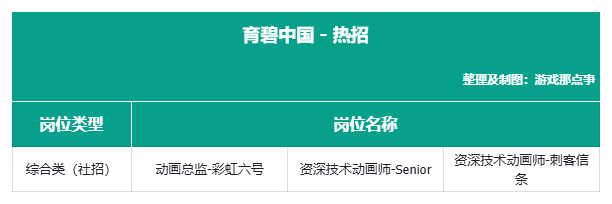

社会招聘网站：https://zh-cn.ubisoft.com/company/career\_result?loc=3100

校园招聘网站：https://zh-cn.ubisoft.com/company/career\_result?type=2

13.恺英网络

恺英网络代表作《三国：天下归心》《龙之谷世界》《全民奇迹》等，覆盖SLG、MMO与卡牌。热招岗位覆盖技术、美术、产品及市场类，招聘重点集中在核心研发与美术策划岗位，同时兼顾经验型人才和实习生。

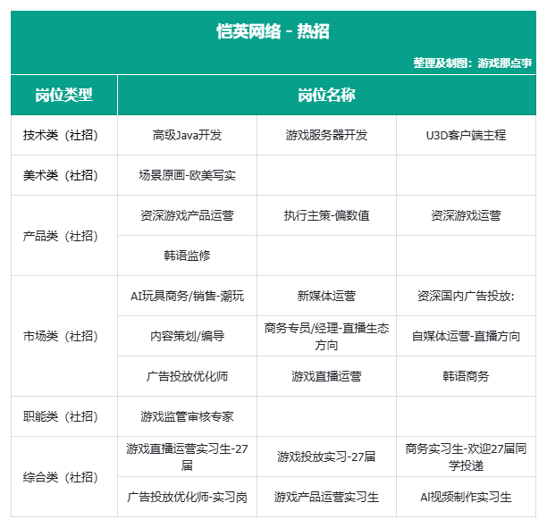

社会招聘网址：https://app.mokahr.com/apply/kingnet/2247\#/?anchorName=007&sourceToken=

校园招聘网址：https://app.mokahr.com/campus\_apply/kingnet/2246\#/?anchorName=007&sourceToken=

14.沐瞳游戏

沐瞳游戏代表作《决胜巅峰》《Mobile Legends: Adventure》等，覆盖MOBA与卡牌。热招岗位覆盖技术、美术、产品、发行及职能类，招聘重点集中在核心研发与美术设计，同时兼顾经验型人才和实习生。

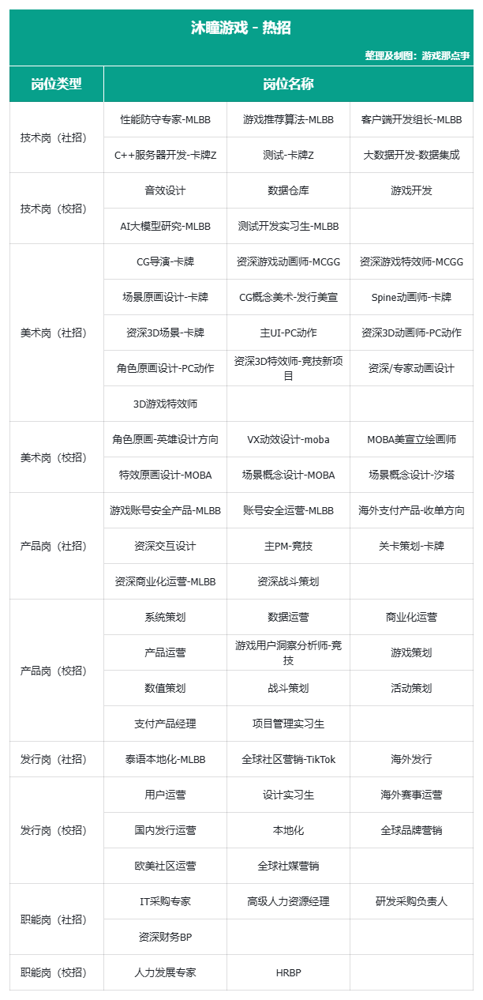

（上下滑动查看）

社会招聘网址：https://moonton.jobs.feishu.cn/index

校园招聘网址：https://moonton.jobs.feishu.cn/campus

15.紫龙游戏

紫龙游戏代表作《天地劫》《梦幻模拟战》，主打战棋。热招岗位覆盖美术、运营及综合类，招聘重点集中在核心技术、美术设计与策划岗位，同时兼顾经验型人才。

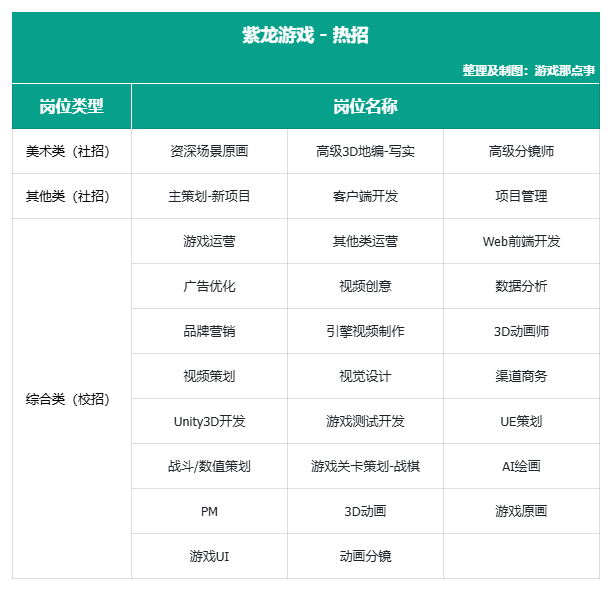

社会招聘网址：https://www.zlongame.com/html/contact.html\#recruit-main

校园招聘网址：https://app.mokahr.com/campus\_apply/zlongame/6103\#/?anchorName=default\_joblist&sourceToken=

16.友塔游戏

友塔游戏代表作《Mafia City》《Hollywood Crush》等，主打策略与休闲。热招岗位覆盖技术、美术、产品及发行类，招聘重点集中在核心研发、美术设计与策划岗位，同时兼顾经验型人才与实习生。

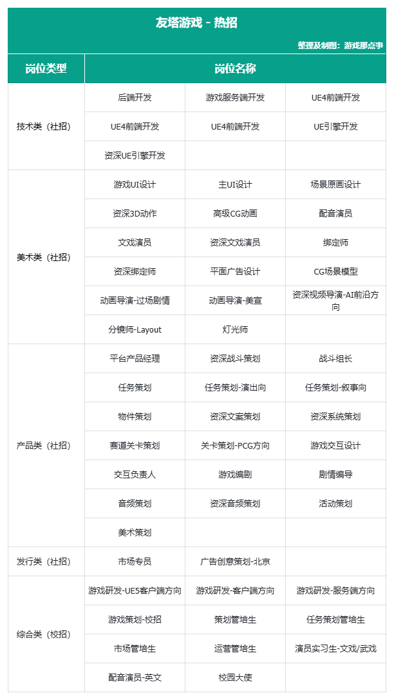

（上下滑动查看）

社会招聘网址：https://www.yotta-hr.com/zh/social

校园招聘网址：https://www.yotta-hr.com/zh/campus

17.盛趣游戏

盛趣游戏代表作《传奇》系列，《龙之谷》等，覆盖MMO与动作品类。热招岗位覆盖技术、策划、运营及程序开发类，招聘重点集中在核心研发与策划岗位，同时兼顾经验型人才和培训生。

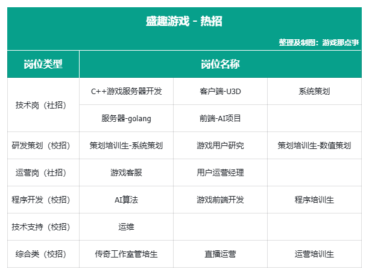

社会招聘网址：https://app.mokahr.com/apply/shengqu/4077\#/

校园招聘网址：https://app.mokahr.com/campus-recruitment/shengqu/96336\#/

18.网元圣唐

网元圣唐代表作《古剑奇谭》《白荆回廊》，主打RPG。热招岗位覆盖美术及策划类，招聘重点集中在美术设计与关卡策划岗位，同时兼顾经验型人才。

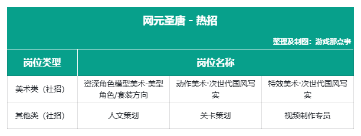

招聘网站：https://www.zhipin.com/gongsi/030b759debf9163d0HR72tm8.html?ka=job-detail-company\_custompage

19.EA中国

EA中国代表作《Apex Legends》《FC足球世界》，覆盖射击与体育。热招岗位覆盖技术、美术、产品及综合类，招聘重点集中在核心研发、美术设计与系统策划岗位，同时兼顾经验型人才。

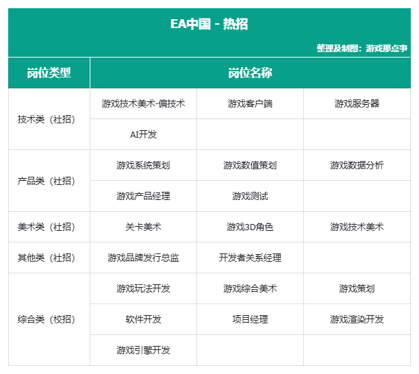

招聘官网：https://jobs.ea.com/en\_US/careers/Home/Shanghai?listFilterMode=1

20.妙世界

妙世界旗下产品「MiAO」，主打沙盒与社交。热招岗位覆盖综合类和AI方向，招聘重点集中在核心研发与AI产品开发，同时兼顾经验型人才。

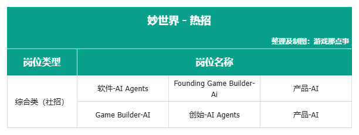

招聘官网：https://www.miao.company/careers\#jobs

21.游族

游族代表作《少年三国志》系列、《权力的游戏》，覆盖卡牌与策略。热招岗位覆盖发行平台及综合类，招聘重点集中在核心研发、产品运营与系统策划，同时兼顾经验型人才与AI方向岗位。

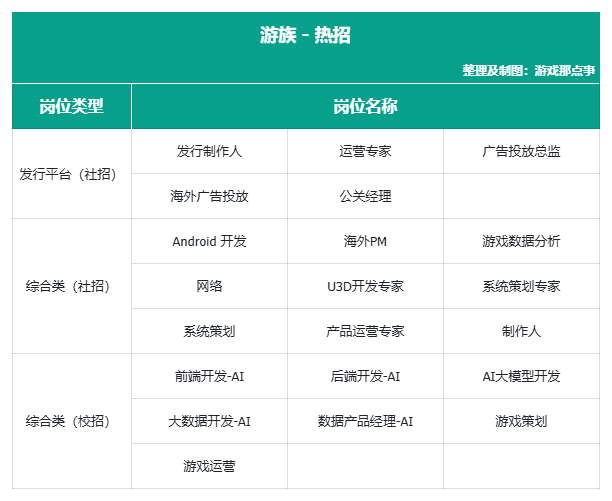

社会招聘网址：https://app.mokahr.com/apply/yoozoo/91950\#/jobs

校园招聘网址：https://campus.yoozoo.com/jobs

22.上海域起

上海域起代表作《东方LostWord》《我的花园》，覆盖二次元与休闲。热招岗位覆盖美术、产品及技术类，招聘重点集中在核心研发、美术设计与策划岗位，同时兼顾经验型人才。

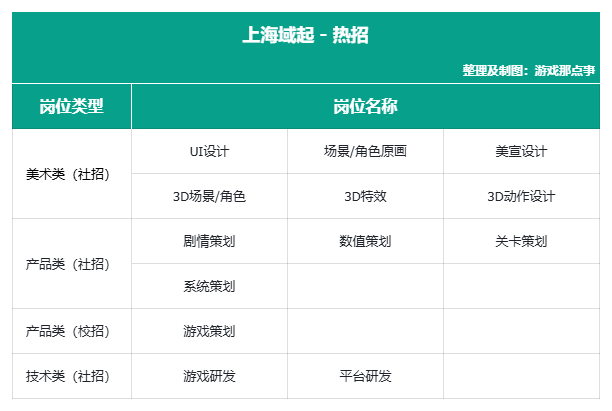

招聘官网：https://www.yuqinet.com/joinUs

23.淘米网络

淘米网络代表作《赛尔号》《摩尔庄园》，主打休闲策略和模拟经营。热招岗位涵盖技术、美术、产品及其他类，技术侧覆盖客户端与服务器，美术侧含原画、场景与动效，策划及运营覆盖玩法和系统，同时兼顾实习生。

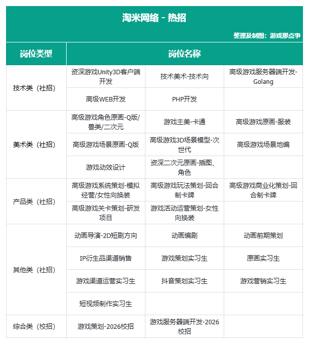

招聘网站：https://www.zhipin.com/gongsi/efa0d557dfe42a4b1nB\_0tm5.html

24.波克城市

波克城市代表作《跃动小子》《灵画师》《开心消消乐》，覆盖放置挂机与休闲棋牌。热招岗位覆盖技术、美术、研发及职能类，技术侧含客户端与服务器，美术含特效与UI，策划覆盖系统与玩法，同时兼顾实习生。

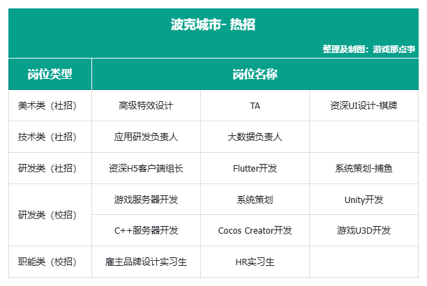

社会招聘网站：https://boke.jobs.feishu.cn/index

校园招聘网站：https://boke.jobs.feishu.cn/581609/

25.椰岛游戏

椰岛游戏代表作《江南百景图》《黑暗料理王》，覆盖模拟经营与放置。热招岗位包括设计、运营、产品及研发，技术含Unity开发与测试，美术与策划覆盖原画与系统，同时兼顾实习生。

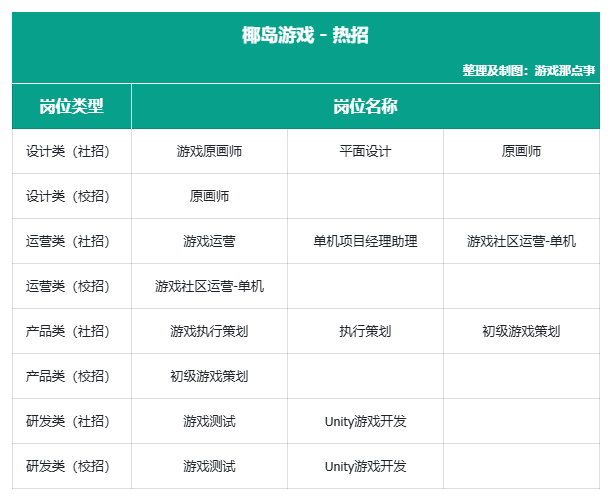

社会招聘网站：https://coconutisland.jobs.feishu.cn/coconut\_jobs

校园招聘网站：https://coconutisland.jobs.feishu.cn/coconut\_campus

26.七创社

七创社代表作《凹凸世界》《猫灵相册》，覆盖二次元与策略。热招岗位涵盖技术、美术及策划，技术含客户端与服务器，美术含3D主美与动作设计，策划覆盖文案与系统。

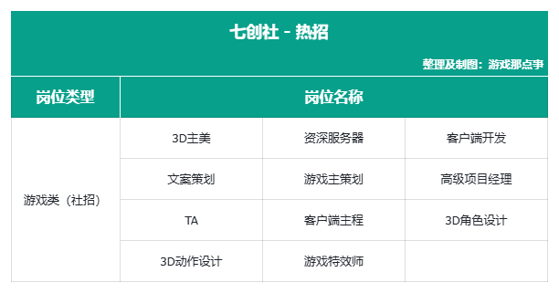

招聘官网：https://7doc.com.cn/about.html\#contact

27.盖姆艾尔

盖姆艾尔代表作《仙境传说:新世代的诞生》《仙境传说:重生》，主打MMO。热招岗位涵盖产品、研发、技术及美术类，技术含客户端与服务器，美术含3D角色与场景，策划覆盖系统与战斗。

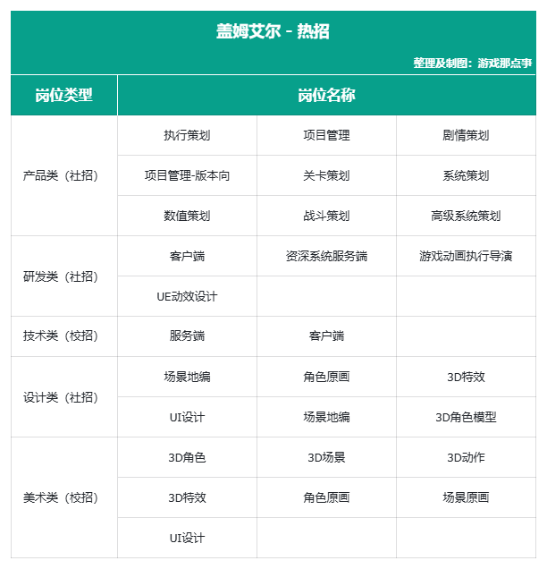

社会招聘网站：https://gamealestudio.jobs.feishu.cn/index

校园招聘网站：https://gamealestudio.jobs.feishu.cn/007955

28.欢乐互娱

欢乐互娱代表作《龙之谷手游》《街机三国》。覆盖动作与休闲。热招岗位涵盖技术及综合类，技术侧含客户端与后端开发，美术与设计覆盖原画及AE视频，产品与运营涉及平台开发及法务。

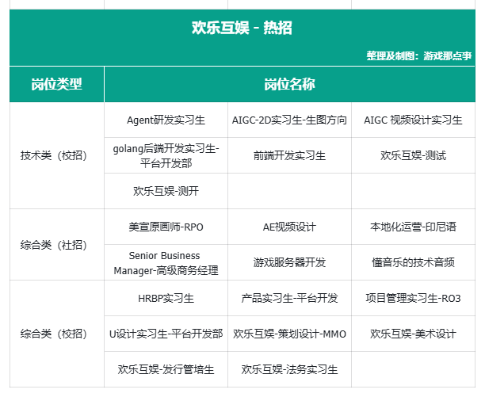

社会招聘网站：https://huanle.jobs.feishu.cn/society

校园招聘网站：https://huanle.jobs.feishu.cn/campus/position/list

29.番糖游戏

番糖游戏代表作《猫之城》《食之契约》等，覆盖二次元与养成。热招岗位涵盖美术及产品类，美术侧包含场景、角色及UI设计，产品侧覆盖剧情策划与执行。

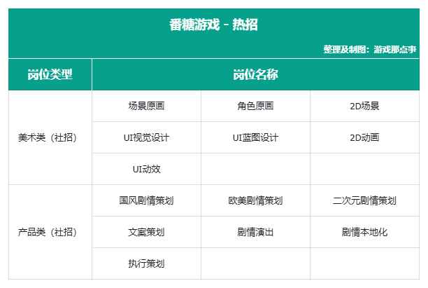

招聘网站：https://www.zhipin.com/gongsi/2a5e06fb6b015fe21nV92dy-Ew~~.html

30.骏梦网络

骏梦网络代表作《仙境传说RO:新世代的诞生》，覆盖MMO。热招岗位涵盖程序、策划及运营类，校招为主，技术含AI与测试岗位，策划覆盖主策与数值策划，运营涉及国内及海外运营岗位。

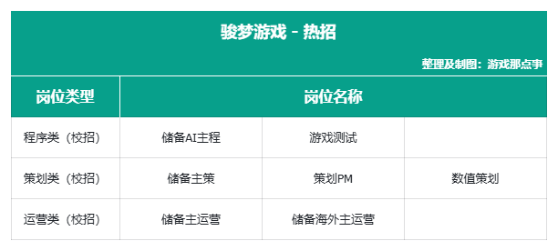

招聘官网：https://www.thedream.cc/talent?type=%E7%A8%8B%E5%BA%8F%E7%B1%BB&dataKey=program

31.呦尔哈

呦尔哈代表作《Command & ConquerTM: Legions》等，覆盖RTS与SLG。热招岗位覆盖综合类，岗位方向包括游戏测试、特效及IP合作研发，同时兼顾经验型人才。

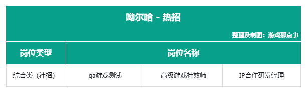

招聘网站：https://www.zhipin.com/gongsi/d2c9c1c1ffcb99b61nB739q1F1U~.html

32.乐府互娱

乐府互娱代表作《我的御剑日记》，覆盖卡牌与修仙。热招岗位覆盖技术与美术类，技术侧含客户端与服务器开发，美术侧涵盖GUI设计，显示公司在核心研发与美术表现上同步布局。

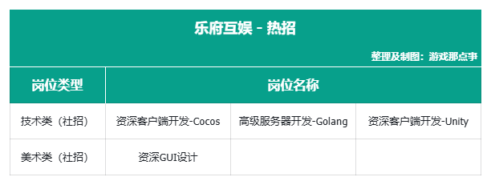

社会招聘网址：https://app.mokahr.com/apply/lovegames/21946\#/home

校园招聘网址：https://app.mokahr.com/campus\_apply/lovegames/21947\#/home

  

04

头部汇聚厂商最多 

狼环虎伺的广深

33.腾讯

首先是仍然量大管饱的腾讯。据官网-IEG事业群的招聘信息，目前有1274个社招岗位在招，其中866个分布于深圳。并且腾讯各大主流项目都有人才需求，此外《异人之下》以及微恐射击品类等在研产品也有人才缺口。

招聘官网：https://careers.tencent.com/jobopportunity.html

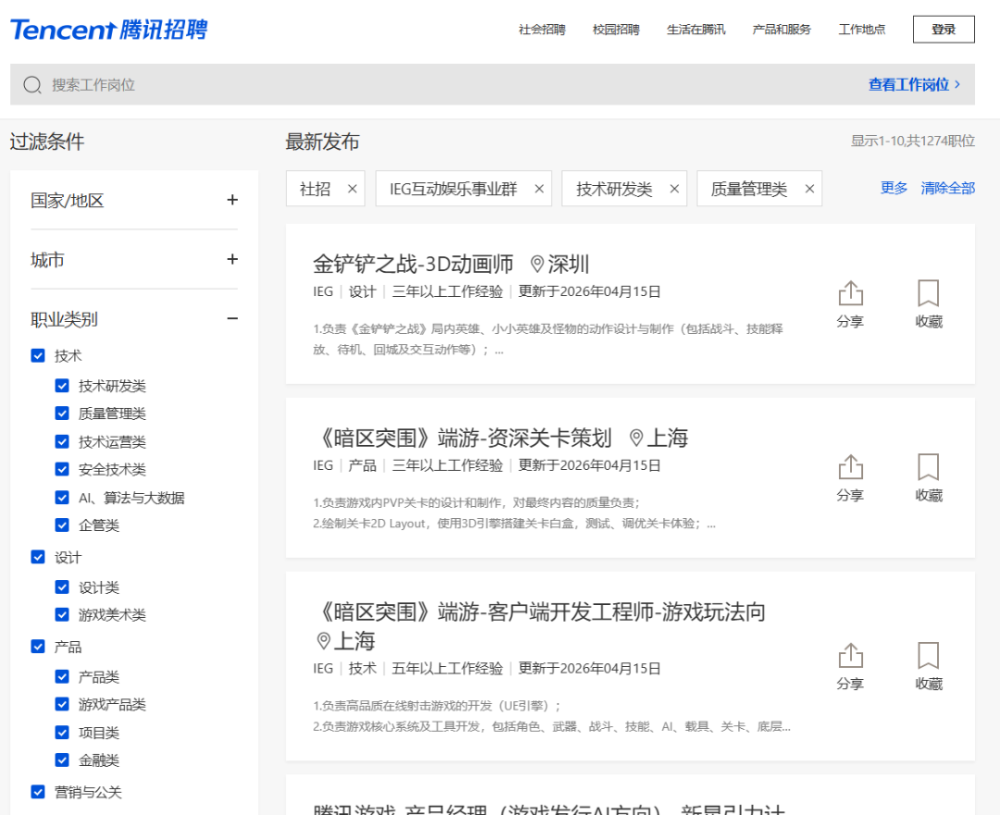

校招部分，则显示有56个岗位在招，以程序技术类主要方向。

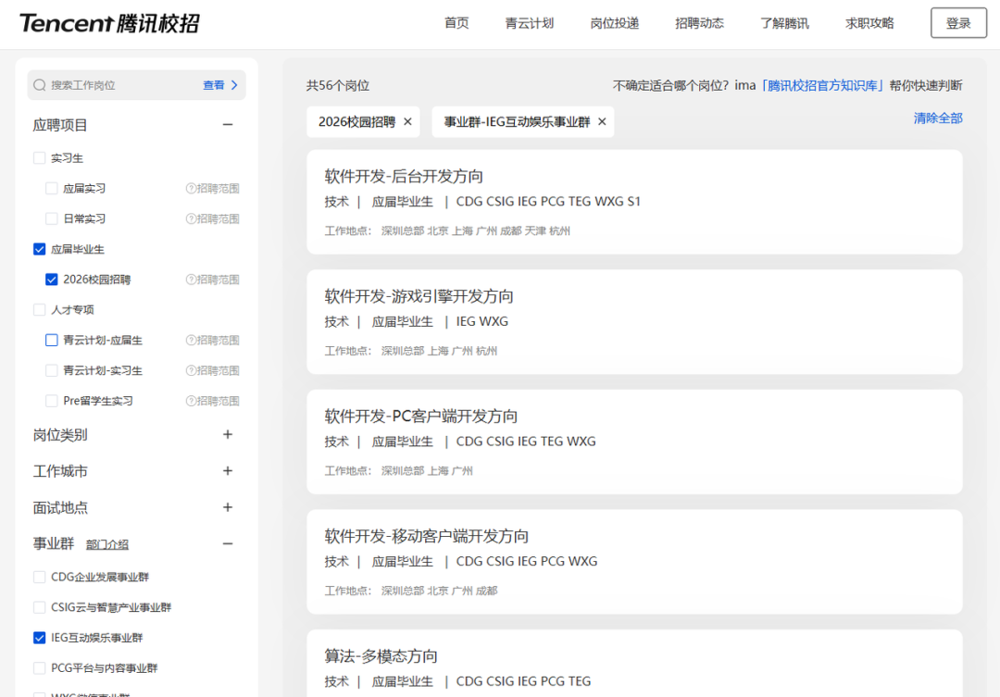

社会招聘网站：https://careers.tencent.com/search.html

校园招聘网站：https://join.qq.com/post.html?query=p\_1

34.三七互娱

三七互娱代表作《寻道大千》《叫我大掌柜》《英雄没有闪》等，春招覆盖技术开发、美术设计、游戏策划及海外运营岗位，岗位集中在客户端开发、AI算法、美术及游戏运营方向，强调研发与海外市场能力。

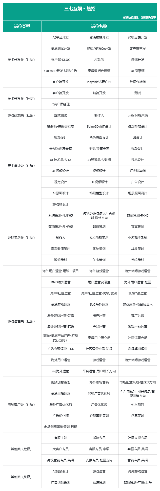

（上下滑动查看）

社会招聘网址：https://zhaopin.37.com/index.php?m=Home&c=recruit&a=recruit&recruit=1

校园招聘网址：https://zhaopin.37.com/index.php?m=Home&c=recruit&a=recruit&recruit=2

35.库洛游戏

库洛游戏代表作《鸣潮》《战双帕弥什》等，覆盖二次元ARPG。热招岗位涵盖美术、技术、策划、运营及音频类，方向多样，偏重美术与技术核心岗位。

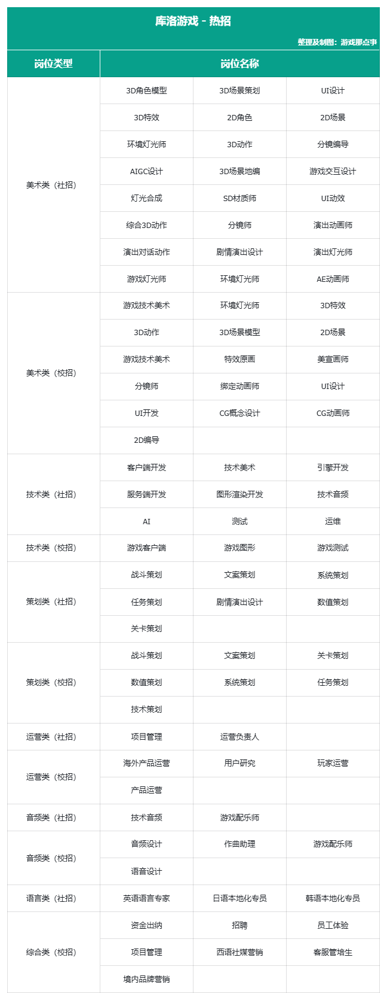

（上下滑动查看）

社会招聘网站：https://kurogame.jobs.feishu.cn/index/

校园招聘网站：https://kurogame.jobs.feishu.cn/campus/

36.深蓝互动

深蓝互动代表作《重返未来：1999》等，在研新品UE5开放世界，主打二次元卡牌。热招岗位涵盖美术、策划、市场及其他方向，岗位类型多样，偏重美术与策划核心岗位。

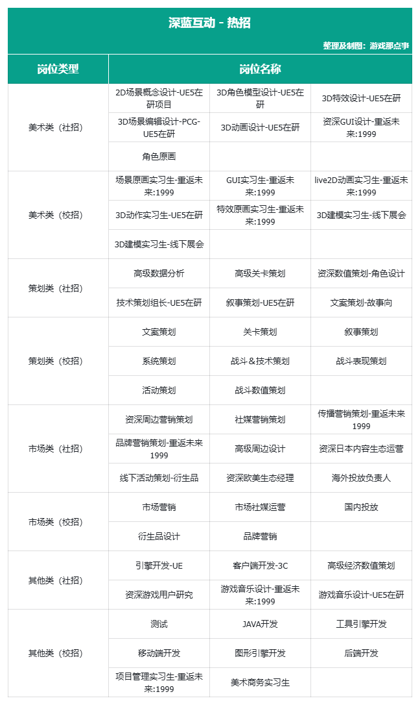

（上下滑动查看）

社会招聘网址：https://app.mokahr.com/apply/blueinteractive/38433\#/?anchorName=default\_joblist&sourceToken=

校园招聘网址：https://app.mokahr.com/campus\_apply/blueinteractive/38434\#/?anchorName=4862358994&sourceToken=

37.灵犀互娱

灵犀互娱代表作《三国志·战略版》《灵魂面甲》等，热招涵盖程序、客户端、服务器、AI算法、美术、产品策划及海外运营等岗位，岗位分布广，既有高端研发，也有运营和市场岗位，显示公司注重SLG研发能力和全球运营能力。

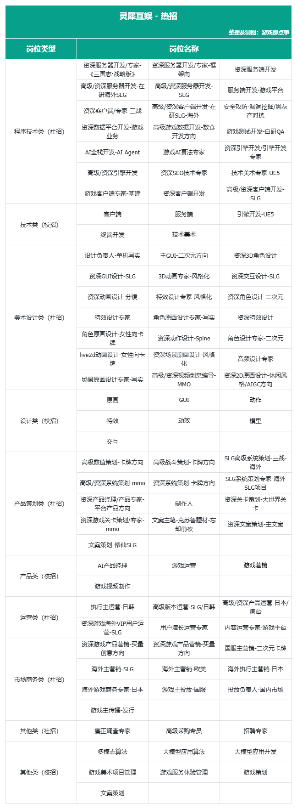

（上下滑动查看）

社会招聘网址：https://talent.lingxigames.com/off-campus/position-list?lang=zh

校园招聘网址：https://talent.lingxigames.com/campus/home?lang=zh

38.诗悦网络

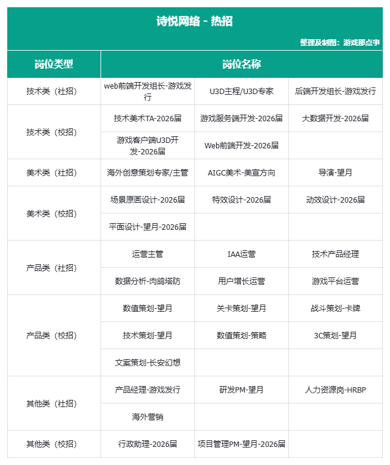

诗悦网络代表作《长安幻想》《永远的蔚蓝星球》等，在研新品二次元开放世界《望月》，涵盖回合制卡牌与策略类玩法。春招以技术、美术和产品类岗位为主，覆盖客户端开发、服务端、3D美术及运营岗位。

社会招聘网址：https://app.mokahr.com/social-recruitment/shiyuehr/72054\#/

校园招聘网址：https://campus.shiyue.com/\#/

39.银之心

银之心代表作《龙息神寂》等，在研新品《粒粒的小人国》，覆盖卡牌与模拟经营。热招岗位涵盖策划、美术、技术岗位，方向多样，偏重技术与创意核心人才。

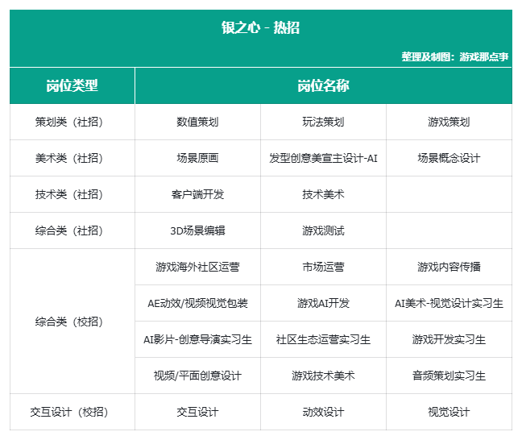

社会招聘网站：https://app-tc.mokahr.com/social-recruitment/sgra/20016\#/

校园招聘网站：https://app-tc.mokahr.com/campus-recruitment/sgra/20017\#/

40.创梦天地

创梦天地代表作《卡拉彼丘》《水果忍者》等，覆盖休闲益智与二次元射击等品类。热招岗位涵盖多方向，包括AI、策划、美术、运营及设计实习岗位，岗位类型多样，偏重研发与创意岗位。

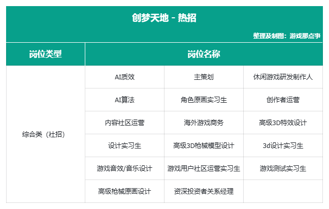

社会招聘网址：https://idreamsky.jobs.feishu.cn/campus/position/list

校园招聘网址：https://idreamsky.jobs.feishu.cn/index

41.易幻网络

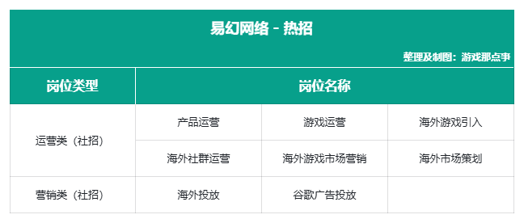

易幻网络代表作《食物语》为女性向养成。热招岗位以运营类为主，覆盖国内外游戏运营、市场及广告投放。

社会招聘网站：https://www.efun.com/join/recruitment?sign=publish

校园招聘网站：http://www.efun.com/join/recruitmentPc/campus

42.禅游科技

禅游科技代表作《指尖四川麻将》《禅游斗地主》等，覆盖棋牌与休闲类。热招岗位包括运营、产品及综合类，岗位方向多样且细分，招聘重心偏向核心岗位与经验型人才。

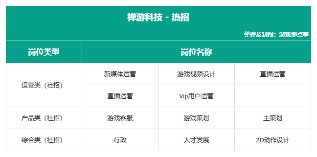

社会招聘网站：https://zen-game.jobs.feishu.cn/index/?spread=3XY41Z4

43.贪玩游戏

贪玩游戏代表作《贪玩蓝月》等，主打传奇与角色扮演类。热招岗位覆盖综合类方向，涵盖产品运营、广告投放、主播及视频设计等，岗位类型多样且聚焦运营与内容创意人才。

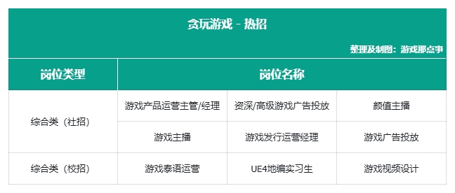

社会招聘网站：https://lx3qcyzne8.jobs.feishu.cn/index/position/list

校园招聘网站：https://lx3qcyzne8.jobs.feishu.cn/237135/position/list

44.冰川网络

冰川网络代表作《X-hero》《远征》《龙舞》系列等，覆盖休闲策略与MMO类。热招岗位覆盖技术、美术、策划及运营类，岗位方向多样且细分，招聘重心偏向核心岗位与经验型人才。

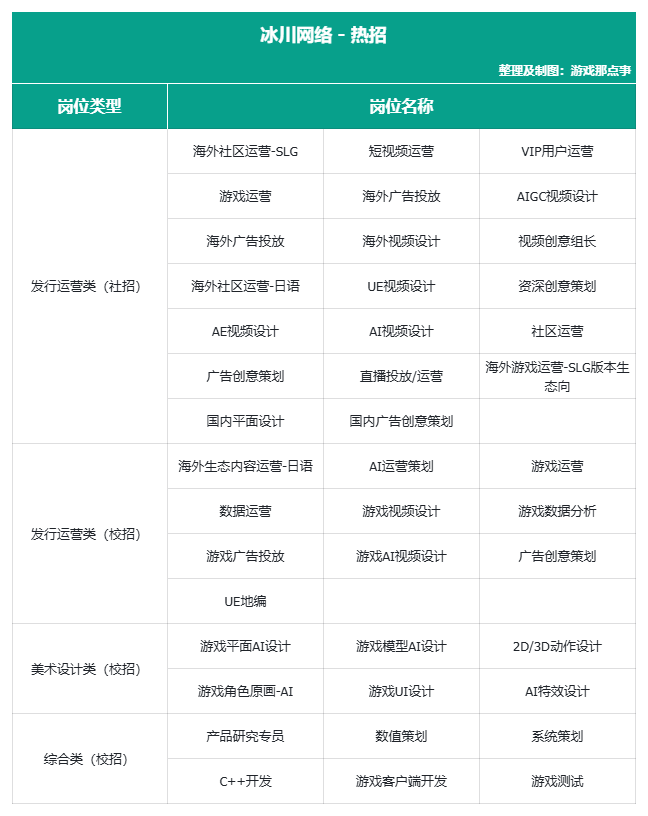

（上下滑动查看）

社会招聘网址：https://bingchuan1.zhiye.com/social/jobs

校园招聘网址：https://bingchuan1.zhiye.com/campus/jobs

45.星辉游戏

星辉游戏代表作《三国群英传》《仙境传说：破晓》等，覆盖策略与RPG类。热招岗位覆盖技术、美术、策划及运营类，岗位方向多样且细分，招聘重心偏向核心岗位与经验型人才。

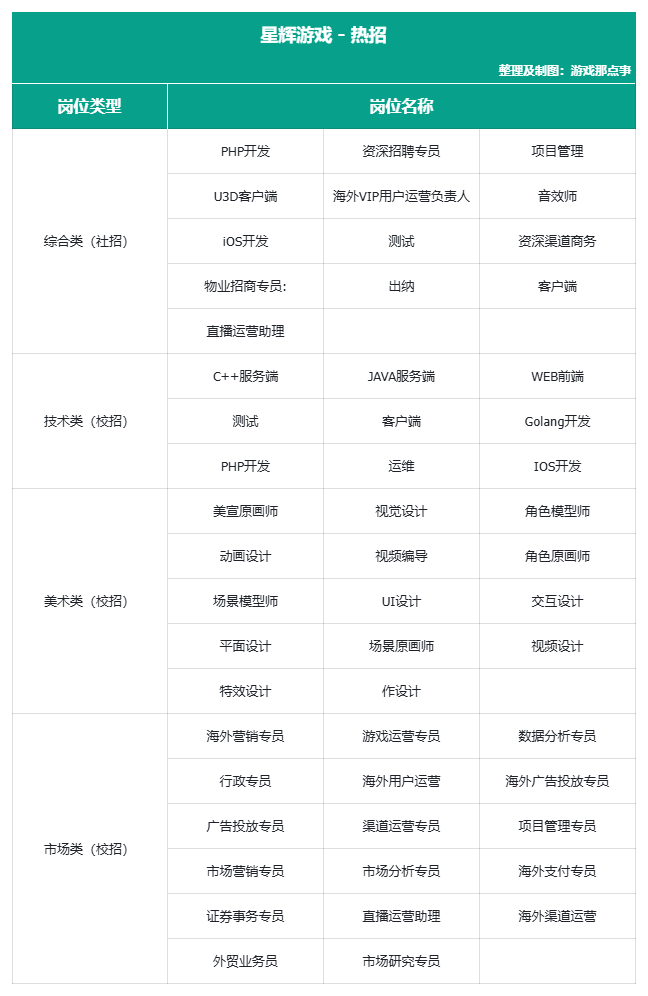

（上下滑动查看）

社会招聘网址：https://app.mokahr.com/social-recruitment/rastar/96228\#/jobs

校园招聘网址：https://app.mokahr.com/campus-recruitment/rastar/96229\#/jobs

46.大梦龙途

大梦龙途代表作《无限轮回》《正中靶心》等，覆盖肉鸽与休闲等品类。热招岗位涵盖策划、程序等方向，包括系统策划、客户端开发及C++开发，岗位类型多样，偏重研发与策划核心岗位。

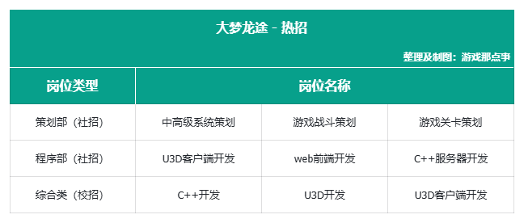

社会招聘网站：https://app.mokahr.com/apply/damenglongtu/36327\#/

校园招聘网站：https://app.mokahr.com/campus-recruitment/damenglongtu/36328\#/

47.广州星嘉

广州星嘉代表作《最强祖师》《爱琳诗篇》等，覆盖策略与RPG等品类。热招岗位涵盖美术、策划方向，包括UI设计、系统策划、数值策划及社区运营，岗位类型多样，偏重美术与策划核心岗位。

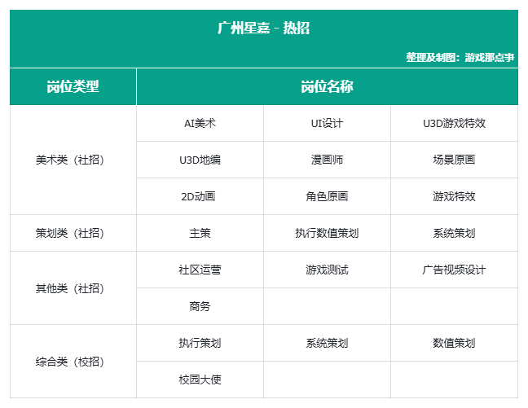

社会招聘网站：https://app.mokahr.com/social-recruitment/xingjia/148964?locale=zh-CN\#/

校园招聘网站：https://app.mokahr.com/campus-recruitment/xingjia/69900?locale=zh-CN\#/

48.延趣游戏

延趣游戏代表作《叫我大掌柜》《寻道大千》等，覆盖模拟经营与放置修仙类游戏。热招岗位涵盖美术、设计、策划、技术及产品类方向，岗位类型多样，偏重美术与策划核心人才。

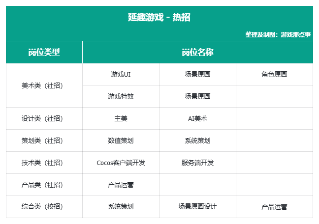

社会招聘网站：https://app.mokahr.com/social-recruitment/xmyanquhr/74332\#/

校园招聘网站：https://app.mokahr.com/campus-recruitment/xmyanquhr/74333\#/

49.边锋网络

边锋网络代表作《边锋掼蛋》《侠客风云传》等，覆盖休闲与RPG类。热招岗位较少且细分，招聘重心偏向运营与经验型人才。

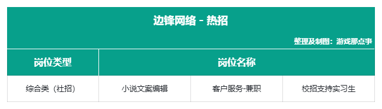

社会招聘网站：https://app.mokahr.com/social-recruitment/bianfeng/47489\#/jobs

50.灵感互娱

灵感互娱代表作《Pop Island》《Tongits Go》等，覆盖休闲与棋牌类。热招岗位覆盖技术、美术、策划及运营类，岗位方向多样且细分，招聘重心偏向核心岗位与经验型人才。

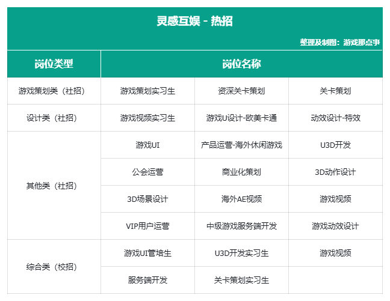

社会招聘网站：https://app.mokahr.com/social-recruitment/inspiregames/144680\#/jobs?commitment%5B0%5D=%E5%85%A8%E8%81%8C&page=1&anchorName=jobsList

校园招聘网站：https://app.mokahr.com/social-recruitment/inspiregames/144680\#/jobs?page=1&anchorName=jobsList&commitment%5B0%5D=%E5%AE%9E%E4%B9%A0

51.天纵游戏

天纵游戏代表作《幻灵修仙传》《三国大冒险》等，覆盖仙侠与三国类。热招岗位覆盖策划、美术及运营类，岗位方向多样且细分，招聘重心偏向核心岗位与经验型人才。

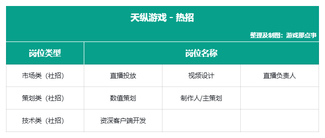

社会招聘网站：https://app.mokahr.com/social-recruitment/tianzongyouxi/141510?locale=zh-CN\#/

52.点触科技

点触科技代表作《我在大清当皇帝》《英勇之地》等，覆盖历史与生存品类。热招岗位包括技术、美术、策划及运营类，岗位方向多样且细分，招聘重心偏向核心岗位与经验型人才。

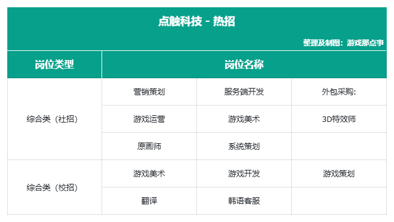

社会招聘网址：https://zhaopin.dianchu.com/RecruitmentSocial

校园招聘网址：https://zhaopin.dianchu.com/CampusRecruitment

53.河马游戏

河马游戏代表作《火枪英雄》《决斗火柴人》等，覆盖休闲与棋类等品类。热招岗位涵盖技术、产品、设计及其他方向，岗位类型多样，偏重研发与运营岗位。

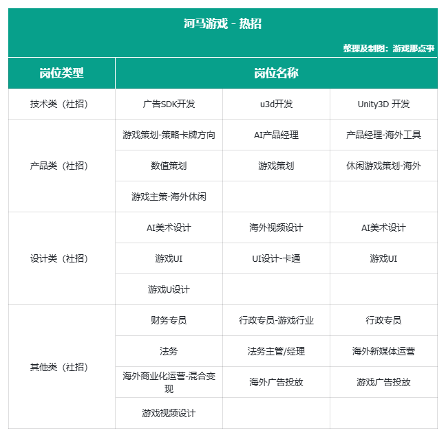

招聘网站：https://www.zhipin.com/gongsi/job/7acb7aae86d7a7331n1929S1FQ~~.html?ka=company-jobs

54.高图游戏

高图游戏代表作《Bloodline: Heroes of Lithas》《War and Magic》等，主打策略与SLG品类。热招岗位覆盖技术、美术、策划及运营类，岗位方向多样且细分，招聘重心偏向核心岗位与经验型人才。

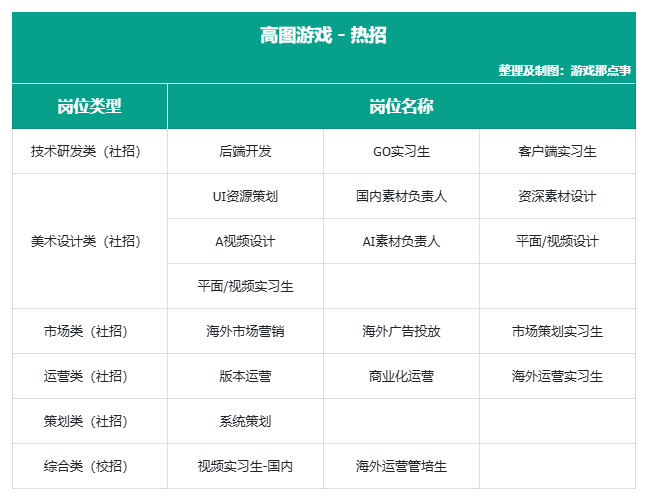

社会招聘网站：https://hr.goatgames.com/social.html\#

校园招聘网站：https://hr.goatgames.com/campus.html\#

55.小丑鱼

小丑鱼代表作《剑雨逍遥》《风云2》等，覆盖MMORPG与武侠类。热招岗位包括技术、美术及策划类，岗位方向多样且细分，招聘重心偏向核心岗位与经验型人才。

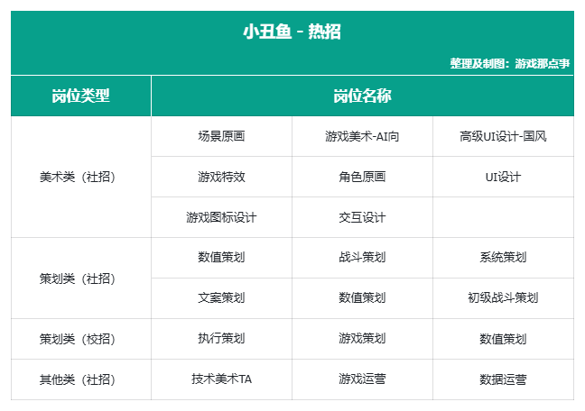

社会招聘网站：https://hr.gznemo.com/recruit

校园招聘网站：https://xz.gznemo.com/

56.尚游游戏

尚游游戏代表作《霓虹深渊：无限》《无悔华夏》等，覆盖策略与SLG类。热招岗位包含技术、产品、策划及运营类，岗位方向多样且细分，招聘重心偏向核心岗位与经验型人才。

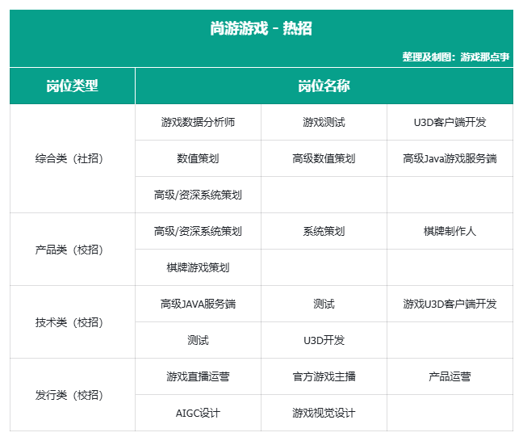

社会招聘网站：https://app.mokahr.com/social-recruitment/shangyou/42165\#/

校园招聘网站：https://app.mokahr.com/campus-recruitment/shangyou/36582\#/

57.火羽科技

火羽科技代表作《凤凰心计》《璀璨女王》等，覆盖女性向与换装品类。热招岗位包括AI及市场类，方向包括Agent架构师、AI训练师、AI策划、市场投放及运营，岗位类型多样且聚焦核心技术与运营人才。

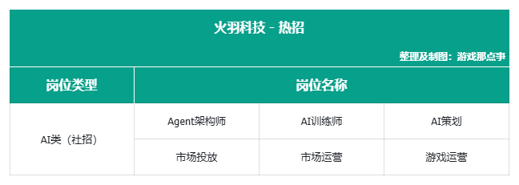

社会招聘网站：https://society.huoyugame.com/

58.卓动科技

卓动科技代表作《我的休闲时光》《一念逍遥》等，覆盖割草与放置类修仙。热招岗位包括市场类及其他综合类方向，包括海外市场策划、广告投放、财务及产品管理等，岗位类型多样且偏重核心运营与财务人才。

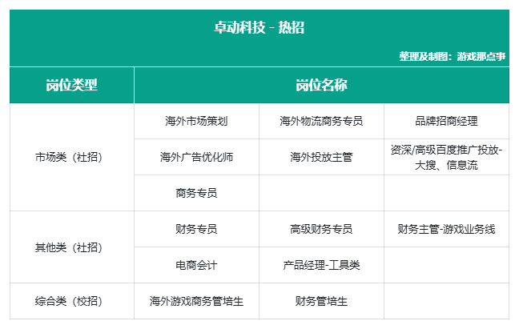

社会招聘网站：https://www.jodoinc.com/job\#jobs

校园招聘网站：https://www.jodoinc.com/job/campus

59.9377

9377代表作《烈焰》《雷霆之怒》等，覆盖传奇与MMO类游戏。热招岗位涵盖综合类与策划类方向，包括会计、广告投放、数值与战斗策划、国内游戏运营及视频设计，岗位类型多样且注重运营与策划核心岗位。

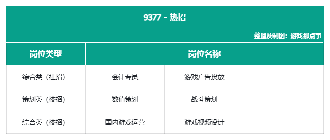

社会招聘网站：https://9377.zhiye.com/social/jobs

校园招聘网站：https://9377.zhiye.com/campus/jobs

60.永星互动

永星互动代表作《白夜极光》等，在研新品《Project Spirits》，覆盖二次元战棋类。热招岗位涵盖美术、研发方向，包括3D场景与美术、特效、项目管理及客户端开发，岗位类型多样且重心偏向美术与技术核心岗位。

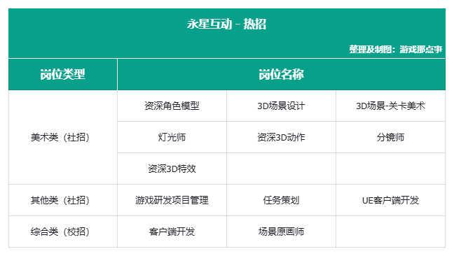

社会招聘网站：https://app-tc.mokahr.com/social-recruitment/h3d/16051\#/

校园招聘网站：https://app-tc.mokahr.com/campus-recruitment/h3d/20007\#/

61.益世界

益世界代表作《这城有良田》等，覆盖模拟经营类型。热招岗位包含产品引入、海外及国内运营、客服及C++开发，岗位类型多样，偏重运营与技术岗位。

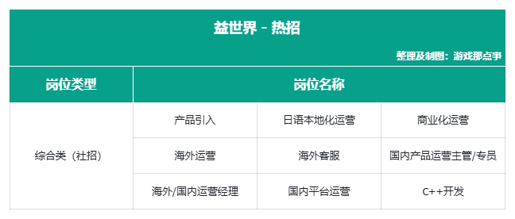

社会招聘网站：https://ewan.zhiye.com/social/jobs

62.百奥游戏

百奥代表作《食物语》《奥拉星》等，覆盖女性向RPG与角色扮演。热招岗位涵盖美术、策划及其他方向，岗位类型多样，偏重美术与策划核心岗位。

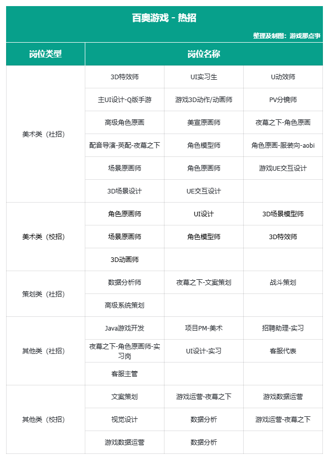

（上下滑动查看）

社会招聘网站：https://app.mokahr.com/apply/aobi/25015\#/?anchorName=default\_joblist&sourceToken=

校园招聘网站：https://app.mokahr.com/campus\_apply/aobi/25016\#/

63.多益网络

多益网络代表作《幻唐志：逍遥外传》《梦想世界》等，覆盖MMO与回合制。热招岗位涵盖策划、程序、职能、艺术岗位，岗位类型多样，偏重研发与策划核心岗位。

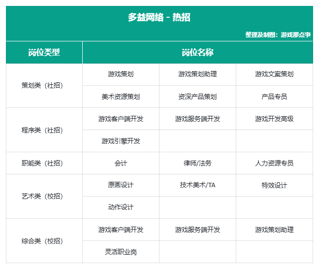

社会招聘网站：https://sz.duoyi.com/v40/sz-index.html\#/

校园招聘网站：https://xz.duoyi.com/v40/\#/

64.乐牛游戏

乐牛游戏代表作《神火大陆》《九灵神域》等，覆盖策略与RPG放置。热招岗位涵盖游戏客户端、PC开发及海外客服，偏重技术与运营岗位。

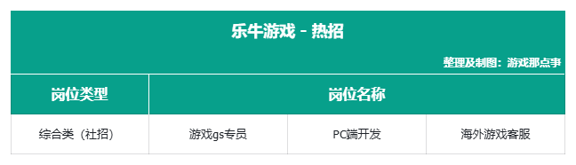

社会招聘网站：https://app.mokahr.com/apply/leniu/36040\#/

校园招聘网站：https://campus.leniu.com/

65.胡莱游戏

胡莱游戏代表作《胡莱三国》《全民斩仙2》等，覆盖三国策略与二次元卡牌。热招岗位涵盖市场、设计及运营类方向，岗位类型多样，偏重运营与市场岗位。

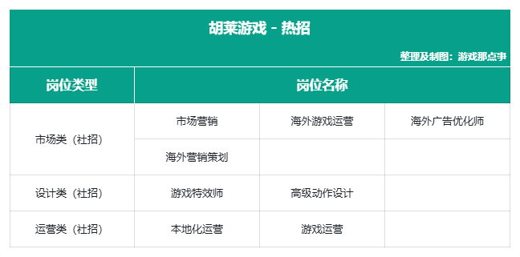

社会招聘网站：https://www.hoolai.com/join/

66.望尘科技

望尘科技代表作《NBA篮球大师》《最佳球会》等，覆盖体育类游戏。热招岗位涵盖策划、美术、市场、研发方向，岗位类型多样，偏重策划与技术核心岗位。

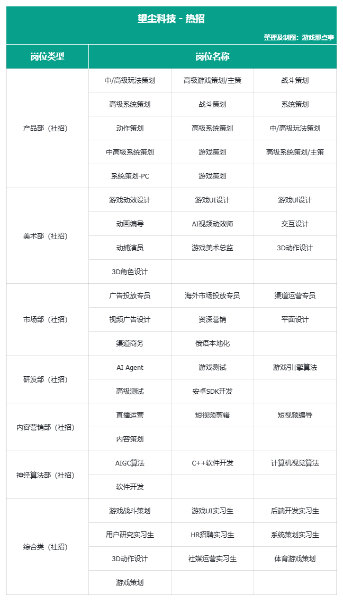

（上下滑动查看）

社会招聘网站：https://app.mokahr.com/social-recruitment/galasports/98033\#/

67.君海游戏

君海网络代表作《蚁族崛起》《九州异兽记》等，覆盖战争策略与角色扮演养成等。热招岗位涵盖海外运营、广告投放、数值策划及3D建模，岗位类型多样，偏重运营与技术岗位。

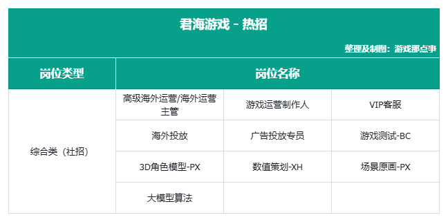

社会招聘网址：https://jhzp.zhiye.com/social/jobs

68.乐享元游

乐享元游代表作《青云诀》《青云诀2》等，覆盖仙侠MMORPG等。热招岗位涵盖视频设计、社交运营及产品研究，岗位类型多样，偏重美术与运营岗位。

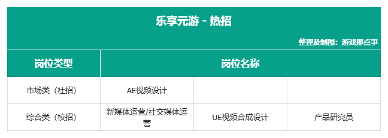

社会招聘网站：https://app.mokahr.com/social-recruitment/yyxx/118479\#/

校园招聘网站：https://app.mokahr.com/campus-recruitment/yyxx/118480\#/jobs

69.游雁网络

游雁网络代表作《仙梦奇缘》《仙侠神域》等，覆盖仙侠MMORPG等品类。热招岗位涵盖U3D客户端与系统策划等，岗位类型集中于技术与策划核心岗位。

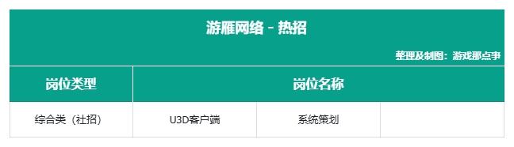

社会招聘网站：http://www.youyannet.com/about\_job.html

70.星合互娱

星合互娱代表作《小小蚁国》《野兽领主》等，覆盖SLG与动物等题材。热招岗位涵盖策划、美术、市场方向，岗位类型多样，偏重策划与美术核心岗位。

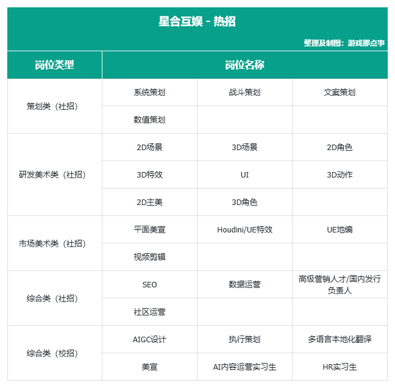

社会招聘网站：https://www.staruniongame.com/cn

校园招聘网站：/

71.玩心不止

玩心不止代表作《约战沙城》《逍遥合击》等，覆盖沙城类等品类。热招岗位涵盖运营、美术、产研等方向，岗位类型多样，偏重运营与技术岗位。

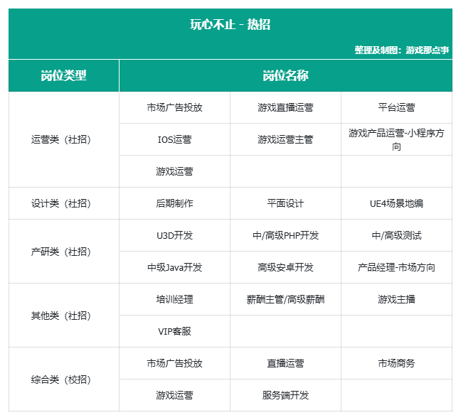

社会招聘网站：https://wanxinbuzhi.cn/join/social

校园招聘网站：https://wanxinbuzhi.cn/join/school

72.白日梦

白日梦代表作《逃跑吧少年》《蛇蛇争霸》等，覆盖非对称对抗与休闲竞技等品类。热招岗位涵盖客户端开发、渠道商务、游戏策划及测试，岗位类型多样，偏重技术与运营岗位。

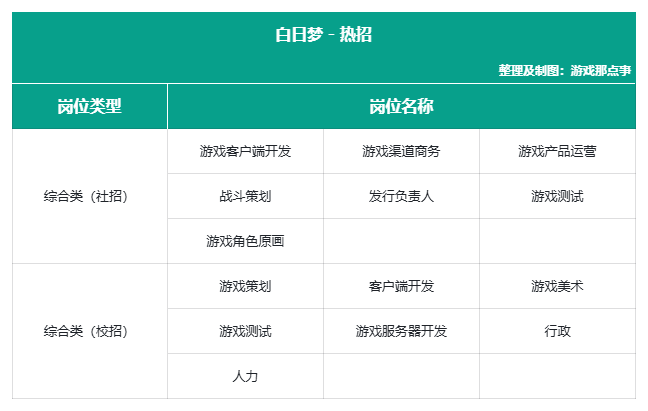

社会招聘网站：https://szbrmwlyx.jobs.feishu.cn/daydream/

校园招聘网站：https://szbrmwlyx.jobs.feishu.cn/daydreams/

73.必凡娱乐

必凡娱乐代表作《改装大作战》《庄园合合》等，覆盖休闲与模拟等。热招岗位涵盖技术、美术及开发类方向，岗位类型多样，偏重研发与创意岗位。

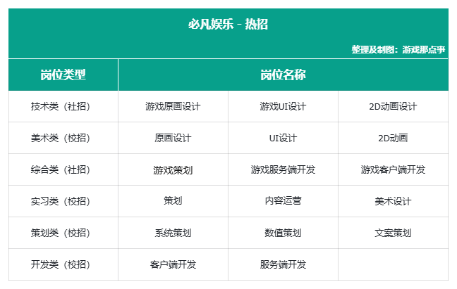

招聘网站：https://www.zhipin.com/gongsi/11a5f89b1368e82a0Hxy2tu1GA~~.html

  

05

出海厂商的集中港 

北京 

74.完美世界

完美世界代表作《异环》《幻塔》《女神异闻录夜幕魅影》等，覆盖二次元ARPG与JRPG。热招岗位涵盖综合、程序、策划及美术方向，岗位类型多样，偏重研发与策划核心岗位。

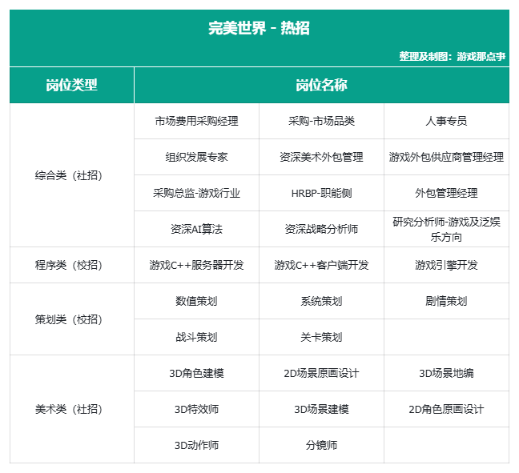

社会招聘网站：https://jobs.games.wanmei.com/society.html

校园招聘网站：https://jobs.games.wanmei.com/school.html

75.英雄游戏

英雄游戏代表作《二重螺旋》《星际 52 区》等，覆盖二次元与沙盒社交。热招岗位涵盖程序、美术、策划及运营方向，岗位类型丰富，偏重研发与策划核心岗位。

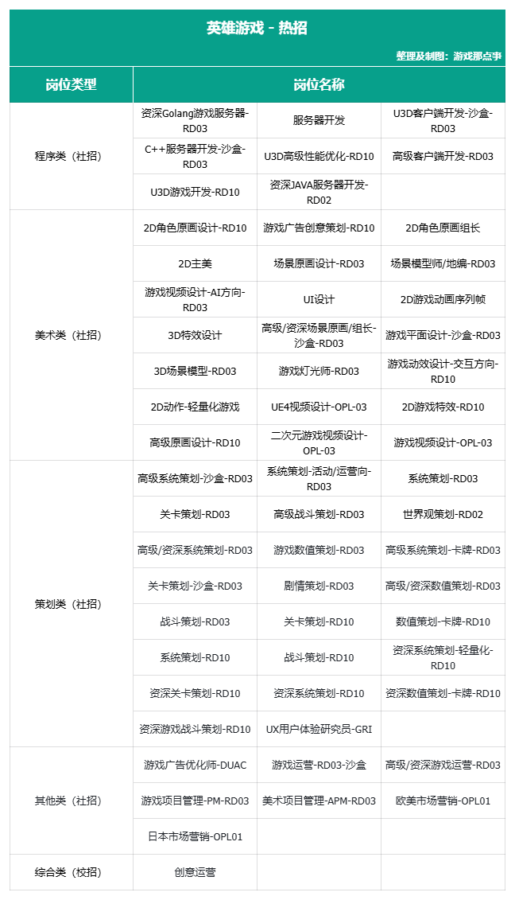

（上下滑动查看）

社会招聘网址：https://careers.hero.com/\#/

校园招聘网址：https://careers.hero.com/campus-recruitment/yingxionghr/65922\#/

76.点点互动

点点互动代表作《无尽冬日》《Kingshot》等，覆盖SLG与模拟休闲。热招岗位涵盖美术、策划、市场及技术方向，岗位类型多样，偏重研发与策划岗位。

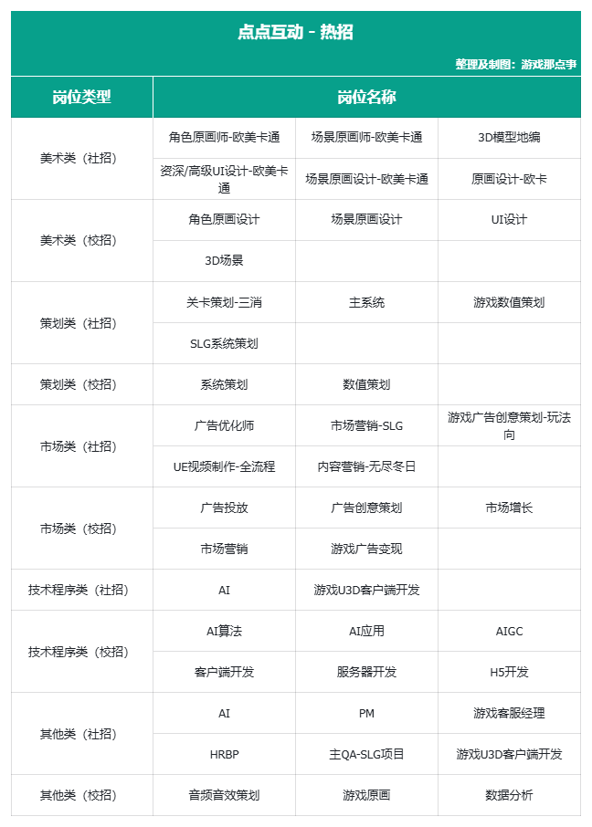

（上下滑动查看）

社会招聘网站：https://centurygame.zhiye.com/social/jobs

校园招聘网站：https://centurygame.zhiye.com/campus

77.趣加funplus

趣加funplus代表作《State of Survival》《火枪纪元》等，在研新品，覆盖SLG与解谜。热招岗位涵盖程序、美术、产品及策划方向，岗位类型多样，偏重研发与策划核心岗位。

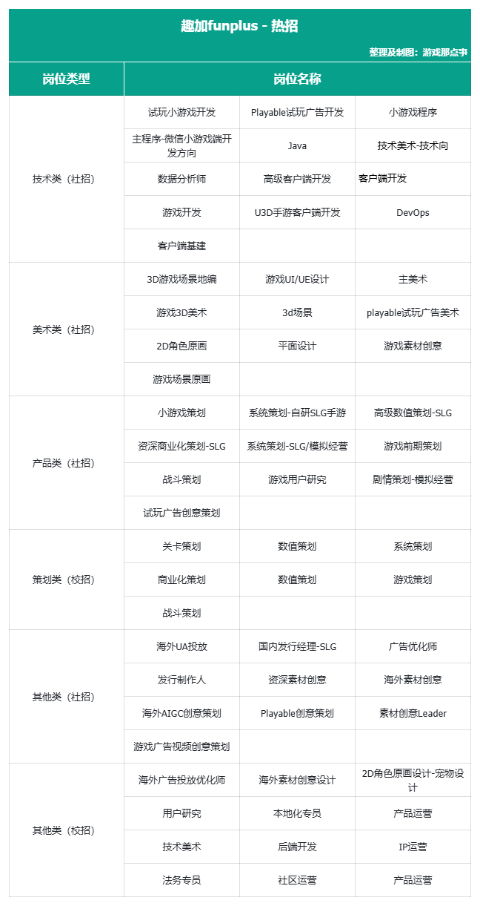

（上下滑动查看）

社会招聘网站：https://funplus01-dingtalk.mokahr.com/apply/funplus01/23961\#/jobs?zhineng=45509

校园招聘网站：https://app.mokahr.com/campus-recruitment/funplus01/147931\#/

78.快手游戏

快手游戏代表作《无尽梦回》《代号诡秘》等，覆盖Roguelite与RPG。热招岗位以综合类为主，涵盖平台运营、商业化及策划方向，岗位类型多样，偏重运营与策划岗位。

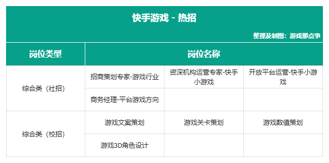

社会招聘网站：https://zhaopin.kuaishou.cn/recruit/e/\#/official/social/?workLocationCode=domestic&deptCode=D0061

校园招聘网站：https://campus.kuaishou.cn/recruit/campus/e/\#/campus/index/

79.疯狂游戏

疯狂游戏代表作《咸鱼之王》《遗弃之地》《肥鹅健身房》等，覆盖休闲与放置。热招岗位以技术和美术类为主，涵盖客户端开发、原画及开发实习方向，岗位类型精简，偏重研发岗位。

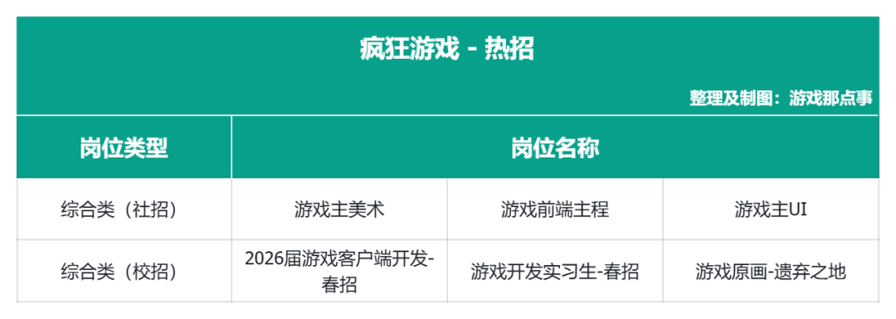

社会招聘网站：https://official-website.hortorgames.com/\#/web/list?recruitTp=social

校园招聘网站：https://official-website.hortorgames.com/\#/web/list?recruitTp=school

80.祖龙娱乐

祖龙娱乐代表作《以闪亮之名》《龙族幻想》等，覆盖女性向换装与MMORPG。热招岗位涵盖程序、美术、策划及发行方向，岗位类型多样，偏重研发与发行核心岗位。

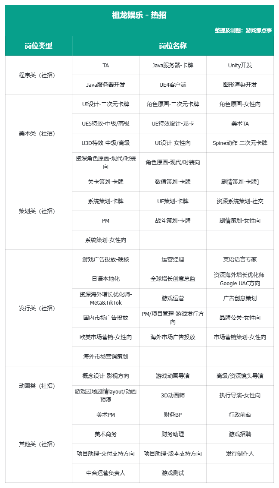

（上下滑动查看）

社会招聘网站：https://app.mokahr.com/apply/zulong/25157\#/jobs?zhineng=52732

81.智明星通

智明星通代表作《列王的纷争》《The Walking Dead: Survivors》等，主打SLG。热招岗位涵盖策划、设计、研发及运营方向，岗位类型多样，偏重策划与技术岗位。

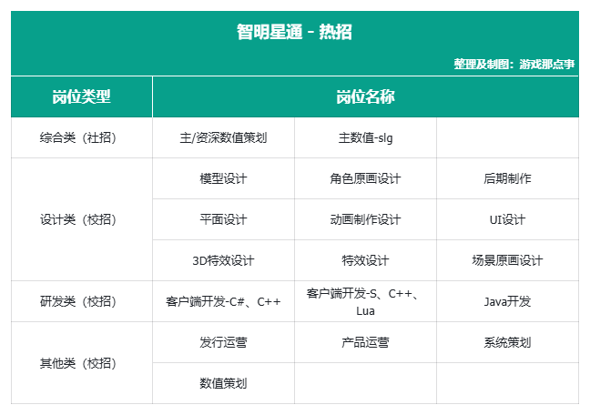

社会招聘网站：https://elex-work.jobs.feishu.cn/recruitment

校园招聘网站：https://www.elex-tech.com/campus.php

82.海彼网络

海彼网络代表作《弹壳特攻队》《弓箭传说》等，覆盖休闲肉鸽。热招岗位以综合类为主，涵盖客户端开发、策划、美术及测试方向，岗位类型多样，偏重研发岗位。

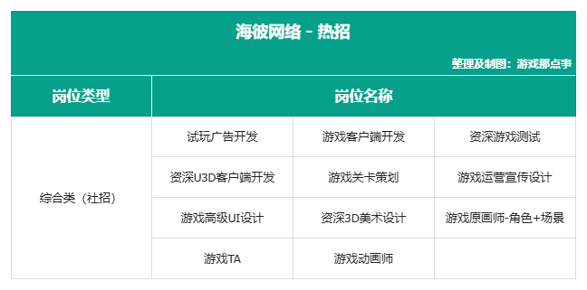

社会招聘网站：https://www.habby.cn/career

83.途游游戏

途游游戏代表作《捕鱼大作战》《欢乐钓鱼大师》等，覆盖休闲捕鱼与模拟类。热招岗位涵盖技术、美术、产品及策划方向，岗位类型多样，偏重研发与策划岗位。

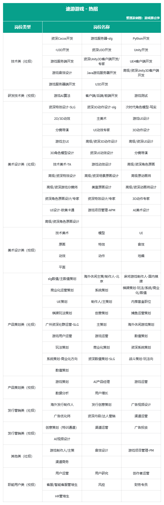

（上下滑动查看）

社会招聘网站：https://app.mokahr.com/social-recruitment/tuyoogame/73946\#/

校园招聘网站：https://app.mokahr.com/campus-recruitment/tuyoogame/71965\#/

84.壳木游戏

壳木游戏代表作《旭日之城》《战火与秩序》等，覆盖SLG与西幻策略。热招岗位以综合类为主，涵盖策划、运营、营销及客户端开发，岗位类型多样，偏重策划与运营岗位。

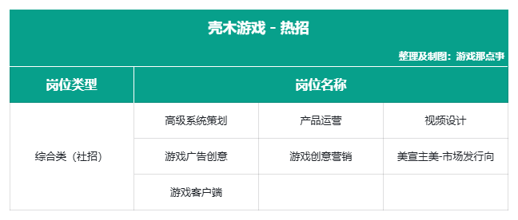

招聘网站：https://www.camelgame.cn/join-us

85.掌趣科技

掌趣科技代表作《全民奇迹》《一拳超人》等，覆盖ARPG与二次元回合制。热招岗位涵盖美术、策划、程序、游戏发行及运营方向，岗位类型多样，偏重研发与策划岗位。

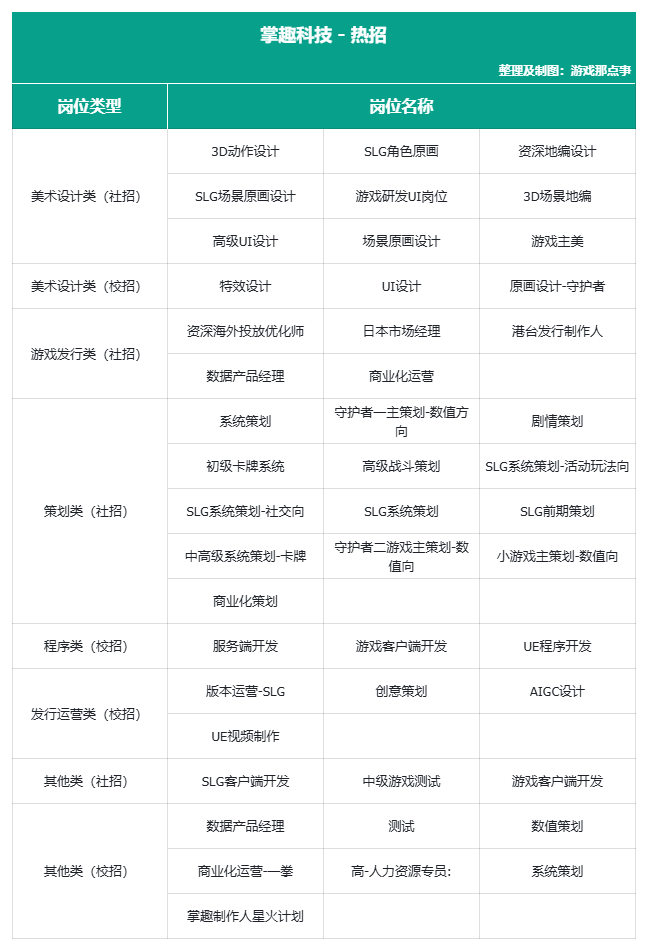

（上下滑动查看）

社会招聘网址：https://app.mokahr.com/social-recruitment/ourpalm/45614\#/

校园招聘网址：https://app.mokahr.com/campus-recruitment/ourpalm/43628\#/

86.永航科技

永航科技代表作《QQ炫舞》《白夜极光》等，覆盖舞蹈音游与二次元战棋。热招岗位涵盖美术、策划及程序方向，包括3D动作、特效、UI及客户端开发，岗位类型多样，偏重美术与技术岗位。

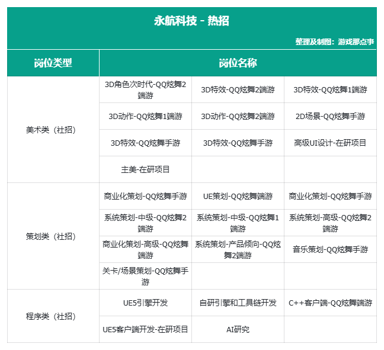

社会招聘网站：https://app.mokahr.com/social-recruitment/yhh3d/128174\#/jobs?zhineng%5B0%5D=170230

87.柠檬微趣

柠檬微趣代表作《宾果消消消》《浪漫餐厅》等，覆盖休闲消除与合并。热招岗位涵盖综合类方向，包括动画、美术及开发岗位，岗位类型多样，偏重技术与创意岗位。

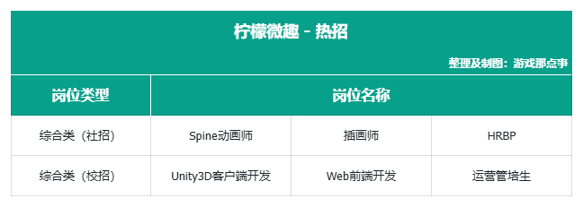

社会招聘网址：https://app.mokahr.com/apply/microfunhr/36715\#/

校园招聘网址：https://app.mokahr.com/apply/microfunhr/75944\#/

88.搜狐畅游

搜狐畅游代表作《新天龙八部端手游》《西游笔绘西行》等，覆盖MMO与卡牌。热招岗位涵盖程序开发、美术等方向，包括服务器开发、客户端开发及AI开发，岗位类型多样，偏重研发与技术岗位。

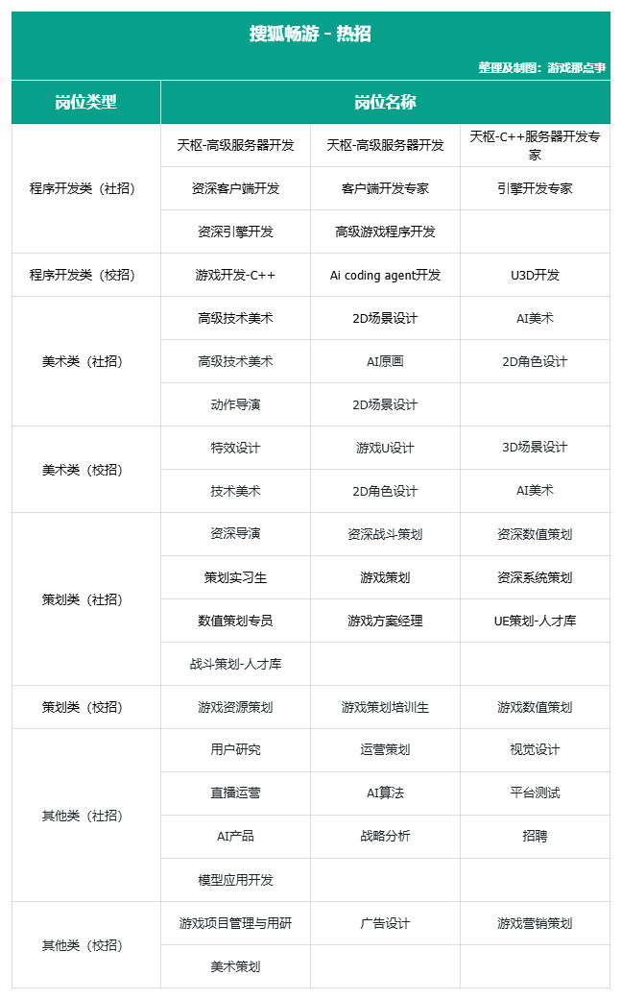

（上下滑动查看）

社会招聘网站：https://app.mokahr.com/social-recruitment/cyou-inc/42232\#/

校园招聘网站：https://app.mokahr.com/campus-recruitment/cyou-inc/42233\#/

89.江娱互动

江娱互动代表作《口袋奇兵》等，主打SLG品类。热招岗位以综合类为主，涵盖开发、策划、运营及多语种市场方向，岗位类型多样，偏重技术与运营岗位。

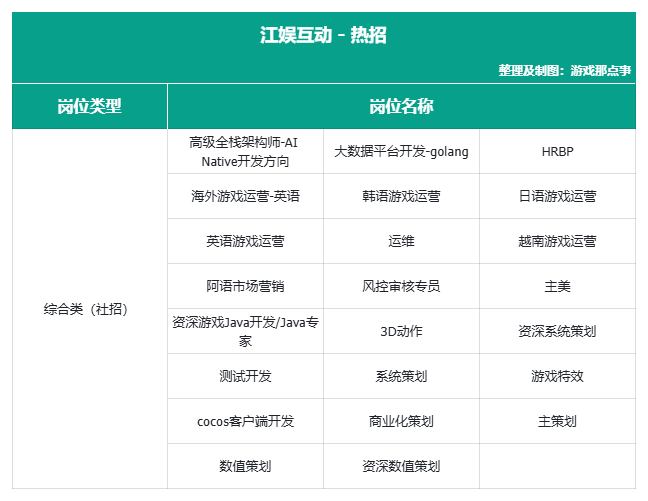

社会招聘网站：https://rivergame.jobs.feishu.cn/index

90.竞技世界

竞技世界代表作《JJ斗地主》《曙光英雄》等，覆盖休闲棋牌与MOBA竞技。热招岗位涵盖综合、美术、研发及其他方向，包括客户端开发、算法、UI设计及内容运营，岗位类型多样，偏重研发与策划岗位。

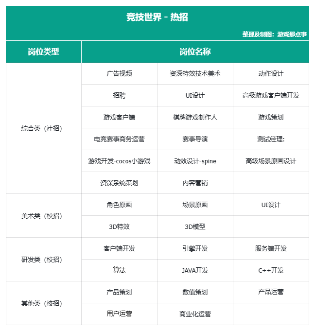

社会招聘网站：https://ihr.mis.jjmatch.cn/gateway/api/recruit-website/\#/recruit/web/project/eyJhbGciOiJIUzI1NiJ9.eyJzdWIiOiJ7XCJjb21wYW55SWRcIjpcImI0YmU0YjBiMzk5YzRkZTBhNmJmMDcwNmQ2MzY4MTMyXCIsXCJ0eXBlXCI6XCJPZmZpY2lhbFwiLFwib2ZmaWNpYWxJZFwiOjEwNTcyMDY4OTEwMzE5NTM0MDh9In0.ChVok\_RO598yvIm-RJKVQgExAbJ7aM9nh9T23E0r81I/1057235879431372800\_1/1

校园招聘网站：https://ihr.mis.jjmatch.cn/gateway/api/recruit-website/\#/recruit/web/project/eyJhbGciOiJIUzI1NiJ9.eyJzdWIiOiJ7XCJjb21wYW55SWRcIjpcImI0YmU0YjBiMzk5YzRkZTBhNmJmMDcwNmQ2MzY4MTMyXCIsXCJ0eXBlXCI6XCJPZmZpY2lhbFwiLFwib2ZmaWNpYWxJZFwiOjEwNTcyMDY4OTEwMzE5NTM0MDh9In0.ChVok\_RO598yvIm-RJKVQgExAbJ7aM9nh9T23E0r81I/1057239649527660544\_1/1

91.博乐科技

博乐科技代表作《Cash Frenzy》《Lotsa Slots》等，覆盖休闲博彩。热招岗位涵盖技术、策划及其他方向，包括客户端开发、服务器开发及广告运营岗位，岗位类型多样，偏重技术与运营岗位。

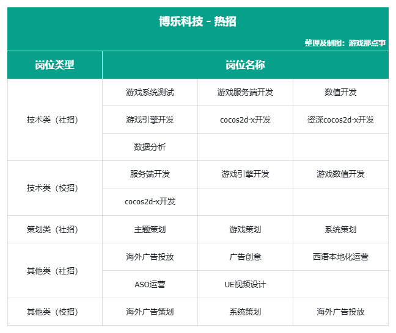

社会招聘网站：https://app.mokahr.com/apply/bolegames/37642?sourceToken=1bacbc45b883a1801c927a91a62a6d2a\#/

校园招聘网站：https://app.mokahr.com/campus-recruitment/bolegames/37643?sourceToken=1bacbc45b883a1801c927a91a62a6d2a\#/

92.云畅游戏

云畅游戏代表作《航海王：燃烧意志》《不良人3》等，覆盖MMO与卡牌RPG。热招岗位以综合类为主，涵盖战斗策划、品牌管理及运营实习，岗位类型精简，偏重策划与运营岗位。

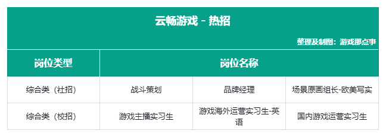

社会招聘网站：https://app.mokahr.com/apply/yunchanggame/4007\#/

校园招聘网站：https://app.mokahr.com/campus\_apply/yunchanggame/4008\#/

93.乐信圣文

乐信圣文代表作《Paint By Number》《Block Puzzle》等，覆盖填色与消除。热招岗位涵盖产品、研发、美术及其他方向，岗位类型多样，偏重研发与产品核心岗位。

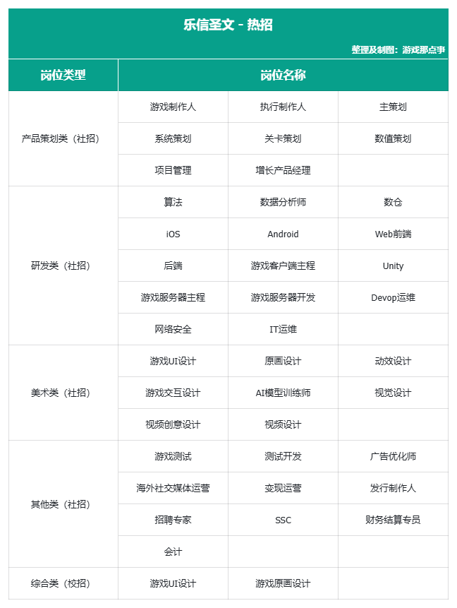

（上下滑动查看）

社会招聘网站：https://learnings.jobs.feishu.cn/index

校园招聘网站：https://learnings.jobs.feishu.cn/948023

94.大鱼竞技

大鱼竞技代表作《Bingo Party》《Bingo Wild》等，覆盖休闲宾果。热招岗位以综合类为主，涵盖UI设计、策划、开发及海外运营方向，岗位类型多样，偏重研发与运营岗位。

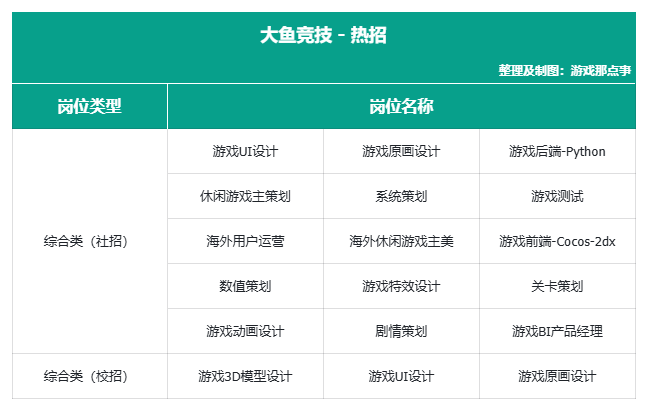

社会招聘网站：https://www.elestorm.com/society

校园招聘网站：https://www.elestorm.com/school

95.米可世界

米可世界代表作《MICO》《YoHo》等，覆盖社交平台。热招岗位涵盖运营、研发及其他方向，包括多语种海外运营、后端开发及广告优化，岗位类型多样，偏重运营与技术岗位。

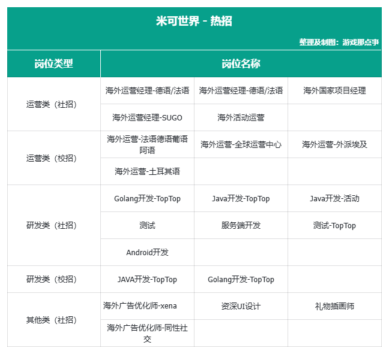

社会招聘网站：https://micoworld.jobs.feishu.cn/index

校园招聘网站：https://micoworld.jobs.feishu.cn/152087

96.汉迪移动

汉迪移动代表作《Tile Family®: Match Puzzle Game》《Sweet Camera》等，覆盖休闲消除与工具类。热招岗位涵盖产品、设计及其他方向，包括产品经理、UI设计、数据分析及海外投放，岗位类型多样，偏重产品与运营岗位。

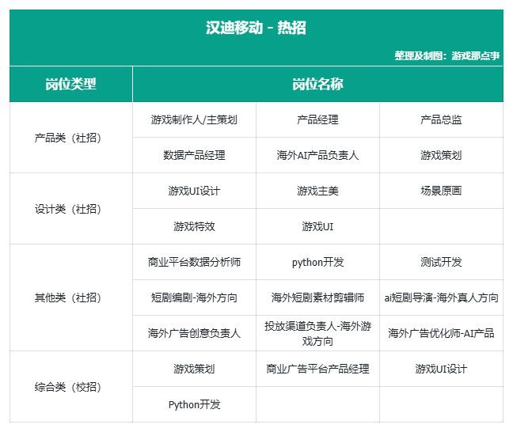

招聘网站：https://www.zhipin.com/gongsi/537f0c1a791cb7bd1nV-2925EA~~.html

97.元绎娱乐

元绎娱乐在研开放世界射击游戏《棱镜2033》。热招岗位涵盖程序、策划及美术方向，包括UE客户端开发、关卡策划及角色原画，岗位类型多样，偏重技术与美术核心岗位。

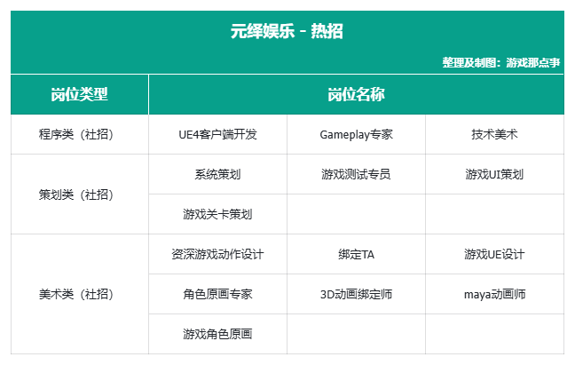

招聘网站：https://novaserene.com/site-List-6.html

98.猩球游戏

猩球游戏代表作《弹壳特攻队》《弓箭传说》等，覆盖休闲肉鸽。热招岗位涵盖技术、设计及其他方向，包括客户端开发、UI设计、数据分析及广告投放，岗位类型多样，偏重研发与运营岗位。

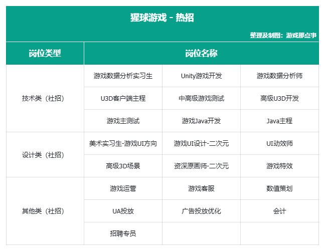

招聘网站：https://www.zhipin.com/gongsi/996d4fd2ca2f77f91nF52Nu6EVY~.html

99.SNK

SNK中国代表作《拳皇命运》《侍魂》等，覆盖动作格斗与ARPG。热招岗位以综合类为主，涵盖策划、程序、美术及海外运营方向，岗位类型多样，偏重研发与策划岗位。

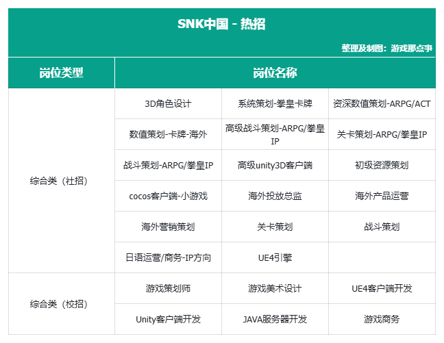

招聘网站：https://www.zhipin.com/gongsi/job/98ce20ca9daa19a733Zy3N29EA~~.html?ka=company-jobs

100.麦吉太文

麦吉太文代表作《Project Makeover》《麦吉庄园》等，覆盖消除与模拟。热招岗位涵盖美术、策划及其他方向，包括UI设计、关卡策划、数据分析及广告投放，岗位类型多样，偏重美术与策划岗位。

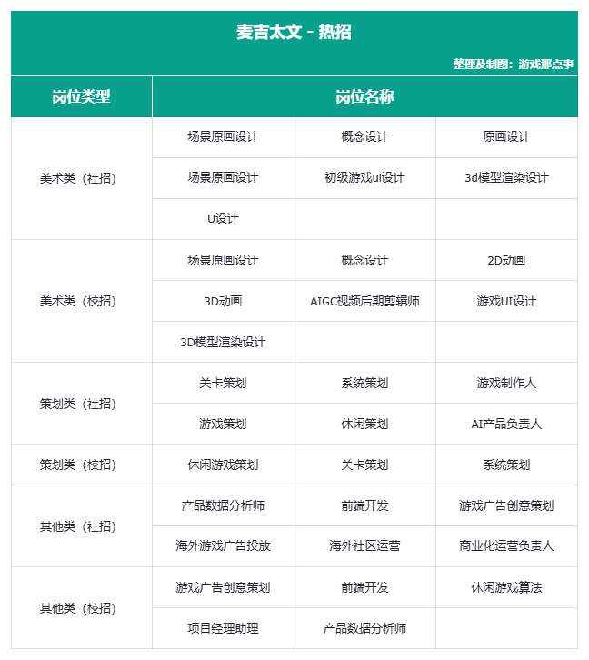

社会招聘网站：https://jobs.magictavern.com/apply/tavern/39917/\#/

校园招聘网站：https://campus.magictavern.com/joinUs\#jobs

101.MetaApp

MetaApp代表作《MetaWorld》《233小游戏》等，覆盖编辑器与平台类产品。热招岗位涵盖研发、产品、运营及其他方向，岗位类型多样，偏重技术与产品岗位。

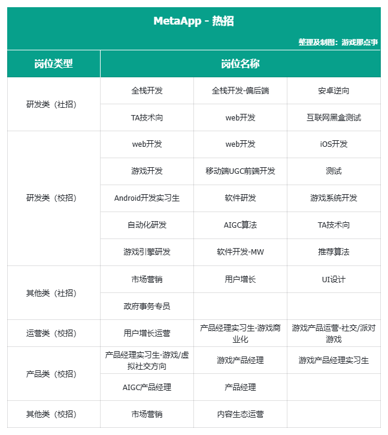

社会招聘网站：https://www.metaapp.cn/join\_my.html

校园招聘网站：https://meta.jobs.feishu.cn/140297/position/list

102.像素软件

像素软件代表作《星际理想国》《妄想山海》等，覆盖沙盒与ARPG。热招岗位涵盖程序、美术及策划方向，岗位类型多样，偏重研发与美术核心岗位。

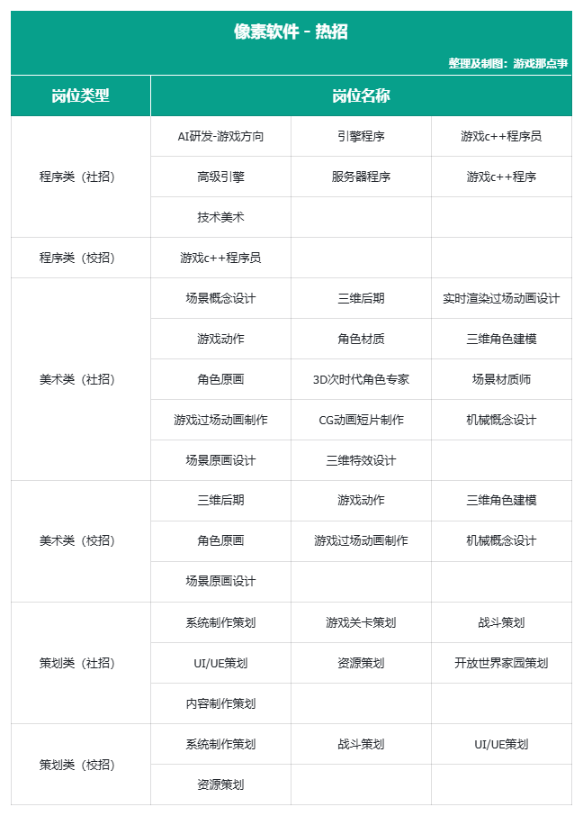

（上下滑动查看）

社会招聘网站：https://www.hotjob.cn/wt/pixelgame/web/index/social

校园招聘网站：https://www.hotjob.cn/wt/pixelgame/web/index/campus

103.红海无限

红海无限代表作《Unblock Ball》《Block Puzzle Jewel》等，覆盖益智解谜与休闲消除。热招岗位以综合类为主，涵盖产品、设计、开发及用户增长方向，岗位类型多样，偏重产品与运营岗位。

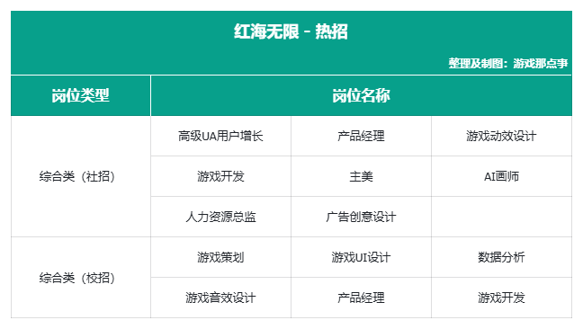

招聘网站：https://www.zhipin.com/gongsi/187d9df9a31c21800HV92968.html

  

06

坐落杭州的强研发阵地 

104.网易

网易雷火的社会招聘显示393个职位在招，校招岗位11个。其中在研项目《无限大》仍有不少的人才需求。  

社会招聘官网：https://leihuo.163.com/jobs/\#/join

校园招聘官网：https://leihuo.163.com/campus/\#/full

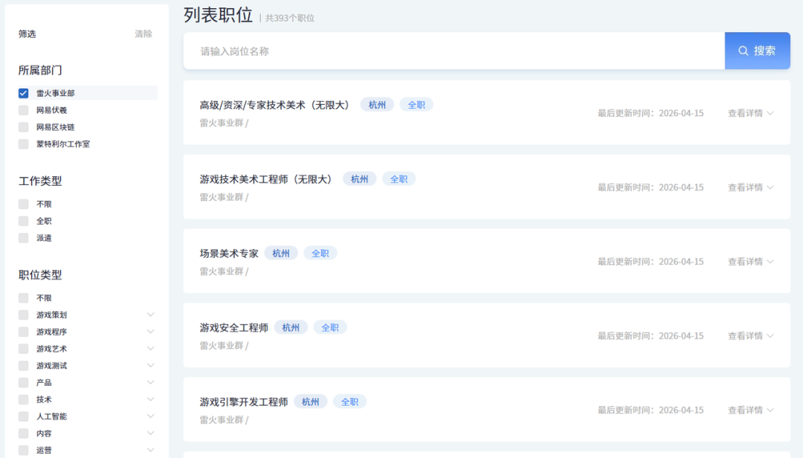

网易互娱显示有1244个岗位在招，覆盖多个主流项目及在研产品。

社会招聘官网：https://hr.163.com/job-list.html?workType=1&lang=zh

校园招聘官网：https://campus.163.com/app/index

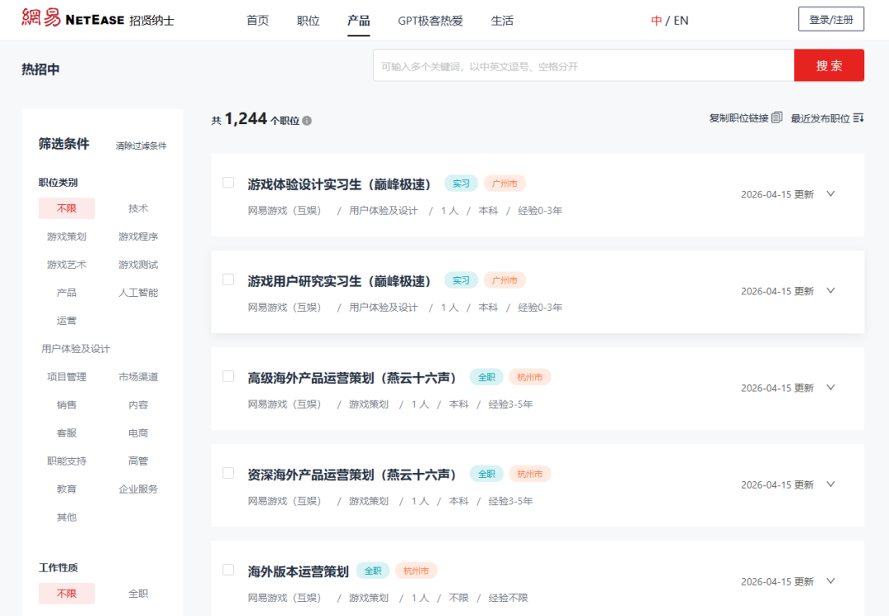

105.游戏科学

游戏科学代表作《黑神话：悟空》，在研新品《黑神话：钟馗》，覆盖ARPG。热招岗位涵盖技术、设计及综合方向，包括前后端开发、UE特效及项目管理，岗位类型精简，偏重技术核心岗位。

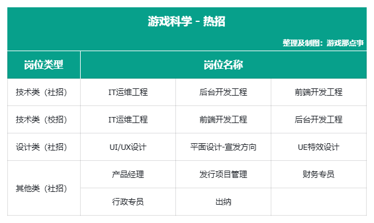

招聘网站：https://www.zhipin.com/gongsi/a1ed8da22bfd2e1b1nJ93ti0GQ~~.html

106.游卡网络

游卡网络代表作《三国杀》《自在西游》等，覆盖卡牌与RPG。热招岗位以校招为主，涵盖技术、美术、运营及产品方向，岗位类型多样，偏重运营与研发岗位。

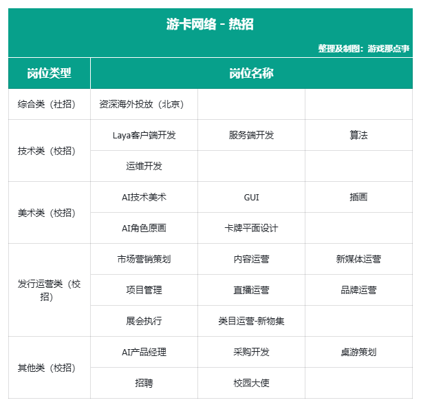

社会招聘网站：https://app.mokahr.com/social-recruitment/yokagames/41939\#/

校园招聘网站：https://app.mokahr.com/campus-recruitment/yokagames/41940\#/

107.华娱网络

华娱网络代表作《三国：谋定天下》等，覆盖SLG。热招岗位涵盖设计、策划及研发方向，包括原画、系统策划、客户端与服务器开发，岗位类型多样，偏重研发与策划核心岗位。

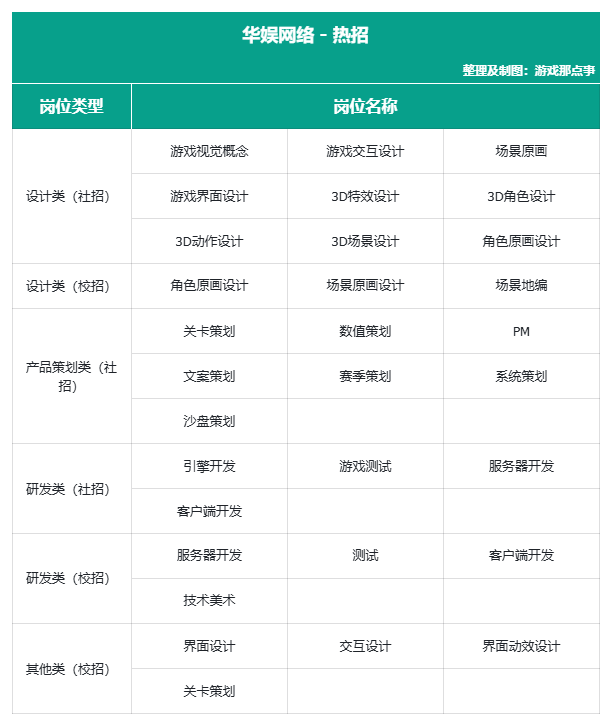

（上下滑动查看）

社会招聘网站：https://huayugames.jobs.feishu.cn/210512/position/list

校园招聘网站：https://huayugames.jobs.feishu.cn/210512/

108.电魂网络

电魂网络代表作《梦三国》《梦塔防》等，覆盖MOBA与塔防策略。热招岗位以综合类为主，涵盖策划、开发及美术方向，岗位类型多样，偏重研发与策划核心岗位。

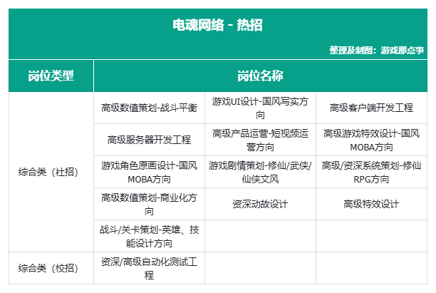

社会招聘网址：https://app.mokahr.com/social-recruitment/dianhun/55952\#/

校园招聘网址：https://app.mokahr.com/campus-recruitment/dianhun/55953\#/

109.不鸣科技

不鸣科技代表作《战意》等，覆盖沙盒动作。热招岗位涵盖研发、产品及设计方向，包括引擎开发、游戏策划、UI及3D美术，岗位类型多样，偏重技术与美术核心岗位。

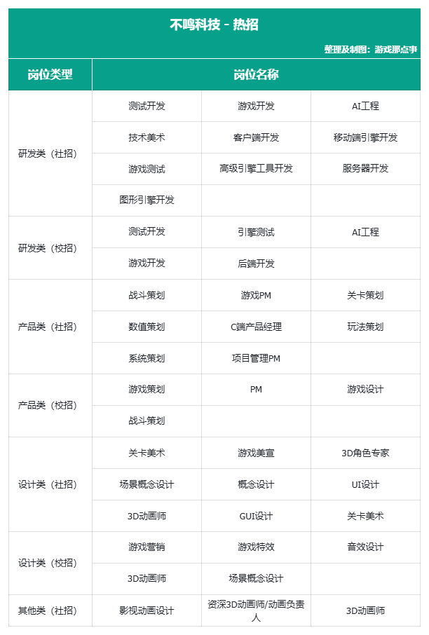

（上下滑动查看）

社会招聘网站：https://boomingtech.jobs.feishu.cn/index

校园招聘网站：https://boomingtech.jobs.feishu.cn/263245

110.炎魂网络

炎魂网络代表作《忍者必须死》等系列覆盖跑酷竞技。热招岗位以综合类为主，涵盖算法、策划、开发及技术美术方向，岗位类型多样，偏重技术与策划岗位。

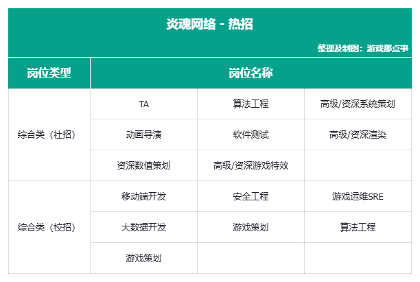

社会招聘网站：https://www.zhipin.com/gongsi/29ee398e6e9136a51HR-2Nu9.html

校园招聘网站：https://campus.pandadastudio.com/

111.畅唐网络

畅唐网络代表作《同城游》《妖豆》等，覆盖棋牌与平台类产品。热招岗位涵盖研发、产品运营及综合方向，岗位类型多样，偏重运营与技术岗位。

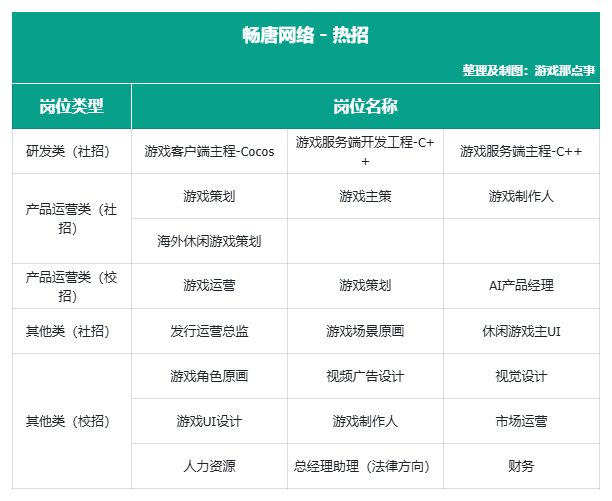

社会招聘网站：https://www.ct108.com/RecruitPost/Index

校园招聘网站：https://campus.ct108.com/\#/

112.幻书科技

幻书科技代表作有《Dungeon Hunters》《Train to Fight》等，擅长RPG、模拟经营。热招岗位涵盖技术、产品、设计及运营方向，包括客户端开发、系统策划、UI设计及游戏运营，岗位类型多样，偏重研发与产品岗位。

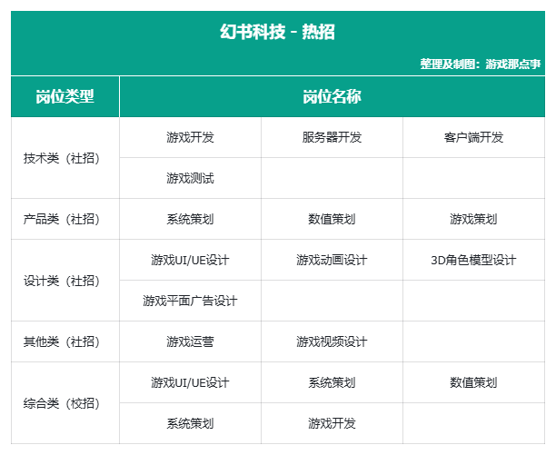

招聘网站：https://www.zhipin.com/gongsi/251f76622ada328b1nF82tW1EVI~.html

113.无端科技

无端科技代表作《生死狙击》《矩阵：零日危机》等，覆盖FPS与肉鸽射击。热招岗位涵盖技术、策划、设计及运营方向，岗位类型多样，偏重研发与策划核心岗位。

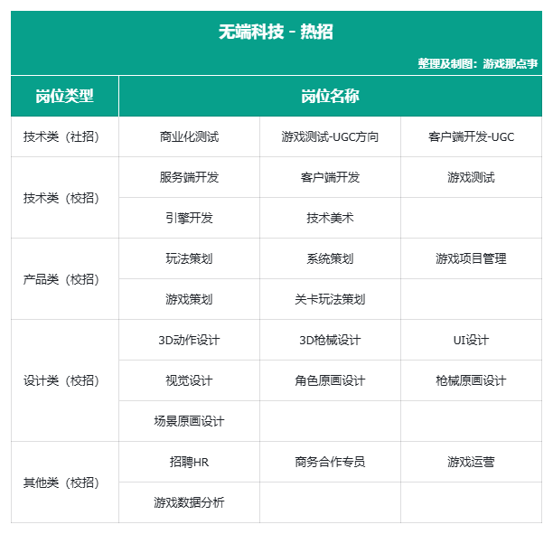

社会招聘网站：https://www.wooduan.com/

校园招聘网站：https://wooduan1.zhiye.com/campus

  

07

“怪物”新人涌现的新兴游戏圈 

114.吉比特

吉比特代表作《问道手游》《一念逍遥》等，覆盖回合制MMO与放置修仙。热招岗位涵盖美术、程序及运营方向，岗位类型多样，偏重研发与美术核心岗位。

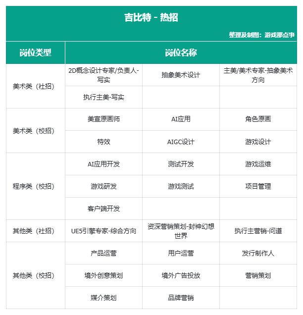

社会招聘网址：https://join.g-bits.com/

校园招聘网址：https://hr.g-bits.com/web/index.html\#/home-web/home-index

115.4399

4399代表作《冒险大作战》《文明与征服》等，覆盖放置RPG与战争策略。热招岗位涵盖技术、策划、运营及美术方向，岗位类型多样，偏重研发与策划核心岗位。

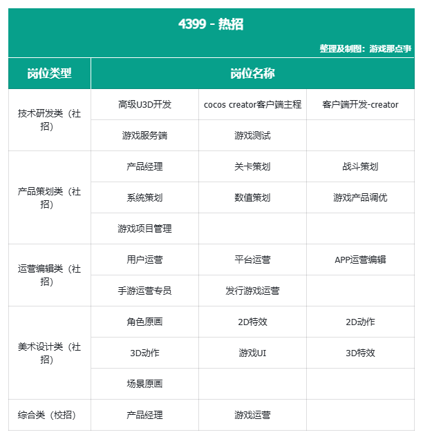

社会招聘网址：http://web.4399.com/job/social/

校园招聘网址：http://web.4399.com/campus/

116.勇仕网络

勇仕网络代表作《深空之眼》《碧蓝航线》等，覆盖二次元ARPG与舰娘。热招岗位涵盖策划与美术方向，岗位类型多样，偏重美术与策划核心岗位。

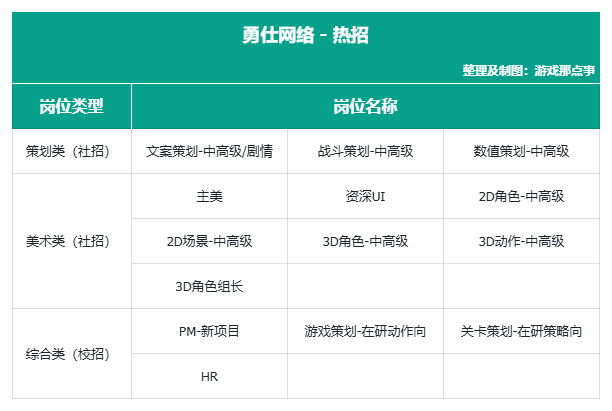

社会招聘网址：https://app.mokahr.com/social-recruitment/ys4fun/45635\#/

校园招聘网址：http://hr.ys4fun.com/campus/\#/home

117.IGG

IGG代表作《王国纪元》《时光公主》等，覆盖SLG与女性向换装。热招岗位涵盖运营、策划及综合方向，岗位类型多样，偏重策划与运营岗位。

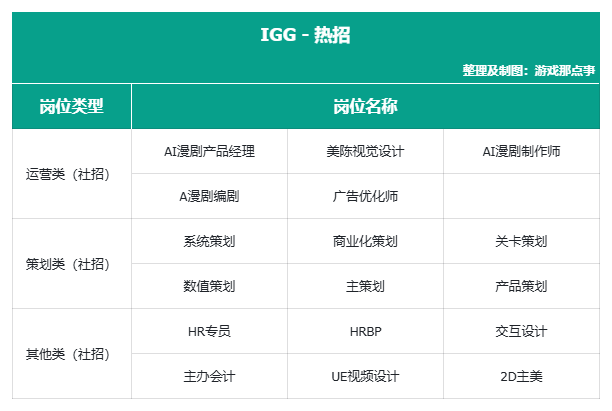

118.乐狗科技

乐狗游戏代表作《万国觉醒》《万龙觉醒》等，覆盖SLG策略。热招岗位涵盖美术、策划及运营方向，岗位类型多样，偏重策划与美术核心岗位。

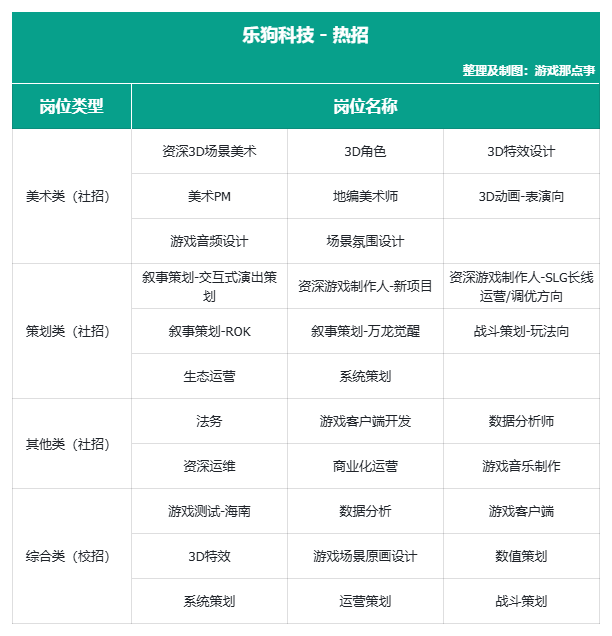

社会招聘网站：https://app.mokahr.com/apply/legougames/6162\#/

校园招聘网站：https://app.mokahr.com/campus\_apply/legougames/6163\#/

119.飞鱼科技

飞鱼科技代表作《保卫萝卜》系列、《神仙道》等，覆盖塔防与回合制。热招岗位涵盖策划、开发、设计及运营方向，岗位类型多样，偏重研发与策划核心岗位。

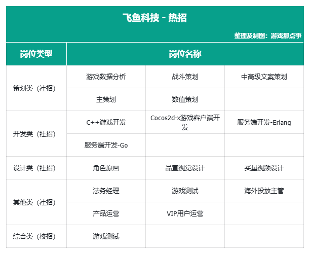

社会招聘网站：https://www.zhipin.com/gongsi/cf6b65d4b25a438403R92d4~.html

校园招聘网站：https://app.mokahr.com/campus\_apply/feiyu/142123\#/jobs?zhineng%5B0%5D=50887

120.91Act

91act代表作《苍翼默示录》《苍翼：混沌效应》等，覆盖二次元格斗。热招岗位以策划及校招为主，涵盖交互设计、动画及特效方向，岗位类型精简，偏重美术与策划岗位。

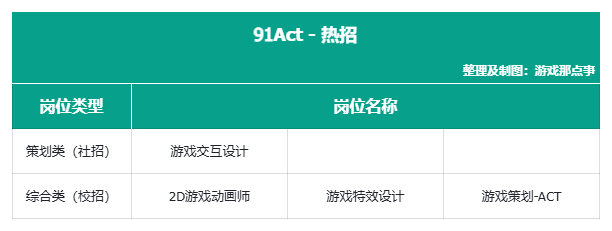

社会招聘网站：https://app.mokahr.com/social-recruitment/91act/4158\#/

校园招聘网站：https://app.mokahr.com/campus-recruitment/91act/146654\#/

121.真有趣

真有趣代表作《不休的乌拉拉》《香肠派对》等，覆盖放置休闲与TPS。热招岗位涵盖技术、策划、运营及综合方向，岗位类型多样，偏重研发与运营岗位。

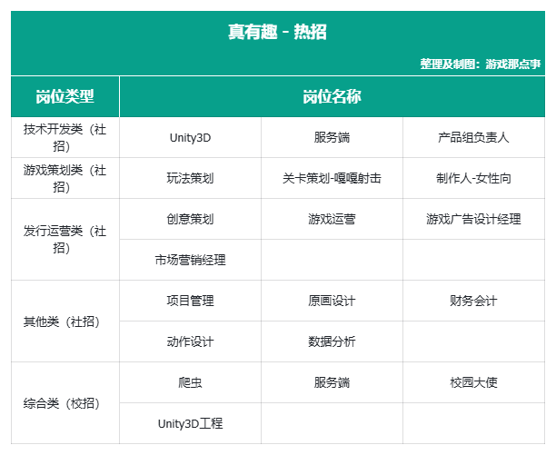

社会招聘网站：https://sofunny.jobs.feishu.cn/society

校园招聘网站：https://sofunny.jobs.feishu.cn/campus

122.微派网络

微派网络代表作《贪吃蛇大作战》《会玩》等，覆盖IO竞技与社交平台。热招岗位涵盖技术、美术、运营及其他方向，岗位类型多样，偏重运营与技术岗位。

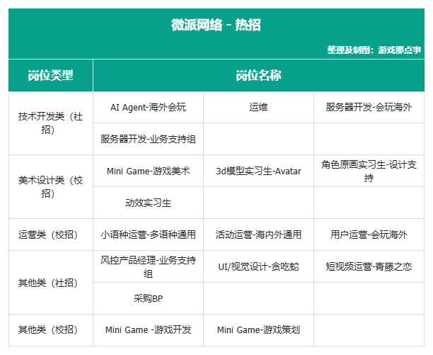

社会招聘网站：https://wepie.jobs.feishu.cn/index/position/list

校园招聘网站：https://wepie.jobs.feishu.cn/359597/position/list

123.极致游戏

极致游戏代表作《命运圣契》《上古王冠》《道友请留步》等，覆盖放置卡牌与策略。热招岗位涵盖研发、发行及综合方向，岗位类型多样，偏重策划与研发核心岗位。

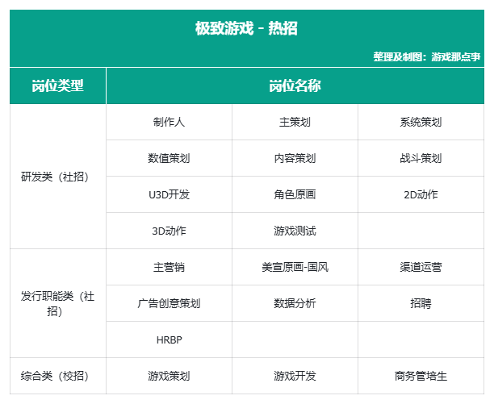

社会招聘网站：https://jzyxgames.jobs.feishu.cn/society

校园招聘网站：https://jzyxgames.jobs.feishu.cn/campus

124.梦加网络

梦加网络代表作《苏丹的游戏》《可汗的游戏》等，覆盖SLG与模拟。热招岗位以综合类为主，涵盖开发、设计及运营方向，岗位类型多样，偏重技术与运营岗位。

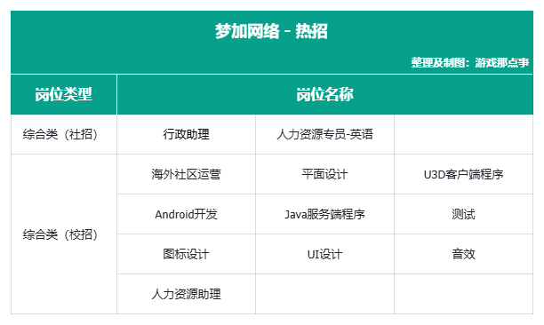

社会招聘网站：https://www.zhipin.com/gongsi/51a4eed031ae80fc1n172Ni1.html

校园招聘网站：https://xiaozhao.mjyx.com/campus-recruitment/mengjia/148137/\#/

125.数字天空

数字天空代表作《烽沙》《雄霸天下》《龙之力量》等，覆盖RPG与策略。热招岗位以综合类为主，涵盖UI设计、灯光渲染及导演等方向，岗位类型精简，偏重美术与创意岗位。

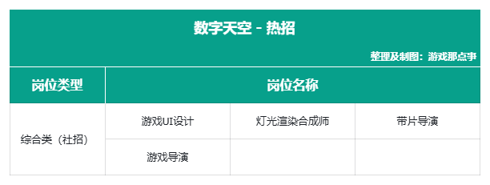

招聘网站：https://www.zhipin.com/gongsi/d39e31490e2ad8aa1XR82ty-.html

126.青瓷游戏

青瓷游戏代表作《最强蜗牛》《提灯与地下城》等，覆盖放置养成与Roguelike。热招岗位以综合类为主，涵盖特效、美术及开发方向，岗位类型精简，偏重研发与美术岗位。

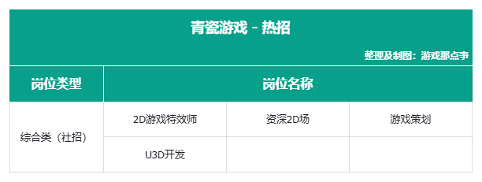

社会招聘网站：https://app.mokahr.com/apply/qingcishuma/41125\#/

127.多比特

多比特代表作《插花消消乐》《细胞幸存者》等，覆盖休闲益智。热招岗位涵盖研发、策划、产品、市场及设计方向，岗位类型多样，偏重运营与研发岗位。

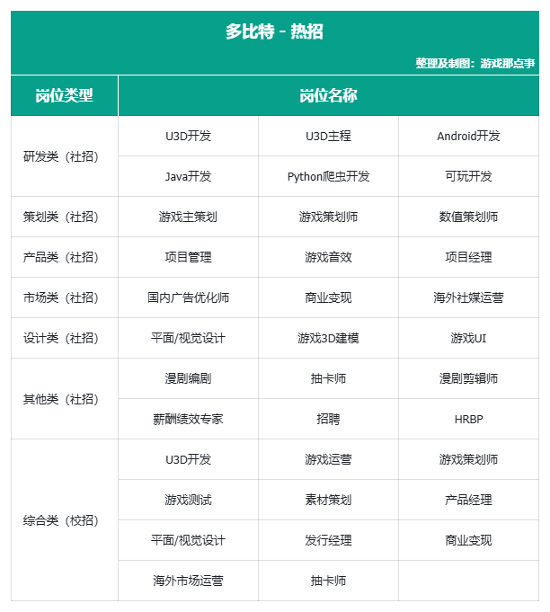

（上下滑动查看）

招聘网站：https://www.zhipin.com/gongsi/1b244e81788328241nB83t25Eg~~.html?ka=search\_rcmd\_company\_name\_1b244e81788328241nB83t25Eg~~\_custompage

128.摩多游戏

摩多游戏代表作《宫锁心计》《皇上吉祥2》等，覆盖女性向与古风模拟经营。热招岗位涵盖设计、技术、产品及运营方向，岗位类型多样，偏重运营与美术岗位。

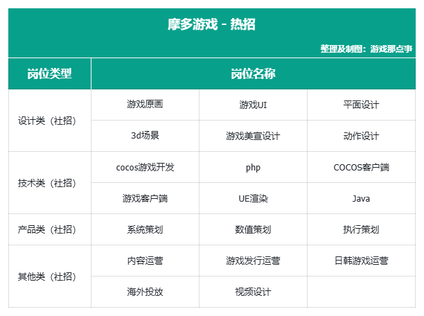

招聘网站：https://modoglobaljobs.modo.cn/index

129.天上友嘉

天上友嘉代表作《三国志威力无双》《龙珠觉醒》等，覆盖SLG与二次元卡牌。热招岗位涵盖技术、产品及设计方向，岗位类型多样，偏重研发与策划核心岗位。

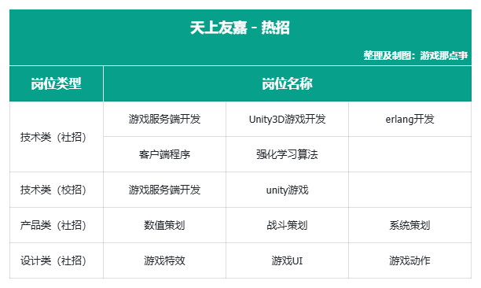

招聘网站：https://www.youkia.com/website.php/join/index

130.乐曼多

乐曼多代表作《街篮2》《街头足球》等，覆盖体育竞技。热招岗位涵盖美术、程序、运营及算法方向，岗位类型多样，偏重研发与美术核心岗位。

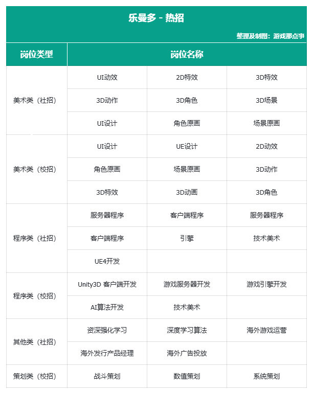

（上下滑动查看）

社会招聘网站：https://www.lmdgame.com/job/index.html

校园招聘网站：https://www.lmdgame.com/school/index.html

131.网龙网络

网龙代表作《魔域》《英魂之刃》等，覆盖MMORPG与MOBA。热招岗位以综合类为主，涵盖AI、技术支持及品牌传播方向，岗位类型多样，偏重技术与运营岗位。

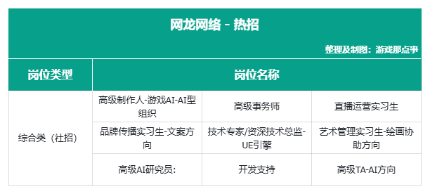

社会招聘网址：https://nd.zhiye.com/social/jobs

132.tap4fun

tap4fun代表作《战地风暴》《胜利之吻》《猿族计划》等，覆盖SLG战争与模拟。热招岗位涵盖策划、美术及技术方向，岗位类型多样，偏重策划与研发核心岗位。

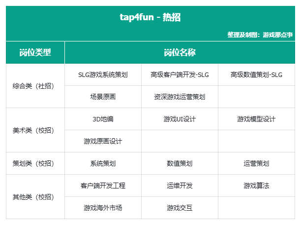

社会招聘网站：https://tap4fun.com/join-us

校园招聘网站：https://tap4fun.com/join-us

133.浩凡网络

浩凡网络代表作《大公爵》《东煌纪》等，覆盖模拟经营与策略回合制。热招岗位涵盖研发、策划及运营方向，岗位类型多样，偏重研发与策划核心岗位。

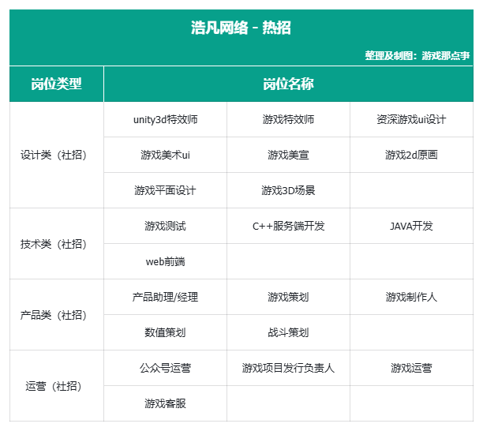

招聘网站：https://www.zhipin.com/gongsi/3bf544f39f21d9540nF\_2dq-Fg~~.html

134.掌游科技

掌游科技代表作《雷霆战神》《斗战英魂》等，覆盖传奇类。热招岗位以综合类为主，涵盖创意素材、主播及投放优化方向，岗位类型精简，偏重运营与市场岗位。

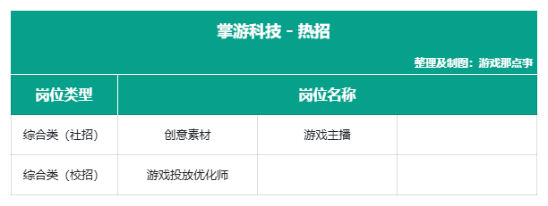

招聘网站：https://www.zhipin.com/gongsi/5fe73489f4de58150XRz3Q~~.html

135.龙渊网络

龙源网络代表作《多多自走棋》《物华弥新》等，覆盖自走棋与国风卡牌。热招岗位涵盖美术、策划、技术及运营方向，岗位类型多样，偏重美术与研发岗位。

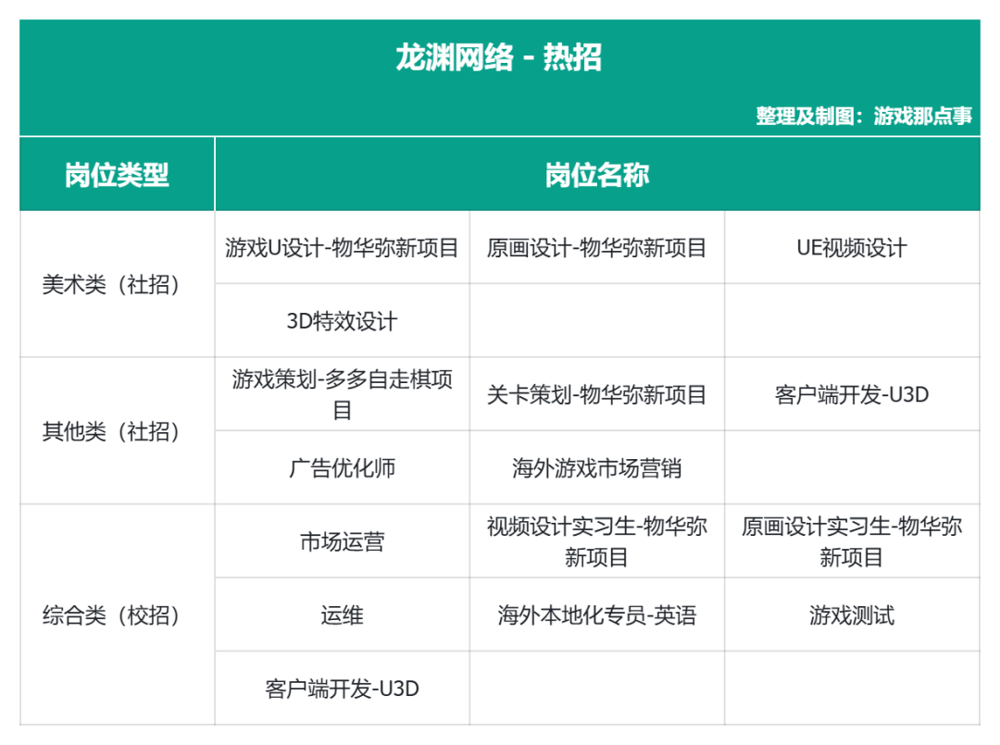

社会招聘网站：https://dragonest.com/index/socialrecruit.html

校园招聘网站：https://dragonest.com/index/campusrecruit.html

推荐阅读  

[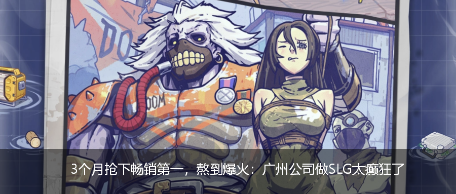](https://mp.weixin.qq.com/s?__biz=MjM5MDEwMTk2MA==&mid=2651291498&idx=1&sn=f190775db2e063fb322019478d28e793&scene=21#wechat_redirect)[重返未来1999](https://mp.weixin.qq.com/s?__biz=MjM5MDEwMTk2MA==&mid=2651291496&idx=1&sn=ab45b842187bf42963c04d528263a787&scene=21#wechat_redirect)丨[明日方舟终末地](https://mp.weixin.qq.com/s?__biz=MjM5MDEwMTk2MA==&mid=2651291458&idx=1&sn=e013f3ec305aeb6deb69ee80a54e2df4&scene=21#wechat_redirect)丨[三七互娱年报](https://mp.weixin.qq.com/s?__biz=MjM5MDEwMTk2MA==&mid=2651291338&idx=1&sn=7df55b914a441b0e0bfc778775694875&scene=21#wechat_redirect)  
[王者荣耀世界](https://mp.weixin.qq.com/s?__biz=MjM5MDEwMTk2MA==&mid=2651291317&idx=1&sn=c79476ce3cff921fb4e53345535a141c&scene=21#wechat_redirect)丨[彩虹六号攻势](https://mp.weixin.qq.com/s?__biz=MjM5MDEwMTk2MA==&mid=2651291282&idx=1&sn=9eb1ab9e7856626688f108d8d8ca8fb1&scene=21#wechat_redirect)丨[三角洲行动](https://mp.weixin.qq.com/s?__biz=MjM5MDEwMTk2MA==&mid=2651291279&idx=1&sn=a9c934a71a3d82becddd9b6c5b673399&scene=21#wechat_redirect)  
[率土之滨ai短剧](https://mp.weixin.qq.com/s?__biz=MjM5MDEwMTk2MA==&mid=2651291185&idx=1&sn=b11517a576560f90dda13e99bfd18dc1&scene=21#wechat_redirect)丨[3月中国手游榜](https://mp.weixin.qq.com/s?__biz=MjM5MDEwMTk2MA==&mid=2651291167&idx=1&sn=5f11000a306d461b806e4c9d4ab5470a&scene=21#wechat_redirect)丨[3月全球手游榜](https://mp.weixin.qq.com/s?__biz=MjM5MDEwMTk2MA==&mid=2651291185&idx=2&sn=5424a1e857a9b343a7d51b4aa3c44189&scene=21#wechat_redirect)  
推荐观看—— 点击下方公众号名片，即刻关注我们 ——

——————— Ps ———————

游戏那点事近期为游戏圈同行们开启了【新交流群】。新群专门用以日常交流、最新消息交换、圈内八卦、干货分享、和游戏唠嗑等。有兴趣一起聊聊行业的朋友可以加微信328624956或cxx2744，添加时请备注公司和职位。

——————— End ———————

行业交流 / 行业爆料 / 合作沟通 / 加交流群：

请加微信 cxx2744 或 328624956

